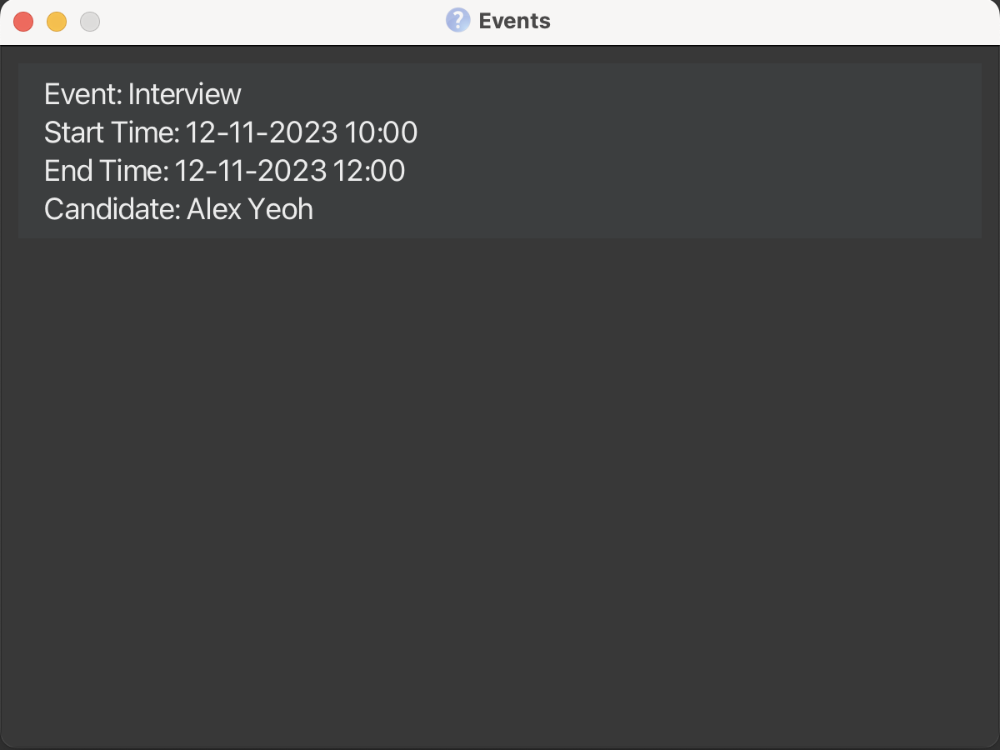

# JABPro Developer Guide

<!-- * Table of Contents -->
<page-nav-print />

--------------------------------------------------------------------------------------------------------------------

## **Acknowledgements**

This is based on the AddressBook-Level3 project created by the [SE-EDU initiative](https://se-education.org).

--------------------------------------------------------------------------------------------------------------------

## **Setting up, getting started**

Refer to the guide [_Setting up and getting started_](SettingUp.md).

--------------------------------------------------------------------------------------------------------------------

## **Design**

### Architecture

<puml src="diagrams/ArchitectureDiagram.puml" width="280" />

The ***Architecture Diagram*** given above explains the high-level design of the App.

Given below is a quick overview of main components and how they interact with each other.

**Main components of the architecture**

**`Main`** (consisting of classes [`Main`](https://github.com/se-edu/addressbook-level3/tree/master/src/main/java/seedu/address/Main.java) and [`MainApp`](https://github.com/se-edu/addressbook-level3/tree/master/src/main/java/seedu/address/MainApp.java)) is in charge of the app launch and shut down.
* At app launch, it initializes the other components in the correct sequence, and connects them up with each other.
* At shut down, it shuts down the other components and invokes cleanup methods where necessary.

The bulk of the app's work is done by the following four components:

* [**`UI`**](#ui-component): The UI of the App.
* [**`Logic`**](#logic-component): The command executor.
* [**`Model`**](#model-component): Holds the data of the App in memory.
* [**`Storage`**](#storage-component): Reads data from, and writes data to, the hard disk.

[**`Commons`**](#common-classes) represents a collection of classes used by multiple other components.

**How the architecture components interact with each other**

The *Sequence Diagram* below shows how the components interact with each other for the scenario where the user issues the command `delete 1`.

<puml src="diagrams/ArchitectureSequenceDiagram.puml" width="574" />

Each of the four main components (also shown in the diagram above),

* defines its *API* in an `interface` with the same name as the Component.
* implements its functionality using a concrete `{Component Name}Manager` class (which follows the corresponding API `interface` mentioned in the previous point.

For example, the `Logic` component defines its API in the `Logic.java` interface and implements its functionality using the `LogicManager.java` class which follows the `Logic` interface. Other components interact with a given component through its interface rather than the concrete class (reason: to prevent outside component's being coupled to the implementation of a component), as illustrated in the (partial) class diagram below.

<puml src="diagrams/ComponentManagers.puml" width="300" />

The sections below give more details of each component.

### UI component

The **API** of this component is specified in [`Ui.java`](https://github.com/se-edu/addressbook-level3/tree/master/src/main/java/seedu/address/ui/Ui.java)

<puml src="/diagrams/UiClassDiagram.puml" alt="Structure of the UI Component"/>

The UI consists of a `MainWindow` that is made up of parts e.g.`CommandBox`, `ResultDisplay`, `PersonListPanel`, `PersonInformationPanel`, `SummaryStatisticScreen` etc. All these, including the `MainWindow`, inherit from the abstract `UiPart` class which captures the commonalities between classes that represent parts of the visible GUI.
The `UI` component uses the JavaFx UI framework. The layout of these UI parts are defined in matching `.fxml` files that are in the `src/main/resources/view` folder. For example, the layout of the [`MainWindow`](https://github.com/se-edu/addressbook-level3/tree/master/src/main/java/seedu/address/ui/MainWindow.java) is specified in [`MainWindow.fxml`](https://github.com/se-edu/addressbook-level3/tree/master/src/main/resources/view/MainWindow.fxml)

The `UI` component,

* executes user commands using the `Logic` component.
* listens for changes to `Model` data so that the UI can be updated with the modified data.
* keeps a reference to the `Logic` component, because the `UI` relies on the `Logic` to execute commands.
* depends on some classes in the `Model` component, as it displays `Person` object residing in the `Model`.

### Logic component

**API** : [`Logic.java`](https://github.com/se-edu/addressbook-level3/tree/master/src/main/java/seedu/address/logic/Logic.java)

Here's a (partial) class diagram of the `Logic` component:

<puml src="diagrams/LogicClassDiagram.puml" width="550"/>

The sequence diagram below illustrates the interactions within the `Logic` component, taking `execute("delete st/interviewed t/developer")` API call as an example.

<puml src="diagrams/DeleteSequenceDiagram.puml" alt="Interactions Inside the Logic Component for the `delete 1` Command" />

<box type="info" seamless>

**Note:** The lifeline for `DeleteCommandParser` should end at the destroy marker (X) but due to a limitation of PlantUML, the lifeline reaches the end of diagram.
</box>

How the `Logic` component works:

1. When `Logic` is called upon to execute a command, it is passed to an `AddressBookParser` object which in turn creates a parser that matches the command (e.g., `DeleteCommandParser`) and uses it to parse the command.
1. This results in a `Command` object (more precisely, an object of one of its subclasses e.g., `DeleteCommand`) which is executed by the `LogicManager`.
1. The command can communicate with the `Model` when it is executed (e.g. to delete a person).
1. The result of the command execution is encapsulated as a `CommandResult` object which is returned back from `Logic`.

Here are the other classes in `Logic` (omitted from the class diagram above) that are used for parsing a user command:

<puml src="diagrams/ParserClasses.puml" width="600"/>

How the parsing works:
* When called upon to parse a user command, the `AddressBookParser` class creates an `XYZCommandParser` (`XYZ` is a placeholder for the specific command name e.g., `AddCommandParser`) which uses the other classes shown above to parse the user command and create a `XYZCommand` object (e.g., `AddCommand`) which the `AddressBookParser` returns back as a `Command` object.
* All `XYZCommandParser` classes (e.g., `AddCommandParser`, `DeleteCommandParser`, ...) inherit from the `Parser` interface so that they can be treated similarly where possible e.g, during testing.

### Model component
**API** : [`Model.java`](https://github.com/se-edu/addressbook-level3/tree/master/src/main/java/seedu/address/model/Model.java)

<puml src="diagrams/ModelClassDiagram.puml" width="450" />

The `Model` component,

* stores the address book data i.e., all `Person` objects (which are contained in a `UniquePersonList` object).
* stores the event book data i.e., all `Event` objects (which are contained in a `UniqueEventList`)
* stores the currently 'selected' `Person` objects (e.g., results of a search query) as a separate _filtered_ list which is exposed to outsiders as an unmodifiable `ObservableList<Person>` that can be 'observed' e.g. the UI can be bound to this list so that the UI automatically updates when the data in the list change.
* stores the currently 'selected' `Event` objects as a separate _filtered_ list which is exposed to outsiders as an unmodifiable `ObservableList<Event>`
* stores a `UserPref` object that represents the user’s preferences. This is exposed to the outside as a `ReadOnlyUserPref` objects.
* does not depend on any of the other three components (as the `Model` represents data entities of the domain, they should make sense on their own without depending on other components)

<box type="info" seamless>

**Note:** An alternative (arguably, a more OOP) model is given below. It has a `Tag` list in the `AddressBook`, which `Person` references. This allows `AddressBook` to only require one `Tag` object per unique tag, instead of each `Person` needing their own `Tag` objects. 

<puml src="diagrams/BetterModelClassDiagram.puml" width="450" />

</box>

### Storage component

**API** : [`Storage.java`](https://github.com/se-edu/addressbook-level3/tree/master/src/main/java/seedu/address/storage/Storage.java)

<puml src="diagrams/StorageClassDiagram.puml" width="550" />

The `Storage` component,
* can save address book data, event book data and user preference data in JSON format, and read them back into corresponding objects.
* inherits from `AddressBookStorage`, `EventBookStorage` and `UserPrefStorage`, which means it can be treated as either one (if only the functionality of only one is needed).
* depends on some classes in the `Model` component (because the `Storage` component's job is to save/retrieve objects that belong to the `Model`)

### Common classes

Classes used by multiple components are in the `seedu.addressbook.commons` package.

--------------------------------------------------------------------------------------------------------------------

## **Implementation**

This section describes some noteworthy details on how certain features are implemented.

### LinkedIn/Github feature

#### Implementation

The LinkedIn/Github feature consists of two parts - adding the linkedin/github username to the candidate's data, and viewing the profile. 

The addition is performed by the `AddLCommand` and `AddGCommand` classes. They extend `Command` and override the `execute()` method to add the username to the candidate's existing details. 

It involves the command `AddLCommand` and `AddGCommand` classes, and their corresponding parsers `AddLCommandParser` and `AddGCommandParser`, that take in user input and return either `AddLCommand` or `AddGCommand` objects.

When executed, `AddLCommand` and `AddGCommand` find the person at the specified index in the list, and adds either their linkedin or github username to the `LinkedIn` or `Github` class associated with that `Person`. The list is then updated, and a `CommandResult` object is returned.

The viewing is performed by the `LinkedInCommand` and `GithubCommand` classes. They extend `Command` and override the `execute()` method to redirect the user to the candidate's LinkedIn or Github profile on the browser.

It involves the command `LinkedInCommand` and `GithubCommand` classes, and their corresponding parsers `LinkedInCommandParser` and `GithubCommandParser`, that take in user input and return either `LinkedInCommand` or `GithubCommand` objects.

When executed, `LinkedInCommand` and `GithubCommand` append the username of the person to the base URLs for LinkedIn and Github, and open the URL in the browser.

Given below is an example usage scenario and how the linkedin and github feature behaves at each step.

**Step 1.** The user launches the application. `JABPro` will be initialized with the current saved state

User should see the UI as shown below.

**Step 2.** The user wants to add the LinkedIn username to the first person in the list. The user enters the command `addL 1 u/alexyeoh` to add the username to the candidate's existing details.

The following sequence diagram shows how the AddL and AddG operations work:

<puml src="diagrams/AddLSequenceDiagram.puml" alt="AddLSequenceDiagram"> </puml>

<puml src="diagrams/AddGSequenceDiagram.puml" alt="AddGSequenceDiagram"> </puml>

User should see the UI as shown below after entering `addL 1 u/alexyeoh`

**Step 3.** The user can then view the linkedin profile for the candidate at index 1. The user enters the command `linkedin 1`.

User should see the UI asa shown below after entering `linkedin 1`

The following activity diagram shows how the `addL/addG` commands and `linkedin/github` commands are used together to bring together the `Linked/Github` feature:

<puml src="diagrams/linkedinactivitydiagram.puml" alt="LinkedInActivityDiagram" />

#### Alternatives considered ####

Alternative 1 (Chosen): 

`LinkedIn` and `Github` are attributes of a `Person` that can be added using the `AddLCommand` and `AddGCommand` and are initially provided with default string values when a Person is initialised.

Pros: There may be candidates who do not provide their LinkedIn or Github profiles as part of their application.

Cons: Person is always initialised with empty values for LinkedIn and Github, and those values would have to be manually set using the commands.

Alternative 2:

`LinkedIn` and `Github`, like all other attributes of `Person`, are required to be non null.

Pros: These details will be provided at the time of addition of a new Person, without having to add them later separately.

Cons: It limits the scope for candidates that do not possess a LinkedIn or Github account.

Alternative 3:

`LinkedIn` and `Github` are attributes of `Person` but are allowed to be null.

Pros: This accounts for candidates that do not have those social profiles, and allows for their addition at the time of Person creation

Cons: With defensive programming in mind, not the best approach having to deal with null values.

### View feature

#### Implementation

The view feature is implemented using the `ViewCommand` class. It extends `Command` and overrides the `execute()` method to display the person's details in full in a new window.

Like every other command class, it involves a command `ViewCommand` class and a parser `ViewCommandParser`. `ViewCommand Parser` takes in the user input and returns a `ViewCommand` object.    
  
When executed, `ViewCommand` saves the index of the person to be viewed as `LastViewedPersonIndex` in the `Model` and returns a `CommandResult` object with `isView` property being true.  

By having a `isView` property in `CommandResult`, the `MainWindow` component is able to toggle the `UI` to the view the person of the `LastViewedPersonIndex` after the command has been executed.

Additionally by allowing `isView` as a property in `CommandResult`, we are able to view the person's profile after executing other commands such as `add`, `edit`, `set`, `remark`, `addL`, `addG` without having to enter the `view` command again.

We only need to set the `isView` property to true in the `CommandResult` object if the command being executed targets a person. This is because the `ViewCommand` itself originally require an index to be specified to view the person's profile. Thus, if the command does not target a person, the view command will not be triggered and the Person Information Panel and Summary Statistic Screen will not be updated.

Given below is an example usage scenario and how the view feature behaves at each step.

Step 1. The user launches the application. The `AddressBook` will be initialized with the current saved address book state

User should see the UI as shown below.  

Step 2. The user wants to see the full information displayed for the first person in the displayed list. The user enters the command `view 1` to view the first person in the list.

The following sequence diagram shows how the view operation works:

<puml src="diagrams/ViewSequenceDiagram.puml" alt="ViewSequenceDiagram"></puml>

<box type="info" seamless>

**Note:** The lifeline for `ViewCommand` and `ViewCommandParser` should end at the destroy marker (X) but due to a limitation of PlantUML, the lifeline reaches the end of diagram.

</box>
User should see the UI as shown below after entering `view 1`  (The command shown in Command Box is re-inputted for the sake of clarity. After entering the command, command should be cleared)

Step 3. The user can then read or process the information stored for the viewed person.

<box type="info" seamless>

**Note:** The view command can be most effectively used with `search` and `list`. Since the view index is dependent on the Index on the filtered list shown, the user can view the profile after filtering for specific properties in a person using `search` and sorting them using `list`.

</box>

Alternatives considered

Alternative 1 (Chosen):   
The view feature is implemented using the `ViewCommand` class. It extends `Command` and overrides the `execute()` method to display the person's details in full in a new window.  

Pros: Follows the Software Design Patterns of Command. This is the same pattern used for all other commands thus creating consistency.  

Cons: Tougher to implement since other commands do not have the ability to trigger the `ViewCommand` in their execution.  That is we specifically need to set the isView property to true if we want the `ViewCommand` to occur simultaneously with another command.  

Alternative 2 (Not Chosen):  
The view feature is implemented using the `ViewCommand` class. It extends `Command` and overrides the `execute()` method to display the person's details in full in a new window.  
Commands that involved viewing will extend `ViewCommand` instead of the `Command` class. All of them are returned as `ViewCommand` to ensure toggling of the UI after command is executed.    

Pros: Arguably a more OOP approach since all commands that trigger view IS-A `ViewCommand`.  

Cons: You cannot implement any command that does not involve viewing but inherits from any command that is a children of `ViewCommand`.  
An example could be trying to create identical commands that does not toggle the UI after execution. This would require duplication of the exact same command code but inheriting from `Command` instead of `ViewCommand`.

The following activity diagram shows how command such as `add`, `edit`, `set`, `remark`, `addL`, `addG` (Commands that trigger view) lead to the update of the Person Information Panel in the UI.
This is done by setting the `isView` property to true in the `CommandResult` object.

<puml src="diagrams/ViewActivityDiagram.puml" alt="Event Activity Diagram"></puml>

### Create feature

#### Implementation

The `create` feature is implemented using the `CreateTagCommand` class. It extends `Command` and overrides the `execute()` method
to create tags of specific categories.

To initiate the creation of tags, users utilize the create command with the following format: `create t/CATEGORY TAGNAME`. Each `/t` prefix denotes the start of a new tag definition. If users intend to create multiple tags, they can employ multiple `/t` prefixes in the command, such as `create t/CATEGORY1 TAGNAME t/CATEGORY2 TAGNAME`.

Parsing of the create command's tag parameters is handled by the `parse` method in the `CreateTagCommandParser` class. This method receives a string containing user input and separates it into individual tags based on the /t prefix. The resulting tags are then passed as an array of tag category and name pairs to the constructor of the CreateTagsCommand class.

Finally, the `execute()` method of the `CreateTagCommand` creates a `Tag` object for each element in the array of tag category and name pairs. These newly created tags are then added to the model.

The following activity diagram summarize what happens when a user attempts to execute the `create` command.

<puml src="diagrams/CreateTagActivityDiagram.puml" />

### Search feature

#### Implementation

The `search` feature is implemented using the `FindCommand` class. It extends `Command` and overrides the `execute()` method to
filter users by the specified parameters.

The search parameters from the user input are parsed using the parse method in the `FindCommandParser` class. `FindCommandParser::Parse`
takes in the search parameters from the user input and combines them into a list of predicates. This list of predicates is then 
passed as an argument to the `FindCommand` constructor and the method returns a `FindCommand` instance with the associated list of predicates.

Currently, the search parameters could belong to any of the three following categories: `Name`, `Status`, and `Tag`. Prefixes
`n/`, `st/` and `t/` are used to denote the category of the search parameters respectively. E.g. `search n/alex st/interviewed t/swe`

The list of predicates is a list comprising predicate objects whose classes implement the `Predicate` class in Java.
Each category has its own predicate class i.e. `NameContainsKeywordPredicate`, `StatusContainsKeywordPredicate`, `TagContainsKeywordPredicate`
and each class overrides the `test` method which returns true if the persons list contains any of the given names/status/tags.

Finally, the execute method in `FindCommand` class invokes the `updateFilteredPersonList(predicatesList)` which will 
update the list of persons displayed.

Given below is an example usage scenario and how the search mechanism behaves at each step.

Step 1. The user launches the application.

Step 2. The user executes `search t/intern` command to filter candidates whose status are offered. 

The following sequence diagram shows how the search operation works:
<box type="info" seamless>

**Note:** 
* The lifeline for `FindCommand` and `FindCommandParser` should end at the destroy marker (X) but due to a limitation of PlantUML, the lifeline reaches the end of diagram.
* The `parse` method of `FindCommandParsers` also creates objects of the `NameContainsKeywordPredicate`, `StatusContainsKeywordPredicate` and `TagContainsKeywordPredicate` but these
  were instantiations not included in the sequence diagram below for the sake of brevity. However, do note that the `n`, `s`, `t` arguments in `getPredicatesList(n, s, t)` in the sequence
  diagram below refer to instances of `NameContainsKeywordPredicate`, `StatusContainstKeywordPredicate` and `TagContainsKeywordPredicate` respectively.
</box>

<puml src="diagrams/SearchSequenceDiagram.puml" alt="SearchSequenceDiagram" width/>

Step 3. The user should see the UI below upon entering `search t/intern`.

The following activity diagram shows summarizes what happens when a user attempts to execute the `search` command.

<puml src="diagrams/SearchActivityDiagram.puml" />

<box type="info" seamless>

**Note:** The current implementation of search allows users to search by any of the categories individually or by different combinations of the categories e.g. `search n/alex bernice st/offered t/intern`
It also allows users to specify more than one search parameter for each category e.g. `search n/alex bernice`
</box>
## Delete feature

### Implementation

The delete feature is implemented using the `DeleteCommand` class. It extends `Command` and overrides the `execute()` method to
filter users by the specified parameters.

The delete parameters from the user input are parsed using the parse method in the `DeleteCommandParser` class. `DeleteCommandParser::Parse`
takes in the search parameters from the user input and, depending on the input, either leave it as a number (for delete by index) or combines them into a list of predicates
(for delete tags & status).

The `DeleteCommand` constructor can take either a positive integer number (for delete by index) or a list of predicates (for delete by tags & status) and both constructor
will always return a `DeleteCommand` instance with a number and a list of predicates.
For delete by index, the constructor will return a `DeleteCommand` instance with the associated input number and an empty list of predicates.
For delete by tags & status, the constructor will return a `DeleteCommand` instance with a default index and the associated list of predicates.

Currently, the delete parameters for delete by tags & status could only belong to either `Tag` or `Status`. 
Prefixes `t/` and `st/` are used to denote the category of the delete parameters respectively. E.g. `delete st/interviewed t/developer`

The list of predicates is a list comprising predicate objects whose classes implement the `Predicate` class in Java.
Each category has its own predicate class i.e. `TagContainsKeywordPredicate`,  `StatusContainsKeywordPredicate`,
and each class overrides the `test` method which returns true if the persons list contains any of the given tags/status.

Finally, the execute method in `DeleteCommand` class retrieves a person or a list of persons to delete and 
invokes the `deletePerson(personToDelete)` method from the Model class that deletes the associated person(s).
Additionally, it also retrieves a list of events associated with the person(s) to delete and 
invokes the `deleteEvent(eventToDelete)` method from the Model class that deletes the event(s) associated with the deleted person(s).

Given below is an example usage scenario and how the search mechanism behaves at each step.

Step 1. The user launches the application.

Step 2. The user executes `delete st/interviewed t/developer` command to delete applicants that has been interviewed and tagged as swe.

The following sequence diagram shows how the search operation works:

<box type="info" seamless>

**Note:** The lifeline for `DeleteCommand` and `DeleteCommandParser` should end at the destroy marker (X) but due to a limitation of PlantUML, the lifeline reaches the end of diagram.

</box>

<puml src="diagrams/DeleteSequenceDiagram.puml" alt="DeleteSequenceDiagram" />

Step 3. Assuming Bernice is the applicant matching the requirements, the user should see the UI below upon entering `delete st/interviewed t/developer`.

The following activity diagram shows summarizes what happens when a user attempts to execute the `delete` command.

<puml src="diagrams/DeleteActivityDiagram.puml" />

<box type="info" seamless>

**Note:** The current implementation of delete by tags & status allows users to search by any of the categories individually or by different combinations of the categories.
It also allows users to specify more than one delete parameter for each category e.g. `delete t/intern manager`
</box>

### Set feature

#### Implementation

The set feature is implemented using the `SetCommand` class. It extends `Command` and overrides the `execute()` method to
edit the status of the user.

The set parameters from the user input are parsed using the parse method in the `SetCommandParser` class. `SetCommandParser::Parse`
takes in the set parameters from the user input and combines them into a list of predicates. This list of predicates is then
passed as an argument to the `SetCommand` constructor and the method returns a `SetCommand` instance with the associated list of predicates.

Currently, the parameters are <USERID> <STATUS>, <STATUS> is limited to "Preliminary", "Interviewed", "Rejected", "Accepted".

Finally, the execute method in `SetCommand` class returns a new updated `Person` which will
be used to update the status of the Person displayed.

Given below is an example usage scenario and how the set mechanism behaves at each step.

Step 1. The user launches the application.

Step 2. The user executes `set 1 Interviewed` command to set the first user to "Interviewed".

Step 3. The user should see the update upon calling the `view` command on the Person again. In this case, `view 1`

The following activity diagram shows how the set operation works:

<puml src="diagrams/SetActivityDiagram.puml" alt="SetActivityDiagram" />

### Export feature

#### Implementation

The export feature is implemented using the `ExportCommand` class. It extends `Command` and overrides the `execute()` method to
export to a csv file.

The export parameters from the user input are parsed using the parse method in the `ExportCommandParser` class. `ExportCommandParser::Parse`
takes in the export parameters from the user input and combines them into a list of predicates. 
However, export does not need to be used with any parameters.

Finally, the execute method in `ExportCommand` class exports to the /data/export.csv file and returns a `CommandResult` that 
indicates success or failure.

Given below is an example usage scenario and how the export mechanism behaves at each step.

Step 1. The user launches the application.

Step 2. The user executes `export` command.

Step 3. The user should see the exported .csv file in the directory /data/export.csv.

The following activity diagram shows how the export operation works:

<puml src="diagrams/ExportActivityDiagram.puml" alt="ExportActivityDiagram" />

## Events feature

#### Implementation

The Events feature extends the original ideas of the `AddressBook` to store two types of entities - Candidates and Events associated with candidates.

It consists of two parts - adding the events to JABPro, and viewing the events.

THe addition is performed by the `EventCommand` class. It extends `Command` and overrides the `execute()` method to add the event to JABPro.

It involves the `EventCommand` class and its corresponding parser, `EventCommandParser`, that takes in the user input and returns an `EventCommand` object.

When executed, `EventCommand` finds the person the event is associated with, and adds the name of the person, and other details such as description and start and end time, as input by the user. The existing `EventBook` is then updated to reflect this addition, and a `CommandResult` object is returned.

The viewing is performed by the `ScheduleCommand`. It extends `Command` and overrides the `execute()` method to open the `Events Window` and display the events.

<box type="info" seamless>

**Note:** There is another way of viewing events, that is through the `Events` tab. Refer to the [UserGuide](UserGuide.md#viewing-events-schedule) for more information.

</box>

Given below is an example usage scenario highlighting how the `Events` feature behaves at each step.

**Step 1.** The user launches the application. The `EventBook` will be initialized with the current saved event book state.

User should see the UI as shown below.

**Step 2.** The user wishes to add an "Interview" event for the first candidate in the list. The user enters the following command:

`event 1 d/Interview bt/2023-11-12 10:00 et/2023-11-12 12:00`

This command adds a new event to the `EventBook` that is associated with the first person in the list, with the description as "Interview" and the start and end time as specified.

<box type="info" seamless>

**Note:** The start and end times are required to follow a specific format. Refer to the [UserGuide](UserGuide.md#adding-an-event-event) for more information.

</box>

The following sequence diagram shows how the `Event` operation works:

<puml src="diagrams/EventSequenceDiagram.puml" altText="EventSequenceDiagram"></puml>

User should see the UI as shown below after executing the aforementioned command [It is assumed that the first candidate in the list is Alex Yeoh].

The following activity diagram shows how the `event` and `schedule` command can be used together to schedule events:

<puml src="diagrams/eventactivitydiagram.puml" alt="Event Activity Diagram"></puml>

#### Alternatives considered ####

***Duplicate Events***

Alternative 1 (chosen):

`Events` associated with the same `Person`, having the same description are allowed. It is upto the user to input more detailed descriptions to differentiate between them, and to promote readability.

Pros: It makes the `EventBook` a complete product of the user's choice as no restrictions are imposed, and the user can enter data as per their preferences and their convenience.

Cons: It might lead to confusion if multiple events of the same person, having the same description are added. Hence, it is recommended that the user enters detailed descriptions to distinguish events from one another.

Alternative 2:

`Events` associated with the same `Person`, having the same description are considered duplicate `Events` and hence, are rejected by the system.

Pros: It prevents redundant data from being stored and accidental addition of multiple events of the same type for the same person

Cons: It restricts users from entering data that might be understandable or convenient for them. [For example: If the user creates two Events with the description "Interview" for the same person, they might have a distinct idea of what each of those Events mean, but the system prevents them for making this addition].

--------------------------------------------------------------------------------------------------------------------

## **Documentation, logging, testing, configuration, dev-ops**

* [Documentation guide](Documentation.md)
* [Testing guide](Testing.md)
* [Logging guide](Logging.md)
* [Configuration guide](Configuration.md)
* [DevOps guide](DevOps.md)

--------------------------------------------------------------------------------------------------------------------

## **Appendix: Requirements**

### Product scope

**Target user profile**:

* has a need to manage a significant number of candidates contacts
* wants an organized way to keep track of candidates information
* wants to view and manage candidates information in a single place
* wants to filter and sort candidates based on their details
* wants to view a schedule/summary of events relating to the candidates
* wants to attach a score to candidate performance over interview and assessments
* wants to be able to use scores in order to quantitatively compare candidates
* prefer desktop apps over other types
* can type fast
* prefers typing to mouse interactions
* is reasonably comfortable using CLI apps

**Value proposition**:

JABPro aims to solve the problem of HR managers having to sort through tons of job applications.

It makes their life easier by allowing them to easily fetch important info about job applicants such as their contact details, application status etc. In addition, 
JABPro also provides them with the ability to quickly fetch summary stats to get an insight on the overall performance of applicants in their interviews. Lastly, JABPro also
has a built-in event management app that allows them to efficiently note down interview schedules with applicants.

### User stories

Priorities: High (must have) - `* * *`, Medium (nice to have) - `* *`, Low (unlikely to have) - `*`

| Priority | As a …​        | I want to …​                                                                                                     | So that…​                                                                                                                                  |
|----------|----------------|------------------------------------------------------------------------------------------------------------------|--------------------------------------------------------------------------------------------------------------------------------------------|
| `* * *`  | Hiring Manager | add a candidate's contact information, including name, email, phone number                                       | I can easily access and reach out to candidates when needed                                                                                |
| `* * *`  | Hiring Manager | add notes and comments to candidate profiles to document interview feedback and impressions                      | I can maintain a record of interactions and feedback                                                                                       |
| `* * *`  | Hiring Manager | delete job applicants information                                                                                | I can remove redundant/unecessary data bloat and also to abide to privacy laws                                                             |
| `* * *`  | Hiring Manager | view a specific job applicant's resume or portfolio                                                              | I can check whether they meet the requirements requested by other department heads                                                         |
| `* * *`  | Hiring Manager | search for all job applicants matching a given profile                                                           | I can find suitable candidates for a project                                                                                               |
| `* * *`  | Hiring Manager | list all applicants information                                                                                  | I can easily get an overview of all of the applicants                                                                                      |
| `* * *`  | Hiring Manager | update the application status for a candidate (e.g. "Interviewed", "Rejected", "Offered")                        | I can keep track of each candidate's progress in the hiring process                                                                        |
| `* * *`  | Hiring Manager | record the score of the different activities such as interviewsor assessments that an applicant might go through | I can use them for effective comparison and filter the candidates easily                                                                   |
| `* * *`  | Hiring Manager | create tags and categorise them                                                                                  | I can colour code them based on categories and use them to tag applicants to easily distinguish them                                       |
| `* * *`  | Hiring Manager | list all tags I have created                                                                                     | I can easily get an overview of all of the tags that I have made                                                                           |
| `* * *`  | Hiring Manager | compare candidates using their performance in their assessments or interviews                                    | I can choose the best candidates to move to the next stage of the hiring process and get the best performing candidates objectively        |
| `* * *`  | Hiring Manager | add social profile (LinkedIn/Github)  candidate's information and view with ease                                 | I can get a more holistic view of the candidate's abilities                                                                                |
| `* *`    | Hiring Manager | view a schedule/summary of events relating to the candidates                                                     | I can make preparations and arrangements for the events beforehand, and also get an idea of where each candidate is in the hiring process. |
| `* *`    | Hiring Manager | export candidate information and application data to a spreadsheet                                           | I can perform further analysis using alternate tools on candidate data                                                                     |
| `*`      | Hiring Manager | get data on which positions are lacking job applicants                                                           | I can update the external recruitment team to focus on head hunting applicants for these roles                                             |
| `*`      | Hiring Manager | get data on which positions already have too many applicants                                                     | I can forward this to the department heads to see if they still want to keep the job posting or close it                                   |

### Use cases

(For all use cases below, the **System** is the `JABPro` and the **Actor** is the `hiring manager`, unless specified otherwise)

**Use case: Add a person**

**Guarantees**: The person is added to the list of persons. The person is also saved in the database.

**MSS**
1. User requests to add a person.
2. JABPro shows that command has been executed successfully.
3. JABPro adds the person to the list of persons.
4. JABPro shows the person added at the end of the list of persons.   
Use case ends.

**Extensions**
* 1a. User does not provide the correct information for a person to be added.
    * 1a1. JABPro shows an error message and provides course of action for remedy.  
    Use case resumes at step 1.
* 1b. User has already been added to the list of persons.
    * 1b1. JABPro shows an error message and provides course of action for remedy.   
    Use case resumes at step 1.

**Use case: Add a remark to a person**

**Guarantees**: The remark is added to the person. The remark is also saved in the database.

**MSS**
1. User requests to add a remark to a person.
2. JABPro shows that command has been executed successfully.
3. JABPro adds the remark to the person.  
Use case ends.

**Extensions**
* 1a. User provides invalid index.
    * 1a1. JABPro shows an error message and provides course of action for remedy.  
    Use case resumes at step 1.
* 1b. User does not provide a remark.
    * 1b1. JABPro adds an empty remark to the person, remark no longer seen.  
    Use case ends.

**Use case: List all persons**

**MSS**
1. User  requests to view a list of all persons.
2. JABPro retrieves the list of all persons from the database.
3. JABPro displays the list of all persons to the user.
4. If the user specifies an attribute to sort by, e.g., "s/name" for sorting by name, the application sorts the list accordingly. If no attribute is provided, the list remains unsorted.
5. The sorted or unsorted list is displayed to the user in ascending order based on the specified attribute.  
Use case ends.

**Extensions**
* 1a. User provides an incorrect attribute for sorting (e.g., "list s/phone").
  * 1a1. JABPro shows an error message and provides course of action for remedy.  
  Use case resumes at step 1.
* 1b. User attempts to list persons when there are no entries in the address book.
  * 1b1. JABPro shows a message indicating that there are no persons to display.   
  Use case ends.

**Use case: Search persons matching the given profile**

**MSS**
1. User requests to search users matching the given profile as specified by the search parameters.
2. JABPro requests details of the profile to be searched.
3. User enters the profile details.
4. JABPro retrieves the list of all persons from the database whose profiles match the given search parameters.
5. JABPro displays the filtered list of persons to the user.
Use case ends.

**Extensions**

* 3a. The given name/status/tag parameter is invalid.
  * 3a1. JABPro shows an error message and provides course of action for remedy.
    Use case resumes at step 3.
* 5a. No person match the given profile.
  * 5a1. JABPro shows a message indicating that there are no persons to display.
    Use case ends.

**Use case: Delete a person**

**MSS**
1. User requests to list persons.
2. AddressBook shows a list of persons.
3. User requests to delete a specific person in the list by providing either the person's index or tags.
4. AddressBook deletes the specified person(s).   
Use case ends.

**Extensions**
* 2a. The list is empty.
    * 2a1. AddressBook displays a message indicating that the list is empty.   
      Use case ends.
* 3a. The given index is invalid.
    * 3a1. AddressBook shows an error message indicating that the specified index is invalid.  
      Use case resumes at step 3.
* 3b. The given tags do not match any persons. 
    * 3b1. AddressBook shows an error message indicating that no persons with the specified tags were found.  
    Use case resumes at step 3
* 4a. Deletion encounters an error
    * 4a1. AddressBook displays an error message indicating that the deletion process failed.  
      Use case ends.

**Use case: Set a person's status**

**MSS**
1.  User requests to list persons.
2.  AddressBook shows a list of persons.
3.  User requests to set the status of a specific person in the list.
4.  AddressBook sets the status of that person in the list.  
    Use case ends.

**Extensions**
* 2a. The list is empty.
    * 2a1. AddressBook displays a message indicating that the list is empty.  
      Use case ends.
* 3a. The given index is invalid.
    * 3a1. AddressBook shows an error message indicating that the specified index is invalid.  
      Use case resumes at step 3.
* 3b. The given status is invalid.
    * 3b1. AddressBook shows an error message indicating that the specified status is invalid.  
      Use case resumes at step 3.

**Use case: View a person's details**  

**Guarantees**: Person's details are displayed in full in a new window.

**MSS**
1.  User requests to list persons.
2.  JABPro shows a list of persons.
3.  User requests to view a specific person in the current displayed AddressBook.
4.  JABPro shows the details of that person.  
    Use case ends.

**Extensions**
* 2a. The list is empty.
    * 2a1. AddressBook displays a message indicating that the list is empty.  
      Use case ends.
* 3a. The given index is invalid.
    * 3a1. AddressBook shows an error message indicating that the specified index is invalid.  
      Use case resumes at step 3.

* 3b. User decides to search for a person based on a criteria such as name.
    * 3b1. Displayed AddressBook changes to match that of search result.  
      Use case resumes at step 3.

**Use case: Using scores to compare and filter people**

**Guarantees**: Persons are displayed has a score that exceed the specified threshold based on the metric and value provided for a tag.

**MSS**
1. User requests to list persons.
2. JABPro shows a list of persons.
3. User edits the scores of persons tying it to a tag
4. User requests to filter persons by their scores for a particular tag based on a particular metric.
5. JABPro shows a list of persons with scores.

**Extensions**
* 3a. The tag or score is invalid.
    * 3a1. JABPro shows an error message indicating that the specified tag or score is invalid.  
      Use case resumes at step 3.
* 4a. The parameters provided are invalid.
    * 4a1. JABPro shows an error message indicating that the specified method is invalid.  
      Use case resumes at step 4.
  

**Use case: Export the current data to excel**

**MSS**
1.  User requests to export persons.
2.  JABPro exports the list of persons to a .csv file.
    Use case ends.

**Extensions**
* 2a. The .csv file to edit is open
    * 2a1. AddressBook displays a message indicating that we cannot write to it as it is open.
      Use case ends.

**Use case: Add social profile to person's details**

**MSS**
1. User requests to add social profile (linkedin or github).
2. JABPro shows that command has been executed successfully.
3. JABPro adds the social profile to the person's existing details in the list.  
   Use case ends.

**Extensions**
* 2a. User does not provide valid information for the person.
    * 2a1. JABPro displays error message.  
      Use case resumes at Step 1.
* 2b. User requests to add social profile other than LinkedIn or Github
    * 2b1. JABPro displays error message.  
      Use case resumes at Step 1.

**Use case: Open social profile for a person**

**MSS**
1. User requests to open social profile for a person.
2. JABPro shows that command has been executed successfully.
3. JABPro redirects to the webpage of the corresponding profile.  
   Use case ends.

**Extension**
* 1a. Person does not exist in the list.
    * 1a1. JABPro displays error message.  
    Use case ends.
* 1b. Social profile requested other than LinkedIn or Github.
    * 1b1. JABPro displays error message.  
    Use case ends.
* 3a. Person does not exist on the social platform.  
  Use case ends.

**Use case: Add events relating to candidates**

**MSS**
1. User requests to add an event relating to a candidate.
2. JABPro shows that command has been executed successfully.
3. JABPro adds the event to the list of events.
   Use case ends.

**Extension**
* 2a. User does not provide the correct information for an event to be added.
  * 2a1. JABPro shows an error message anf provides course of action for remedy. Use case resumes at step 1.
* 2b. Event has already been added to the list of events.
  * 2b1. JABPro shows an error message and provides course of action for remedy. Use case resumes at step 1.

**Use case: Tag a candidate with a newly created tag**

**MSS**
1. User requests to create a tag of a specific category.
2. JABPro adds the tag to the list of tags.
3. JABPro shows a message indicating that the tag has been added successfully.
4. User requests to view all persons.
5. User requests to add the newly created tag to add tag to a person.
6. JABPro adds tag to the person.
   Use case ends.

**Extension**
* 1a. The given tag name is invalid
  * 1a1. JABPro displays an error message
* 1b. User did not provide the complete command (missing category or name). Use case resumes at step 1.
  * 1b1. JABPro displays an error message and provides a course of action for remedy. Use case resumes at step 1
* 2a. Tag already exists in JABPro
  * 2b1. JABPro displays an error message saying tag already exists. Use case resumes at step 1.
* 5a. Multiple tags exist with the same name in different categories
  * 5a1. JABPro displays an error message and provides a course of action for remedy. Use case resumes at step 5.

### Non-Functional Requirements

1.  Should work on any _mainstream OS_ as long as it has Java `11` or above installed.
2.  Should be able to `hold up to 1000 persons` without a noticeable sluggishness in performance for typical usage.
3.  A user with above `average typing speed for regular English text` (i.e. not code, not system admin commands) should be able to accomplish most of the tasks faster using commands than using the mouse.
4.  System should respond within a `reasonable amount of time` (e.g. < 2 second) for typical usage (e.g. listing 1000 persons).
5.  Should not deal with `external database` or `network connections`.
6.  Product is expected to be used by a `single user` only.
7.  Product is `not expected to contain API` for other software to communicate with.
8.  Product is expected to be used in a system with at least 4GB RAM and `1GB free disk space`.
9.  Product Visuals should be `unambiguous` and clear to the user
10. Commands should be `easy to remember` and `intuitive` to use
11. Product should be `consistent` in its visuals and commands formatting

### Glossary

* **Mainstream OS**: Windows, Linux, Unix, OS-X
* **Hiring Manager**: Inter-changable with users in this context
* **Candidate**: Inter-changable with persons/applicants
* **AddressBook**: Inter-changable with JABPro in this context since this is an evolve project built on-top of AB3 functionality
* **Keyword**: Search parameter

--------------------------------------------------------------------------------------------------------------------

## Appendix: Planned Enhancements

### Improve on Delete feature: `delete`
**Improve the delete feature**:
Currently, JABPro only supports applicant related operations such as delete applicants by index, status and tags. 
However, it does not support deletion of specific events and tags. We would like to improve on this by expanding the `delete` feature
functionality to also support deletion of specific events and tags. This makes it easier for users to delete events and tags, without
having to manually edit the json file.

### Improve on Clear feature: `clear`
**Improve the clear feature**:
Currently, `clear` will wipe out all applicants' data and events. However, it does not wipe out the tags created by the user
which falls short of the user's expectations of what a `clear` command is supposed to do. Thus, we would like to enhance `clear` 
to also include the deletion of created tags.

### Improve on Export feature: `export`
**Improve the export feature**:
Currently, `export` is limited to only exporting applicants' data and it does not support a function to export events.
This feature will be implemented in future iterations.

### Add and general uniqueness constraint: `add`
**Improve what identifies as a unique person**:  
Currently, a person is uniquely identified by their name. This is not ideal as there may be multiple persons with the same name. We would like to improve this by using a unique identifier such as internal ID or NRIC number.
This would allow us to have a more robust system that can handle multiple persons with the same name.
  
### Improve on Edit feature: `edit`
**Improve the edit feature**:
Currently, it falls short of the user's expectations as it does not allow the user to add on to existing tags. We would like to improve this by creating a feature that allows the user to add on to existing tags.  
Thereby users can add on to existing tags without having to retype all the previous tags.  
  
### Improve on Summary Statistics
**Improve the summary statistic implementation**:  
Currently, if the applicants do not have a good spread of scores, the summary statistics will not be very useful. We would like to improve on this by implementing a more robust summary statistics that can handle small sample sizes and outliers.   
Additionally, you can only use the summary statistic table for comparison after you have inputted most of the scores. At that point, it might be more relevant to use the filter feature instead. Thereby we hope to add more visualisations like graphs to the summary statistics table to make it more useful for comparison.

### Improve on Filter feature: `filter`
**Improve the filter feature**  
Currently, the filter feature might be too flexible for the user. That is it works on the displayed list and not across the board. We would like to improve on this by implementing a filter feature that works across the database.  
This makes it more intuitive and logical for the user to use since the user would expect the filter feature to work across the database and not just the displayed list.

### Disabling view when using `search` and `filter`
**Improve the search and filter feature**
Currently, the UI does not update and will remain unchanged from the previous command. This may be confusing or inaccurate and thus it should remain blank

### Improve on `remark` feature
**Improve the remark feature**
Currently, if you use multiple prefix , it is allowed and only the last prefix will be used. We would like to improve on this by only allowing 1 prefix to be used. Thus, we verify for duplicate `r/` prefix since it does not make sense to have multiple remarks for the same person.

### Improve on `edit` feature
**Improve on the edit feature**
Currently, for tagging, once you add a tag to a person, it does not update when you add the tag categories to the same tag name using `create`.   
This is a feature flaw since a user would expect the tag to be updated and would not need to be re-tag again. We would like to improve on this by updating the tag when the tag category is updated.    
That is if you add an extra category to the tag name, the tag will be updated to include the tag category. Thus, a user would not need to re-tag the person again to update the tag category.

## **Appendix: Effort**

### ScoreList, Score, Summary Statistic, Filter
In terms of integration of features, this was by far the biggest and most complex. This is due to how `Summary Statistic` relied on `Score`, `ScoreList` and `Tag` to function and Filter requiring all of them to function properly.
The thought process came when we first tried to implement 1 score for each applicant. This was the naive approach. However, we realise that with only 1 score, would mean that it can only represent 1 thing.
This means that the Hiring Manager would have to keep track of what each score means individually and any point in arranging these scores would lead to massive confusion. Hence, we decided to attach a score to a tag.
However, this meant that with optional and possibly multiple tagging, we will need a flexible way of attaching scores to tags. This led to the HashMap implementation of `ScoreList`.
Additionally, we had to decide on the constraint of scores. While a common approach was to let it be between 0 and 100, we wanted to maintain great flexibility and thus constraint it as a positive integer >= 0.

For storage wise, we had to learn how to store `ScoreList` in a key-value format and also decode it. So that was one big challenge in terms of storing it in a json format that can be decoded.

One of the biggest problem with using the `Parser` and `Command` model is that the `Parser` has no access to the model. So at the parsing stage, you are unable to determine if the tag exists or is valid since we only want to enable it for `assessment` tags.
This meant that it had to be carried out at the `Command` stage of execution. Additionally, it might have been a misstep trying to implement the editing of scores in the `edit` command.
This is due to the complexity of how the `edit` command was implemented. Since you could add a tag in edit while simultaneously trying to add a score to the tag, it led to a lot of need to check.
Additionally since tags can be easily edited, it meant that we needed to check if the ScoreList was updated and if the tag was edited. 
This also led to many errors, since you could remove all tags, and the ScoreList would still remain. Especially since EditPersonDescriptor did not have access to the tags that the person currently have.
Additionally, since tag was not cumulative, you would want to keep track of the scores of the current tag if they are being kept. This meant that you would need to keep track of the current tag and the current score while also allowing for changes.

After that, there was the choice of implementing Summary Statistic. A lot of thought went into how we can make the scores useful. What would be a great visualisation. We chose the couple of simple statistic that we thought would be useful.
However, the calculation of the statistic was not simple since we decided to use streams for implementation. This meant that misconception of how streams work would lead to a lot of errors. The most common 1 being that the stream is closed due to a close operation.
Additionally, percentile was originally implemented incorrectly. This was because we did not account for the edge case of people scoring the same. This meant that the percentile would vary for same score. This was fixed by then subtracting the number of people with the same score from the total number of people.

Following that we had filter which relied on all of the above. This was simpler to implement once all the logic was down.
Overall, the implementation of the feature was complex due to nature of Streams and UI updates for JavaFX. 

### View 
UI generation was rather tedious in terms of using CSS and trying to get things to align properly. Additionally, the design implementation using `Commands` meant that commands did not have access to other commands during runtime.  
This meant that we had to add an extra parameter to the CommandResult in order to get commands to auto execute view after executing the command. The implementation was simple but the design was not.

###  Flexibility for further analysis
We acknowledge that there will be some who would prefer to analyse data outside JABPro - and that is completely fine.
With the ability to export to a .csv file using JABPro, users are empowered with the ability to conduct analysis in 
other applications that they are more familiar with. 

The introduction of the export command showcases our commitment towards user flexibility, and focus towards 
making JABPro a tool that adds towards hiring manager's ecosystem, as opposed to a trade-off that requires them
to only rely on JABPro. We strongly believe that users should have the flexibility and ability to conduct
further analysis outside JABPro if they wish to.

### Storage Complications and Effort
In relation to saving of data to storage, we largely followed the same format as AB3. The only strict deviation from the AB3 method of saving was using a different data structure.
In the case of `ScoreList` and `UniqueTagList`, we used a hashmap to save the details of the score and tags for `ScoreList` or tag category and tag name for `Tags`. This was more complicated to implement as the conversion from hashmap to json and vice versa was more complicated than the conversion of a list to json and vice versa.

### Redirection Implementation

Adhering closely to our viewpoint of hiring managers, we realised that JABPro can only add value to their workflows if it goes above and beyond what existing low-level applications such as spreadsheets can provide. This helped us identify a key aspect of reviewing applications - the existence of a social profile linked with candidates.
At the same time, we were bound by the limitations of what could and could not be implemented. For instance, the use of APIs or external libraries was prohibited. 
Hence, we stumbled upon the idea of implementing a feature that simply redirects the user to the social profile, without the need for any external libraries.

We believe this highlights the scope of adaptation that AB3 provided, and we could recognise. There still existed the notion of allowing users to provide the link, which could subsequently be copied to view the social profile. However, in lieu of making JABPro user-friendly, we focused on building redirection.

## **Appendix: Instructions for manual testing**

Given below are instructions to test the app manually.

<box type="info" seamless>

**Note:** These instructions only provide a starting point for testers to work on;
testers are expected to do more *exploratory* testing.

</box>

### Launch and shutdown

1. Initial launch

   1. Download the jar file and copy into an empty folder

   2. Double-click the jar file Expected: Shows the GUI with a set of sample contacts. The window size may not be optimum.

2. Saving window preferences

   1. Resize the window to an optimum size. Move the window to a different location. Close the window.

   2. Re-launch the app by double-clicking the jar file. 
       Expected: The most recent window size and location is retained.

## Adding a person while all persons are being shown 

1. Adding a person while all persons are being shown  
   1. Prerequisites: List all persons using the `list` command. Multiple persons in the list.
    
   2. Test case 1 (Positive Test Case):   
      `add n/John Poh p/98765432 e/johnpoe@gmail.com a/ 311, Clementi Ave 2, #02-25 r/ 2 years of experience in software development`  
   
      **Note**:  The current AddressBook cannot contain anyone named `John Poh` 
      **Expected**: New person is added to the list. Details of the new person shown in the status message. 
   
   3. Test case (Negative Test Case):   
      `add n/John Poh p/98765432 e/johnpoe@gmail.com a/ 311, Clementi Ave 2, #02-25 r/ 2 years of experience in software development`  
      **Note**:  The current AddressBook should contain a person named `John Poh` 
      **Expected**: No person is added. Error details shown in the status message. List of persons remains the same.

### Deleting a person
1. Deleting a person while all persons are being shown
    1. Prerequisites:
       1. List all persons using the `list` command. Multiple persons in the list.
       2. Set one of the applicants' status in the sample data to `interviewed` by doing `set 1 interviewed`

    2. Test case: `delete st/interviewed`
       **Expected**: First contact is deleted from the list. Details of the deleted contact shown in the status message. Timestamp in the status bar is updated.

    3. Test case: `delete 1` 
       **Expected**: First contact is deleted from the list. Details of the deleted contact shown in the status message. Timestamp in the status bar is updated.

    4. Test case: `delete 0` 
       **Expected**: No person is deleted. Error details shown in the status message. Status bar remains the same.

    5. Other incorrect delete commands to try: `delete`, `delete x`, `...` (where x is larger than the list size) 
       **Expected**: Similar to previous.

### Viewing a person's details while all persons are being shown
1. Viewing a person's details while all persons are being shown
    1. Prerequisites: List all persons using the `list` command. Multiple persons in the list.

    2. Test case 1 (Positive Test Case):     
       `view 1`  
       **Expected**: Person information panel is updated to reflect the details of the person.

    3. Test case 2 (Negative Test Case):    
       `view 0`  
       **Expected**: No person is viewed. Error details shown in the status message. Person information panel remains the same.

### Adding a remark to a person while all persons are being shown

1. Adding a remark to a person while all persons are being shown
    1. Prerequisites: List all persons using the `list` command.

    2. Test case 1 (Positive Test Case):     
       `remark 1 r/John is a good candidate`  
       **Expected**: New remark is added to the person. Details of remark displayed on the person information panel.

    3. Test case 2 (Positive Test Case):    
       `remark 1 r/**REMARK** Furthermore, hes capable of working in a team`    
       **Expected**: Remark is added on from the previous existing remark. Person information panel is updated to reflect the addition of the remark.  
       Specifically `John is a good candidate` is followed by `Furthermore, hes capable of working in a team` on the person information panel.

    4. Test case 3 (Negative Test Case):     
       `remark 1 r/`  
       **Expected**: Previous remark is deleted. Person information panel is updated to reflect the deletion of the remark and is blank.

    5. Test case 4:  
       `remark 0 r/John is a good candidate`   
       **Expected**: No remark is added. Error details shown in the status message. Person information panel remains the same.

### Searching for applicants matching a given profile

1. Searching for applicants matching a given profile
    1. Prerequisites:
       1. Set one of the applicants' status in the sample data to `interviewed` by doing `set 1 interviewed`

    2. Test case 1:   
       `search n/alex bernice`  
       **Note**: JABPro does an `OR` search for each category meaning it will look for applicants whose names match any of the given names. 
       **Expected**: If you are using our sample data, you should see `Alex Yeoh` and `Bernice Yu` being listed.

    3. Test case 2:  
       `search st/interviewed rejected`  
       **Note**: JABPro does an `OR` search for each category meaning it will look for applicants whose status match any of the given status. 
       **Expected**: If you are using our sample data, you should see `Alex Yeoh` being displayed as he is the only applicant whose status is `interviewed` 
       (other applicants' status are `preliminary` by default).

    4. Test case 3:   
       `search t/intern developer`  
       **Note**: JABPro does an `OR` search for each category meaning it will look for applicants who have **any** of the given tags. 
       **Expected**: If you are using our sample data, you should see all the applicants listed since all of them 
       contain either of the given tags.

    5. Test case 4:  
       `search n/alex bernice st/interviewed rejected t/intern developer`  
       **Note**: JABPro does an `AND` search for multiple categories meaning it will look for applicants meaning it will look for applicants
       whose name contains either alex or bernice `AND` status is either interviewed or rejected `AND` has any of the given tags. 
       **Expected**: If you are using our sample data, you should see `Alex Yeoh` being the only applicant listed as he is the only applicant matching
       the given profile.

    Some incorrect commands to try: `search`, `search n/`, `search t/`, `search st/`, `search n/@`, `search t/@`, `search st/accepted` (note this is incorrect because status has to be either: preliminary, interviewed, rejected or offered)
    **Expected**: JABPro displays an error message along with a corrective action you can take to amend the command. 

### Creating tags

1. Creating tags
    1. Prerequisites: nil

    2. Test case 1:   
       `create t/dept finance`
       **Expected**: JABPro displays a message indicating the successful execution of command. You can also check that the tag
       has been successfully created by using the `listT` command to view the newly created tag.

    3. Test case 2:  
       `create t/finance`  
       **Note**: The creation of tags **must** specify both the **tag category** and **tag name**. 
       **Expected**: JABPro displays an error message.
    
    4. Test case 3:
       `create t/role analyst, role engineer`
       **Note**: Creation of multiple tags is done through using multiple tag prefixes i.e. `create t/role analyst t/role engineer`
       **Expected**: JABPro displays an error message.
   
   5. Test case 4:
      `create t/role software developer`
      **Note**: 
        * Tag names must **not** contain any spaces. Instead, we encourage users to use either `camelCase` or `PascalCase`. This was 
        done so that the tags would appear neater in the UI. 
        * Similarly, any other word keyed in after the tag name and without a proper prefix would prompt a similar behaviour.
        * JABPro's default behaviour will create the first valid tag it sees.
      **Expected**: JABPro displays a message indicating the successful creation of tags. Upon executing `listT` it will be evident that 
        the tag `software` would be created under the category `role`. Any word that comes after this and not enclosed in a `/t` prefix 
        is ignored.

   Some other incorrect commands to try: `create t/`, `create t/role @analyst`
   **Expected**: JABPro displays an error message along with a corrective action you can take to amend the command.

### Editing a person's score for an assessment type tag while all persons are being shown

1. Editing a person's score for an assessment type tag while all persons are being shown  
   1. Prerequisites:  
      1. List all persons using the `list` command. The list should have at least one person.
      2. Create an `assessment` type tag named `Interview` using the `create` command. This is done by entering `create t/assessment Interview` in the command box.
      
   2. Test case 1 (Positive Test Case):   
      `edit 1 t/Interview sc/Interview 70`   
      **Note**: The score value should be a positive integer and must contain a space between the tag and the score value. 
      **Expected**: Score for the assessment type tag `Interview` is updated to 70.   
      Both Person List and Person Information Panel is updated to reflect the new `Interview` Tag. The new score is reflected on the Summary Statistics Screen(Third panel from the left).

   3. Test case 2 (Negative Test Case):    
      `edit 1 t/swe sc/swe 70`    
      **Note**: Tag `swe` is not categorised as an assessment type tag. Thus, you cannot edit the score for this tag.  
      **Expected**: Neither score nor tag is updated for person. Error details shown in the status message.

   4. Test case 3 (Negative Test Case):   
      `edit 1 t/Interview sc/Interview -10`  
      **Note**: The score value should be a positive integer and must contain a space between the tag and the score value.  
      **Expected**: Neither score nor tag is updated for person. Error details shown in the status message.
   
### Setting a person's status (Preliminary, Interviewed, Accepted/Rejected)
1. Setting a person's status in the list
    1. Prerequisites: List all persons using the `list` command. Multiple persons in the list.

    2. Test case 1:   
       `set 1 Interviewed`  
       **Expected**: On the next 'view' command, the personnel's details shows as Interviewed.
   
    3. Test case 2:  
       `Set 0 Interviewed`  
       **Expected**: No person is set to 'Interviewed'. Error details shown in the status message. Person information panel remains the same.

### Exporting the information into a csv file 
1. Exporting all current user data to csv
    1. Prerequisites: Necessary write permissions to the /data/export.csv location

    2. Test case 1:   
       `export`  
       **Expected**: File is successfully exported to the location /data/export.csv
   
    3. Test case 2:  
       `export` (without write permissions)  
       **Expected**: /data/export.csv file is not updated. Error details shown in the status message.

### Filtering persons by their scores for a particular tag based on a particular metric while all persons are being shown
1. Filtering persons by their scores for a particular tag based on a particular metric while all persons are being shown  
   1. Prerequisites:  
      1. List all persons using the `list` command. The list should have at least one person.
      2. Create an `assessment` type tag named `Interview` using the `create` command. This is done by entering `create t/assessment Interview` in the command box.
      3. Edit the score for the `Interview` tag for at least two people using the `edit` command. This is done by entering `edit 1 t/Interview sc/Interview 70` and `edit 2 t/Interview sc/Interview 50` in the command box.
    
   2. Test case 1 (Positive Test Case):   
   `filter t/Interview met/score val/60`  
   **Expected**: Person list is updated to reflect the persons with scores greater than 60 for the `Interview` tag. In this case its only the person with index 1. 
   
   3. Test case 2 (Positive Test Case):  
   `filter t/Interview met/median`    
   **Expected**: Person list is updated to reflect the persons with scores greater than the median score for the `Interview` tag. In this case its only the person with index 1.

   4. Test case 3 (Positive Test Case):    
   `filter t/Interview met/percentile val/0`     
   **Expected**: Person list is updated to reflect the persons with scores greater than the 0th percentile score for the `Interview` tag. In this case it will be all the persons with the `Interview` tag.
   
   5. Test case 4 (Negative Test Case):      
   `filter t/swe met/score val/60`  
    **Expected**: No person is filtered. Error details shown in the status message. Person list remains the same.
   
   6. Test case 5 (Negative Test Case):    
   `filter t/Interview met/score val/-10`  
   **Expected**: No person is filtered. Error details shown in the status message. Person list remains the same.
   
   7. Test case 6 (Negative Test Case):    
   `filter t/Interview met/variance val/100`    
   **Expected**: No person is filtered. Error details shown in the status message. Person list remains the same.
   
   8. Test case 7 (Negative Test Case):  
   `filter t/Interview met/percentile`   
   **Expected**: No person is filtered. Error details shown in the status message. Person list remains the same.

### Adding LinkedIn/GitHub username to a person while all persons are being shown ###

1. Adding LinkedIn/GitHub username to a person while all persons are being shown
    1. Prerequisites: List all persons using the `list` command. Multiple persons in the list.
   
    2. Test case (Positive test case):  `addL 1 u/alexyeoh`  
       **Expected:** LinkedIn username added to the person's profile. Displayed in person card.
   
    3. Test case (Negative test case):  `addG -1 u/madlad`  
       **Expected:** No Github username is added to any person. Error details shown in the status message. Person information panel remains the same.
   
    4. Test case (Negative test case):  `addL u/maxcodes`  
       **Expected:** No LinkedIn username is added to any person. Error details shown in the status message. Person information panel remains the same.
   
    5. Test case (Negative test case):  `addG 1`  
       **Expected:** No Github username is added to any person. Error details shown in the status message. Person information panel remains the same.

### Viewing person's social profile ###

1. Viewing a person's social profile
    1. Prerequisites: List all persons using the `list` command. Multiple persons in the list, with their usernames previously added.
   
    2. Test case (Positive test case):   `linkedin 1`  
       **Expected:** Redirected to LinkedIn profile of the person, in the browser. Success message displayed on JABPro.
   
    3. Test case (Negative test case):   `github 0`  
       **Expected:** No Github profile shown. Error details shown in the status message.
   
    4. Test case (Negative test case):   `linkedin 2`
       [Assumption: LinkedIn username has not been previously added for candidate 2]  
       **Expected:** No LInkedin profile shown. Error details shown in the status message.
   
    5. Test case (Negative test case):   `github`  
       **Expected:** No Github profile shown. Error details shown in the status message.

### Adding Event relating to a candidate ###

1. Adding event relating to a candidate
    1. Prerequisites: List all persons using the `list` command. Multiple person in the list.
   
    2. Test case (Positive test case):  `event 1 d/Interview bt/2023-11-12 10:00 et/2023-11-12 12:00`  
       **Expected:** Event added to EventBook. Success message displayed. Event visible in Events window.
   
    3. Test case (Negative test case):  `event 0 d/Interview bt/2023-11-12 10:00 et/2023-11-12 12:00`  
       **Expected:** No event added to EventBook. Error details shown in status message. Event Window remains the same.
   
    4. Test case (Negative test case):  `event 1 bt/2023-11-12 10:00 et/2023-11-12 12:00`  
       **Expected:** No event added to EventBook. Error details shown in status message. Event Window remains the same.
   
    5. Test case (Negative test case):  `event 1 d/Interview bt/12-11-2023 10:00 et/12-11-2023 12:00`  
       **Expected:** No event added to EventBook. Error details shown in status message. Event Window remains the same.
   
    6. Test case (Negative test case):  `event 1 d/Interview bt/2023-11-12 12:00 et/2023-11-12 10:00`  
       **Expected:** No event added to EventBook. Error details shown in status message. Event Window remains the same.
   
    7. Test case (Negative test case):  `event 1 d/Interview bt/2023-11-31 10:00 et/2023-12-01 10:00`  
       **Expected:** No event added to EventBook. Error details shown in status message. Event Window remains the same.

### Saving data

1. Dealing with missing/corrupted data files

    1. On your command terminal, `cd` into the folder where your jar file is in.
    2. Run `cd Data` to enter the directory where all of JABPro's data is stored.
    3. Run `ls` to view all files stored in this directory.
    4. If you see any of the following json files: `addressbook.json` or `eventbook.json`, delete them using
       the `rm` command e.g. `rm addressbook.json` to start fresh and remove any corrupted data files.
