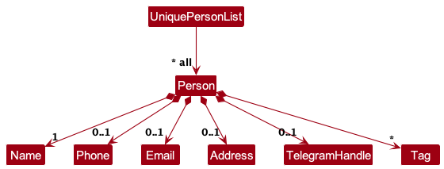
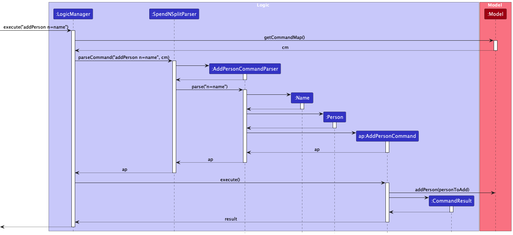

g---
layout: page
title: Developer Guide
---
* Table of Contents
{:toc}

--------------------------------------------------------------------------------------------------------------------

## **Acknowledgements**

* {list here sources of all reused/adapted ideas, code, documentation, and third-party libraries -- include links to the original source as well}

--------------------------------------------------------------------------------------------------------------------

## **Setting up, getting started**

Refer to the guide [_Setting up and getting started_](SettingUp.md).

--------------------------------------------------------------------------------------------------------------------

## **Design**

:bulb: **Tip:** The `.puml` files used to create diagrams in this document `docs/diagrams` folder. Refer to the [_PlantUML Tutorial_ at se-edu/guides](https://se-education.org/guides/tutorials/plantUml.html) to learn how to create and edit diagrams.

### Architecture

The ***Architecture Diagram*** given above explains the high-level design of the App.

Given below is a quick overview of main components and how they interact with each other.

**Main components of the architecture**

**`Main`** (consisting of classes [`Main`](https://github.com/se-edu/addressbook-level3/tree/master/src/main/java/seedu/address/Main.java) and [`MainApp`](https://github.com/se-edu/addressbook-level3/tree/master/src/main/java/seedu/address/MainApp.java)) is in charge of the app launch and shut down.
* At app launch, it initializes the other components in the correct sequence, and connects them up with each other.
* At shut down, it shuts down the other components and invokes cleanup methods where necessary.

The bulk of the app's work is done by the following four components:

* [**`UI`**](#ui-component): The UI of the App.
* [**`Logic`**](#logic-component): The command executor.
* [**`Model`**](#model-component): Holds the data of the App in memory.
* [**`Storage`**](#storage-component): Reads data from, and writes data to, the hard disk.

[**`Commons`**](#common-classes) represents a collection of classes used by multiple other components.

**How the architecture components interact with each other**

The *Sequence Diagram* below shows how the components interact with each other for the scenario where the user issues the command `delete 1`.

Each of the four main components (also shown in the diagram above),

* defines its *API* in an `interface` with the same name as the Component.
* implements its functionality using a concrete `{Component Name}Manager` class (which follows the corresponding API `interface` mentioned in the previous point.

For example, the `Logic` component defines its API in the `Logic.java` interface and implements its functionality using the `LogicManager.java` class which follows the `Logic` interface. Other components interact with a given component through its interface rather than the concrete class (reason: to prevent outside component's being coupled to the implementation of a component), as illustrated in the (partial) class diagram below.

The sections below give more details of each component.

### UI component

The **API** of this component is specified in [`Ui.java`](https://github.com/se-edu/addressbook-level3/tree/master/src/main/java/seedu/address/ui/Ui.java)

The UI consists of a `MainWindow` that is made up of parts e.g.`CommandBox`, `ResultDisplay`, `PersonListPanel`, `EventListPanel`, `StatusBarFooter` etc. All these, including the `MainWindow`, inherit from the abstract `UiPart` class which captures the commonalities between classes that represent parts of the visible GUI.

The `UI` component uses the JavaFx UI framework. The layout of these UI parts are defined in matching `.fxml` files that are in the `src/main/resources/view` folder. For example, the layout of the [`MainWindow`](https://github.com/se-edu/addressbook-level3/tree/master/src/main/java/seedu/address/ui/MainWindow.java) is specified in [`MainWindow.fxml`](https://github.com/se-edu/addressbook-level3/tree/master/src/main/resources/view/MainWindow.fxml)

The `UI` component,

* executes user commands using the `Logic` component.
* listens for changes to `Model` data so that the UI can be updated with the modified data.
* keeps a reference to the `Logic` component, because the `UI` relies on the `Logic` to execute commands.
* depends on some classes in the `Model` component, as it displays `Person` and `Event` object residing in the `Model`.

### Logic component

**API** : [`Logic.java`](https://github.com/se-edu/addressbook-level3/tree/master/src/main/java/seedu/address/logic/Logic.java)

Here's a (partial) class diagram of the `Logic` component:

The sequence diagram below illustrates the interactions within the `Logic` component, taking `execute("delete 1")` API call as an example.

:information_source: **Note:** The lifeline for `DeleteCommandParser` should end at the destroy marker (X) but due to a limitation of PlantUML, the lifeline reaches the end of diagram.

How the `Logic` component works:

1. When `Logic` is called upon to execute a command, it is passed to an `AddressBookParser` object which in turn creates a parser that matches the command (e.g., `DeleteCommandParser`) and uses it to parse the command.
1. This results in a `Command` object (more precisely, an object of one of its subclasses e.g., `DeleteCommand`) which is executed by the `LogicManager`.
1. The command can communicate with the `Model` when it is executed (e.g. to delete a person).
1. The result of the command execution is encapsulated as a `CommandResult` object which is returned back from `Logic`.

Here are the other classes in `Logic` (omitted from the class diagram above) that are used for parsing a user command:

How the parsing works:
* When called upon to parse a user command, the `AddressBookParser` class creates an `XYZCommandParser` (`XYZ` is a placeholder for the specific command name e.g., `AddCommandParser`) which uses the other classes shown above to parse the user command and create a `XYZCommand` object (e.g., `AddCommand`) which the `AddressBookParser` returns back as a `Command` object.
* All `XYZCommandParser` classes (e.g., `AddCommandParser`, `DeleteCommandParser`, ...) inherit from the `Parser` interface so that they can be treated similarly where possible e.g, during testing.

### Model component
**API** : [`Model.java`](https://github.com/se-edu/addressbook-level3/tree/master/src/main/java/seedu/address/model/Model.java)

The `Model` component,

* stores the address book data i.e., all `Person`(which are contained in a `UniquePersonList` object) and `Event` objects (which are contained in a `EventList` object).
* stores the currently 'selected' `Person` objects (e.g., results of a search query) as a separate _filtered_ list which is exposed to outsiders as an unmodifiable `ObservableList<Person>` that can be 'observed' e.g. the UI can be bound to this list so that the UI automatically updates when the data in the list change.
* stores a `UserPref` object that represents the user’s preferences. This is exposed to the outside as a `ReadOnlyUserPref` objects.
* does not depend on any of the other three components (as the `Model` represents data entities of the domain, they should make sense on their own without depending on other components)

:information_source: **Note:** An alternative (arguably, a more OOP) model is given below. It has a `Group` list in the `AddressBook`, which `Person` references. This allows `AddressBook` to only require one `Group` object per unique group, instead of each `Group` needing their own `Group` objects. 

### Storage component

**API** : [`Storage.java`](https://github.com/se-edu/addressbook-level3/tree/master/src/main/java/seedu/address/storage/Storage.java)

The `Storage` component,
* can save both address book data and user preference data in JSON format, and read them back into corresponding objects.
* inherits from both `AddressBookStorage` and `UserPrefStorage`, which means it can be treated as either one (if only the functionality of only one is needed).
* depends on some classes in the `Model` component (because the `Storage` component's job is to save/retrieve objects that belong to the `Model`)

### Common classes

Classes used by multiple components are in the `seedu.addressbook.commons` package.

--------------------------------------------------------------------------------------------------------------------

## **Implementation**

This section describes some noteworthy details on how certain features are implemented.

### Ability to add persons

#### Implementation details

The 'add' feature involves creating a new "Person" object with optional fields and adding it to FumbleLog. 

This is done using `AddCommand` which implements the `Command` interface. The `AddCommand` is then executed by `LogicManager` which calls `ModelManager` to add the person to the address book.

As a result, the existing 'Person' class in AB3's implementation is enhanced to have the capacity of storing optional fields.
Below is a class diagram of the enhanced 'Person' class:

The `Person` object is now composed of the following optional attributes due to the refactored `add` feature:

* `Name`: The name of the person. Compulsory field.
* `Phone`: The phone number of the person. Optional field.
* `Email`: The email address of the person. Optional field.
* `Address`: The address of the person. Optional field.
* `Birthday`: The birthday of the person. Optional field.
* `Groups`: The groups that the person is associated with. Optional field.

The [**`java.util.Optional<T>`**](https://docs.oracle.com/javase/8/docs/api/java/util/Optional.html) class is used to represent the optional attributes of the `Person` object.

To add a person, the user must specify the name of the person using the `n/` prefix. The user can then specify the optional attributes of the person using the following prefixes:

<box type="info">
Except for the name, all the fields given to the `add` command are optional.
</box>

The flow for the `add` command is described by the following sequence diagram:

### Feature details
1. The application will validate the arguments supplied by the user; whether the "NAME" is unique and supplied, and whether the optional fields follow the correct format. 
2. If the arguments are invalid, an error message will be shown to the user and prompts the user for a corrected input.
3. If the arguments are valid, a `Person` object will be created with the fields supplied and stored in FumbleLog.

#### Design Considerations

**Aspect: Generic Design**

The original implementation of AB3's `Person` class is refactored to have the capacity of storing optional fields. This is done by using the `java.util.Optional<T>` class to represent the optional attributes of the `Person` object.
Furthermore, we have added additional fields into the `Person` class to allow users to store more information about the person, such as their birthday.

As the original `add` command already exists in AB3, this feature can be implemented by enhancing the `add` command.

Furthermore, we accounted for empty/null inputs in the optional fields by generating a NULL_INSTANCE for the optional fields when the user does not specify the optional fields. This design decision allowed us to easily check
for empty/null inputs in the Person object by checking if the optional field is not equal to the NULL_INSTANCE, instead of doing null pointer and empty string checks.

* **Alternative 1 (current choice):** Enhance the existing `add` command.
  * Pros: 
    * Easier to implement.
    * Reuses the logic for the `add` command.
  * Cons:
    * Have to account for empty/null inputs in the optional fields when saving the data and testing it
    * Have to account for empty/null inputs in the optional fields when displaying the data
* **Alternative 2**: Create a new `add_optional` command.
  * Pros: 
    * Do not have to account for empty/null inputs in the optional fields when saving the data and testing it
  * Cons:
    * Inconveniences the user as they have to remember a new command to add a person with optional fields.

### Ability to assign persons to an event

The ability to assign persons to an event is facilitated by `ModelManager`.

Each event stores a list of persons assigned to it. The person(s) are represented by their `Name` stored in FumbleLog. This is because the `Name` is the only unique identifier for a person.

When a person is assigned to an event, the person's `Name` is added to the event's list of assigned persons. When a person is unassigned from an event, the person's `Name` is removed from the event's list of assigned persons. When a person's `Name` is modified, the change is also reflected in the event(s) that they are previously assigned to.

Users can assign multiple names to an event by using multiple `n/` identifiers following with the `Name` specified. The `ModelManager` will perform checks on whether the names supplied are valid, i.e the `Name` currently exists in FumbleLog.

When editing the event, specifying `n/` with a `Name` will append this new name to the current list rather than replace the previous names. This is to facilitate the user to assign more persons without accidentally deleting the previous persons assigned. To un-assign a person, the user must manually specify `u/` with the `Name` to un-assign the person from the event.

### Ability to assign groups to an event

#### Implementation

The ability to assign groups to an event is facilitated by `ModelManager`.

Each event stores a list of groups assigned to it. The groups(s) are represented by their name and that acts as their id. 

When a group is assigned to an event, the group's name is stored into the event's list of groups. When un-assigned, the corresponding groups are then removed from the group list.

With the group name, person(s) with that specific group in their group list is displayed with the event.

#### Design considerations

- When adding and displaying groups, persons that has been added individually previously will be displayed twice. To counter that, checks are done to ensure that
when a group is added, duplicate persons will be deleted from the individual persons list
- A person can belong to multiple groups, due to the multiplicity between groups and persons. In this case, we allow multiple persons to be displayed, as it is clear which group they belong to.
- As the persons are searched by their group name only when displaying, adding new persons, editing and deleting persons is simple as the component just reloads and searches for everybody in the groups again.

### Improved find feature

The `find` command in our application displays persons that fit the keyword(s)

#### Implementation

The `find` feature involves checking the current filtered list of persons and filtering out persons with fitting names 
or groups. This is done using `NameOrGroupContainsKeywordsPredicate`, which enhanced from the original 
`NameContainsKeywordsPredicate` class. The predicate is then passed to `Model#updateFilteredPersonList(Predicate<Person> predicate)`.

As a result, the `ObservableList<Person>` is updated with the filtered lists of persons.
The `UI` component is notified of these new changes to the lists and updates the UI accordingly, which will show the updated persons.

The enhanced `find` command remains its original ability i.e. find the person whose name fits the keyword. Except it will also
find person whose group(s) fits the keyword. If a person's group name fits the keyword, it will be shown on the UI, 
even though the person's name does not fit the keyword(s).

#### Feature details
1. The `find` command can accept one or more parameter `keyword` for searching person and events.
2. A `NameOrGroupContainsKeywordsPredicate` will be created and a `Find` command will be created with the predicates.
3. The `Find` command will then be executed and the `UI` will be updated with the filtered lists of persons.

#### General design considerations

**Aspect: Keyword target differentiation**

- **Alternative 1 (Current choice): Find all persons that fits the keyword.**
    - Pros:
        - Easier to implement.
    - Cons:
        - Might get unwanted results, which decreases overall experience.
- **Alternative 2: Differentiate the target of keyword with syntax.**
    - Pros:
        - User can find exact person or group.
    - Cons:
        - Adding constraint the original command by requiring syntax, which may cause convenience.

### \[Proposed\] Undo/redo feature

#### Proposed Implementation

The proposed undo/redo mechanism is facilitated by `VersionedAddressBook`. It extends `AddressBook` with an undo/redo history, stored internally as an `addressBookStateList` and `currentStatePointer`. Additionally, it implements the following operations:

* `VersionedAddressBook#commit()` — Saves the current address book state in its history.
* `VersionedAddressBook#undo()` — Restores the previous address book state from its history.
* `VersionedAddressBook#redo()` — Restores a previously undone address book state from its history.

These operations are exposed in the `Model` interface as `Model#commitAddressBook()`, `Model#undoAddressBook()` and `Model#redoAddressBook()` respectively.

Given below is an example usage scenario and how the undo/redo mechanism behaves at each step.

Step 1. The user launches the application for the first time. The `VersionedAddressBook` will be initialized with the initial address book state, and the `currentStatePointer` pointing to that single address book state.

Step 2. The user executes `delete 5` command to delete the 5th person in the address book. The `delete` command calls `Model#commitAddressBook()`, causing the modified state of the address book after the `delete 5` command executes to be saved in the `addressBookStateList`, and the `currentStatePointer` is shifted to the newly inserted address book state.

Step 3. The user executes `add n/David …​` to add a new person. The `add` command also calls `Model#commitAddressBook()`, causing another modified address book state to be saved into the `addressBookStateList`.

:information_source: **Note:** If a command fails its execution, it will not call `Model#commitAddressBook()`, so the address book state will not be saved into the `addressBookStateList`.

Step 4. The user now decides that adding the person was a mistake, and decides to undo that action by executing the `undo` command. The `undo` command will call `Model#undoAddressBook()`, which will shift the `currentStatePointer` once to the left, pointing it to the previous address book state, and restores the address book to that state.

:information_source: **Note:** If the `currentStatePointer` is at index 0, pointing to the initial AddressBook state, then there are no previous AddressBook states to restore. The `undo` command uses `Model#canUndoAddressBook()` to check if this is the case. If so, it will return an error to the user rather
than attempting to perform the undo.

The following sequence diagram shows how the undo operation works:

:information_source: **Note:** The lifeline for `UndoCommand` should end at the destroy marker (X) but due to a limitation of PlantUML, the lifeline reaches the end of diagram.

The `redo` command does the opposite — it calls `Model#redoAddressBook()`, which shifts the `currentStatePointer` once to the right, pointing to the previously undone state, and restores the address book to that state.

:information_source: **Note:** If the `currentStatePointer` is at index `addressBookStateList.size() - 1`, pointing to the latest address book state, then there are no undone AddressBook states to restore. The `redo` command uses `Model#canRedoAddressBook()` to check if this is the case. If so, it will return an error to the user rather than attempting to perform the redo.

Step 5. The user then decides to execute the command `list`. Commands that do not modify the address book, such as `list`, will usually not call `Model#commitAddressBook()`, `Model#undoAddressBook()` or `Model#redoAddressBook()`. Thus, the `addressBookStateList` remains unchanged.

Step 6. The user executes `clear`, which calls `Model#commitAddressBook()`. Since the `currentStatePointer` is not pointing at the end of the `addressBookStateList`, all address book states after the `currentStatePointer` will be purged. Reason: It no longer makes sense to redo the `add n/David …​` command. This is the behavior that most modern desktop applications follow.

The following activity diagram summarizes what happens when a user executes a new command:

#### Design considerations:

**Aspect: How undo & redo executes:**

* **Alternative 1 (current choice):** Saves the entire address book.
  * Pros: Easy to implement.
  * Cons: May have performance issues in terms of memory usage.

* **Alternative 2:** Individual command knows how to undo/redo by
  itself.
  * Pros: Will use less memory (e.g. for `delete`, just save the person being deleted).
  * Cons: We must ensure that the implementation of each individual command are correct.

_{more aspects and alternatives to be added}_

### \[Proposed\] Data archiving

_{Explain here how the data archiving feature will be implemented}_

### Remind feature

The `remind` command in our application displays a birthdays and events that will happen within a specified number of days.

#### Implementation

The `remind` feature involves checking the current filtered list of persons and events and filtering out persons with birthdays and events with starting date 
that are within the specified number of days. This is done using `BirthdayWithinDaysPredicate` and `EventWithinDaysPredicate` which implements the `Predicate<T>` interface. These predicates are passed 
to `Model#updateFilteredPersonList(Predicate<Person> predicate)` and `Model#updateFilteredEventList(Predicate<Event> predicate)` respectively.

As a result, the `ObservableList<Person>` and `ObservableList<Event>` are updated with the filtered lists of persons and events respectively. 
The `UI` component is notified of these new changes to the lists and updates the UI accordingly, which will show the updated persons and events.

The `remind` command is implemented this way as it reuses the logic for the `find` command where it utilises the `Model` component to update the current list of persons based on the given predicate.
Instead of filtering out persons based on names, the `BirthdayWithinDaysPredicate` filters out persons based on their birthdays and the `EventWithinDaysPredicate` filters out events based on their starting dates.

The flow for the `remind` command is described by the following sequence diagram:

#### Feature details
1. The `remind` command can accept an optional parameter `days` which specifies the number of days to search for birthdays and events. If `days` is not specified, the default value of 7 days will be used.
2. The application will validate the argument `days` to ensure that it is a positive integer. If it is not, an error message will be shown to the user and prompts the user for a corrected input.
3. If it is a valid input, a `BirthdayWithinDaysPredicate` and `EventWithinDaysPredicate` will be created and a `Remind` command will be created with the predicates.
4. The `Remind` command will then be executed and the `UI` will be updated with the filtered lists of persons and events.

#### General design considerations

- **Alternative 1 (Current choice): Updating list with predicate.**
    - Pros: 
      - Reuses the logic for the `find` command.
      - The `UI` component is notified of the changes to the list and updates the UI accordingly.
    - Cons: 
      - The `Model` component is tightly coupled with the `UI` component.
- **Alternative 2: Checking current list for birthdays and events, and adding to new list.**
  - Pros: 
    - Easier to implement.
  - Cons: 
    - Performance overhead. New addressbook objects needs to be created.

--------------------------------------------------------------------------------------------------------------------

## **Documentation, logging, testing, configuration, dev-ops**

* [Documentation guide](Documentation.md)
* [Testing guide](Testing.md)
* [Logging guide](Logging.md)
* [Configuration guide](Configuration.md)
* [DevOps guide](DevOps.md)

--------------------------------------------------------------------------------------------------------------------

## **Appendix: Requirements**

### Product scope

**Target user profile**:

This product is targeted at busy university students who struggle to manage
their interpersonal relationships and commitments due to the demands of their
academic and social lives. They are relatively tech savvy and prefer to use the
keyboard over the mouse, prefer short commands over full sentences. 
These users seek an intuitive and efficient solution to help them stay organized,
prioritize their tasks and manage their time effectively.

**Value proposition**:

We provide students with an easy-to-use application to manage their social lives and 
time better. Our app reminds students of their upcoming commitments and helps them to
prioritize their tasks. It also helps them to keep track of their friends’ birthdays and
other important events.

### User stories

Priorities: High (must have) - `* * *`, Medium (nice to have) - `* *`, Low (unlikely to have) - `*`

| Priority | As a …​            | I want to …​                                 | So that I can…​                                                        |
|----------|--------------------|----------------------------------------------|------------------------------------------------------------------------|
| `* * *`  | university student | see usage instructions                       | refer to instructions when I forget how to use the App                 |
| `* * *`  | university student | add a new person                             | keep my address book up to date                                        |
| `* * *`  | university student | include optional fields when adding contacts | include comprehensive and personalized information for each contact    |
| `* * *`  | university student | delete a person                              | remove contacts that I no longer need                                  |
| `* * *`  | university student | find a person by name                        | locate details of persons without having to go through the entire list |
| `* * *`  | university student | edit a person details                        | reflect any contact changes accordingly                                |   
| `* * *`  | university student | create an event                              | schedule and keep track of important commitments                       |   
| `* * *`  | university student | view all upcoming events                     | stay informed about my scheduled commitments                           |
| `* * *`  | university student | edit an event                                | modify event details like the date, time, or location                  |
| `* * *`  | university student | delete an event                              | remove events that are canceled or no longer relevant                  |
| `* * *`  | university student | access a separate event column in the GUI    | simultaneously view contact details and event details                  |
| `* *`    | university student | be reminded on events                        | so that i can remember upcoming social activities                      |
| `* *`    | university student | set recurring events                         | automate scheduling for repetitive commitments                         |
| `* *`    | university student | customise short form commands                | perform commands more efficiently                                      |
| `* *`    | university student | assign contacts to groups                    | i can easily identify who is involved in specific events               |
| `* *`    | university student | pin contacts or groups                       | access and communicate with frequently contacted groups                |

### Use cases

(For all use cases below, the **System** is `FumbleLog`, the **Person** is the `user` and the **Actors** are `Computing student`, unless specified otherwise)

**Use case: UC01 - Delete a person**

**MSS**

1.  User requests to list persons
2.  FumbleLog shows a list of persons
3.  User requests to delete a specific person in the list
4.  FumbleLog deletes the person

    Use case ends.

**Extensions**

* 2a. The list is empty.

  Use case ends.

* 3a. The given index is invalid.

    * 3a1. FumbleLog shows an error message.

      Use case resumes at step 2.

* 3b. The person is assigned to an event.

    * 3b1. The event is updated to remove the person from the event.

      Use case resumes at step 4.

* 4a. The person is the last member of a group and that group is assigned to an event.

    * 4a1. The group is deleted from the event.

      Use case exits.

**Use case: UC02 - Add a person**

**MSS**
1. User requests to add persons
2. User supplies all necessary parameters they wish to associate with the person to be added
3. FumbleLog adds the person

   Use case ends.

**Extensions**
* 2a. User supplies the wrong type of parameters
    
    * 2a1. FumbleLog shows an error message.

      Use case resumes at step 2.
* 3a. Person is added with a group and that group is assigned to an event
  
    * 3a1. FumbleLog reloaded the event component and displays the newly added person in the event.

      Use case ends.

**Use case: UC03 - Edit a person**

**MSS**
1. User requests to list persons
2. FumbleLog shows a list of persons
3. User request to edit a specific person in the list
4. User supplies parameters that they want to change
5. FumbleLog edits the person

   Use case ends.

**Extensions**
* 2a. List is empty

  Use case ends.

* 3a. User supplies an invalid index to edit
    
    * 3a1. FumbleLog shows an error message.

      Use case resumes at step 2.

* 4a. User modifies the name of the person

    * 4a1. FumbleLog updates the name of the person in all events that the person is <u> assigned </u> to. This includes persons in groups.

      Use case resumes at step 5.

* User removes a group from the person

    * 4b1. FumbleLog removes the person from the corresponding group in all events.

      Use case resumes at step 5.

**Use case: UC04 - Add an event**

**MSS**

1. User requests to add a event
2. User supplies the necessary parameters for the event
3. FumbleLog adds the event

   Use case ends.

**Extensions**
* 2a. User supplies invalid parameters

    * 2a1. FumbleLog shows an error message

      Use case resumes at step 2.

 **Use case: UC05 - Edit an event**

 **MSS**
1. User request to edit a specific event in the list
2. User supplies parameters that they want to change
3. FumbleLog edits the event

   Use case ends.

**Extensions**
* 1a. List is empty

  Use case ends.

* 2a. User supplies an invalid index to edit
    
    * 2a1. FumbleLog shows an error message.

      Use case resumes at step 2.
* 3a. User enters a group and certain members of the group is already 
assigned to the the event.

    * 3a1. For each Event, duplicate members will be removed from the 
    individual Persons list.
        
      Use case ends

**Use case: UC06 - Delete an event**

**MSS**

1.  User requests to <u> list events </u> 
2.  FumbleLog shows a list of events
3.  User requests to delete a specific event in the list
4.  FumbleLog deletes the event

    Use case ends.

**Extensions**

* 2a. The list is empty

  Use case ends.

* 3a. The given index is invalid

    * 3a1. FumbleLog shows an error message.

      Use case resumes at step 2.

 
**Use case: UC07 - Filter persons by group**

1. User requests to filter persons by specifying a group
2. FumbleLog shows the list of persons that belong in the specified group

   Use case ends.

**Extensions**

* 1a. The group does not exist

    * 1a1. FumbleLog shows an error message

    Use case resumes at step 1.

* 2a. The list is empty

  Use case ends.

**Use case: UC08 - Show reminders for events/birthdays happening soon**

**MSS**
1. User request a reminder for events/birthdays happening soon
2. FumbleLog displays a list of events/birthdays happening soon

   Use case ends.

**Extensions**

* 1a. User can specify the range of time to search
    * 1a1. FumbleLog shows the list of events/birthdays happening within the specified range of time

   Use case ends.

* 2a. The list is empty

  Use case ends.

**Use case: UC09 - Customise short form commands**

**MSS**
1. User request to define a command in a custom format
2. FumbleLog stores the newly defined command
3. The defined short form command can now be used

   Use case ends.

**Extensions**

* 1a. The short-form command is conflicting with something else
    * 1a1. FumbleLog shows an error message

      Use case ends.

* 3a. User uses a short-form command that is not defined
    * 3a1. FumbleLog shows an error message
 
      Use case ends.

**Use case: UC10 - Assigning a group to an event**

**MSS**
1. User requests to show a list of events
2. FumbleLog shows list of events
3. User requests to assign a group to a specific event in the list
4. FumbleLog assigns all persons in the group to the event

   Use case ends.

**Extensions**

* 1a. The list is empty

  Use case ends.

* 3a. User tries to assign a group to an invalid event
    * 3a1. FumbleLog shows an error message
 
      Use case resumes at step 3.

* 3b. User tries to assign an invalid group to an event
    * 3b1. FumbleLog shows an error message

      Use case ends.
* 4a. User assigns a group to an event where 

**Use case: UC11 - Marking an event as recurring**

**MSS**
1. User requests to show a list of events
2. FumbleLog shows list of events
3. User requests to mark an event as recurring
4. User specifies how often the event occurs
5. FumbleLog sets the event as a recurring event

   Use case ends.

**Extensions**

* 1a. The list is empty

  Use case ends.

* 3a. User tries to mark an invalid event as recurring
    * 3a1. FumbleLog shows an error message

      Use case resumes at step 3.

* 3b. User tries to mark an event as recurring when it has already been marked as a recurring event
    * 3b1. FumbleLog shows an error message

      Use case ends.

**Use case: UC12 - Pin a person**

**MSS**

1. User requests to show a list of persons
2. FumbleLog shows a list of persons
3. User requests to pin a person from the list
4. FumbleLog pins the person

   Use case ends.

**Extensions**

* 1a. The list is empty

  Use case ends.

* 3a. User requests to pin an invalid person
  * 3a1. FumbeLog shows an error message

  Use case resumes at step 3.

**Use case: UC13 - Display events in Calendar**

1. User requests to show events in a calendar form
2. FumbleLog shows all the events in a calendar

   Use case ends.

**Extensions**

* 1a. The list is empty
  * 1a1. FumbleLog shows an empty calendar

    Use case ends.

  
### Non-Functional Requirements

1.  Should work on any _mainstream OS_ as long as it has Java `11` or above installed.
2.  Should be able to hold up to 1000 persons without a noticeable sluggishness in performance for typical usage.
3.  A user with above average typing speed for regular English text (i.e. not code, not system admin commands) should be able to accomplish most of the tasks faster using commands than using the mouse.
4.  Should be able to hold up to 1000 events without a noticeable sluggishness in performance for typical usage.
5.  The data stored on the hard drive should be light-weight and not take too much space.

*{More to be added}*

### Glossary

* **Mainstream OS**: Windows, Linux, Unix, OS-X
* **Private contact detail**: A contact detail that is not meant to be shared with others
* **Event**:  An encompassing term that refers to any organized occurrence or gathering,  
which can include various types of activities, such as meetings, birthdays, and other scheduled events.
* **Meeting**: A specific type of event that involves the interaction of two or more individuals. Contacts or groups of contacts can be assigned to a single meeting.
* **Group**: A collection of contacts grouped together for organizational purposes. 
Contacts or groups can be assigned to a single meeting, allowing for efficient management and coordination of events and interactions.

--------------------------------------------------------------------------------------------------------------------

## **Appendix: Instructions for manual testing**

Given below are instructions to test the app manually.

:information_source: **Note:** These instructions only provide a starting point for testers to work on;
testers are expected to do more *exploratory* testing.

### Launch and shutdown

1. Initial launch

   1. Download the jar file and copy into an empty folder

   1. Double-click the jar file Expected: Shows the GUI with a set of sample contacts. The window size may not be optimum.

1. Saving window preferences

   1. Resize the window to an optimum size. Move the window to a different location. Close the window.

   1. Re-launch the app by double-clicking the jar file. 
       Expected: The most recent window size and location is retained.

1. _{ more test cases …​ }_

### Deleting a person

1. Deleting a person while all persons are being shown

   1. Prerequisites: List all persons using the `list` command. Multiple persons in the list.

   1. Test case: `delete 1` 
      Expected: First contact is deleted from the list. Details of the deleted contact shown in the status message. Timestamp in the status bar is updated.

   1. Test case: `delete 0` 
      Expected: No person is deleted. Error details shown in the status message. Status bar remains the same.

   1. Other incorrect delete commands to try: `delete`, `delete x`, `...` (where x is larger than the list size) 
      Expected: Similar to previous.

1. _{ more test cases …​ }_

### Saving data

1. Dealing with missing/corrupted data files

   1. _{explain how to simulate a missing/corrupted file, and the expected behavior}_

1. _{ more test cases …​ }_
