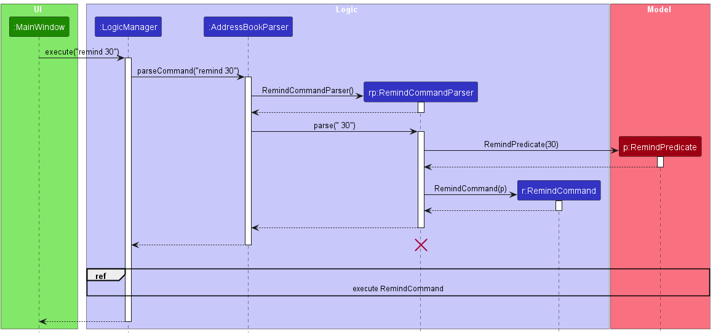
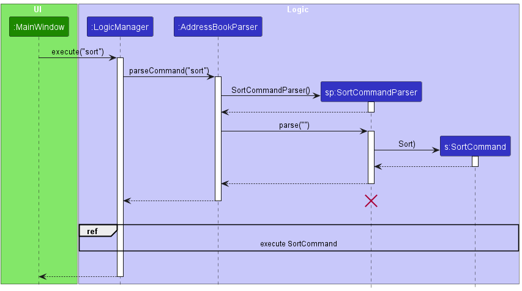

* Table of Contents
{:toc}

--------------------------------------------------------------------------------------------------------------------

## **Acknowledgements**

* This project is based on the AddressBook-Level3 project created by the [SE-EDU initiative](https://se-education.org/). 
* The `remark` command was implemented with reference to the [tutorial of adding a command](https://nus-cs2103-ay2324s1.github.io/tp/tutorials/AddRemark.html).

--------------------------------------------------------------------------------------------------------------------

## **Setting up, getting started**

Refer to the guide [_Setting up and getting started_](SettingUp.md).

--------------------------------------------------------------------------------------------------------------------

## **Design**

:bulb: **Tip:** The `.puml` files used to create diagrams in this document `docs/diagrams` folder. Refer to the [_PlantUML Tutorial_ at se-edu/guides](https://se-education.org/guides/tutorials/plantUml.html) to learn how to create and edit diagrams.

### Architecture

The ***Architecture Diagram*** given above explains the high-level design of the App.

Given below is a quick overview of main components and how they interact with each other.

**Main components of the architecture**

**`Main`** (consisting of classes [`Main`](https://github.com/AY2324S1-CS2103T-W16-3/tp/tree/master/src/main/java/seedu/address/Main.java) and [`MainApp`](https://github.com/AY2324S1-CS2103T-W16-3/tp/tree/master/src/main/java/seedu/address/MainApp.java)) is in charge of the app launch and shut down.
* At app launch, it initializes the other components in the correct sequence, and connects them up with each other.
* At shut down, it shuts down the other components and invokes cleanup methods where necessary.

The bulk of the app's work is done by the following four components:

* [**`UI`**](#ui-component): The UI of the App.
* [**`Logic`**](#logic-component): The command executor.
* [**`Model`**](#model-component): Holds the data of the App in memory.
* [**`Storage`**](#storage-component): Reads data from, and writes data to, the hard disk.

[**`Commons`**](#common-classes) represents a collection of classes used by multiple other components.

**How the architecture components interact with each other**

The *Sequence Diagram* below shows how the components interact with each other for the scenario where the user issues the command `delete 1`.

Each of the four main components (also shown in the diagram above),

* defines its *API* in an `interface` with the same name as the Component.
* implements its functionality using a concrete `{Component Name}Manager` class (which follows the corresponding API `interface` mentioned in the previous point.

For example, the `Logic` component defines its API in the `Logic.java` interface and implements its functionality using the `LogicManager.java` class which follows the `Logic` interface. Other components interact with a given component through its interface rather than the concrete class (reason: to prevent outside component's being coupled to the implementation of a component), as illustrated in the (partial) class diagram below.

The sections below give more details of each component.

### UI component

The **API** of this component is specified in [`Ui.java`](https://github.com/AY2324S1-CS2103T-W16-3/tp/tree/master/src/main/java/seedu/address/ui/Ui.java)

The UI consists of a `MainWindow` that is made up of parts e.g.`CommandBox`, `ResultDisplay`, `PersonListPanel`, `StatusBarFooter` etc. All these, including the `MainWindow`, inherit from the abstract `UiPart` class which captures the commonalities between classes that represent parts of the visible GUI.

The `UI` component uses the JavaFx UI framework. The layout of these UI parts are defined in matching `.fxml` files that are in the `src/main/resources/view` folder. For example, the layout of the [`MainWindow`](https://github.com/AY2324S1-CS2103T-W16-3/tp/tree/master/src/main/java/seedu/address/ui/MainWindow.java) is specified in [`MainWindow.fxml`](https://github.com/AY2324S1-CS2103T-W16-3/tp/tree/master/src/main/resources/view/MainWindow.fxml)

The `UI` component,

* executes user commands using the `Logic` component.
* listens for changes to `Model` data so that the UI can be updated with the modified data.
* keeps a reference to the `Logic` component, because the `UI` relies on the `Logic` to execute commands.
* depends on some classes in the `Model` component, as it displays `Person` object residing in the `Model`.

### Logic component

**API** : [`Logic.java`](https://github.com/AY2324S1-CS2103T-W16-3/tp/tree/master/src/main/java/seedu/address/logic/Logic.java)

Here's a (partial) class diagram of the `Logic` component:

The sequence diagram below illustrates the interactions within the `Logic` component, taking `execute("delete 1")` API call as an example.

:information_source: **Note:** The lifeline for `DeleteCommandParser` should end at the destroy marker (X) but due to a limitation of PlantUML, the lifeline reaches the end of diagram.

How the `Logic` component works:

1. When `Logic` is called upon to execute a command, it is passed to an `AddressBookParser` object which in turn creates a parser that matches the command (e.g., `DeleteCommandParser`) and uses it to parse the command.
1. This results in a `Command` object (more precisely, an object of one of its subclasses e.g., `DeleteCommand`) which is executed by the `LogicManager`.
1. The command can communicate with the `Model` when it is executed (e.g. to delete a person).
1. The result of the command execution is encapsulated as a `CommandResult` object which is returned back from `Logic`.

Here are the other classes in `Logic` (omitted from the class diagram above) that are used for parsing a user command:

How the parsing works:
* When called upon to parse a user command, the `AddressBookParser` class creates an `XYZCommandParser` (`XYZ` is a placeholder for the specific command name e.g., `AddCommandParser`) which uses the other classes shown above to parse the user command and create a `XYZCommand` object (e.g., `AddCommand`) which the `AddressBookParser` returns back as a `Command` object.
* All `XYZCommandParser` classes (e.g., `AddCommandParser`, `DeleteCommandParser`, ...) inherit from the `Parser` interface so that they can be treated similarly where possible e.g, during testing.

### Model component
**API** : [`Model.java`](https://github.com/AY2324S1-CS2103T-W16-3/tp/tree/master/src/main/java/seedu/address/model/Model.java)

The `Model` component,

* stores the client list data i.e., all `Person` objects (which are contained in a `UniquePersonList` object).
* stores the currently 'selected' `Person` objects (e.g., results of a search query) as a separate _filtered_ list which is exposed to outsiders as an unmodifiable `ObservableList<Person>` that can be 'observed' e.g. the UI can be bound to this list so that the UI automatically updates when the data in the list change.
* stores a `UserPref` object that represents the user’s preferences. This is exposed to the outside as a `ReadOnlyUserPref` objects.
* does not depend on any of the other three components (as the `Model` represents data entities of the domain, they should make sense on their own without depending on other components)

The `Person` component,

* Has 6 compulsory attributes (`Name`, `Phone`, `Address`, `Email`, `Nric`, `LicencePlate`) and 2 optional attributes 
(`Remark` and `Tag`)
* `Tag` can store any amount of tags
* Has a `Policy`, which is optional for a person to have, but is stored in the `Person` class regardless
  * If a person has a policy attached to them, `Policy` will simply hold their information (i.e. `Company`, `PolicyNumber`, 
  policy issue and expiry date as `PolicyDate`)
  * If a person does not have a policy attached to them, `Policy` will hold default values 

:information_source: **Note:** An alternative (arguably, a more OOP) model is given below. It has a `Tag` list in the `AddressBook`, which `Person` references. This allows `AddressBook` to only require one `Tag` object per unique tag, instead of each `Person` needing their own `Tag` objects. 

#### Design considerations
**Aspect: Whether `Policy` should be a class of its own**
* Alternative 1: Add policy fields directly as attributes of `Person`
  * Pros: Less nested classes, easier implementation as AB3 already supports this style
  * Cons: Hard to extend when more policy fields have to be added in the future (e.g. `PolicyType`)
* Alternative 2: (current choice) Abstract out `Policy` as its own class
  * Pros: A more OOP implementation and allows for easier extension

**Aspect: How to handle clients with no policy**
* Alternative 1: Make `Policy = null` for `Person` with no policy. 
  * This was unsafe as when `Person` is displayed in the UI, methods like `toString()` would throw errors, violating type safety.
* Alternative 2: Make policy fields `Company`, `PolicyNumber` and `PolicyDate` be `null`. 
  * This was unsafe as the RegEx check (e.g. `isValidPolicyNumber()`) done in the constructors would have to be removed, leading to improper input validation.
* Alternative 3: (current choice) Have default policy parameters for policy fields.
  * Though more checks have to be added when displaying the policies (which is a minor bug), it guarantees type safety and has input validation due to the more defensive programming approach taken

### Storage component

**API** : [`Storage.java`](https://github.com/AY2324S1-CS2103T-W16-3/tp/tree/master/src/main/java/seedu/address/storage/Storage.java)

The `Storage` component,
* can save both client list data and user preference data in JSON format, and read them back into corresponding objects.
* inherits from both `AddressBookStorage` and `UserPrefStorage`, which means it can be treated as either one (if only the functionality of only one is needed).
* depends on some classes in the `Model` component (because the `Storage` component's job is to save/retrieve objects that belong to the `Model`)

### Common classes

Classes used by multiple components are in the `seedu.addressbook.commons` package.

--------------------------------------------------------------------------------------------------------------------

## **Implementation**

This section describes some noteworthy details on how certain features are implemented.

### `batchdelete`

The `batchdelete` command allows users to batch delete people whose policy expiry is in the specified month and year.

#### Implementation
The batch delete mechanism is facilitated by `DeleteMonth`

It is also facilitated by the operation:
* `ModelManager#batchDeleteWithPredicate(Predicate<Person> predicate)` - batch delete all people in the client list who fulfil the given predicate.

This operation is exposed in the `Model` interface as `Model# batchDeleteWithPredicate(Predicate<Person> predicate)`

The following sequence diagram shows how the batch delete operation works:

* instance of DeleteMonth is constructed to construct a BatchDeleteCommand

:information_source: **Note:** The lifeline for `BatchDeleteCommand` and `BatchDeleteCommandParser` should end at the destroy marker (X) but due to a limitation of PlantUML, the lifeline reaches the end of diagram.

* Calling method updateFilteredPersonList to get all people in the client list
* Using predicate p to get list of people to delete
* Delete all people in the list and return all people left in client list

#### Design considerations
* Users may use batch delete to delete all people whose policy expiry is in the specified month and year. For example, delete people didn’t contact the user to renew their policies for one year. 
* Besides, if users leave an insurance company, they may like to delete people purchase policy from that company. 
* Therefore, `Model#batchDeleteWithPredicate(Predicate<Person> predicate)` is introduced to allow batch delete by month or company.

 

### `edit`

The `edit` command allows users to edit the details of a person in the client list.

#### Implementation

The edit mechanism is facilitated by `EditCommand`. It extends `Command` with an `EditPersonDescriptor` to store the details of the person to be edited. 

Additionally, it implements the following operations:
* `EditCommand#createEditedPerson(Person personToEdit, EditPersonDescriptor editPersonDescriptor)` — Creates and returns a `Person` with the details of `personToEdit` edited with `editPersonDescriptor`.
* `EditCommand#execute(Model model)` — Edits the details of the `Person` in the client list.

The changes are finally made to the client list by calling `Model#setPerson(Person target, Person editedPerson)`.

Given below is the sequence diagram for the `edit` command:

:information_source: **Note:** The lifeline for `EditCommandParser` and `EditCommand` should end at the destroy marker (X) but due to a limitation of PlantUML, the lifeline reaches the end of diagram.

* Calling method setPerson to edit the person in client list.
* Calling method updateFilteredPersonList to update the client list with the edited person.

#### Design considerations
* Users may like to edit the details of a person in the client list, in case of changes in the personal details or policy of the person. For example, users may like to update the policy number of a person.
* Therefore, `EditCommand` is introduced to allow users to edit the details of a person in the client list.

 

### `remind`
The `remind` command allows the user to filter out people whose policy expiry date is approaching within the given number of days.

#### Implementation
The filtered list will be displayed in the UI. The remind mechanism is facilitated by `Model` through the following operations:
* `Model#RemindPredicate(int days)` - The Predicate to be used for filtering. `days` represents the number of days from the current date given by the user.
* `Model#updateFilteredPersonList(Predicate<Person> p)` - Filters the list of Persons to display by the Predicate `p`.

Given below is an example usage scenario and how the remind mechanism behaves at each step:

Step 1. The user realises that there may be a set of Persons whose policy expiry date is approaching within 30 days.

Step 2. The user executes `remind 30` command in an attempt to find this set of Persons. A `Model#RemindPredicate(int days)` instance with `days` being `30` will be created. As described in the [Logic Component](#logic-component) above, this will create a `RemindCommand` instance having the `RemindPredicate` instance as its field.

:information_source: **Note:** If the number of days given is out of range, an error will be thrown and the application will re-prompt the user to input a valid value.

Step 3. The `LogicManager` will call `RemindCommand#execute()` to start filtering the Persons list with the given `RemindPredicate`. Then, `Model#updateFilteredPersonList(Predicate<Person> p)` is called with the `RemindPredicate` as the input to perform the filtering of the list.

Step 4. Finally, a `CommandResult` instance will be created and returned to display filtered list of Persons to the user.

The following sequence diagram shows how the `remind` command works:

:information_source: **Note:** The lifeline for `RemindCommandParser` should end at the destroy marker (X) but due to a limitation of PlantUML, the lifeline reaches the end of diagram. 

The following activity diagram summarises what happens when a user executes the command `remind 30`:

#### Design considerations

**Aspect: Whether `remind` command should take in a value:**
* Alternative 1: `remind` command without specifying the number of days, default 30 days (which is 1 month).
  * Pros: Shorter command for the user to use, simply just one word.
  * Cons: Not enough flexibility, user may want to find expiry dates beyond 30 days.
* Alternative 2 (current choice): `remind` command with number of days given by the user.
  * Pros: Allows more flexibility, now the user can find persons whose expiry dates is not only 30 days.
  * Cons: Need to determine the range of days allowed for the user to enter, security concerns such as integer overflow could occur if user decides to perform malicious activities.

 

### `sort`
The `sort` command allows the user to view the profiles arranged in order of earliest to latest policy expiry date, with those profiles that have no policy data placed at the end of the late

#### Implementation
The sorted list will be displayed in the UI. The remind mechanism is facilitated by `Model` through the following operations:
* `Model#SortData()` - The Unique Person List of the client list is sorted using a `PolicyExpirationDateComparator` that implements `Comparator<Person>`

Given below is an example usage scenario and how the sort mechanism behaves at each step:

Step 1. The user wishes to see whose policy expires soon.

Step 2. The user executes `sort` command to determine the persons whose insurance is going to finish the soonest. The `Main Window` will call `LogicManager#execute(String s)`. The `LogicManager` in turn calls `AddressBookParser#parseCommand(String s)`. Here the input is matched to `SortCommandParser` and `ParseCommand#execute()` is called.

Step 3. `SortCommandParser` creates an instance of `SortCommand` that is returned to `LogicManager#execute(String) s`. The method `CommandResult#execute()` is then called where `Model#SortData()` is called.

:information_source: **Note** If an additional argument is added following `sort` command, for instance `sort 2`, no error will be thrown and the sorted list will be shown as normal. This is because the implementation ignores the arguments.

Step 4. Finally, a `CommandResult` instance will be created and returned to display sorted list of Persons to the user.

The following sequence diagram shows how the `sort` command works:

#### Design considerations

**Aspect: Whether `sort` command should take in a value.**
* Alternative 1 (current choice): ‘sort’ command does not take in a value but does not throw an exception if an input is produced.
  * Pros: Prevents the need for un necessary exceptions that might affect the running of the program
  * Cons: The arguments might be nonsensical, for instance `sort 2` could instead be used to provide the 2 most closely expiring profiles.
* Alternative 2 : `sort` command does not take in a value and produces exception if an input is produced
    * Pros: Prevents nonsensical inputs
    * Cons: Lack of functionality as specified for alternative 1. There is also a lack of flexibility.
* Alternative 3 : `sort` command takes in a value so the user can specify how many profiles they wish to view
    * Pros: Provides maximum flexibility and functionality

### `remark`
The `remark` command allows the user to add optional remarks to a person.

#### Implementation
This was implemented according to the [tutorial of adding a command](https://nus-cs2103-ay2324s1.github.io/tp/tutorials/AddRemark.html). 
`remark` works similarly to `edit`, but is only editing the `Remark` attribute of the `Person`. 
To add this feature, the following were done:
- Include optional `Remark` attribute in `Person` class
- Add parsers to handle the `remark` command, with the functionality specified in the user guide

#### Design considerations

**Aspect: Whether the prefix `r/` is necessary.**
* Alternative (not taken):  To remove the need for the prefix such that the command format is `remark INDEX REMARK`
  * Pros: For a fast typer, this would save time to not need to type special characters like `/`
  * Cons: May lead to invalid behaviour not being flagged out appropriately, such as if user type `remark 1 2 Likes hiking!`, thinking it would add remarks to clients 1 and 2.
  * Cons: Does not leverage on existing `ArgumentMultimap` as a separate parsing of input is necessary, which gives way to more potential errors.

### \[Proposed\] Undo/redo feature

#### Proposed Implementation

The proposed undo/redo mechanism is facilitated by `VersionedAddressBook`. It extends `AddressBook` with an undo/redo history, stored internally as an `addressBookStateList` and `currentStatePointer`. Additionally, it implements the following operations:

* `VersionedAddressBook#commit()` — Saves the current client list state in its history.
* `VersionedAddressBook#undo()` — Restores the previous client list state from its history.
* `VersionedAddressBook#redo()` — Restores a previously undone client list state from its history.

These operations are exposed in the `Model` interface as `Model#commitAddressBook()`, `Model#undoAddressBook()` and `Model#redoAddressBook()` respectively.

Given below is an example usage scenario and how the undo/redo mechanism behaves at each step.

Step 1. The user launches the application for the first time. The `VersionedAddressBook` will be initialized with the initial client list state, and the `currentStatePointer` pointing to that single client list state.

Step 2. The user executes `delete 5` command to delete the 5th person in the client list. The `delete` command calls `Model#commitAddressBook()`, causing the modified state of the client list after the `delete 5` command executes to be saved in the `addressBookStateList`, and the `currentStatePointer` is shifted to the newly inserted client list state.

Step 3. The user executes `add n/David …​` to add a new person. The `add` command also calls `Model#commitAddressBook()`, causing another modified client list state to be saved into the `addressBookStateList`.

:information_source: **Note:** If a command fails its execution, it will not call `Model#commitAddressBook()`, so the client list state will not be saved into the `addressBookStateList`.

Step 4. The user now decides that adding the person was a mistake, and decides to undo that action by executing the `undo` command. The `undo` command will call `Model#undoAddressBook()`, which will shift the `currentStatePointer` once to the left, pointing it to the previous client list state, and restores the client list to that state.

:information_source: **Note:** If the `currentStatePointer` is at index 0, pointing to the initial state, then there are no previous states to restore. The `undo` command uses `Model#canUndoAddressBook()` to check if this is the case. If so, it will return an error to the user rather
than attempting to perform the undo.

The following sequence diagram shows how the undo operation works:

:information_source: **Note:** The lifeline for `UndoCommand` should end at the destroy marker (X) but due to a limitation of PlantUML, the lifeline reaches the end of diagram.

The `redo` command does the opposite — it calls `Model#redoAddressBook()`, which shifts the `currentStatePointer` once to the right, pointing to the previously undone state, and restores the client list to that state.

:information_source: **Note:** If the `currentStatePointer` is at index `addressBookStateList.size() - 1`, pointing to the latest client list state, then there are no undone states to restore. The `redo` command uses `Model#canRedoAddressBook()` to check if this is the case. If so, it will return an error to the user rather than attempting to perform the redo.

Step 5. The user then decides to execute the command `list`. Commands that do not modify the client list, such as `list`, will usually not call `Model#commitAddressBook()`, `Model#undoAddressBook()` or `Model#redoAddressBook()`. Thus, the `addressBookStateList` remains unchanged.

Step 6. The user executes `clear`, which calls `Model#commitAddressBook()`. Since the `currentStatePointer` is not pointing at the end of the `addressBookStateList`, all client list states after the `currentStatePointer` will be purged. Reason: It no longer makes sense to redo the `add n/David …​` command. This is the behavior that most modern desktop applications follow.

The following activity diagram summarizes what happens when a user executes a new command:

#### Design considerations

**Aspect: How undo & redo executes:**

* **Alternative 1 (current choice):** Saves the entire client list.
  * Pros: Easy to implement.
  * Cons: May have performance issues in terms of memory usage.

* **Alternative 2:** Individual command knows how to undo/redo by
  itself.
  * Pros: Will use less memory (e.g. for `delete`, just save the person being deleted).
  * Cons: We must ensure that the implementation of each individual command are correct.

--------------------------------------------------------------------------------------------------------------------

## **Documentation, logging, testing, configuration, dev-ops**

* [Documentation guide](Documentation.md)
* [Testing guide](Testing.md)
* [Logging guide](Logging.md)
* [Configuration guide](Configuration.md)
* [DevOps guide](DevOps.md)

--------------------------------------------------------------------------------------------------------------------

## **Appendix: Requirements**

### Product scope

**Target user profile**:

* is a car insurance agent
* has a need to manage a significant number of contacts
* prefer desktop apps over other types
* can type fast
* prefers typing to mouse interactions
* is reasonably comfortable using CLI apps

**Value proposition**: Provide quick and easy contact management system of large car owners database with policies bought by them and have a better overview of the premium due dates.

### User stories

Priorities: High (must have) - `* * *`, Medium (nice to have) - `* *`, Low (unlikely to have) - `*`

| Priority | As a …           | I want to …                                                                                         | So that I can…​                                                                     |
|----------|------------------|-----------------------------------------------------------------------------------------------------|-------------------------------------------------------------------------------------|
| `* * *`  | beginner user    | add a client                                                                                        | expand my client list                                                               |
| `* * *`  | beginner user    | delete a client                                                                                     | remove entries who I am no longer working with                                      |
| `* * *`  | beginner user    | find client(s) by fields                                                                            | locate details of clients without having to go through the entire list              |
| `* * *`  | beginner user    | edit a client                                                                                       | make changes to details of a client                                                 |
| `* * *`  | expert user      | export the InsureIQ data                                                                            | have a secured copy of all my clients' information                                  |
| `* *`    | first-time user  | see the layout of the application filled with dummy data                                            | learn how to use the application without corrupting my own data yet                 |
| `* *`    | first-time user  | delete all the dummy data                                                                           | start using the application for my own use                                          |
| `* *`    | first-time user  | import existing data into the system                                                                | have all my clients in one place for different insurance companies I am working for |
| `* *`    | beginner-user    | check which policies are close to completion                                                        | perform follow-up actions outside of the application                                |
| `* *`    | experienced-user | have reminders for premium due dates expiry whenever I start the application                        | notify my clients about the upcoming payment                                        |
| `* *`    | experienced-user | add remarks to a client                                                                             | better tailor my interactions with them                                             |
| `* *`    | expert user      | sort clients by premium due date expiry                                                             | locate a client who needs to be urgently contacted                                  |
| `*`      | first-time user  | have a tutorial function                                                                            | familiarise myself with the features and understand how to use the application      |
| `*`      | experienced user | schedule follow-up calls or meetings with clients directly from the contact number in their profile | save the hassle of reaching out to them using another avenue                        |
| `*`      | experienced user | review and categorise clients as leads or clients                                                   | prioritise my outreach efforts                                                      |
| `*`      | experienced user | categorise clients by insurance company                                                             | easily find out which insurance company the client bought insurance from            |
| `*`      | experienced user | customise the layout of the application                                                             | better suit my preferences                                                          |
| `*`      | expert user      | generate reports on policy renewals and customer interactions                                       | assess my performance                                                               |
| `*`      | expert user      | differentiate between polices based on coverage types                                               | provide tailored advice to clients                                                  |
| `*`      | expert user      | track communication history with each client                                                        | provide personalised service                                                        |
| `*`      | expert user      | automatically edit a client who made their payment for the premium before the due date              | save the hassle of editing the person manually                                      |
| `*`      | expert user      | create custom commands                                                                              | successfully perform tasks in a shorter time                                        |

### Use cases

(For all use cases below, the **System** is the `InsureIQ` and the **Actor** is the `User`, unless specified otherwise)

**Use case: UC1 - List all clients**

**MSS**

1.  User requests to list all clients.
2.  InsureIQ shows a list of all clients.

    Use case ends.

**Use case: UC2 - Find clients**

**MSS**

1.  User requests to list clients based on a specific condition.
2.  InsureIQ shows a list of clients that satisfy the condition.

    Use case ends.

**Extensions**

* 2a. The conditions specified are of invalid format.

    * 2a1. InsureIQ shows an error message.

      Use case ends.

**Use case: UC3 - Add a client**

**MSS**

1.  User requests to add a client.
2.  InsureIQ shows a confirmation message that the client was added.

    Use case ends.

**Extensions**

* 2a. The adding of the client fails.

    * 2a1. InsureIQ shows an error message.

      Use case ends.

**Use case: UC4 - Delete a client**

**MSS**

1.  User requests to <u>list all clients (UC1)</u> or <u>find clients (UC2)</u>.
2.  InsureIQ shows a list of clients.
3.  User requests to delete a specific client in the list.
4.  InsureIQ shows a confirmation message that the client was deleted.

    Use case ends.

**Extensions**

* 2a. The list is empty.

  Use case ends.

* 3a. The given index is invalid.

    * 3a1. InsureIQ shows an error message.

      Use case resumes at step 2.

**Use case: UC5 - Edit a client**

**MSS**

1.  User requests to <u>list all clients (UC1)</u> or <u>find clients (UC2)</u>.
2.  InsureIQ shows a list of clients.
3.  User requests to edit a specific client in the list.
4.  InsureIQ shows a confirmation message that the client was edited.

    Use case ends.

**Extensions**

* 2a. The list is empty.

  Use case ends.

* 3a. The given index is invalid.

    * 3a1. InsureIQ shows an error message.

      Use case resumes at step 2.

* 3b. The fields to be edited are of invalid format.

    * 3b1. InsureIQ shows an error message.

      Use case resumes at step 2.

**Use case: UC6 – Modify remark of a client**

**MSS**

1.  User requests to <u>list all clients (UC1)</u> or <u>find clients (UC2)</u>.
2.  InsureIQ shows a list of clients.
3.  User requests to add or remove remark for a specific client in the list.
4.  InsureIQ shows a confirmation message that the remark was modified.

    Use case ends.

**Extensions**

* 2a. The list is empty.

  Use case ends.

* 3a. The given index is invalid.

    * 3a1. InsureIQ shows an error message.

      Use case resumes at step 2.

**Use case: UC7 – Get a reminder for clients with approaching policy expiry dates**

**MSS**

1.  User requests to get a reminder for clients with approaching policy expiry dates within a certain number of days.
2.  InsureIQ filters the list based on the days given.
3.  InsureIQ shows a confirmation message.

    Use case ends.

**Extensions**

* 1a. The given number of days is invalid.

    * 1a1. InsureIQ shows an error message.

      Use case ends.

**Use case: UC8 – Sort list of clients**

**MSS**

1.  User requests to sort clients by policy expiry date.
2.  InsureIQ sorts the list of clients in the data file from earliest to latest policy expiry date.
3.  InsureIQ shows a confirmation message that the list was sorted.

    Use case ends.

**Extensions**

* 1a. There are no clients in the data file.

  Use case ends.

**Use case: UC9 – Batch delete clients**

**MSS**

1.  User requests to batch delete clients, either by the policy company or by the month of the policy expiry date.
2.  InsureIQ delete all the clients who fulfil the specific condition in the data file.
3.  InsureIQ shows a confirmation message that the specific clients were deleted.

    Use case ends.

**Extensions**

* 1a. The conditions specified are of invalid format.

    * 1a1. InsureIQ shows an error message.

      Use case ends.

**Use case: UC10 - Clear all clients**

**MSS**

1.  User requests to clear all clients.
2.  InsureIQ clears all clients in the data file.
3.  InsureIQ shows a confirmation message that all clients were cleared.

    Use case ends.

**Extensions**

* 1a. There are no clients in the data file.

  Use case ends.

### Non-Functional Requirements

Should work on any _mainstream OS_ as long as it has Java `11` or above installed.

1. **Performance Requirements:**
    - The system should respond to user input within 1 second on average.

2. **Scalability:**
    - The system should be scalable to accommodate a growing number of car insurance policies and client records.
    - It should support at least 100 client profiles initially and be able to scale to 1,000 over time.

3. **Usability:**
    - A user with above average typing speed for regular English text (i.e. not code, not system admin commands) should be able to accomplish most of the tasks faster using commands than using the mouse.
    - The CLI and GUI interfaces should be intuitive and user-friendly, allowing agents to perform tasks efficiently.
    - The system should provide clear error messages and support for keyboard shortcuts for CLI users.

4. **Maintainability:**
    - The codebase should follow industry best practices and be well-documented to facilitate maintenance and future updates.

5. **Interoperability:**
    - The system should be compatible with various operating systems commonly used by insurance agents.
    - It should support importing/exporting data in _standard formats_ for interoperability with other systems.

6. **Documentation:**
   - Comprehensive documentation, including user manuals and technical guides, should be available to assist users and administrators.
   - The documentation should be regularly updated to reflect changes and improvements to the system.

### Glossary

* **User**: Car insurance agent using the InsureIQ app
* **Client**: Buyers / potential buyers that car insurance agent is in contact with, such that it is stored inside InsureIQ
* **Client list**: List of clients and their personal and policy details in the InsureIQ app
* **Address book**: Same as client list. Kept in code and some explanation as it is the underlying functionality of InsureIQ
* **Mainstream OS**: Windows, Linux, Unix, OS-X
* **Standard formats**: JSON

--------------------------------------------------------------------------------------------------------------------

## **Appendix: Instructions for manual testing**

Given below are instructions to test the application manually.

:information_source: **Note:** These instructions only provide a starting point for testers to work on and chart a path through the features;
testers are expected to do more *exploratory* testing.

### Launch and shutdown

1. Initial launch

   1. Download the jar file and copy into an empty folder

   1. Double-click the jar file Expected: Shows the GUI with a set of sample contacts. The window size may not be optimum.

1. Saving window preferences

   1. Resize the window to an optimum size. Move the window to a different location. Close the window.

   1. Re-launch the app by double-clicking the jar file. 
       Expected: The most recent window size and location is retained.

### Deleting a person

Deleting a person when persons are being shown

   1. Prerequisites: Display persons using the `list` command or other alternative commands such as `find`. Atleast one person in the list.

   1. Test case: `delete 1` 
      Expected: First contact is deleted from the displayed list. Details of the deleted contact shown in the status message. Timestamp in the status bar is updated.

   1. Test case: `delete 0` 
      Expected: No person is deleted. Error details shown in the status message. Status bar remains the same.

   1. Other incorrect delete commands to try: `delete`, `delete x`, `...` (where x is larger than the list size) 
      Expected: Similar to previous.

### Adding a person

1. Adding a client without a policy

   1. Prerequisites: All compulsory parameters must be provided.

   1. Test case: `add n/Amy Johnson i/951Q p/12345678 e/amy.j@example.com a/123 Main Street t/friends l/ABC9876D` 
     Expected: Robert Green is added to the database without a policy. Details of the added person are shown in the status message. Timestamp in the status bar as well as the display list is updated.

   1. Test case: `add n/Robert Green i/234F e/robert.g@example.com a/456 Oak Avenue t/neighbors l/XYZ1234E` 
      Expected: Error details shown in the status message. Timestamp in the status bar is updated. Status bar as well as the display list remains the same.

    1. Test case: `add n/Amy Johnson i/951Q p/12345678 e/amy.j a/123 Main Street t/friends l/ABC9876D`  
       Expected: No person is added because one of the inputs is not in the correct format. Error details shown in the status. Timestamp in the status bar is updated. Status bar as well as the display list remains the same.

1. Adding a client with a policy

    1. Prerequisites: All policy parameters must also be provided along with the compulsory non policy parameters.

    1. Test case: `add n/Jennifer White i/789M p/98765432 e/jennifer.w@example.com a/789 Pine Street t/colleagues l/DEF5678F c/InsuranceCo pn/456X pi/10-11-2023 pe/09-11-2024` 
      Expected: Details of the added person with policy are shown in the status message. Timestamp in the status bar as well as the display list is updated.

    1. Test case: `add n/Emily Lim i/345H p/34567890 e/emilylim@example.com a/Blk 345 Jurong t/family c/XYZ Insurance pn/789Z` 
       Expected: Error details shown in the status. Timestamp in the status bar is updated. Status bar as well as the display list remains the same.

   1. Test case: `add n/Jennifer White i/789M p/98765432 e/jennifer.w@example.com a/789 Pine Street t/colleagues l/DEF5678F c/InsuranceCo pn/456X pi/10-11-2023 pe/09-11-2022` 
      Expected: No person is added to the database because the policy issue date falls impossibly after the expiry date. Error details shown in the status message. Timestamp in the status bar is updated. Status bar as well as the display list remains the same.

   1. Test case: `add n/Jennifer White i/789M p/98765432 e/jennifer.w@example.com a/789 Pine Street t/colleagues l/DEF5678F c/InsuranceCo pn/456X pi/10-11-2023 pe/09-11-2024` in a databse where the same person has already been added. 
      Expected: No person is added because the same person already exists in the database. Furthermore, even if one compulsory field was different, the policy number cannot be reused.  Error details shown in the status message. Timestamp in the status bar is updated. Status bar as well as the display list remains the same.

### Help command

1.  Prerequisites: None

1.  Test case: `help`  
      Expected: Details of the help page are shown in the status message. 
1.  Other test cases that should work include `help ` or `help 2`  
      Expected: Similar to previous

### List command

1.  Prerequisites: None

1.  Test case: `list`  
    Expected: Successful listing message is shown in the status message. All of the persons added to the program are displayed.
1.  Other test cases that should work include `list ` or `list 2`  
    Expected: Similar to previous

### Clear command

1.  Prerequisites: None.

1.  Test case: `clear`  
    Expected: Successful clear message is shown in the status message. All clients in the database are removed.
1.  Other test cases that should work include `clear ` or `clear 2`  
    Expected: Similar to previous

### Editing a person

1. Editing a client without a policy

    1. Prerequisites: Display persons using the `list` command or other alternative commands such as `find`. Atleast one person in the list. The person to be edited is specified using their index number in the shown list.
   At least one parameter must be specified. If the policy is to be edited successfully, all four parameters must be specified or an error message is shown.

    1. Test case: `edit 2` 
       Expected: Error details shown in the status message. Timestamp in the status bar is updated. Status bar remains the same.

    1. Test case: `edit 2 n/Alfred a/Batcave` 
       Expected: Details of the edited person are shown in the status message. Timestamp in the status bar as well as the displayed list are updated.

   1. Test case: `edit 2 c/Apple` 
      Expected: Error details shown in the status message. Timestamp in the status bar is updated. Status bar remains the same.

   1. Test case: `edit 2 c/Apple pn/1234 pi/10-10-2003 pe/10-10-2004` 
      Expected: Details of the edited person are shown in the status message. Timestamp in the status bar as well as the displayed list are updated.

    1. Other incorrect delete commands to try: `edit`, `edit x`, `...` (where x is larger than the list size) 
       Expected: Similar to previous. Error details shown in the status message. Timestamp in the status bar is updated. Status bar remains the same.

1. Editing a client with a policy

    1. Prerequisites: Atleast one client must be displayed. The person to be edited is specified using their index number in the shown list.
       At least one parameter must be specified. Not all policy parameters must be specified, but if one of the edits is the same as the respective default value, then the entire policy is deleted.

    1. Test case: `edit 2 pn/6969` 
       The person at index 2 is edited with changes to `Policy Number`. Details of the edited person are shown in the status message. Timestamp in the status bar as well as the displayed list are updated.

    1. Test case: `edit 2 pn/NOPOLICY` 
       Expected: NOPOLICY is the default Policy Number value. The person at index 2 is edited with changes to all four policy parameters to default value such that there is `NO POLICY FOUND`. 
   Details of the edited person are shown in the status message. Timestamp in the status bar as well as the displayed list are updated.

### Finding a person

1. Prerequisites: Display persons using the `list` command or other alternative commands such as `find`. Atleast one person in the list.
       At least one parameter must be specified. Using find with default policy parameters will yield no results.

1.  Test case: `find`  
    Expected: Error details shown in the status message. Timestamp in the status bar is updated. Status bar as well the dispalyed list remains the same.
   
1.  Test case: `find pn/NOPOLICY`  
       Expected: NOPOLICY is the default Policy Number value. Successful find command call is shown in the status message. No clients are displayed.

1. Test case: `find n/John`  
        Expected: Successful find command call is shown in the status message. Clients with `Name` John are displayed.

### Sort command

1.  Prerequisites: Display persons using the `list` command or other alternative commands such as `find`. Atleast one person in the list.

1.  Test case: `sort`  
    Expected: Successful sorting message is shown in the status message. Timestamp in the status bar as well as the displayed list are updated.
1.  Other test cases that should work include `sort ` or `sort 2`  
    Expected: Similar to previous.

### Batch Delete Command

1.  Prerequisites: Batch Delete works on all clients and not just those that are displayed.
    One of company or delete month parameters must be specified but not both.

1.  Test case: `batchdelete dm/12-2019`  
    Expected: Successful batch delete message is shown in the status message. 
    Timestamp in the status bar as well as the displayed list are updated.
1.  Test case: `batchdelete dm/12-2016 c/Apple`  
       Expected: Error details shown in the status message. Timestamp in the status bar is updated. Status bar as well the dispalyed list remains the same.
1. Test case: `batchdelete`  
          Expected: Error details shown in the status message. Timestamp in the status bar is updated. Status bar as well the dispalyed list remains the same.

### Remind command

1. Prerequisites: Remind works on all clients and not just those that are displayed.
    The compulsory parameter must be of type integer and within the specified range.

1.  Test case: `remind 420`  
    Expected: Successful remind message is shown in the status message.
    Timestamp in the status bar as well as the displayed list are updated.
1.  Test case: `remind`  
    Expected: Error details shown in the status message. Timestamp in the status bar is updated. Status bar as well the dispalyed list remains the same.

1. Test case: `remind -1`  
   Expected: Error details shown in the status message. Timestamp in the status bar is updated. Status bar as well the dispalyed list remains the same.

### Remark command

1. Prerequisites: Display persons using the `list` command or other alternative commands such as `find`. Atleast one person in the list.
    The person to whom we are removing or adding a remark is specified using index.

1.  Test case: `remark 2 r/Contact soon`  
    Expected: Successful remark add message is shown in the status message.
    Timestamp in the status bar as well as the displayed list are updated.
1.  Test case: `remind 2` or `remark 2 r/`  
    xpected: Successful remark add message is shown in the status message.
    Timestamp in the status bar as well as the displayed list are updated.
1. Test case: `remark`  
   Expected: Error details shown in the status message. Timestamp in the status bar is updated. Status bar as well the dispalyed list remains the same.

### Exit command

1. Prequisites: None

1.  Test case: `exit`  
    Expected: Successful exit message is shown in the status message. The program is then closed.
1.  Other test cases that should work include `exit ` or `exit 2`  
    Expected: Similar to previous

--------------------------------------------------------------------------------------------------------------------

## **Appendix: Effort**

**Achievements of the project:**
* `Policy` class was added with 4 attributes (company, policy number, issue date, expiry date)
* `Person` class was extended to include new attributes (NRIC, licence plate, remark, `Policy`) to cater to car insurance agents managing clients
* Features added: `batchdelete`, `remark`, `remind`, `sort`
  * Decided after researching on car insurance and the work of some agents, with more description and justifications found in the main body
* Enhancements to existing features:
  * `find` searches by the various fields instead of only name as implemented in AB3 to facilitate car insurance agents' work
  * Fields are case-insensitive (e.g. licence plate is stored in capital letters, but users can input small letters) to aid a fast typist
* Enhanced testing of features, which led to code coverage increasing from 75% in AB3 to ~80% in InsureIQ
* \>7,000 LoCs added

**Challenges faced:**
The challenges mainly arose due to the major extension of the `Model` class
  * Decision of how to handle the `Policy` details (design considerations mentioned in [`Model`](#model-component))
  * Changes in almost all files to accommodate the newly extended fields, including changes in constructors and implementations to support the nested `Policy`
  * Changes in UI to present the new fields clearly without making everything seemed to cluttered as they are all text based
  * Testing required a lot more cases to handle different cases with different fields

--------------------------------------------------------------------------------------------------------------------

## **Appendix: Planned Enhancements**

Below are the planned enhancements to add in the near future to existing features.

### Deleting policy attached to client

1. The current implementation of `edit` does not restrict the users to pass in the default values for the Policy fields 
i.e. `!@#NO_COMPANY!@#` for `Company`, `NOPOLICY` for `PolicyNumber` and `01-01-1000` for `PolicyDate`
2. Hence, if any of the default values of the Policy fields is passed in the `edit` command 
e.g. `edit 1 c/!@#NO_COMPANY!@#` or `edit 1 pn/NOPOLICY`, it deletes the policy attached to that client at index 1
3. We plan to make a separate command (potential name: `policydelete`) to allow users to delete the policy attached to a client, and restrict the user
from using the default values in the `edit` command

:information_source: **Note:** The `add` command does not restrict the user from using default values for the Policy fields as well. 
However, it doesn't matter since the Policy field in `add` is optional. 

### Display clients with expired policy

1. The current implementation of `remind` only shows clients with policy expiry dates that are approaching within a certain number of days as specified by the user
e.g. `remind 30` will show clients with policy expiry dates within the next 30 days, `remind 60` will show clients with policy expiry dates within the next 60 days
2. However, for clients whose policy expiry dates passed the current date, `remind` does not display those clients
3. Hence, the `remind` command will not be able to accurately display the list of clients as it excludes those clients whose policy expiry dates passed the current date
4. We plan to make a separate command (potential name: `expiry`) to display the list of clients that has policy expiry dates passed the current date

### Successful commands are cleared from the command box

1. The current implementations of all commands is as such:
   1. If the command fails, the command will be highlighted in red and presents the error message in the result box
     
   2. If the command succeed, the result of the command will be shown in the result box and the changes to the client list
     
2. With each successful command, the command box will be cleared and the result box will show the latest successful command
3. Hence, if there are multiple successful commands, the user will have no ability to keep track on what commands he used so far
4. We plan to allow the recovery of previously succeeded commands using the _up arrow key_ (Just like in UNIX OS)

### Saved file also get sorted
1. The current implementation of `sort` not only sorts the client list that is displayed to the user, but also sorts the storage file
that stores the client details i.e. `[JAR file location]/data/insureiq.json`.
2. Hence, if the user restarts the application again, the client list displayed to the user will be the already sorted client list
3. We plan to update the implementation of the `sort` command such that it will only display the sorted client list to the user,
but does not sort the client list in the storage file.

