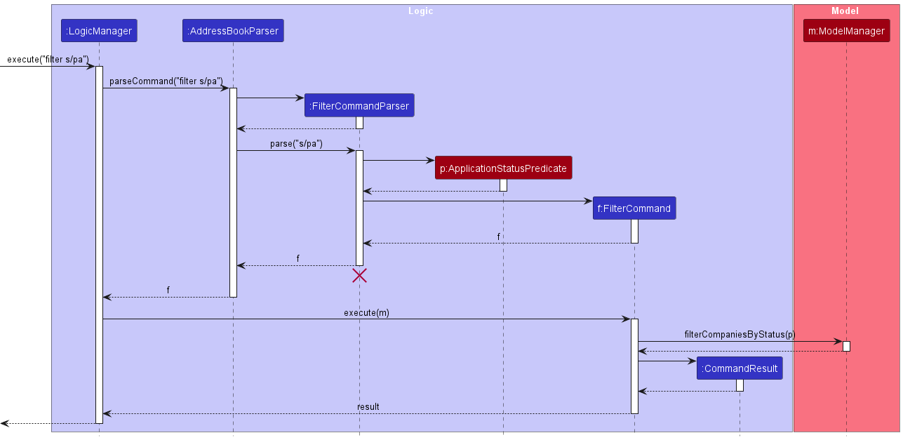

* Table of Contents
{:toc}

---

## **Design**

:bulb: **Tip:** The `.puml` files used to create diagrams in this document are in the `docs/diagrams` folder. Refer to the [_PlantUML Tutorial_ at se-edu/guides](https://se-education.org/guides/tutorials/plantUml.html) to learn how to create and edit diagrams.

### Architecture

The ***Architecture Diagram*** given above explains the high-level design of the app.

Given below is a quick overview of main components and how they interact with each other.

**Main components of the architecture**

**`Main`** (consisting of classes [`Main`](https://github.com/AY2324S1-CS2103-W14-3/tp/tree/master/src/main/java/swe/context/Main.java) and [`MainApp`](https://github.com/AY2324S1-CS2103-W14-3/tp/tree/master/src/main/java/swe/context/MainApp.java)) is in charge of the app launch and shut down.
* At app launch, it initializes the other components in the correct sequence, and connects them up with each other.
* At shut down, it shuts down the other components and invokes cleanup methods where necessary.

The bulk of the app's work is done by the following four components:

* [**`UI`**](#ui-component): The UI of the app.
* [**`Logic`**](#logic-component): The command executor.
* [**`Model`**](#model-component): Holds the data of the app in memory.
* [**`Storage`**](#storage-component): Reads data from, and writes data to, the hard disk.

[**`Commons`**](#common-classes) represents a collection of classes used by multiple other components.

**How the architecture components interact with each other**

The *Sequence Diagram* below shows how the components interact with each other for the scenario where the user issues the command `delete 1`.

Each of the four main components (also shown in the diagram above),

* defines its *API* in an `interface` with the same name as the Component.
* implements its functionality using a concrete `{Component Name}Manager` class (which follows the corresponding API `interface` mentioned in the previous point.

For example, the `Logic` component defines its API in the `Logic.java` interface and implements its functionality using the `LogicManager.java` class which follows the `Logic` interface. Other components interact with a given component through its interface rather than the concrete class (reason: to prevent outside component's being coupled to the implementation of a component), as illustrated in the (partial) class diagram below.

The sections below give more details of each component.

### UI component

The **API** of this component is specified in [`Ui.java`](https://github.com/AY2324S1-CS2103-W14-3/tp/tree/master/src/main/java/swe/context/ui/Ui.java)

The UI consists of a `MainWindow` that is made up of parts e.g.`CommandBox`, `ResultDisplay`, `ContactListPanel`, `StatusBarFooter` etc. All these, including the `MainWindow`, inherit from the abstract `UiPart` class which captures the commonalities between classes that represent parts of the visible GUI.

The `UI` component uses the JavaFx UI framework. The layout of these UI parts are defined in matching `.fxml` files that are in the `src/main/resources/view` folder. For example, the layout of the [`MainWindow`](https://github.com/AY2324S1-CS2103-W14-3/tp/tree/master/src/main/java/swe/context/ui/MainWindow.java) is specified in [`MainWindow.fxml`](https://github.com/AY2324S1-CS2103-W14-3/tp/tree/master/src/main/resources/view/MainWindow.fxml)

The `UI` component,

* executes user commands using the `Logic` component.
* listens for changes to `Model` data so that the UI can be updated with the modified data.
* keeps a reference to the `Logic` component, because the `UI` relies on the `Logic` to execute commands.
* depends on some classes in the `Model` component, as it displays `Contact` object residing in the `Model`.

### Logic component

**API** : [`Logic.java`](https://github.com/AY2324S1-CS2103-W14-3/tp/tree/master/src/main/java/swe/context/logic/Logic.java)

Here's a (partial) class diagram of the `Logic` component:

The sequence diagram below illustrates the interactions within the `Logic` component, taking `execute("delete 1")` API call as an example.

How the `Logic` component works:

1. When `Logic` is called upon to execute a command, it is passed to an `InputParser` object which in turn creates a parser that matches the command (e.g., `DeleteCommandParser`) and uses it to parse the command.
1. This results in a `Command` object (more precisely, an object of one of its subclasses e.g., `DeleteCommand`) which is executed by the `LogicManager`.
1. The command can communicate with the `Model` when it is executed (e.g. to delete a contact).
1. The result of the command execution is encapsulated as a `CommandResult` object which is returned back from `Logic`.

Here are the other classes in `Logic` (omitted from the class diagram above) that are used for parsing a user command:

How the parsing works:
* When called upon to parse a user command, the `InputParser` class creates an `XYZCommandParser` (`XYZ` is a placeholder for the specific command name e.g., `AddCommandParser`) which uses the other classes shown above to parse the user command and create a `XYZCommand` object (e.g., `AddCommand`) which the `InputParser` returns back as a `Command` object.
* All `XYZCommandParser` classes (e.g., `AddCommandParser`, `DeleteCommandParser`, ...) inherit from the `Parser` interface so that they can be treated similarly where possible e.g, during testing.

### Model component

**API** : [`Model.java`](https://github.com/AY2324S1-CS2103-W14-3/tp/tree/master/src/main/java/swe/context/model/Model.java)

The `Model` component,

* stores the contacts data i.e., all `Contact` objects (which are contained in a `UniqueContactList` object).
* stores the currently 'selected' `Contact` objects (e.g., results of a search query) as a separate _filtered_ list which is exposed to outsiders as an unmodifiable `ObservableList<Contact>` that can be 'observed' e.g. the UI can be bound to this list so that the UI automatically updates when the data in the list change.
* stores a `Settings` object that represents the user’s preferences. This is exposed to the outside as a `ReadOnlySettings` objects.
* does not depend on any of the other three components (as the `Model` represents data entities of the domain, they should make sense on their own without depending on other components)

### Storage component

**API** : [`Storage.java`](https://github.com/AY2324S1-CS2103-W14-3/tp/tree/master/src/main/java/swe/context/storage/Storage.java)

The `Storage` component,
* can save both contacts data and user preference data in JSON format, and read them back into corresponding objects.
* inherits from both `ContactsStorage` and `SettingsStorage`, which means it can be treated as either one (if only the functionality of only one is needed).
* depends on some classes in the `Model` component (because the `Storage` component's job is to save/retrieve objects that belong to the `Model`)

### Common classes

Classes used by multiple components are in the `swe.context.commons` package.

---

## **Implementation**

This section describes some noteworthy details on how certain features are implemented.

### Add feature

The add feature is facilitated by `ModelManager` and implements `Model`.

The following sequence diagram shows how the add command works:

It adds an contact by calling `Model#addContact`, which adds the newly created contact into the `UniqueContactList`.

The following activity diagram summarises what happens when a user executes a new command.

### Filter feature

The following sequence diagram shows how the add command works:

It filters contacts by calling `Model#setContactsFilter` with a `ContainsTagPredicate predicate` as argument, which sets the `predicate`
on the list of contacts in the `ModelManager`.

### Maintaining sorting while supporting filtering

The contact list is automatically kept in a constantly sorted state by leveraging `SortedList` from the JavaFX Collections library. Since the class works with `ObservableList`s, which the Model's `Contacts` also utilises, we are able to leverage this class more easily.

The Model obtains an unsorted, unmodifiable list from `Contacts` and wraps it in a `SortedList`. We specify an `AlphabeticalComparator` to define our own alphabetical sorting order, which takes capitalization into account. This facilitates the intended propagation of changes from the nested list to the sorted list.

For operability with the find feature, this sorted list is further wrapped in a `FilteredList` to limit the scope of what the user sees as needed. A dummy filter `Predicate` which allows all contacts to pass is used as the default filter. It is this filtered list that the model stores in a field.

### Edit feature

The edit feature is facilitated by `ModelManager` and implements `Model`.

It is similar in implementation to the add feature,
except it edits a contact by calling `Model#updateContact`,
which replaces the old contact with the edited contact in the `UniqueContactList`.

The following activity diagram summarises what happens when a user executes an edit command.

---

## **Acknowledgements**

- Libraries: [JavaFX](https://openjfx.io/), [Jackson](https://github.com/FasterXML/jackson), [JUnit5](https://github.com/junit-team/junit5)
- App icon from <http://www.mcdodesign.com/> by Susumu Yoshida
- Some code adapted from <http://code.makery.ch/library/javafx-8-tutorial/> by Marco Jakob

---

## **Appendix: Requirements**

### Product scope

**Target user profile**: NUS SoC students, who:

- Can type fast and prefer typing
- Are reasonably comfortable with command-line inputs
- Wish to label contacts by category (e.g. professors, classmates from certain courses, friends)
- Have many different ways to reach their contacts (e.g. social media like Telegram/Discord, additional phone numbers like house phone)

**Value proposition**: Manage contacts quickly via text commands, with useful features relevant to SoC students.

### User stories

Priorities: High (must have) - `* * *`, Medium (nice to have) - `* *`, Low (unlikely to have) - `*`

| Priority | As a …​                         | I want to …​                                                                         | So that I can…​                                                                 |
|----------|---------------------------------|--------------------------------------------------------------------------------------|---------------------------------------------------------------------------------|
| `* * *`  | user                            | add contacts                                                                         | keep track of my friends and schoolmates                                        |
| `* * *`  | user                            | delete contacts                                                                      | remove my contact with that person                                              |
| `* * *`  | user                            | view my contacts                                                                     | know who I have as contacts                                                     |
| `* * `   | user                            | update contacts                                                                      | make changes to my contact info when they occur                                 |
| `* *`    | user                            | search for contacts                                                                  | find a specific contact directly and easily                                     |
| `* *`    | potential user                  | access an easy-to-follow tutorial                                                    | understand the app's core features                                              |
| `* *`    | user                            | add tags to contacts                                                                 | classify them based on contact type                                             |
| `* *`    | user                            | attach images to contacts such as a business card scan                               | store all additional or miscellaneous info about a contact                      |
| `* *`    | user                            | share a contact with other users or apps                                             | transfer my contact info easily                                                 |
| `* *`    | user                            | merge duplicate contacts                                                             | my contact list stays clean                                                     |
| `* *`    | user                            | sort contacts by certain criteria                                                    | find contacts satisfying a certain criteria easily                              |
| `* *`    | user of many communication apps | enter info about various platforms that my contacts use                              | keep track of all the various ways I can contact the same person                |
| `* *`    | user                            | indicate whether a contact is from NUS or not                                        | differentiate between NUS and non-NUS contacts                                  |
| `* *`    | user                            | enter names in a different format depending on contact type                          | maintain respect based on profession (e.g. prefix a professor's name with Prof) |
| `* *`    | user                            | see my contacts in different formats depending on their profession                   | easily differentiate them in a familiar way                                     |
| `* *`    | user                            | indicate where I met each contact                                                    | keep track of people I have various levels of familiarity with                  |
| `* *`    | user                            | view contacts by groups or type                                                      | more easily manage related contacts                                             |
| `* *`    | user                            | indicate where I met each contact                                                    | keep track of people I have various levels of familiarity with                  |
| `* *`    | new user                        | perform functions to a satisfying degree despite only using simple or basic commands | use the app without a steep learning curve                                      |
| `* *`    | long-time user                  | identify old and/or rarely-used contacts                                             | hide or delete them to reduce clutter                                           |
| `* *`    | user                            | export my contacts to an external file                                               | backup my contacts’ information                                                 |
| `* *`    | user                            | import my contacts from an external file                                             | quickly populate the app with my existing contacts                              |
| `*`      | user who prefers CLI            | use keyboard shortcuts                                                               | perform tasks more efficiently                                                  |
| `*`      | user                            | see a different background colour for each contact                                   | differentiate between contacts more easily                                      |
| `*`      | power user with many contacts   | use some scripting capabilities                                                      | automate tedious actions or achieve the exact results I specify                 |
| `*`      | busy user                       | use icons to denote certain contact information                                      | identify the information I want at a glance                                     |
| `*`      | user                            | see a log of past interactions with a contact                                        | know my history with my contacts                                                |
| `*`      | advanced user                   | search/filter by specific parts of contacts (e.g. containing certain words)          | narrow down contacts to exactly what I am looking for                           |
| `*`      | user who prefers CLI            | switch between previously entered commands in history                                | easily repeat previous commands                                                 |
| `*`      | infrequent user                 | view a “cheatsheet” or help dialog for the text commands                             | remember some basic commands I may have forgotten                               |

### Use cases

(For all use cases below, the **System** is the `ConText` and the **Actor** is the `user`, unless specified otherwise)

**Use case: UC01 - Add a contact**

**MSS**

1.  User requests to add a contact.
2.  ConText adds the contact.

    Use case ends.

**Extensions**

* 1a. The given data is invalid.

  * 1a1. ConText shows an error message.

    Use case resumes at step 1.

**Use case: UC02 - Delete a contact**

**MSS**

1. User requests to view the list of contacts (UC03).
2. User requests to delete a specific contact in the list.
3. ConText deletes the contact.

    Use case ends.

**Extensions**

* 2a. The given index is invalid.

  * 2a1. ConText shows an error message.
  
    Use case resumes at step 2.

**Use case: UC03 - List all contacts**

**MSS**

1. User requests to list contacts.
2. ConText shows a list of contacts.

**Extensions**

* 2a. The list is empty.

    Use case ends

**Use case: UC04 - Edit a contact**

**MSS**

1. User requests to view the list of contacts (UC03).
2. User requests to edit a contact.
3. ConText edits the contact.

    Use case ends.

**Extensions**

* 2a. The given index is invalid.

  * 2a1. ConText shows an error message.
    
    Use case resumes at step 2.

* 2b. The given data is incorrect.

  * 2b1. ConText shows an error message.
    
    Use case resumes at step 2.

**Use case: UC05 - Clear all contacts**

**MSS**

1. User requests to clear all contacts.
2. ConText clears all contacts.

    Use case ends.

**Use case: UC06 - Find a contact**

**MSS**

1. User requests to find a contact.
2. ConText displays a list of contacts matching the given data.

    Use case ends.

**Extensions**

* 2a. The filtered list is empty.

  Use case ends

**Use case: UC07 - Filter tags**

1. User requests to filter the list contacts.
2. ConText displays a filtered list of contacts based on the given tag.

**Extensions**

* 2a. The filtered list is empty.

  Use case ends

*{More to be added}*

### Non-functional Requirements

1. "Brownfield" - Changes to the codebase must be done in small increments.
1. "Typing preferred" - The product must target users who can type fast and prefer CLI as their means of input.
1. "Single user" - The product must be designed for a single user.
1. "Incremental" - The product must be developed breadth-first as well as consistently each week.
1. "Human editable file" - Data must be stored locally in a human-editable text file format.
1. "No DBMS" - DataBase Management Systems must not be used.
1. "OO" - Software must mostly follow the object-oriented paradigm.
1. "Platform independent" - Software must work on Windows, Linux, and OSX. I.e., avoid OS-dependent libraries and OS-specific features.
1. "Java version" - Software must work on a computer that has Java version 11 installed.
1. "Portable" - Software must work without requiring an installer.
1. "No remote server" - Software must not depend on a remote server.
1. "External software" - Any 3rd party frameworks/libraries/services used must:
    1. Be free and open-source (except services), with permissive license terms (e.g. non-time limited trial).
    1. Not require installation by users. Services that require account creation on their 3rd party service are strongly discouraged.
    1. Not violate other project constraints.
    1. Be approved by the teaching team.
1. "Screen resolution" - GUI must work well for standard screen resolutions and scales, as specified in the admin info. GUI must still be usable if those factors are non-standard.
1. "Single file" - Software must all be packed into a single JAR file.
1. "File size" - Software must not exceed 100MB and must not be unnecessarily bloated. Documents must not exceed 15MB per file.
1. "PDF-friendly" - Developer and user guides must be PDF-friendly, without using expandable panels, embedded videos, animated GIFs etc.
1. "Minimal network" - Any public APIs used should have a fallback mechanism in the event that they are down. Any NUS data used should have the approval of NUS IT.
1. "Testability" - Features should not be hard to test or make the product hard to test, be the testing manual or automated.
1. "CLI first" - Users who can type fast should be able to accomplish most tasks faster via the CLI as compared to if they were to use a hypothetical GUI-only version of the product.
1. There must exist an image with the exact name and format `docs/images/Ui.png` depicting the final product, with similar proportions as the original AB3 image.
1. There must exist an `AboutUs` page that closely follows the original template, such that CS2103 grading scripts can understand it.
    1. Each team member must have an appropriately named lowercase PNG of their profile picture, as specified in the admin info.
1. There must exist Project Portfolio Pages (PPPs) in `docs/team/`, containing sections specified in the admin info.
    1. Each team member must have their own appropriately named lowercase page file, as specified in the admin info.
    1. The page must be written to account for paged PDF conversion.
1. Documentation must be built using Jekyll or MarkBind, then hosted via GitHub Pages, such that they are compatible with CS2103 grading scripts.
1. Branches must not be deleted after their associated PRs have been merged, so that CS2103 grading scripts can detect that the correct workflow was used.
1. The `README.md` must acknowledge SE-EDU's AB3, which this project is based on. It should also contain the `Ui.png`, as well as the repo's GitHub Actions build status badge.

### Glossary

* **Architecture Diagram**: A visual representation that depicts the high-level design and structure of the software application.

* **Component**: A modular part of the system with a distinct responsibility. The main components mentioned are UI, Logic, Model, and Storage.

* **Commons**: Classes or utilities used by multiple components of the application.

* **UI (User Interface)**: The space where interactions between humans and the software occur. The goal of this interaction is to allow effective operation and control of the machine from the human end.

* **GUI (Graphical User Interface)**: A type of user interface that allows users to interact with electronic devices through graphical elements such as images, buttons, icons, and windows instead of text-based command lines.

* **Logic**: In the context of software, it refers to the set of rules and algorithms that process and respond to user inputs.

* **Model**: The part of the application that manages data and application logic.

* **Storage**: The part of the application responsible for saving and loading data to and from persistent storage.

* **API (Application Programming Interface)**: A set of rules and tools that allows different software applications to communicate with each other. In this context, it refers to the interfaces defined for each component, such as `Logic.java`, `Model.java`, etc.

* **Sequence Diagram**: A type of UML diagram that shows how objects interact in a specific order.

* **UML (Unified Modeling Language)**: A standardized modeling language enabling developers to specify, visualize, construct, and document artifacts of a software system.

* **PlantUML**: A tool that allows users to create UML diagrams using a simple and intuitive language.

* **`puml` files**: Files written in a text-based markup language used by PlantUML to generate UML diagrams.

* **MSS (Main Success Scenario)**: Represents the sequence of steps that describe a successful execution of a use case.

* **CLI (Command Line Interface)**: A user interface that allows users to interact with the software by typing text-based commands.

* **JavaFX**: A Java library used to create desktop applications. It is used for designing the user interface of this application.

* **ObservableList**: A list that allows listeners to track changes when they occur. Used in the context of JavaFX to automatically update the UI when the data changes.

* **JSON (JavaScript Object Notation)**: A lightweight data-interchange format that is easy for humans to read and write and easy for machines to parse and generate. Used for storing data in this application.

* **JUnit**: A testing framework for Java programming language. JUnit5 refers to the fifth major version of this framework.

* **Predicate**: A functional interface that represents a condition (test) and is used to filter data.

* **Brownfield**: A term used in software development to describe a project that has existing constraints, typically an existing system or codebase, as opposed to a greenfield project which starts from scratch.

* **Platform independent**: Software that can run on any computer regardless of its operating system, such as Mac/Windows/Linux.

* **Human editable file**: A file format designed to be easily readable and editable by humans.

* **Portable**: Software that doesn't require installation and can be run from any location, such as from a USB stick.

---

## **Appendix: Instructions for manual testing**

//TODO

Given below are instructions to test the app manually.

:information_source: **Note:** These instructions only provide a starting point for testers to work on;
testers are expected to do more *exploratory* testing.

### Launch and shutdown

1. Initial launch

   1. Download the jar file and copy into an empty folder

   1. Double-click the jar file Expected: Shows the GUI with a set of sample contacts. The window size may not be optimum.

1. Saving window preferences

   1. Resize the window to an optimum size. Move the window to a different location. Close the window.

   1. Re-launch the app by double-clicking the jar file. 
       Expected: The most recent window size and location is retained.

1. _{ more test cases …​ }_

### Deleting a contact

1. Deleting a contact while all contacts are being shown

   1. Prerequisites: List all contacts using the `list` command. Multiple contacts in the list.

   1. Test case: `delete 1` 
      Expected: First contact is deleted from the list. Details of the deleted contact shown in the status message. Timestamp in the status bar is updated.

   1. Test case: `delete 0` 
      Expected: No contact is deleted. Error details shown in the status message. Status bar remains the same.

   1. Test case: `delete 1 2 3` 
      Expected: First, second, and third contacts are deleted from the list. Details of the deleted contacts shown in the status message. Timestamp in the status bar is updated.

   1. Test case: `delete 1 1 2` 
      Expected: First and second contacts are deleted from the list without duplication. Details of the deleted contacts shown in the status message. Timestamp in the status bar is updated.

   1. Other incorrect delete commands to try: `delete`, `delete x`, `...` (where x is larger than the list size) 
      Expected: Similar to previous.

1. _{ more test cases …​ }_

### Saving data

1. Dealing with missing/corrupted data files

   1. _{explain how to simulate a missing/corrupted file, and the expected behavior}_

1. _{ more test cases …​ }_

## **Appendix: Effort**

//TODO

## **Appendix: Planned enhancements**

1. Add a boolean field to the `DeleteCommand` class to indicate whether the user has entered duplicate indices in the command. If so, display an additional message to remind the user about the duplication.
