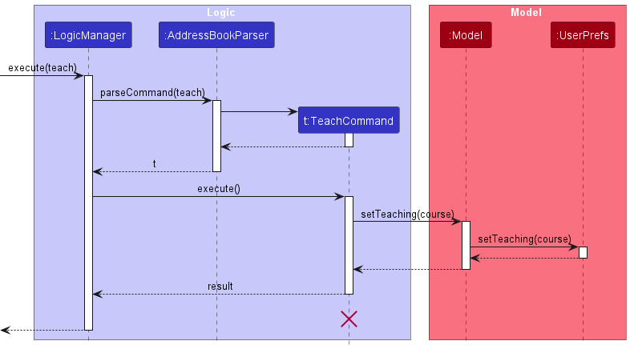
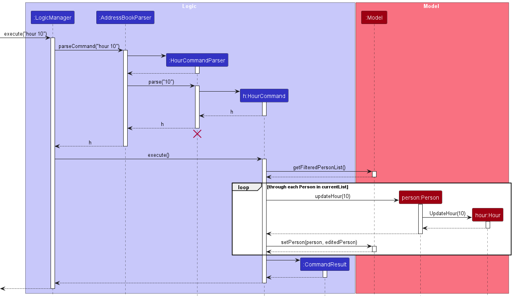

* Table of Contents
{:toc}

--------------------------------------------------------------------------------------------------------------------

## **Setting up, getting started**

Refer to the guide [_Setting up and getting started_](SettingUp.md).

--------------------------------------------------------------------------------------------------------------------

## **Design**

### Architecture

The ***Architecture Diagram*** given above explains the high-level design of the App.

Given below is a quick overview of main components and how they interact with each other.

**Main components of the architecture**

**`Main`** (consisting of classes [`Main`](https://github.com/AY2324S1-CS2103T-T10-1/tp/blob/master/src/main/java/seedu/address/Main.java) and [`MainApp`](https://github.com/AY2324S1-CS2103T-T10-1/tp/blob/master/src/main/java/seedu/address/MainApp.java)) is in charge of the app launch and shut down.
* At app launch, it initializes the other components in the correct sequence, and connects them up with each other.
* At shut down, it shuts down the other components and invokes cleanup methods where necessary.

The bulk of the app's work is done by the following four components:

* [**`UI`**](#ui-component): The UI of the App.
* [**`Logic`**](#logic-component): The command executor.
* [**`Model`**](#model-component): Holds the data of the App in memory.
* [**`Storage`**](#storage-component): Reads data from, and writes data to, the hard disk.

[**`Commons`**](#common-classes) represents a collection of classes used by multiple other components.

**How the architecture components interact with each other**

The *Sequence Diagram* below shows how the components interact with each other for the scenario where the user issues the command `delete 1`.

Each of the four main components (also shown in the diagram above),

* defines its *API* in an `interface` with the same name as the Component.
* implements its functionality using a concrete `{Component Name}Manager` class (which follows the corresponding API `interface` mentioned in the previous point.

For example, the `Logic` component defines its API in the `Logic.java` interface and implements its functionality using the `LogicManager.java` class which follows the `Logic` interface. Other components interact with a given component through its interface rather than the concrete class (reason: to prevent outside component's being coupled to the implementation of a component), as illustrated in the (partial) class diagram below.

The sections below give more details of each component.

### UI component

The **API** of this component is specified in [`Ui.java`](https://github.com/AY2324S1-CS2103T-T10-1/tp/blob/master/src/main/java/seedu/address/ui/Ui.java)

The UI consists of a `MainWindow` that is made up of parts e.g.`CommandBox`, `ResultDisplay`, `PersonListPanel`, `StatusBarFooter` etc. All these, including the `MainWindow`, inherit from the abstract `UiPart` class which captures the commonalities between classes that represent parts of the visible GUI.

The `UI` component uses the JavaFx UI framework. The layout of these UI parts are defined in matching `.fxml` files that are in the `src/main/resources/view` folder. For example, the layout of the [`MainWindow`](https://github.com/AY2324S1-CS2103T-T10-1/tp/blob/master/src/main/java/seedu/address/ui/MainWindow.java) is specified in [`MainWindow.fxml`](https://github.com/AY2324S1-CS2103T-T10-1/tp/blob/master/src/main/resources/view/MainWindow.fxml)

The `UI` component,

* executes user commands using the `Logic` component.
* listens for changes to `Model` data so that the UI can be updated with the modified data.
* keeps a reference to the `Logic` component, because the `UI` relies on the `Logic` to execute commands.
* depends on some classes in the `Model` component, as it displays `Person` object residing in the `Model`.

### Logic component

**API** : [`Logic.java`](https://github.com/AY2324S1-CS2103T-T10-1/tp/blob/master/src/main/java/seedu/address/logic/Logic.java)

Here's a (partial) class diagram of the `Logic` component:

The sequence diagram below illustrates the interactions within the `Logic` component, taking `execute("delete 1")` API call as an example.

:information_source: **Note:** The lifeline for `DeleteCommandParser` should end at the destroy marker (X) but due to a limitation of PlantUML, the lifeline reaches the end of diagram.

How the `Logic` component works:

1. When `Logic` is called upon to execute a command, it is passed to an `AddressBookParser` object which in turn creates a parser that matches the command (e.g., `DeleteCommandParser`) and uses it to parse the command.
1. This results in a `Command` object (more precisely, an object of one of its subclasses e.g., `DeleteCommand`) which is executed by the `LogicManager`.
1. The command can communicate with the `Model` when it is executed (e.g. to delete a person).
1. The result of the command execution is encapsulated as a `CommandResult` object which is returned back from `Logic`.

Here are the other classes in `Logic` (omitted from the class diagram above) that are used for parsing a user command:

How the parsing works:
* When called upon to parse a user command, the `AddressBookParser` class creates an `XYZCommandParser` (`XYZ` is a placeholder for the specific command name e.g., `AddCommandParser`) which uses the other classes shown above to parse the user command and create a `XYZCommand` object (e.g., `AddCommand`) which the `AddressBookParser` returns back as a `Command` object.
* All `XYZCommandParser` classes (e.g., `AddCommandParser`, `DeleteCommandParser`, ...) inherit from the `Parser` interface so that they can be treated similarly where possible e.g, during testing.

### Model component
**API** : [`Model.java`](https://github.com/AY2324S1-CS2103T-T10-1/tp/blob/master/src/main/java/seedu/address/model/Model.java)

The `Model` component,

* stores the address book data i.e., all `Person` objects (which are contained in a `UniquePersonList` object), and all `Course` objects (which are contained in a `UniqueCourseList` object).
* stores the currently 'selected' `Person` objects (e.g., results of a search query) as a separate _filtered_ list which is exposed to outsiders as an unmodifiable `ObservableList<Person>` that can be 'observed' e.g. the UI can be bound to this list so that the UI automatically updates when the data in the list change.
* stores a `UserPref` object that represents the user’s preferences. This is exposed to the outside as a `ReadOnlyUserPref` objects.
* does not depend on any of the other three components (as the `Model` represents data entities of the domain, they should make sense on their own without depending on other components)

### Storage component

**API** : [`Storage.java`](https://github.com/AY2324S1-CS2103T-T10-1/tp/blob/master/src/main/java/seedu/address/storage/Storage.java)

The `Storage` component,
* can save address book data, user preference data and courses data in JSON format, and read them back into corresponding objects.
* inherits from `AddressBookStorage`, `UserPrefStorage` and `CoursesStorage`, which means it can be treated as any of them (if only the functionality of only one is needed).
* depends on some classes in the `Model` component (because the `Storage` component's job is to save/retrieve objects that belong to the `Model`)

### Common classes

Classes used by multiple components are in the `seedu.addressbook.commons` package.

--------------------------------------------------------------------------------------------------------------------

## **Implementation**

This section describes some noteworthy details on how certain features are implemented.

### Find Availability Feature

**API** : [`FreeTime.java`](https://github.com/AY2324S1-CS2103T-T10-1/tp/blob/master/src/main/java/seedu/address/model/availability/FreeTime.java)

#### Implementation

To find a suitable replacement TA, the user needs to know the availability of the TAs.
As such we need to have classes that represent the time and availability.

`TimeInterval` is used to represent a period of time.
A `TimeInterval` is only considered valid if the end time is after the start time.

`FreeTime` is used to represent a TA's availability in the week.
We assume that TAs are only available during weekdays, so each `FreeTime` consist of 5
`TimeInterval`s where each `TimeInterval` represents a day in the week.

The following class diagram illustrates the structure of `FreeTime`.

`EMPTY_FREE_TIME` will be assigned to TAs that do not have availability information.

Valid input to `FreeTime#getDay(day)` are integers from [1,5] where 1 represents Monday, 2 represents Tuesday and so on.

`TimeInterval#GetFrom()` and `TimeInterval#GetTo()` represents the string representation of time in `HH:mm` format.

### Finding TA feature

#### Implementation

The finding TA feature allows users to search for a specific TA, using various filters
such as name, course and free time. With this feature, users can easily search for TAs
that fall under a certain set of filters.

To key in the command, type `find n/alex c/cs2103t d/1 from/12:00 to/14:00`. This will
search for all TAs with the name `alex` and course `cs2103t` that are free from `12:00`
to `14:00` on Monday.

The following sequence diagram displays how the finding TA feature is implemented.

### Teaching course Feature

#### Implementation

The teaching course feature allows users to enter the specific course they are teaching
and store the information in `UserPrefs`. With this feature, users can easily browse
through the list of TAs teaching under them.

To key in the command, type `teach t/courseName`. This will set the default teaching
course for the users and save it in UserPrefs.

Hence, the next time users log into TAManager, the page will automatically display the
TAs teaching under the users' course.

The following sequence diagram displays how the teaching course feature is implemented.

### Updating Hour Feature

#### Implementation

The updating hour feature allows users to update hours for all the TAs in the current list.
This feature allows users to easily update the working hours for TAs in batches. This feature
can be applied concurrently with the `find` command allowing users to update working hours for
filtered target users.

To key in the command, type `hour 10`. This will increase the working hours of all TAs in the
current list by 10, while others not showing in the list will not be changed. Similarly, users
can type `hour -10` and hours for TAs in the current users will be decreased by 10. The updated
hour must be within the valid range(0 - 9999).

The following sequence diagram displays how updating hour Feature is implemented.

--------------------------------------------------------------------------------------------------------------------

## **Documentation, logging, testing, configuration, dev-ops**

* [Documentation guide](Documentation.md)
* [Testing guide](Testing.md)
* [Logging guide](Logging.md)
* [Configuration guide](Configuration.md)
* [DevOps guide](DevOps.md)

--------------------------------------------------------------------------------------------------------------------

## **Appendix: Requirements**

### Product scope

**Target user profile**:

* SoC professor
* has a need to manage a significant number of teaching assistants (TAs)
* prefer desktop apps over other types
* can type fast
* prefers typing to mouse interactions
* is reasonably comfortable using CLI apps

**Value proposition**:
* Fast access to TA contact details and availability
* Track teaching hours conveniently
* Easily view course information and TAs for the course

### User stories

Priorities: High (must have) - `* * *`, Medium (nice to have) - `* *`, Low (unlikely to have) - `*`

| Priority | As a …​ | I want to …​                                                 | So that I can…​                                        |
|----------|---------|--------------------------------------------------------------|--------------------------------------------------------|
| `* * *`  | user    | see usage instructions                                       | refer to instructions when I forget how to use the App |
| `* * *`  | user    | add new TA to my address book                                |                                                        |
| `* * *`  | user    | remove a TA from my address book                             | remove entries that I no longer need                   |
| `* * *`  | user    | view all TAs in my address book                              |                                                        |
| `* *`    | user    | add a TA’s email address and telegram handle                 | facilitate communication with that TA                  |
| `* *`    | user    | update the contact information of my TA                      | ensure I have the latest contact information           |
| `* *`    | user    | update the availability of my TA                             | contact the TA for replacement sessions if needed      |
| `* *`    | user    | update the teaching hours of my TA                           | keep track of the TA's teaching hours                  |
| `* *`    | user    | update the tags and courses of my TA                         | keep track of the TA's responsibilities                |
| `* *`    | user    | have my records saved for the next session                   | use the information over multiple sessions             |
| `*`      | user    | find a TA by name                                            | find the contact details of a specific TA              |
| `*`      | user    | find a TA by course                                          | focus on management of a specific course               |
| `*`      | user    | find a TA by tag                                             | easily sort my TAs                                     |
| `* `     | user    | find a TA by free time                                       | find potential replacement TAs                         |
| `*`      | user    | set a course to prioritise                                   | filter TAs on startup and save time                    |
| `*`      | user    | remove my prioritised course                                 | view all TAs on startup                                |
| `*`      | user    | view the list of courses I'm teaching and their assigned TAs | filter TAs based on the courses they can teach         |
| `*`      | user    | view the lesson timeslots of my course                       | plan for TA availability around these timeslots        |
| `*`      | user    | use a prepopulated data file                                 | skip the process of populating the data manually       |

### Use cases

(For all use cases below, the **System** is the `TAManager` and the **Actor** is the `user`, unless specified otherwise)

**Use case: Delete a TA**

**MSS**

1.  User requests to list TAs
2.  TAManager shows a list of TAs
3.  User requests to delete a specific TA in the list
4.  TAManager deletes the TA

    Use case ends.

**Extensions**

* 2a. The list is empty.

  Use case ends.

* 3a. The given index is invalid.

    * 3a1. TAManager shows an error message.

      Use case resumes at step 2.

--------------------------------------------------------------------------------------------------------------------

**Use case: Update Contact Information**

**MSS**

1.  User requests to list TAs
2.  TAManager shows a list of TAs
3.  User requests to update the contact of a specific TA in the list and key in the necessary information
4.  TAManager updates the contact information of that TA

    Use case ends.

**Extensions**

* 2a. The list is empty.

  Use case ends.

* 3a. The given index is invalid.

    * 3a1. TAManager shows an error message.

      Use case resumes at step 2.
* 3b. The given contact information is invalid.
  * 3b1. TAManager shows an error message.

    Use case resumes at step 2.

--------------------------------------------------------------------------------------------------------------------

**Use case: View TAs of specific course**

**MSS**

1.  User requests to list courses
2.  TAManager shows a list of courses
3.  User requests to show TAs of a specific course
4.  TAManager shows a list of TAs of specific course

    Use case ends.

**Extensions**

* 2a. The list is empty.

  Use case ends.

* 3a. The given course is invalid.

    * 3a1. TAManager shows an error message.

      Use case resumes at step 2.

--------------------------------------------------------------------------------------------------------------------

**Use case: Update Availability**

**MSS**

1.  User requests to list TAs
2. TAManager shows a list of TAs
3. User requests to update the availability of a specific TA in the list and key in the necessary information
4. TAManager updates the availability of that TA

    Use case ends.

**Extensions**

* 2a. The list is empty.

  Use case ends.

* 3a. The given index is invalid.

    * 3a1. TAManager shows an error message.

      Use case resumes at step 2.

* 3b. The given availability is invalid.
  * 3b1. TAManager shows an error message.

    Use case resumes at step 2.

### Non-Functional Requirements

1.  Should work on any _mainstream OS_ as long as it has Java `11` or above installed.
2.  Should be able to hold up to 1000 TA entries without a noticeable sluggishness in performance for typical usage.
3.  A user with above average typing speed for regular English text (i.e. not code, not system admin commands) should be able to accomplish most of the tasks faster using commands than using the mouse.
4.  Data should persist across user sessions
5.  Project should be able to handle information from across academic years
6.  Project should be able to handle any invalid input without crashing

### Glossary

* **Course**: A program students are enrolled in to work towards a degree
* **Teaching Assistant (TA)**: Students who support the teaching of a course
* **Mainstream OS**: Windows, Linux, Unix, OS-X
* **Availability**: The time slots a TA is available for teaching (e.g. 9am-12pm on Monday, 2pm-5pm on Tuesday)

--------------------------------------------------------------------------------------------------------------------

## **Appendix: Instructions for manual testing**

Given below are instructions to test the app manually.

:information_source: **Note:** These instructions only provide a starting point for testers to work on;
testers are expected to do more *exploratory* testing.

### Launch and shutdown

1. Initial launch

   1. Download the jar file and copy into an empty folder

   2. Double-click the jar file Expected: Shows the GUI with a set of sample contacts. The window size may not be optimum.

2. Saving window preferences

   1. Resize the window to an optimum size. Move the window to a different location. Close the window.

   2. Re-launch the app. 
       Expected: The most recent window size and location is retained.

3. Saving teaching course preferences

   1. Type `teach t/cs2103t` in the command box and press Enter. 
      Expected: The default teaching course is set to `CS2103T`.

   2. Close the window and re-launch the app. 
      Expected: The default teaching course remains as `CS2103T` and list of TAs only contains those teaching CS2103T.

### Deleting a person

1. Deleting a person while all persons are being shown

   1. Prerequisites: List all persons using the `list` command. Multiple persons in the list.

   2. Test case: `delete 1` 
      Expected: First contact is deleted from the list. Details of the deleted contact shown in the status message. Timestamp in the status bar is updated.

   3. Test case: `delete 0` 
      Expected: No person is deleted. Error details shown in the status message. Status bar remains the same.

   4. Other incorrect delete commands to try: `delete`, `delete x`, `...` (where x is larger than the list size) 
      Expected: Similar to previous.

### Saving data

1. Dealing with missing/corrupted data files

   1. Modify `addressbook.json` file to corrupt the data inside (e.g. remove a closing brace). 
      Expected: App starts up with an empty address book.

   2. Modify `courses.json` file to corrupt the data inside (e.g. remove a closing brace). 
      Expected: App starts up with an empty address book.

2. Restarting with clean data files

   1. Delete `addressbook.json` and `courses.json` files. 
      Expected: New json files are created with sample data.
