* Table of Contents
{:toc}

--------------------------------------------------------------------------------------------------------------------

## **Acknowledgements**

* This project uses a third-party library called [itext7](https://github.com/itext/itext7), which can help the target user of our app, HR managers, to easily generate payslips as PDF files. `itext7` is released under the [AGPL license](https://github.com/itext/itext7/blob/develop/LICENSE.md).
* This project also uses a third-party library called [JavaWuzzy](https://github.com/xdrop/fuzzywuzzy#javawuzzy). It is released under the [GNU General Public License v2.0](https://github.com/xdrop/fuzzywuzzy/blob/master/LICENSE).
  * Our user needs to type the reason for a deduction or benefit added. With this library used, they do not need to type the exact wording of the reasons in order to match the Reason enum. 

--------------------------------------------------------------------------------------------------------------------

## **Setting up, getting started**

Refer to the guide [_Setting up and getting started_](SettingUp.md).

--------------------------------------------------------------------------------------------------------------------

## **Design**

:bulb: **Tip:** The `.puml` files used to create diagrams in this document `docs/diagrams` folder. Refer to the [_PlantUML Tutorial_ at se-edu/guides](https://se-education.org/guides/tutorials/plantUml.html) to learn how to create and edit diagrams.

### Architecture

The ***Architecture Diagram*** given above explains the high-level design of the App.

Given below is a quick overview of main components and how they interact with each other.

**Main components of the architecture**

**`Main`** (consisting of classes [`Main`](https://github.com/AY2324S1-CS2103T-W12-2/tp/tree/master/src/main/java/seedu/address/Main.java) and [`MainApp`](https://github.com/AY2324S1-CS2103T-W12-2/tp/tree/master/src/main/java/seedu/address/MainApp.java)) is in charge of the app launch and shut down.
* At app launch, it initializes the other components in the correct sequence, and connects them up with each other.
* At shut down, it shuts down the other components and invokes cleanup methods where necessary.

The bulk of the app's work is done by the following four components:

* [**`UI`**](#ui-component): The UI of the App.
* [**`Logic`**](#logic-component): The command executor.
* [**`Model`**](#model-component): Holds the data of the App in memory.
* [**`Storage`**](#storage-component): Reads data from, and writes data to, the hard disk.

[**`Commons`**](#common-classes) represents a collection of classes used by multiple other components.

**How the architecture components interact with each other**

The *Sequence Diagram* below shows how the components interact with each other for the scenario where the user issues the command `delete 1`.

Each of the four main components (also shown in the diagram above),

* defines its *API* in an `interface` with the same name as the Component.
* implements its functionality using a concrete `{Component Name}Manager` class (which follows the corresponding API `interface` mentioned in the previous point.

For example, the `Logic` component defines its API in the `Logic.java` interface and implements its functionality using the `LogicManager.java` class which follows the `Logic` interface. Other components interact with a given component through its interface rather than the concrete class (reason: to prevent outside component's being coupled to the implementation of a component), as illustrated in the (partial) class diagram below.

The sections below give more details of each component.

### UI component

The **API** of this component is specified in [`Ui.java`](https://github.com/AY2324S1-CS2103T-W12-2/tp/tree/master/src/main/java/seedu/address/ui/Ui.java)

The UI consists of a `MainWindow` that is made up of parts e.g.`CommandBox`, `ResultDisplay`, `PersonListPanel`, `StatusBarFooter` etc. Most of these, excluding the `ClockComponent`, `CalendarComponent` and `YearMonthComponent`, inherit from the abstract `UiPart` class which captures the commonalities between classes that represent parts of the visible GUI.

The `UI` component uses the JavaFx UI framework. The layout of these UI parts are defined in matching `.fxml` files that are in the `src/main/resources/view` folder. For example, the layout of the [`MainWindow`](https://github.com/se-edu/addressbook-level3/tree/master/src/main/java/seedu/address/ui/MainWindow.java) is specified in [`MainWindow.fxml`](https://github.com/se-edu/addressbook-level3/tree/master/src/main/resources/view/MainWindow.fxml)

The `UI` component,

* executes user commands using the `Logic` component.
* listens for changes to `Model` data so that the UI can be updated with the modified data.
* develops a live clock feature to provide users with a convenient visual representation of the current time while efficiently managing employee data.
* produces a calendar function, allowing users to easily observe the daily count of employees on leave.
* keeps a reference to the `Logic` component, because the `UI` relies on the `Logic` to execute commands.
* depends on some classes in the `Model` component, as it displays `Person` object residing in the `Model`.

### Logic component

**API** : [`Logic.java`](https://github.com/AY2324S1-CS2103T-W12-2/tp/tree/master/src/main/java/seedu/address/logic/Logic.java)

Here's a (partial) class diagram of the `Logic` component:

The sequence diagram below illustrates the interactions within the `Logic` component, taking `execute("delete 1")` API call as an example.

:information_source: **Note:** The lifeline for `DeleteCommandParser` should end at the destroy marker (X) but due to a limitation of PlantUML, the lifeline reaches the end of diagram.

How the `Logic` component works:

1. When `Logic` is called upon to execute a command, it is passed to an `AddressBookParser` object which in turn creates a parser that matches the command (e.g., `DeleteCommandParser`) and uses it to parse the command.
1. This results in a `Command` object (more precisely, an object of one of its subclasses e.g., `DeleteCommand`) which is executed by the `LogicManager`.
1. The command can communicate with the `Model` when it is executed (e.g. to delete a person).
1. The result of the command execution is encapsulated as a `CommandResult` object which is returned back from `Logic`.

Here are the other classes in `Logic` (omitted from the class diagram above) that are used for parsing a user command:

How the parsing works:
* When called upon to parse a user command, the `AddressBookParser` class creates an `XYZCommandParser` (`XYZ` is a placeholder for the specific command name e.g., `AddCommandParser`) which uses the other classes shown above to parse the user command and create a `XYZCommand` object (e.g., `AddCommand`) which the `AddressBookParser` returns back as a `Command` object.
* All `XYZCommandParser` classes (e.g., `AddCommandParser`, `DeleteCommandParser`, ...) inherit from the `Parser` interface so that they can be treated similarly where possible e.g, during testing.

### Model component
**API** : [`Model.java`](https://github.com/AY2324S1-CS2103T-W12-2/tp/tree/master/src/main/java/seedu/address/model/Model.java)

The `Model` component,

* stores the address book data i.e., all `Person` objects (which are contained in a `UniquePersonList` object).
* stores the currently 'selected' `Person` objects (e.g., results of a search query) as a separate _filtered_ list which is exposed to outsiders as an unmodifiable `ObservableList<Person>` that can be 'observed' e.g. the UI can be bound to this list so that the UI automatically updates when the data in the list change.
* stores a `UserPref` object that represents the user’s preferences. This is exposed to the outside as a `ReadOnlyUserPref` objects.
* does not depend on any of the other three components (as the `Model` represents data entities of the domain, they should make sense on their own without depending on other components)

### Storage component

**API** : [`Storage.java`](https://github.com/AY2324S1-CS2103T-W12-2/tp/tree/master/src/main/java/seedu/address/storage/Storage.java)

The `Storage` component,
* can save both address book data and user preference data in JSON format, and read them back into corresponding objects.
* inherits from both `AddressBookStorage` and `UserPrefStorage`, which means it can be treated as either one (if only the functionality of only one is needed).
* depends on some classes in the `Model` component (because the `Storage` component's job is to save/retrieve objects that belong to the `Model`)

### Common classes

Classes used by multiple components are in the `seedu.addressbook.commons` package.

--------------------------------------------------------------------------------------------------------------------

## **Implementation**

This section describes some noteworthy details on how certain features are implemented.

### Read feature

#### Implementation

The implementation involves the ReadCommand and some associated classes:

* `ReadCommand` — This class is responsible for executing the "Read" command. It parses the user input, retrieves information from the model, and passes the results to the UI for display.

* `ReadCommandParser` — Responsible for parsing user input and creating a ReadCommand object. It extracts the index of the employee in the last shown list and the requested field.

* `PersonCardWithSpecificField` - Since we have to display only one specific field, we created another person card with just one field. This class is responsible for displaying the name of the person and a specific field requested by the user in the UI. It receives the necessary information from the command result and formats it for display.

Displaying a specific field with the new PersonCardWithSpecificField class.

1. Before we execute a command, the MainWindow will display a list of person with all their fields as shown below.

2. After we execute the command, and it is a ReadCommand, the ReadCommand will set CommandResult::isRead to true. The MainWindow of UI will then remove all the existing PersonCard with a PersonCardWithSpecificField as shown below.

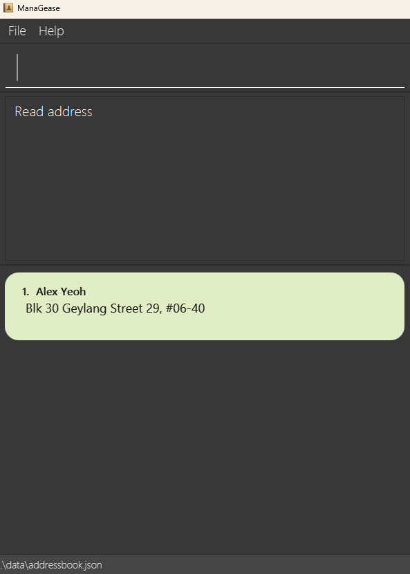

The following class diagram shows how the different classes interact with one another in the read Feature:

The following activity diagram summarises the process of reading specific field for a particular employee:

This is the sequence diagram to show how the read operation works.

:information_source: **Note:** The lifeline for `ReadCommand` should end at the destroy marker (X) but due to a limitation of PlantUML, the lifeline reaches the end of diagram.

The user enters the command "read 1 /a" and executes it. The command is then parsed by AddressBookParser. The AddressBookParser parsed the input and created ReadCommandParser and ReadCommandParser parsed the remaining input(exclude the command word). If it parses successfully, it will eventually create a ReadCommand. The ReadCommand is then executed. If the index is not out of bounds, it will call Model#setSpecificPersonToDisplay() to filter the list to only the specific person. Then it will also call the respective getter to get the specific field from the Person. After getting the specific field, it will then create a CommandResult for the UI to display.

#### Design considerations:

**Aspect: Data Retrieval:**

* **Alternative 1 (current choice):** Retrieve only the specific field of the person being read.
  * Pros: Reduces memory usage and may improve performance.
  * Cons: Requires more complex implementation and handling of different data retrieval scenarios.

* **Alternative 2:** Retrieve the entire person's data when executing the "Read" command.
  * Pros: Simple and consistent with other command implementations.
  * Cons: May have performance issues if the person's data is extensive.

**Aspect: Using Index:**

* **Alternative 1 (current choice):** Use an index to identify the target person for the "Read" command.
  * Pros: Faster and more efficient execution when working with a large number of people.
  * Cons: This may require users to remember or find the index of the person.

* **Alternative 2:** Use the person's name to identify the target person for the "Read" command.
  * Pros: User-friendly, especially when users are more likely to identify persons by name.
  * Cons: This may result in slower execution when many persons exist in the address book.

### Deductions and Benefits

#### Implementation

The deductions and benefits feature comprises 2 sub-features:

1. Add Deduction Feature
2. Add Benefit Feature

#### 1. Add Deduction Feature
The Add Deduction feature is facilitated by `Deduction`, `DeductCommand`, `DeductCommandParser`, `Person`, `PayrollStorage`, `Payroll` and `Salary` classes.

The `Deduction` class is responsible for storing the deduction data for a specific employee.

The `DeductCommand` class is responsible for executing the `deduct` command.

The `DeductCommandParser` class is responsible for parsing the user input for the `deduct` command.

The `Person` class is responsible for updating the list of deductions.

The `PayrollStorage` class is responsible for storing all payroll data for an employee.

The `Payroll` class is responsible for storing the monthly payroll data for an employee, including the starting and ending date of the payroll period.

The `Salary` class is responsible for storing the monthly salary data for an employee.

The following class diagram shows how the different classes interact with one another in the Add Deduction Feature:

The user can choose to add a deduction for an employee by entering the index of the employee, or the name of the employee. The `DeductCommandParser` class is responsible for parsing the user input for the `deduct` command.

The following sequence diagram shows how the `DeductCommandParser` class parses the user input:

When parsing the input, all relevant parameters are extracted according to their respective prefixes, and put into an `ArgumentMultimap`. 
The `value` and `reason` are parsed by `ParserUtil` class first, and a `Deduction` object is created with the parsed `value` and `reason`.
If the parameters are not in the correct format, a `ParseException` will be thrown.

The following sequence diagrams show how the `ParserUtil` class parses the `value` and `reason`:

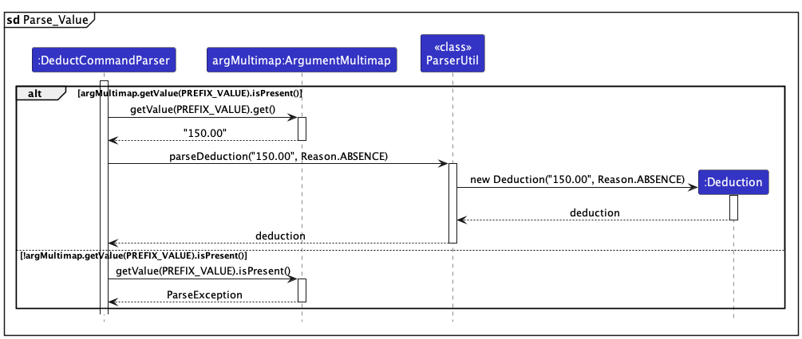

After fetching the `Deduction` object, `DeductCommandParser` class will then try to parse the `index` first.
The following sequence diagram shows how the `DeductCommandParser` class parses the `index`:

If the `index` is provided and valid, i.e, is a non-zero unsigned integer, the `DeductCommandParser` class will create a `DeductCommand` object with the `index` and `deduction` object, and return it.
However, if the `index` is not provided, a `ParseException` will be thrown by the `ParserUtil` class, and the `DeductCommandParser` class will try to parse the `name` of the employee.
If the `name` parameter is also not provided, a `ParseException` will be thrown by the `DeductCommandParser` class. Otherwise, the `DeductCommandParser` class will create a `DeductCommand` object with the `name` and `deduction` object, and return it.

The following sequence diagram shows how the `DeductCommandParser` class parses the `name`:

The following sequence diagram shows how the `deduct` operation works when the user enters the command `deduct 1 /v 150.00 /r absence`, which means adding a deduction of $150.00 for the employee with index 1, with the reason of `absence`:

After `DeductCommandParser` class parses the user input, the `DeductCommand` class will be called to execute the command. The `DeductCommand` class will then call the `Model` component to obtain the list of employees, and then obtain the `Person` object to add deduction for.

The following sequence diagram shows the referenced process of adding deduction for an employee:

1. The `DeductCommand` calls the `getPayrollStorage()` method to obtain the `PayrollStorage` object, which stores all `Payroll` objects in an ArrayList.
2. The `Person` object then calls the `getLatestPayroll()` method to get the `Payroll` object with the latest `startDate` in the ArrayList. 
3. Then it calls the `addDeduction()` method of the `Payroll` object which calls the `addDeduction()` method of the `Salary` object within it. 
4. This creates a new `Deduction` object with the given `value` and `reason`, then store it into the `deductions` field of the `Salary` object, which is an ArrayList of `Deduction` objects.

The following activity diagram summarises the process of adding deduction for an employee:

#### 2. Add Benefit Feature
The Add Benefit feature is facilitated by `Benefit`, `BenefitCommand`, `BenefitCommandParser`, `Person`, `PayrollStorage`, `Payroll` and `Salary` classes.

The `Benefit` class is responsible for storing the benefit data for a specific employee.

The `BenefitCommand` class is responsible for executing the `benefit` command.

The `BenefitCommandParser` class is responsible for parsing the user input for the `benefit` command.

The `Person` class is responsible for updating the list of benefits.

The `PayrollStorage` class is responsible for storing all payroll data for an employee.

The `Payroll` class is responsible for storing the monthly payroll data for an employee, including the starting and ending date of the payroll period.

The `Salary` class is responsible for storing the monthly salary data for an employee.

The following class diagram shows how the different classes interact with one another in the Add Benefit Feature:

The user can choose to add a benefit for an employee by entering the index of the employee, or the name of the employee. The `BenefitCommandParser` class is responsible for parsing the user input for the `benefit` command.

The following sequence diagram shows how the `BenefitCommandParser` class parses the user input:

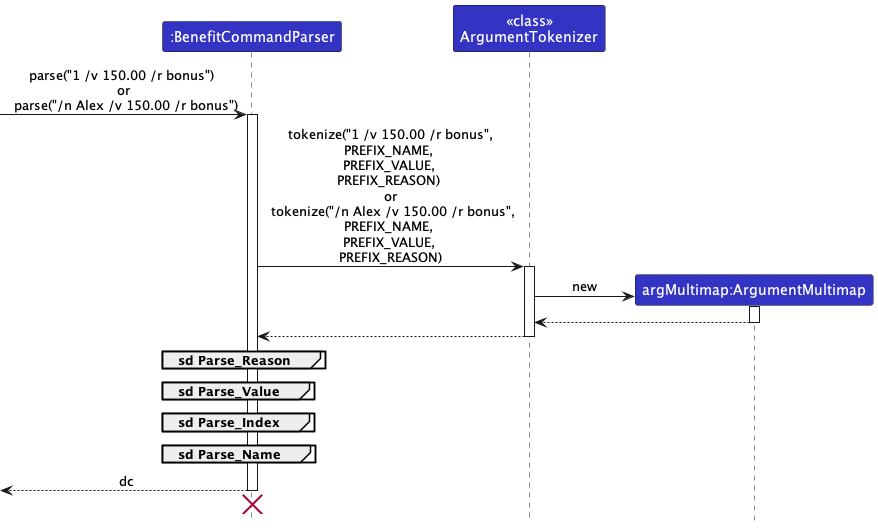

When parsing the input, all relevant parameters are extracted according to their respective prefixes, and put into an `ArgumentMultimap`.
The `value` and `reason` are parsed by `ParserUtil` class first, and a `Benefit` object is created with the parsed `value` and `reason`.
If the parameters are not in the correct format, a `ParseException` will be thrown.

The following sequence diagrams show how the `ParserUtil` class parses the `value` and `reason`:

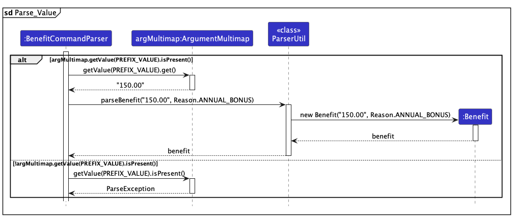

After fetching the `Benefit` object, `BenefitCommandParser` class will then try to parse the `index` first.
The following sequence diagram shows how the `BenefitCommandParser` class parses the `index`:

If the `index` is provided and valid, i.e, is a non-zero unsigned integer, the `BenefitCommandParser` class will create a `BenefitCommand` object with the `index` and `benefit` object, and return it.

However, if the `index` is not provided, a `ParseException` will be thrown by the `ParserUtil` class, and the `BenefitCommandParser` class will try to parse the `name` of the employee.
If the `name` parameter is also not provided, a `ParseException` will be thrown by the `BenefitCommandParser` class. Otherwise, the `BenefitCommandParser` class will create a `BenefitCommand` object with the `name` and `benefit` object, and return it.

The following sequence diagram shows how the `BenefitCommandParser` class parses the `name`:

The following sequence diagram shows how the `benefit` operation works when the user enters the command `benefit 1 /v 150.00 /r bonus`, which means adding a benefit of $150.00 for the employee with index 1, with the reason of `bonus`:

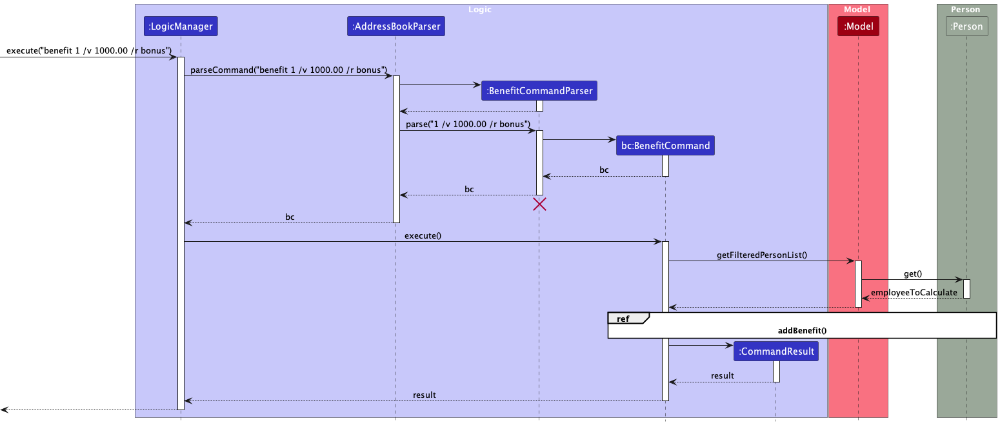

After `BenefitCommandParser` class parses the user input, the `BenefitCommand` class will be called to execute the command. The `BenefitCommand` class will then call the `Model` component to obtain the list of employees, and then obtain the `Person` object to add benefit for.

The following sequence diagram shows the referenced process of adding benefit for an employee:

1. The `BenefitCommand` calls the `getPayrollStorage()` method to obtain the `PayrollStorage` object, which stores all `Payroll` objects in an ArrayList.
2. The `Person` object then calls the `getLatestPayroll()` method to get the `Payroll` object with the latest `startDate` in the ArrayList.
3. Then it calls the `addBenefit()` method of the `Payroll` object which calls the `addBenefit()` method of the `Salary` object within it.
4. This creates a new `Benefit` object with the given `value` and `reason`, then store it into the `benefits` field of the `Salary` object, which is an ArrayList of `Benefit` objects.

The following activity diagram summarises the process of adding benefit for an employee:

### Payroll

#### Implementation

The payroll feature comprises 1 sub-feature:

1. Payroll Calculation Feature

#### 1. Payroll Calculation Feature

The proposed payroll calculation feature is facilitated by 
`Payroll`, `PayrollCommand`, `PayrollCommandParser`, `Person`,
`PayrollStorage`, `Payroll`, `Salary`, `Benefit` and `Deduction` classes.

The `Payroll` class is responsible for storing the monthly payroll data for an employee,
including the starting, ending and payment date of the payroll period. It also includes a `Salary` object.

The `PayrollCommand` is responsible for executing the `payroll` command.

The `PayrollCommandParser` is responsible for parsing the user input for the `deduct` command.

The `PayrollStorge` class is responsible for storing all payroll data for an employee.

The `Salary` class is responsible for the monthly salary data for an employee, this class includes compulsory
attributes like <u>Basic Salary</u>, a `deduction` and `benefit` class.

The `Benefit` class is responsible for storing the benefit data for a specific employee.

The `Deduction` class is responsible for storing the deduction data for a specific employee

The `Person` class is responsible for holding all the data of a specific employee,
including the `PayrollStorage`.

The following diagram shows the different classes interact with one another 
in the calculate payroll feature:

The user can choose to calculate the payroll for an employee by
entering the index of the employee, or the name of the employee. 
The `PayrollCommandParser` class is responsible for parsing the user input for the payroll command.

The following sequence diagram shows how the PayrollCommandParser class parses the user input:

When parsing the input, the input is first passed into ParserUtil#parseIndex method. 
This checks if the input intends to calculate the payroll by using the index of the employee.
If it is by name then a `ParseException` will be caught and all relevant parameters are extracted according to their respective prefixes, and put into an `ArgumentMultimap`.

The following sequence diagram shows how the `DeductCommandParser` class parses the `index`:

If the `index` is provided and valid, i.e, is a non-zero unsigned integer,
the `PayrollCommandParser` class will create a `DeductCommand` object with the `index` and `payroll` object, and return it.
However, if the `index` is not provided, a `ParseException` will be thrown by the `ParserUtil` class, and the `PayrollCommandParser` class will try to parse the `name` of the employee.
If the `name` parameter is also not provided, a `ParseException` will be thrown by the `PayrollCommandParser` class. 
Otherwise, the `PayrollCommandParser` class will create a `PayrollCommand` object with the `name` and `Payroll` object, and return it.

The following sequence diagram shows how the `PayrollCommandParser` class parses the `name`:

The following sequence diagram shows how the `payroll` operation works when the user enters
the command `payroll 1`, which means calculating the payroll for the employee with the index 1:

After `PayrollCommandParser` class parses the user input, the PayrollCommand class will be called to execute the command. 
The PayrollCommand class will then call the Model component to obtain the list of employees, and then obtain the Person object to calculate payroll for.

The following sequence diagram shows the referenced process of calculating payroll for an employee:

1. The `PayrollCommand` calls the `getLatestPayroll()` method to invoke a method in person object.
2. The Person object then calls the `getLatestPayroll()` method to get the `Payroll` object with the latest startDate in the `PayrollStorage` object.
3. The `PayrollCommand` then calls the `getPayrollString()` method of the `Payroll` object to get payroll description of the person.
4. The `Payroll` object then calls the `getNetSalaryString()` method of the `Salary` object to get the details of the `deductions`, `benefits` and basic salary.

The following activity diagram summarises the process of payroll calculation for an employee:

### Payslip Generation

#### Implementation

The payslip generation feature is facilitated by `PayslipGenerator`, `PayslipCommand` and `PayslipCommandParser` classes.

The `PayslipGenerator` class is responsible for generating the payslip for a specific employee.

The `PayslipCommand` class is responsible for executing the `payslip` command.

The `PayslipCommandParser` class is responsible for parsing the user input for the `payslip` command.

The following class diagram shows how the different classes interact with one another in the payslip generation feature:

The user can choose to generate a payslip for an employee by entering the index of the employee, or the name of the employee. The `PayslipCommandParser` class is responsible for parsing the user input for the `payslip` command.

The following sequence diagram shows how the `PayslipCommandParser` class parses the user input:

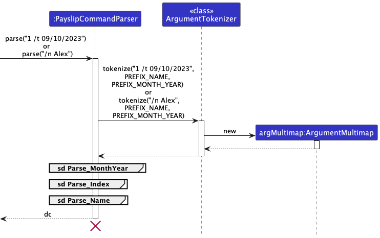

When parsing the input, all relevant parameters are extracted according to their respective prefixes, and put into an `ArgumentMultimap`.
If the user provides a date in the form of `dd/mm/yyyy`, the date is parsed by `ParserUtil` class first, and a `LocalDate` object is created with the parsed date.
If the date is not in the correct format, a `ParseException` will be thrown.

The following sequence diagram shows how the `ParserUtil` class parses the date:

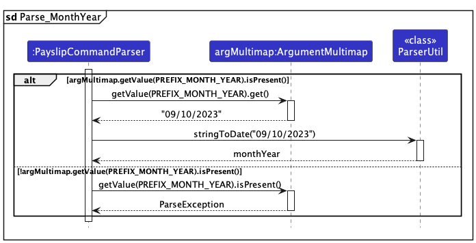

After fetching the `LocalDate` object, if any, `PayslipCommandParser` class will then try to parse the `index` first.
The following sequence diagram shows how the `PayslipCommandParser` class parses the `index`:

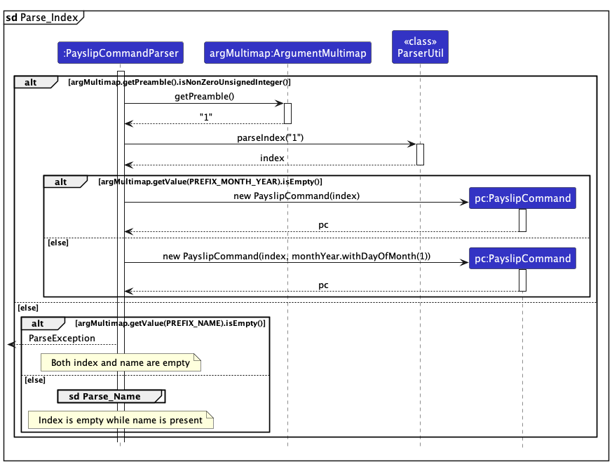

If the `index` is provided and valid, i.e, is a non-zero unsigned integer, the `PayslipCommandParser` class will create a `PayslipCommand` object with the `index` (and `monthYear` date, if any), and return it.

However, if the `index` is not provided, a `ParseException` will be thrown by the `ParserUtil` class, and the `PayslipCommandParser` class will try to parse the `name` of the employee.
If the `name` parameter is also not provided, a `ParseException` will be thrown by the `PayslipCommandParser` class. Otherwise, the `PayslipCommandParser` class will create a `PayslipCommand` object with the `name` (and `monthYear` date, if any), and return it.

The following sequence diagram shows how the `PayslipCommandParser` class parses the `name`:

The following sequence diagram shows how the `payslip` operation works when the user enters the command `payslip 1 /t 09/10/2023`, which means generating a payslip for the employee with index 1, for the month of October 2020:

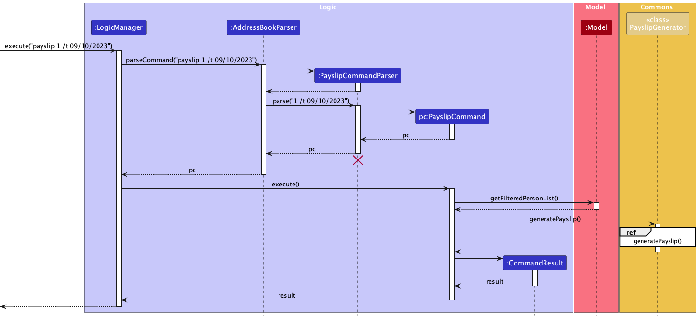

The following sequence diagram shows the referenced process of generating a payslip for an employee:

1. The `PayslipCommand` calls the `generatePayslip()` method of the `PayslipGenerator` class, which calls the `getFieldMap()` method on itself.
2. The `getFieldMap()` method then calls the `getPayrollWithStartDate()` method on the `Person` object to obtain the `Payroll` object with start date equal to the given one within its `PayrollStorage` object, which stores all `Payroll` objects in an ArrayList. If the user does not specify a `monthYear` date, the `getFieldMap()` method will call the `getLatestPayroll()` method to get the `Payroll` object with the latest `startDate` in the ArrayList.
3. Then it calls various getter methods on the `Payroll` object to obtain the necessary information for the payslip.
4. This `getFieldMap()` method then returns a `HashMap<String, String>` object with the necessary information for the payslip, and the information is written into a PDF file using the `itext7` library.

The following activity diagram summarises the process of generating a payslip for an employee:

### Leave Tracking

#### Implementation

The leave tracking feature comprises 3 sub-features:

1. Add Leave Feature
2. Delete Leave Feature
3. View Leave Feature

#### 1. Add Leave Feature
The Add Leave feature is facilitated by `AnnualLeave`, `AddLeaveCommand`, `AddLeaveCommandParser` and `Person` classes.

The `AnnualLeave` class is responsible for storing the leave data for a specific employee.

The `AddLeaveCommand` class is responsible for executing the `addleave` command.

The `AddLeaveCommandParser` class is responsible for parsing the user input for the `addleave` command.

The `Person` class is responsible for updating the list of leave.

The following class diagram shows how the different classes interact with one another in the Add Leave Feature:

The following sequence diagram shows how the `addleave` operation works:

After `AddLeaveCommandParser` class parses the user input, the `AddLeaveCommand` class will be called to execute the command. The `AddLeaveCommand` class will then call the `Model` component to obtain the list of employees, and then obtain the Person object to add leave for this employee, and store the leave as an arraylist in `AnnualLeave`.

The following activity diagram summarises the process of adding leave for an employee:

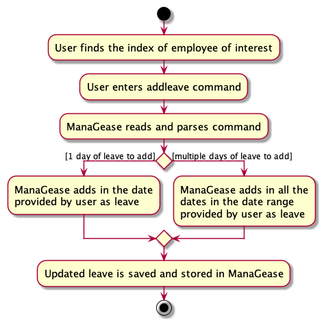

#### Design considerations:

**Aspect: How addleave executes:**

* **Alternative 1 (current choice):** Saves the dates of the leave added.
  * Pros: Easy to trace and track when the leaves are applied, and whether employee is working on specific day.
  * Cons: May have performance issues in terms of memory usage.

* **Alternative 2:** Saves only the total number of days of leave added.
  * Pros: will use less memory (e.g. each employee will only need to store an integer for the total number of days of leave per annul)
  * Cons: Not much useful information that can be used (e.g. we do not know the working status of each employee for each day)

#### 2. Delete Leave Feature
The Delete Leave feature is facilitated by `AnnualLeave`, `DeleteLeaveCommand`, `DeleteLeaveCommandParser` and `Person` classes.

The `AnnualLeave` class is responsible for storing the leave data for a specific employee.

The `DeleteLeaveCommand` class is responsible for executing the `deleteleave` command.

The `DeleteLeaveCommandParser` class is responsible for parsing the user input for the `deleteleave` command.

The `Person` class is responsible for updating the list of leave.

The following class diagram shows how the different classes interact with one another in the Delete Leave Feature:

The following sequence diagram shows how the `deleteleave` operation works:

After `DeleteLeaveCommandParser` class parses the user input, the `DeleteLeaveCommand` class will be called to execute the command. The `DeleteLeaveCommand` class will then call the `Model` component to to obtain the list of employees, and then obtain the Person object to delete the leave from this employee, and update the arraylist of leave in `AnnualLeave`.

The following activity diagram summarises the process of adding leave for an employee:

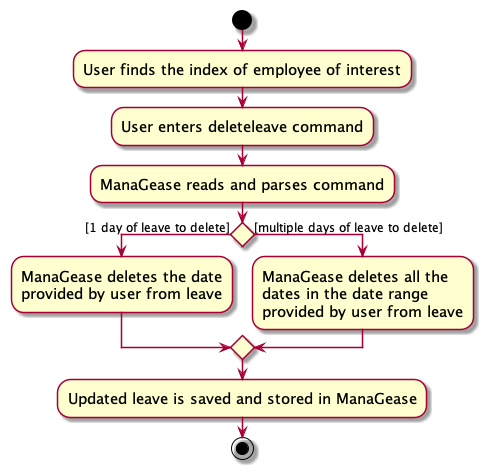

#### Design considerations:

**Aspect: How deleteleave executes:**

* **Alternative 1 (current choice):** Deletes the dates of the leave only if all of them exist in the employee's list of leave.
    * Pros: Ensures that the leave are always deleted correctly and easy to maintain.
    * Cons: May cause inconvenience to users as they will have to know the exact dates to delete.

* **Alternative 2:** Deletes all the matching dates of leave as long as they exist in employee's list of leave, ignoring those that do not exist.
    * Pros: Users are able to delete the leave within the range of dates that they entered, provided that they exist.
    * Cons: Can be confusing to users as to what have been deleted, and also harder to maintain.

#### 3. View Leave Feature
The View Leave feature is facilitated by `ViewLeaveCommandParser`and `ViewLeaveCommand`

The `ViewLeaveCommand` class is responsible for executing the `viewleave` command.

The `ViewLeaveCommandParser` class is responsible for parsing the user input for the `viewleave` command.

The following class diagram shows how the different classes interact with one another in the View Leave Feature:

The following sequence diagram shows how the `viewleave` operation works:

After parsing user input, the `ViewLeaveCommandParser` creates a `ViewLeaveCommand` and executes it. This command then interacts with the `Model` to fetch the list of employees. Subsequently, it generates a hashmap where each local date corresponds to a list of employees on leave. By querying this hashmap for the specified date, the command identifies employees on leave. Finally, it creates a `CommandResult` containing the names of employees on leave for the given date.

The following activity diagram summarises the process of viewing leave for an employee:

#### Design considerations:

**Aspect: How viewleave executes:**

* **Alternative 1 (current choice):** View the employee who is on leave on the specific date
    * Pros: User gets to know which specific employee is on leave on that date
    * Cons: Scanning through a list of names could be less efficient

* **Alternative 2:** View the number of employee who is on leave on the specific date
    * Pros: Simpler implementation, providing a quick count of employees on leave.
    * Cons: Users only obtain the number of employees on leave without individual details.

### Attendance 

#### Implementation

The attendance marking feature comprises 2 sub-features:
1. Mark attendance feature
2. Attendance Report feature

These two features are dependent on the following classes:
* AttendanceStorage
* Attendance
* AttendanceType

Below are the relationships between these classes:

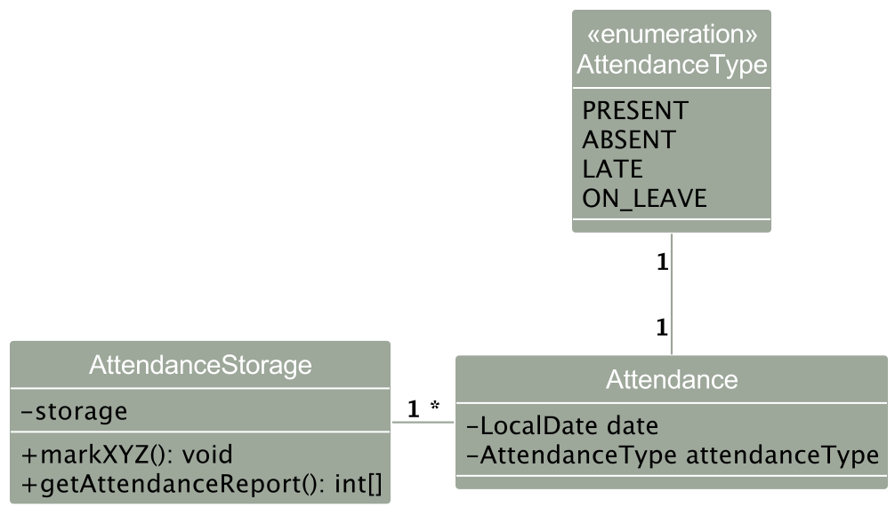

#### 1. Mark attendance feature

The mark mechanism is dependent on the Attendance class. The Attendance class contains information on the date and AttendanceType of a Person.  It implements the following operations:
* `Attendance#markAbsent(LocalDate date)` -- marks the attendance of the employee on the provided date as absent.
* `Attendance#markLate(LocalDate date)` -- marks the attendance of the employee on the provided date as late.
  
The AttendanceStorage stores all the Attendance objects of one Person, only storing Attendances that are late or absent. Dates that are not in the storage are assumed to be marked as present for that given Person.

Given below is an example usage scenario and how the mechanism behaves at each step.

Step 1. The user executes `mark 1 /at LATE` command to mark the 1st Person in the list as late.

Step 2. The `mark` command calls `MarkCommand#markByIndex()` of the given employee, which calls the `Attendance#markAbsent()` of the given Person.

This working status is then updated in the GUI as shown below:

 

Sequence diagram is as shown below:

#### 2. Attendance Report feature

The attendance reporting mechanism is dependent on the AttendanceStorage class. The AttendanceStorage is a collection of the Attendances of a Person. It implements the following operations:
* `AttendanceStorage#getCount` -- counts the number of days the attendance of type `attendanceType` appears in the AttendanceStorage
* `AttendanceStorage#getAttendanceReport` -- provides an `int[]` of the number of days of each attendance type in the following order: [leave, absent, late]

The AttendanceStorage stores all the Attendance objects of one Person, only storing Attendances that are late or absent. Dates that are not in the storage are assumed to be marked as present for that given Person.

Given below is an example usage scenario and how the mechanism behaves at each step.

Step 1. The user executes `attendance 1` command to retrieve the attendance of the first Person.

Step 2. The `attendance` command calls `AttendanceCommand#reportByIndex()` of the given employee, which calls the `AttendanceStorage#getAttendanceReport()` of the given Person.

Sequence diagram is as shown below:

#### Design considerations:

**Aspect: How AttendanceStorage is assigned to each Person**
* **Alternative 1 (current choice):** As an attribute of a Person.
  * Pros: Easy to query for a Person's attendance status
  * Cons: May be sub-par performance as it would store identical Attendance objects for each Person.
    * (Person A could be absent on 24th Oct, Person B could also absent on 24th Oct, but the current software architecture design does not allow shared usage of the duplicates)
* **Alternative 2:** As a UniqueAttendanceList.
  * Pros: No copies of Attendance objects having the same attribute values
  * Cons: Difficult to reference a Person to each Attendance.

    
--------------------------------------------------------------------------------------------------------------------

## **Documentation, logging, testing, configuration, dev-ops**

* [Documentation guide](Documentation.md)
* [Testing guide](Testing.md)
* [Logging guide](Logging.md)
* [Configuration guide](Configuration.md)
* [DevOps guide](DevOps.md)

--------------------------------------------------------------------------------------------------------------------

## **Appendix: Requirements**

### Product scope

**Target user profile**:
* Human Resource Managers
* has a need to manage a significant number of employees' information
* prefer desktop apps over other types
* can type fast
* prefers typing to mouse interactions
* is reasonably comfortable using CLI apps

**Value proposition**: Contact management app to simplify and centralize information for full-time employees. It offers easy access to essential details such as name, email, phone number, address, bank accounts, salary, joining date, and annual leave. With all the information, the app can help to track employees’ annual leave and also generate their payroll automatically. This helps to reduce errors and enhance overall operational efficiency. This results in time and cost savings, improved organization, and a smoother workflow for your business.

### User stories

Priorities: High (must have) - `* * *`, Medium (nice to have) - `* *`, Low (unlikely to have) - `*`

| Priority | As a …​                                     | I want to …​                                                                                            | So that I can…​                                                                               |
| -------- | ------------------------------------------ |---------------------------------------------------------------------------------------------------------|-----------------------------------------------------------------------------------------------|
| `* * *`  | user                                       | add new full-time staff members                                                                         | maintain an up-to-date database of employees.                                                 |
| `* * *`  | user                                       | delete an employee's information                                                                        | keep the system clean and organized by removing unused data when employees resign             |
| `* * *`  | user                                       | edit employee information (contacts, addresses, bank account, etc.)                                     | keep the system clean and organized by removing unused data when employees resign.            |
| `* * *`  | new user                                   | easily access the user guide within the app or platform                                                 | quickly learn how to use the application's features and functionalities effectively           |
| `* *`    | user                                       | receive concise and informative error messages                                                          | quickly identify my mistake and take corrective actions promptly                              |
| `* *`    | user                                       | generate a report that shows the total payroll amount received by a specific employee                   | track the employee's overall compensation.                                                    |
| `* *`    | user                                       | effectively manage employees' annual leave balances                                                     | make sure the employees do not exceed their allocated limits                                  |
| `* * `   | user                                       | read specific information about a particular employee                                                   | don’t need to manually scroll through multiple pages to find the required information         |
| `* *`    | user                                       | close the application using a command                                                                   | i can expedite the process without relying on the mouse                                       |
| `* *`    | user                                       | calculate payroll for employees to be automatically based on their join dates and proposed salaries     | ensure there are no discrepancies in compensation                                             |
| `*`      | user                                       | have a user-friendly application                                                                        | I can quickly learn how to use it in a short time                                             |
| `*`      | user                                       | have the ability to sort employees by their join date/salary                                            | make informed decisions and efficiently manage the workforce based on the sorted list.        |
| `*`      | user                                       | have an application capable of detecting and preventing the input of duplicate employee information     | ensure the system does not mix up or duplicate payroll data and also helps to prevent errors. |

### Use cases

(For all use cases below, the **System** is the `ManaGease` and the **Actor** is the `user`, unless specified otherwise)

**<ins>Use case: UC01 – Add a new full-time employee</ins>**

**Guarantees:**
* Entered employee will be added.

**MSS**

1. User requests to add a new employee.
2. ManaGease adds employee to the employee database.
3. ManaGease displays a confirmation message that an employee has been added.

   Use case ends.

**Extensions**

* 1a. Invalid parameters are included in the command.

	 * 1a1. ManaGease shows an error message.
  
     * Use case continues from Step 1.

         Use case ends.
  
* 1b. User does not input a compulsory parameter.

  * 1b1. ManaGease shows an error message.
  
  * 1b2. User requests to add a new employee.
  
  * Steps 1b1 and 1b2 repeat until the user inputs a correct command. 
  
    Use case continues from Step 2.
  
* 1c. Identical employee is added to the list.

  * 1c1. ManaGease shows an error message, identical employee cannot be added to the list.
  
    Use case ends.

 

**<ins>Use case: UC02 – List all employees</ins>**

**MSS**
1. User requests to list all employees.
2. ManaGease displays all the employees in the employee database.
  
   Use case ends.

**Extensions**

* 2a. Employee database is empty.

  * 2a1. ManaGease shows an empty list of employees.
  
    Use case ends.

**<ins>Use case: UC03 – Edit information of existing full-time employee</ins>**

**Pre-conditions:**
* Employee to edit should exist in the list.

**MSS**

1. User <u>lists the employees</u>.(UC02)
2. ManaGease displays a list of all the employees.
3. User requests to edit an existing employee.
4. ManaGease edits the information of the specified employee.
5. ManaGease displays a confirmation message that information for employees have been updated.

   Use case ends.

**Extensions**

* 3a. Invalid command parameters are given.

  * 3a1. ManaGease shows an error message.

    Use case continues from step 3.

* 3b. Same information is given to edit the person to.

  * 3b1. ManaGease shows an error message, the field to change is the same as the existing one.

 

**<ins>Use case: UC04 – View one piece of information on a full-time employee</ins>**

**Guarantees:**
* Information required from the specified employee will be displayed for the user.

**Pre-conditions:**
* Employee to view from the list should exist in the list.

**MSS**

1. User <u>lists the employees</u>.(UC02)
2. ManaGease shows a list of all the employees.
3. User requests to view one piece of information from an existing employee.
4. ManaGease displays the information for an employee.

   Use case ends.

**Extensions**

* 3a. Invalid command parameters are given.

	* 3a1. ManaGease shows an error message.

        Use case continues from Step 3.

 

**<ins>Use case: UC05 – Delete and existing employee</ins>**

**Guarantees:**
* Entered employee will be deleted.

**Pre-conditions:**
* Employee to delete from the list should exist in the list.

**MSS**

1. User <u>lists the employees</u>.(UC02)
2. ManaGease shows a list of all the employees.
3. User requests to delete an existing employee.
4. ManaGease deletes existing employee.

   Use case ends.

**Extensions**

* 3a. Invalid command parameters are given.

  * 3a1. ManaGease shows an error message.
  
  Use case resumes from Step 3.

* 3a. User requests to delete existing member via name.

	 * 3a1. ManaGease will display a list of members with the same name.

         Use case ends.
  
* 3b. User inputs an employee index or name that does not exist in the list.

  * 3b1. ManaGease shows an error message.
  
    Use case resumes from Step 3.

 

**<ins>Use case: UC06 – Add deductions/benefits to the monthly salary of an employee</ins>**

**Guarantees:**
* Specified employee's deductions/benefits for the month will be added.
* The specified employee's monthly salary will decrease based on the deductions for the month and increase based on the benefits for the month.

**Pre-conditions:**
* Employee to add deductions/benefits to should be in the list.

**MSS**
1. User <u>lists the employees</u>.(UC02)
2. ManaGease shows a list of all the employees.
3. User requests to add deductions/benefits to the monthly salary of an employee.
4. ManaGease adds deductions/benefits to the monthly salary of an employee.
5. ManaGease displays a confirmation message that deductions/benefits have been added.

   Use case ends.

**Extensions**

* 3a. Invalid command parameters are given.

    * 3a1. ManaGease shows an error message.

      Use case resumes at Step 3.

 

**<ins>Use case: UC07 – Generate a PDF payslip for a specific employee</ins>**

**Pre-conditions:**
* Employee to generate payslip for to should be in the list.

**MSS**

1. User <u>lists the employees</u>.(UC02)
2. ManaGease shows a list of all the employees.
3. User requests to generate a payslip for a specific employee.
4. ManaGease generates a PDF payslip for the employee.
5. ManaGease displays a confirmation message that a payslip has been generated.

   Use case ends.

**Extensions**

* 3a. Invalid command parameters are given.

    * 3a1. ManaGease shows an error message.

      Use case resumes at Step 3.

* 4a. Template file for the payslip is not found.

    * 4a1. ManaGease shows an error message, requesting user to add a template file for payslip.

      Use case ends.

**<ins>Use case: UC08 – Add leave for a specific employee</ins>**

**Guarantees:**
* Specified employee's days of leave will be added –– they will be considered taken.
* The employee's remaining days of leave will reduce by the number of leaves added.

**Pre-conditions:**
* Employee to add leave to should be in the list.

**MSS**
1. User <u>lists the employees</u>.(UC02)
2. ManaGease shows a list of all the employees.
3. User requests to add leave for a specific employee.
4. ManaGease adds leave for the employee.
5. ManaGease displays a confirmation message that the leave has been added.

   Use case ends.

**Extensions**

* 3a. Invalid command parameters are given.

    * 3a1. ManaGease shows an error message.

      Use case resumes at Step 3.

* 3b. Invalid date(s) are given.

    * 3b1. ManaGease shows an error message.

      Use case resumes at Step 3.
  
* 3c. Non-existing index given.

  * 3c1. ManaGease shows an error message.

    Use case resumes at Step 3.

**<ins>Use case: UC09 – Delete leave from a specific employee</ins>**

**Guarantees:**
* Specified employee's days of leave will be deleted –– they will no longer be considered taken.
* The employee's leave will revert back to the original value before the leave was taken.

**Pre-conditions:**
* Employee to delete leave from should be in the list.

**MSS**
1. User <u>lists the employees</u>.(UC02)
2. ManaGease shows a list of all the employees.
3. User requests to delete leave from a specific employee.
4. ManaGease deletes leave from the employee.
5. ManaGease displays a confirmation message that the leave has been deleted.

   Use case ends.

**Extensions**

* 3a. Invalid command parameters are given.

    * 3a1. ManaGease shows an error message.

      Use case resumes at Step 3.

* 3b. Invalid/Non-existing date(s) are given.

    * 3b1. ManaGease shows an error message.

      Use case resumes at Step 3.
  
* 3c. Non-existing index given.

  * 3c1. ManaGease shows an error message.
  
    Use case resumes at Step 3.

**<ins>Use case: UC10 – View employee who is on leave on a specific date</ins>**

**Guarantees:**
* Employees who are on leave on that specific date will be displayed to the user.

**MSS**
1. User requests to view employees who are on leave on a specific date.
2. ManaGease check for employees who are on leave on that specific date.
3. ManaGease displays the employees' names who are on leave on that specific date.

   Use case ends.

**Extensions**

* 3a. Invalid command parameters are given.

    * 3a1. ManaGease shows an error message.

      Use case resumes at Step 3.

* 3b. Invalid date(s) are given.

    * 3b1. ManaGease shows an error message.

      Use case resumes at Step 3.  

**<ins>Use case: UC11 – Mark an employee's attendance</ins>**

**MSS**
1. User <u>lists the employees</u>.(UC02)
2. ManaGease shows a list of all the employees.
3. User requests to mark an employee's attendance.
4. ManaGease changes the employee's attendance.
5. ManaGease displays a confirmation message that the attendance has been marked.
6. ManaGease changes the working status of the employee as the specified attendance type.
    
    Use case ends

**Extensions**
* 3a. Invalid command parameters are given.

  * 3a1. ManaGease shows an error message.
    
    Use case resumes at step 3.

* 3b. Invalid attendance type given

  * 3b1. ManaGease shows an error message.

    Use case resumes at Step 3.
  
* 3c. User requests to delete existing member via name.

    * 3c1. ManaGease will display a list of members with the same name.

      Use case ends.
  
* 4a. Employee is currently on leave

  * 4a1. ManaGease will display an error message, users are not allowed to mark the attendance of an employee on leave.

    Use case ends.

**<ins>Use case: UC12 – Calculate the monthly payroll of an employee</ins>**

**Guarantees:**
* Specified employee's payroll details for the month will be displayed.

**Pre-conditions:**
* Employee to calculate payroll should be in the list.

**MSS**
1. User <u>lists the employees</u>.(UC02)
2. ManaGease shows a list of all the employees.
3. User requests to calculate monthly payroll of an employee.
4. ManaGease displays a message containing the payroll details.

   Use case ends.

**Extensions**

* 3a. Invalid command parameters are given.

  * 3a1. ManaGease shows an error message.

    Use case resumes at Step 3.

* 3b. User request to calculate the payroll by name.
  * 3b1. The database contains two or more employees with the matching name entered by the user
  * 3b2. ManaGease displays the employees with the matching name.

    Use case resumes at Step 3.

 

### Non-Functional Requirements

1.  Should work on any _mainstream OS_ as long as it has Java `11` or above installed.
2.  Should be able to hold up to 1000 persons without a noticeable sluggishness in performance for typical usage.
3. The application should be designed with an intuitive and user-friendly interface to cater to HR managers who have not previously used such software.
4. The application is designed and available exclusively in the English language.
5. The application is not required to handle the printing of the reports.

### Glossary

* **Mainstream OS**: Windows, Linux, Unix, OS-X
* **HR manager**: Human Resource Manager in the company
* **Employee**: A staff in the company 

--------------------------------------------------------------------------------------------------------------------

## **Planned enhancement**

### Stricter rules for adding employees with an identical name

1. Currently, the `add` command allows users to add an employee with the same name as an existing one, but in different cases (e.g. John Tan and john tan), and with other fields identical. However, the two employees should be considered the same as they have the same identity, and the command should be modified. To resolve this, we plan to implement a case-insensitive comparison of the names of the employees.

2. This can be done by modifying the `equals()` method in the [`Person`](https://github.com/AY2324S1-CS2103T-W12-2/tp/blob/master/src/main/java/seedu/address/model/person/Person.java) class to ignore the case of the name, i.e. changing `name.equals(other.name)` to `name.toLowerCase().equals(other.name.toLowerCase())`.

### Enhancing UI Dimensions for Optimal Alignment 

1. Our current UI exhibits alignment issues, such as message wrapping to the next line as shown below, and we aim to ensure optimal alignment.
   

2. To resolve this, we plan to modify the minWidth, minHeight, maxWidth, and maxHeight parameters of the respective boxes for a more refined and cohesive appearance.

### Streamlining Calendar Navigation for User Convenience

1. Currently, users need to input commands to switch between months in the UI calendar.

2. In our future plans, we intend to implement a user-friendly dropdown menu along with dedicated next and previous buttons, providing a more intuitive interface for toggling between months.

### Enhancing Deletion Functionality for User Convenience

1. Currently, the `delete` command allows the deletion of employee via index and name. However, for the deletion via name, if there are multiple employees with the same name, i.e., Amy Tan, Amy Teo and Amy Lee, even if you enter the command `delete /n Amy Lee`, which is the full name of one of these employee, it will return a list of these employees with the name "Amy" rather than directly deleting the employee that matches the full name.
   
2.  While this is to allow greater flexibility in searching, in our future implementation, we would allow the deletion of employee using the full name to provide more convenience to the users.

### Expanding Leave Tracking Capabilities for Enhanced User Flexibility

1. The current leave tracking system only allows users to track the data for annual leave.
   
2. To better cater to the users of ManaGease, we will implement the ability to track leave for other types of leave like sick leave, parental leave, compassionate leave, etc.

### Enhanced Access Control for Leave Deletion

1. Currently, the `deleteleave` command does not allow users to delete leave from employee if the date of leave to delete is already over. This is to reduce the likelihood of any unintended or intended change in leave data. However, to offer users greater flexibility in editing the leave data, we will implement some form of access control to allow certain users to have the ability to delete leave data for dates that are already over. 

--------------------------------------------------------------------------------------------------------------------

## **Appendix: Effort**

### JavaFX Clock and Calendar Component

1. Challenges faced :
	- `Component Selection`: AB3 initially uses VBox and HBox for layout, but midway through development, we realized that a GridPane offered a more effective solution, leading to a shift in our approach.
	- `Synchronization`: Ensuring seamless synchronization with the local date and displaying the number of employees on leave
	- `Command-Based Month Navigation`: Implementing a command-based system for toggling month changes introduced challenges in managing signals to accurately control the month navigation functionality.

2. Effort required:
	- `Iterative Development`: The need for constant adjustments to the layout and functionality, especially during the transition from VBox and HBox to GridPane, required iterative development and continuous refinement.
	- `Restarting for Alignment Checks`: Verifying alignment in the JavaFX calendar component demanded frequent restarts, leading to considerable time investment in the development process.
	- `CSS File Interpretation`: Reading through and comprehending the extensive CSS file became a significant effort, as it was crucial for styling and maintaining the visual integrity of the JavaFX calendar component.
	- `Command-Based Navigation`: Developing and refining the command-based month navigation system required careful consideration of signal management and user interface responsiveness.

3. Achievements:
	- `Effective Layout with GridPane`: Despite the initial challenges, adopting GridPane significantly improved the layout efficiency of our calendar component, ensuring a visually appealing and well-organized interface.
	- `Successful Synchronization`: Overcoming synchronization complexities, we successfully implemented a calendar component that accurately reflects the local date and dynamically displays the number of employees on leave.

--------------------------------------------------------------------------------------------------------------------

## **Appendix: Instructions for manual testing**

Given below are instructions to test the app manually.

:information_source: **Note:** These instructions only provide a starting point for testers to work on;
testers are expected to do more *exploratory* testing.

### Launch and shutdown

1. Initial launch

   1a. Download the jar file and copy into an empty folder

   1b. Double-click the jar file Expected: Shows the GUI with a set of sample contacts. The window size may not be optimum.

2. Saving window preferences

   2a. Resize the window to an optimum size. Move the window to a different location. Close the window.

   2b. Re-launch the app by double-clicking the jar file. 
       Expected: The most recent window size and location is retained.

### Adding a new employee

1. Adding a new employee to the list

   i. Prerequisites:
   * The employee should not already exist in ManaGease, and detection is based on avoiding duplicate names.

   ii. Test case: `add /n Jane Smith /e jane@email.com /p 12345678 /a 123 Main St /b 123456789 /jd 12/09/2023 /s 1000.00 /l 10` 
   * Expected: Employee is added to ManaGease. Details of the new employee are shown in the result box. A newly added employee will be positioned at the bottom of the employee card list.

   iii. Test case: `add /n Jane Smith /e jane@email.com /p 12345678 /a 123 Main St /b 123456789 /jd 12/09/2023 /s 1000.00` 
   * Expected: As there's a missing field, the system will not allow the addition of the employee. Error details are shown in the result box.
   	  
### Deleting an employee

1. Deleting an employee while all employees are being shown

   i. Prerequisites:
   * List all employees using the `list` command. Multiple employees in the list.

   ii. Test case: `delete 1` 
   * Expected: The first employee is deleted from the list. Details of the deleted employee are shown in the result box.

   iii. Test case: `delete 0` 
   * Expected: No employee is deleted. Error details are shown in the result box.

   iv. Other incorrect delete commands to try: `delete`, `delete x`, `...` (where x is larger than the list size, excluding negative, non-integer and extremely large integers) 
   * Expected: Similar to previous.

### Reading specific information about a particular employee

1. Reading specific information about a particular employee while all employees are being shown

   i. Prerequisites:
   * List all employees using the `list` command. Multiple employees in the list.

   ii. Test case: `read 1 /a` 
   * Expected: The first employee and his/her address will be shown on the employee card. A success message is shown in the result box.

   iii. Test case: `read 1` 
   * Expected: No information is shown. Error details are shown in the result box.

   iv. Other incorrect read commands to try: `read`, `read x /e` (where x is larger than the list size, excluding negative, non-integer and extremely large integers) 
   * Expected: Similar to previous.
  
### Finding employee(s) via keyword(s)

1. Finding employee(s) via keyword(s)

   i. Prerequisites:
   * The keyword must be at least one of the employee's names.

   ii. Test case: `find David` 
   * Expected: The employees' card with a name that contained David will be shown. A success message is shown in the result box.

   iii. Test case: `find Dacid Jane` 
   * Expected: The employees' card with a name that contained David and Jane will be shown. A success message is shown in the result box.

   iv. Other incorrect read commands to try: `find`
   * Expected: Similar to previous.

### Editing employees' information

1. Editing the name of an employee

   i. Prerequisites:
   * List all employees using the `list` command. Multiple employees in the list.
   * The employee must exist in the list

   ii. Test case: `edit 1 /n Barack Obama` 
   * Expected: The first employee's name is changed to Barack Obama. A success message with the details of the employees is shown in the result box.

   iii. Test case: `edit 1 /n` 
   * Expected: Name does not change. Error details are shown in the result box.

   iv. Other incorrect edit commands to try: `edit 1 /n John@~!`, `edit x /n Barack Obama` (where x is larger than the list size, excluding negative, non-integer and extremely large integers) 
   * Expected: Similar to previous.
  
2. Editing the email address of an employee

   i. Prerequisites:
   * List all employees using the `list` command. Multiple employees in the list.
   * The employee must exist in the list

   ii. Test case: `edit 1 /e nihao@yahoo.com` 
   * Expected: The first employee's email address is changed to nihao@yahoo.com. A success message with the details of the employees is shown in the result box

   iii. Test case: `edit 1 /e` 
   * Expected: Email address does not change. Error details are shown in the result box.

   iv. Other incorrect edit commands to try: `edit 1 /e nihaogmailcom`, `edit x /e nihao@yahoo.com` (where x is larger than the list size, excluding negative, non-integer and extremely large integers) 
   * Expected: Similar to previous.

3. Editing the phone number of an employee

   i. Prerequisites:
   * List all employees using the `list` command. Multiple employees in the list.
   * The employee must exist in the list

   ii. Test case: `edit 1 /p 88881111` 
    * Expected: The first employee's phone number is changed to 88881111. A success message with the details of the employees is shown in the result box

   iii. Test case: `edit 1 /p` 
    * Expected: Name does not change. Error details are shown in the result box.

   iv. Other incorrect edit commands to try: `edit 1 /p y` (where y is less than 3 digits), `edit x /p 88881111` (where x is larger than the list size, excluding negative, non-integer and extremely large integers) 
    * Expected: Similar to previous.
  
4. Editing the address of an employee

   i. Prerequisites:
   * List all employees using the `list` command. Multiple employees in the list.
    * The employee must exist in the list

   ii. Test case: `edit 1 /a 123 Bukit Batok SouthWest` 
   * Expected: The first employee's address is changed to 123 Bukit Batok SouthWest. A success message with the details of the employees is shown in the result box

   iii. Test case: `edit 1 /a` 
   * Expected: Address does not change. Error details are shown in the result box.

   iv. Other incorrect edit commands to try: `edit x /a 123 Bukit Batok SouthWest` (where x is larger than the list size, excluding negative, non-integer and extremely large integers) 
   * Expected: Similar to previous.
  
5. Editing the bank account number of an employee

   i. Prerequisites:
   * List all employees using the `list` command. Multiple employees in the list.
    * The employee must exist in the list

   ii. Test case: `edit 1 /b 123456789` 
   * Expected: The first employee's bank account number is changed to 123456789. A success message with the details of the employees is shown in the result box

   iii. Test case: `edit 1 /b` 
   * Expected: Bank account number does not change. Error details are shown in the result box.

   iv. Other incorrect edit commands to try: `edit 1 /b y` (where y is less than 5 digits or more than 17 digits), `edit x /b 123456789` (where x is larger than the list size, excluding negative, non-integer and extremely large integers) 
   * Expected: Similar to previous.

6. Editing the join date of an employee

   i. Prerequisites:
   * List all employees using the `list` command. Multiple employees in the list.
    * The employee must exist in the list

   ii. Test case: `edit 1 /jd 12/11/2023` 
   * Expected: The first employee's join date is changed to 12/11/2023. A success message with the details of the employees is shown in the result box

   iii. Test case: `edit 1 /jd` 
   * Expected: Join date does not change. Error details are shown in the result box.

   iv. Other incorrect edit commands to try: `edit 1 /jd 15 Dec 2023`, `edit x /jd 12/11/2023` (where x is larger than the list size, excluding negative, non-integer and extremely large integers) 
   * Expected: Similar to previous.

7. Editing the basic salary of an employee

   i. Prerequisites:
   * List all employees using the `list` command. Multiple employees in the list.
    * The employee must exist in the list

   ii. Test case: `edit 1 /s 2000.00` 
   * Expected: The first employee's basic salary is changed to 2000.00. A success message with the details of the employees is shown in the result box

   iii. Test case: `edit 1 /s` 
   * Expected: Basic salary does not change. Error details are shown in the result box.

   iv. Other incorrect edit commands to try: `edit 1 /s 2000`, `edit 1 /s -500.00`, `edit x /s 2000.00` (where x is larger than the list size, excluding negative, non-integer and extremely large integers) 
   * Expected: Similar to previous.
  
8. Editing the promised annual leave number of an employee

   i. Prerequisites:
   * List all employees using the `list` command. Multiple employees in the list.
    * The employee must exist in the list

   ii. Test case: `edit 1 /l 15` 
   * Expected: The first employee's promised annual leave number is changed to 15. A success message with the details of the employees is shown in the result box

   iii. Test case: `edit 1 /l` 
   * Expected: The promised annual leave number does not change. Error details are shown in the result box.

   iv. Other incorrect edit commands to try: `edit 1 /l -15`, `edit x /l 15` (where x is larger than the list size, excluding negative, non-integer and extremely large integers) 
   * Expected: Similar to previous.
  
9. Editing multiple fields of an employee

   i. Prerequisites:
   * List all employees using the `list` command. Multiple employees in the list.
    * The employee must exist in the list

   ii. Test case: `edit 1 /n Jack Ma /p 12341234` 
   * Expected: The first employee's name is changed to Jack Ma and his phone number is changed to 12341234. A success message with the details of the employees is shown in the result box

   iii. Test case: `edit 1 /n Jack Ma /p 12341234 /b 123456789 /l 2` 
   * Expected: The first employee's name is changed to Jack Ma, his phone number is changed to 12341234, his bank account number is changed to 123456789 and his promised annual leave number is changed to 2. A success message with the details of the employees is shown in the result box

   iv. Other incorrect edit commands to try: `edit 1 /n /p 12341234 /b 123456789`, `edit x /n Jack Ma /p 12341234` (where x is larger than the list size, excluding negative, non-integer and extremely large integers) 
   * Expected: Similar to previous.
   	  
### Adding leave to an employee

1. Adding one leave to an employee while all persons are being shown

   i. Prerequisites:
   * List all persons using the `list` command. Multiple persons in the list.
    * The employee should possess a minimum of one leave balance.

   ii. Test case: `addleave 1 /on 13/11/2023` 
   * Expected: One leave is added to the first employee on the list. A success message with the details of the employee and leave balance for the current year and next year is shown in the result box.

   iii. Test case: `addleave 1 /on 35/11/2023` 
   * Expected: No leave is added. Error details are shown in the result box. 

   iv. Other incorrect addleave commands to try: `addleave`, `addleave x /on 13/11/2023`(where x is larger than the list size, excluding negative, non-integer and extremely large integers),  `addleave 1 /on DATE`(DATE is where the date has already passed) 
   * Expected: Similar to previous.

2. Adding multiple leaves to an employee while all persons are being shown
   
   i. Prerequisites:
   * List all persons using the `list` command. Multiple persons in the list.
    * The employee should have at least the specified number of leave days available in their balance for the application to be processed.

   ii. Test case: `addleave 1 /from 13/11/2023 /to 15/11/2023` 
   * Expected: Multiple leaves is added to the first employee on the list. A success message with the details of the employee and leave balance for the current year and next year is shown in the result box.

   iii. Test case: `addleave 1 /from 35/11/2023 /to 15/11/20233` 
   * Expected: No leave is added. Error details are shown in the result box. 

   iv. Other incorrect addleave commands to try: `addleave`, `addleave x /from 13/11/2023`, `addleave x /to 14/11/2023`, `addleave x /from 13/11/2023 /to 14/11/2023`(where x is larger than the list size, excluding negative, non-integer and extremely large integers),  `addleave 1 /on DATE`(DATE is where the date has already passed) 
   * Expected: Similar to previous.
  
### Deleting leave for an employee

1. Deleting one leave to an employee while all persons are being shown

   i. Prerequisites:
   * List all persons using the `list` command. Multiple persons in the list.
    * The employee should be originally on leave on the date.

   ii. Test case: `deleteleave 1 /on 13/11/2023` 
   * Expected: One leave is deleted for the first employee on the list. A success message with the details of the employee and leave balance for the current year and next year is shown in the result box.

   iii. Test case: `deleteleave 1 /on 35/11/2023` 
   * Expected: No leave is deleted. Error details are shown in the result box. 

   iv. Other incorrect deleteleave commands to try: `deleteleave`, `deleteleave x /on 13/11/2023`(where x is larger than the list size, excluding negative, non-integer and extremely large integers),  `deleteleave 1 /on DATE`(DATE is where the date has already passed) 
   * Expected: Similar to previous.

2. Deleting multiple leaves for an employee while all persons are being shown
   
   i. Prerequisites:
   * List all persons using the `list` command. Multiple persons in the list.
    * The employee should be originally on leave on those dates.

   ii. Test case: `deleteleave 1 /from 13/11/2023 /to 15/11/2023` 
   * Expected: Multiple leaves are deleted for the first employee on the list. A success message with the details of the employee and leave balance for the current year and next year is shown in the result box.

   iii. Test case: `deleteleave 1 /from 35/11/2023 /to 15/11/20233` 
   * Expected: No leave is added. Error details are shown in the result box. 

   iv. Other incorrect deleteleave commands to try: `deleteleave`, `deleteleave x /from 13/11/2023`, `deleteleave x /to 14/11/2023`, `deleteleave x /from 13/11/2023 /to 14/11/2023`(where x is larger than the list size, excluding negative, non-integer and extremely large integers),  `deleteleave 1 /on DATE`(DATE is where the date has already passed) 
   * Expected: Similar to previous.

### Viewing employee(s) who is on leave on a specific date

1. Viewing employee(s) who is on leave on a specific date

   i. Prerequisites:
   * There should be at least one employee on leave on the specified date.

   ii. Test case: `viewleave /on 13/11/2023` 
   * Expected: A success message with the name(s) of the employee(s) on leave on the specified date is shown in the result box.

   iii. Test case: `viewleave /on 35/11/2023` 
   * Expected: Error details are shown in the result box. 

   iv. Other incorrect deleteleave commands to try: `viewleave`, `viewleave /on` 
   * Expected: Similar to previous.
  
### Toggle month changing for calendar

1. Toggle to the next month

   i. Test case: `nm` 
   * Expected: The calendar should transition to the calendar of the next month.
  
2. Toggle to the previous month
   
   i. Test case: `pm` 
   * Expected: The calendar should transition to the calendar of the previous month.

3. Toggle to the current month
   
   i. Test case: `cm` 
   * Expected: The calendar should transition to the calendar of the current month.

### Adding deductions/benefits to the monthly salary of an employee

1. Adding deductions to the monthly salary of an employee

   i. Prerequisites:
    * List all employees using the `list` command. Multiple employees in the list.
    * The employee should exist in the list.
   
   ii. Test case: `deduct 1 /v 100.00 /r cpf` 
    * Expected: A deduction of $100.00 is added to the first employee's monthly salary. A success message with the deductions of the employee is shown in the result box.

   iii. Test case: `deduct 1 /v 100.00 /r` 
    * Expected: Reason is missing. Error details are shown in the result box.
   
   iv. Test case: `deduct 1 /v 100.00 /r bonus` 
    * Expected: Reason is invalid for deductions. Error details are shown in the result box.
   
    v. Test case: `deduct 1 /v 100 /r cpf` 
    * Expected: Value (Payment) is in an invalid format. Error details are shown in the result box.
   
    vi. Test case: `deduct 1 /v 100.00` or `deduct 1` 
    * Expected: Reason prefix is missing. Error details are shown in the result box.

    vii. Test case: `deduct` 
    * Expected: Index or name is missing. Error details are shown in the result box.
   
2. Adding benefits to the monthly salary of an employee

    i. Prerequisites:
     * List all employees using the `list` command. Multiple employees in the list.
     * The employee should exist in the list.
    
    ii. Test case: `benefit 1 /v 100.00 /r bonus` 
     * Expected: A benefit of $100.00 is added to the first employee's monthly salary. A success message with the benefits of the employee is shown in the result box.
    
    iii. Test case: `benefit 1 /v 100.00 /r` 
     * Expected: Reason is missing. Error details are shown in the result box.
    
    iv. Test case: `benefit 1 /v 100.00 /r cpf` 
     * Expected: Reason is invalid for benefits. Error details are shown in the result box.
    
     v. Test case: `benefit 1 /v 100 /r bonus` 
     * Expected: Value (Payment) is in an invalid format. Error details are shown in the result box.
    
     vi. Test case: `benefit 1 /v 100.00` or `benefit 1` 
     * Expected: Reason prefix is missing. Error details are shown in the result box.
    
     vii. Test case: `benefit` 
     * Expected: Index or name is missing. Error details are shown in the result box.
   
### Calculating the monthly payroll of an employee

### Generating a PDF payslip for a specific employee

1. Generating a PDF payslip for a specific employee
    i. Prerequisites:
      * List all employees using the `list` command. Multiple employees in the list.
      * The employee should exist in the list.

    ii. Test case: `payslip 1` 
      * Expected: A PDF payslip for the first employee is generated under `payslips/`. A success message is shown in the result box.

    iii. Test case: `payslip 1 /t 17/11/2023` 
      * Expected: A PDF payslip for the first employee is generated under `payslips/` for the specified month. A success message is shown in the result box.

    iv. Test case: `payslip 1 /t 35/11/2023` 
      * Expected: Invalid date provided. Error details are shown in the result box.

    v. Test case: `payslip 1 /t` 
      * Expected: Date is missing. Error details are shown in the result box.

    vi. Test case: `payslip 1 /t 17/11/2024` 
      * Expected: Date is in the future, and there is no payroll for the employee for the given payroll period. Error details are shown in the result box.

### Marking attendance for an employee

### Generating attendance report for a specific employee

