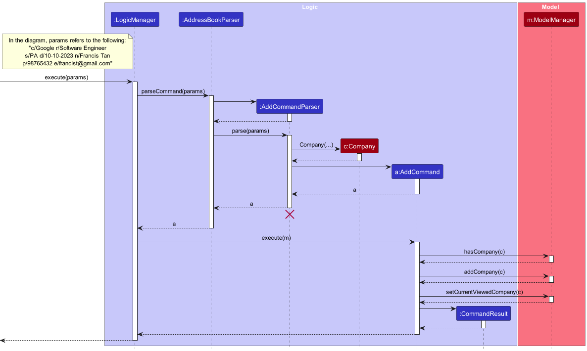
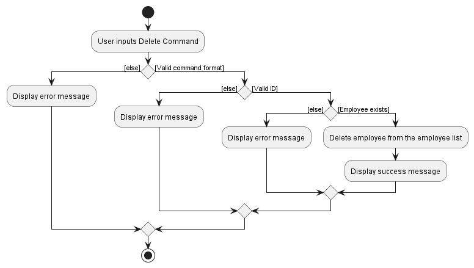
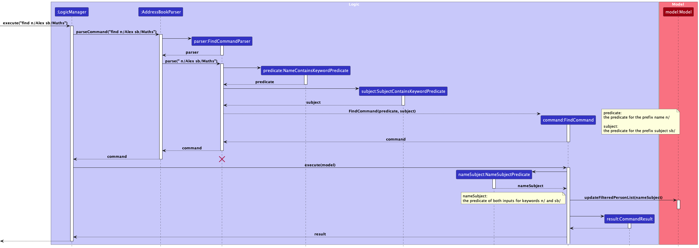
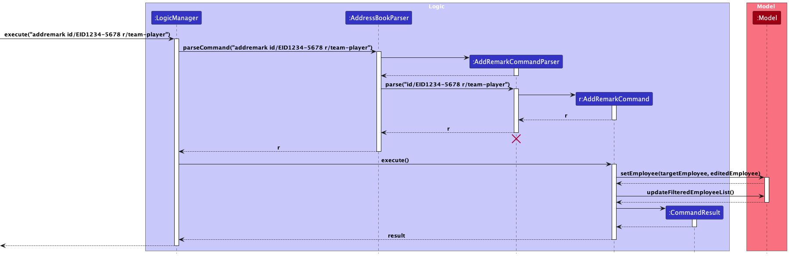
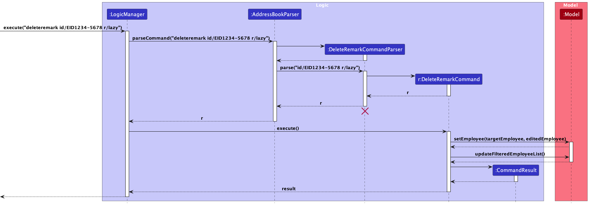
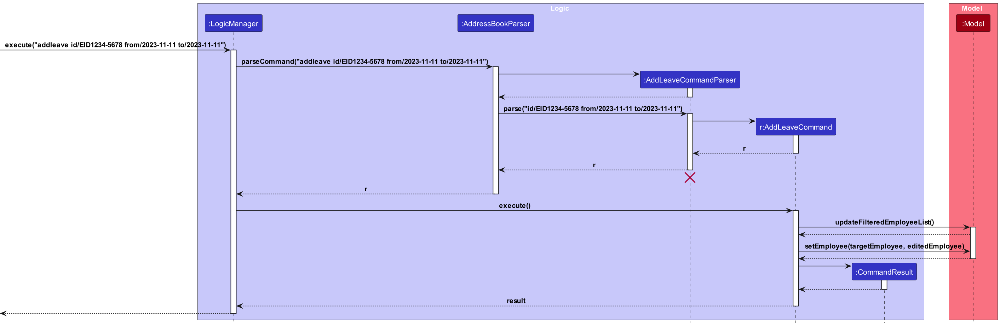

## **Table of Contents**
{:toc}

--------------------------------------------------------------------------------------------------------------------

## **Acknowledgements**

* Adapted from [AB3](https://se-education.org/addressbook-level3/)
* {list here sources of all reused/adapted ideas, code, documentation, and third-party libraries -- include links to the original source as well}

--------------------------------------------------------------------------------------------------------------------

## **Setting up, getting started**

Refer to the guide [_Setting up and getting started_](SettingUp.md).

--------------------------------------------------------------------------------------------------------------------

## **Design**

:bulb: **Tip:** The `.puml` files used to create diagrams in this document `docs/diagrams` folder. Refer to the [_PlantUML Tutorial_ at se-edu/guides](https://se-education.org/guides/tutorials/plantUml.html) to learn how to create and edit diagrams.

### Architecture

The ***Architecture Diagram*** given above explains the high-level design of the App.

Given below is a quick overview of main components and how they interact with each other.

**Main components of the architecture**

**`Main`** (consisting of classes [`Main`](https://github.com/se-edu/addressbook-level3/tree/master/src/main/java/seedu/address/Main.java) and [`MainApp`](https://github.com/se-edu/addressbook-level3/tree/master/src/main/java/seedu/address/MainApp.java)) is in charge of the app launch and shut down.
* At app launch, it initializes the other components in the correct sequence, and connects them up with each other.
* At shut down, it shuts down the other components and invokes cleanup methods where necessary.

The bulk of the app's work is done by the following four components:

* [**`UI`**](#ui-component): The UI of the App.
* [**`Logic`**](#logic-component): The command executor.
* [**`Model`**](#model-component): Holds the data of the App in memory.
* [**`Storage`**](#storage-component): Reads data from, and writes data to, the hard disk.

[**`Commons`**](#common-classes) represents a collection of classes used by multiple other components.

**How the architecture components interact with each other**

The *Sequence Diagram* below shows how the components interact with each other for the scenario where the user issues the command `delete 1`.

Each of the four main components (also shown in the diagram above),

* defines its *API* in an `interface` with the same name as the Component.
* implements its functionality using a concrete `{Component Name}Manager` class (which follows the corresponding API `interface` mentioned in the previous point.

For example, the `Logic` component defines its API in the `Logic.java` interface and implements its functionality using the `LogicManager.java` class which follows the `Logic` interface. Other components interact with a given component through its interface rather than the concrete class (reason: to prevent outside component's being coupled to the implementation of a component), as illustrated in the (partial) class diagram below.

The sections below give more details of each component.

### UI component

The **API** of this component is specified in [`Ui.java`](https://github.com/se-edu/addressbook-level3/tree/master/src/main/java/seedu/address/ui/Ui.java)

The UI consists of a `MainWindow` that is made up of parts e.g.`CommandBox`, `ResultDisplay`, `EmployeeListPanel`, `StatusBarFooter` etc. All these, including the `MainWindow`, inherit from the abstract `UiPart` class which captures the commonalities between classes that represent parts of the visible GUI.

The `UI` component uses the JavaFx UI framework. The layout of these UI parts are defined in matching `.fxml` files that are in the `src/main/resources/view` folder. For example, the layout of the [`MainWindow`](https://github.com/se-edu/addressbook-level3/tree/master/src/main/java/seedu/address/ui/MainWindow.java) is specified in [`MainWindow.fxml`](https://github.com/se-edu/addressbook-level3/tree/master/src/main/resources/view/MainWindow.fxml)

The `UI` component,

* executes user commands using the `Logic` component.
* listens for changes to `Model` data so that the UI can be updated with the modified data.
* keeps a reference to the `Logic` component, because the `UI` relies on the `Logic` to execute commands.
* depends on some classes in the `Model` component, as it displays `Employee` object residing in the `Model`.

### Logic component

**API** : [`Logic.java`](https://github.com/se-edu/addressbook-level3/tree/master/src/main/java/seedu/address/logic/Logic.java)

Here's a (partial) class diagram of the `Logic` component:

The sequence diagram below illustrates the interactions within the `Logic` component, taking `execute("delete 1")` API call as an example.

:information_source: **Note:** The lifeline for `DeleteCommandParser` should end at the destroy marker (X) but due to a limitation of PlantUML, the lifeline reaches the end of diagram.

How the `Logic` component works:

1. When `Logic` is called upon to execute a command, it is passed to an `AddressBookParser` object which in turn creates a parser that matches the command (e.g., `DeleteCommandParser`) and uses it to parse the command.
1. This results in a `Command` object (more precisely, an object of one of its subclasses e.g., `DeleteCommand`) which is executed by the `LogicManager`.
1. The command can communicate with the `Model` when it is executed (e.g. to delete an employee).
1. The result of the command execution is encapsulated as a `CommandResult` object which is returned back from `Logic`.

Here are the other classes in `Logic` (omitted from the class diagram above) that are used for parsing a user command:

How the parsing works:
* When called upon to parse a user command, the `AddressBookParser` class creates an `XYZCommandParser` (`XYZ` is a placeholder for the specific command name e.g., `AddCommandParser`) which uses the other classes shown above to parse the user command and create a `XYZCommand` object (e.g., `AddCommand`) which the `AddressBookParser` returns back as a `Command` object.
* All `XYZCommandParser` classes (e.g., `AddCommandParser`, `DeleteCommandParser`, ...) inherit from the `Parser` interface so that they can be treated similarly where possible e.g, during testing.

### Model component
**API** : [`Model.java`](https://github.com/se-edu/addressbook-level3/tree/master/src/main/java/seedu/address/model/Model.java)

The `Model` component,

* stores the address book data i.e., all `Employee` objects (which are contained in a `UniqueEmployeeList` object).
* stores the currently 'selected' `Employee` objects (e.g., results of a search query) as a separate _filtered_ list which is exposed to outsiders as an unmodifiable `ObservableList<Employee>` that can be 'observed' e.g. the UI can be bound to this list so that the UI automatically updates when the data in the list change.
* stores a `UserPref` object that represents the user’s preferences. This is exposed to the outside as a `ReadOnlyUserPref` objects.
* does not depend on any of the other three components (as the `Model` represents data entities of the domain, they should make sense on their own without depending on other components)

:information_source: **Note:** An alternative (arguably, a more OOP) model is given below. It has a `Department` list in the `AddressBook`, which `Employee` references. This allows `AddressBook` to only require one `Department` object per unique tag, instead of each `Employee` needing their own `Department` objects. 

### Storage component

**API** : [`Storage.java`](https://github.com/se-edu/addressbook-level3/tree/master/src/main/java/seedu/address/storage/Storage.java)

The `Storage` component,
* can save both address book data and user preference data in JSON format, and read them back into corresponding objects.
* inherits from both `AddressBookStorage` and `UserPrefStorage`, which means it can be treated as either one (if only the functionality of only one is needed).
* depends on some classes in the `Model` component (because the `Storage` component's job is to save/retrieve objects that belong to the `Model`)

### Common classes

Classes used by multiple components are in the `seedu.address.commons` package.

--------------------------------------------------------------------------------------------------------------------

## **Implementation**

This section describes some noteworthy details on how certain features are implemented.

### \[Proposed\] Undo/redo feature

#### Proposed Implementation

The proposed undo/redo mechanism is facilitated by `VersionedAddressBook`. It extends `AddressBook` with an undo/redo history, stored internally as an `addressBookStateList` and `currentStatePointer`. Additionally, it implements the following operations:

* `VersionedAddressBook#commit()` — Saves the current address book state in its history.
* `VersionedAddressBook#undo()` — Restores the previous address book state from its history.
* `VersionedAddressBook#redo()` — Restores a previously undone address book state from its history.

These operations are exposed in the `Model` interface as `Model#commitAddressBook()`, `Model#undoAddressBook()` and `Model#redoAddressBook()` respectively.

Given below is an example usage scenario and how the undo/redo mechanism behaves at each step.

Step 1. The user launches the application for the first time. The `VersionedAddressBook` will be initialized with the initial address book state, and the `currentStatePointer` pointing to that single address book state.

Step 2. The user executes `delete EID1234-5678` command to delete an employee in the address book. The `delete` command calls `Model#commitAddressBook()`, causing the modified state of the address book after the `delete EID1234-5678` command executes to be saved in the `addressBookStateList`, and the `currentStatePointer` is shifted to the newly inserted address book state.

Step 3. The user executes `add n/David …​` to add a new employee. The `add` command also calls `Model#commitAddressBook()`, causing another modified address book state to be saved into the `addressBookStateList`.

:information_source: **Note:** If a command fails its execution, it will not call `Model#commitAddressBook()`, so the address book state will not be saved into the `addressBookStateList`.

Step 4. The user now decides that adding the employee was a mistake, and decides to undo that action by executing the `undo` command. The `undo` command will call `Model#undoAddressBook()`, which will shift the `currentStatePointer` once to the left, pointing it to the previous address book state, and restores the address book to that state.

:information_source: **Note:** If the `currentStatePointer` is at index 0, pointing to the initial AddressBook state, then there are no previous AddressBook states to restore. The `undo` command uses `Model#canUndoAddressBook()` to check if this is the case. If so, it will return an error to the user rather
than attempting to perform the undo.

The following sequence diagram shows how the undo operation works:

:information_source: **Note:** The lifeline for `UndoCommand` should end at the destroy marker (X) but due to a limitation of PlantUML, the lifeline reaches the end of diagram.

The `redo` command does the opposite — it calls `Model#redoAddressBook()`, which shifts the `currentStatePointer` once to the right, pointing to the previously undone state, and restores the address book to that state.

:information_source: **Note:** If the `currentStatePointer` is at index `addressBookStateList.size() - 1`, pointing to the latest address book state, then there are no undone AddressBook states to restore. The `redo` command uses `Model#canRedoAddressBook()` to check if this is the case. If so, it will return an error to the user rather than attempting to perform the redo.

Step 5. The user then decides to execute the command `list`. Commands that do not modify the address book, such as `list`, will usually not call `Model#commitAddressBook()`, `Model#undoAddressBook()` or `Model#redoAddressBook()`. Thus, the `addressBookStateList` remains unchanged.

Step 6. The user executes `clear`, which calls `Model#commitAddressBook()`. Since the `currentStatePointer` is not pointing at the end of the `addressBookStateList`, all address book states after the `currentStatePointer` will be purged. Reason: It no longer makes sense to redo the `add n/David …​` command. This is the behavior that most modern desktop applications follow.

The following activity diagram summarizes what happens when a user executes a new command:

#### Design considerations:

**Aspect: How undo & redo executes:**

* **Alternative 1 (current choice):** Saves the entire address book.
  * Pros: Easy to implement.
  * Cons: May have performance issues in terms of memory usage.

* **Alternative 2:** Individual command knows how to undo/redo by
  itself.
  * Pros: Will use less memory (e.g. for `delete`, just save the employee being deleted).
  * Cons: We must ensure that the implementation of each individual command are correct.

_{more aspects and alternatives to be added}_

### \[Proposed\] Data archiving

_{Explain here how the data archiving feature will be implemented}_

### Sort feature

#### Implementation

The proposed sorting mechanism is facilitated by `UniqueEmployeeList`. It implements the following operations:

* `UniqueEmployeeList#sortEmployees(String attribute)` — sorts the internal list according to the attribute given.

These operations are exposed in the `Model` interface as `Model#updateSortedEmployeeList(String attribute)`,  and in `AddressBook `class as `AddressBook#sortEmployees(String attribute)`

Given below is an example usage scenario where the user attempts to sort the list by salary.

The user keys in `sort f/ salary`

the `sort` command will call `Model#updateSortedEmployeeList()`, which in turn calls `AddressBook#sortEmployees()`
which then calls `UniqueEmployeeList#sortEmployees()`.

This will call the `List#sort()` method of the observable list `internalList`, which contains the full list of employees.

Finally, the update to the internalList will change the view of the displayed list in the GUI.

#### Design considerations:

**Aspect: How sort executes:**

* **Alternative 1 (current choice):** Sorts the internal list directly
    * Pros: Easy to implement.
    * Cons: Disable the ability to list by order of employee added.

* **Alternative 2:** Performs a sort on a copied list in `ModelManager`.
    * Pros: Allows the `list` command to list all employees by the order they were added.
    * Cons: Different lists in the `ModelManager` class may cause inconsistencies when `find` and `sort` commands are called consecutively.

### Add Employee feature

The add employee feature allows HouR to add employees to the employee list.

#### Implementation

The add employee command mechanism is facilitated by the `AddCommandParser` class which implements the `Parser` interface.

`AddCommandParser#parse()` is exposed in the `Parser` interface as `Parser#parse()`.

`AddCommandParser` implements the following operations:

* `AddCommandParser#parse()` — Parses the input arguments by storing the prefixes of its respective values as an `ArgumentMultimap`, and creates a new `AddCommand` object with the parsed employee ID, name, phone, email, position, salary, and an optional set of departments.

The `AddCommand` object then communicates with the `Model` API by calling the `Model#addEmployee(Employee)` method, which adds the newly-constructed employee to the existing employee list.

The method `AddCommand#execute()` returns a `CommandResult` object, which stores information about the completion of the command.

The diagram below details how the operation of adding an employee works.

Given below is an example usage scenario for the command.

**Step 1**: The user launches the application.

**Step 2**: The user executes the `add id/EMPLOYEE_ID n/NAME p/PHONE e/EMAIL pos/POSITION s/SALARY d/DEPARTMENT` command in the CLI.

**Step 3**: A new employee will be added to the employee list with the given details.

The following activity diagram summarises what happens when a user executes the add command:

#### Design considerations:

**Aspect: Command-Model Interaction:**

* **Alternative 1 (current choice)**: Utilise `model#addEmployee` to add the new employee into the model instead of doing the direct editing in `AddCommand#execute()`.
    * Pros: Maintain immutability within Employee and Model classes.
    * Cons: Longer command execution, requiring more parts to work together.

* **Alternative 2**: Edit the employee list directly from `AddCommand#execute()`.
    * Pros: Shorter command execution, one less point of failure by eliminating the `model` class.
    * Cons: May violate immutability within Employee and Model classes as well as SLAP by having `AddCommand#execute()` perform the editing directly.

### Delete Employee feature

The delete employee feature allows HouR to delete employees from the employee list.

#### Implementation

The delete employee command mechanism is facilitated by the `DeleteCommandParser` class which implements the `Parser` interface.

`DeleteCommandParser#parse()` is exposed in the `Parser` interface as `Parser#parse()`.

`DeleteCommandParser` implements the following operations:

* `DeleteCommandParser#parse()` — Parses the input argument by storing the ID, and creates a new `DeleteCommand` object with the parsed ID.

The `DeleteCommand` object then communicates with the `Model` API by calling the `Model#deleteEmployee(Employee)` method, which deletes the employee with the given ID from the existing employee list.

The method `DeleteCommand#execute()` returns a `CommandResult` object, which stores information about the completion of the command.

The diagram below details how the operation of deleting an employee works.

Given below is an example usage scenario for the command.

**Step 1**: The user launches the application.

**Step 2**: The user executes the `delete EMPLOYEE_ID` command in the CLI.

**Step 3**: The employee with the given ID will be deleted from the employee list.

The following activity diagram summarises what happens when a user executes the delete command:

#### Design considerations:

**Aspect: Command-Model Interaction:**

* **Alternative 1 (current choice)**: Utilise `model#deleteEmployee` to delete the employee from the model instead of doing the direct editing in `DeleteCommand#execute()`.
    * Pros: Maintain immutability within Employee and Model classes.
    * Cons: Longer command execution, requiring more parts to work together.

* **Alternative 2**: Edit the employee list directly from `DeleteCommand#execute()`.
    * Pros: Shorter command execution, one less point of failure by eliminating the `model` class.
    * Cons: May violate immutability within Employee and Model classes as well as SLAP by having `DeleteCommand#execute()` perform the editing directly.

### Report feature

#### Implementation

The proposed reporting mechanism is facilitated by `ReportCommandParser`. It implements the following operations:

* `ReportCommandParser#parse()` — Parses the input employee ID and creates a new `ReportCommand` object with the parsed employee ID.

The `ReportCommand` object then communicates with the `Model` and `ReportStorage` APIs by calling the following methods:

* `Model#getFilteredEmployeeList()` — Gets the existing employee list, which is then looped through to get the employee with the given employee ID.

* `ReportStorage#saveReport(Report)` — Saves the report generated in `ReportCommand#execute()` by `ReportCommand#generateReport(employee)`, which is then stored on the hard disk as a `.txt` file.

The method `ReportCommand#execute()` returns a `CommandResult` object, which stores information about the completion of the command.

The following sequence diagram below shows how the report operation works:

Given below is an example usage scenario for the command:

**Step 1**: The user launches the application.

**Step 2**: The user executes the `report id/EMPLOYEE_ID` command in the CLI.

**Step 3**: A report will be generated for the employee with the given ID.

The following activity diagram summarises what happens when a user executes the report command:

#### Design considerations:

**Aspect: Command-Model Interaction**

* **Alternative 1 (current choice):** Utilise `Model#getFilteredEmployeeList()` to get the existing employee list, which is then looped through to get the employee with the given employee ID.
    * Pros: Maintain immutability within Employee and Model classes.
    * Cons: Longer command execution, requiring more parts to work together.

* **Alternative 2:** Create methods in `Model` class specifically to get the employee with the given employee ID.
    * Pros: Shorter command execution.
    * Cons: May reduce immutability between Employee and Model classes.

**Aspect: Command-Storage Interaction**

* **Alternative 1 (current choice):** Utilise a dedicated storage class `ReportStorage` with the method `ReportStorage#saveReport(Report)` to save the report.
    * Pros: Maintain SRP and SLAP within the command class.
    * Cons: Longer command execution, requiring more parts to work together.

* **Alternative 2:** Create methods in `ReportCommand` class to write and save the report.
    * Pros: Shorter command execution, one less point of failure by eliminating the `ReportStorage` class.
    * Cons: Less OOP, may violate SLAP within the command class.

### Find Employee feature

The find employee feature allows HouR to find employees that match the given search criteria from the employee list.

#### Implementation

The find employee command mechanism is facilitated by the `FindCommandParser` class which implements the `Parser` interface.

`FindCommandParser#parse()` is exposed in the `Parser` interface as `Parser#parse()`.

`FindCommandParser` implements the following operations:

* `FindCommandParser#parse()` — Parses the input argument, splits it into an array of keywords, creates an instance of `EmployeeContainsKeywordsPredicate` using the keywords, and creates a new `FindCommand` object with the newly-created predicate instance.

The `FindCommand` object then communicates with the `Model` API by calling the `Model#updateFilteredEmployeeList(Predicate)` method, which updates the view of the application to show all employees that match the given search criteria.

The method `FindCommand#execute()` returns a `CommandResult` object, which stores information about the completion of the command.

The diagram below details how the operation of finding an employee works.

Given below is an example usage scenario for the command.

**Step 1**: The user launches the application.

**Step 2**: The user executes the `find KEYWORD [MORE_KEYWORDS]…​` command in the CLI.

**Step 3**: The employee list will be updated to show only employees that match the given search criteria.

The following activity diagram summarises what happens when a user executes the find command:

#### Design considerations:

**Aspect: Command-Model Interaction:**

* **Alternative 1 (current choice)**: Utilise `model#updateFilteredEmployeeList` to update the view of the application to show all employees that match the given search criteria.
    * Pros: Maintains data, maintain immutability within the FindCommand and Model classes.
    * Cons: Longer command execution, requiring more parts to work together.

* **Alternative 2**: Edit the employee list directly from `FindCommand#execute()` to display only employees that match the given search criteria.
   * Pros: Shorter command execution, one less point of failure by eliminating the `model` class.
   * Cons: May violate immutability within FindCommand and Model classes as well as SLAP by having `FindCommand#execute()` perform the editing directly.

### Reset feature

The reset feature allows HouR to reset employee overtime hours and leaves.

#### Implementation

The reset command mechanism is facilitated by `ResetCommandParser` class which implements the `Parser` interface.

`ResetCommandParser#parse()` is exposed in the `Parser` interface as `Parse#parse()`.

`ResetCommandParser` implements the following operations:
* `ResetCommandParser#parse()` — Parses the input arguments by storing the index and the prefix of its respective values as an `ArgumentMultimap`,
and creates a new `ResetCommand` object with the parsed field.

The `ResetCommand` object then communicates with the `Model` API by calling the following methods:
* `Model#setEmployee(Employee, Employee)` — Sets the employee in the existing employee list to the new `Employee` object which has been edited by `ResetCommand#execute()`.
* `Model#updateFilteredEmployeeList(Predicate)` — Updates the view of the application to show all employees.

The method `ResetCommand#execute()` returns a new `CommandResult` object, which stores information about the completion of the command.

The following sequence diagram below shows how the reset operation works:

Given below is an example usage scenario for the command:

**Step 1**: The user launches the application.

**Step 2**: The user executes the `reset f/FIELD` command in the CLI (note that only `overtime` and `leaves` are valid).

**Step 3**: The given field of all employees in the employee book will be reset to their default value.

The following activity diagram summarizes what happens when a user executes the reset command:

#### Design considerations:

**Aspect: Model-Employee Interaction:**

* **Alternative 1 (current choice):** Utilise `Model#setEmployee` to add the edited employee into the model, doing the direct editing in `ResetCommand#execute()`.
    * Pros: Maintain immutability within Employee and Model classes.
    * Cons: Potentially violates SRP.

* **Alternative 2:** Create methods in `Model` class specifically to edit the fields of the employees.
    * Pros: More OOP, follows SRP by not having `ResetCommand#execute()` perform the editing directly.
    * Cons: Longer command execution, requiring more parts to work together.

### Add Remark feature

The add remark feature allows HouR to add employee remarks.

#### Implementation

The add remark command mechanism is facilitated by `AddRemarkCommandParser` class which implements the `Parser` interface.

`AddRemarkCommandParser#parse()` is exposed in the `Parser` interface as `Parse#parse()`.

`AddRemarkCommandParser` implements the following operations:
* `AddRemarkCommandParser#parse()` — Parses the input arguments by storing the index and the prefix of its respective values as an `ArgumentMultimap`,
  and creates a new `AddRemarkCommand` object with the parsed id and remark.

The `AddRemarkCommand` object then communicates with the `Model` API by calling the following methods:
* `Model#setEmployee(Employee, Employee)` — Sets the employee in the existing employee list to the new `Employee` object which has been edited by `AddRemarkCommand#execute()`.
* `Model#updateFilteredEmployeeList(Predicate)` — Updates the view of the application to show all employees.

The method `AddRemarkCommand#execute()` returns a new `CommandResult` object, which stores information about the completion of the command.

The following sequence diagram below shows how the add remark operation works:

Given below is an example usage scenario for the command:

**Step 1**: The user launches the application.

**Step 2**: The user executes the `addremark id/EMPLOYEE_ID r/REMARK` command in the CLI.

**Step 3**: The given remark will be added to the remark list of the employee with the given id.

**Aspect: Model-Employee Interaction:**

* **Alternative 1 (current choice)**: Utilise `model#setEmployee` to add the edited employee into the model, doing the direct editing in `AddRemarkCommand#execute()`.
    * Pros: Maintain immutability within Employee and Model classes.
    * Cons: Potentially violates SRP.

* **Alternative 2**: Create methods in model specifically to edit the `remarkList` attribute of the employee.
    * Pros: More OOP, follows SRP by not having `AddRemarkCommand#execute()` perform the editing directly.
    * Cons: Longer command execution, requires more parts to work together.

### Delete Remark feature

The delete remark feature allows HouR to delete employee remarks.

#### Implementation

The delete remark command mechanism is facilitated by `DeleteRemarkCommandParser` class which implements the `Parser` interface.

`DeleteRemarkCommandParser#parse()` is exposed in the `Parser` interface as `Parse#parse()`.

`DeleteRemarkCommandParser` implements the following operations:
* `DeleteRemarkCommandParser#parse()` — Parses the input arguments by storing the index and the prefix of its respective values as an `ArgumentMultimap`,
  and creates a new `DeleteRemarkCommand` object with the parsed id and remark.

The `DeleteRemarkCommand` object then communicates with the `Model` API by calling the following methods:
* `Model#setEmployee(Employee, Employee)` — Sets the employee in the existing employee list to the new `Employee` object which has been edited by `DeleteRemarkCommand#execute()`.
* `Model#updateFilteredEmployeeList(Predicate)` — Updates the view of the application to show all employees.

The method `DeleteRemarkCommand#execute()` returns a new `CommandResult` object, which stores information about the completion of the command.

The following sequence diagram below shows how the delete remark operation works:

Given below is an example usage scenario for the command:

**Step 1**: The user launches the application.

**Step 2**: The user executes the `deleteremark id/EMPLOYEE_ID r/REMARK` command in the CLI.

**Step 3**: The given remark will be deleted from the remark list of the employee with the given id.

**Aspect: Model-Employee Interaction:**

* **Alternative 1 (current choice)**: Utilise `model#setEmployee` to add the edited employee into the model, doing the direct editing in `DeleteRemarkCommand#execute()`.
    * Pros: Maintain immutability within Employee and Model classes.
    * Cons: Potentially violates SRP.

* **Alternative 2**: Create methods in model specifically to edit the `remarkList` attribute of the employee.
    * Pros: More OOP, follows SRP by not having `DeleteRemarkCommand#execute()` perform the editing directly.
    * Cons: Longer command execution, requires more parts to work together.

### Add Leave feature

The add leave feature allows HouR to manage employee leaves.

#### Implementation

The add leave command mechanism is facilitated by the `AddLeaveCommandParser` class which extends the `AddressbookParser`.

`AddLeaveCommandParser#parse()` overrides  `Parser#parse()` in the Parser interface.

`AddLeaveCommandParser` implements the following operations:

* `AddLeaveCommandParser#parse()` — Parses the input arguments by storing the prefixes of its respective values as an `ArgumentMultimap`, and creates a new `AddLeaveCommand` object with the parsed employee ID, start date and end date.

The `AddLeaveCommand` object then communicates with the `Model` API by calling the following methods:

* `Model#setEmployee(Employee, Employee)` — Sets the employee in the existing employee list to the new `Employee` object which has been edited by `AddLeaveCommand#execute()`.
* `Model#updateFilteredEmployeeList(Predicate)` — Updates the view of the application to show all employees.

The method `AddLeaveCommand#execute()` returns a `CommandResult` object, which stores information about the completion of the command.

The diagram below details how the operation of adding leave date(s) works.

Given below is an example usage scenario for the command.

**Step 1**: The user launches the application.

**Step 2**: The user executes the `addleave id/EMPLOYEE_ID from/START_DATE to/END_DATE` command in the CLI.
* `START_DATE` and `END_DATE` are inputs of format `yyyy-MM-dd`.

**Step 3**: A leave period will be assigned to the employee specified with the employee ID input.
* The leave period is added as a list of `Leave` dates in the Employee's `leaveList`.

#### Design considerations:

**Aspect: Model-Employee Interaction:**

* **Alternative 1 (current choice)**: Utilise `model#setEmployee` to add the edited employee into the model, doing the direct editing in AddLeaveCommand#execute().
    * Pros: Maintain immutability within Employee and Model classes.
    * Cons: Potentially violates the Single Responsibility Principle.

* **Alternative 2**: Create methods in model specifically to edit the `leaveList` attribute of the employee.
    * Pros: More OOP, follows the Single Responsibility Principle by not having `AddLeaveCommand#execute()` perform the editing directly.
    * Cons: Longer command execution, requires more parts to work together.

### Edit Leave feature

The edit leave feature allows HouR to edit employee leaves.

#### Implementation

The edit leave command mechanism is facilitated by `EditLeaveCommandParser` class which implements the `Parser` interface.

`EditLeaveCommandParser#parse()` is exposed in the `Parser` interface as `Parse#parse()`.

`EditLeaveCommandParser` implements the following operations:
* `EditLeaveCommandParser#parse()` — Parses the input arguments by storing the index and the prefix of its respective values as an `ArgumentMultimap`,
  and creates a new `EditLeaveCommand` object with the parsed id, old and new leave dates.

The `EditLeaveCommand` object then communicates with the `Model` API by calling the following methods:
* `Model#setEmployee(Employee, Employee)` — Sets the employee in the existing employee list to the new `Employee` object which has been edited by `EditLeaveCommand#execute()`.
* `Model#updateFilteredEmployeeList(Predicate)` — Updates the view of the application to show all employees.

The method `EditLeaveCommand#execute()` returns a new `CommandResult` object, which stores information about the completion of the command.

The following sequence diagram below shows how the edit leave operation works:

Given below is an example usage scenario for the command:

**Step 1**: The user launches the application.

**Step 2**: The user executes the `editleave id/EMPLOYEE_ID old/OLD_DATE new/NEW_DATE` command in the CLI.

**Step 3**: The given remark will be deleted from the remark list of the employee with the given id.

The following activity diagram summarizes what happens when a user executes the edit leave command:

#### Design considerations:

**Aspect: Model-Employee Interaction:**

* **Alternative 1 (current choice)**: Utilise `model#setEmployee` to add the edited employee into the model, doing the direct editing in `DeleteRemarkCommand#execute()`.
    * Pros: Maintain immutability within Employee and Model classes.
    * Cons: Potentially violates SRP.

* **Alternative 2**: Create methods in model specifically to edit the `remarkList` attribute of the employee.
    * Pros: More OOP, follows SRP by not having `DeleteRemarkCommand#execute()` perform the editing directly.
    * Cons: Longer command execution, requires more parts to work together.

### List Leave feature

The list leave feature allows HouR user to view employees on leave on the specified date.

#### Implementation

The list leave command mechanism is facilitated by the `ListLeaveCommandParser` class which extends the `AddressbookParser`.

`ListLeaveCommandParser#parse()` overrides  `Parser#parse()` in the Parser interface.

`ListLeaveCommandParser` implements the following operations:

* `ListLeaveCommandParser#parse()` — Parses the input arguments by storing the prefixes of its respective values as an `ArgumentMultimap`, and creates a new `ListLeaveCommand` object with the parsed employee ID, start date and end date.

The `ListLeaveCommand` object then communicates with the `Model` API by calling the following methods:

* `Model#updateFilteredEmployeeList(Predicate)` — Updates the view of the application to show all employees.

The method `ListLeaveCommand#execute()` returns a `CommandResult` object, which stores information about the completion of the command.

The diagram below details how the operation of listing employees on leave on the specified date works.

Given below is an example usage scenario for the command.

**Step 1**: The user launches the application.

**Step 2**: The user executes the `listleave on/DATE` command in the CLI.
* `DATE` is an input of format `yyyy-MM-dd`.

**Step 3**: Employees will be filtered based on whether they are on leave on the specified date.
* The Employee List will be updated to contain only employees which have leaves taken on the specified date.

_{more aspects and alternatives to be added}_

--------------------------------------------------------------------------------------------------------------------

## **Documentation, logging, testing, configuration, dev-ops**

* [Documentation guide](Documentation.md)
* [Testing guide](Testing.md)
* [Logging guide](Logging.md)
* [Configuration guide](Configuration.md)
* [DevOps guide](DevOps.md)

--------------------------------------------------------------------------------------------------------------------

## **Appendix: Requirements**

### Product scope

HouR is a desktop app for human resources staff managing employee data, including performance metrics, optimised for use via a Command Line Interface (CLI) while still having the benefits of a Graphical User Interface (GUI). If you can type fast, HouR can get your employee management tasks done faster than traditional GUI apps.

**Target user profile**:

* has a need to manage a significant number of employee records
* prefer desktop apps over other types
* can type fast
* prefers typing to mouse interactions
* is reasonably comfortable using CLI apps

**Value proposition**: manage contacts faster than a typical mouse/GUI driven app

### User stories

Priorities: High (must have) - `* * *`, Medium (nice to have) - `* *`, Low (unlikely to have) - `*`

| Priority | As a …​                 | I want to …​                                                                       | So that I can…​                                                                |
|----------|-------------------------|------------------------------------------------------------------------------------|--------------------------------------------------------------------------------|
| `* * *`  | new user                | add/delete dummy data                                                              | familiarise myself with the commands available                                 |
| `* * *`  | beginner user           | delete existing employee record                                                    | remove ex-employees from database                                              |
| `* * *`  | beginner user           | see the list of all employee data                                                  | easily view all the employee data in one place                                 |
| `* * *`  | beginner user           | add new employees to the database                                                  | keep the records up-to-date                                                    |
| `* * *`  | new user                | see clear error messages when I enter incorrect or incomplete information          | correct mistakes efficiently                                                   |
| `* *`    | beginner user           | assign departments to employees                                                    | organise them according to different departments                               |
| `* *`    | new user                | access a user guide                                                                | know how to set up and launch the application                                  |
| `* *`    | new user                | purge all current data                                                             | get rid of sample/experimental data I used for exploring the app               |
| `* *`    | intermediate user       | modify existing records                                                            | update employees’ information and categories                                   |
| `* *`    | intermediate user       | filter and search certain employees based on criteria like department and salaries | look for the data I need                                                       |
| `* *`    | intermediate user       | sort the data / records by date and categories                                     | view relevant data in a more organised manner                                  |
| `* *`    | intermediate user       | allocate leaves for employees                                                      | keep track of the leave schedule of each employee                              |
| `* *`    | intermediate user       | check the leave status of employees                                                | better plan my manpower and schedule work for each employee                    |
| `* *`    | intermediate user       | view employees who are on leave on certain dates                                   | ensure that there is enough manpower every day                                 |
| `* *`    | intermediate user       | generate individual employee reports                                               | have an overview of the performance of each employee                           |
| `* *`    | intermediate user       | keep track of overtime hours of employees                                          | keep track of employee productivity and compensate them fairly (overtime pay)  |
| `* *`    | intermediate user       | reset specific fields of all employees                                             | reset fields like overtime hours and leaves regularly (monthly/yearly)         |
| `* *`    | intermediate user       | batch delete records                                                               | keep my database organised and clutter-free                                    |
| `* *`    | long-time user          | private individuals’ personal details                                              | minimise the chance of someone else seeing them by accident and violating PDPA |
| `*`      | new user                | access a quick tutorial or guided tour                                             | learn how to use basic features of the application                             |
| `*`      | forgetful beginner user | access a command summary                                                           | easily know which commands to use                                              |
| `*`      | intermediate user       | create keyboard shortcuts for tasks                                                | save time on frequently performed tasks                                        |
| `*`      | long-time user          | conduct advanced searches with multiple criteria                                   | gain deeper insights into employee performance                                 |
| `*`      | long-time user          | access a knowledge base or community forum                                         | share best practices and learn from other experienced users                    |
| `*`      | long-time user          | share / collaborate with other colleagues in my department                         | distribute work with my colleagues                                             |
| `*`      | long-time user          | archive unused data                                                                | not distracted by irrelevant data                                              |

### Use cases

(For all use cases below, the **System** is the `HouR` and the **Actor** is the `user`, unless specified otherwise)

**Use case: Add an employee**

**MSS**

1.  User requests to add a specific employee
2.  HouR adds the employee to the list of employees

    Use case ends.

**Extensions**

* 1a. The employee to be added already exists in the list.
    * 1a1. HouR shows an error message.

  Use case ends.

**Use case: Delete an employee**

**MSS**

1.  User requests to list employees
2.  HouR shows a list of employees
3.  User requests to delete a specific employee in the list
4.  HouR deletes the employee

    Use case ends.

**Extensions**

* 2a. The list is empty.

  Use case ends.

* 3a. The given employee id is invalid.

    * 3a1. HouR shows an error message.

      Use case resumes at step 2.

**Use case: Edit an employee**

**MSS**

1.  User requests to list employees
2.  HouR shows a list of employees
3.  User requests to edit a specific employee in the list
4.  HouR edits the employee

    Use case ends.

**Extensions**

* 2a. The list is empty.

  Use case ends.

* 3a. The given index is invalid.

    * 3a1. HouR shows an error message.

      Use case resumes at step 2.

* 3b. Missing field to edit.

    * 3a1. HouR shows an error message.

      Use case resumes at step 2.

**Use case: List employees**

**MSS**

1.  User requests to list employees
2.  HouR display a list of every employee that has been added

    Use case ends.

**Use case: Find employees**

**MSS**

1.  User requests to find employees with keyword
2.  HouR returns list of employees with keyword

    Use case ends.

**Extensions**

* 1a. User leaves out keyword.
    * 1a1. HouR shows an error message.

  Use case returns back to step 1.

* 1b. No employee matches given keyword.
    * 1b1. HouR shows an empty list.

  Use case ends.

**Use case: Sort employees**

**MSS**

1.  User requests to sort employees by given attribute
2.  HouR returns the sorted list of employees by given attribute

    Use case ends.

**Extensions**

* 1a. User leaves out keyword.
    * 1a1. HouR shows an error message.

  Use case returns back to step 1.

* 1b. No attribute matches given attribute.
    * 1b1. HouR shows an error message.

  Use case returns back to step 1.

**Use case: Report employee**

**MSS**

1.  User requests to generate a report of employee with given employee ID
2.  HouR returns the report of employee with given employee ID

    Use case ends.

**Extensions**

* 1a. User leaves out employee ID.
    * 1a1. HouR shows an error message.

  Use case returns back to step 1.

* 1b. No employee matches given employee ID.
    * 1b1. HouR shows an error message.

  Use case returns back to step 1.

**Use case: Clear employee book**

**MSS**

1.  User requests to clear employee book
2.  HouR clears employee book

    Use case ends.

**Use case: Reset field of all employees**

**MSS**

1.  User requests to reset given field of all employees
2.  HouR returns the list of employees with default value for given field

    Use case ends.

**Extensions**

* 1a. User leaves out field.
    * 1a1. HouR shows an error message.

  Use case returns back to step 1.

* 1b. Given field cannot be reset.
    * 1b1. HouR shows an error message.

  Use case returns back to step 1.

**Use case: Exit HouR**

**MSS**

1.  User requests to exit HouR
2.  HouR exits

    Use case ends.

*{More to be added}*

### Non-Functional Requirements

1. Should work on any mainstream OS as long as it has Java 11 or above installed.
2. Should be able to hold up to 1000 employees without a noticeable sluggishness in performance for typical usage.
3. A user with above-average typing speed for regular English text (i.e. not code, not system admin commands)
   should be able to accomplish most of the tasks faster using commands than using the mouse.
4. The commands should be intuitive to use and easy to remember for the average user (i.e. no complex commands)
5. The system should be usable by a novice who has never managed HR data before, without a steep learning curve.
6. The product is required to handle the export of reports as text files, but not their printing.
7. The app only supports English.
8. The system should be able to recover from crashes gracefully, and should not corrupt the data file if one occurs.
9. The system should provide clear and comprehensive error messages in the event of invalid user input.
10. The system should have a low resource footprint, i.e. it should not consume a lot of memory or CPU resources.

### Glossary

* **Mainstream OS**: Windows, Linux, Unix, OS-X
* **Employee**: A worker in the company

*{More to be added}*

--------------------------------------------------------------------------------------------------------------------

## **Appendix: Instructions for manual testing**

Given below are instructions to test the app manually.

:information_source: **Note:** These instructions only provide a starting point for testers to work on;
testers are expected to do more *exploratory* testing.

### Launch and shutdown

1. Initial launch

   1. Download the jar file and copy into an empty folder

   1. Double-click the jar file. Expected: Shows the GUI with a set of sample employees. The window size may not be optimum.

1. Saving window preferences

   1. Resize the window to an optimum size. Move the window to a different location. Close the window.

   1. Re-launch the app by double-clicking the jar file. 
       Expected: The most recent window size and location is retained.

1. Shutdown using the UI

   1. Click the `X` button on the top right corner of the window. 
       Expected: The window closes.

1. Shutdown using the `exit` command

   1. Type `exit` in the command box and press Enter. 
      Expected: The window closes.

### Deleting an employee

1. Deleting an employee while all employees are being shown

   1. Prerequisites: List all employees using the `list` command. Multiple employees in the list.

   1. Test case: `delete EID1234-5678` 
      Expected: Employee with employee ID "EID1234-5678" is deleted from the list. Details of the deleted employee shown in the status message. Timestamp in the status bar is updated.

   1. Test case: `delete 0` 
      Expected: No employee is deleted. Error details shown in the status message. Status bar remains the same.

   1. Other incorrect delete commands to try: `delete`, `delete x`, `...` (where x is an invalid employee ID) 
      Expected: Similar to previous.

### Finding an employee

1. Finding an employee while all employees are being shown

   1. Prerequisites: List all employees using the `list` command. Multiple employees in the list. Employee with name "Alex" is in the list. Employee with position "manager" is in the list. Employee with employee ID "EID1234-5678" is in the list. Employee with employee ID "EID0000-0000" is not in the list. Employee with position "notAManager" is not in the list.

   1. Test case: `find Alex` 
      Expected: Employee with name "Alex" is shown in the list. The status bar shows the number of employees shown in the list.

   1. Test case: `find abcdef` 
      Expected: No employee is shown in the list. The status bar shows the number of employees shown in the list.

   1. Test case: `find manager` 
      Expected: All employees with the word "manager" in their position are shown in the list. The status bar shows the number of employees shown in the list.

   1. Test case: `find notAManager` 
      Expected: No employee is shown in the list. The status bar shows the number of employees shown in the list.

   1. Test case: `find EID1234-5678` 
      Expected: Employee with employee ID "EID1234-5678" is shown in the list. The status bar shows the number of employees shown in the list.

   1. Test case: `find EID0000-0000` 
      Expected: No employee is shown in the list. The status bar shows the number of employees shown in the list.

   1. Test case: `find` 
      Expected: Invalid command format error message is shown in the status bar.

1. Finding an employee when only some employees are being shown.

   1. Prerequisites: List only some employees using the `find manager` command. Multiple employees in the list. Employee with name "Alex" is in the list. Three employees with position "manager" are in the list. Employee with employee ID "EID1234-5678" is in the list. Employee with employee ID "EID0000-0000" is not in the list. Employee with position "notAManager" is not in the list.

   1. Test case: `find Alex` 
      Expected: Employee with name "Alex" is shown in the list. The status bar shows the number of employees shown in the list.

   1. Test case: `find abcdef` 
      Expected: No employee is shown in the list. The status bar shows the number of employees shown in the list.

   1. Test case: `find manager` 
      Expected: All employees with the word "manager" in their position are shown in the list. The status bar shows the number of employees shown in the list.

   1. Test case: `find notAManager` 
      Expected: No employee is shown in the list. The status bar shows the number of employees shown in the list.

   1. Test case: `find EID1234-5678` 
      Expected: Employee with employee ID "EID1234-5678" is shown in the list. The status bar shows the number of employees shown in the list.

   1. Test case: `find EID0000-0000` 
      Expected: No employee is shown in the list. The status bar shows the number of employees shown in the list.

   1. Test case: `find` 
      Expected: Invalid command format error message is shown in the status bar.

1. Finding an employee in an empty employee book

   1. Prerequisites: Clear the employee book using the `clear` command.

   1. Test case: `find Alex` 
      Expected: No employee is shown in the list. The status bar shows the number of employees shown in the list.

   1. Test case: `find abcdef` 
      Expected: No employee is shown in the list. The status bar shows the number of employees shown in the list.

   1. Test case: `find manager` 
      Expected: No employee is shown in the list. The status bar shows the number of employees shown in the list.

   1. Test case: `find notAManager` 
      Expected: No employee is shown in the list. The status bar shows the number of employees shown in the list.

   1. Test case: `find EID1234-5678` 
      Expected: No employee is shown in the list. The status bar shows the number of employees shown in the list.

   1. Test case: `find EID0000-0000` 
      Expected: No employee is shown in the list. The status bar shows the number of employees shown in the list.

   1. Test case: `find` 
      Expected: Invalid command format error message is shown in the status bar.

### Generating a report for an employee

1. Generating report while all employees are being shown

   1. Prerequisites: List all employees using the `list` command. Multiple employees in the list. Employee with employee ID "EID1234-5678" is in the list. Employee with employee ID "EID0000-0000" is not in the list.

   1. Test case: `report EID1234-5678` 
      Expected: The report of employee with employee ID "EID1234-5678" is shown in the status bar. The report is also downloaded as a text file in a directory called "reports" in the same directory as the jar file.

   1. Test case: `report EID0000-0000` 
      Expected: No report is shown in the status bar. Error details about the invalid employee ID shown in the status bar. No report is downloaded.

   1. Test case: `report` 
      Expected: Invalid command format error message is shown in the status bar.

1. Generating report while only some employees are being shown.

   1. Prerequisites: List only some employees using the `find manager` command. Multiple employees in the list. Employee with employee ID "EID1234-5678" is in the list. Employee with employee ID "EID0000-0000" is not in the list.

   1. Test case: `report EID1234-5678` 
      Expected: The report of employee with employee ID "EID1234-5678" is shown in the status bar. The report is also downloaded as a text file in a directory called "reports" in the same directory as the jar file.

   1. Test case: `report EID0000-0000` 
      Expected: No report is shown in the status bar. Error details about the invalid employee ID shown in the status bar. No report is downloaded.

   1. Test case: `report` 
      Expected: Invalid command format error message is shown in the status bar.

1. Generating report with an empty employee book

   1. Prerequisites: Clear the employee book using the `clear` command.

   1. Test case: `report EID1234-5678` 
      Expected: No report is shown in the status bar. Error details about the invalid employee ID shown in the status bar. No report is downloaded.

   1. Test case: `report EID0000-0000` 
      Expected: No report is shown in the status bar. Error details about the invalid employee ID shown in the status bar. No report is downloaded.

   1. Test case: `report` 
      Expected: Invalid command format error message is shown in the status bar.

### Adding Leave for an Employee

1. Adding leave while all employees are being shown

   1. Prerequisites: List all employees using the `list` command. At least 1 employee is in the list.
   Employee with employee ID "EID1234-5678" is in the list, and has one leave date "2023-11-11" in his LeaveList.

   2. Test case: `addleave id/EID1234-5678 from/2023-12-04 to/2023-12-05` 
   Expected: The leave dates "2023-12-04" and "2023-12-05" are added to the leave list of the employee with ID "EID1234-5678".
   Details of the employee's leave list shown in the result display.

   3. Test case: `addleave id/EID0000-0000 from/2023-12-04 to/2023-12-05` 
   Expected: No employee leave is added (ID does not exist). Error details shown in the result display.

   4. Test case: `addleave id/EID12345678 from/2023-12-04 to/2023-12-05` or `addleave id/EID1234-5678 from/2023-30-11 to/2023-30-11` 
     Expected: No employee leave is added (incorrect field format). Error details shown in the result display.

   5. Test case: `addleave id/ from/2023-12-04 to/2023-12-05` or `addleave id/EID1234-5678 from/ to/2023-12-05` or `addleave id/EID1234-5678 from/2023-12-04 to/` 
     Expected: No employee leave is added (empty fields). Error details shown in the result display.

   6. Test case: `addleave from/2023-12-04 to/2023-12-05` or `addleave id/EID1234-5678 to/2023-12-05` or `addleave id/EID1234-5678 from/2023-12-04` 
     Expected: No employee leave is added (missing parameters). Error details shown in the result display.
   
   7. Test case: `addleave id/EID1234-5678 from/2023-11-11 to/2023-11-13` 
     Expected: No employee leave is added (leave date(s) already exists). Error details shown in the result display.

   8. Test case: `addleave id/EID1234-5678 from/2023-12-05 to/2023-12-04` 
     Expected: No employee leave is added (invalid date order). Error details shown in the result display.

1. Adding leave while only some employees are being shown 

   1. Prerequisites: Filter some employees using the `find Marketing` command. Some employees in the list.
     Employee with id "EID1234-5678" has leaves "2023-11-11" and "2023-11-12" and is not in displayed list.

   2. Try the test cases in the previous section (Adding leave while all employees are being shown)
     Expected: Same as the previous section

### Editing Leave for an Employee

1. Editing leave while all employees are being shown

   1. Prerequisites: List all employees using the `list` command. Multiple employees in the list.
      Employee with id "EID1234-5678" has leaves "2023-11-01" and "2023-11-02".

   1. Test case: `editleave id/EID1234-5678 old/2023-11-01 new/2023-11-03` 
      Expected: The previous leave date "2023-11-01" of the employee with id "EID1234-5678" will be changed to "2023-11-03".
      Details of the edited employee shown in the result display.

   1. Test case: `editleave id/EID0000-0000 old/2023-11-01 new/2023-11-03` 
      Expected: No employee leave is edited (no existing id). Error details shown in the result display.

   1. Test case: `editleave id/12345678 old/2023-11-01 new/2023-11-03` or `editleave id/EID1234-5678 old/2023-28-11 new/2023-30-11` 
      Expected: No employee leave is edited (incorrect field format). Error details shown in the result display.

   1. Test case: `editleave id/ old/2023-11-01 new/2023-11-03` or `editleave id/EID1234-5678 old/ new/2023-11-03` or `editleave id/EID1234-5678 old/2023-11-01 new/` 
      Expected: No employee leave is edited (empty fields). Error details shown in the result display.

   1. Test case: `editleave old/2023-11-01 new/2023-11-03` or `editleave id/EID1234-5678 new/2023-11-03` or `editleave id/EID1234-5678 old/2023-11-01` 
      Expected: No employee leave is edited (missing parameters). Error details shown in the result display.

   1. Test case: `editleave id/EID1234-5678 old/2023-11-03 new/2023-11-04` 
      Expected: No employee leave is edited (old leave doesn't exist). Error details shown in the result display.

   1. Test case: `editleave id/EID1234-5678 old/2023-11-01 new/2023-11-02` 
      Expected: No employee leave is edited (new leave already exists). Error details shown in the result display.

1. Editing leave while only some employees are being shown

   1. Prerequisites: Filter some employees using the `find Marketing` command. Some employees in the list.
      Employee with id "EID1234-5678" has leaves "2023-11-01" and "2023-11-02" and is not in displayed list.

   1. Try the test cases in the previous section (Editing leave while all employees are being shown)
      Expected: Same as the previous section

### Listing Employees on Leave on a specified date

1. Listing employees on leave while all employees are being shown
   1. Prerequisites: List all employees using the `list` command. At least one employee in the list.
        Employee with id "EID1234-5678" has leaves "2023-11-01" and "2023-11-02". No employees on leave on "2023-11-11".

   2. Test case: `listleave on/2023-11-01` 
     Expected: The employees on leave on the specified date are displayed in the employee list.
     Details of the number of employees on leave on the specified date shown in the result display.

   3. Test case: `listleave on/2023-11-11` 
      Expected: No employee displayed (no employees on leave on specified date).
      Details of the number of employees on leave on the specified date shown in the result display.

   4. Test case: `listleave on/11-11-2023` 
     Expected: No employee displayed (incorrect field format). Error details shown in the result display.

   5. Test case: `listleave on/ ` 
   Expected: No employee displayed (empty field). Error details shown in the result display.

   6. Test case: `listleave ` 
     Expected: No employee displayed (missing parameters). Error details shown in the result display.

2. Listing employees on leave while only some employees are being shown

   1. Prerequisites: Filter some employees using the `find Marketing` command. Some employees in the list.
      Employee with id "EID1234-5678" has leaves "2023-11-01" and "2023-11-02" and is not in displayed list.

   2. Try the test cases in the previous section (Listing employees on leave while all employees are being shown)
      Expected: Same as the previous section

### Adding Remark for an Employee

1. Adding remark while all employees are being shown

    1. Prerequisites: List all employees using the `list` command. Multiple employees in the list.
       Employee with id "EID1234-5678" has remarks "team player" and "slow on deadlines".

    1. Test case: `addremark id/EID1234-5678 r/good leader` or `addremark id/EID1234-5678 r/GOOD LEADER` 
       Expected: The remark "good leader" or "GOOD LEADER" will be added to the remark list of the employee with id "EID1234-5678".
       Details of the edited employee shown in the result display.

    1. Test case: `addremark id/EID0000-0000 r/good leader` 
       Expected: No remark is added (no existing id). Error details shown in the result display.

    1. Test case: `addremark id/12345678 r/good leader` 
       Expected: No remark is added (incorrect id format). Error details shown in the result display.

    1. Test case: `addremark id/ r/good leader` or `addremark id/EID1234-5678 r/` 
       Expected: No remark is added (empty fields). Error details shown in the result display.

    1. Test case: `addremark r/good leader` or `addremark id/EID1234-5678` 
       Expected: No remark is added (missing parameters). Error details shown in the result display.

    1. Test case: `addremark id/EID1234-5678 r/team player` or `addremark id/EID1234-5678 r/TEAM PLAYER` 
       Expected: No remark is added (remark already exists). Error details shown in the result display.

1. Adding remark while only some employees are being shown

    1. Prerequisites: Filter some employees using the `find Marketing` command. Some employees in the list.
       Employee with id "EID1234-5678" has remarks "team player" and "slow on deadlines", and is not in displayed list.

    1. Try the test cases in the previous section (Adding remark while all employees are being shown)
       Expected: Same as the previous section

### Deleting Remark for an Employee

1. Deleting remark while all employees are being shown

    1. Prerequisites: List all employees using the `list` command. Multiple employees in the list.
       Employee with id "EID1234-5678" has remarks "team player" and "slow on deadlines".

    1. Test case: `deleteremark id/EID1234-5678 r/slow on deadlines` or `addremark id/EID1234-5678 r/SLOW ON DEADLINES` 
       Expected: The remark "slow on deadlines" will be deleted from the remark list of the employee with id "EID1234-5678".
       Details of the edited employee shown in the result display.

    1. Test case: `deleteremark id/EID0000-0000 r/slow on deadlines` 
       Expected: No remark is deleted (no existing id). Error details shown in the result display.

    1. Test case: `deleteremark id/12345678 r/slow on deadlines` 
       Expected: No remark is deleted (incorrect id format). Error details shown in the result display.

    1. Test case: `deleteremark id/ r/slow on deadlines` or `deleteremark id/EID1234-5678 r/` 
       Expected: No remark is deleted (empty fields). Error details shown in the result display.

    1. Test case: `deleteremark r/slow on deadlines` or `deleteremark id/EID1234-5678` 
       Expected: No remark is deleted (missing parameters). Error details shown in the result display.

    1. Test case: `deleteremark id/EID1234-5678 r/bad worker` or `deleteremark id/EID1234-5678 r/BAD WORKER` 
       Expected: No remark is deleted (remark doesn't exist). Error details shown in the result display.

1. Deleting remark while only some employees are being shown

    1. Prerequisites: Filter some employees using the `find Marketing` command. Some employees in the list.
       Employee with id "EID1234-5678" has remarks "team player" and "slow on deadlines", and is not in displayed list.

    1. Try the test cases in the previous section (Deleting remark while all employees are being shown)
       Expected: Same as the previous section

### Resetting Fields for all Employees

1. Resetting fields while all employees are being shown

    1. Prerequisites: List all employees using the `list` command. Multiple employees in the list.

    1. Test case: `reset f/overtime` or `reset f/OVERTIME` or `reset f/leaves` or `reset f/LEAVES` 
       Expected: The overtime hour or leaveList of all employees will be reset to their default values 0 or empty list.

    1. Test case: `reset f/name` or `reset f/salary` or `reset f/blah`  
       Expected: Resetting is not done (not able to reset those fields). Error details shown in the result display.

    1. Test case: `reset f/` 
       Expected: Resetting is not done (empty field). Error details shown in the result display.

1. Resetting field while only some employees are being shown

    1. Prerequisites: Filter some employees using the `find Marketing` command. Some employees in the list.

    1. Try the test cases in the previous section (Resetting fields while all employees are being shown)
       Expected: Same as the previous section

### Saving data

1. Dealing with missing/corrupted data files

   1. _{explain how to simulate a missing/corrupted file, and the expected behavior}_

1. _{ more test cases …​ }_

## **Appendix: Efforts**

This section documents the efforts that went into the development of this project, as well as the challenges faced.

### Difficulty Level

We would rate the difficulty level of this project as **π/5**.

This is because the project codebase and architecture were initially quite challenging to understand, and we had to spend a significant amount of time tracing through the code and understanding how the different components of the project interacted with each other. However, once we understood the architecture of the project, it was relatively straightforward to add most of the new features and modify existing features.

There were a few challenging features, such as the `sort` command, which required us to modify the code at multiple layers of abstraction, and the `report` command, which was one of the few commands that required its own storage class and methods. However, we were able to implement these features successfully after some effort.

Writing our own tests as well as modifying existing tests, while not particularly difficult, was quite time-consuming, and required us to spend a significant amount of time understanding the existing tests and how they worked.

Finally, writing documentation was a novel experience to us, and necessitated both a deep understanding of the codebase as well as a good grasp of documentation best practices. Making UML diagrams for the documentation was a particular challenge because of our inexperience with coding in UML. However, after writing the documentation for a few methods, the rest were relatively straightforward to write.

Given the challenges we faced and the novelty of some parts of the project, we would rate the difficulty level of this project as **π/5**.

### Challenges Faced

We faced the following challenges during the development of this project:

* **Understanding the architecture of the project**

Initially, we had a hard time understanding the architecture of the project. We were not sure how the different components of the project interacted with each other, and why some classes, such as `ModelManager` were even necessary. However, as we added more modifications and features to the project, we were able to understand the architecture better.

* **Forking workflow**

Initially, we started with the forking workflow for our project, which was extremely tedious and time-consuming, and led to a lot of merge conflicts. We had to spend a lot of time resolving merge conflicts, and this slowed down our development process. Also, it was difficult to contribute to each others' code, and even minor revisions required a long, inefficient process of sync'ing the fork, resolving merge conflicts, making the revision, creating a pull request, and merging it. We eventually switched to the branching workflow for v1.3, which was much more efficient and streamlined while maintaining our code quality.

* **Renaming `person` to `employee`**

Since our app was focussed on HR management, we decided to rename the `person` class to `employee`. However, this was not as simple as it seemed. We had to rename the class, as well as all the methods and variables that were related to the `person` class, which was a tedious process. This introduced lots of often-mysterious bugs and errors in our code, which we had to spend a lot of time debugging. It also involved making changes to the test data and documentation, which was also a time-consuming process.

* **Adding and modifying fields in the `employee` class**

Adding and modifying fields in the `employee` class was a challenge because we had to ensure that the new fields were compatible with the existing code. We had to ensure that the new fields were properly initialised new `employee` constructors, and that they were properly handled in the model, logic, and storage classes. We also had to ensure that the new fields were properly handled in the parser and the UI. This was a challenge because we had to ensure that the new fields were properly handled in all the different components of the project.

* **Storing reports**

For the `report` command, we had to store the reports in a separate folder. We had to figure out how to create a new folder and store the reports in it within the patterns and constraints of the existing storage classes. This was a challenge because we were not familiar with the storage classes, and we had to figure out how to store the reports in a way that was consistent with the existing storage classes.

* **Implementing the `sort` command**

For the `sort` command, after exploring and struggling with various approaches from creating separate list views to copying the list, we decided to go ahead with modifying the existing list. This involved adding methods at various layers of abstraction all the way down to the `UniqueEmployeeList` class, which implemented the actual sorting. This was a challenge as it was initially difficult to understand how the different components of the project interacted with each other at each layer of abstraction. This change also broke all of the methods that relied on index for employee selection by making their results unpredictable, and we had to go through all of the methods to change the index to the employee ID. This was a tedious process, and we had to spend a lot of time modifying methods such as `delete` to use the employee ID instead of index, and then debugging them.

* **Documentation**

Being new to writing user and developer guides or creating UML diagrams, we had to spend a significant amount of time looking at existing docs and learning to write our own. We also had to spend a lot of time ensuring that the documentation was consistent with the code and our implementation. This was a challenge because it required an in-depth understanding of the codebase, and so we had to defer most of the technical parts of our documentation towards the end of the project.

### Effort Required
In the project, we invested a moderate level of effort to ensure the successful development and delivery of our product. Here are some of the different aspects of our team efforts:

* **Group Effort**

Collaborative discussions have been held weekly to brainstorm ideas, plan sprints, and address challenges. We had discussed and assigned roles to every team member such that we could diligently contribute our own skills and expertise, striking a balance between efficiency and thoroughness. We also try out best to help each other when we can, especially since we understand that not every teammate is able to deliver as much due to other commitments.

* **Project Management**

Code reviews and testing processes have been carried out meticulously to maintain code quality and identify potential issues early on. We also demonstrated a commitment to meeting project milestones and deadlines, always having mid-week reminders of the tasks we have to complete and always assigning an earlier internal deadline to give as leeway to check before the actual submission.

### Achievements of the Project
This project has been a very invaluable experience where we got to have a taste of how actual software engineering projects were — exploring different types of workflows, different types of testing, etc. 

One of the things that we are most proud of is the bettering of the UI. Though the change was not very extravagant, the change in colour scheme was a feat in itself since we honestly did not aim to care a lot about our UI. We also managed to add icons beside the employee attributes in each employee card which we believe made it more readable for the users.

Another feature we are proud of is our `report` feature that allows our users to generate reports as txt files for each employee. While it might not contain a lot of information yet, we believe that it was a great starting point considering the time-constraint we had for this project and we plan to extend and further develop this feature, improving the experience for our users.

Overall, we are proud of our project and we believe that we have done our best with all the constraints and challenges we faced. We are happy with the result and believe that our product will meet the needs of our target audience.
