* Table of Contents
{:toc}

--------------------------------------------------------------------------------------------------------------------

## **Acknowledgements**

* Libraries used: [JavaFX](https://openjfx.io/), [Jackson](https://github.com/FasterXML/jackson), [JUnit5](https://github.com/junit-team/junit5)
* Small snippets of code written with the help of AI tool (can be found in `PersonListPanel.java` and `ShortcutSettings.java`).

--------------------------------------------------------------------------------------------------------------------

## **Setting up, getting started**

Refer to the guide [_Setting up and getting started_](SettingUp.md).

--------------------------------------------------------------------------------------------------------------------

## **Design**

:bulb: **Tip:** The `.puml` files used to create diagrams in this document `docs/diagrams` folder. Refer to the [_PlantUML Tutorial_ at se-edu/guides](https://se-education.org/guides/tutorials/plantUml.html) to learn how to create and edit diagrams.

### Architecture

The ***Architecture Diagram*** given above explains the high-level design of the App.

Given below is a quick overview of main components and how they interact with each other.

**Main components of the architecture**

**`Main`** (consisting of classes [`Main`](https://github.com/AY2324S1-CS2103T-W13-1/tp/tree/master/src/main/java/seedu/address/Main.java) and [`MainApp`](https://github.com/AY2324S1-CS2103T-W13-1/tp/tree/master/src/main/java/seedu/address/MainApp.java)) is in charge of the app launch and shut down.
* At app launch, it initializes the other components in the correct sequence, and connects them up with each other.
* At shut down, it shuts down the other components and invokes cleanup methods where necessary.

The bulk of the app's work is done by the following four components:

* [**`UI`**](#ui-component): The UI of the App.
* [**`Logic`**](#logic-component): The command executor.
* [**`Model`**](#model-component): Holds the data of the App in memory.
* [**`Storage`**](#storage-component): Reads data from, and writes data to, the hard disk.

[**`Commons`**](#common-classes) represents a collection of classes used by multiple other components.

**How the architecture components interact with each other**

The *Sequence Diagram* below shows how the components interact with each other for the scenario where the user issues the command `delete 1`.

Each of the four main components (also shown in the diagram above),

* defines its *API* in an `interface` with the same name as the Component.
* implements its functionality using a concrete `{Component Name}Manager` class (which follows the corresponding API `interface` mentioned in the previous point).

For example, the `Logic` component defines its API in the `Logic.java` interface and implements its functionality using the `LogicManager.java` class which follows the `Logic` interface. Other components interact with a given component through its interface rather than the concrete class (reason: to prevent outside component's being coupled to the implementation of a component), as illustrated in the (partial) class diagram below.

The sections below give more details of each component.

### UI component

The **API** of this component is specified in [`Ui.java`](https://github.com/AY2324S1-CS2103T-W13-1/tp/tree/master/src/main/java/seedu/address/ui/Ui.java)

The UI consists of a `MainWindow` that is made up of parts e.g.`CommandBox`, `ResultDisplay`, `PersonListPanel`, `StatusBarFooter` etc. All these, including the `MainWindow`, inherit from the abstract `UiPart` class which captures the commonalities between classes that represent parts of the visible GUI.

The `UI` component uses the JavaFx UI framework. The layout of these UI parts are defined in matching `.fxml` files that are in the `src/main/resources/view` folder. For example, the layout of the [`MainWindow`](https://github.com/AY2324S1-CS2103T-W13-1/tp/tree/master/src/main/java/seedu/address/ui/MainWindow.java) is specified in [`MainWindow.fxml`](https://github.com/AY2324S1-CS2103T-W13-1/tp/tree/master/src/main/resources/view/MainWindow.fxml)

The `UI` component,

* executes user commands using the `Logic` component.
* listens for changes to `Model` data so that the UI can be updated with the modified data.
* keeps a reference to the `Logic` component, because the `UI` relies on the `Logic` to execute commands.
* depends on some classes in the `Model` component, as it displays `Person` object residing in the `Model`.

### Logic component

**API** : [`Logic.java`](https://github.com/AY2324S1-CS2103T-W13-1/tp/tree/master/src/main/java/seedu/address/logic/Logic.java)

Here's a (partial) class diagram of the `Logic` component:

The sequence diagram below illustrates the interactions within the `Logic` component, taking `execute("delete 1")` API call as an example.

:information_source: **Note:** The lifeline for `DeleteCommandParser` should end at the destroy marker (X) but due to a limitation of PlantUML, the lifeline reaches the end of diagram.

How the `Logic` component works:

1. When `Logic` is called upon to execute a command, it is passed to an `AddressBookParser` object which in turn creates a parser that matches the command (e.g., `DeleteCommandParser`) and uses it to parse the command.
1. This results in a `Command` object (more precisely, an object of one of its subclasses e.g., `DeleteCommand`) which is executed by the `LogicManager`.
1. The command can communicate with the `Model` when it is executed (e.g. to delete a person).
1. The result of the command execution is encapsulated as a `CommandResult` object which is returned back from `Logic`.

Here are the other classes in `Logic` (omitted from the class diagram above) that are used for parsing a user command:

How the parsing works:
* When called upon to parse a user command, the `AddressBookParser` class creates an `XYZCommandParser` (`XYZ` is a placeholder for the specific command name e.g., `AddCommandParser`) which uses the other classes shown above to parse the user command and create a `XYZCommand` object (e.g., `AddCommand`) which the `AddressBookParser` returns back as a `Command` object.
* All `XYZCommandParser` classes (e.g., `AddCommandParser`, `DeleteCommandParser`, ...) inherit from the `Parser` interface so that they can be treated similarly where possible e.g, during testing.

### Model component
**API** : [`Model.java`](https://github.com/AY2324S1-CS2103T-W13-1/tp/tree/master/src/main/java/seedu/address/model/Model.java)

The `Model` component,

* stores the address book data i.e., all `Person` objects (which are contained in a `UniquePersonList` object).
* stores the currently 'selected' `Person` objects (e.g., results of a search query) as a separate _filtered_ list which is exposed to outsiders as an unmodifiable `ObservableList<Person>` that can be 'observed' e.g. the UI can be bound to this list so that the UI automatically updates when the data in the list change.
* stores a `UserPref` object that represents the user’s preferences. This is exposed to the outside as a `ReadOnlyUserPref` objects.
* stores a `ThemeProperty` object which represents the theme of the application.
* stores a `CommandStringStash` object which has the history of recently executed commands.
* does not depend on any of the other three components (as the `Model` represents data entities of the domain, they should make sense on their own without depending on other components)

:information_source: **Note:** An alternative (arguably, a more OOP) model is given below. It has a `Tag` list in the `AddressBook`, which `Person` references. This allows `AddressBook` to only require one `Tag` object per unique tag, instead of each `Person` needing their own `Tag` objects. 

### Storage component

**API** : [`Storage.java`](https://github.com/se-edu/addressbook-level3/tree/master/src/main/java/seedu/address/storage/Storage.java)

The `Storage` component,
* can save both address book data and user preference data in JSON format, and read them back into corresponding objects.
* inherits from both `AddressBookStorage` and `UserPrefStorage`, which means it can be treated as either one (if only the functionality of only one is needed).
* depends on some classes in the `Model` component (because the `Storage` component's job is to save/retrieve objects that belong to the `Model`)

### Common classes

Classes used by multiple components are in the `seedu.addressbook.commons` package.

--------------------------------------------------------------------------------------------------------------------

## **Implementation**

This section describes some noteworthy details on how certain features are implemented.

### Undo/redo feature

The undo/redo mechanism is facilitated by `ModelManager`. It implements `Model` with an undo/redo history, stored internally as an `modelManagerStateList` and `currentStatePointer`.

`modelManagerStateList` contains a list of `ReadOnlyModelManager`

Each `ReadOnlyModelManager` contains : 
*  `addressBook`
*  `filteredPersons`
*  `userPrefs`
*  `selectedPerson`
*  `themeProperty`

Additionally, ModelManager implements the following operations:

* `ModelManager#commit()` — Saves the current ModelManager state in its history.
* `ModelManager#undo()` — Restores the previous ModelManager state from its history.
* `ModelManager#redo()` — Restores a previously undone ModelManager state from its history.

These operations are exposed in the `Model` interface as `Model#commit()`, `Model#undo()` and `Model#redo()` respectively.

Given below is an example usage scenario and how the undo/redo mechanism behaves at each step.

Step 1. The user launches the application for the first time. The `ModelManager` will be initialized and `ModelManager#Commit` is called with the initial ModelManager state, and the `currentStatePointer` pointing to that single ReadOnlyModelManager state.

Step 2. The user executes `delete 5` command to delete the 5th person in the current list. The `delete` command calls `Model#commit()`, causing the modified state of the ModelManager after the `delete 5` command executes to be saved in the `modelManagerStateList`, and the `currentStatePointer` is shifted to the newly inserted ModelManager state.

Step 3. The user executes `add -pa n/David …​` to add a new person. The `add` command also calls `Model#commit()`, causing another modified ModelManager state to be saved into the `ModelManagerStateList`.

:information_source: **Note:** If a command fails its execution, it will not call `Model#commit()`, so the ModelManager state will not be saved into the `ModelManagerStateList`.

Step 4. The user now decides that adding the person was a mistake, and decides to undo that action by executing the `undo` command. The `undo` command will call `Model#undo()`, which will shift the `currentStatePointer` once to the left, pointing it to the previous ModelManager state, and restores the ModelManager to that state.

:information_source: **Note:** If the `currentStatePointer` is at index 0, pointing to the initial ModelManager state, then there are no previous ModelManager states to restore. The `undo` command uses `ModelManager#hasHistory()` to check if this is the case. If so, it will return an error to the user rather
than attempting to perform the undo.

The following sequence diagram shows how the undo operation works:

:information_source: **note:** the lifeline for `undocommand` should end at the destroy marker (x) but due to a limitation of plantuml, the lifeline reaches the end of diagram.

The `redo` command does the opposite — it calls `Model#redo()`, which shifts the `currentStatePointer` once to the right, pointing to the previously undone state, and restores the ModelManager to that state.

:information_source: **Note:** If the `currentStatePointer` is at index `ModelManagerStateList.size() - 1`, pointing to the latest ModelManager state, then there are no undone ModelManager states to restore. The `redo` command uses `ModelManager#canRedo()` to check if this is the case. If so, it will return an error to the user rather than attempting to perform the redo.

Step 5. The user then decides to execute the command `list -pa`. Since this command modifies the ModelManager, `Model#commit()` is called.
Since the `currentStatePointer` is not pointing at the end of the `ModelManagerStateList`, all ModelManager states after the `currentStatePointer` will be purged. Reason: It no longer makes sense to redo the `add -pa n/David …​` command. This is the behavior that most modern desktop applications follow.

The following activity diagram summarizes what happens when a user executes a new command:

 

### View Command Feature

The view command feature allows the user to view the details of a specific patient or specialist.

Given below is an example usage scenario and how the view mechanism behaves at each step.

Step 1. The user launches the application. The List of person will be initialized with the initial
state, and the `Current Selected Person` pointer pointing to the first person on the list.  

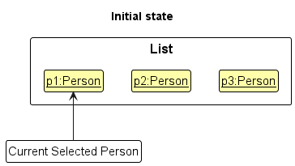

Step 2. The user executes `view 2` command to view the 2nd person details in the `DoConnek Pro`.
The `view` command update the `Current Selected Person` pointer with the corresponding index from the
input.  

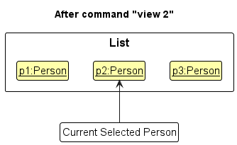

Step 3. The UI now updates the view panel to display the newly selected person and their details.

The sequence diagram below shows how the view operation works:
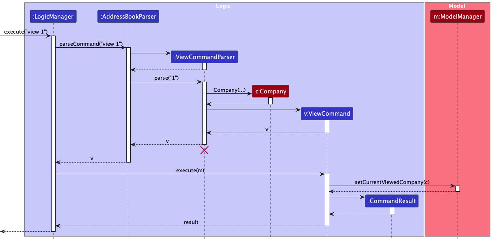

The following activity diagram summarizes what happens when a user executes the view command:

 

### Recall recent commands feature

The recent command feature is facilitated by the `CommandStringStash`. This is a stash that stores the history
of the command string of the 20 most recent commands executed. Internally, it is stored as a `cmdStringStack`,
and `currentCmdIndex`. This internal representation allows cycling through the recent commands both forwards
and backwards.

These operations are exposed in the `Logic` interface as `Logic#getPrevCommandString(String commandInputString)`,
`Logic#getPassedCommandString(String commandInputString)`, and `Logic#addCommandString(String commandInputString)`.

The following operations are implemented by the `CommandStringStash`:
* `CommandStringStash#addCommandString(String commandInputString)` - Adds `commandInputString` to the history.
* `CommandStringStash#getPrevCommandString(String commandInputString)` - Cycles one command further back in history.
* `CommandStringStash#getPassedCommandString(String commandInputString)` - Cycles one command further forward in history.

:information_source: **note:** Cycling forwards or backwards may not always be
valid operations. No cycling forward or backward can be done if the stash is empty. No cycling backward
can be done if the user is already on the least recent command in the stash, and no cycling forward can be done
if the user has not yet cycled backward. To consider all these cases, the `commandInputString` is passed as a parameter
to `CommandStringStash#getPrevCommandString(String commandInputString)` and `CommandStringStash#getPassedCommandString(String commandInputString)`.
The `commandInputString` is the current command in the CLI textbox and is returned from these methods in the case of invalid operations
so that there is no change to the CLI textbox.

Given below is an example usage scenario and how the recall recent commands feature works at each step.

Step 1. The user launches the application for the first time. The `CommandStringStash` will be initialised
with no command strings and a `currentCmdIndex` of 0.

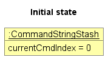

Step 2. The user executes the `list -sp` command to list the specialists in DoConnek Pro. Upon success,
`Logic#addCommandString("list -sp")` is called, adding this command string to the `CommandStringStash` and moving the
`currentCmdIndex` to point to right after the element added.

:information_source: **note:** After `Logic#getPrevCommandString` is called,
the `currentCmdIndex` is set to point one index after the last element in the `CommandStringStash`. 
This 'resets' the state allowing the users to start to cycle back from the most recently added command again.
The `Logic#getPrevCommandString` method decrements the `currentCmdIndex` before returning the String allowing the mechanism to work as intended.

Step 3. The user executes two more commands `help` and `delete 1` in the respective order. As before, the
`CommandStringStash` is updated appropriately.

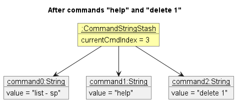

The following activity diagram summarises how the `CommandStringStash` is updated when a user executes a command.

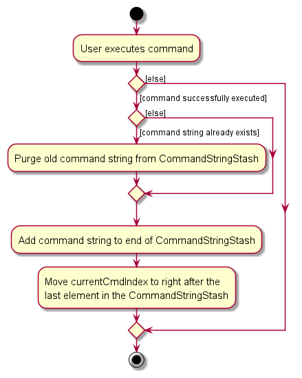

Step 4. The user wants to list the patients in DoConnek Pro but forgot how to do so. They decide to execute the `help`
command. To do so efficiently, they press the up arrow on the keyboard to recall the `help` command they recently entered.
This results in `Logic#getPrevCommandString` being called which returns `delete 1`.  The user's CLI text box is then set to display `delete 1`.

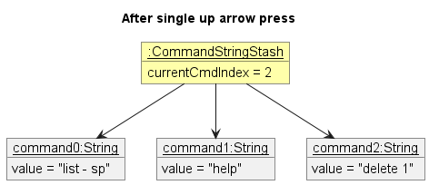

The following sequence diagram shows how this recalling of the previous command string works.

To cycle forward in history, a similar sequence is followed, but `Logic#getPassedCommandString` and its
corresponding methods are called instead.

Step 5. The user presses the up arrow again, and this time `Logic#getPrevCommandString` returns `help` which is displayed
on the user's CL. They can now easily execute `help`.

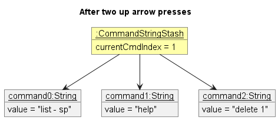

The following activity diagram summarises what happens when a user presses the up arrow.

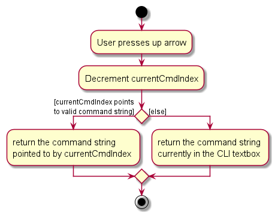

Step 6. Instead of executing `help` the user decides to delete the first specialist currently displayed.
They press the down arrow on the keyboard to recall the `delete 1` command they just passed.
This results in `Logic#getPassedCommandString` being called which returns `delete 1`.  The user's CLI text box is then set to display `delete 1`.

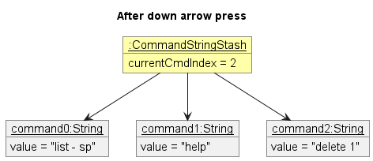

 

### Find feature

#### Overview
The find feature allows the user to find patients or specialists by checking whether their attributes contain certain keywords.
Upon entering a `find` command, an instance of `FindCommandParser` is created to process the prefixes along with their corresponding arguments into
predicates. The predicates are represented as `Predicate<Person>` (using Java's in-built functional interface), and are mapped
to their prefixes in a `FindPredicateMap`. A `FindPredicateMap` encapsulates **all** predicates indicated by the user,
which are later combined and used to test each `Person` in the `FilteredPersonList` of the `Model`.

As patients and specialists have common and differing attributes, so do their predicates. 
Predicates common to both: 
`NameContainsKeywordsPredicate`, `PhoneContainsKeywordsPredicate`, `EmailContainsKeywordsPredicate`, `TagsContainsKeywordsPredicate`

Predicates unique to patients: 
`AgeContainsKeywordsPredicate`, `MedHistoryContainsKeywordsPredicate`

Predicates unique to specialist: 
`LocationContainsKeywordsPredicate`, `SpecialtyContainsKeywordsPredicate`

#### Example
The following sequence diagram shows how a find command is parsed and executed to find a patient.
In this example, the command entered is  
`find -pa n/Tim m/Anaemia`

When the `FindCommandParser` parses the prefix arguments, a `NameContainsKeywordsPredicate` and `MedHistoryContainsKeywordsPredicate`
is instantiated by their corresponding arguments and are mapped to their prefixes in the `FindPredicateMap`.

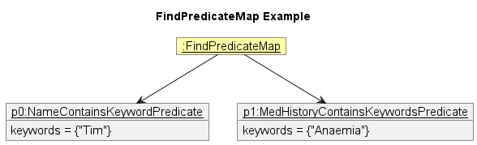

The predicates are combined into a single `Predicate<Person>` in `FindCommand#execute` and applied to each `Person` in the 
`FilteredPersonList` of the `Model`.

To find a specialist, a similar parse and execution flow is conducted. 

 

### Shortcut management feature

User defined shortcuts are managed by `ShortcutSettings`. Internally it contains a `shortcutMap` that stores _mappings_ of 
user defined _shortcut aliases_ to existing valid _command keywords_. This class provides functionality for registering new shortcuts,
removing previously defined shortcuts, and querying the map to check if a shortcut has previously been defined.

These shortcut mappings need to be updated by command execution, as well as used in parsing of user input. Thus, the following design decisions have been made:
1. Shortcut operations are exposed in the `Model` interface as 
   * `Model#registerShortcut(ShortcutAlias shortcutAlias, CommandWord commandWord)` 
   * `Model#removeShortcut(ShortcutAlias shortcutAlias)`
   * `Model#getShortcut(String alias)`
2. `AddressBookParser` now has a dependency to the `Model`. This is required so that the shortcut mappings can be accessed for use in parsing user input.

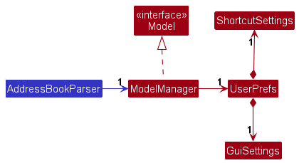

Within `ShortcutSettings` similar operations are implemented to `register`, `remove`, and `get` shortcuts. Additionally to resolve bugs that might arise from users tampering with the `preferences.json` file,
`ShortcutSettings#removeBadMappings()` clears the `shortcutMap` of invalid mappings and is called on initialisation.

#### Invalid Mappings
On this subject, in order to not jeopardise parsing operations and the user experience, some restrictions have been put on the mappings that can be registered. 
These restrictions are enforced by the wrapper class `ShortcutAlias`, along with the relevant method in `ParserUtil`.
1. Shortcut aliases must not be blank.
2. Shortcut aliases must only contain alphanumeric characters without any whitespaces.
3. Shortcut aliases must not match the default `COMMAND_WORD` of any existing commands.
   * This is to prevent any unintended behaviour, and users might even accidentally 'lock' themselves out of using certain commands if they are unaware of how to manipulate `preferences.json`.

#### Command execution
The sequence diagram below outlines the command execution of a sample `AddShortcutCommand` that wants to register `del` as a shortcut for `delete`.

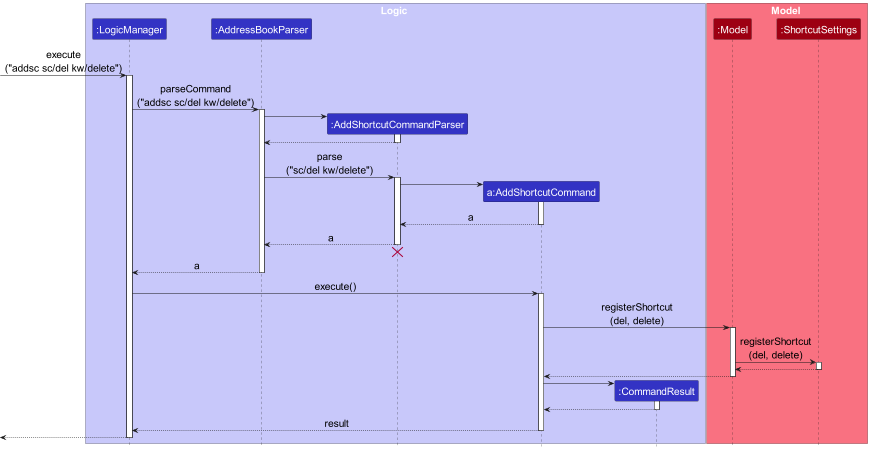

The following activity diagrams summarise the process of adding and removing shortcuts from DoConnek Pro.

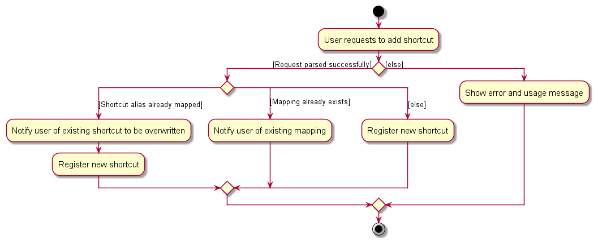

#### Saving between sessions
`ShortcutSettings` implements the `Serializable` interface, thus is saved to `json` format as a part of `UserPrefs`. 

#### Design considerations:
**Aspect: How shortcuts are stored and accessed:**

* **Alternative 1 (current choice):** Stored in a separate `ShortcutSettings` class.
    * Pros: Separation of responsibility and easier management.
    * Cons: More memory usage and introduces one dependency between `AddressBookParser` and `Model`.

* **Alternative 2:** Individual command knows its own list of shortcuts.
    * Pros: Will use less memory (No extra data structure created).
    * Cons: Difficult to manage duplicate shortcut mappings.

--------------------------------------------------------------------------------------------------------------------

## **Documentation, logging, testing, configuration, dev-ops**

* [Documentation guide](Documentation.md)
* [Testing guide](Testing.md)
* [Logging guide](Logging.md)
* [Configuration guide](Configuration.md)
* [DevOps guide](DevOps.md)

--------------------------------------------------------------------------------------------------------------------

## **Appendix: Requirements**

### Product scope

**Target user profile**:
The target users...

* are management staff at a General Practitioner's Clinic
* need to keep track of the clinic's patients' details
* need to keep track of the affiliated specialists that the clinic refers patients to
* prefer desktop apps over other types
* can type fast
* prefer typing to mouse interactions
* are reasonably comfortable using CLI apps

**Value proposition**: A one-stop application that allows management of both a clinic's patient and specialist details faster than a typical mouse/GUI driven app.

### User stories

Priorities: Essential (must have) - `* * *`, Typical (nice to have) - `* *`, Novel (unlikely to have) - `*`

| Priority | As a …​                  | I want to …​                                        | So that I can…​                                                      |
|---------|--------------------------|-----------------------------------------------------|----------------------------------------------------------------------|
| `* * *` | new user                 | see usage instructions                              | refer to instructions when I forget how to use the App               |
| `* * *` | user                     | deal with patient and specialist records separately | easily do patient-specific or specialist-specific operations         |
| `* * *` | user                     | add a new patient to the records                    | keep track of details of new patients                                |
| `* *`   | user                     | edit details of existing patients                   | make sure the patients' details are up to date                       |
| `* * *` | user                     | delete individual patient details                   | delete records of patients I no longer take care                     |
| `* *`   | user                     | easily filter patient records by any criteria       | find relevant patient information quickly                            |
| `* * *` | user                     | access a patient's name                          | identify the patient                                              |
| `* * *` | user                     | access a patient's medical history                  | provide more informed care based on the patient's medical history    |
| `* * *` | user                     | access a patient's contact number                   | quickly get in contact with the patient                              |
| `* * *` | user                     | access a patient's email                            | have an alternate means of contacting the patient                    |
| `* * *` | user                     | access a patient's age                              | provide age-specific care and treatment to the patient               |
| `*`     | user                     | customise tags for my patients                      | have control over the organisation of my patients                    |
| `*`     | user                     | group delete patients                               | save time when removing large amount of patient records              |
| `* * *` | user                     | add a new specialist to the records                 | keep track of details of new specialists patients can be referred to |
| `* *`   | user                     | edit details of existing specialists                | make sure the specialist details are up to date                      |
| `* * *` | user                     | delete specialist details                           | delete records of specialists I no longer work with                  |
| `* *`   | user                     | easily filter specialist records by any criteria       | find relevant specialist information quickly                            |
| `* * *` | user                     | access a specialist's name                          | identify the specialist                                              |
| `* * *` | user                     | access a specialist's contact number                | quickly get in contact with the specialist                           |
| `* * *` | user                     | access a specialist's email                         | have an alternate means of contacting the specialist                 |
| `* * *` | user                     | access a specialist's specialty                     | refer patients to appropriate specialists                            |
| `*`     | user                     | customise tags for my specialists                   | have control over the organisation of my specialists                 |
| `* *`   | user                     | search for specialists by location                  | refer patients to convenient specialists to minimise time            | 
| `* *`   | user                     | search for specialists by their speciality          | refer patients to the right experts                                  |
| `*`     | user                     | customise colour schemes of the App                 | customise the look of my application                                 |
| `*`     | user who is a fast typer | perform all tasks will the CLI rather than the GUI  | be more efficient in managing records                                |
| `* *`   | impatient user           | add new keyboard shortcuts to the App               | save time when performing frequently repeated tasks                  |
| `* *`   | impatient user           | recall recently executed commands                   | save time when performing frequently repeated tasks                  |
| `* *`   | careless user            | undo and redo commands                              | correct mistakes I've made                                           |
| `* * *` | user                     | save the App data                                   | retain data for future reference                                     |
| `* * *` | user                     | load previously saved App data                      | examine past records/information                                     |
| `*`     | experienced user         | manipulate the save file directly                   | make quick changes to data without having to open the application    |

### Use cases

(For all use cases below, the **System** is the `DoConnek Pro` and the **Actor** is the `user`, unless specified otherwise)

**Use case: Delete a patient from the records**

**MSS**

1.  User requests to list some patients.
2.  System shows a list of patients.
3.  User requests to delete a specific patient in the list.
4.  System deletes the patient.

    Use case ends.

**Extensions**

* 2a. The list is empty.

  Use case ends.

* 3a. System detects invalid request format.

    * 3a1. System shows an error message.

      Use case resumes at step 3.

**Use case: Add a patient to the records**

**MSS**

1. User searches list to check if patient is already in the system.
2. System shows that there are no entries matching the patient's name.
3. User requests to add patient to the system.
4. System confirms that the person has been added.

    Use case ends.

**Extensions**

* 1a. System shows that there is an existing patient with that name.

    Use case ends.

* 3a. System detects invalid request format.

  * 3a1. System shows an error message.

    Use case resumes at step 3.

**Use case: List all patients in the records**

**MSS**

1. User requests to list all patients.
2. System shows a list of all patients stored.

    Use case ends.

**Extensions**

* 1a. System detects invalid request format.

    * 1a1. System shows an error message.

      Use case ends.

**Use case: Search for patients in the records**

**MSS**

1. User requests to find patients from a keyword.
2. System shows a list of patients that match the keyword.

   Use case ends.

**Extensions**

* 1a. System detects invalid request format.

    * 1a1. System shows an error message.

      Use case ends.

**Use case: View details of a patient in the records**

**MSS**

1.  User requests to list some patients.
2.  System shows a list of patients.
3.  User requests to view the details of a specific patient in the list.
4.  System shows the patient's details.

    Use case ends.

**Extensions**

* 2a. The list is empty.

  Use case ends.

* 3a. System detects invalid request format.

    * 3a1. System shows an error message.

      Use case resumes at step 2.

**Use case: Exit the program**

**MSS**

1.  User requests to exit the program.
2.  System exits the program.

* 1a. System detects invalid request format.

  * 1a1. System shows an error message.

    Use case ends.

### Non-Functional Requirements

1.  Should work on any _mainstream OS_ as long as it has Java `11` or above installed.
2.  Should be able to hold up to 1000 persons without a noticeable sluggishness in performance for typical usage.
3.  A user with above average typing speed for regular English text (i.e. not code, not system admin commands) should be able to accomplish most of the tasks faster using commands than using the mouse.
4.  Should be made for use by a single user rather than multiple users.
5.  Any data should be stored locally in a human-editable text file without any use of a Database Management System.
6.  Should be usable with the download of a single JAR file of size less than 100 MB.
7.  Should not require any installation by the users.
7.  Should not depend on any remote server.
8.  The product should start from the given code base and be evolved/enhanced/morphed in a breadth-first incremental manner.
9.  The code should primarily follow the Object-oriented paradigm.
10. Should only use _appropriate third party frameworks/libraries/services_ that have been approved.
11. The product's _GUI should work well_ for standard screen resolutions 1920x1080 and higher, and, for screen scales 100% and 125%.
12. The product's _GUI should be usable_ for resolutions 1280x720 and higher, and, for screen scales 150%.
13. Should be intuitive to use for a user without a technical background.
13. The product is not required to handle printing of the patient and specialist records.

### Glossary

* **CLI**: Command Line Interface.
* **GUI**: Graphical User Interface.
* **Mainstream OS**: Windows, Linux, Unix, OS-X.
* **Appropriate third party frameworks/libraries/systems**: Those frameworks/libraries/systems that are free, open-source, have permissive license terms, don't require installation by the users and don't violate other constraints.
* **GUI should work well**: The GUI should not cause resolution-related inconveniences for the user.
* **GUI should be usable**: The GUI's functions can all be used, although user-experience may be suboptimal.

--------------------------------------------------------------------------------------------------------------------

## **Appendix: Instructions for manual testing**

Given below are instructions to test the app manually.

:information_source: **Note:** These instructions only provide a starting point for testers to work on;
testers are welcomed to do more *exploratory* testing.

### Launch and shutdown

1. Initial launch

    1. Download the jar file and copy into an empty folder

    1. Double-click the jar file Expected: Shows the GUI with a set of sample contacts. The window size may not be optimum.

1. Saving window preferences

    1. Resize the window to an optimum size. Move the window to a different location. Close the window.

    1. Re-launch the app by double-clicking the jar file. 
       Expected: The most recent window size and location is retained.

### Adding a patient or specialist

Adding a patient to the existing list.
    
1. Recommendation: List all patients by entering `list -pa` to better observe the results.

2. Test case: `add -pa n/Abigail Lim p/89074463 e/abilim@test.com t/friends a/22 m/Bronchitis m/Fever` 
   Expected: A patient by the name of Abigail Lim is added to the list of patients. The details of the newly added patient can be seen via the `view` command.

3. Test case: `add -pa n/Abigail Lim e/abilim@test.com t/friends a/22 m/Bronchitis` (missing `p/PHONE` field) 
Expected: No patient is added to the list. Error message is shown in the command result box.

4. Test Case: `add -pa n/Abigail Lim p/89074463 e/abilim@test.com t/friends a/twenty-two m/Bronchitis` (invalid `a/AGE` field) 
   Expected: No patient is added to the list. Error message of accepted `a/AGE` format is shown.

Similar tests for adding a specialists can be done using the `add` command format for specified for specialists.

### Viewing a patient or specialist

Viewing a patient while all patients are being shown in the list panel.

1. Prerequisites: List all patients using the `list - pa` command. Multiple patients in the list.

2. Test case: `view 1` 
   Expected: First patient is selected to be viewed. Details of the viewed patient are shown in the view panel.
   Details of the viewed patients is also displayed in the command result box.

3. Test case: `view 0` 
   Expected: No person is viewed. Error details shown in command result box.

4. Other incorrect view commands to try: `view`, `view x`, `...` (where x is larger than the list size) 
   Expected: Similar to previous.

Similar tests for viewing a specialist can be done using the `view` command after listing all specialists via `list -sp` command.

### Editing a patient or specialist

 Editing a specialist while a specialist is being viewed in the view panel.

1. Prerequisites: Viewing a specialist in the view panel.

2. Test case: `edit n/Jonathan Holland` (editing a single attribute) 
   Expected: The name of the specialist being viewed is modified to **Jonathan Holland**.

3. Test case: `edit n/John Holland p/88889009 s/Dentistry` (editing multiple attributes) 
   Expected: The specialist being viewed is modified to have the **name John Holland** with **phone number 88889009** and has **Dentistry as a specialisation**.

4. Test case: `edit t/`(clearing tags) 
   Expected: The specialist being viewed is modified to have no tags.

5. Test case: `edit n/` 
   Expected: The specialist being viewed is not modified. Error message indicating arguments cannot be blank is shown.

Similar tests for editing a patient can be done using the `edit` command after viewing a patient in the view panel using the `view` command.
    
### Deleting a patient or specialist

Deleting a specialist while all specialist are being shown.

1. Prerequisites: List all specialists using the `list -sp` command. Multiple specialists in the list.

2. Test case: `delete 1` 
   Expected: First specialist is deleted from the specialist list. Shorter details of the deleted specialists is shown in the command result box.

3. Test case: `delete 2 3 4` 
   Expected: Second, third and fourth specialist is deleted from the specialist list. Shorter details of the deleted specialists is shown in the command result box.

4. Test case: `delete 0` 
   Expected: No person is deleted. Error details shown in the status message.

5. Other incorrect delete commands to try: `delete`, `delete x`, `...` (where x is larger than the list size) 
   Expected: Similar to previous.

Similar tests for deleting a patient can be done by first listing all patients using the `list -pa` command with multiple patients listed.

### Finding patients or specialists

Finding a patient that has been added into the patient list.

1. Prerequisites: Follow the instructions for adding a patient for manual testing above [here](#adding-a-patient-or-specialist).

2. Test case: `find -pa n/Abigail` 
   Expected: The patient list displays patients with name containing "Abigail" only.

3. Test case: `find -pa n/Abigail m/Bronchitis` (multiple arguments) 
   Expected: The patient list displays patients with the name containing "Abigail" _**and**_ has "Bronchitis" in their medical history.

4. Test case: `find -pa a/` (blank `a/AGE` field) 
   Expected: No changes can be observed from the patient list. Error message indicating arguments cannot be blank is shown in the command result box.

Similar tests for finding specialists can be conducted by using the `find` command with a multiple specialists in the specialist list.

### Undo and redo commands

Undo and redo commands executed successfully.

Test case:

1. Enter `theme dark` followed by `theme light` 
   Expected: Colour theme of the application changes from dark mode to light mode.

2. Enter `undo` 
   Expected: Colour theme of the application changes to dark mode.

3. Enter `redo` 
   Expected: Colour theme of the application changes to light mode.

4. Enter `add -pa n/Charlie Wong p/89073323 e/cwong@test.com t/neighbour a/35 m/Flu` 
   Expected: A patient by the name of "Charlie Wong" is added to the patient list.

5. Enter `redo` 
   Expected: No changes is made to the patient list. Error message indicating no command to be undone is displayed in result box.

6. Enter `undo` 
   Expected: The patient previously added in step 5 is removed from the patient list.

### Shortcut aliases

1. Adding a shortcut alias for `list` command

   1. Test case: `addsc sc/ls kw/list` followed by `ls -pa` 
   Expected: New shortcut alias `ls` is added. Command result box displays message of successful mapping. All patients are listed upon entering `ls -pa`.

   2. Test case: `addsc sc/ls kw/list` 
   Expected: No new shortcut alias is added. Command result box displays message of shortcut alias already existing.
   
   3. Test case: `addsc sc/ls kw/delete` (same shortcut alias but different command keyword) 
   Expected: New shortcut alias is added, `ls` now behaves like a `delete` command. The command result box displays a message of the new mapping of `ls` to `delete` command.
             A message of the removal of the old mapping of `ls` to `list` command is displayed as well.

2. Deleting a shortcut alias

    1. Prerequisite: Follow the manual testing instructions **adding shortcut alias** written above. No other shortcut alias has been previously added.
   
    2. Test case: `delsc sc/ls` 
       Expected: Shortcut alias `ls` is removed. Using `ls` instead of `delete` command now results in an unknown command error being displayed in the command result box.

    3. Test case: `delsc sc/remove` (deleting non-existent shortcut alias) 
       Expected: No shortcut alias is removed. The command result box displays a useful error message indicating shortcut alias was not previously registered.

### Theme Command

1. Prerequisite: Set theme of the application to dark using the `theme dark` command.     

2. Test case: `theme light` 
Expected: Theme of the application changes from dark to light.

3. Test case: `theme DaRk` 
Expected: Theme of the application changes from light to dark.

4. Test case: `theme colourful` 
Expected: No change in the theme of the application. Command box displays error message.

### Recall Command

1. Recalling recently executed commands in the application

   1. Prerequisite: Enter the following commands in order:`list -pa`, `list -sp`, `theme light` and `theme dark`.
   
   2. Test case: Press the up arrow four times and then enter   
   Expected: The list panel updates to display patients.
   
   3. Test case: Press the up arrow four times and then the down arrow once and then enter  
   Expected: The theme of the application changes from dark to light.
   
2. Recalling commands when no commands have been executed yet

   1. Prerequisite: Restart the application and don't enter any commands.
   
   2. Test case: Type in `list -pa`. Don't enter. Press the up arrow.  
   Expected: There is no change to the command input text box.
   

## **Appendix: Planned Enhancements**

1. Currently, the view panel can only be updated using the view command. 
However, we are planning on implementing a feature that will allow users to update the view panel by simply clicking on a person in the list panel.
This change is driven by our goal to enhance user experience: although our application primarily caters to CLI users, such  behaviour
still seems intuitive and reasonable to expect.

2. Currently, when the `delete` command encounters invalid indexes, it generates an error and does not delete any patient or specialist records.
In contrast, the `delsc` command handles invalid shortcuts by recognizing and ignoring them, while continuing to remove any valid shortcuts in the command.
The inconsistency between these two delete functions has been identified, and we have plans to address it in the future.
Our upcoming improvement will entail modifying the `delete` command to acknowledge and ignore invalid indexes while effectively deleting records specified by valid indexes provided by the user.

3. DoConnek Pro currently checks for duplicate persons by name. This means that people with the same names cannot be added even if they have different parameters (like `Phone` or `Email`). This
checking of duplicates is also case-sensitive, whereas names, in general, are not case-sensitive. To resolve these two problems concurrently,
we plan on implementing a `NRIC` field for patients and a `MCR` field for specialists as unique identifiers. 

4. DoConnek Pro currently disallows the use of "/" in a person name because it is used as a command delimiter.
Users may face problems due to this if they have to, for example, add a person with "s/o" in their name.
Future updates to the application plan to account for such cases.

5. DoConnek Pro is currently not intelligent enough to detect incorrect-but-close-enough flags. Users must enter the
commands in the exact format specified in the user guide. For example, even if users input `tag/` instead of `t/`, DoConnek
Pro will not accept this as a valid input format. In the future we plan to make DoConnek Pro more flexible in this regard.

6. DoConnek Pro allows users to add multiple entries for certain attributes, notably `MEDICAL_HISTORY` and `TAG`. However, 
it cannot guarantee the ordering of these entries as inputted by the user in the command line. 
We plan on rectifying DoConnek Pro to maintain this user-specified ordering in the future.
