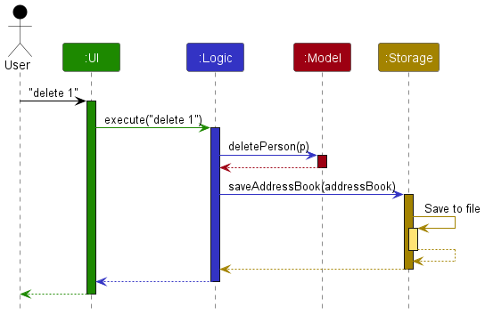
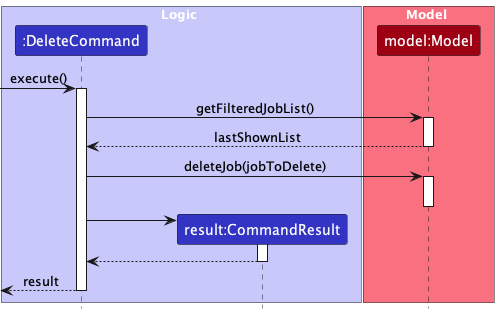
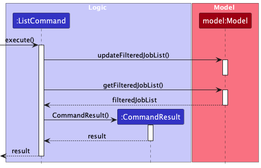
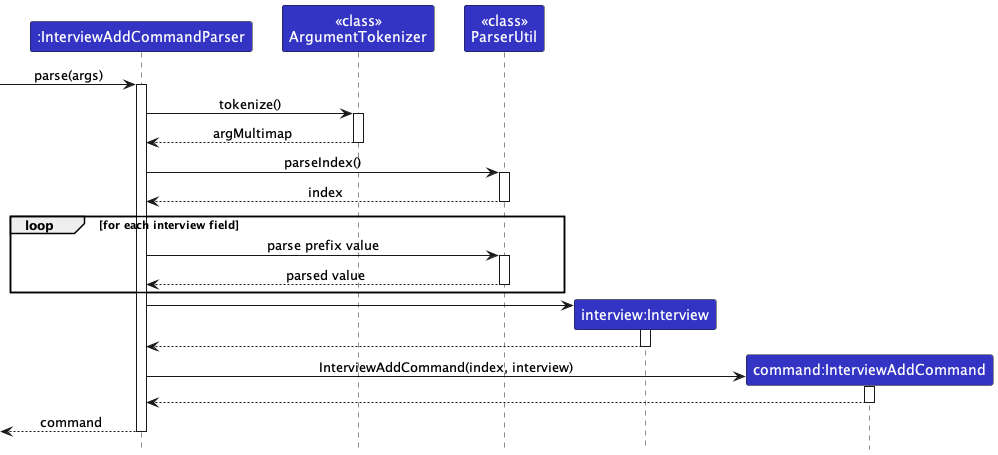
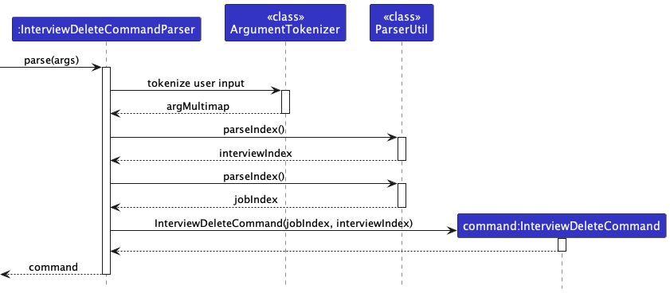
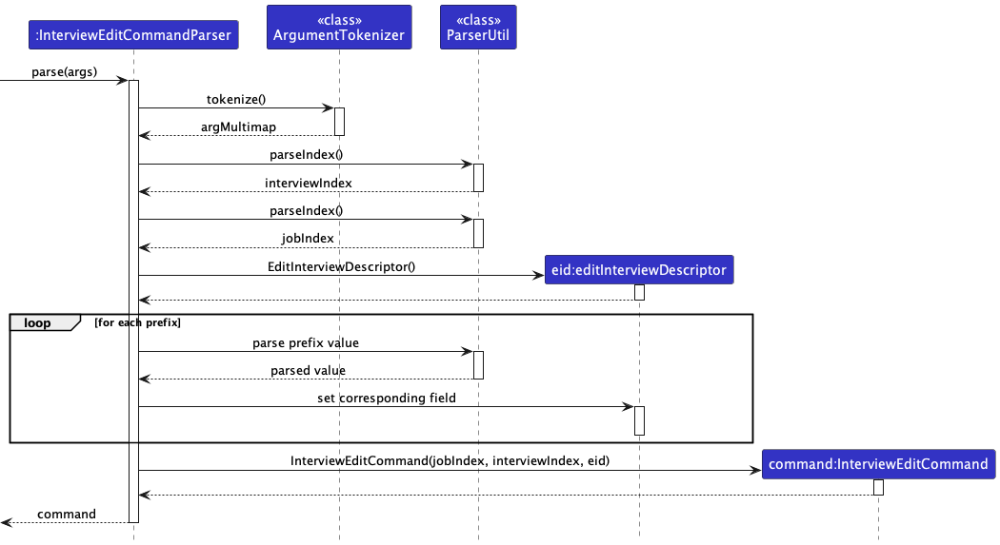

## Table of Contents

1. [Acknowledgements](#acknowledgements)
2. [Setting Up](#setting-up)
3. [Design](#design)
    1. [Architecture](#architecture)
    2. [UI Component](#ui-component)
    3. [Logic Component](#logic-component)
    4. [Model Component](#model-component)
    5. [Storage Component](#storage-component)
    6. [Common Classes](#common-classes)
4. [Implementation](#implementation)
    1. [Add Command](#add-command)
        1. [Implementation](#implementation)
        2. [Design Considerations](#design-considerations)
    2. [Edit Command](#edit-command)
        1. [Implementation](#implementation)
        2. [Design Considerations](#design-considerations)
    3. [Delete Command](#delete-command)
        1. [Implementation](#implementation)
        2. [Design Considerations](#design-considerations)
    4. [List Command](#list-command)
        1. [Implementation](#implementation)
        2. [Design Considerations](#design-considerations)
    5. [Sort Command](#sort-command)
        1. [Implementation](#implementation)
        2. [Design Considerations](#design-considerations)
    6. [Find Command](#find-command)
        1. [Implementation](#implementation)
        2. [Design Considerations](#design-considerations)
   7. [Interview and Interview Commands](#interview-and-interview-commands)
        1. [Implementation](#implementation)
        2. [Design Considerations](#design-considerations)
5. [Documentation, logging, testing, configuration, dev-ops](#documentation-logging-testing-configuration-dev-ops)
6. [Appendix A: Requirements](#appendix-a-requirements)
    1. [Product scope](#product-scope)
    2. [User stories](#user-stories)
    3. [Use cases](#use-cases)
    4. [Non-Functional Requirements](#non-functional-requirements)
    5. [Glossary](#glossary)
7. [Appendix B: Instructions for Manual Testing](#appendix-b-instructions-for-manual-testing)
8. [Appendix C: Effort](#appendix-c-effort)
9. [Appendix D: Planned Enhancements](#appendix-d-planned-enhancements)
   1. 

---

## **Acknowledgements**

All code and documentation are either written by ourselves or adopted from the original AB3 implementation.

---

## **Setting Up**

Refer to the guide [Setting up and getting started](SettingUp.md).

---

## **Design**

Tip: The `.puml` files used to create diagrams in this document can be found in the [diagrams](diagrams) folder. Refer to the [PlantUML Tutorial at se-edu/guides](https://se-education.org/guides/tutorials/plantUml.html) to learn how to create and edit diagrams.

### Architecture

The architecture diagram above explains the high-level design of the App.

A quick overview of the main components and how they interact with each other is as follows:

#### Main Components

`Main` has two classes: `Main` and `MainApp` which are the entry and exit points of the application.

* At launch: they initialize the components in the correct sequence and connect them together.
* At exit: they ensure the components are shut down properly and invoke cleanup operations if necessary.

`Commons` represents the common classes used by all components.

The other four component of the App are as follows:
* `UI`: Handles the user interface of the application.
* `Logic`: Handles command execution and data manipulation.
* `Model`: Stores the data of the application.
* `Storage`: Handles the saving and loading of data on the hard disk.

#### Component Interactions

The sequence diagram below shows the interactions between components for the `delete 1` command:

Each of the four main components:

* Defines its API in an `interface` named after the component.
* Implements its functionality using a `{Component Name}Manager` class, following the corresponding API interface.

For example, the `Logic` component's API is defined in `Logic.java`, and its functionality is implemented in `LogicManager.java`. 

Other components interact with a given component (e.g. `Logic`) by calling methods defined in the corresponding API interface (e.g. `Logic.java`) instead of calling methods directly on the implementation class (e.g. `LogicManager.java`). This is to ensure that the caller does not depend on the implementation details of the component. This is illustrated in the class diagram below.

### UI Component

**API:**
[`Ui.java`](https://github.com/AY2324S1-CS2103T-W12-3/tp/blob/master/src/main/java/seedu/application/ui/Ui.java)

**Description:**

The `UI` component is responsible for managing the user interface of the application so that it can respond according to
the user's actions or commands entered.

The `UI` component uses the JavaFx UI framework. The layout of these UI parts are defined in matching `.fxml` files that
are in the `src/main/resources/view folder`. For example, the layout of
the [`MainWindow`](https://github.com/AY2324S1-CS2103T-W12-3/tp/blob/master/src/main/java/seedu/application/ui/MainWindow.java)
is specified
in [`MainWindow.fxml`](https://github.com/AY2324S1-CS2103T-W12-3/tp/blob/master/src/main/resources/view/MainWindow.fxml).

**Functionality:**

The UI component,
* Executes user commands using the `Logic` component.
* Listens for changes to `Model` data so that the UI can be updated with the modified data.
* Keeps a reference to the `Logic` component, because the UI relies on the Logic to execute commands.
* Depends on some classes in the `Model` component, as it displays `Job` objects residing in the Model.

**Component Structure:**

The UI consists of a `MainWindow` that is made up of parts like `CommandBox` and `ResultDisplay`.
These parts are always being shown in `MainWindow`, while other parts like `JobListPanel`, `JobDetailsPanel` are only
visible
to the user depending on the state of the application e.g. when the job list if not empty, when a job is selected.

etc. All these, including the `MainWindow`, inherit from the abstract `UiPart` class which captures the commonalities
between classes that represent parts of the visible GUI.

### Logic Component

**API:**
[`Logic.java`](https://github.com/AY2324S1-CS2103T-W12-3/tp/blob/master/src/main/java/seedu/application/logic/Logic.java)

The `Logic` component is responsible for handling the execution of commands so that the application book can be updated
according to the user's instructions.

The following is a partial class diagram of the `Logic` component:

The following depicts the sequence of interactions within the `Logic` component taking `execute("delete 1")` API call as
an example:

The Logic component,

* Reads the user input with the `ApplicationBookParser` class and creates a parser which matches the command
  (e.g. `DeleteCommandParser`) and uses it to parse the command.
* This results in a `Command` object (more precisely, an object of one of its subclasses e.g. `DeleteCommand`) which is
  executed by the `LogicManager`.
* The command can communicate with the `Model` when it is executed (e.g. to delete a person).
* After making changes to the `Model`, the `Storage` is updated to reflect these changes.
* The result of the command execution is encapsulated as a `CommandResult` object which is returned back from `Logic`.

The following are other classes in `Logic` (omitted from the class diagram above) that are used for parsing a user
command:

For more details about command-specific parsing and execution, refer to "[Implementation](#implementation)".

### Model Component

**API:**
[`Model.java`](https://github.com/AY2324S1-CS2103T-W12-3/tp/blob/master/src/main/java/seedu/application/model/Model.java)

**Description:**
The `Model` component is reponsible for encapsulating data and providing methods to modify the data.

**Functionality:**
The `Model` component,
* stores the application book data i.e., all `Job` objects (which are contained in a `UniqueJobList` object).
* stores the currently 'selected' `Job` objects 
  (e.g., results of a `FindCommand`) as a separate _filtered_ list which is exposed to outsiders as 
  an unmodifiable `ObservableList<Job>` that can be 'observed' 
  e.g. the UI can be bound to this list so that the UI automatically updates when the data in the list change.
* stores a `UserPref` object that represents the user’s preferences. 
  This is exposed to the outside as a `ReadOnlyUserPref` objects.
* does not depend on any of the other three components 
  (as the `Model` represents data entities of the domain, they should make sense on their own without depending on other components)

### Storage Component
**API:**
[`Storage.java`](https://github.com/AY2324S1-CS2103T-W12-3/tp/blob/master/src/main/java/seedu/application/storage/Storage.java)

**Description:**
The `Storage` component is responsible for storing the job applications data in JSON format.

**Functionality:**
The `Storage` component,
* can save `Userpref` objects in json format and read it back.
* can save the job application data in json format and read it back.

**Component Structure:**

### Common Classes

Classes used by multiple components are in the `seedu.applicationbook.commons` package.

---

## **Implementation**

This section describes some noteworthy details on how certain features are implemented.

### Add Command

#### Overview
The `add` command allows the user to add job applications with various attributes. Attributes can be categorized into
* Compulsory attributes such as `Company` and `Role`.
* Optional attributes such as `Status`, `Industry`, `Deadline` and `JobType`

#### Related Classes and Methods

* `AddCommandParser#parse(String)`: Parses command input 
* `AddCommand#execute(Model)`: Executes add command 
* `Model#addJob(Job)`, `ApplicationBook#addJob(Job)`, `UniqueJobList#add(Job)`: Adds a job application.

#### Implementation

1. **Parse User Input:** `AddCommandParser` checks for necessary parameters and their validity.
2. **Create Job Object:** A `Job` object is instantiated during `AddCommandParser#parse(String)` and handed over to the `AddCommand`.
3. **Execute Command**: `AddCommand#execute(Model)` adds the new job application to the `UniqueJobList` in the `ApplicationBook`.

The following sequence/activity diagram illustrates the process of invocation for the `AddCommand`:

#### Design Considerations

1. **Handling of optional parameters**: 
   1. With default parameters: The `AddCommandParser` checks for the presence of optional parameters. If the
      parameters are not present, default parameters are used to instantiate the `Job` object.
       * *Pros*: This is a simple implementation which does not require any changes to the `AddCommand` class.
       * *Cons*: This implementation is not flexible as the default parameters are fixed. If the user wants to add a job
         application with a different set of default parameters, the code has to be changed.
   2. Without default parameters: If the
      parameters are not present, a different constructor is used to instantiate the `Job` object.
       * *Pros*: This implementation is more flexible as the user can specify the parameters they want to add.
       * *Cons*: This implementation is more complicated as the `AddCommand` class has to be modified to handle the
         different constructors.

---

### Edit Command

The edit command allows the user to edit any field in their job application.

#### Implementation

The Edit feature is implemented through the `EditCommand` class along with `EditCommandParser` to parse the arguments
for the command from the user input. It utilises a nested static class, `EditJobDescriptor`, to store the new values for
the job's attributes.

The following sequence diagram illustrates the process of executing a valid `edit` command.

The `EditCommandParser` class parses the user input and creates an `EditCommand` object with the specified index and an
`EditJobDescriptor` containing the new field values.

The `execute` method in `EditCommand` is then called, which retrieves the current list of jobs and creates a new Job
object `editedJob` with updated field value that is contained by `EditJobDescriptor`. Replaces the old job with the new
one in the job list with `Model::setJob`.

#### Design considerations

1. **How to Edit Multiple Fields with One Command**

* *Chosen implementation*: To enable the `edit` command to parse and edit multiple fields simultaneously, we decided to
  nest a static class, `EditJobDescriptor`, within the `EditCommand` itself. This design abstracts the logic of setting
  new values for each field away from the `ParserUtil` and `EditCommandParser` classes. It allows a single instance of
  `EditJobDescriptor` to be carried through the execution sequence, instead of creating a separate instance for each
  field edited. E.g. A new Deadline instance if the deadline is edited
* *Alternative*: Editing each attribute with separate commands could simplify the command structure and reduce user
  errors. However, this might lead to increased added complexity in managing multiple instances of edited fields as
  described above.

---

### Delete Command

The delete command allows the user to delete a job application using its index.

#### Implementation

The Delete feature is implemented through the `DeleteCommand` class along with `DeleteCommandParser` to parse the arguments
for the command from the user input. 

The following sequence diagram illustrates the process of executing a valid `delete` command.

The `DeleteCommandParser` class parses the user input and creates an `DeleteCommand` object with the specified index.
If the user input does not conform to the expected format e.g. the index is out of bounds, a `ParseException` is thrown.

The `execute` method in `DeleteCommand` is then called, which retrieves the current list of jobs and deletes the job at 
the specified index in the job list with `Model::deleteJob`.

#### Design considerations

1. **How to Delete Fields**
* *Chosen implementation*: Only supports deleting the entire Job Application including all its fields.
* *Alternative*: To enable the `delete` command to parse and delete specific optional fields of the application at the 
  specified index, allow users to input specifiers (e.g. `delete 1 s/`) and modify `DeleteCommandParser` to parse the 
  specifiers, removing the ones corresponding to the specifiers.
  * *Pros*: More flexibility in changing the fields of an application.
  * *Cons*: Good to have but not a necessary feature as users can simply `edit` the fields and set them to 
    the default (eg. TO_ADD_STATUS)

---

### List Command

The list command allows the user to view the list of all job applications.

#### Implementation

The following sequence diagram illustrates the process of invocation for the command:

The `ListCommand` class implements this command. It sets the predicate for the `filteredList` of `Model` to
`PREDICATE_SHOW_ALL_JOBS` which evaluates any `Job` to true.

#### Design Considerations

1. **Implementing listing by `sort` order**
    * Lists all applications by the date added if no `sort` command was performed, 
      otherwise lists by the most recent `sort` order. 
    * *Pros*: User is able to maintain the list in the preferred sorted order even after performing other commands such 
      as `delete` and `find`.
    * *Cons*: The sorting order by date added is lost once `sort` by other fields is performed.

---

### Sort Command

The sort command allows the user to sort the current list of job applications based on a specified field.

#### Implementation

The following sequence diagram illustrates the process of parsing and invocation for the command:

The `SortCommand` class implements this command. It accepts a `FieldComparator` which will be set as the comparator when
`Model::sortJobs` is called.

The `SortCommandParser` class uses the `ArgumentTokenizer` class to parse the arguments for the command from the user
input. If the user input does not conform to the expected format, a `ParseException` is thrown. If the user input is
valid, then `SortCommandParser` generates the corresponding `FieldComparator` which will be set as the comparator when
sorting the list.

The `FieldComparator::compare` method compares the field indicated by the specifier. To achieve this, the
relevant field method must be invoked.

* For alphabetically sorted fields (`Company`, `Role`, `Status`, `Industry`, `JobType`), `String::compareToIgnoreCase`
  is used.
* For chronologically sorted fields (`Deadline`), a custom `compareTo()` method is implemented.

#### Design considerations

1. **Implementing sorting in reverse order**: Create a command which, when called, would reverse the order of the list
   sorted.
    * *Pros*: It is relatively simple to implement, as the `Comparator::reversed` method allows the ordering of the list
      to be reversed easily.
    * *Cons*: This is not an important feature which users will need frequently, and it requires additional time to be
      spent on implementing the command and creating test cases. In light of the tight schedule and other more important
      features, we decided that this feature was not a priority.
        
2. **Implementing sorting by multiple fields**: When multiple prefixes are provided, sort by the prefix listed first,
   and if two applications have the same value in that field, sort by the next prefix listed.
    * *Pros*: This is slightly more complicated to implement, requiring a `Comparator` which can sort fields according
      to
      the desired order of importance.
    * *Cons*: Once again, we decided that this is not an important feature, as the primary purpose of the command is to
      allow users to group similar applications together. Grouping by one field should be sufficient for the user to
      have
      organised list.

---

### Find Command

The find command allows the user to get a filtered list of job applications.

#### Implementation

The following sequence diagram illustrates the process of parsing and invocation for the command:

The `FindCommand` class implements this command. Its constructor accepts a `CombinedPredicate` which will be set as the
predicate when `Model::updateFilteredJobList` is called.

The `FindCommandParser` class uses the `ArgumentTokenizer` class to parse the arguments for the command from the user
input. If the user input does not conform to the expected format, a `ParseException` is thrown. If the user input is
valid, then `FindCommandParser` generates the corresponding `FindCommand`.

The `CombinedPredicate` simply represents the logical AND of multiple `Predicate<Job>` objects generated by
`FindCommandParser`. Each can be either:

1. A `FieldContainsKeywordsPredicate` which represents a search
   within a specific field, or
2. Another `Predicate<Job>` which represents a search in any field. This is generated using the
   `FieldContainsKeywordsPredicate::getPreamblePredicate` method.

#### Design considerations

1. **How to combine multiple conditions**
    * *Chosen implementation*: The constructor of a `FindCommand` accepts a `CombinedPredicate`. This predicate is
      contains multiple other `Predicate` objects chained together with `Predicate::and` and `Predicate::or`. This
      assigns the responsibility of handling multiple search conditions solely to the `FindCommandParser` class. The
      `FindCommand` class behaves the same way regardless of the number of conditions specified by the user.
    * *Alternative*: Allow the constructor of `FindCommand` to accept a list of `FieldContainsKeywordsPredicates`, each
      representing a condition specified by the user. This implementation was not adopted as it would involve changing
      the `FindCommand` class to handle multiple conditions. However, this should be handled purely by the
      `FindCommandParser` class as how the conditions are chained depends on the user input.

---

### Interview and Interview Commands

#### Implementation
The feature to allow users to add interviews is mainly implemented through adding `Interview` to the `Model` component
and implementing `InterviewCommands` in the `Logic` component. 

Each job application created has a list of interviews that can be added, edited and deleted accordingly with the 
Interview Sub Commands.

#### Interview
An `Interview` will consist of a:
* `InterviewType` - There are 9 types of interview types specified by using enumerations
* `InterviewDateTime`- Makes use of `LocalDateTime` and `DateTimeFormatter` to store the date and time of interview
* `InterviewAddress`

The following class diagram illustrates the structure of an `Interview` Object:

#### Interview Commands
The Interview commands are implemented with `InterviewCommand` and `InterviewCommandParser`.

During parsing of user input in `ApplicationBookParser`, if the input starts with `interview` the remaining input
is passed as an argument to the `InterviewCommandParser` which parses it and invokes the respective 
sub command parsers.

The abstract `InterviewCommand` class extends the `Command` class to hide the internal logic
and execution of the Interview Sub Commands.

It implements the `getJob()` method which retrieves the job of an interview so that the execution of the sub commands 
can be carried out on the `Job` that contains the `Interview` to be modified.

There are 3 sub-commands to access and modify an `Interview`:
* `interview add` - To add an interview to a `Job`.
* `interview delete` - To delete an interview from a `Job`.
* `interview edit`- To edit an interview from a `Job`.

The following class diagram illustrates the structure of an `InterviewCommand` Object and the sub commands 
it is associated with:

#### Interview Add Command
Adding of an interview to a specified `Job` is implemented with `InterviewAddCommand` and `InterviewAddCommandParser`.

When the `InterviewAddCommandParser` is invoked from the `InterviewCommandParser`, the `ArgumentTokenizer` class 
parses the arguments to determine the index of the `Job`, `interviewType`, `interviewDateTime` and `interviewAddress`. 

* If the user input does not conform to the expected prefixes, a `ParseException` is thrown. 

* If the user input is valid, a new `Interview` is created with the `interviewType`,`interviewDateTime` and 
`interviewAddress` parsed. An `InterviewAddCommand` is then generated with the job `index` and the created `Interview`

During execution of `InterviewAddCommand`, the new `Interview` is passed to the `Job` to handle the adding of the 
`Interview` to it's list of interviews.

The following sequence diagram illustrates the process of parsing and invocation for the command:

#### Interview Delete Command
Deleting of an interview from a specified `Job` is implemented with `InterviewDeleteCommand` and 
`InterviewDeleteCommandParser`.

When the `InterviewDeleteCommandParser` is invoked from the `InterviewCommandParser`, the `ArgumentTokenizer` class
parses the arguments to determine the index of the `Interview` to be deleted and the index of the `Job` it 
is to be deleted from.

* If the user input does not conform to the expected prefixes, a `ParseException` is thrown.

* If the user input is valid, an `InterviewDeleteCommand` is generated with the `jobIndex` and `interviewindex`

During execution of `InterviewDeleteCommand`, the `Job` and `Interview` is passed to the `model` to handle the deletion 
of the `Interview` from the `Job`.

The following sequence diagram illustrates the process of parsing and invocation for the command:

#### Interview Edit Command
Editing of an interview from a specified `Job` is implemented with `InterviewEditCommand` and 
`InterviewEditCommandParser`.

When the `InterviewEditommandParser` is invoked from the `InterviewCommandParser`, the `ArgumentTokenizer` class
parses the arguments to determine the index of the `Interview` to be edited, index of the `Job` it
is to be edited from and the fields to be edited.

* If the user input does not conform to the expected prefixes, a `ParseException` is thrown.

* If the user input is valid, an `EditInterviewDescriptor` is created to store the details to edit the interview with.
  An `InterviewEditCommand` is then generated with the `jobIndex`, `interviewindex` and the `editInterviewDescriptor`

During execution of `InterviewEditCommand`, the `interviewToBeEdited` and `editedInterview` created is passed to the
`Job` to handle the modification of the `Interview`.

The following sequence diagram illustrates the process of parsing and invocation for the command:

#### Design considerations
1. **How to implement multiple interviews in for a Job Application**
    * *Chosen implementation*: Each `Job` stores a list of interviews as `List<Interviews>` 
      * Pros: Easy to implement
      * Cons: Limited Abstraction
    * This method was chosen as the interview features was only implemented in v1.3 where there was
   limited time to abstract the interviews.
    * *Alternative*: Create a `InterviewList` class to store the list of interviews and 
   handle the changes to the interviews. Each `Job` would have a `InterviewList` instead
      * Pros: Provides a higher level of abstraction and encapsulation
      * Cons: Complexity overhead. Currently, there are minimal commands to manage the interviews and adding an extra 
      layer may add unnecessary complication to the codebase.
    * This method can be implemented in the future as the more Interview Sub Commands are implemented.

---
## **Documentation, logging, testing, configuration, dev-ops**

* [Documentation guide](Documentation.md)
* [Testing guide](Testing.md)
* [Logging guide](Logging.md)
* [Configuration guide](Configuration.md)
* [DevOps guide](DevOps.md)
---

## **Appendix A: Requirements**

### Product scope

**Target user profile**:

* NUS fresh graduates who are looking for jobs
* Has a need to manage a significant number of job applications
* Prefers desktop apps over other types
* Able to type fast
* Prefers typing to mouse interactions
* Reasonably comfortable using CLI apps

**Value proposition**: Manage job applications faster than a typical mouse/GUI-driven app.

---

### User stories

Priorities: High (must have) - `***`, Medium (nice to have) - `**`, Low (unlikely to have) - `*`

| Priority | As a … | I want to …                                                                       | So that I can…                                   |
|----------|--------|-----------------------------------------------------------------------------------|--------------------------------------------------|
| `***`    | user   | add applications I have applied to, including their names and contact information | keep track and manage my job applications        |
| `***`    | user   | record application deadlines for each job listing                                 | stay organized on application deadlines          |
| `***`    | user   | mark the status of each application                                               | keep track of application progress               |
| `***`    | user   | delete job applications that are no longer relevant                               | update my list according to my current interests |
| `***`    | user   | view all applications I have added                                                |                                                  |

*{More to be added}*

---

### Use cases

For all use cases below, the **System** is the `JobFindr` (JobFindr) and the **Actor** is the `User`, unless specified
otherwise. Furthermore, any reference to the `list` refers to the main list of job applications, unless specified
otherwise.

**System:** JobFindr

**Actor:** User

**Application:** Job Application

#### Use case: UC1 - Add an application

**MSS**

1. User requests to add a job application to the list.
2. System adds the application.

   Use case ends.

**Extensions**

* 1a. System detects an error in the input.
    * 1a1. System shows an error message.

      Use case resumes at step 1.

#### Use case: UC2 - Delete an application

**MSS**

1. User requests to delete an application in the list, specifying an index.
2. System deletes the application at the index specified.

   Use case ends.

**Extensions**

* 2a. The list is empty.

  Use case ends.

* 3a. The given index is invalid.
    * 3a1. System shows an error message.

      Use case resumes at step 3.

#### Use case: UC3 - List applications

**MSS**

1. User requests to list applications
2. System shows a list of applications

   Use case ends.

#### Use case: UC4 - Find an application

**MSS**

1. User lists application UC3.
2. User requests to find a list of applications based on the given keywords.
3. System shows a list of applications with any of the
   fields (`Company`, `Role`, `Status`, `Deadline`, `JobType`, `Industry`) containing the given keywords.

   Use case ends.

**Extensions**

* 2a. No applications match the given keywords.

  Use case ends.

#### Use case: UC5 - Find an application by specific field(s)

**MSS**

1. User lists application UC3.
2. User requests to find a list of applications based on the given keywords for specific field(s).
3. System shows a list of applications with the given field(s) containing the given keywords for each field.

   Use case ends.

**Extensions**

* 2a. No applications match the given keywords.

  Use case ends.

#### Use case: UC6 - Edit an application

**MSS**

1. User finds application UC4.
2. User requests to edit an application in the list, specifying an index.
3. System updates the relevant fields in the application at the index specified.

   Use case ends.

**Extensions**

* 2a. The list is empty.

  Use case ends.

* 3a. The given index is invalid.
    * 3a1. System shows an error message.

      Use case resumes at step 2.

#### Use case: UC7 - Sort applications

**MSS**

1. User requests to sort the list of applications by a specific field.
2. System sorts the list of applications by the given field.

   Use case ends.

**Extensions**

* 1a. The list is empty.

  Use case ends.

* 2a. The given field is invalid.
    * 2a1. System shows an error message.

      Use case resumes at step 1.

#### Use case: UC8 - Select an application

**MSS**

1. User requests to select an application in the list by clicking on it.
2. System displays details of the selected application.

   Use case ends.

#### Use case: UC9 - Add interview

**MSS**

1. User finds application UC4.
2. User requests to add an interview to the application, specifying an index.
3. System creates an Interview object.
4. System adds the interview to the application at the index specified.

   Use case ends.

**Extensions**

* 1a. The application does not exist.
    * 1a1. System shows an error message.

      Use case resumes at step 2.
* 2a. The given index is invalid.
    * 2a1. System shows an error message.

      Use case resumes at step 2.
* 2b. The interview already exists.
    * 2b1. System shows an error message.

      Use case resumes at step 2.
* 2c. The interview has invalid fields.
    * 2c1. System shows an error message.

      Use case resumes at step 2.

#### Use case: UC10 - Delete interview

**MSS**

1. User requests to delete an interview from the application, specifying the interview index and the application index.
2. System deletes the interview from the application at the index specified.

   Use case ends.

**Extensions**

* 1a. The application does not exist.
    * 1a1. System shows an error message.

      Use case resumes at step 2.
* 1b. The interview to be deleted does not exist.
    * 1b1. System shows an error message.

      Use case resumes at step 2.

#### Use case: UC11 - Edit interview

**MSS**

1. User requests to edit an interview from the application, specifying the interview index and the application index.
2. System updates the relevant fields in the interview at the index specified.

   Use case ends.

**Extensions**

* 1a. The application does not exist.
    * 1a1. System shows an error message.

      Use case resumes at step 2.
* 1b. The interview to be edited does not exist.
    * 1b1. System shows an error message.

      Use case resumes at step 2.
* 1c. The interview to be created has invalid fields.
    * 1c1. System shows an error message.

      Use case resumes at step 2.

#### Use case: UC12 - Clear all applications

**MSS**

1. User requests to clear all applications.
2. System clears all applications.

   Use case ends.

#### Use case: UC13 - Exit application

**MSS**

1. User requests to exit the application.
2. System exits the application.

   Use case ends.

#### Use case: UC14 - Open help window

**MSS**

1. User requests to open the help window.
2. System opens the help window.

   Use case ends.

---

### Non-Functional Requirements

**Availability**

- The application is available for download on our GitHub release page in the form of a JAR file.

**Capacity**

- The application should be able to store up to 1000 job applications.

**Performance**

- Response time to any user command is within 3 seconds.
- The application should be able to contain and handle up to 300 job applications before facing any form of performance
  bottleneck issues.

**Reliability**

- The application should guide the user if it is unable to execute any of the user actions for various reasons.

**Compatibility**

- The application should work as intended on any mainstream operating systems.
- The application is guaranteed to work on Java version 11.

**Usability**

- A user with above average typing speed for regular English text (i.e. not code, not system admin commands) should be
  able to accomplish most of the tasks faster using commands than using the mouse.

**Robustness**

- The application should remain highly relevant to job applications at any point in the future.

**Integrity**

- There should be user updates to the job applications to ensure its integrity.
- When there is an application update, it should not compromise the integrity of the save file.

**Maintainability**

- The application should be compliant with the coding standard and best coding practices highlighted in CS2103T.
- The application should be designed such that any programmer with at least a year of experience should be able to read,
  maintain, and contribute to the source code easily.

**Process**

- The project features are to be in line with any changes to real world job application process.

**Project Scope**

- The application requires manual addition of job applications into the system.

**Privacy**

- The application should not store any information related to the user's job applications in remote storage.

---

### Glossary

* **Mainstream OS**: Windows, Linux, Unix, OS-X
* **CLI**: Command Line Interface
* **GUI**: Graphical User Interface
* **UI**: User Interface
* **MSS**: Main Success Scenario
* **Job Application**: A record of a job application that contains relevant information.
* **Fields**: The attributes of a job application, namely company, role, status, deadline, job type, industry, and
  interview details.

---

## **Appendix B: Instructions for Manual Testing**

Given below are instructions to test the app manually.

> Note: These instructions only provide a starting point for testers to work on; testers are expected to do more
*exploratory* testing.

### B.1. Launch and Shutdown

1. Initial launch
    1. Download the jar file and copy into an empty folder
    2. Double-click the jar file

       Expected: Shows the GUI with a set of sample contacts. The window size may not be optimum.

2. Saving window preferences
    1. Resize the window to an optimum size. Move the window to a different location. Close the window.
    2. Re-launch the app by double-clicking the jar file.

       Expected: The most recent window size and location is retained.

### B.2. View Sample Job Application List

1. Close JobFindr.
2. Delete the file `./ApplicationBook.json` in the data folder (if applicable).
3. Launch JobFindr.

   Expected: A sample job application list with 7 job applications is loaded.

### B.3. View Job Application List

1. Viewing the list of job application(s).
    1. Test case: `list`

       Expected: The list of job applications is shown in the GUI.

### B.4. Add Job Application

1. Adding a job application.
    1. Test case: `add c/Microsoft r/Project Manager d/Dec 31 2023 1400 i/Technology s/Pending t/FULL_TIME`

       Expected: New job application is added to the bottom of the list. Details of the newly-added application is shown
       in the feedback box.

    2. Test case: `add r/Data Analyst`

       Expected: Job application is not added. Error details are shown in feedback box.

### B.5. Delete Job Application

1. Deleting a job application by index.
    1. Prerequisites: At least one job application is displayed.
        1. Test case: `delete 1`

           Expected: The first job application is deleted from the list. Details of the deleted application is shown in
           the feedback box.
        2. Test case: `delete 0`

           Expected: No job application is deleted. Error details are shown in feedback box.
        3. Other test cases: `delete`, `delete x` (where x is larger than the list size)

           Expected: Similar to test case 2.

### B.6. Edit Job Application

1. Editing a job application by index.
    1. Prerequisites: At least one job application is displayed.
        1. Test case: `edit 1 c/Google r/Software Engineer`

           Expected: The first job application is edited. Details of the edited application is shown in the feedback
           box.
        2. Test case: `edit 0 c/Google r/Software Engineer`

           Expected: No job application is edited. Error details are shown in feedback box.
        3. Test case: `edit c/Google r/Software Engineer`

           Expected: Similar to test case 2.
        4. Test case: `edit 1 d/Nov 31 2023 1400`

           Expected: Invalid date format. Error details are shown in feedback box.
        5. Test case: `edit 1 s/`

           Expected: Invalid status format. Error details are shown in feedback box.
        6. Test case: `edit 1 q/`

           Expected: Invalid prefix. Error details are shown in feedback box.'

### B.7. Add Interview to Job Application

1. Adding an interview to a job application by index.
    1. Prerequisites: List all job applications using `list`.
        1. Test case: `interview add 1 t/Technical a/Changi Business Park Central 1, 486036 d/Nov 30 2023 1400`

           Expected: Interview is added to the job application. Details of the interview is shown in the job details
           panel.
        2. Test case: `interview add 0 t/Technical a/Changi Business Park Central 1, 486036 d/Nov 30 2023 1400`

           Expected: No interview is added. Error details are shown in feedback box.
        3. Test case: `interview add 1 t/Technical d/Nov 30 2023 1400`

           Expected: No interview is added. All fields are compulsory. Error details are shown in feedback box.

### B.8. Delete Interview from Job Application

1. Deleting an interview from a job application by index.
    1. Prerequisites: List all job applications using `list`.
        1. Test case: `interview delete 1 from/1`

           Expected: Interview is deleted from the job application. Details of the interview is removed from the job
           details panel.
        2. Test case: `interview delete 0 from/1`

           Expected: No interview is deleted. Error details are shown in feedback box.
        3. Test case: `interview delete 1 from/0`

           Expected: Similar error to test case 2.

### B.9. Edit Interview from Job Application

1. Editing an interview from a job application by index.
    1. Prerequisites: List all job applications using `list`.
        1. Test case: `interview edit 1 from/1 t/Technical a/Changi Business Park Central 1, 486036 d/Nov 30 2023 1200`

           Expected: Interview is edited. Details of the interview is updated in the job details panel.
        2. Test case: `interview edit 0 from/1 t/Technical a/Changi Business Park Central 1, 486036 d/Nov 30 2023 1400`

           Expected: No interview is edited. Error details are shown in feedback box.
        3. Test case: `interview edit 1 from/0 t/Technical a/Changi Business Park Central 1, 486036 d/Nov 30 2023 1400`

           Expected: Similar error to test case 2.
        4. Test case: `interview edit 1 from/1 t/Technical d/Nov 30 2023 1400`

           Expected: Interview is edited. Details of the interview is updated in the job details panel.
        5. Test case: `interview edit 1 from/1 t/Home`

           Expected: No interview is edited. Invalid interview type. Error details are shown in feedback box.

### B.10. Sort Job Application List

1. Sorting the list of job application(s).
    1. Prerequisites: At least one job application is displayed.
        1. Test case: `sort c/`

           Expected: The list of job applications is sorted by company name.
        2. Test case: `sort r/`

           Expected: The list of job applications is sorted by role.
        3. Test case: `sort s/`

           Expected: The list of job applications is sorted by status.
        4. Test case: `sort d/`

           Expected: The list of job applications is sorted by deadline.
        5. Test case: `sort t/`

           Expected: The list of job applications is sorted by job type.
        6. Test case: `sort i/`

           Expected: The list of job applications is sorted by industry.
        7. Test case: `sort x/`

           Expected: No sorting is done. Error details are shown in feedback box.
    2. Prerequisites: Use `find` command to reduce size of job application list without deleting any job applications.
       For example, `find r/program`.
        1. Test case: `sort c/`

           Expected: No change to the number of job applications displayed.
    3. Prerequisites: Ensure current job applications list has multiple applications with fields of the same value. For
       example, multiple applications with the `role` of `software developer`.
        1. Test case: `sort r/`

           Expected: No change in order of job applications with identical roles.

### B.11. Find Job Application

1. Finding a job application by keywords.
    1. Prerequisites: Starting with the sample job application list. Refer to B.2. for steps to load the sample job
       application list.
        1. Test case: `find`

           Expected: No change in list. Error details shown in the feedback box as at least one of the optional
           parameters must be entered.
        2. Test case: `find full_time`

           Expected: Applications with the keyword `full_time` in any field are shown in the list.
        3. Test case: `find s/Pending`

           Expected: All applications with `PENDING` status are shown in the list.
        4. Test case: `find Dec`

           Expected: All applications with `Dec` in the deadline are shown in the list.
        5. Test case: `find Shop`

           Expected: No application is listed. `find` does not work with partial keywords.

### B.12. Clear Job Application List

1. Clearing the list of job application(s).
    1. Prerequisites: At least one job application is displayed.
        1. Test case: `clear`

           Expected: The list of job applications is cleared. The list is empty.

### B.13. Exit JobFindr

1. Exiting the application.
    1. Test case: `exit`

       Expected: The application window closes.

### B.14. Help

1. Opening the help window.
    1. Test case: `help`

       Expected: The help window opens.

---

## **Appendix C: Effort**

Explain the difficulty level, challenges faced, effort required, and achievements of the project.

---

## **Appendix D: Planned Enhancements**

The current implementation of JobFindr allows users to manage their job applications relatively efficiently through a CLI. However, we have identified several areas for improvement in terms of flexibility, efficiency and organization. As such, our proposed enhancements are targeted at improving these areas.

### Warning for Clear Command
   
#### Current State
The `clear` command executes without any prior warning, risking accidental deletion of all job applications without warning.

#### Planned Enhancement
We plan to introduce a confirmation step before the execution of the `clear` command.

#### Implementation Details
* **Confirmation Prompt:** Introduce an interactive prompt requiring explicit user confirmation before executing the `clear` command.
* **Command-Line Argument:** Optionally, provide a command-line argument to bypass the confirmation for automated scripts.

### Enhanced Sort Feature

#### Current State

The `sort` command places all the empty optional fields at the end of the job application field after sorting based on an optional field. For example, if the user sorts the job application list by `status`, all the job applications with no status (i.e. `TO_ADD_STATUS`) will be placed at the end of the list. This is not ideal as the user may want to view all the job applications with no status at the top of the list.

#### Planned Enhancement

We plan to make `sort` show all the job applications with empty optional fields at the top of the list after sorting based on an optional field.

#### Implementation Details

* **Sorting Algorithm:** Modify the sorting algorithm to place all the job applications with empty optional fields at the top of the list after sorting based on an optional field.
* **Updated User Interface:** Update the user interface to show all the job applications with empty optional fields at the top of the list after sorting based on an optional field.
* **Performance Considerations:** The sorting algorithm should be efficient enough to handle a large number of job applications.

### Arrange Interviews in Chronological Order

#### Current State

The `interview` command arranges interviews based on the order they are added. This may lead to confusion as the user is unable to view the interviews in chronological order.

#### Planned Enhancement

We plan to arrange interviews in chronological order for each job application.

#### Implementation Details

* **Add Field Comparator:** Add a field comparator to sort the interviews in chronological order, much like how `deadline` is sorted.

### Allow Interviews to have Multiple Types

#### Current State

The `interview` command only allows users to add one type of interview to each job application. For example, an interview can be labelled as `Technical` or `Online`, but not both. This is not flexible enough as it is common for interviews to have multiple types associated with them.

#### Planned Enhancement

We plan to allow users to add multiple types to each interview. An interview can have as many types as the user wants as long as they are valid.

#### Implementation Details

* **Modify Interview Type Field:** Modify the interview type field to be a `Set` instead of a `String`. This allows users to add multiple types to each interview.
* **Update User Interface:** Update the user interface to support displaying the multiple interview types as a `String`.

1. User Customisation
* Allow users to add their own fields to the job application
* Allows users to choose which fields are shown.

2. Keyboard Shortcuts
* Allow users to use keyboard shortcuts to execute commands for faster execution.

3. Integrated Dashboard
* Allow users to view their job applications on a dashboard, enabling them to view their progress at a glance.

