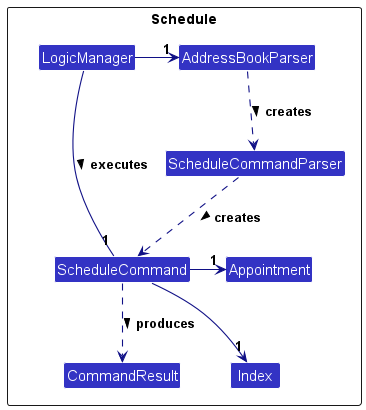
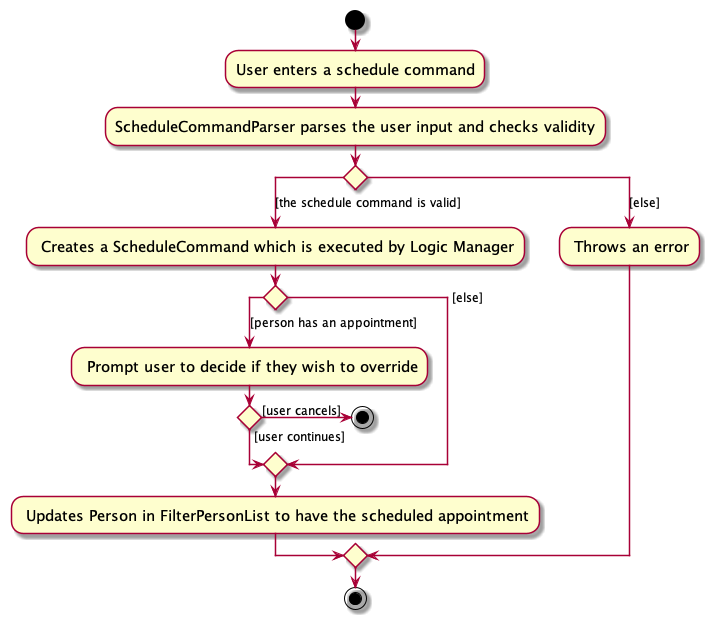
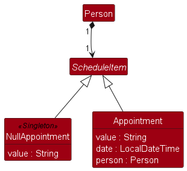
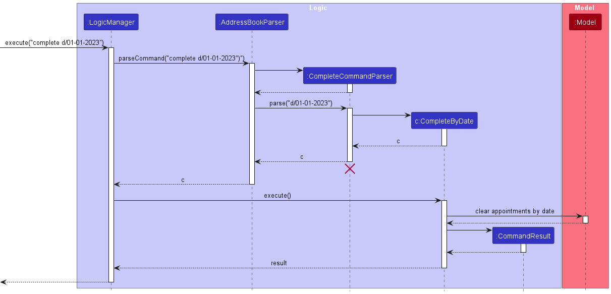
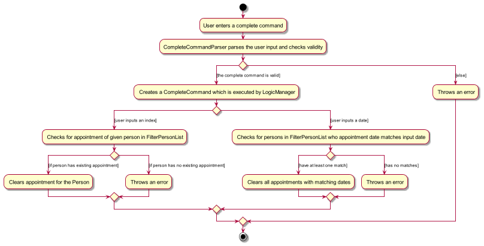
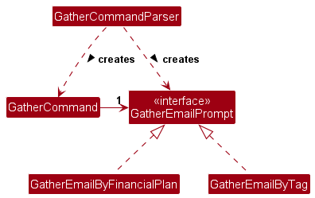
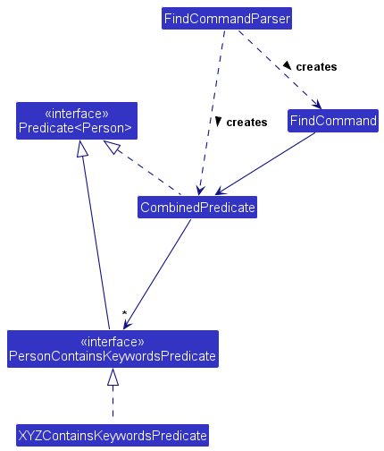
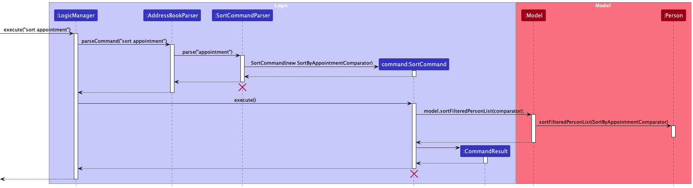

* Table of Contents
{:toc}

--------------------------------------------------------------------------------------------------------------------

## **Acknowledgements**

* This project is based on the AddressBook-Level3 project created by the [SE-EDU initiative](https://se-education.org).

--------------------------------------------------------------------------------------------------------------------

## **Setting up, getting started**

Refer to the guide [_Setting up and getting started_](SettingUp.md).

--------------------------------------------------------------------------------------------------------------------

## **Design**

:bulb: **Tip:** The `.puml` files used to create diagrams in this document `docs/diagrams` folder. Refer to the
[_PlantUML Tutorial_ at se-edu/guides](https://se-education.org/guides/tutorials/plantUml.html) to learn how to create
and edit diagrams.

### Architecture

The ***Architecture Diagram*** given above explains the high-level design of the App.

Given below is a quick overview of main components and how they interact with each other.

**Main components of the architecture**

**`Main`** (consisting of classes
[`Main`](https://github.com/AY2324S1-CS2103T-F12-1/tp/blob/master/src/main/java/seedu/address/Main.java)
and [`MainApp`](https://github.com/AY2324S1-CS2103T-F12-1/tp/blob/master/src/main/java/seedu/address/MainApp.java))
is in charge of the app launch and shut down.
* At app launch, it initializes the other components in the correct sequence, and connects them up with each other.
* At shut down, it shuts down the other components and invokes cleanup methods where necessary.

The bulk of the app's work is done by the following four components:

* [**`UI`**](#ui-component): The UI of the App.
* [**`Logic`**](#logic-component): The command executor.
* [**`Model`**](#model-component): Holds the data of the App in memory.
* [**`Storage`**](#storage-component): Reads data from, and writes data to, the hard disk.

[**`Commons`**](#common-classes) represents a collection of classes used by multiple other components.

**How the architecture components interact with each other**

The *Sequence Diagram* below shows how the components interact with each other for the scenario where the user issues
the command `delete 1`.

Each of the four main components (also shown in the diagram above),

* defines its *API* in an `interface` with the same name as the Component.
* implements its functionality using a concrete `{Component Name}Manager` class which follows the corresponding API
`interface` mentioned in the previous point.

For example, the `Logic` component defines its API in the `Logic.java` interface and implements its functionality
using the `LogicManager.java` class which follows the `Logic` interface. Other components interact with a given
component through its interface rather than the concrete class (reason: to prevent outside component's being coupled
to the implementation of a component), as illustrated in the (partial) class diagram below.

The sections below give more details of each component.

### UI component

The **API** of this component is specified in
[`Ui.java`](https://github.com/AY2324S1-CS2103T-F12-1/tp/blob/master/src/main/java/seedu/address/ui/Ui.java)

The UI consists of a `MainWindow` that is made up of parts e.g.`CommandBox`, `ResultDisplay`, `PersonListPanel`,
`StatusBarFooter` etc. All these, including the `MainWindow`, inherit from the abstract `UiPart` class which captures
the commonalities between classes that represent parts of the visible GUI.

The `UI` component uses the JavaFx UI framework. The layout of these UI parts are defined in matching `.fxml` files
that are in the `src/main/resources/view` folder. For example, the layout of the
[`MainWindow`](https://github.com/AY2324S1-CS2103T-F12-1/tp/blob/master/src/main/java/seedu/address/ui/MainWindow.java)
is specified in
[`MainWindow.fxml`](https://github.com/AY2324S1-CS2103T-F12-1/tp/blob/master/src/main/resources/view/MainWindow.fxml)

The `UI` component,

* executes user commands using the `Logic` component.
* listens for changes to `Model` data so that the UI can be updated with the modified data.
* keeps a reference to the `Logic` component, because the `UI` relies on the `Logic` to execute commands.
* depends on some classes in the `Model` component, as it displays `Person` and `Appointment` objects residing in the
`Model`.

### Logic component

**API** :
[`Logic.java`](https://github.com/AY2324S1-CS2103T-F12-1/tp/blob/master/src/main/java/seedu/address/logic/Logic.java)

Here's a (partial) class diagram of the `Logic` component:

The sequence diagram below illustrates the interactions within the `Logic` component, taking `execute("delete 1")` API
call as an example.

:information_source: **Note:** The lifeline for `DeleteCommandParser`
should end at the destroy marker (X) but due to a limitation of PlantUML, the lifeline reaches the end of diagram.

How the `Logic` component works:

1. When `Logic` is called upon to execute a command, it is passed to an `AddressBookParser` object which in turn
creates a parser that matches the command (e.g., `DeleteCommandParser`) and uses it to parse the command.
2. This results in a `Command` object (more precisely, an object of one of its subclasses e.g., `DeleteCommand`) which
is executed by the `LogicManager`.
3. The command can communicate with the `Model` when it is executed (e.g. to delete a person).
4. The result of the command execution is encapsulated as a `CommandResult` object which is returned back from `Logic`.

Here are the other classes in `Logic` (omitted from the class diagram above) that are used for parsing a user command:

How the parsing works:
* When called upon to parse a user command, the `AddressBookParser` class creates an `XYZCommandParser` (`XYZ` is a
placeholder for the specific command name e.g., `AddCommandParser`) which uses the other classes shown above to parse
the user command and create a `XYZCommand` object (e.g., `AddCommand`) which the `AddressBookParser` returns back as a
`Command` object.
* All `XYZCommandParser` classes (e.g., `AddCommandParser`, `DeleteCommandParser`, ...) inherit from the `Parser`
interface so that they can be treated similarly where possible e.g, during testing.

### Model component
**API** :
[`Model.java`](https://github.com/AY2324S1-CS2103T-F12-1/tp/blob/master/src/main/java/seedu/address/model/Model.java)

The `Model` component,

* stores the address book data i.e., all `Person` objects (which are contained in a `UniquePersonList` object).
* stores the currently 'selected' `Person` objects (e.g., results of a search query) as a separate _filtered_ list
which is exposed to outsiders as an unmodifiable `ObservableList<Person>` that can be 'observed' e.g. the UI can be
bound to this list so that the UI automatically updates when the data in the list change.
* stores a `UserPref` object that represents the user’s preferences. This is exposed to the outside as a
`ReadOnlyUserPref` objects.
* stores an `observableAppointments` object that represents existing appointments in the address book, sorted in a
chronological order.
* stores a `sortedAppointments` object that represents existing appointments in the address book.
* `observableAppointments` and `sortedAppointments` depend on `filteredPersons`. Hence, appointments listed are for
`Person` objects in `filteredPersons`.
* does not depend on any of the other three components (as the `Model` represents data entities of the domain, they
should make sense on their own without depending on other components)

### Storage component

**API** :
[`Storage.java`](https://github.com/AY2324S1-CS2103T-F12-1/tp/blob/master/src/main/java/seedu/address/storage/Storage.java)

The `Storage` component,
* can save both address book data and user preference data in JSON format, and read them back into corresponding objects.
* inherits from both `AddressBookStorage` and `UserPrefStorage`, which means it can be treated as either one (if only
the functionality of only one is needed).
* depends on some classes in the `Model` component (because the `Storage` component's job is to save/retrieve objects
that belong to the `Model`).

### Common classes

Classes used by multiple components are in the `seedu.addressbook.commons` package.

--------------------------------------------------------------------------------------------------------------------

## **Implementation**

This section describes some noteworthy details on how certain features are implemented.

### Overview

The basic idea of what happens when a user types a command:
1. The LogicManager executes method is called and takes in the user's input.
2. The user's input is then parsed by `AddressBookParser`, which then creates the respective `XYZCommandParser`.
3. `XYZCommandParser` parses the additional arguments provided by the user and creates and `XYZCommand`.
4. `XYZCommand` then communicates with ModelManager to execute and returns a `CommandResult` which is displayed to the user.

The flow of how a `Command` is executed is illustrated with the `Schedule` Command below.
### Schedule Command

#### Implementation Overview
After the `AddressBookParser` identifies that the user's input has a schedule command word, it creates a
`ScheduleCommandParser`. The `ScheduleCommandParser` then parses the users input and creates a new `ScheduleCommand`
containing an `Appointment` and an `Index`. The `ScheduleCommand` is then executed by `Logic Manager`, which updates
the `Person` in `Model` to have the created `Appointment`. A `CommandResult` which stores the message of the outcome
of schedule command is then returned. The partial class diagram is shown below.

The following activity diagram summarises what happens the user executes a schedule command.

**Design Considerations**

**Aspect: How to implement Appointments for Person**

Alternative 1 (Current Choice): Create an abstract class ScheduleItem and make it a compulsory field for Person.

The diagram below illustrates our current implementation. A `Person` has is associated with 1 `ScheduleItem`, which can be a `NullAppointment`(empty appointment) or `Appointment`.

- Pros:
  * This ensures a 1-to-1 relationship between Person and Appointment, making implementation of other functions like
  sort easier. This also prevents clutter of appointments in the UI.
  * This makes use of a **facade** design pattern, where `NullAppointment` and `Appointment` will handle themselves
  without the `Person` knowing.

- Cons:
  * This makes the scheduling of Appointments more inflexible, as the FA is unable to schedule multiple appointments
  with the same person.

- Other considerations:
  * `NullAppointment` is a Singleton class to prevent multiple instances of it being created, making it more efficient for memory.

Alternative 2: Create a hashset of Appointments for each Person.
- Pros:
  * More flexible, user can now schedule multiple appointment for a Person.

- Cons:
  * Harder to implement operations such as editing of an appointment for a client. An additional step of finding the
  specified appointment within the hashset is required, which may potentially introduce more bugs.
  * Harder to implement default behaviours for when person has no appointment.

### Complete Feature

The **Complete** feature is facilitated by the `CompleteCommand` and `CompleteCommandParser`. The
`CompleteCommandParser` creates a `CompleteCommand` associated with a `CompleteCommandDescriptor` which contains
information on how the appointments should be completed.

The following sequence diagram illustrates how the complete operation is executed when date given.

> :warn: The lifeline of the diagram should end at the destroyer mark (X) but reaches end of diagram due to limitation of plantUML

The following activity diagram illustrates how the complete operation is executed.

### Gather Emails Feature

The **Gather Emails** feature in our software system is a critical functionality designed to efficiently collect
email addresses. This feature is facilitated through the `GatherCommand` class, which plays a central role in the process.

#### Implementation Overview

The `GatherCommand` class is instantiated by the `GatherCommandParser`, which parses user input commands. The
`GatherCommandParser` class implements the following operations:

* `GatherCommandParser#parse(String args)` — Checks the prefixes (fp/ and t/) and instantiates `GatherCommand`
accordingly. It passes either a `GatherEmailByFinancialPlan` or a `GatherEmailByTag` object, both implementations of
the `GatherEmailPrompt` interface.

The `GatherCommand` takes in a `GatherEmailPrompt` object and passes it into the current `Model` model, subsequently
interacting with the `AddressBook` and `UniquePersonsList` classes. The `GatherCommand` class implements the following
operations:

* `GatherCommand#GatherCommand(GatherEmailPrompt prompt)` — Constructor that initializes the command with the
provided `GatherEmailPrompt` object.
* `GatherCommand#execute()` —  Executes the gathering operation by calling
`Model#gatherEmails(GatherEmailPrompt prompt)`.

The `Model` interface is implemented by the `ModelManager`, representing the in-memory model of the address book data.
It contains the following method:

* `ModelManager#gatherEmails(GatherEmailPrompt prompt)` —  Carries out the gathering operation by calling
`AddressBook#gatherEmails(GatherEmailPrompt prompt)`.

This operation is exposed in the `AddressBook` class as `AddressBook#gatherEmails(GatherEmailsPrompt prompt)`, and
in the `UniquePersonsList` class as `UniquePersonsList#gatherEmails(GatherEmailsPrompt prompt)`.

The `UniquePersonsList` class maintains a list of unique persons. Additionally, it implements the following operation:
* `UniquePersonsList#gatherEmails(GatherEmailPrompt prompt)` —  This method iterates through the persons list
and calls `GatherEmailPrompt#gatherEmails(Person person)`, passing in each person.

Depending on the scenario, it triggers either `Person#gatherEmailsContainsTag(String prompt)` or
`Person#gatherEmailsContainsFinancialPlan(String prompt)`:
* `Person#gatherEmailsContainsTag(String prompt)` —  Checks if the given prompt is a substring of the name of
any Tag in the `Set<Tag>` of the current person.
* `Person#gatherEmailsContainsFinancialPlan(String prompt)` —  Checks if the given prompt is a substring of the
name of any Financial Plan in the `Set<Tag>` of the current person.

This is the class diagram for the gather command:

**Usage Scenario:**

**Scenario 1:**
User enters a gather `fp/financial plan a`. The `GatherEmailByFinancialPlan` will be initialized. Each person in the
`UniquePersonList` will be passed into the `GatherEmailByFinancialPlan#gatherEmails(Person person)`.

**Scenario 2:**
User enters a gather `t/Elderly`. The `GatherEmailByTag` will be initialized. Each person in the `UniquePersonList`
will be passed into the `GatherEmailByTag#gatherEmails(Person person)`.

The following sequence diagram shows how the gather operation works:

#### Design Considerations

**Aspect: How implement more fields**

**Alternative 1 (Current Choice):** User can only search by one Financial Plan or Tag.
- **Pros:** Easy to implement. Limits the potential for bugs.
- **Cons:** Limited filtering options. Hard to scale to gather by other fields.

**Alternative 2:** User can search by multiple Financial Plans or Tags.
- **Pros:** More filtering options. Easy to scale to gather by other fields.
- **Cons:** Introduces more complexity and requires additional error handling.

_{more aspects and alternatives to be added}_

### Expanded Find feature

The enhanced find mechanism is facilitated by the `CombinedPredicate` and utilises the existing `FindCommand` structure.
It extends the `find` command with the ability to search for multiple terms at once, implemented using an array
of `PersonContainsKeywordsPredicate`. Here's a partial class diagram of the `CombinedPredicate`.

In the `FindCommandParser`, `CombinedPredicate` is initialised with a `NameContainsKeywordsPredicate`,
`FinancialPlanContainsKeywordsPredicate` and `TagContainsKeywordsPredicate`. These predicates check a `Person` if the respective field contains any of the keywords supplied to the predicate.

Note that only `NameContainsKeywordsPredicate` checks for whole words, because it is rare to search for people by
substrings e.g. `Marc` and `Marcus` should not show up in the same search. On the other hand,
`FinancialPlanContainsKeywordsPredicate` and `TagContainsKeywordsPredicate` allow matching for
substrings because there are certain cases where it is logical to search for substrings e.g. `Plan A` and
`Plan A Premium` are related, so they can show up in the same search.

The `find` command format also changes to resemble a format more similar to the `add` and `edit` commands, to allow for
searching for keywords in multiple fields at the same time. We also allow the use of duplicate prefixes so that we
can search for multiple terms belonging to the same field.

For now, we only allow for searching for `Name`, `FinancialPlan` and `Tag` fields because they are the most commonly
searched fields, but extending the feature to search in other fields is possible by creating the `Predicate` class and
modifying the `FindCommandParser`.

#### Design Considerations:

**Aspect: How to implement find for multiple fields**
* **Alternative 1 (current choice):** Use one unified command and format.
    * Pros: Easy to implement (argument multimap is available), allows for more flexible usage.
    * Cons: May get cluttered when there are many terms.

* **Alternative 2:** Take an argument to decide which field to find by.
    * Pros: More user-friendly and natural since there is no need to use prefixes.
    * Cons: Less flexible, slightly more difficult to implement.

**Aspect: How to implement `CombinedPredicate`**
* **Alternative 1 (current choice):** Use varargs and a common interface.
    * Pros: More flexible in usage while still testable.
    * Cons: More difficult to modify and the check for equality can be defeated with enough effort.

* **Alternative 2:** Compose it with the 3 component predicates.
    * Pros: Easier to modify and test.
    * Cons: Less flexible when trying to combine multiple predicates (that may be of the same type).

* **Alternative 3:** Use a `Predicate<Person>` and use the `or()` method to chain predicates.
    * Pros: More flexible in usage.
    * Cons: More difficult to modify and test.

### Sort Feature

The **Sort** feature in our software system is designed to sort the list of clients by name as well as appointment
time. This feature is facilitated through the `SortCommand` class.

#### Implementation Overview

The following diagram summarises what happens when the user executes a sort command

The `SortCommand` class is instantiated by the `SortCommandParser`, which parses user input commands. The
`SortCommandParser` class implements the following operations:

- **`SortCommandParser#parse(String args)` —  Checks the sort command keyword passed in by the user.

The `SortCommand` takes in a `Comparator<Person>` object and passes it into the current `Model` model. The
`SortCommand` class implements the following operations:

- **`SortCommand#execute()` —  Executes the sort operation by calling `model.sortFilteredPersonList(comparator)`.

The `Model` interface is implemented by the `ModelManager`, representing the in-memory model of the address book data.
It contains the following method:

- **`ModelManager#sortFilteredPersonList(Comparator<Person> comparator)` —  Carries out the sorting operation by
setting the comparator on the list of clients wrapped in a SortedList wrapper.

A `CommandResult` class is created and returned

**Aspect: Usage Scenario:**

**Scenario 1:**
User enters a sort command `sort appointment`. The `SortByAppointmentComparator` will be initialized and used to
instantiate a SortCommand that when executed causes the list to be sorted by appointment, showing the earlier appointment first.

**Scenario 2:**
User enters a sort command `sort name`. The `SortByNameComparator` will be initialized and used to instantiate a
SortCommand that when executed causes the list to be sorted by lexicographical ordering of name.

The following sequence diagram shows how the gather operation works:

#### Design Considerations

**Aspect: How Sort Executes**

**Aspect 1 :** User can sort by name and appointment at any time. As such, calling find on the sorted list will result
in the ordering of find to also be sorted.
- **Pros:** Improved usability of maintaining order of list throughout without the list having to be reordered after
each command
- **Cons:** Limited sorting options as of now

**Aspect 2:** After sorting the first time, it will not be possible to return the list to its original ordering
- **Pros:** Easier implementation of the sorting function.
- **Cons:** Unlikely, but if for some reason the user wants the list sorted back to its original order, the only way
is to restart the app at the current moment.

### Appointment Sidebar Feature

The appointment sidebar is facilitated by `ModelManager`. It extends `Model` and stores an additional
`SortedList<Appointment>` object that represents all existing appointments.

The `setAppointmentList()` method checks against `filteredPersons` to look for updates regarding existing
`Appointment` objects. The `getAppointmentList()` method is called once during the startup of the program by
`getAppointmentList()` in `LogicManager`, which is in turn called by `MainWindow`. It returns the
`sortedList<Appointment>` object within `modelManager`.

#### Design Considerations:

**Aspect: Where to create SortedList<Appointment>**
* **Alternative 1 (current choice):** Implement it within `modelManager`
    * Pros: `SortedAppointments` object references `filteredPersons` which ensures that the appointment sidebar
    corresponds with `persons` from `addressBook`.
    * Cons: Errors with respect to `addressBook` will affect the appointment sidebar rendered.

* **Alternative 2:** Implement it within `addressBook`
    * Pros: `persons` and `appointmentList` are handled separately within `addressBook` and hence the appointment
    sidebar is not dependent on `persons` in `addressBook`
    * Cons: `filteredPersons` and `sortedAppointments` might not correspond since `sortedAppointments` is no longer
    dependent on `filteredPersons`.

### \[Proposed\] Undo/redo feature

### \[Proposed\] Undo/redo feature
#### Proposed Implementation

The proposed undo/redo mechanism is facilitated by `VersionedAddressBook`. It extends `AddressBook` with an undo/redo
history, stored internally as an `addressBookStateList` and `currentStatePointer`. Additionally, it implements the
following operations:

* `VersionedAddressBook#commit()` — Saves the current address book state in its history.
* `VersionedAddressBook#undo()` — Restores the previous address book state from its history.
* `VersionedAddressBook#redo()` — Restores a previously undone address book state from its history.

These operations are exposed in the `Model` interface as `Model#commitAddressBook()`, `Model#undoAddressBook()` and
`Model#redoAddressBook()` respectively.

Given below is an example usage scenario and how the undo/redo mechanism behaves at each step.

Step 1. The user launches the application for the first time. The `VersionedAddressBook` will be initialized with the
initial address book state, and the `currentStatePointer` pointing to that single address book state.

Step 2. The user executes `delete 5` command to delete the 5th person in the address book. The `delete` command calls
`Model#commitAddressBook()`, causing the modified state of the address book after the `delete 5` command executes to be
saved in the `addressBookStateList`, and the `currentStatePointer` is shifted to the newly inserted address book state.

Step 3. The user executes `add n/David …​` to add a new person. The `add` command also calls
`Model#commitAddressBook()`, causing another modified address book state to be saved into the `addressBookStateList`.

:information_source: **Note:** If a command fails its execution, it
will not call `Model#commitAddressBook()`, so the address book state will not be saved into the `addressBookStateList`.

Step 4. The user now decides that adding the person was a mistake, and decides to undo that action by executing the
`undo` command. The `undo` command will call `Model#undoAddressBook()`, which will shift the `currentStatePointer` once
to the left, pointing it to the previous address book state, and restores the address book to that state.

:information_source: **Note:** If the `currentStatePointer` is at index
0, pointing to the initial AddressBook state, then there are no previous AddressBook states to restore. The `undo`
command uses `Model#canUndoAddressBook()` to check if this is the case. If so, it will return an error to the user
rather than attempting to perform the undo.

The following sequence diagram shows how the undo operation works:

:information_source: **Note:** The lifeline for `UndoCommand` should end
at the destroy marker (X) but due to a limitation of PlantUML, the lifeline reaches the end of diagram.

The `redo` command does the opposite — it calls `Model#redoAddressBook()`, which shifts the `currentStatePointer`
once to the right, pointing to the previously undone state, and restores the address book to that state.

:information_source: **Note:** If the `currentStatePointer` is at index
`addressBookStateList.size() - 1`, pointing to the latest address book state, then there are no undone AddressBook
states to restore. The `redo` command uses `Model#canRedoAddressBook()` to check if this is the case. If so, it will
return an error to the user rather than attempting to perform the redo.

Step 5. The user then decides to execute the command `list`. Commands that do not modify the address book, such as
`list`, will usually not call `Model#commitAddressBook()`, `Model#undoAddressBook()` or `Model#redoAddressBook()`.
Thus, the `addressBookStateList` remains unchanged.

Step 6. The user executes `clear`, which calls `Model#commitAddressBook()`. Since the `currentStatePointer` is not
pointing at the end of the `addressBookStateList`, all address book states after the `currentStatePointer` will be
purged. Reason: It no longer makes sense to redo the `add n/David …​` command. This is the behavior that most modern
desktop applications follow.

The following activity diagram summarizes what happens when a user executes a new command:

#### Design considerations:

**Aspect: How undo & redo executes:**

* **Alternative 1 (current choice):** Saves the entire address book.
  * Pros: Easy to implement.
  * Cons: May have performance issues in terms of memory usage.

* **Alternative 2:** Individual command knows how to undo/redo by
  itself.
  * Pros: Will use less memory (e.g. for `delete`, just save the person being deleted).
  * Cons: We must ensure that the implementation of each individual command are correct.

_{more aspects and alternatives to be added}_

### \[Proposed\] Data archiving

_{Explain here how the data archiving feature will be implemented}_

--------------------------------------------------------------------------------------------------------------------

## **Documentation, logging, testing, configuration, dev-ops**

* [Documentation guide](Documentation.md)
* [Testing guide](Testing.md)
* [Logging guide](Logging.md)
* [Configuration guide](Configuration.md)
* [DevOps guide](DevOps.md)

--------------------------------------------------------------------------------------------------------------------

## **Appendix: Requirements**

### Product scope

**Target user profile**: Financial Advisors
* has a need to manage a significant number of client contacts
* prefer desktop apps over other types
* can type fast
* prefers typing to mouse interactions
* is reasonably comfortable using CLI apps

**Value proposition**:
This tool functions as a digital address book suited to the needs of financial advisors.
It allows them to track, update, and manage their clients’ information efficiently.
This is facilitated through the use of a command line interface for efficient and effective querying and
modifying of clients’ data.

### User stories

Priorities: High (must have) - `* * *`, Medium (nice to have) - `* *`, Low (unlikely to have) - `*`

| Priority | As a …​                                                                   | I want to …​                                                                                                          | So that I can…​                                                                                                                      |
|----------|---------------------------------------------------------------------------|-----------------------------------------------------------------------------------------------------------------------|--------------------------------------------------------------------------------------------------------------------------------------|
|`* * *`| financial advisor who often works with numerous clients | have a central repository for my clients’ contacts details | effectively manage the intricate details of each of my clients. |
| `* * *`  | financial advisor | add clients' contacts to the contact book | accumulate contacts for future purposes. |
| `* * *`  | financial advisor | remove clients contacts from the contact book | keep my contact book compact and relevant. |
| `* * *`  | financial advisor | edit clients’ contacts in the contact book | keep my information updated. |
| `* *`  | financial advisor | record appointments with my clients | keep track of when my next meeting with the client is. |
| `* *`  | financial advisor | tag my clients by the plans they purchase | gather groups of clients based on the financial plan(s) they purchased. |
| `* *`  | financial advisor | search for clients with specific financial plans | update those people about their plans more efficiently. |
| `* *`  | financial advisor | sort my clients in certain orders including alphabetical order or appointment time in both ascending and descending order | view my clients in a more systematic manner. |
| `* *`  | financial advisor | view my upcoming appointments I have with clients in chronological order | better plan my time. |
| `* *`  | financial advisor | complete appointments | clean up the address book of completed appointments. |
| `* *`  | financial advisor | gather emails of clients by their tags such as age group | collate and notify people with the same tags on any updates. |
| `* *`  | financial advisor | search for clients with the same financial plan | efficiently provide targeted updates to individuals with the same plan. |
| `*`      | busy financial advisor                                                    | streamline administrative tasks like tracking my clients contacts                                                     | focus most of my time on giving personalised financial advice and services to my clients.                                            |
| `*`      | financial advisor managing a substantial client portfolio                 | follow a standardised format to collect my clients’ information                                                       | manage data consistency among my clients.                                                                                            |
| `*`      | financial advisor                                                         | search for specific client details                                                                                    | quickly contact my clients.                                                                                                          |
| `*`      | user who values both my clients' time and the quality of our interactions | set reminders for follow-up sessions with clients                                                                     | ensure I never miss an important meeting.                                                                                            |
| `*`      | financial advisor                                                         | efficiently track referral sources for my clients                                                                     | manage their relationships.                                                                                                          |
| `*`      | financial advisor                                                         | sort my clients in certain orders including alphabetical order portfolio value in both ascending and descending order | view my clients in a more systematic manner.                                                                                         |
| `*`      | financial advisor                                                         | filter my clients based on certain metrics like financial products purchased and minimum portfolio value              | choose clients.                                                                                                                      |
| `*`      | financial advisor                                                         | record appointments with clients with the application                                                                 | keep track of when my last meeting with each client is.                                                                              |
| `*`      | financial advisor                                                         | export my contact data and client data in a readable format                                                           | use it for backup purposes or to run data processing with other software tools.                                                      |
| `*`      | financial advisor                                                         | have a dashboard 	                                                                                                    | obtain insights into my clientele base including metrics like client acquisition, retention rates and revenue I generate each month. |
| `*`      | financial advisor	                                                        | categorise contacts based on their financial status (high net worth regular) 	                                        | prioritise my client interactions.                                                                                                   |
| `*`      | financial advisor                                                         | update my profile information (name, contact, details, company)                                                       | ensure my personal information is always accurate.                                                                                   |
| `*`      | an experienced user                                                       | edit the data file directly  	                                                                                        | be more efficient.                                                                                                                   |
| `*`      | user                                                                      | undo actions                                                                                                          | recover from my mistakes.                                                                                                            |
| `*`      | busy financial advisor                                                    | quickly add incomplete details of a client and be reminded about it                                                   | fill the rest in later.                                                                                                              |
| `*`      | financial advisor                                                         | check the appointments scheduled today                                                                                | 	 not forget to meet a client                                                                                                        |
| `*`      | financial advisor                                                         | view contacts of all my clients I am meeting for the day                                                              | 	efficiently search for their contacts.                                                                                              |
| `*`      | financial advisor                                                         | view all the insurance plans my client has purchased easily                                                           | make planning during an appointment easier.                                                                                          |
| `*`      | financial advisor                                                         | filter the plans of my client                                                                                         | to make it focus on certain plans during my appointment                                                                              |
| `*`      | financial advisor                                                         | make updates to their plans on the app easily	                                                                        | keep track of changes to the clients plans                                                                                           |
| `*`      | financial advisor                                                         | check which client has been under me the longest                                                                      | 	plan welfare to retain them as long term customers.                                                                                 |
| `*`      | financial advisor                                                         | add notes on clients                                                                                                  | 	excess them when needed                                                                                                             |
| `*`      | financial advisor                                                         | display data from the address book into a excel file                                                                  | 	more easily present to clients                                                                                                      |
| `*`      | financial advisor                                                         | add tags to customers                                                                                                 | 	collate and notify people with the same plan should there be a new change                                                           |
| `*`      | manager                                                                   | retrieve data on the types of plans purchased                                                                         | 	better understand the products my team member is selling                                                                            |
| `*`      | manager                                                                   | monitor expiring insurance plans                                                                                      | 	advice trainees on time management                                                                                                  |
| `*`      | financial advisor	                                                        | import a file                                                                                                         | 	easily transfer client information when client leaves                                                                               |

*{More to be added}*

### Use cases

(For all use cases below, the **System** is `UNOFAS` and the **Actor** is the `financial advisor`, unless specified otherwise)

**Use Case: UC01 - Show a list of all clients**\
**Precondition:** NIL\
**Guarantees**: A list of all clients' contact is shown.

**MSS**
1. User requests to list all clients.
2. UNOFAS shows a list of all patients.\
    Use case ends.

**Extensions**
* 2a. the list is empty.\
    Use case ends.

**Use Case: UC02 - Add a client** \
**Precondition:** NIL\
**Guarantees**: A client contact is added into UNOFAS only if the data entered is correct.

**MSS**
1.  User request to add a client to the list
2.  UNOFAS adds the client

    Use case ends.

**Extensions**
* 1a. Client details are invalid.
    * 1a1. System shows an error message.

      Use case resumes at step 1.

**Use Case: UC03 - Edit a client's contacts** \
**Precondition:** NIL\
**Guarantees**: A client contact is edited in UNOFAS only if the data entered is correct.

**MSS**

1.  User requests to <u>list clients (UC01)</u>
2.  User request to edit client’s contacts from the list
3.  UNOFAS changes the client’s contacts

    Use case ends.

**Extensions**

* 2a. User enters the wrong details.

    * 2a1. System shows an error message.

      Use case resumes at step 2.

**Use Case: UC04 - Delete a client** \
**Precondition:** NIL\
**Guarantees**: A client contact is deleted from UNOFAS only if the data entered is correct.

**MSS**

1. User requests to <u>list clients (UC01)</u>
2. User requests to delete a specific client in the list
3. System deletes the client

    Use case ends.

**Extensions**

* 2a. The specified client is non-existent.

    * 2a1. System shows an error message.

      Use case resumes at step 2.

**Use Case: UC05 - Find a client** \
**Precondition:** NIL\
**Guarantees**: A list of clients that matches the query is displayed.

**MSS**

1.  User requests to find client
2.  System shows a list of clients which match search query

    Use case ends.

**Extensions**

* 2a. The list is empty.

  Use case ends.

**Use Case: UC06 - Assign financial plan to a client** \
**Precondition:** NIL\
**Guarantees**: A financial plan is assigned to a client in UNOFAS only if the data entered is correct.

**MSS**

1.  User requests to <u>list clients (UC01)</u>
2.  UNOFAS shows a list of clients
3.  User request to <u>add financial plan to client’s contacts (UC03)</u>
4.  UNOFAS changes the client’s contacts

    Use case ends.

**Extensions**

* 3a. User enters the wrong details.

    * 3a1. System shows an error message.

      Use case resumes at step 1.

**Use Case: UC07 - Sort client's contacts** \
**Precondition:** NIL\
**Guarantees**: The contact list will be sorted in ascending order according to the sort function specified.

**MSS**

1.  User requests to <u>list clients (UC01)</u>
2. UNOFAS shows a list of clients
3. User requests to sort list of clients (by appointment time or name)
4. UNOFAS updates ordering of clients' contacts.

    Use case ends.

**Extensions**

* 3a. User enters the wrong details.
    * 3a1. System shows an error message.
      Use case resumes at step 1.

**Use Case: UC08 - Schedule appointment for a client** \
**Precondition:** Client must exist before scheduling appointment.\
**Guarantees**: An appointment is scheduled for a client in UNOFAS only if the data entered is correct.

**MSS**

1.  User requests to <u>list clients (UC01)</u>
2.  UNOFAS shows a list of clients
3.  User request to schedule appointment for client via the `schedule` command
4.  UNOFAS changes the client’s contacts

    Use case ends.

**Extensions**

* 3a. User enters the wrong details.
    * 3a1. System shows an error message.
      Use case resumes at step 1.

* 3b. User has an existing appointment scheduled.
    * 3a1. System shows a warning message.
      Use case resumes at step 4.

**Use Case: UC09 - Complete appointment for a client** \
**Precondition:** Appointment and client must exist before completing appointment.\
**Guarantees**: An appointment is completed for a client in UNOFAS only if the data entered is correct.

**MSS**

1.  User requests to <u>list clients (UC01)</u>
2.  UNOFAS shows a list of clients
3.  User requests to complete appointment for client via the `complete` command
4.  UNOFAS removes appointment from appointment list and client's contact card

    Use case ends.

**Extensions**

* 3a. User enters the wrong details.
    * 3a1. System shows an error message.
      Use case resumes at step 1.

* 3b. User does not have an existing appointment scheduled.
    * 3b1. System shows a warning message.
      Use case ends.

* 3c. User does not exist according to index provided.
    * 3c1. System shows a warning message.
      Use case ends.

### Non-Functional Requirements

1.  Should work on any _mainstream OS_ as long as it has Java `11` or above installed.
2.  Should be able to hold up to 1000 persons without a noticeable sluggishness in performance for typical usage.
3.  A user with typing speed of above 80WPM for regular English text (i.e. not code, not system admin commands) should
be able to accomplish most of the tasks faster using commands than using the mouse.
4.  A user should be able to have up to 2000 clients.
5.  The product is offered as a free offline service.
6.  The codebase should be well-documented to aid in future maintenance and updates.
7.  Should continue working despite invalid commands and error messages should be shown to the user.
8.  All features added to the code should be tested.
9.  All commands should be able to be executed by a financial advisor with little technical knowledge.

### Planned Enhancements
1. The current `schedule` command does not check if the given date is before the current date, so it is vulnerable to
user error. We plan to make the command check for the date and fail if the date is before the current date: `Date given
 cannot be before the current date`.
2. The current `phone` and `next-of-kin phone` fields currently only accepts numbers. It cannot accept international
number formats. We plan to make the fields accept symbols so numbers such as `+6598765432` and `001-234-1-4610818`
will be accepted. This will involve changing the validity checker for both fields.
3. The current contact book does not check for duplicates beyond the exact matching of the person's `name`.
We plan to refuse adding/editing of a person's details if it results in two people sharing a `name` (case-insensitive)
or `phone` since two people are very unlikely to share those details.
4. The current `name` and `next-of-kin name` fields currently do not accept symbols. We plan to make the fields accept
symbols so that names like `Thaarshen s/o Thaarshen` and `O'Brien` are accepted. This will involve changing the
validity checker for both fields.
5. The current `gather` command does not allow the gathering of all emails in the contact book or by multiple fields
at once. To allow the gathering of all the persons emails using `gather all` command, we plan create another
`GatherEmailPrompt` class, with a method that will call the Person `getEmail()` method. To allow gathering emails by multiple fields, for example using the `fp/` and `t/` prefixes at once, we plan to use a similar approach
to `find` but return the person's email instead.
6. The `complete`, `add`, `edit` and `schedule` commands currently display the whole list (i.e. undoes the result of
any `find` command) after being executed, which might cause users to become disoriented. We plan to disable this
interaction between these commands and `find`.
7. The `clear` command confirmation window can be manipulated using the arrow and 'Enter' keys. The window is
initialised with the focus on the `confirm` button. This makes it possible for a user to accidentally press 'Enter'
twice and wipe the contact book anyway, bypassing the defence mechanism entirely. We plan to make the command more
resistant to mistakes by having the user key in a specific phrase, or to initialise the window with the focus on the
`cancel` button instead.

*{More to be added}*

### Glossary

* **Mainstream OS**: Windows, Linux, Unix, OS-X
* **Private contact detail**: A contact detail that is not meant to be shared with others
* **API**: Application Programming Interface that enables application to use capabilities or data from another application
* **Financial Advisor**: A person who provides financial advice to clients
* **Financial Products**: A product connected with the way a person manages or uses money(e.g. Insurance)
* **Client**: A person whose financial products are being managed by a financial advisor
* **Portfolio value**: The intrinsic value of all financial products being held under a clients name
* **Central Repository**: A centralised storage location for all user data
* **Contact details**: Name, email, phone number, next-of-kin name, next-of-kin phone number and home address of a client
* **Manager**: A person who is a superior in charge of managing and mentoring a group of financial advisors.
* **Lexicographical**: Generalisation of alphabetical order to include symbols or elements of a totally ordered set.

--------------------------------------------------------------------------------------------------------------------

## **Appendix: Instructions for manual testing**

Given below are instructions to test the app manually.

:information_source: **Note:** These instructions only provide a starting
point for testers to work on;
testers are expected to do more *exploratory* testing.

### Launch and shutdown

1. Initial launch

   1. Download the jar file and copy into an empty folder

   2. Double-click the jar file Expected: Shows the GUI with a set of sample contacts. The window size may not be optimum.

2. Saving window preferences

   1. Resize the window to an optimum size. Move the window to a different location. Close the window.

   2. Re-launch the app by double-clicking the jar file. 
       Expected: The most recent window size and location is retained.

3. _{ more test cases …​ }_

### Deleting a person

1. Deleting a person while all persons are being shown

   1. Prerequisites: List all persons using the `list` command. Multiple persons in the list.

   2. Test case: `delete 1` 
      Expected: First contact is deleted from the list. Details of the deleted contact shown in the status message.
      Timestamp in the status bar is updated.

   3. Test case: `delete 0` 
      Expected: No person is deleted. Error details shown in the status message. Status bar remains the same.

   4. Other incorrect delete commands to try: `delete`, `delete x`, `...` (where x is larger than the list size) 
      Expected: Similar to previous.

2. _{ more test cases …​ }_

### Saving data

1. Dealing with missing data files
   1. If there is no saved data, the application will open with a new data file loaded with sample data
   2. To do this:
      1. Go to the location of the saved data. The location of the saved data can be found at the bottom left of the UNOFAS app.
      2. Delete the file `addressbook.json`.
      3. Restart the application.
   3. A new file with sample contacts and appointments will be created.

2. Dealing with corrupted data files
   1. If saved data is corrupted, the application will wipe the corrupted data and restart with no contacts and appointments.
   2. To simulate a corrupted file:
      1. Go to the location of the saved data.
      2. Open `addressbook.json` and corrupt the file in a way that makes it an invalid file to read (e.g. adding alphabets into a contact's phone number field)
      3. Restart the application.
   3. A new file will be created with no contacts and appointments.

