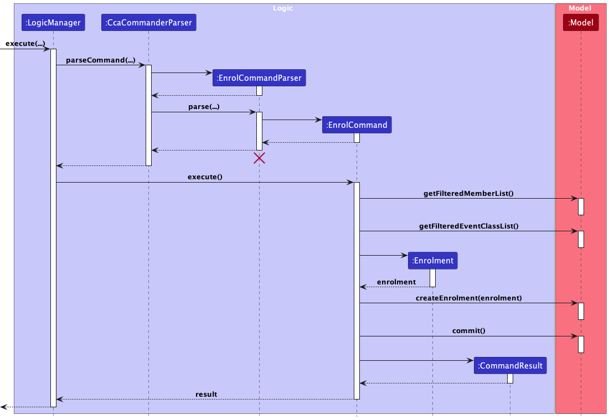
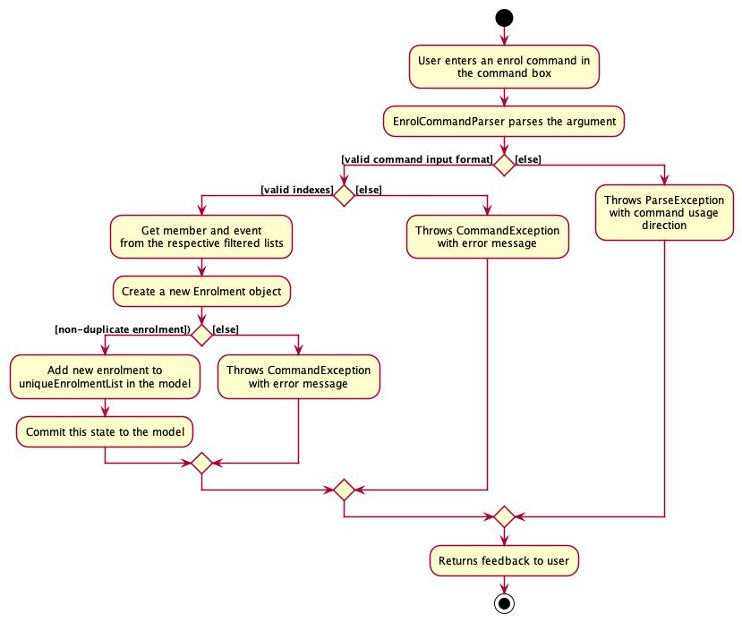
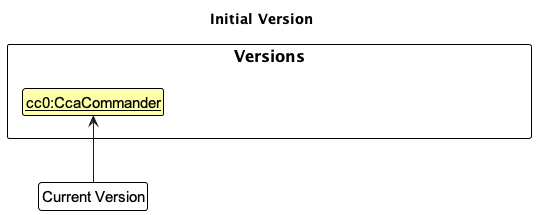
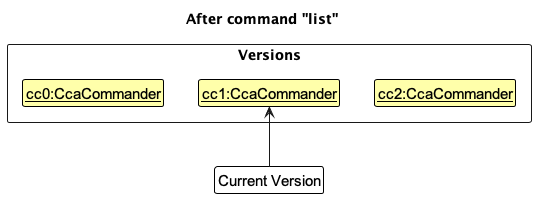
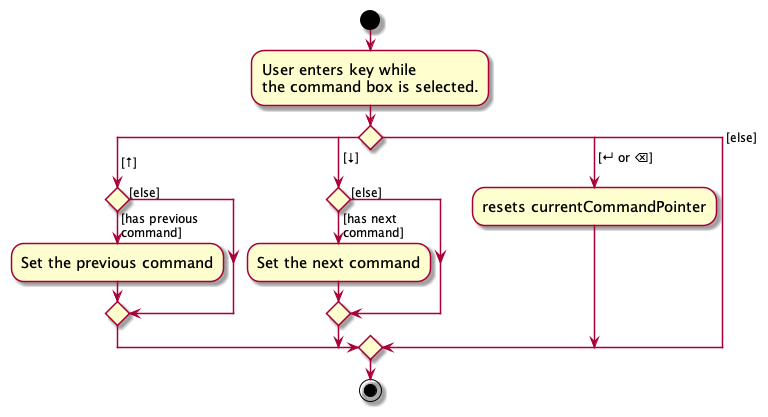

* Table of Contents
{:toc}

--------------------------------------------------------------------------------------------------------------------

## **Acknowledgements**

* {list here sources of all reused/adapted ideas, code, documentation, and third-party libraries -- include links to the original source as well}

--------------------------------------------------------------------------------------------------------------------

## **Setting up, getting started**

Refer to the guide [_Setting up and getting started_](SettingUp.md).

--------------------------------------------------------------------------------------------------------------------

## **Design**

:bulb: **Tip:** The `.puml` files used to create diagrams in this document `docs/diagrams` folder. Refer to the [_PlantUML Tutorial_ at se-edu/guides](https://se-education.org/guides/tutorials/plantUml.html) to learn how to create and edit diagrams.

### Architecture

The ***Architecture Diagram*** given above explains the high-level design of the App.

Given below is a quick overview of main components and how they interact with each other.

**Main components of the architecture**

**`Main`** (consisting of classes [`Main`](https://github.com/AY2324S1-CS2103T-F11-1/tp/blob/master/src/main/java/seedu/ccacommander/Main.java) and [`MainApp`](https://github.com/AY2324S1-CS2103T-F11-1/tp/blob/master/src/main/java/seedu/ccacommander/MainApp.java)) is in charge of the app launch and shut down.
* At app launch, it initializes the other components in the correct sequence, and connects them up with each other.
* At shut down, it shuts down the other components and invokes cleanup methods where necessary.

The bulk of the app's work is done by the following four components:

* [**`UI`**](#ui-component): The UI of the App.
* [**`Logic`**](#logic-component): The command executor.
* [**`Model`**](#model-component): Holds the data of the App in memory.
* [**`Storage`**](#storage-component): Reads data from, and writes data to, the hard disk.

[**`Commons`**](#common-classes) represents a collection of classes used by multiple other components.

**How the architecture components interact with each other**

The *Sequence Diagram* below shows how the components interact with each other for the scenario where the user issues the command `deleteMember 1`.

Each of the four main components (also shown in the diagram above),

* defines its *API* in an `interface` with the same name as the Component.
* implements its functionality using a concrete `{Component Name}Manager` class (which follows the corresponding API `interface` mentioned in the previous point).

For example, the `Logic` component defines its API in the `Logic.java` interface and implements its functionality using the `LogicManager.java` class which follows the `Logic` interface. Other components interact with a given component through its interface rather than the concrete class (reason: to prevent outside component's being coupled to the implementation of a component), as illustrated in the (partial) class diagram below.

The sections below give more details of each component.

### UI component

The **API** of this component is specified in [`Ui.java`](https://github.com/AY2324S1-CS2103T-F11-1/tp/blob/master/src/main/java/seedu/ccacommander/ui/Ui.java)

The UI consists of a `MainWindow` that is made up of parts e.g.`CommandBox`, `ResultDisplay`, `MemberListPanel`, `StatusBarFooter` etc. All these, including the `MainWindow`, inherit from the abstract `UiPart` class which captures the commonalities between classes that represent parts of the visible GUI.

The `UI` component uses the JavaFx UI framework. The layout of these UI parts are defined in matching `.fxml` files that are in the `src/main/resources/view` folder. For example, the layout of the [`MainWindow`](https://github.com/AY2324S1-CS2103T-F11-1/tp/blob/master/src/main/java/seedu/ccacommander/ui/MainWindow.java) is specified in [`MainWindow.fxml`](https://github.com/AY2324S1-CS2103T-F11-1/tp/blob/master/src/main/resources/view/MainWindow.fxml)

The `UI` component,

* executes user commands using the `Logic` component.
* listens for changes to `Model` data so that the UI can be updated with the modified data.
* keeps a reference to the `Logic` component, because the `UI` relies on the `Logic` to execute commands.
* depends on some classes in the `Model` component, as it displays `Member` and `Event` objects residing in the Model

### Logic component

**API** : [`Logic.java`](https://github.com/AY2324S1-CS2103T-F11-1/tp/blob/master/src/main/java/seedu/ccacommander/logic/Logic.java)

Here's a (partial) class diagram of the `Logic` component:

The sequence diagram below illustrates the interactions within the `Logic` component, taking `execute("deleteMember 1")` API call as an example.

:information_source: **Note:** The lifeline for `DeleteMemberCommandParser` should end at the destroy marker (X) but due to a limitation of PlantUML, the lifeline reaches the end of diagram.

How the `Logic` component works:

1. When `Logic` is called upon to execute a command, it is passed to an `CCACommanderParser` object which in turn creates a parser that matches the command (e.g., `DeleteMemberCommandParser`) and uses it to parse the command.
1. This results in a `Command` object (more precisely, an object of one of its subclasses e.g., `DeleteMemberCommand`) which is executed by the `LogicManager`.
1. The command can communicate with the `Model` when it is executed (e.g. to delete a member).
1. The result of the command execution is encapsulated as a `CommandResult` object which is returned back from `Logic`.

Here are the other classes in `Logic` (omitted from the class diagram above) that are used for parsing a user command:

How the parsing works:
* When called upon to parse a user command, the `CcaCommanderParser` class creates an `XYZCommandParser` (`XYZ` is a placeholder for the specific command name e.g., `CreateMemberCommandParser`) which uses the other classes shown above to parse the user command and create a `XYZCommand` object (e.g., `CreateMemberCommand`) which the `CcaCommanderParser` returns back as a `Command` object.
* All `XYZCommandParser` classes (e.g., `CreateMemberCommandParser`, `DeleteMemberCommandParser`, ...) inherit from the `Parser` interface so that they can be treated similarly where possible e.g, during testing.

### Model component
**API** : [`Model.java`](https://github.com/AY2324S1-CS2103T-F11-1/tp/blob/master/src/main/java/seedu/ccacommander/model/Model.java)
* The class diagram below gives an overview of the model package. 
*Details of the `Member`, `Event`, and `Enrolment` packages have be omitted for brevity.
Please refer to the [Member](#member-class-diagram), [Event](#event-class-diagram) and [Enrolment](#enrolment-model) diagrams for more information.*

The `Model` component,

* stores the CCACommander data i.e., all `Member` objects (which are contained in a `UniqueMemberList` object).
* stores the currently 'selected' `Member` objects (e.g., results of a search query) as a separate _filtered_ list which is exposed to outsiders as an unmodifiable `ObservableList<Member>` that can be 'observed' e.g. the UI can be bound to this list so that the UI automatically updates when the data in the list change.
* stores a `UserPref` object that represents the user’s preferences. This is exposed to the outside as a `ReadOnlyUserPref` objects.
* does not depend on any of the other three components (as the `Model` represents data entities of the domain, they should make sense on their own without depending on other components)

### Storage component

**API** : [`Storage.java`](https://github.com/AY2324S1-CS2103T-F11-1/tp/blob/master/src/main/java/seedu/ccacommander/storage/Storage.java)

The `Storage` component,
* can save both CCACommander data and user preference data in JSON format, and read them back into corresponding objects.
* inherits from both `CcaCommanderStorage` and `UserPrefStorage`, which means it can be treated as either one (if only the functionality of only one is needed).
* depends on some classes in the `Model` component (because the `Storage` component's job is to save/retrieve objects that belong to the `Model`)

### Common classes

Classes used by multiple components are in the `seedu.ccacommander.commons` package.

--------------------------------------------------------------------------------------------------------------------

## **Implementation**

This section describes some noteworthy details on how certain features are implemented.

### Enrolment Model
This section explains how the `Enrolment` model is implemented and the various design consideration when
implementing this model.

#### Implementation
The `Enrolment` and `UniqueEnrolmentList` classes are implemented as shown in the diagram below:

`Enrolment` encapsulates the enrolment of a member into an event. It composes of the `Name` of the member and
the `Name` of the event enrolled in, number of `Hours` they contributed, and a `Remark` to note for that
enrolment. `UniqueEnrolmentList` stores all unique instances of `Enrolment`.

#### Design considerations:

**Aspect: How to store each member's events and each event's members.**

* **Alternative 1 (current choice):** Saves the enrolments as an independent list.
  * Pros:
    * Easy to implement.
    * Less performance issues when loading and storing enrolments.
  * Cons:
    * Incur high performance cost when viewing members of event or events of member.

* **Alternative 2:** Each member or event has its own list of enrolments.
  * Pros:
    * Linear time to view members of event or events of members.
  * Cons:
    * Hard to implement.
    * Will encounter more difficulties when implementing other features related to enrolment.

Alternative 1 was chosen as the benefit of having a simple design outweighs the cost of having a higher
performance overhead when viewing members of event or events of member. Alternative 2 has multiple layers of
complexities that are difficult to navigate and this will compound when dealing with other features related to
enrolment. The simpler design of alternative 1 also allows for more rigorous testing.

### Enrol Feature
The enrol feature allows users to link a member to an event in order to keep track of their enrolment and contributions to the event.

This section will explain how the enrol feature was implemented and the various design considerations when implementing the feature.

#### Implementation
The enrolment mechanism is facilitated by `EnrolCommand`. It extends `Command`.
The method, `EnrolCommand#execute(Model model)`, performs a validity check and adds a member's enrolment for a particular event if
all the supplied parameters are valid.

The sequence diagram below shows how the `Model` and `LogicManager` components interact when a `EnrolCommand` is executed with user input
`enrol m/1 e/1 h/1 r/Role: Photographer` represented by `...`

1. `LogicManager` uses the `CcaCommanderParser` class to parse the user command, creating a new instance of `EnrolCommandParser` object.
2. The `EnrolCommandParser` creates a new instance of a `EnrolCommand` object and returns it to `CcaCommanderParser`
1. `CcaCommanderParser` encapsulates the `EnrolCommand` object as a `Command` object which is executed by
   the `LogicManager`.
1. The command execution calls `Model#getFilteredMemberList()` and `Model#getFilteredEventList()` to get the desired `member` and
   `event` respectively using indexes supplied by the user.
1. Next, the command execution creates a new instance of an `Enrolment` object.
1. `Model#createEnrolment()` is then called, adding the new `Enrolment` object to the `uniqueEnrolmentList` object in `model`.
1. The change resulting from the command's execution is saved using the `Model#commit(String commitMessage)` method for the `undo`/`redo` feature.
1. A `CommandResult` object which encapsulates the result of the command execution is passed back to the `Ui`.

The following activity diagram shows how the `EnrolCommand` works.

#### Design Considerations

##### Aspect 1: `EnrolCommand` parameters

* **Alternative 1 (current choice):** `EnrolCommand` has parameters `Name memberName`, `Name eventName`, `Hours hours` and `Remark remark`.
    * Pros:
        * Less complex code reduces the possibility of bugs.
        * Reduced coupling, enhancing maintainability
    * Cons:
        * Not standardised with other creation commands.

* **Alternative 2:** `EnrolCommand` has parameter `Enrolment enrolment`
    * Pros:
        * Standardised with other creation commands
    * Cons:
        * More complex code leading to higher possibility of bugs.
        * Increased coupling, reducing maintainability.

Alternative 1 was chosen because the cons of implementing alternative 2 outweighs the benefits derived from it. Alternative 2
would require `EnrolCommandParser` to have knowledge of the `Model`. This would result in an increased coupling as it would
then have greater dependence on more modules. Hence, while Alternative 1 would result in the `EnrolCommand` to be not standardised
with other create commands, it provides a simpler implementation with fewer changes needed while also maintaining ease of testing.

### Undo/Redo Feature

The Undo/Redo feature allows the user to revert commands that were entered wrongly.

This section will explain how the redo and undo features were implemented and the various design considerations when implementing the feature.

#### Implementation

The undo/redo mechanism is facilitated by `VersionedCcaCommander`. It extends `CcaCommander` with an undo/redo history, stored internally as an `ccaCommanderVersionList` and `versionPointer`. Additionally, it implements the following operations:

* `VersionedCcaCommander#commit(String commitMessage)` — Saves the current CCACommander version and its commit message in its history.
* `VersionedCcaCommander#undo()` — Restores the previous CCACommander version from its history.
* `VersionedCcaCommander#redo()` — Restores a previously undone CCACommander version from its history.

These operations are exposed in the `Model` interface as `Model#commit()`, `Model#undo()` and `Model#redo()` respectively.

Given below is an example usage scenario and how the undo/redo mechanism behaves at each step.

Step 1. The user launches the application for the first time. The `VersionedCcaCommander` will be initialized with the initial CCACommander version, and the `versionPointer` pointing to that single CCACommander version. This initial CCACommander version will be saved into the `ccaCommanderVersionList`

Step 2. The user executes `deleteMember 5` command to delete the 5th member in CCACommander. The `deleteMember` command calls `Model#commit(String commitMessage)`, causing the modified version of the CCACommander after the `deleteMember 5` command executes to be saved in the `ccaCommanderVersionList`, and the `versionPointer` is shifted to the newly inserted CCACommander version.

Step 3. The user executes `createMember n/David …​` to add a new member. The `createMember` command also calls `Model#commit(String commitMessage)`, causing another modified CCACommander version to be saved into the `ccaCommanderVersionList`.

:information_source: **Note:** If a command fails its execution, it will not call `Model#commit(String commitMessage)`, so the CCACommander version will not be saved into the `ccaCommanderVersionList`.

Step 4. The user now decides that adding the member was a mistake, and decides to undo that action by executing the `undo` command. The `undo` command will call `Model#undo()`, which will shift the `versionPointer` once to the left, pointing it to the previous CCACommander version, and restores the CCACommander to that version.

:information_source: **Note:** If the `versionPointer` is at index 0, pointing to the initial CcaCommander version, then there are no previous CcaCommander versions to restore. The `undo` command uses `Model#canUndo()` to check if this is the case. If so, it will return an error to the user rather
than attempting to perform the undo.

The following sequence diagram shows how the undo operation works:

:information_source: **Note:** The lifeline for `UndoCommand` should end at the destroy marker (X) but due to a limitation of PlantUML, the lifeline reaches the end of diagram.

The `redo` command does the opposite — it calls `Model#redo()`, which shifts the `versionPointer` once to the right, pointing to the previously undone version, and restores CCACommander to that version.

:information_source: **Note:** If the `versionPointer` is at index `ccaCommanderVersionList.size() - 1`, pointing to the latest CCACommander version, then there are no undone CcaCommander versions to restore. The `redo` command uses `Model#canRedo()` to check if this is the case. If so, it will return an error to the user rather than attempting to perform the redo.

Step 5. The user then decides to execute the command `list`. Commands that do not modify the CCACommander, such as `list`, will usually not call `Model#commit(String commitMessage)`, `Model#undo()` or `Model#redo()`. Thus, the `ccaCommanderVersionList` remains unchanged.

Step 6. The user executes `clear`, which calls `Model#commit(String commitMessage)`. Since the `versionPointer` is not pointing at the end of the `ccaCommanderVersionList`, all CCACommander versions after the `versionPointer` will be purged. Reason: It no longer makes sense to redo the `createMember n/David …​` command. This is the behavior that most modern desktop applications follow.

The following activity diagram summarizes what happens when a user executes a new command:

#### Design considerations:

**Aspect: How undo & redo executes:**

* **Alternative 1 (current choice):** Saves the entire CCACommander.
  * Pros: Easy to implement.
  * Cons: May have performance issues in terms of memory usage.

* **Alternative 2:** Individual command knows how to undo/redo by
  itself.
  * Pros: Will use less memory (e.g. for `deleteMember`, just save the member being deleted).
  * Cons: We must ensure that the implementation of each individual command are correct.

### Command History

#### Implementation
The proposed commandHistory mechanism is facilitated by `CommandHistory`. It contains `commandHistoryList` and `currentCommandPointer`. Additionally, it implements the following operations:
* `CommandHistory#hasPreviousCommand()` — Returns if there is a previously command from the history based on `currentCommandPointer`.
* `CommandHistory#hasNextCommand()` — Returns if there is a next command from the history based on `currentCommandPointer`.
* `CommandHistory#getPreviousCommand()` — Restores the previous command from its history based on `currentCommandPointer`.
* `CommandHistory#getNextCommand()` — Restores the next command from its history based on `currentCommandPointer`.
* `CommandHistory#addCommand()` — Add the command into the history.
* `CommandHistory#isLastCommandEqualCommand()` — Returns if the command is equal to the last command added into the `commandHistoryList`.
* `CommandHistory#resetPointer()` — Resets the pointer to be start from the most recent command again.
* `CommandHistory#isLastCommand()` — Returns if `currentCommandPointer` is at the last command.

Given below is an example usage scenario and how the commandHistory behaves at each step.

Step 1. The user launches the application for the first time and enters their first command. 
The `CommandHistory` will save the command and the `currentCommandPointer` won't be pointing to any command.

Step 2. The user presses '↑' while the commandBox is selected. `CommandHistory#getPreviousCommand()` is called and the previous command is displayed in the commandBox. 
When the previous command is entered into the commandBox, the new version of command will not be stored in `CommandHistory` after calling `CommandHistory#isLastCommandEqualCommand()`
and it returns true.

Step 3. The user presses '↑' while the commandBox is selected. `CommandHistory#getPreviousCommand()` is called 
and the previous command is displayed in the commandBox. When the previous command is edited and is entered into the commandBox, the newly edited version of command will be stored in `CommandHistory` after calling `CommandHistory#addCommand()`.

Step 4. The user has pressed '↑' while selecting the commandBox until the first Command and `CommandHistory#getPreviousCommand()` 
is called multiple times. The user then presses '↓' and `CommandHistory#getNextCommand()` is called and the command1 (the next command) will then be displayed in the commandBox.

:information_source: **Note:** If the `currentCommandPointer` is at 
index 0, pointing to the initial first command, then there are no previous commands to restore. The program uses 
`CommandHistory#hasPreviousCommand()` to check if this is the case. If so, it will not change anything.

The opposite occurs too when calling the next command  —  the program calls `CommandHistory#hasNextCommand()`, which shifts the `currentCommandPointer` once to the right, pointing to the previously entered command and displaying that command instead.

:information_source: **Note:** If the `commandHistoryPointer` is at index `commandHistoryList.size()`, pointing to nothing, and there are no undone CcaCommander states to restore. 
The program uses `CommandHistory#hasNextCommand()` to check if this is the case. If so, it will not call `CommandHistory#getNextCommand()`
but will instead use `CommandHistory#isLastCommand()` to check if the `commandHistoryPointer` is at the last command and set the commandBox to be blank.

The following activity diagram summarizes what happens when a user executes a new command:

#### Design considerations:

**Aspect: Storing of Command History:**

* **Alternative 1 (current choice):** Stores the list of all commands.
    * Pros: Allows user to iterate through all commands listed.
    * Cons: May have performance issues in terms of memory usage after prolonged usage.

* **Alternative 2:** CommandHistory only stores previous command.
    * Pros: Will use less memory and reduces user error.
    * Cons: Quite limited as a feature.

### \[Proposed\] Data archiving

_{Explain here how the data archiving feature will be implemented}_

--------------------------------------------------------------------------------------------------------------------

## **Planned Enhancements**

### Allow users to add / delete tags without retyping previous tags
**Current Implementation:**
* **Current Issue:** Each member/event can have tags attached to it and these tags can be edited using the `editMember`/`editEvent`
commands. However, upon adding a new tag to a member/event without typing all the old tags, it will override the initial tags attached to
the member/event and only the new tag will be displayed. This brings inconvenience to the user as the user has to 
type both the old and new tags instead of just typing the new tag.
* **Example:** We have a member called Alice with a member index of 1, and she has an initial tag called `friend`. We want to 
add a new tag `early` to her. Upon entering the command `editMember 1 t/early`, the current implementation will override 
all the initial tags and only the `early` tag will be displayed.

**Proposed Solution:**

We propose to enhance the `editMember`/`editEvent` commands to give the user the flexibility to choose one of the following options
when editing the tags of the member/event:
1. Override the initial tags entirely where the new tags that the user enters will entirely replace all the old tags
2. Add new tag to the list of old tags where the old tags will remain attached to the member/event with the addition of the new tags
3. Edit current list of tags attached to the member/event
4. Delete specific tags from the current list of tags attached to the member/event

### Allow users to create and edit a member/event with name containing non-alphanumeric characters
**Current Implementation:**
* **Current Issue:** Member/event name only accepts alphanumeric characters and restricts the user from entering special characters
into the member/event name, which should be allowed as member/event names can contain special characters.
* **Example:** The user wants to create a new event named "Raffles Hall's Musical Production" and the user enters 
`createEvent n/Raffles Hall's Musical Production l/Raffles Hall d/2023-09-19` but the message "Names should only contain 
alphanumeric characters and spaces, and it should not be blank" is shown to the user instead of accepting it as a valid event. This is
due to the presence of the special character `'` in the event name.

**Proposed Solution:**

We propose to allow the `createMember`, `editMember` , `createEvent` and `editEvent` commands to accept special 
characters in the name field and not to be restricted to just alphanumeric characters.

### Make UI stay on current view upon editMember or editEvent
**Current Implementation:**
* **Current Issue:** Currently, calling `editMember` or `editEvent` will result in the listing of all events and members.
* **Example:** If the user is viewing a filtered list for example if they have just called `viewMember`, if the user
  then edits a member or event using `editMember` or `editEvent`, all events and members will be displayed instead of their current
filtered view. This will cause inconvenience for the user as they will have to relocate the edited member/event.

**Proposed Solution:**

We propose to change the behaviour of `editMember` and `editEvent` such that calling them will no longer list all members and events,
and instead remain on the user's current view.

### Show a more specific error message for negative index in `editMember`, `editEvent`, `viewMember`, `viewEvent`, `deleteMember` and `deleteEvent`
**Current Implementation:**
* **Current Issue:** When the user inputs a negative index for the `editMember`, `editEvent`, `viewMember`, `viewEvent`, 
`deleteMember` or `deleteEvent` commands, the displayed error message is not specific enough and does not make it clear 
to the user that he/she has wrongly input a negative index.
* **Example:** The user enters the command `editMember -1 n/Jane Smith` and the error message displayed is 
"Invalid command format!... Parameters: INDEX (must be a positive integer)...". The current error message fails to 
highlight to the user the root cause of the error, which is a negative member index.

**Proposed Solution:**

We propose to make `editMember`, `editEvent`, `viewMember`, `viewEvent`, `deleteMember` and `deleteEvent` commands 
display a more specific error message along the lines of "The provided index is negative and should be a positive integer 
instead." when the user inputs a negative index. In order to implement this, the relevant `CommandParser` classes have 
to recognise negative indexes and throw more specific exceptions.

### Provide more specific index error messages to the user
**Current Implementation:**
* **Current Issue:** As of now, for commands that accept more than 1 index as a parameter, it is hard to tell which index is wrong
based on the index error message shown to the user if one of the indexes provided is wrong. This can hamper the user's efficiency as the
user cannot tell immediately which provided index is wrong.
* **Example:** Commands such as `enrol` accept more than 1 index as a parameter. When the user accidentally enters an invalid index
such as `enrol m/1 e/-1` where the event index is wrong, the error message displayed to the user is just "Index is not a non-zero unsigned integer."
There is a lack of information shown to the user which specific index is wrong.

**Proposed solution:**

We propose to make the index error messages more specific and highlight to the user which index is wrong and why
that index is wrong. For example, in the `enrol m/1 e/-1` input, we will show an error message to the user along 
the lines of "The provided Event Index is not a non-zero unsigned integer."

### Make UI stay on current view upon undo/redo
**Current Implementation:**
* **Current Issue:** Currently, the `undo` and `redo` commands will always result in all members and events being listed.
* **Example:** For example, if the user enrols a member to an event and views the member, before deciding to unenrol the member
from the event by executing the `undo` command, all the members and events would then be listed. This inconveniences the user
as they will then have to execute the `viewMember` command again to see their changes. 

**Proposed Solution:**

We propose to change the behaviour of `undo` and `redo` such that executing them will no longer list all members and events,
and instead remain on the user's current view.

--------------------------------------------------------------------------------------------------------------------

## **Documentation, logging, testing, configuration, dev-ops**

* [Documentation guide](Documentation.md)
* [Testing guide](Testing.md)
* [Logging guide](Logging.md)
* [Configuration guide](Configuration.md)
* [DevOps guide](DevOps.md)

--------------------------------------------------------------------------------------------------------------------

## **Appendix: Requirements**

### Product scope

**Target user profile**:

* has a need to manage a significant number of CCA members and events
* prefer desktop apps over other types
* can type fast
* prefers typing to mouse interactions
* is reasonably comfortable using CLI apps

**Value proposition**: one stop app to manage CCA members and events faster than a typical mouse/GUI driven app

### User stories

Priorities: High (must have) - `* * *`, Medium (nice to have) - `* *`, Low (unlikely to have) - `*`

| Priority | As a …​       | I can …​                                       | So that …​                                                                          |
|-------|---------------|------------------------------------------------|-------------------------------------------------------------------------------------|
| `* * *` | beginner user | create a new profile of a CCA member           | I can keep track of their information                                               |
| `* * *` | power user    | delete the profile of a CCA member             | I can remove them from the system when needed                                       |
| `* * *` | beginner user | list all members in my CCA                     | I can keep track of my CCA strength                                                 |
| `* * *` | beginner user | add a new event hosted by the CCA              | I can keep track of upcoming activities                                             |
| `* * *` | power user    | delete an event                                | I can remove it from the schedule                                                   |
| `* * *` | power user    | view a list of all events hosted by the CCA    | I can see event history                                                             |
| `* * *` | beginner user | add a member to an event                       | I can track which members are participating in the event                            |
| `* * *` | beginner user | remove a member from an event                  | I can amend adding the wrong member to an event                                     |
| `* * *` | beginner user | view the members who have enrolled in an event | I can estimate the number of members who will enrol in similar events in the future |
| `* * *` | beginner user | view events of a member                        | I can check how involved that particular member is                                  |
| `* *` | beginner user | recall the previous commands                   | I can enter similar commands quickly                                                |
| `* *` | power user    | undo a command                                 | I can correct any wrong commands that I have entered previously                     |
| `* *` | power user    | redo a command                                 | I can correct any wrong undo commands that I have entered previously                |

Future User Stories to be implemented:

| Priority | As a …​        | I can …​                                                                        | So that …​                                                         |
|----------|----------------|---------------------------------------------------------------------------------|--------------------------------------------------------------------|
| `* *`    | power user     | generate reports on the total hours spent by CCA Members for a specified period | I can assess their involvement                                     |
| `* *`    | power user     | add multiple profiles for CCA Members in bulk                                   | I can save time when onboarding new members                        |
| `* *`    | power user     | export attendance data for an event as a CSV file                               | I can use it for further analysis of which events are more popular |
| `* *`    | long term user | archive/hide unused data                                                        | I will not be distracted by irrelevant data                        |
| `* *`    | long term user | create custom templates for events                                              | I can quickly set up recurring activities with predefined details  |
| `* *`    | long term user | create aliases for commands                                                     | I can save time on frequently performed commands                   |
| `* *`    | beginner user  | access a user-friendly help guide for exporting data in PDF/CSV format          | I can share the data with other CCA Heads                          |
| `*`      | power user     | import data from an external source to update member profiles                   | I can keep information up-to-date                                  |

### Use cases

(For all use cases below, the **System** is the `CCACommander` and the **Actor** is the `user`, unless specified otherwise)

<ins>**Use case: UC01 - Create a member**</ins>

**Guarantees: MSS -> Entered member will be added.**

**MSS**

1.  User enters command to create a member.
2.  CCACommander adds that member to the member list and displays the member added.

    Use case ends.

**Extensions**
* 1a. User uses the command incorrectly.

    * 1a1. CCACommander shows an error message.

      Use case ends.

<ins>**Use case: UC02 - Delete a member**</ins>

**Guarantees: MSS -> Specified member will be deleted.**

**MSS**

1. User requests to <ins>list all members</ins> (UC03).
2. CCACommander shows a list of all members.
3. User requests to delete a specific member in the list of all members.
4. CCACommander deletes the specific member.

    Use case ends.

**Extensions**

* 3a. The given index is invalid.

    * 3a1. CCACommander shows an error message and requests for a valid index from the user.
    * 3a2. User enters new index.
    * Steps 3a1-3a2 are repeated until index given by the user is correct.

      Use case resumes at step 4.

<ins>**Use case : UC03 - List all members**</ins>

**Guarantees: MSS -> All members will be listed.**

**MSS**

1. User requests to list all members.
2. CCACommander lists all members in the CCA.

   Use case ends.

**Extensions**

* 1a. The list of all members is empty.

    * 1a1. CCACommander shows an empty member list.

      Use case ends.

<ins>**Use case : UC04 - List all events**</ins>

**Guarantees: MSS -> All events will be listed.**

**MSS**

1. User requests to list all events.
2. CCACommander lists all events in the CCA.

   Use case ends.

**Extensions**

* 1a. The list of all events is empty.

    * 1a1. CCACommander shows an empty event list.

      Use case ends.

<ins>**Use case: UC05 - View members of event**</ins>

**Guarantees: MSS -> All members of the specified event will be listed.**

**MSS**

1. User requests to <ins>list all events</ins> (UC04).
2. CCACommander shows a list of all events.
3. User requests to view a specific event in the list of all events.
4. CCACommander displays all members of the specified event.

   Use case ends.

**Extensions**
* 3a. The given index is invalid.

    * 3a1. CCACommander shows an error message.

      Use case resumes at step 2.

<ins>**Use case: UC06 - View events of member**</ins>

**Guarantees: MSS -> All events of the specified member will be listed.**

**MSS**

1. User requests to <ins>list all members</ins> (UC03).
2. CCACommander shows a list of all members.
3. User requests to view a specific member in the list of all members.
4. CCACommander displays all events of the specified member.

   Use case ends.

**Extensions**
* 3a. The given index is invalid.

    * 3a1. CCACommander shows an error message.

      Use case resumes at step 2.

<ins>**Use case: UC07 - Create an event**</ins>

**Guarantees: MSS -> Entered event will be added.**

**MSS**

1.  User requests to add an event to the list.
2.  CCACommander adds that event to the event list and displays the event added.

    Use case ends.

**Extensions**
* 1a. User uses the command incorrectly.

    * 1a1. CCACommander shows an error message.

      Use case ends.

<ins>**Use case: UC08 - Delete an event**</ins>

**Guarantees: MSS -> Specified event will be deleted.**

**MSS**

1.  User <ins>lists all events</ins> (UC04).
2.  CCACommander shows a list of all events.
3.  User requests to delete a specific event in the list of all events.
4.  CCACommander deletes the specific event.

    Use case ends.

<ins>**Use case: UC09 - Enrol member to an event**</ins>

**Guarantees: MSS -> Specified member will be enrolled to the event.**

**MSS**

1. User <ins>lists all members</ins> (UC03).
2. CCACommander shows a list of all members.
3. User <ins>lists all events</ins> (UC04).
4. CCACommander shows a list of all events.
5. User requests to enrol a specific member in the list of all members to a specific event in the list of all events.
6. CCACommander enrols the specified member from the specified event.

    Use case ends.

**Extensions**

* 5a. The given index is invalid.

    * 5a1. CCACommander shows an error message and requests for a valid index from the user.
    * 5a2. User enters new index.
    * Steps 5a1-5a2 are repeated until index given by the user is correct.

      Use case resumes at step 6.

* 5b. The specified member is already added to the event.

    * 5b1. CCACommander shows an error message saying member is already in event.

      Use case ends.

<ins>**Use case: UC10 - Unenrol member from an event**</ins>

**Guarantees: MSS -> Specified member will be unenrolled from the event.**

**MSS**

1. User <ins>lists all members</ins> (UC03).
2. CCACommander shows a list of all members.
3. User <ins>lists all events</ins> (UC04).
4. CCACommander shows a list of all events.
5. User requests to unenrol a specific member in the list of all members to a specific event in the list of all events.
6. CCACommander unenrols the specified member to the specified event.

    Use case ends.

**Extensions**

* 5a. The given index is invalid.

    * 5a1. CCACommander shows an error message and requests for a valid index from the user.
    * 5a2. User enters new index.
    * Steps 5a1-5a2 are repeated until index given by the user is correct.

      Use case resumes at step 6.
* 5b. The specified member is not in the event.

    * 5b1. CCACommander shows an error message saying member is not in event.

      Use case ends.

*{More to be added}*

### Non-Functional Requirements

1.  Should work on any _mainstream OS_ as long as it has Java `11` or above installed.
2.  Should be able to hold up to 1000 members without a noticeable sluggishness in performance for typical usage.
3.  Should be able to hold up to 1000 events without a noticeable sluggishness in performance for typical usage.
4.  A user with above average typing speed for regular English text (i.e. not code, not system admin commands) should be able to accomplish most of the tasks faster using commands than using the mouse.

*{More to be added}*

### Glossary

* **CCA**: Co-Curricular Activities
* **CLI**: Command Line Interface
* **Data archiving**: A feature related to data storage and archiving
* **Event**: An activity entity of the application
* **Extensions**: Variations or deviations from the main success scenario in a use case
* **GUI**: Graphical User Interface
* **Jar file**: A Java Archive file used to distribute and run Java applications
* **Mainstream OS**: Windows, Linux, Unix, OS-X
* **Member**: An individual entity of the application
* **MSS**: Main Success Scenario
* **Non-Functional Requirements**: Constraints under which system is developed and operated
* **PlantUML**: The tool or language used for creating diagrams in the documentation
* **Sequence Diagram**: A type of diagram used to visualize the sequence of interactions between components or objects

--------------------------------------------------------------------------------------------------------------------

## **Appendix: Instructions for manual testing**

Given below are instructions to test the app manually.

:information_source: **Note:** These instructions only provide a starting point for testers to work on;
testers are expected to do more *exploratory* testing.

### Launch and shutdown

1. Initial launch

   1. Download the jar file and copy into an empty folder

   1. Double-click the jar file Expected: Shows the GUI with a set of sample contacts. The window size may not be optimum.

1. Saving window preferences

   1. Resize the window to an optimum size. Move the window to a different location. Close the window.

   1. Re-launch the app by double-clicking the jar file. 
       Expected: The most recent window size and location is retained.

1. _{ more test cases …​ }_

### Deleting a member

1. Deleting a member while all members are being shown

   1. Prerequisites: List all members using the `list` command. Multiple members in the list.

   1. Test case: `deleteMember 1` 
      Expected: First contact is deleted from the list. Details of the deleted contact shown in the status message. Timestamp in the status bar is updated.

   1. Test case: `deleteMember 0` 
      Expected: No member is deleted. Error details shown in the status message. Status bar remains the same.

   1. Other incorrect deleteMember commands to try: `deleteMember`, `deleteMember x`, `...` (where x is larger than the list size) 
      Expected: Similar to previous.

1. _{ more test cases …​ }_

### Saving data

1. Dealing with missing/corrupted data files

   1. _{explain how to simulate a missing/corrupted file, and the expected behavior}_

1. _{ more test cases …​ }_
