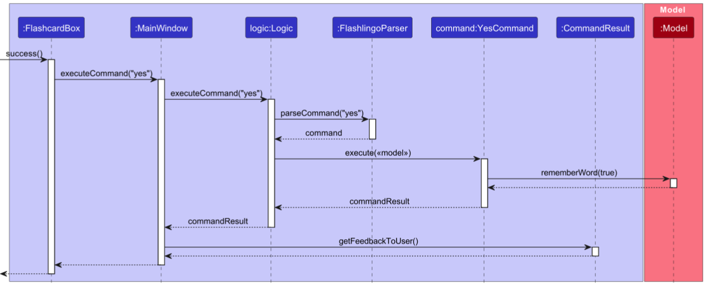
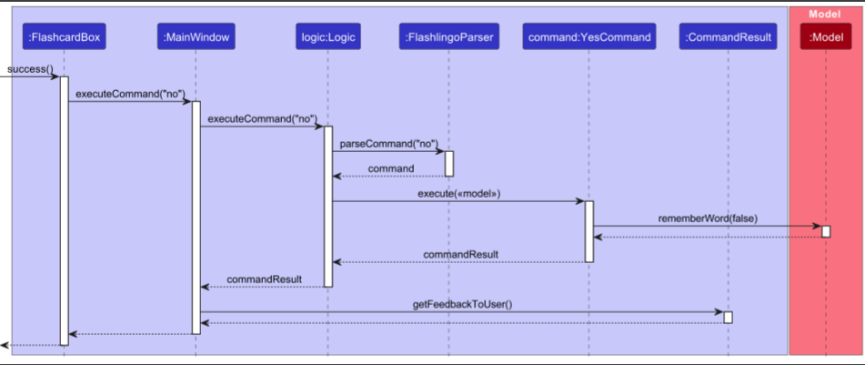
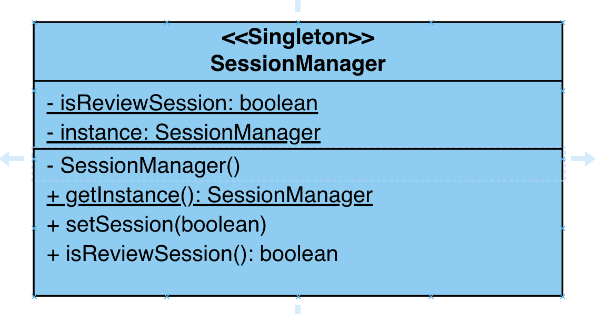
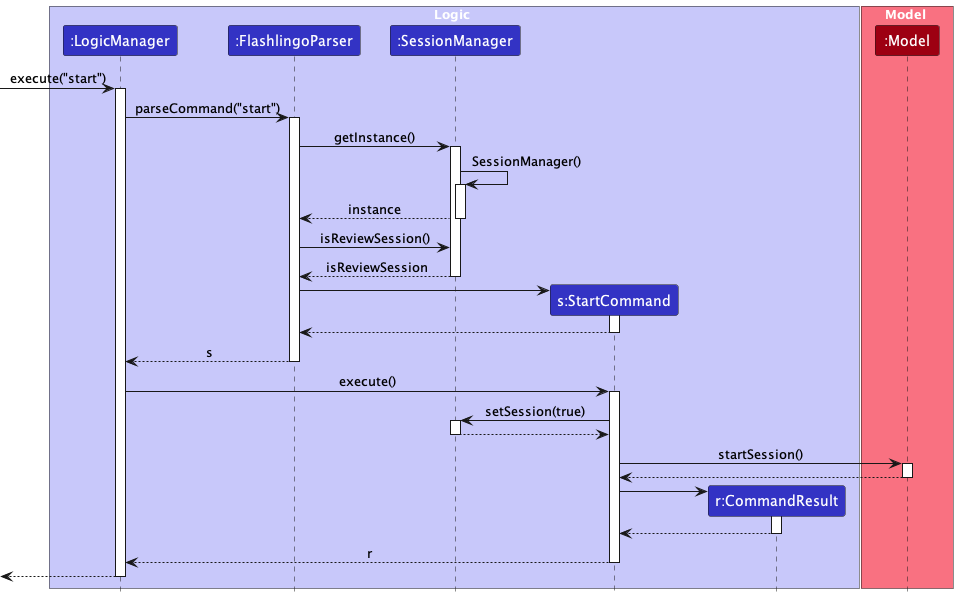
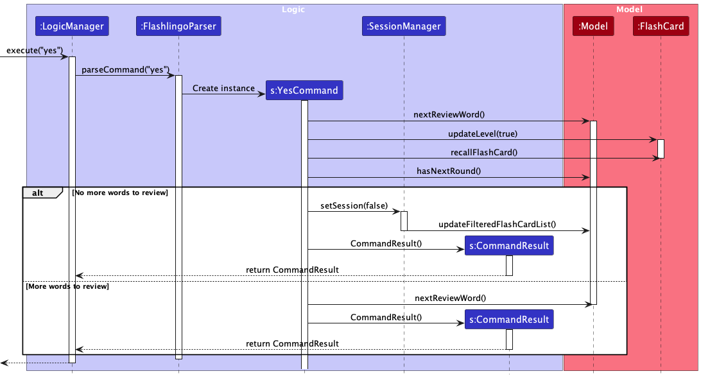
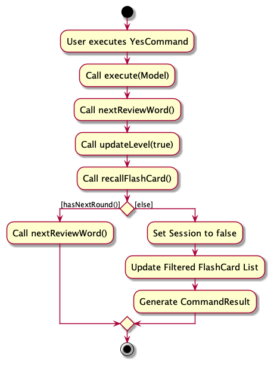
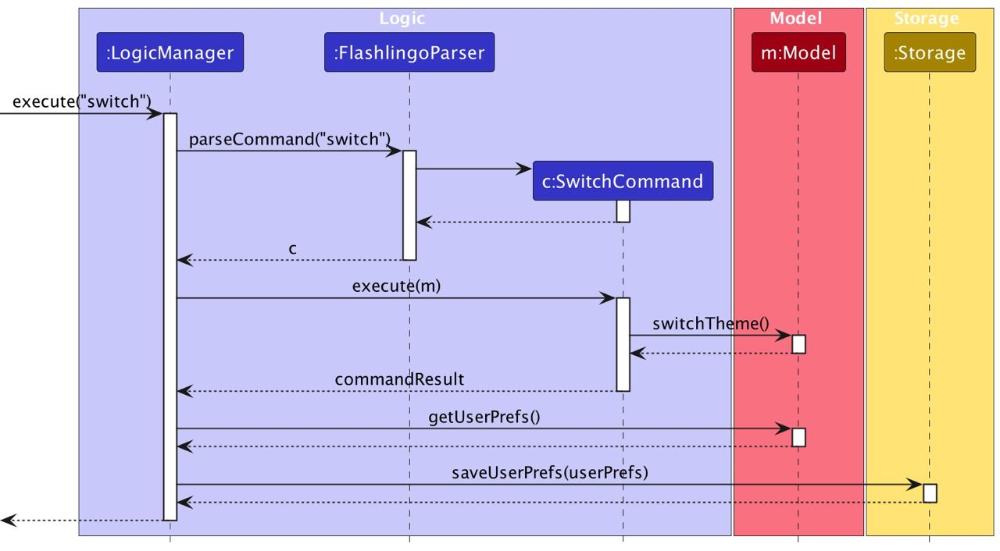
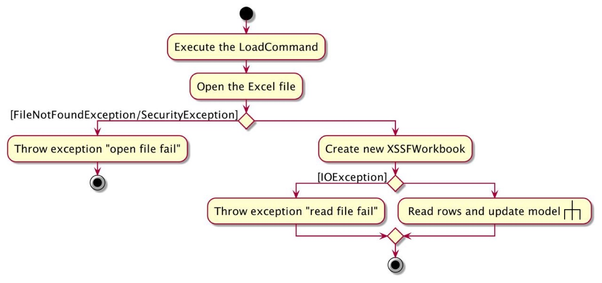
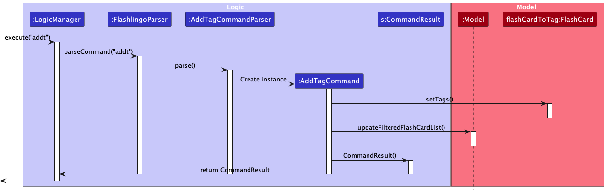

* Table of Contents
{:toc}

---

## **Acknowledgements**

This project is based on the AddressBook-Level3 project created by the [SE-EDU initiative](https://se-education.org).
Third-party Libraries used: [JavaFX](https://openjfx.io/), [Jackson](https://github.com/FasterXML/jackson), [JUnit5](https://github.com/junit-team/junit5), [Apache POI](https://poi.apache.org/)

--------------------------------------------------------------------------------------------------------------------

## **Setting up, getting started**

Refer to the guide [_Setting up and getting started_](SettingUp.md).

--------------------------------------------------------------------------------------------------------------------

## **Design**

:bulb: **Tip:** The `.puml` files used to create diagrams in this document `docs/diagrams` folder. Refer to the [_PlantUML Tutorial_ at se-edu/guides](https://se-education.org/guides/tutorials/plantUml.html) to learn how to create and edit diagrams.

### Architecture

The ***Architecture Diagram*** given above explains the high-level design of the App.

Given below is a quick overview of main components and how they interact with each other.

**Main components of the architecture**

**`Main`** (consisting of classes [`Main.java`](https://github.com/AY2324S1-CS2103T-T11-4/tp/blob/master/src/main/java/seedu/flashlingo/Main.java) and [`MainApp.java`](https://github.com/AY2324S1-CS2103T-T11-4/tp/blob/master/src/main/java/seedu/flashlingo/MainApp.java)) is in charge of the app launch and shut down.
* At app launch, it initializes the other components in the correct sequence, and connects them up with each other.
* At shut down, it shuts down the other components and invokes cleanup methods where necessary.

The bulk of the app's work is done by the following four components:

* [**`UI`**](#ui-component): The UI of the App.
* [**`Logic`**](#logic-component): The command executor.
* [**`Model`**](#model-component): Holds the data of the App in memory.
* [**`Storage`**](#storage-component): Reads data from, and writes data to, the hard disk.

[**`Commons`**](#common-classes) represents a collection of classes used by multiple other components.

**How the architecture components interact with each other**

The *Sequence Diagram* below shows how the components interact with each other for the scenario where the user issues the command `delete 1`.

Each of the four main components (also shown in the diagram above),

* defines its *API* in an `interface` with the same name as the Component.
* implements its functionality using a concrete `{Component Name}Manager` class (which follows the corresponding API `interface` mentioned in the previous point.

For example, the `Logic` component defines its API in the `Logic.java` interface and implements its functionality using the `LogicManager.java` class which follows the `Logic` interface. Other components interact with a given component through its interface rather than the concrete class (reason: to prevent outside component's being coupled to the implementation of a component), as illustrated in the (partial) class diagram below.

The sections below give more details of each component.

### UI component

The **API** of this component is specified in [`Ui.java`](https://github.com/AY2324S1-CS2103T-T11-4/tp/blob/master/src/main/java/seedu/flashlingo/ui/Ui.java)

The UI consists of a `MainWindow` that is made up of parts e.g.`CommandBox`, `ResultDisplay`, `FlashCardListPanel`, `StatusBarFooter` etc. All these, including the `MainWindow`, inherit from the abstract `UiPart` class which captures the commonalities between classes that represent parts of the visible GUI.

The `UI` component uses the JavaFx UI framework. The layout of these UI parts are defined in matching `.fxml` files that are in the `src/main/resources/view` folder. For example, the layout of the [`MainWindow`](https://github.com/AY2324S1-CS2103T-T11-4/tp/blob/master/src/main/java/seedu/flashlingo/ui/MainWindow.java) is specified in [`MainWindow.fxml`](https://github.com/AY2324S1-CS2103T-T11-4/tp/blob/master/src/main/resources/view/MainWindow.fxml)

The `UI` component,

* executes user commands using the `Logic` component.
* listens for changes to `Model` data so that the UI can be updated with the modified data.
* keeps a reference to the `Logic` component, because the `UI` relies on the `Logic` to execute commands.
* depends on some classes in the `Model` component, as it displays `Flashcard` object residing in the `Model`.

### Logic component

**API** : [`Logic.java`](https://github.com/AY2324S1-CS2103T-T11-4/tp/blob/master/src/main/java/seedu/flashlingo/logic/Logic.java)

Here's a (partial) class diagram of the `Logic` component:

The sequence diagram below illustrates the interactions within the `Logic` component, taking `execute("delete 1")` API call as an example.

:information_source: **Note:** The lifeline for `DeleteCommandParser` should end at the destroy marker (X) but due to a limitation of PlantUML, the lifeline reaches the end of diagram.

How the `Logic` component works:

1. When `Logic` is called upon to execute a command, it is passed to an `FlashlingoParser` object which in turn creates a parser that matches the command (e.g., `DeleteCommandParser`) and uses it to parse the command.
1. This results in a `Command` object (more precisely, an object of one of its subclasses e.g., `DeleteCommand`) which is executed by the `LogicManager`.
1. The command can communicate with the `Model` when it is executed (e.g. to delete a FlashCard).
1. The result of the command execution is encapsulated as a `CommandResult` object which is returned back from `Logic`.

Here are the other classes in `Logic` (omitted from the class diagram above) that are used for parsing a user command:

How the parsing works:
* When called upon to parse a user command, the `FlashlingoParser` class creates an `XYZCommandParser` (`XYZ` is a placeholder for the specific command name e.g., `AddCommandParser`) which uses the other classes shown above to parse the user command and create a `XYZCommand` object (e.g., `AddCommand`) which the `FlashlingoParser` returns back as a `Command` object.
* All `XYZCommandParser` classes (e.g., `AddCommandParser`, `DeleteCommandParser`, ...) inherit from the `Parser` interface so that they can be treated similarly where possible e.g, during testing.

### Model component
**API** : [`Model.java`](docs/images/ModelClassDiagram.png)

The `Model` component,

* stores the flashlingo data i.e., all `FlashCard` objects (which are contained in a `UniqueFlashCardList` object).
* stores the currently 'selected' `FlashCard` objects (e.g., results of a search query) as a separate _filtered_ list which is exposed to outsiders as an unmodifiable `ObservableList<FlashCard>` that can be 'observed' e.g. the UI can be bound to this list so that the UI automatically updates when the data in the list change.
* stores a `UserPref` object that represents the user’s preferences. This is exposed to the outside as a `ReadOnlyUserPref` objects.
* does not depend on any of the other three components (as the `Model` represents data entities of the domain, they should make sense on their own without depending on other components)

### Storage component

**API** : [`Storage.java`](docs/images/StorageClassDiagram.png)

The `Storage` component,
* can save both flashlingo data and user preference data in JSON format, and read them back into corresponding objects.
* inherits from both `FlashlingoStorage` and `UserPrefStorage`, which means it can be treated as either one (if only the functionality of only one is needed).
* depends on some classes in the `Model` component (because the `Storage` component's job is to save/retrieve objects that belong to the `Model`)

### Common classes

Classes used by multiple components are in the `seedu.flashlingo.commons` package.

--------------------------------------------------------------------------------------------------------------------

## **Implementation**

This section describes some noteworthy details on how certain features are implemented.

### UI enhancement (Nathanael M. Tan)

#### Implementation

Display of flashcard details is split into two different classes of `FlashcardBox` and `FlashcardBoxNoButtons`
FlashcardBoxNoButtons is the default way to display the details of the flashcard.\
When `start` command is used, review session begins and FlashcardBox is then used to display the details.\
This is to prevent users from reviewing cards that they are not scheduled to review and erroneously cause changes to the flashcard.

Both `FlashcardBox` and `FlashcardBoxNoButtons` have a button at the right called that is called "Reveal" when the translation is not shown, and "Hide" when it is.\
This button will toggle the state of whether the translation is currently displayed.

`FlashcardBox` has an additional two buttons, the `Yes` button and the `No` button.\
The `Yes` button will invoke the yes command, just like if it were to be typed into the command line
Similarly, the `No` button will invoke the no command.

#### Design considerations:

**Aspect: How to invoke the command:**

* **Alternative 1 (current choice):** Pass MainWindow all the way into FlashcardBox. Use `executeCommand()` method to invoke the respective command
    * Pros:
        * High level of maintainability.
        * Outcome will be the same as if it were to be typed into the CLI.
        * Easy to change logic of the commands
    * Cons:
        * Have to pass MainWindow through multiple classes
        * Classes that do not need references to MainWindow are now forced to have them

* **Alternative 2:** Individual button can perform the `Yes` and `No` command by itself, without executing through a Command
    * Pros:
        * Don't have to keep reference to the MainWindow
    * Cons:
        * Low level of maintainability.
        * Changes made have to be replicated in different places.
        * May not behave the same way as a Command (eg. ResultDisplay does not show the log message)

* **Alternative 3:** Remove the `Yes` and `No` buttons.
    * Pros:
        * Easy to code
        * Only one way to invoke the command, reduce confusion
    * Cons:
        * Less convenient without the buttons, needing to type

### Sequence diagram when clicking the `Yes` and `No` buttons
#### Both diagrams are the same except for the inputs to the methods.
#### Refer to the [Yes Command diagram](#YesSequenceDiagram) for a more detailed insight into the Model

### Start and End Session

#### **Feature Overview**

The "Start and End Review Session" feature is designed for users to start or end a review session. It allows users to initiate and conclude dedicated language learning sessions where they focus on reviewing and practicing vocabulary words. Each session represents a focused period of language reviewing within the application.

#### **Implementation**

The implementation of the "Start and End Review Session" feature involves the introduction of a `SessionManager` component. The `SessionManager` tracks the following aspect of a review session:

- **isReviewSession:** Indicates whether the application in a review session or not.

In addition to that, `start` and `end` commands and their corresponding parsers are also implemented.

Given below is an example usage scenario and how the `start/end` mechanism behaves at each step.

**Step 1:** The user launches the application for the first time. The `SessionManager` is not yet initialized.

**Step 2:** The user executes the `start` command by interacting with the command line. This will make `FlashlingoParser` class to create its `SessionManager` instance.

  

 
**Note**: The `SessionManager` class adheres to the **Singleton pattern**, guaranteeing that only one instance of the class
can exist. This architectural choice provides a single point of access for managing review sessions and
maintaining the state of whether the session is a review session or not. With the Singleton pattern in place, you can be
confident that there is only one `SessionManager` instance, making it a centralized and controlled entity for session
management within the application.

**Step 3:** The user executes various commands within the action sequence, such as `yes` and `no`.

**Step 4:** The user chooses to end the review session by using `end` command. This action will alternate the boolean value
inside SessionManager class indicating current session is review session or not.

Below is the sequence diagram for the above scenario:

 

**User Control:**
- Users can initiate a new language learning session at any time and conclude their session when they have completed their vocabulary review.

**Privacy and Security:**
- The application should ensure the privacy and security of session data, particularly if it contains sensitive language learning content.

#### **Usage Example**

1. **Starting a Language Learning Session:** The user accesses the language learning module within the application and chooses to start a new language learning session.

2. **Vocabulary Review:** During the session, the user focuses on reviewing and practicing specific vocabulary words and phrases relevant to their language learning goals.

3. **Ending the Language Learning Session:** When the user is satisfied with their vocabulary review, they conclude the language learning session from the language learning module or settings.

#### **Design Considerations**

**Aspect: How `start/end` executes**
* Alternative 1 (current choice): Creating another separate class to manage the logic.
    * Pros: It better adheres to OOP principle and easier to maintain.
    * Cons: It may potentially increase the complexity of codes.

* Alternative 2: Introducing a boolean attribute inside `FlashlingoParser` class.
    * Pros: Easy to implement.
    * Cons: It doesn't conform to the principle of **Single Responsibility Principle**.

**Aspect: Preventing Using A Set of Commands Within a Review Session**

* Alternative 1 (Current Choice): Restricting Users with a Subset of Commands

    * Pros:
        - Increased safety: A limited set of commands reduces the risk of unintended actions, making the review session safer for users.

    * Cons:
        - Limited flexibility: Users may feel constrained if they need to perform specific actions that are not allowed within the review session.
        - Potential user frustration: Restricting commands may lead to user frustration if they can't perform certain actions they expected to be available.

* Alternative 2: Giving Users Full Flexibility to Execute All Commands

    * Pros:
        - Complete control: Users have the freedom to use any command, providing them with full flexibility and control over their learning experience.
        - No perceived limitations: Users are less likely to encounter restrictions or frustrations, making the experience more intuitive.

    * Cons:
        - More error-prone: Allowing all commands may lead to unexpected bugs during a review session.

### Yes and No

#### **Feature Overview**

The "Yes" and "No" commands feature has been created with the intention of enabling users to provide feedback during the review session. It empowers users to share their opinions regarding whether they have successfully committed the words to memory or not. Following the receipt of this feedback, the application will adjust the proficiency level of the specific word in question. The greater the number of times a user memorizes a word, the higher its proficiency level will rise, and subsequently, the longer the user will have before revisiting that particular word during future review sessions.

*Usage*

Both commands can be executed with the following command words:

- For indicating successful memorization: `yes`
- For indicating unsuccessful memorization: `no`

#### **Code Structure**

The YesCommand and NoCommand classes consist of important methods:

- `execute(Model model)`: This method is responsible for executing the command. It updates the model and retrieves the next review word. It returns a `CommandResult` with the success message and, if applicable, the response from the model.

#### **Implementation**

The implementation of the "Yes" and "No" commands invoke the `updateLevel` method of `FlashCard` and `hasNextRound` method of `Model`.

- **updateLevel:** updates the proficiency level of the current word and determines the next review date for the word based on the updated proficiency level.
- **hasNextRound:** determines whether there are more words to review.

The application recognizes a word as memorized if the user inputs either 'yes' or 'no.'

It's important to note that the 'yes' and 'no' commands are only functional once the review session has commenced.

Given below is an example usage scenario and how the yes/no mechanism behaves at each step.

**Step 1:** The user initiates the review session, and a single word appears on the screen without its translation.

**Step 2:** The user recalls the translation from memory and compares it with the provided translation.

**Step 3:** The user responds with either 'yes' or 'no' to indicate whether the recalled translation matches the recorded one.

**Step 4:** If 'yes' is chosen, the `updateLevel` method within the `FlashCard` class is invoked with the 'true' parameter; if 'no' is chosen, it is invoked with 'false'.

**Step 5:** Inside the `updateLevel` method, the proficiency level of the flash card is updated, and the next review date for the word is determined based on the updated proficiency level.

**Step 6:** The `hasNextRound` method within the `Model` class is invoked to determine whether there are more words to review.

**Step 7:** If there are more words to review, the next word is retrieved from the model and displayed on the screen. If there are no more words to review, the review session is concluded.

**Step 8:** The user repeats steps 2-7 until the review session is concluded.

The following sequence diagram summarizes the workflow when a user executes a `yes` command:

**User Control:**
- User can update the proficiency level of every individual word and also the revisited date, which allows the user to learn in a more targeted manner

The following activity diagram summarizes what happens when a user executes a `yes` command:

#### **Usage Example**
To use the YesCommand, simply type yes during a review session. For example:

- `yes`
- `no`

#### **Design Considerations**

**Aspect: How to make our programs more interactive**
* Alternative 1 (current choice): Let the user judge whether he has remembered the word.
    * Pros: Get real-time feedback from users and adjust the proficiency of each word.
    * Cons: Users may trick the program to achieve higher accuracy.

* Alternative 2: Let the user enter the translation he recalls and the program compares it with the recorded translation.
    * Pros: Get real reactions from users.
    * Cons: It is difficult for the program to determine whether the meaning expressed by the two translations is consistent

### Light and Dark Mode

#### Implementation

The preference for light and dark themes is stored in the `UserPrefs` class. The `UserPrefs` is initialized by interacting
with `UserPrefsStorage` when the application is launched. Then `UI` component will obtain the preference from `Logic`
component and set the initial theme. After a `SwitchCommand` is executed by the `LogicManager`, `Model` component will
update the theme in  `UserPrefs`. Finally, `UI` component will update the theme accordingly.

**Step 1: Theme initialization**
 
Similar to GUI settings, the theme is regarded as a component of user preference stored in `UserPrefs` and in Json
file `preferences.json`.

The initial theme setting works as follows: After constructing the `ModelManager` and `LogicManager` with the
loaded `UserPrefs`, `MainWindow` will obtain theme preference from `LogicManager` and set the initial theme. If no data
can be read from the preference file, the _Default_ theme will be used by `Logic` and `Model` components, and set by
`UI`.

**Step 2: Theme switching**
 
The following sequence diagram shows how the theme switching works. For the discussion purpose, parsing of the command
and `Storage#saveFlashlingo(ReadOnlyFlashlingo)` are omitted:

#### Design Considerations

**Aspect: How to update UI changes after command execution**
* **Alternative 1 (current choice): Use `Logic` component to update `Model` and `Storage`.** Add a boolean field `switchTheme`
  in `CommandResult`, informing `UI` to update similarly to what we did in _help_ and _exit_ commands.
    * Pros: Follows the separation of concerns principle. Each component is responsible for its own work and addresses
      separate concerns, achieving higher cohesion and lower coupling.
    * Cons: 
      * The abstraction and division for different components may be complicated and hard to understand. 
      * Additional field needed in `CommandResult` class.

* **Alternative 2: Let `UI` component update the theme directly after receiving the command.**
    * Pros: More direct implementation design.
    * Cons: 
      * Needs to include more information returned from the execution of command. 
      * A potential gap between current storage and UI theme setting would occur since `UI` wouldn't rely on `Logic` component to update the theme.

### Load data from Excel file

#### Implementation
The general flow of the `load` command is similar to most other commands, as `model` executes the command to create and add the flash cards, and also update `storage`. Then the `CommandResult` returned will be reflected in `ui`.  
Due to the complexity of inputs in Excel file, it's crucial to ensure the success of reading the Excel file, actively communicating with `storage` and handling different types of errors.

**Highlight 1: Transferring Excel input to `FlashCard` object**

* The third-party library _**Apache POI OOXML**_ is utilized to read the workbook, sheet to cells in the file. Since Excel is hierarchically composed of smaller elements such as cell, row and column to bigger ones like sheet, workbook, it's necessary to first understand this structure and foresee issues with each layer thoroughly.  
* `DataFormatter` is used to transfer value in the cell to `String`, which avoids issues caused by numerical input read from Excel.
* Help function `trimAndVerifyWords` ensures the correctness of every word/translation. Once it detects invalid input, it throws `CommandException` and ends the loading immediately, with no further time and resources wasted.

**Highlight 2: Classifying different types of errors**

The activity diagram below illustrates the flow after calling the `LoadCommand#execute(Model)`. **Four** different error messages can be output after execution.

**Highlight 3: handling duplicate cards within the file/with the app**
1. The method `addFlashCardsToModel` takes in the temporarily built flash cards list and the `model` to check if duplicate cards exist in the temporary list.
2. After passing the check, `Model#addFlashCards(ArrayList<FlashCard>)` double checks every input card and ensures it is not the same with existing cards in `model` before adding, otherwise the repeated card will be ignored.

#### Design Considerations
**Aspect: Accepted file type for loading the data**
* **Alternative 1 (current choice): Use Excel as the input file type.**
    * Pros: 
      * The cell-based structure of Excel fits with our word and translation structure of the flash cards, thus it's the most convenient way for users to create and edit data. 
      * It's a common file type that is familiar to most users.
    * Cons: Need to use external library to read and handle Excel file.
* **Alternative 2: Use JSON as the input file type.**
    * Pros: Similar data loading exists in current project, thus easy to implement.
    * Cons: 
      * Users need to follow the specific format to create and edit Json that may not be familiar to them. This process can be error-prone. 
      * The feature is redundant since advanced users can achieve the same thing by manually adding flash cards to `flashlingo.json`.
* **Alternative 3: Use TXT, Word or other file type.**
    * Pros: Introduces a new way for users who prefer using text file.
    * Cons: Need to use external library to read and handle the unformatted, more complicated input.

**Aspect: How to handle duplicate flash cards**  

There are two situations that need to be considered: duplicate flash cards **within the file** and **with the card existing in the app**.
* **Alternative 1 (current choice): Check together and "ignore".** Check all loaded flash cards to ensure no duplicate with existing cards in `model`, then check their occurrence in `model` again when adding them one by one. **By ignoring the repeated ones, duplicate cards within the file can be handled.**
    * Pros: 
      * Consistent with the role of `Model` and `Logic`.
      * Existing checker `Model#hasFlashCard(FlashCard)` can be reused.
    * Cons: Complexity of flow and logic increases.
* **Alternative 2: Check the two situations separately.**
  * Pros: Simpler logic and implementation effort required.
  * Cons: Heavier time and space usage.

--------------------------------------------------------------------------------------------------------------------

## **Documentation, logging, testing, configuration, dev-ops**

* [Documentation guide](Documentation.md)
* [Testing guide](Testing.md)
* [Logging guide](Logging.md)
* [Configuration guide](Configuration.md)
* [DevOps guide](DevOps.md)

--------------------------------------------------------------------------------------------------------------------

## **Appendix: Requirements**

### Product scope

**Target user profile**:

* language learners, focus on beginner language learners
* need to manage a significant number of vocabularies
* need to learn and remember words by flash cards
* need to review learned vocabularies by scheduled plans
* prefer desktop apps over other types
* can type fast
* prefers typing to mouse interactions
* is reasonably comfortable using CLI apps

**Value proposition**:

Our product empowers users to efficiently manage their vocabulary through flash cards and seamlessly review the words in review sessions. With Flashlingo, language learners can master new words scientifically while staying in control of their customized language learning journey.

### User stories

Priorities: High (must have) - `* * *`, Medium (nice to have) - `* *`, Low (unlikely to have) - `*`

| Priority | As a …​                                    | I want to …​                     | So that I can…​                                                        |
| -------- | ------------------------------------------ | ------------------------------ | ---------------------------------------------------------------------- |
| `* * *` | language learner | add new flashcards |  |
| `* * *` | language learner | delete a flashcard |  |
| `* * *` | language learner | list all my flashcards | see what words are currently saved |
| `* * *` | language learner | save my list of flashcards | keep my progress of my words and the flashcards without having to re-input |
| `* * *` | language learner | load my flashcards | continue my progress from my last save point |
| `* * *` | language learner | flip over a flashcard | reveal the translated word to remember |
| `* * *` | forgetful language learner | be shown the flashcards to see | go through the required flashcards without needing to keep track of what needs to be read |
| `* *`   | not tech saavy language learner | be directed to the help page easily | use the application correctly |
| `* *`   | langauge learner | see my success rate for each flashcard | see what words are challenging |
| `*`     | multi language learner | categorise flashcards by language | study each language individually |
| `*`     | lazy language learner | get translations for the original word | add words in easily without manually searching for the translation |

### Use cases

**System:** Flashlingo\
**Use case:** UC1 - Help\
**Actor:** User\
**MSS:**

1.	User requests help by either entering the help command in the command box or clicking the Help Button on the Flashlingo interface.
2.	Flashlingo opens the default web browser and navigates to the User Guide page.

Use case ends.

**System:** Flashlingo\
**Use case:** UC2 – Add a word\
**Actor:** User\
**MSS:**
1.	User chooses to add a word and its translation by keying in command.
2.	Flashlingo adds the word and its translation.\
      Use case ends.

**Extensions:**\
1a. User adds word and translation and specifies the language of the original word and translation.\
1a1. Flashlingo adds the word and its translation as well as the language of both.\
Use case ends.

**System:** Flashlingo\
**Use case:** UC3 – Delete a word\
**Actor:** User\
**MSS:**
1.	User chooses to delete a word by keying in command
2.	Flashlingo deletes the word and its translation.\
      Use case ends.

**System:** Flashlingo\
**Use case:** UC4 – Display list of flashcards\
**Actor:** User\
**MSS:**
1.	User chooses to display the list of flashcards.
2.	Flashlingo displays list of cards with words and corresponding translations.\
      Use case ends.

**System:** Flashlingo\
**Use case:** UC5 – Start today’s flashcard sequence\
**Actor:** User\
**MSS:**
1.	User chooses to start.
2.	Flashlingo displays the words user is going to study.\
      Use case ends.

**System:** Flashlingo\
**Use case:** UC6 – Display translation on the other side of flashcard\
**Actor:** User\
**MSS:**
1.	User chooses to flip the flashcard
2.	Flashlingo shows meaning of the word.\
      Use case ends.

**System:** Flashlingo\
**Use case:** UC7 – Indicate user has remembered word\
**Actor:** User\
**MSS:**
1.	User confirms remembrance of the word.
2. Flashlingo increments level of the flashcard.
3. Flashlingo displays congratulatory message.\
   Use case ends.

**Extensions:**\
2a. Flashlingo detects that level of flashcard exceeds threshold\
2a1. Flashlingo deletes the flashcard.\
Use case resumes from step 3.

**System:** Flashlingo\
**Use case:** UC8 – Indicate user has forgotten word\
**Actor:** User\
**MSS:**
1.	User indicates they couldn’t remember word.
2. Flashlingo decements level of flashcard.
3. Flashlingo displays motivational message to keep up.\
   Use case ends.

**Extensions:**\
2a. Flashlingo detects that level of flashcard is at base level of 1\
2a1. Flashlingo does not decrement any further, leaving level at 1.\
Use case resumes from step 3.

**System:** Flashlingo\
**Use case:** UC9 – Stop session\
**Actor:** User\
**MSS:**
1.	User chooses to stop session.
2.	Flashlingo stops and displays the completion message.\
      Use case ends.

**System:** Flashlingo\
**Use case:** UC10 – Exit the platform\
**Actor:** User\
**MSS:**
1.	User chooses to exit
2.	Flashlingo closes GUI and terminates.\
      Use case ends.

**System:** Flashlingo\
**Use case:** UC11 – Change data source\
**Actor:** User\
**MSS:**
1.	User chooses to change data source by adding new file-path.
2.	Flashlingo changes data source and displays success message.\
      Use case ends.

**System:** Flashlingo\
**Use case:** UC12 – Load data source\
**Actor:** user\
**MSS:**
1.	User chooses to load a data source at input file-path.
2.	Flashlingo loads data source and displays success or failure message.\
      Use case ends.

### Non-Functional Requirements

1.  **Environment** - Should work on any _mainstream OS_ as long as it has Java `11` installed.
2.  **Environment** - Should be able to store 300 flash cards with less than 30MB storage.
3.  **Performance** - A user with above average typing speed for regular English text (i.e. not code, not system admin commands) should be able to accomplish most of the tasks faster using commands than using the mouse.
4.  **Performance** - Should be able to handle most of the user input within 2 seconds.
5.  **Quality** - Should be able to update already memorized words accordingly and maintain the left ones when a learning session accidentally closes.
6.  **Quality** - Should be able to provide the learner with a reasonable time schedule for language learning.
7.  **Quality** - Should be able to handle any user input correctly without crashing.
8.  **Capacity** - Should be able to hold up to 100 flash cards without a noticeable sluggishness (longer than 2 seconds) in performance for typical usage.

### Glossary

* **Mainstream OS**: Windows, Linux, Unix, macOS
* **Proficiency level**: A number that indicates how well a user knows a word. The higher the number, the better the user knows the word.
* **Flashcard**: A virtual card with a word on one side and its translation on the other side
* **Word**: A word in the language you want to learn
* **Translation**: The word in your native language that corresponds to the word you want to learn
* **Review Session**: A review session is a designated phase within the system where words requiring review are presented individually. Users can confirm their understanding or signal a need for further review.

--------------------------------------------------------------------------------------------------------------------

## **Appendix: Planned Enhancement**

### Enhancement 1: Improving UI

**Feature Flaw**

* Users are not able to see the words clearly as the current font size is too small.
* It is tedious for users to scroll down or right to view the whole error message or tip as the current output font size is too big.
* Users now are not able to check the translation language unless they enter the `reveal` command. This is not user-friendly as users may want to know the translation language before revealing the translation.

**Proposed Enhancement**
* Increasing the font size of the words and translations in the flash cards.
* Decreasing the font size of the output messages.
* Adding language tag under the `level` tag on each flash card. This will allow users to distinguish different languages of the translations before calling the `reveal` command.

**Sample UI**

| Flash Card         |            |
|--------------------|----------------------------------------------| 
| **Output Display** |  |

### Enhancement 2: Improving the content of output messages

**Feature Flaw**

Some of our current output messages are not formatted properly. For example, the message entering the `reveal` command is "Flashcard has been revealed!" followed directly by the translation. Users may be confused to distinguish the message and the translation.

**Proposed Enhancement**
* Formatting the messages to be more clear and consistent with User Guide.
* Specifying output messages to be more detailed and grammatically correct.

**Sample Output**

| Current Output Message               | After Enhancement         |
|--------------------------------------|---------------------------|
|    | Parameters: <KEYWORDS...>              |
|  | ...1 flashcard(s) listed! |

### Enhancement 3: Adding frequency of usage tags

**Feature Flaw**

Currently, our application does not include functionality for categorizing flashcards with tags, such as 'Essentials', 'Uncommon', 'Rare', and 'Slang'. This omission can lead to a less structured learning experience, as users are unable to sort or prioritize flashcards based on the frequency and context of word usage. Without this feature, users might find it challenging to focus their study on the most pertinent words, potentially impacting the efficiency and effectiveness of language learning.

**Proposed Enhancement**
* Introduce a flexible tagging system allowing users to add tags to flashcards.
* These tags could include categories like 'Essentials', 'Uncommon', 'Rare', and 'Slang'.

*Usage*

Tags can be added or modified using the following commands:

* To add a tag: `addt`
* To edit a tag: `editTag`
* To delete a tag: `delTag`

**Implementation:**

The `AddTagCommand`, `EditTagCommand`, and `DeleteTagCommand` will operate under a similar framework, ensuring a consistent user experience across different tag-related functionalities. While each command serves a distinct purpose—adding, modifying, or removing tags—their underlying mechanisms share a common structure.

The `AddTag` command will invoke the `setTags()` of `FlashCard`
* **setTags:** Adds the passed tags to the current FlashCard's set of Tags

The `EditTag` command will invoke the `replaceTags()` method of `FlashCard`
* **replaceTag:** Replaces a specified Tag from this FlashCard's Set of Tags with a new Tag

The `DeleteTag` command will invoke the `deletetTags()` method of `FlashCard`
* **deleteTag:** Deletes the specified Tag from this FlashCard's Set of Tags

All the Tag Commands will also invoke the `updateFilteredFlashCardList()` of `Model`
* **updateFilteredFlashCardList:** Updates the list of FlashCards currently being displayed to the user

The process of adding tags to a flashcard through the AddTagCommand would be as follows:

**Step 1**: The user identifies the flashcard to be tagged by its index in the list.

**Step 2**: The user specifies the tag(s) to be added to this flashcard. This is done by using the command `addt` followed by the `INDEX` and the `TAG` parameter.

**Step 3**: Upon executing the command, the application retrieves the flashcard from the list based on the provided index.

**Step 4**: The specified tags are added to the flashcard. If any tag already exists, it will not be duplicated.

**Step 5**: The application updates its internal model to reflect these changes. This includes updating the list of flashcards to ensure the newly tagged flashcard is accurately represented in the user interface.

**Step 6**: The user receives a confirmation message indicating the successful addition of tags to the flashcard.

The following sequence diagram summarizes the workflow when a user executes a `AddTag` command:

A similar structure is followed for the `EditTagCommand` and `DeleteTagCommand`, but with the respective methods (`replaceTags` and `deleteTags`)

**Usage Examples**
The Tag commands can be used in the following ways:
- `addt 2 tg/Essentials` - Adds the 'Essentials' tag to the flashcard at index 2.
- `editTag 2 ot/Rare rt/Uncommon` - Changes the 'Rare' tag to 'Uncommon' on the flashcard at index 2.
- `delTag 3 tg/Essentials` - Deletes the 'Essentials' tag from the flashcard at index 3.

#### Design Considerations

**Aspect: What is the most effective method of tagging Flashcards:**
In enhancing the functionality of our flashcard system, we considered how users could tag flashcards to optimize their learning experience.

* Alternative 1 (current choice): Choosing from a predefined set of tags.

   * Pros:
      * Ensures consistency and standardization across the tagging system.
      * Simplifies the user interface and user experience, as users can quickly select from a limited set of options.
      * Facilitates easier implementation and maintenance from a programming perspective.
   * Cons:
      * Limits user flexibility and creativity, as they can only use the tags provided.
      * May not cover all possible categories or nuances that users might need for their individual learning paths.
* Alternative 2: Allowing users to create custom tags.

   * Pros:
      * Provides users with complete flexibility to create tags that precisely fit their learning needs and styles.
      * Encourages users to engage more deeply with the material by thinking critically about how to categorize it.
  * Cons:
      * Can lead to a lack of standardization, making it harder to implement features that rely on consistent tagging.
      * Potentially complicates the user interface and increases the learning curve for new users.
        
**Aspect: How should the tagging system handle multiple tags per flashcard:**

* Alternative 1 (current choice): Allow Multiple Tags per Flashcard

   * Pros:
      * Enables more comprehensive categorization of flashcards.
      * Offers greater flexibility for users to organize their study materials according to diverse criteria.
   * Cons:
      * Increases the complexity of the user interface and the backend logic.
      * May lead to clutter or confusion if not managed effectively by the user.
* Alternative 2: Limit Each Flashcard to a Single Tag

   * Pros:
      * Simplifies the interface and makes the system straightforward to use.
      * Easier to implement and manage from a programming perspective.
   * Cons:
      * Reduces the depth of categorization, potentially leading to an overly simplifyied representation of complex language ideas.
      * Limits the ability to cross-reference flashcards under multiple relevant categories.

### Enhancement 4: Visualization Upgrade for 'Stats' Command
 **Feature Flaw:**
   * Currently, the success rate in the 'stats' command is presented as a mere percentage, which might not be the most engaging or insightful way for users to visualize their learning progress.
   * Users lack a graphical representation of their learning statistics, which can provide a more immediate and comprehensive understanding of their performance.

**Proposed Enhancement:**
   * Enhance the 'stats' command by including a pie chart along with the percentage. This pie chart will visually represent the proportion of words remembered versus words not remembered.
   * The pie chart will offer a clearer, more immediate visual representation of the user's success rate, making it easier to grasp their learning progress at a glance.

**Sample Output:**
|Before the update |  |
|:-----------------|-------------------:|
|**After the update**|  |

### Enhancement 5: Providing more error messages when failing to load the data file

**Feature Flaw**

For advanced users who manually edit the data, they may accidentally introduce invalid data into the file. However, they are not able to know the reason why the data file is valid and that all the data will be discarded when the app starts to process any commands.

**Proposed Enhancement**
* Changing the behavior of `MainApp#initModelManager`, when `DataLoadingException` is thrown, call the `ui` to display the error message and prohibit `model` from executing any commands.
* Providing more error messages when failing to load the data file.

**Sample Output**

* `Duplicated flash card ... found in flashlingo.json`: Duplicate combination of word and translation is found in the data file.
* `Invalid flash card ... with invalid ... found in flashlingo.json`: Flash card with invalid word/translation, level or review date found.

### Enhancement 6: Renaming `reveal` command to reduce ambiguity

**Feature Flaw**
Currently, the `reveal` command is used to reveal or hide the translation of the flash card. However, it may be ambiguous to users as they may think that the command is used to reveal the word itself.

**Proposed Enhancement**
Renaming the `reveal` command to `flip` to reduce ambiguity.

--------------------------------------------------------------------------------------------------------------------

## **Appendix: Instructions for manual testing**

Given below are instructions to test the app manually.

:information_source: **Note:** These instructions only provide a starting point for testers to work on;
testers are expected to do more *exploratory* testing.

### Launch and shutdown

1. Initial launch

    1. Download the jar file and copy into an empty folder

    2. Double-click the jar file 
       Expected: Shows the GUI with a set of sample contacts. The window size may not be optimum.

2. Saving window preferences

    1. Resize the window to an optimum size. Move the window to a different location. Close the window.

    2. Re-launch the app by double-clicking the jar file. 
       Expected: The most recent window size and location is retained.

3. Adding/deleting a flash card

    1. Try out the `add` command in the command box. 
         Expected: A new flash card is added to the flash card list.
    2. Apply `delete 1` command in the command box. 
         Expected: The flash card added in the previous step is successfully deleted.
