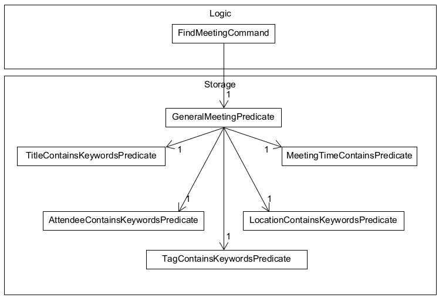
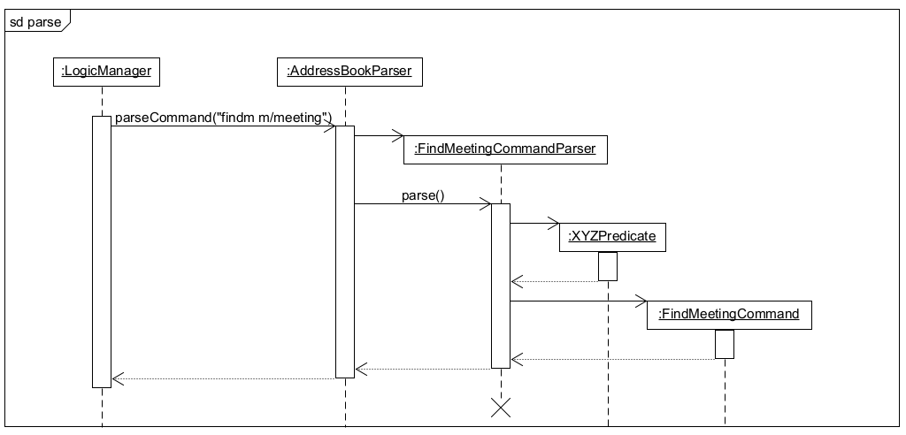

## Table of Contents

- [Acknowledgements](#acknowledgements)
- [Setting up, getting started](#setting-up-getting-started)
- [Design](#design)
  - [Architecture](#architecture)
  - [UI component](#ui-component)
  - [Logic component](#logic-component)
  - [Model component](#model-component)
  - [Storage component](#storage-component)
  - [Common classes](#common-classes)
- [Implementation](#implementation)
  - [Edit Contacts and Meetings feature](#edit-contacts-and-meetings-feature)
  - [View Contacts and Meetings feature](#view-contacts-and-meetings-feature)
  - [Find meeting feature](#find-meeting-feature)
  - [Add attendee feature](#add-attendee-feature)
  - [Remove attendee feature](#remove-attendee-feature)
  - [Keeping track of last meeting with contact](#keeping-track-of-last-meeting-with-contact)
- [Planned Enhancements](#planned-enhancements)
  - [\[Proposed\] Undo/redo feature](#proposed-undo-and-redo-feature)
  - [\[Feature Flaw\] View Commands](#feature-flaw-view-commands)
- [Documentation, logging, testing, configuration, dev-ops](#documentation-logging-testing-configuration-dev-ops)
- [Appendix: Requirements](#appendix-requirements)
  - [Product scope](#product-scope)
  - [User stories](#user-stories)
  - [Use case](#use-case)
  - [Non-Functional Requirements](#non-functional-requirements)
  - [Glossary](#glossary)
- [Appendix: Instructions for manual testing](#appendix-instructions-for-manual-testing)
  - [Launch and shutdown](#launch-and-shutdown) 
  - [Adding a person](#adding-a-person)
  - [Editing a person](#editing-a-person)
  - [Deleting a person](#deleting-a-person)
  - [View Contact](#view-contact)
  - [Meeting Tests](#meeting-tests)
  - [Meeting Attendees](#meeting-attendees)
  - [Mark Meetings](#mark-meetings)
  - [Saving data](#saving-data)

---

## **Acknowledgements**

- This project has reused and adopted the structure of AB3.

- Libraries used: [JavaFX](https://openjfx.io/), [Jackson](https://github.com/FasterXML/jackson), [JUnit5](https://github.com/junit-team/junit5)

---

## **Setting up, getting started**

Refer to the guide [_Setting up and getting started_](SettingUp.md).

---

## **Design**

:bulb: **Tip:** The `.puml` & `.uxf` files used to create diagrams in this document `docs/diagrams` folder. Refer to the [_PlantUML Tutorial_ at se-edu/guides (for `.puml`)](https://se-education.org/guides/tutorials/plantUml.html) or [_UMLet_ (for `.uxf`)](https://www.umlet.com) to learn how to create and edit diagrams.

### Architecture

The **_Architecture Diagram_** given above explains the high-level design of the App.

Given below is a quick overview of main components and how they interact with each other.

**Main components of the architecture**

**`Main`** (consisting of classes [`Main`](https://github.com/se-edu/addressbook-level3/tree/master/src/main/java/seedu/address/Main.java) and [`MainApp`](https://github.com/se-edu/addressbook-level3/tree/master/src/main/java/seedu/address/MainApp.java)) is in charge of the app launch and shut down.

- At app launch, it initializes the other components in the correct sequence, and connects them up with each other.
- At shut down, it shuts down the other components and invokes cleanup methods where necessary.

The bulk of the app's work is done by the following four components:

- [**`UI`**](#ui-component): The UI of the App.
- [**`Logic`**](#logic-component): The command executor.
- [**`Model`**](#model-component): Holds the data of the App in memory.
- [**`Storage`**](#storage-component): Reads data from, and writes data to, the hard disk.

[**`Commons`**](#common-classes) represents a collection of classes used by multiple other components.

**How the architecture components interact with each other**

The _Sequence Diagram_ below shows how the components interact with each other for the scenario where the user issues the command `delete 1`.

Each of the four main components (also shown in the diagram above),

- defines its _API_ in an `interface` with the same name as the Component.
- implements its functionality using a concrete `{Component Name}Manager` class (which follows the corresponding API `interface` mentioned in the previous point).

For example, the `Logic` component defines its API in the `Logic.java` interface and implements its functionality using the `LogicManager.java` class which follows the `Logic` interface. Other components interact with a given component through its interface rather than the concrete class (reason: to prevent outside component's being coupled to the implementation of a component), as illustrated in the (partial) class diagram below.

The sections below give more details of each component.

### UI component

The **API** of this component is specified in [`Ui.java`](https://github.com/se-edu/addressbook-level3/tree/master/src/main/java/seedu/address/ui/Ui.java)

The UI consists of a `MainWindow` that is made up of parts e.g.`CommandBox`, `ResultDisplay`, `PersonListPanel`, `StatusBarFooter` etc. All these, including the `MainWindow`, inherit from the abstract `UiPart` class which captures the commonalities between classes that represent parts of the visible GUI.

The `UI` component uses the JavaFx UI framework. The layout of these UI parts are defined in matching `.fxml` files that are in the `src/main/resources/view` folder. For example, the layout of the [`MainWindow`](https://github.com/se-edu/addressbook-level3/tree/master/src/main/java/seedu/address/ui/MainWindow.java) is specified in [`MainWindow.fxml`](https://github.com/se-edu/addressbook-level3/tree/master/src/main/resources/view/MainWindow.fxml)

The `UI` component,

- executes user commands using the `Logic` component.
- listens for changes to `Model` data so that the UI can be updated with the modified data.
- keeps a reference to the `Logic` component, because the `UI` relies on the `Logic` to execute commands.
- depends on some classes in the `Model` component, as it displays `Person` object residing in the `Model`.

### Logic component

**API** : [`Logic.java`](https://github.com/se-edu/addressbook-level3/tree/master/src/main/java/seedu/address/logic/Logic.java)

Here's a (partial) class diagram of the `Logic` component:

The sequence diagram below illustrates the interactions within the `Logic` component, taking `execute("delete 1")` API call as an example.

:information_source: **Note:** The lifeline for `DeleteCommandParser` should end at the destroy marker (X) but due to a limitation of PlantUML, the lifeline reaches the end of diagram.

How the `Logic` component works:

1. When `Logic` is called upon to execute a command, it is passed to an `AddressBookParser` object which in turn creates a parser that matches the command (e.g., `DeleteCommandParser`) and uses it to parse the command.
2. This results in a `Command` object (more precisely, an object of one of its subclasses e.g., `DeleteCommand`) which is executed by the `LogicManager`.
3. The command can communicate with the `Model` when it is executed (e.g. to delete a person).
4. The result of the command execution is encapsulated as a `CommandResult` object which is returned back from `Logic`.

Here are the other classes in `Logic` (omitted from the class diagram above) that are used for parsing a user command:

How the parsing works:

- When called upon to parse a user command, the `AddressBookParser` class creates an `XYZCommandParser` (`XYZ` is a placeholder for the specific command name e.g., `AddCommandParser`) which uses the other classes shown above to parse the user command and create a `XYZCommand` object (e.g., `AddCommand`) which the `AddressBookParser` returns back as a `Command` object.
- All `XYZCommandParser` classes (e.g., `AddCommandParser`, `DeleteCommandParser`, ...) inherit from the `Parser` interface so that they can be treated similarly where possible e.g, during testing.

### Model component

**API** : [`Model.java`](https://github.com/AY2324S1-CS2103T-F12-4/tp/blob/master/src/main/java/seedu/address/model/Model.java)

The `Model` component,

- stores the address book data i.e., all `Person` and `Meeting` objects (which are contained in a `UniquePersonList` and `UniqueMeetingList` object).
- stores the currently 'selected' `Person` and `Meeting` objects (e.g., results of a search query) as a separate _filtered_ list which is exposed to outsiders as an unmodifiable `ObservableList<Person>` and `ObservableList<Meeting>` that can be 'observed' e.g. the UI can be bound to this list so that the UI automatically updates when the data in the list change.
- stores a `UserPref` object that represents the user’s preferences. This is exposed to the outside as a `ReadOnlyUserPref` objects.
- does not depend on any of the other three components (as the `Model` represents data entities of the domain, they should make sense on their own without depending on other components)
- The Tag is a factory class that keeps its own HashMap of the Tags it has created before, thus it ensures that every Tag is unique and can be referenced by all Person and Meetings.

### Storage component

**API** : [`Storage.java`](https://github.com/AY2324S1-CS2103T-F12-4/tp/blob/master/src/main/java/seedu/address/storage/Storage.java)

The `Storage` component,

- can save both address book data and user preference data in JSON format, and read them back into corresponding objects.
- inherits from both `AddressBookStorage` and `UserPrefStorage`, which means it can be treated as either one (if only the functionality of only one is needed).
- depends on some classes in the `Model` component (because the `Storage` component's job is to save/retrieve objects that belong to the `Model`)

### Common classes

Classes used by multiple components are in the `seedu.addressbook.commons` package.

---

## **Implementation**

This section describes some noteworthy details on how certain features are implemented.

### Edit Contacts and Meetings feature

Both the edit contact command `editc` and edit meeting command `editm` are implemented quite similarly due to the similarities between the `Person` and `Meeting` classes.

This section shall therefore only go in deep detail for the implementation of the `editm` command. However, the `editc` equivalent of certain commands used by `editm` will be detailed, such that the implementation of `editc` can be fully derived.

The class diagrams for both edit commands differ from the other commands in that an additional `EditMeetingDescriptor` or `EditPersonDescriptor` class is used to create the commands. The diagram for `editm` is as seen below.

To start off, both `editc` and `editm` take in an index as their first argument, which refers to a `Person` in the displayed person list, or a `Meeting` in the displayed meeting list respectively.

Next, both commands take in a variable number of optional arguments based on the arguments used by the `addc` and `addm` commands. This allows the user to input only the fields they wish to edit in the chosen `Person` or `Meeting` object, as opposed to having to type in every field.

Using `editm 3 m/Friend meetup a/Mall` as an example, when input by the user, an instance of an `EditMeetingCommand` (`EditCommand` in the case of `editc` with its respective `Person` fields as arguments) is created as shown in the following Sequence Diagram.

As seen above, before the `EditMeetingCommandParser` creates the `EditMeetingCommand` object, it first creates an instance of an `EditMeetingDescriptor` (`EditPersonDescriptor` in the case of `editc`). This descriptor stores the new information of the fields to be edited based on the user input. From our example, it would store the `Title: Friend meetup` and `Location: Mall`.

Once the instance of `EditMeetingCommand` is created, it is executed by the `LogicManager`. During execution, the current `Meeting` object referenced by the input index (3 in our example) is obtained from the meeting list returned by `getFilteredMeetingList`.

Next, a new instance of `Meeting` is created using the fields from the `EditMeetingDescriptor`. Any fields not present in the descriptor us obtained from the old `Meeting` object from the previous step, as these fields do not need to be edited. From our example, the `START`, `END`, `TAG` and `ATTENDEE_LIST` will be obtained from the current `Meeting` instance as the Descriptor only contains the `TITLE` and `LOCATION` fields.

Finally, the old `Meeting` object is replaced with the new instance, and the `ModelManager` is updated. These steps are denoted in the Sequence Diagram below.

#### Design Considerations and Rationale

1. `editm` allows the user to edit every field of `Meeting` apart from the attendee list.
   - The commands `addmc` and `rmmc` are used to modify the attendee list of a meeting instead.
   - This retains the identity of the edit commands as commands that modify field information, as opposed to `addmc` and `rmmc` which can be seen as commands that link multiple objects together.

### View Contacts and Meetings feature

#### Implementation

Just like the Edit commands, the view contact command `viewc` and the view meeting command `viewm` are implemented in the exact same way due to the similarities between the `Person` and `Meeting` classes.

As such, this section shall only detail the implementation of the `viewc` command. However, the implementation of `viewm` can be derived by replacing some `Person` related functions/classes/objects with its `Meeting` counterpart.

`viewc` and `viewm` both take in an index as their only argument, which refers to a `Person` in the displayed person list, or a `Meeting` in the displayed meeting list respectively.

Using `viewc 2` as an example, when input by the user, an instance of a `ViewContactCommand` (`ViewMeetingCommand` in the case of `viewm`) is created as shown in the following Sequence Diagram. This step does not differ from the way other commands have been shown to be created. The argument for our example would just be `2`, which would be stored as the `targetIndex` field of the `ViewContactCommand` object.

Once the instance of `ViewContactCommand` is created, it is executed by the `LogicManager`. During execution, the command stores the contents of its `targetIndex` field in the `ModelManager` using its `setViewedPersonIndex` method as shown in the next Sequence Diagram. For `ViewMeetingCommand` it would use the `setViewedMeetingIndex` method instead.

Once the indexes of the `Person` and `Meeting` objects to view (if any) are stored in `ModelManager`, their corresponding `Person` and `Meeting` objects (in this case the 2nd `Person` as displayed on the list) are obtained by the `MainWindow` as a `Pair` through the `getViewedItems` method of the `LogicManager` class. As such, both objects can then be forwarded to the `InfoDisplayPanel` using `setViewedModel`, which then displays detailed information of both objects. This process is denoted in the final Sequence Diagram below.

#### Design Considerations and Rationale

1. Passing viewed `Person` and `Meeting` from Model to Ui through Logic:
   - `ViewContactCommand` and `ViewMeetingCommand` only have access to the `ModelManager` while `MainWindow` only has access to `LogicManager`.
   - To prevent excessive and unnecessary coupling for the sake of two commands, it is deemed more worthwhile to use `LogicManager` as a proxy between `ModelManager` and `MainWindow`, especially since `LogicManager` already had access to `ModelManager`.
2. Storing the viewed `Person` and `Meeting` as fields in `ModelManager`:
   - The behaviour of `ModelManager` is not contradicted as it is already responsible for storing both the filtered lists of `Person` and `Meeting` objects that are displayed in the Ui.
3. Storing the `Index` of the viewed `Person` and `Meeting` rather than a copy of the objects directly:
   - Storing a copy of the objects was done initially but led to a display issue.
   - When the fields of any currently viewed item are edited, the display does not update as the copy of the original viewed item does not get updated as well.
   - Storing the `Index` fixes this issue as the `Person` and `Meeting` objects are only forwarded to the Ui after the execution of a command.
4. As a continuation to point 3, this leads to a new issue with commands that can modify the display list length/order such as `listc`, `editc`, `findc`, `deletec`, `addc` and their meeting variants.
   - Since the stored `Index` may now reference a different item, or even point out-of-bounds in the case of the display list being shortened, this implementation may potentially lead to unpredictable results for both view commands.
   - For the case of `addc`, `addm`, `listc`, `listm`, `editc` and `editm`, this is judged to not be an issue as the view commands still obey their definition of displaying the item at a specified list index.
     - For both edit commands, it is also more important that they can display dynamic updates.
   - For the case of `deletec`, `deletem`, `findc` and `findm`, the stored `Index` is set to null to prevent potential out-of-bounds error.

### Find meeting feature

#### Behaviour and Implementation

The find meeting command is facilitated by `GeneralMeetingPredicate` that by itself is the combined predicate for all the meeting data fields. It is placed within the Model component and is only dependent on other predicate classes and `Meeting`.

`findm` is supported by 5 sub-predicates that would search their respective fields.

- m/TITLE_KEYWORDS  —  Finds meetings which `Title` contain any of the keywords given using `TitleContainsKeywordsPredicate`.
- a/LOCATION_KEYWORDS  —  Finds meetings which `Location` contain any of the keywords given using `LocationContainsKeywordsPredicate`.
- n/ATTENDEE_KEYWORDS  —  Finds meetings which set of `Attendee` contain any of the keywords given using `AttendeeContainsKeywordsPredicate`.
- t/TAG_KEYWORDS  —  Finds meetings which set of `Tag` contain any of the keywords given using `TagContainsKeywordsPredicate`.
- s/START e/END  —  Finds meetings that fall within the range of time given by START & END using `MeetingTimeContainsPredicate`. (Both START & END must come together)

All of these fields are optional and typing `findm` alone will not impose any predicates, except MeetingTimeContainsPredicate which will give the largest `LocalDateTime` range possible.

Given below is an example usage scenario and how the `findm` command behaves at each step.

Step 1. The user executes `findm m/meeting` command to find all meetings that have the keyword `meeting` in their title. This results in the logic component calling `parse` from the `AddressBookParser` object to make a `FindMeetingCommandParser` object. This will parse the arguments available and create the `GeneralPredicateMeeting` object and FindMeetingCommand object.

Step 2. The `FindMeetingCommand` will be immediately executed and will call `setPredicate(GeneralMeetingPredicate)` from `Model`. The `GeneralMeetingPredicate` will be used on all meetings, meetings which pass all 5 predicates are shown in `MeetingSchedulePanel`. After which `FindMeetingCommand` and the predicate objects will no longer be referenced.

The following diagrams show the entire sequence flow for `LogicManager#execute()` for FindMeetingCommand.

**Find Contact is implemented in a similar manner.**

#### Design Considerations and Rationale

1. Given the amount of predicates `FindMeetingCommand` is supposed to use, every predicate needs to be combined in order to maintain good SLAP.
   - `GeneralMeetingPredicate` is made with the user input KEYWORDS, if there are no inputs for the predicate must return true.
   - If there are no inputs for s/START and e/END, `FindMeetingCommandParser` will give `MeetingTimeContainsPredicate` both `LocalDateTime.MAX` & `LocaLDateTime.MIN`
2. The coupling between predicate classes and `Logic` needs to be minimal as `FindMeetingCommandParser` should only be dependent on `GeneralMeetingPredicate` and `MeetingTime`.
   - `MeetingTime`is needed to check the validity of START and END in order for `parse()` to stop any invalid inputs, it cannot be removed.

### Add attendee feature

User can specify a Person to add as an Attendee to a specified Meeting.

To avoid storing an entire `JsonAdaptedPerson` object within the `JsonAdaptedMeeting` every time a `Person` is added to a `Meeting`,
we created the `Attendee` class to store a unique identifier for the `Person` added.
As every `Person` has a unique name in the current iteration, `Attendee` is implemented in the following way:

- `Attendee(attendeeName)` -- Initialized with a String obtained from `Person.getName().toString()`
- `Attendee#getAttendeeName()` -- Returns a String representing the attendee's name

The following sequence diagram shows how the add attendee operation works:

A Person object can be obtained from a Meeting's list of attendees by searching through `UniquePersonList`
for a `Person` with a name matching `attendeeName`.

### Remove attendee feature

User can specify an Attendee to remove from a specified Meeting by specifying its index in the list of Attendees.
This is the main motivation behind using a LinkedHashSet for the implementation of the Attendee Set.

The following sequence diagram shows how the remove attendee operation works:

### Keeping track of last meeting with contact

Keeping track of the user's last meeting with their contact is facilitated by the addition of a `LastContactedTime` object to `Person`.
Thus, each instance of `Person` will contain an immutable `LastContactedTime` object that stores the user's last meeting with that contact.
The following steps shows how `LastContactedTime` is implemented and utilized in the application.

Step 1. The user inputs the `addc` command into the `CommandBox` input field, with the added field `l/[LAST_CONTACTED_TIME]`.

The following diagram summarizes steps 2 to 6:

Step 2. Entering a correct command with the `Enter` key then calls `execute` on `LogicManager`.
Step 3. `LogicManager` then calls `AddressBookParser#parseCommand(commandText)` on the `commandText` String, which recognizes that it is an `addc` command.
Step 4. `AddressBookParser` then calls `AddCommandParser#parse()` on the command arguments.
Step 5. `AddCommandParser` then calls `ParserUtil#parseContactTime()` which parses the last contacted time and returns a `LocalDateTime` object called `lastContactedTime`.
Step 6. The `lastContactedTime` object is then passed to the `Person` constructor, which creates a new `Person` that calls the `LastContactedTime` constructor with it.

The following diagram summarizes steps 7 and 8:

Step 7. The completed `Person` is passed to an `AddCommand` constructor which return a new `AddCommand` that can be executed.
Step 8. `LogicManager` then executes the `AddCommand` on the application model.
Step 9. Further execution is carried out, which like before adds the `Person` object to the list of `Person`s in the `Model`, and updates the `Storage` with this new `Person`.

#### Design Consideration: Updating last meeting with contact

Solution:
This is facilitated by the addition of the `MarkDoneCommand`. When a meeting is marked as done, the attendees of the meeting will be updated with their LastContactedTime field updated to the end time of the meeting.

## **Planned Enhancements**

### \[Proposed\] Undo and redo feature

#### Proposed Implementation

The proposed undo/redo mechanism is facilitated by `VersionedAddressBook`. It extends `AddressBook` with an undo/redo history, stored internally as an `addressBookStateList` and `currentStatePointer`. Additionally, it implements the following operations:

- `VersionedAddressBook#commit()` — Saves the current address book state in its history.
- `VersionedAddressBook#undo()` — Restores the previous address book state from its history.
- `VersionedAddressBook#redo()` — Restores a previously undone address book state from its history.

These operations are exposed in the `Model` interface as `Model#commitAddressBook()`, `Model#undoAddressBook()` and `Model#redoAddressBook()` respectively.

Given below is an example usage scenario and how the undo/redo mechanism behaves at each step.

Step 1. The user launches the application for the first time. The `VersionedAddressBook` will be initialized with the initial address book state, and the `currentStatePointer` pointing to that single address book state.

Step 2. The user executes `delete 5` command to delete the 5th person in the address book. The `delete` command calls `Model#commitAddressBook()`, causing the modified state of the address book after the `delete 5` command executes to be saved in the `addressBookStateList`, and the `currentStatePointer` is shifted to the newly inserted address book state.

Step 3. The user executes `add n/David …​` to add a new person. The `add` command also calls `Model#commitAddressBook()`, causing another modified address book state to be saved into the `addressBookStateList`.

:information_source: **Note:** If a command fails its execution, it will not call `Model#commitAddressBook()`, so the address book state will not be saved into the `addressBookStateList`.

Step 4. The user now decides that adding the person was a mistake, and decides to undo that action by executing the `undo` command. The `undo` command will call `Model#undoAddressBook()`, which will shift the `currentStatePointer` once to the left, pointing it to the previous address book state, and restores the address book to that state.

:information_source: **Note:** If the `currentStatePointer` is at index 0, pointing to the initial AddressBook state, then there are no previous AddressBook states to restore. The `undo` command uses `Model#canUndoAddressBook()` to check if this is the case. If so, it will return an error to the user rather
than attempting to perform the undo.

The following sequence diagram shows how the undo operation works:

:information_source: **Note:** The lifeline for `UndoCommand` should end at the destroy marker (X) but due to a limitation of PlantUML, the lifeline reaches the end of diagram.

The `redo` command does the opposite — it calls `Model#redoAddressBook()`, which shifts the `currentStatePointer` once to the right, pointing to the previously undone state, and restores the address book to that state.

:information_source: **Note:** If the `currentStatePointer` is at index `addressBookStateList.size() - 1`, pointing to the latest address book state, then there are no undone AddressBook states to restore. The `redo` command uses `Model#canRedoAddressBook()` to check if this is the case. If so, it will return an error to the user rather than attempting to perform the redo.

Step 5. The user then decides to execute the command `list`. Commands that do not modify the address book, such as `list`, will usually not call `Model#commitAddressBook()`, `Model#undoAddressBook()` or `Model#redoAddressBook()`. Thus, the `addressBookStateList` remains unchanged.

Step 6. The user executes `clear`, which calls `Model#commitAddressBook()`. Since the `currentStatePointer` is not pointing at the end of the `addressBookStateList`, all address book states after the `currentStatePointer` will be purged. Reason: It no longer makes sense to redo the `add n/David …​` command. This is the behavior that most modern desktop applications follow.

The following activity diagram summarizes what happens when a user executes a new command:

#### Design considerations:

**Aspect: How undo & redo executes:**

- **Alternative 1 (current choice):** Saves the entire address book.

  - Pros: Easy to implement.
  - Cons: May have performance issues in terms of memory usage.

- **Alternative 2:** Individual command knows how to undo/redo by
  itself.
  - Pros: Will use less memory (e.g. for `delete`, just save the person being deleted).
  - Cons: We must ensure that the implementation of each individual command are correct.

### \[Feature Flaw\] View Commands

As described in the implementation notes for `viewc` and `viewm` above, the currently displayed `Person` and `Meeting` objects will be cleared when certain commands such as `deletec` and `deletem` are used on a separate object, which is necessary due to the way the view commands are currently implemented. Additional details are in the implementation section referenced above.

We plan to remove the need to handle such edge cases by modifying the way both view commands are implemented. One potential method is as follows:
- Revert the implementation of `viewc` and `viewm` to the original method of storing a copy of the viewed object, rather than the viewed index.
- Modify the behaviour of `editc`, `editm`, `deletec` and `deletem` such that when they are used on the original object currently being viewed, the stored copy will be edited/deleted accordingly.
- This allows the currently viewed `Person` or `Meeting` object to persist regardless of command usage, and only be cleared when the object is deleted, or everything is cleared via the `clear` command.

---

## **Effort**

### Effort in Model and Storage
Compared to AB3, which only deals with 1 entity type, Person. OutBook deals with 2 entity types and allows significant interaction between them. This means that the model had to be extended and storage had to follow along with it. jackson does not allow storage of pointers, thus it became necessary to work around that using the unique fields on both Person and Meeting.

### Effort in reducing coupling
Compared to AB3, where there were no interaction between entities. OutBook was designed for professionals to manage both their contacts and their meetings, this inherently means that there needs to be interaction between both entities. This interaction increase coupling and decreases cohesion. In order to combat this, many instances of facade, command and observer design patterns were used.

### Effort in implementing many features
OutBook needed to make managing contacts and meetings an efficient process, this meant that there needed to be many quality of life features to make the professional's life easier. Therefore, much effort was dedicated to making data easily retrievable by making almost every field searchable.

### Effort in managing interactions between entities
OutBook required one meeting to interact with many other contacts and for one contact to interact with many other meetings. Because of the interactions between both classes, a change in 1 object must be reflected in everything that references the object while still being immutable. This required thorough testing and analysis to keep track of the interactions and account for them while we were adding more features.

## **Documentation, logging, testing, configuration, dev-ops**

- [Documentation guide](Documentation.md)
- [Testing guide](Testing.md)
- [Logging guide](Logging.md)
- [Configuration guide](Configuration.md)
- [DevOps guide](DevOps.md)

---

## **Appendix: Requirements**

### Product scope

**Target user profile**:

- has many meetings to keep track of
- has a need to manage a significant number of contacts
- wants to organise meetings and contacts
- can type fast and is comfortable using CLI

**Value proposition**: manage and organise contacts and meetings faster than a mouse/GUI driven app

### User stories

Priorities: High (must have) - `* * *`, Medium (nice to have) - `* *`, Low (unlikely to have) - `*`

| Priority | As a …​                                | I want to …​                 | So that I can…​                    |
| -------- | ----------------------------------------- | ------------------------------- | ------------------------------------- |
| `[EPIC]` | agent who has meetings                    | have a meeting schedule         | keep track of them                    |
| `* * *`  | agent                                     | create new meetings             |                                       |
| `* * *`  | agent                                     | delete meetings                 |                                       |
| `* * *`  | agent                                     | view meetings                   |                                       |
| `* * *`  | agent                                     | view a specific meeting         | see more details                      |
| `* *`    | agent                                     | edit a meeting                  | change its details                    |
| `* *`    | agent                                     | sort my meetings by date        | see which ones come first             |
| `*`      | agent                                     | mark meetings as complete       | know which meetings are done          |
| `[EPIC]` | agent who has clients                     | have an address book            | keep track of them                    |
| `* * *`  | agent                                     | create new contacts             |                                       |
| `* * *`  | agent                                     | delete contacts                 |                                       |
| `* * *`  | agent                                     | view contacts                   |                                       |
| `* * *`  | agent                                     | view a specific contact         | see more details                      |
| `* *`    | agent                                     | edit a contact                  | change its details                    |
| `*`      | agent                                     | assign named tags to meetings   | organise meetings                     |
| `*`      | agent                                     | filter meetings by tags         | view related meetings together        |
| `[EPIC]` | agent who meets with clients              | schedule meetings with contacts | keep track of the client I am meeting |
| `* * *`  | agent                                     | add contacts to meetings        |                                       |
| `* * *`  | agent                                     | remove contacts from meetings   |                                       |
| `* * *`  | agent                                     | view contacts in meetings       |                                       |
| `* *`    | agent                                     | mark meetings as complete       | know which meetings are still pending |
| `*`      | agent who wants to meet clients regularly | know the last contacted date    | when to touch base with a client      |

### Use case

**Use case: Add a contact to a meeting**

**MSS**

1.  User requests to list meetings.
2.  OutBook shows a list of meetings.
3.  User requests to list contacts.
4.  OutBook shows a list of contacts.
5.  User requests to add a specific contact to a specific meeting.
6.  OutBook adds the contact to the meeting.

    Use case ends.

**Extensions**

- 2a. The list of meetings is empty.

  Use case ends.

- 4a. The list of contacts is empty.

  Use case ends.

- 5a. The given meeting index is invalid.

  - 5a1. OutBook shows an error message.

    Use case resumes at step 2.

- 5b. The given contact index is invalid.

  - 5b1. OutBook shows an error message.

    Use case resumes at step 4.

- 5c. The contact is already in the meeting.

  - 5a1. OutBook shows an error message.

    Use case ends.

**Use case: Remove contact from a meeting**

**MSS**

1.  User requests to list meetings.
2.  OutBook shows a list of meetings.
3.  User requests to view details of a specific meeting.
4.  OutBook shows the details of the meeting.
5.  User requests to remove a specific contact from the meeting.
6.  OutBook removes the contact from the meeting.
7.  User requests to remove a specific contact from the meeting.
8.  OutBook removes the contact from the meeting.

    Use case ends.

**Extensions**

- 2a. The list of meetings is empty.

  Use case ends.

- 3a. The given meeting index is invalid.

  - 3a1. OutBook shows an error message.

    Use case resumes at step 2.

- 4a. There are no contacts in the meeting.

  Use case ends.

- 5a. The given meeting index is invalid.

  - 5a1. OutBook shows an error message.

    Use case resumes at step 2.

- 5b. The given contact index is invalid.

  - 5b1. OutBook shows an error message.

    Use case resumes at step 3.

**Use case: Mark meeting as complete**

**MSS**

1. User requests to mark a specific meeting as complete
2. OutBook marks the specific meeting as complete
3. OutBook updates the last contacted date of attendees to the meeting date

   Use case ends.

**Extensions**

- 1a. The given meeting index is invalid.

  - 1a1. OutBook shows an error message.

    Use case resumes from the start.

- 1b. The given meeting is already marked complete.

  - 1b1. OutBook shows an error message.

    Use case ends.

### Non-Functional Requirements

**Performance**

1.  Should be able to respond to user input within 2 seconds under normal operating conditions.
2.  Should be able to handle a database of up to 1000 contacts and 500 meetings without a significant performance degradation.

**Reliability**

1.  Data integrity should be ensured under any usage conditions through automatic data backup.

**Usability**

1.  A user with above average typing speed for regular English text (i.e. not code, not system admin commands) should be able to accomplish most of the tasks faster using commands than using the mouse.
2.  Application GUI should be intuitive wherever possible, to reduce training for new users.

**Documentation**

1.  User documentation should include a comprehensive user manual.
2.  Developer documentation should cover the architecture, code structure, and guidelines for future development.

**Compatibility**

1.  Should work on any _mainstream OS_ as long as it has Java `11` or above installed.

_{More to be added}_

### Glossary

- **User Interface (UI)**: The point of interaction between a user and a software application, with both graphical and non-graphical elements.
- **Application Programming Interface (API)**: A set of rules and tools allowing different software applications to communicate and exchange information.
- **Command Line Interface (CLI)**: A text-based interface for interacting with a computer program or operating system, where users enter commands.
- **Graphical User Interface (GUI)**: A visual interface using graphical elements like windows, icons, and buttons for user interaction with a software application.
- **Mainstream OS**: Windows, Linux, Unix, OS-X
- **Private contact detail**: A contact detail that is not meant to be shared with others

---

## **Appendix: Instructions for manual testing**

Given below are instructions to test the app manually.

 

:information_source: **Note:** These instructions only provide a starting point for testers to work on;
testers are expected to do more *exploratory* testing.

### Launch and shutdown

1. Initial launch

   1. Download the jar file and copy into an empty folder

   2. Double-click the jar file Expected: Shows the GUI with a set of sample contacts. The window size may not be optimum.
      1. If this fails, open command prompt and navigate to the empty folder you just created.
      2. use command `java -jar OutBook.jar` to see if it runs. If it runs continue as per normal.

2. Saving window preferences

   1. Resize the window to an optimum size. Move the window to a different location. Close the window.

   2. Re-launch the app by double-clicking the jar file. 
      Expected: The most recent window size and location is retained.

3. Exiting
    1. input command `exit`.   Expected: OutBook closes and shutdown.

### Adding a person

1. Adding a person while all persons are being shown

    1. Prerequisites: List all persons using the `listc` command. Multiple persons in the list.

    2. Test case: `addc n/John Doe p/12345678 e/JohnDoe@gmail.com` 
       Expected: Contact John Doe is created wth phone number 12345678 and email JohnDoe@gmail.com. The contact should be the first in the list as it does not have a last contacted date. Details of the added contact shown in the status message.

    3. Test case: `addc n/John Not Doe p/87654321 e/JohnNotDoe@gmail.com lc/10.10.2023 1000 s/Active t/tagOne`   Expected: Contact John Not Doe is created wth phone number 87654321, email JohnNotDoe@gmail.com, last contacted at 10.10.2023 1000, status as Active and is tagged with tagOne. Details of the added contact shown in the status message.

    4. If you were to repeat any of the test cases above, you will encounter a duplicate error

    5. Test case: `addc n/John Doe` 
       Expected: No person is added. Error details shown in the status message.

    6. Test case: `addc p/12345678`   Expected: Similar to previous.

    7. Test case: `addc e/JohnDoe@gmail.com`   Expected: Similar to previous.

    8. Other incorrect delete commands to try: `addc`, `addc 1` and any `addc` command that does not have `n/NAME`, `p/PHONE_NUMBER` & `e/EMAIL`  
       Expected: Similar to previous.

2. Adding a person while not all persons are being shown.
    1. Prerequisites: Filter the contact list by using the `findc` command. If you are using the default data given, input `findc n/Yu`.   Expected: Only Bernice Yu is shown in the contact list.

    2. Repeat Test case from `Adding a person 1.2`.  
       Expected: similar to 1.2.

    3. Adding a contact automatically list all contact after it is done.

### Editing a person

1. Editing a person

    1. Test case: `editc 1 n/John Doe p/12345678 e/JohnDoe@gmail.com` 
       Expected: The first person in the contact list is has its details replaced with the given arguments. Details of the added contact shown in the status message.

    2. If you were to edit a contact so that it has the same name or phone number or email to any other contact, you will encounter a duplicate error

    3. Other incorrect delete commands to try: `editc` and `editc 1`, you will receive a required index error and a required field error.

### Deleting a person

1. Deleting a person while all persons are being shown

    1. Prerequisites: List all persons using the `listc` command. Multiple persons in the list.

   2. Test case: `delete 1` 
      Expected: First contact is deleted from the list. Details of the deleted contact shown in the status message.

   3. Test case: `delete 0` 
      Expected: No person is deleted. Error details shown in the status message.

   4. Other incorrect delete commands to try: `delete`, `delete x`, `...` (where x is larger than the list size) 
      Expected: Similar to previous.

2. Deleting a person while not all persons are being shown.
    1. Prerequisites: Filter the contact list by using the `findc` command. If you are using the default data given, input `findc n/Yu`.   Expected: Only Bernice Yu is shown in the contact list.

    2. Test case: `delete 1` 
       Expected: Bernice Yu is deleted from the list. Nothing should be shown in the list. Details of the deleted contact shown in the status message.

    3. Test case: `delete 0` 
       Expected: No person is deleted. Error details shown in the status message.

    4. Other incorrect delete commands to try: `delete`, `deletec` `delete x` (where x is larger than the list size) 
       Expected: Similar to previous.

### View Contact

1. View contact without list changing
    1. use `viewc 1` to view the first contact  
       Expected: the first contact will have its details shown on the details panel.
2. View contact with list changing
    1. Do the same test as before
    2. Edit the first contact to have a later last contacted date than the second contact.  
       Expected: The second contact will now take first place in the list and the details panel will change to show the new first place contact.

### Meeting Tests

Repeat the contact test cases with meeting commands
1. Add Meeting commands
    - `adddm m/Test Meeting 1 a/Test Location 1 s/02.10.2023 1000 e/02.10.2023 1200`
2. Find Meeting commands
    - `findm m/Meeting`
3. Edit Meeting commands
    - `editm m/Changed Meeting Name`
4. Delete Meeting commands
    - `deletem 1`
5. View Meeting commands
    - `viewm 1`

### Meeting Attendees

1. Add Meeting Attendee
    1. Use `addmc 1 2`  
       Expected: The second person in the current person list will be added to the first meeting in the current meeting list.
    2. Instead of using 1 or 2, use indexes that are more than the amount of meetings or persons.  
       Expected: An error will be shown which indicated the index which is out of bounds.
    3. Repeat 1 and 2 with filtered lists using `findc` and `findm`
2. Remove Meeting Attendee
    1. Prerequisite: There must be an attendee in the meeting you are looking at. To look at the attendees for a meeting, use `viewm` on the meeting. In this case we will look at the first meeting.
    2. The attendees will be listed with an index in the meeting. Use `rmmc 1 1`.  
       Expected: The meeting will have its first attendee removed.

### Mark Meetings

1. Mark a Meeting as completed
    1. Use `mark 1` to mark the first meeting as completed  
       Expected: Meeting will be shown as completed and the attendees that are in the meeting will have their last contacted updated to the end time of the meeting.

### Saving data

1. Dealing with missing/corrupted data files

   1. If you have added, edited or deleted anything, there should be a new folder that appears in the folder that you placed OutBook.jar in.
   2. Open file and open the `outbook.json` file. In the persons section, delete any line that has name, phone, email, etc...
   3. Run the program again with `java -jar OutBook.jar`  
   Expected: You will open up to a blank OutBook. At this point if you were to add, edit or delete anything, the data you had previously will be deleted and saved over with the new data you just added, losing all you data.

2. Recovering from missing/corrupted data files

   1. After completed the test above, add back the field that was deleted in step 2. If you do not know what was deleted, place a placeholder for that specific field.
      1. All persons will have a name, phone, email, lastContactedTime, status, remark and tags.
      2. Meetings have a similar structure with title, location, start, end, attendees, tags, status.
   2. Run the program again, and you will see the rest of the data with the placeholder that you put.
