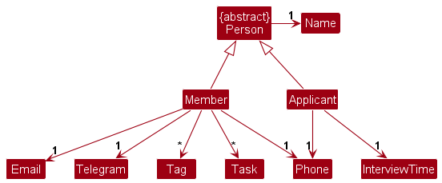
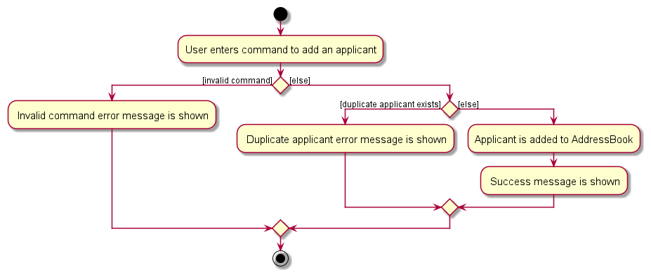
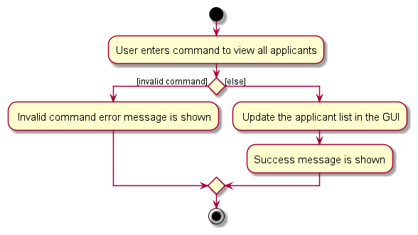
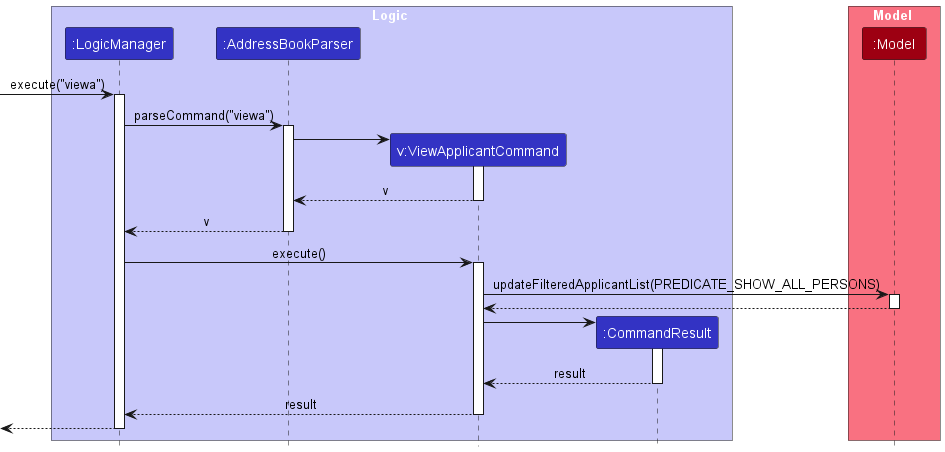
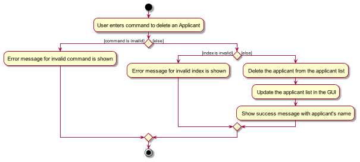
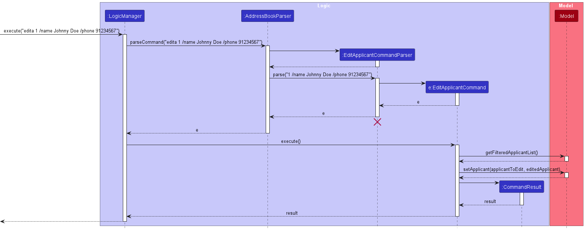
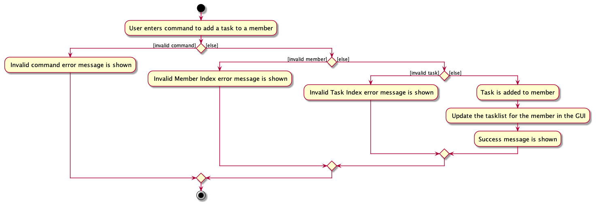
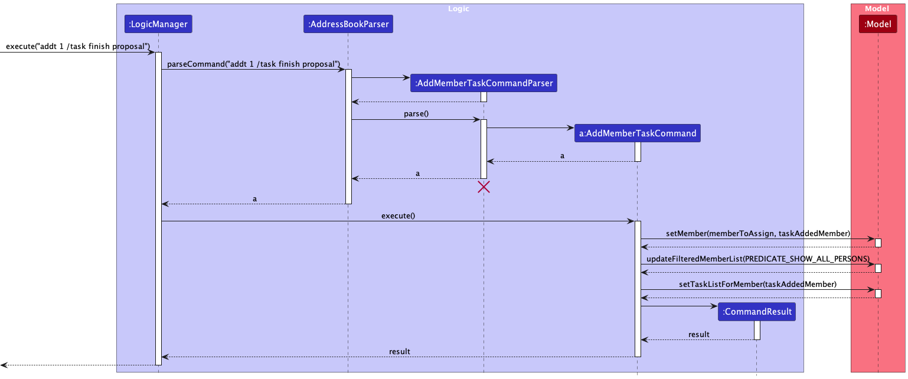

## Table of Contents

--------------------------------------------------------------------------------------------------------------------

* Table of Contents
{:toc}


--------------------------------------------------------------------------------------------------------------------

## **Acknowledgements**

This project is based on the AddressBook-Level3 project created by the [SE-EDU initiative](https://se-education.org).

--------------------------------------------------------------------------------------------------------------------

## **Setting up, getting started**

Refer to the guide [_Setting up and getting started_](SettingUp.md).


<div style="page-break-after: always;"></div>

## **Design**

<div markdown="span" class="alert alert-info">

:bulb: **Tip:** The `.puml` files used to create diagrams in this document are in the `docs/diagrams` folder. Refer to the [
_PlantUML Tutorial_ at se-edu/guides](https://se-education.org/guides/tutorials/plantUml.html) to learn how to create
and edit diagrams.
</div>

### Architecture


The ***Architecture Diagram*** given above explains the high-level design of the App.

Given below is a quick overview of main components and how they interact with each other.

**Main components of the architecture**

**`Main`** (consisting of
classes [`Main`](https://github.com/AY2324S1-CS2103T-W15-3/tp/blob/master/src/main/java/seedu/address/Main.java)
and [`MainApp`](https://github.com/AY2324S1-CS2103T-W15-3/tp/blob/master/src/main/java/seedu/address/MainApp.java)) is
in charge of the app launch and shut down.

* At app launch, it initializes the other components in the correct sequence, and connects them up with each other.
* At shut down, it shuts down the other components and invokes cleanup methods where necessary.

The bulk of the app's work is done by the following four components:

* [**`UI`**](#ui-component): The UI of the App.
* [**`Logic`**](#logic-component): The command executor.
* [**`Model`**](#model-component): Holds the data of the App in memory.
* [**`Storage`**](#storage-component): Reads data from, and writes data to, the hard disk.

[**`Commons`**](#common-classes) represents a collection of classes used by multiple other components.

<div style="page-break-after: always;"></div>

**How the architecture components interact with each other**

The *Sequence Diagram* below shows how the components interact with each other for the scenario where the user issues
the command `delm 1`.


Each of the four main components (also shown in the diagram above),

* defines its *API* in an `interface` with the same name as the Component.
* implements its functionality using a concrete `{Component Name}Manager` class (which follows the corresponding
  API `interface` mentioned in the previous point).

For example, the `Logic` component defines its API in the `Logic.java` interface and implements its functionality using
the `LogicManager.java` class which follows the `Logic` interface. Other components interact with a given component
through its interface rather than the concrete class (reason: to prevent outside component's being coupled to the
implementation of a component), as illustrated in the (partial) class diagram below.


The sections below give more details of each component.

<div style="page-break-after: always;"></div>

### UI component

The **API** of this component is specified
in [`Ui.java`](https://github.com/AY2324S1-CS2103T-W15-3/tp/blob/master/src/main/java/seedu/address/ui/Ui.java)


The UI consists of a `MainWindow` that is made up of parts
e.g.`CommandBox`, `ResultDisplay`, `MemberListPanel`, `StatusBarFooter` etc. All these, including the `MainWindow`,
inherit from the abstract `UiPart` class which captures the commonalities between classes that represent parts of the
visible GUI.

The `UI` component uses the JavaFx UI framework. The layout of these UI parts are defined in matching `.fxml` files that
are in the `src/main/resources/view` folder. For example, the layout of
the [`MainWindow`](https://github.com/AY2324S1-CS2103T-W15-3/tp/blob/master/src/main/java/seedu/address/ui/MainWindow.java)
is specified
in [`MainWindow.fxml`](https://github.com/AY2324S1-CS2103T-W15-3/tp/blob/master/src/main/resources/view/MainWindow.fxml)

The `UI` component,

* executes user commands using the `Logic` component.
* listens for changes to `Model` data so that the UI can be updated with the modified data.
* keeps a reference to the `Logic` component, because the `UI` relies on the `Logic` to execute commands.
* depends on some classes in the `Model` component, as it displays `Member`, `Applicant` and `Tag` objects residing in the `Model`.

<div style="page-break-after: always;"></div>

### Logic component

**API**: [`Logic.java`](https://github.com/AY2324S1-CS2103T-W15-3/tp/blob/master/src/main/java/seedu/address/logic/Logic.java)

Here's a (partial) class diagram of the `Logic` component:


The sequence diagram below illustrates the interactions within the `Logic` component, taking `execute("delm 1")` API
call as an example.


<div markdown="span" class="alert alert-primary">:information_source: **Note:** The lifeline for `DeleteMemberCommandParser` should end at the destroy marker (X) but due to a limitation of PlantUML, the lifeline reaches the end of diagram.
</div>

<div style="page-break-after: always;"></div>

How the `Logic` component works:

1. When `Logic` is called upon to execute a command, it is passed to an `AddressBookParser` object which in turn creates
   a parser that matches the command (e.g., `DeleteMemberCommandParser`) and uses it to parse the command.
1. This results in a `Command` object (more precisely, an object of one of its subclasses e.g., `DeleteMemberCommand`) which
   is executed by the `LogicManager`.
1. The command can communicate with the `Model` when it is executed (e.g. to delete a member).
1. The result of the command execution is encapsulated as a `CommandResult` object which is returned back from `Logic`.

Here are the other classes in `Logic` (omitted from the class diagram above) that are used for parsing a user command:


How the parsing works:

* When called upon to parse a user command, the `AddressBookParser` class creates an `XYZCommandParser` (`XYZ` is a
  placeholder for the specific command name e.g., `AddMemberCommandParser`) which uses the other classes shown above to parse
  the user command and create a `XYZCommand` object (e.g., `AddMemberCommand`) which the `AddressBookParser` returns back as
  a `Command` object.
* All `XYZCommandParser` classes (e.g., `AddMemberCommandParser`, `DeleteMemberCommandParser`, ...) inherit from the `Parser`
  interface so that they can be treated similarly where possible e.g, during testing.

<div style="page-break-after: always;"></div>

### Model component

**API**: [`Model.java`](https://github.com/AY2324S1-CS2103T-W15-3/tp/blob/master/src/main/java/seedu/address/model/Model.java)


The `Model` component,

* stores the address book data i.e., objects that extend from the abstract `Person` class (which are contained in a generic `UniquePersonList` object) and an `ObservableList<Tag>`.
* stores an updatable `ObservableList<Task>` of `Task` objects that update based on which `Member` is selected with the `viewtask` command.
* stores the currently 'selected' `Member` and `Applicant` objects (e.g., results of a search query) as a separate _filtered_ list which
  is exposed to outsiders as an unmodifiable `ObservableList<? extends Person>` that can be 'observed' e.g. the UI can be bound to
  this list so that the UI automatically updates when the data in the list change.
* stores a `UserPref` object that represents the user’s preferences. This is exposed to the outside as
  a `ReadOnlyUserPref` objects.
* does not depend on any of the other three components (as the `Model` represents data entities of the domain; they
  should make sense on their own without depending on other components)



The `Member` and `Applicant` classes both extend from the abstract `Person` class, and each of these classes have the
associated fields specific to them.

<div style="page-break-after: always;"></div>

### Storage component

**API**: [`Storage.java`](https://github.com/AY2324S1-CS2103T-W15-3/tp/blob/master/src/main/java/seedu/address/storage/Storage.java)


The `Storage` component,

* can save both address book data and user preference data in JSON format, and read them back into corresponding
  objects.
* inherits from both `AddressBookStorage` and `UserPrefStorage`, which means it can be treated as either one (if only
  the functionality of only one is needed).
* depends on some classes in the `Model` component (because the `Storage` component's job is to save/retrieve objects
  that belong to the `Model`)

### Common classes

Classes used by multiple components are in the `seedu.addressbook.commons` package.

<div style="page-break-after: always;"></div>

## **Implementation**

This section describes some noteworthy details on how certain features are implemented.

### Add `Member`/`Applicant` feature

The `addmember` and `addapplicant` command is used to add a member or an applicant to the address book.
The commands are implemented in the `AddMemberCommand` and `AddApplicantCommand` class, which extends the `Command`
class.

1. The `AddMemberCommand`/`AddApplicantCommand` object's execute() method is called.
2. The `Member`/`Applicant` to be added is checked against the `AddressBook` to ensure that there are no duplicates.
3. The `Member`/`Applicant` is added into the `AddressBook` if it is unique, else an error message is thrown.

The diagram below describes the behaviour of adding an applicant to the `AddressBook`, the execution of adding a member
the `AddressBook` is almost identical.



The sequence diagram below also shows the interaction between the various components during the execution of the 
`AddApplicantCommand`. The execution of the `AddMemberCommand` is almost identical, except that it uses the 
`Member` class instead of the `Applicant` class.


<div style="page-break-after: always;"></div>

### View all `Member`/`Applicant` feature

Lists all members/applicants in the address book to the user. For example, if the previous list was filtered (say by `FindMemberCommand` or `FindApplicantCommand`),
this command will show the unfiltered list.

1. The `ViewMembersCommand` or `ViewApplicantsCommand` object's execute() method is called. 
2. This updates the model via its `updateFilteredMemberList` or `updateFilteredApplicantList` method which is called with its predicate as always returning true. 
3. All members/applicants in the address book are shown to the user in the members/applicants list.

The diagram below describes the behaviour of viewing an applicant in the `AddressBook`; the behaviour of viewing a member in
the `AddressBook` is almost identical.



The sequence diagram below also shows the interaction between the various components during the execution of the
`ViewApplicantCommand`. The execution of the `ViewMembersCommand` is almost identical, except that it uses the
`Member` class instead of the `Applicant` class.



<div style="page-break-after: always;"></div>

### Delete a `Member`/`Applicant`

Deletes an existing `Member`/ `Applicant` identified by their `MEMBER_INDEX`/`APPLICANT_INDEX` in the displayed member/applicant list.
The commands are implemented in the `DeleteMemberCommand` and `DeleteApplicantCommand` classes which extend the `Command` class.

* Step 1. The `DeleteMemberCommand`/`DeleteApplicantCommand` object's `execute()` method is called.
* Step 2. The `MEMBER_INDEX`/`APPLICANT_INDEX` is checked to be within the valid range of the displayed member/applicant list. If the `MEMBER_INDEX`/`APPLICANT_INDEX` given is invalid (i.e., out of range), a `CommandException` is thrown.
* Step 3. The `Member`/`Applicant` at the given `MEMBER_INDEX`/`APPLICANT_INDEX` is referenced.
* Step 4. The model object's `deleteMember()`/`deleteApplicant()` method is called. The input parameter is the referenced `Member`/`Applicant`.
* Step 5. The `Member`/`Applicant` is deleted from the member/applicant list.

The diagram below describes this behaviour concisely. It shows how a user’s command is processed and what message is ultimately shown if they decide, for example, to delete an applicant.



The sequence diagram below also shows the interaction between the various components during the execution of the `DeleteApplicantCommand`. The execution of the `DeleteMemberCommand` is almost identical, except that it uses the `Member` class instead of the `Applicant` class.


<div style="page-break-after: always;"></div>

### Find a `Member`/`Applicant`

Finds any `Member`(s)/`Applicant`(s) that have any fields with the specified `KEYWORD`(s). The commands are implemented in the `FindMemberCommand`
and `FindApplicantCommand` command classes, which extend the `Command` class.

* Step 1. The `FindMemberCommand`/`FindApplicantCommand` object's `execute()` method is called.
* Step 2. The `KEYWORD`(s) are parsed and are searched for in each field for each `Member`/`Applicant`.
* Step 3. If the `KEYWORD`(s) are found in any field of the `Member`(s)/`Applicant`(s), they will be shown on the member/applicant list.

The diagram below describes this behaviour concisely. It shows how a user’s command is processed and what message is ultimately shown if they decide, for example, to find a member with `KEYWORD`(s).


The sequence diagram below also shows the interaction between the various components during the execution of the FindMemberCommand. The execution of the FindApplicantCommand is almost identical, except that it uses the Applicant class instead of the Member class.


<div style="page-break-after: always;"></div>

### Edit a `Member`/`Applicant`

Edits the details of an existing `Member`/ `Applicant` identified by their `MEMBER_INDEX`/`APPLICANT_INDEX` in the displayed member/applicant list.
The commands are implemented in the `EditMemberCommand` and `EditApplicantCommand` classes which extend the `Command` class.

* Step 1. The `EditMemberCommand`/`EditApplicantCommand` object's `execute()` method is called.
* Step 2. The `MEMBER_INDEX`/`APPLICANT_INDEX` is checked to be within the valid range of the displayed member/applicant list. If the `MEMBER_INDEX`/`APPLICANT_INDEX` given is invalid (i.e., out of range), a `CommandException` is thrown.
* Step 3. The `Member`/`Applicant` at the given `MEMBER_INDEX`/`APPLICANT_INDEX` is referenced.
* Step 4. The number of field(s) to be edited are checked. If there are no fields to be edited, a `CommandException` is thrown.
* Step 4. The model object's `setMember()`/`setApplicant()` method is called. The input parameter is the referenced `Member`/`Applicant` and the new `Member`/`Applicant` with the updated details.
* Step 5. The `Member's`/`Applicant's` field(s) are edited.

The diagram below describes this behaviour concisely. It shows how a user’s command is processed and what message is ultimately shown if they decide, for example, to edit an applicant.


The sequence diagram below also shows the interaction between the various components during the execution of the `EditApplicantCommand`. The execution of the `EditMemberCommand` is almost identical, except that it uses the `Member` class instead of the `Applicant` class.



<div style="page-break-after: always;"></div>

### Copy a `Member`/`Applicant`

Copies the details of an existing `Member`/`Applicant` identified by their index number in the displayed member/applicant list into the
clipboard. The commands are implemented in the `CopyMemberCommand` and `CopyApplicantCommand` classes, which extend the `Command` class.

1. The `CopyMemberCommand`/`CopyApplicantCommand` object's execute() method is called.
2. The `MEMBER_INDEX`/`APPLICANT_INDEX` is checked to be within the valid range of the member/applicant list. If it is invalid (e.g., out of range), a `CommandException` is thrown.
3. The `Member`/`Applicant` at the given `MEMBER_INDEX`/`APPLICANT_INDEX` is referenced.
4. The `CopyMemberCommand`/`CopyApplicantCommand` calls the copies the details given by the `Member#detailsToCopy`/`Applicant#detailsToCopy` method into the clipboard.

The diagram below describes this behaviour concisely. It shows how a user's command is processed and what message is ultimately shown if they decide, for example, to copy a member's details.
The behaviour is almost identical for `CopyApplicantCommand`.


The sequence diagram below also shows the interaction between the various components during the execution of the `CopyMemberCommand`. The execution of the `CopyApplicantCommand` is almost identical, except that it uses the `Applicant` class instead of the `Member` class.


<div style="page-break-after: always;"></div>

### View all existing tags

The view tags mechanism lists all existing tags in the address book that a user can use to tag a member.
All existing tags in the address book are shown to the user in the tags list.
When a new member is added, deleted or edited, the `updateTags` method is called to update the list of existing tags.

Suppose the DeleteMemberCommand is executed as shown in the diagram below, the following sequence of events will occur:
1. `DeleteMemberCommand#execute()` method is called.
2. `Member` is deleted from the `ModelManager` using the `ModelManager#deleteMember()` method.
3. The `ObservableList<Tags>` is updated in `AddressBook` using the `AddressBook#updateTags()` method.
4. UI detects change in `ObservableList<Tags>` and updates the `TagListPanel` UI component.


<div style="page-break-after: always;"></div>

### Allocating tasks to Members

Assign tasks to members identified by their index number in the displayed member list. The commands are implemented in
the `AddMemberTaskCommand` class, which extend the `Command` class.

* Step 1: The `AddMemberTaskCommand` object's `execute()` method is called.
* Step 2: The `MEMBER_INDEX` is checked to be within the valid range of the `MEMBER` list. If the `MEMBER_INDEX` given is
  invalid (e.g., out of range), a `CommandException` is thrown.
* Step 3: The member at the given index is referenced based on the provided member index.
* Step 4: The `AddMemberTaskCommand` calls the model object's `setMember()` method. It updates the member with the new
  details provided, effectively modifying the existing member's information.
* Step 5: After the execution of the `AddMemberTaskCommand`, the member's details are successfully edited in the member
  list.

The diagram below describes this behaviour concisely. It shows how a user's command is processed and what message is ultimately shown when the task is added to a member.



The sequence diagram below also shows the interaction between the various components during the execution of the 
`AddMemberTask`.



<div style="page-break-after: always;"></div>

### View Member task feature

Lists all tasks assigned to a member in the address book to the user under the `Tasks` column.

1. The `ViewMemberTaskCommand` object's execute() method is called.
2. This updates the model via its `updateFilteredMemberList` method which is called with its predicate as always returning true.
3. Then the `setTaskListForMember(memberToView)` method is called to set the task list for the chosen member.
4. The `TaskListPanel` UI component is updated with the task list for the chosen member.

The diagram below describes this behaviour concisely. It shows how a user's command is processed and how the view task command is executed.


The sequence diagram below also shows the interaction between the various components during the execution of the
`viewMemberTask`.


<div style="page-break-after: always;"></div>

### \[Proposed\] Better Task Management

#### Proposed Implementation

The proposed allocating tasks to `Member` objects is implemented using either `ToDo` or `Deadline` or `Events` object.
They extend from the `Task` class. A `Tasklist` object will be instantiated for each `Member` object, used to store the
list of tasks assigned to each individual. Additionally, it implements the following operations:

* `ToDo#markAsDone()`— Will be used to mark the todo of each Member as done
* `ToDo#markAsUnDone()`— Will be used to mark the todo of each Member as undone
* `Deadline#markAsDone()`— Will be used to mark the deadline of each Member as done
* `Deadline#markAsUnDone()`— Will be used to mark the deadline of each Member as done
* `Event#markAsDone()`— Will be used to mark the deadline of each Member as done
* `Event#markAsUnDone()`— Will be used to mark the deadline of each Member as done

These operations are exposed in the `Task` parent class as `Task#markAsDone()` and `Task#markAsUnDone()` to execute the
above-mentioned operations.

Step 1: The user adds a new `Member` using the `addmember` command. At this point, a `TaskList` instance will be
assigned to that member.

Step 2: When the user uses the `addToDo` command, a `ToDo` object containing the details parsed in through the code will
be stored and under the user identified by their telegram handle, which is passed as a parameter. It namely stores the
`Tasks.taskName`.

Step 3: When the user uses the `addDeadline` command, a `Deadline` object containing the details parsed in through the
code will
be stored and under the user identified by their telegram handle, which is passed as a parameter. It namely stores the
`Tasks.taskName`, `Deadline.dueDate` and `Deadline.dueTime`.

Step 4: When the user uses the `addEvent` command, an `Event` object containing the details parsed in through the code
will
be stored and under the user identified by their telegram handle, which is passed as a parameter. It namely stores the
`Tasks.taskName`, `Event.startDate`, `Deadline.startTime`, `Event.endDate` and `Deadline.endTime`.

<div style="page-break-after: always;"></div>

### \[Proposed\] Undo/redo feature

#### Proposed Implementation

The proposed undo/redo mechanism is facilitated by `VersionedAddressBook`. It extends `AddressBook` with an undo/redo
history, stored internally as an `addressBookStateList` and `currentStatePointer`. Additionally, it implements the
following operations:

* `VersionedAddressBook#commit()`— Saves the current address book state in its history.
* `VersionedAddressBook#undo()`— Restores the previous address book state from its history.
* `VersionedAddressBook#redo()`— Restores a previously undone address book state from its history.

These operations are exposed in the `Model` interface as `Model#commitAddressBook()`, `Model#undoAddressBook()`
and `Model#redoAddressBook()` respectively.

Given below is an example usage scenario and how the undo/redo mechanism behaves at each step.

Step 1. The user launches the application for the first time. The `VersionedAddressBook` will be initialized with the
initial address book state, and the `currentStatePointer` pointing to that single address book state.


Step 2. The user executes `delm 5` command to delete the 5th member in the address book. The `DeleteMemberCommand`
calls `Model#commitAddressBook()`, causing the modified state of the address book after the `delm 5` command executes
to be saved in the `addressBookStateList`, and the `currentStatePointer` is shifted to the newly inserted address book
state.


Step 3. The user executes `adda /name David …​` to add a new applicant. The `addm` command also
calls `Model#commitAddressBook()`, causing another modified address book state to be saved into
the `addressBookStateList`.


<div markdown="span" class="alert alert-primary">:information_source: **Note:** If a command fails its execution, it will not call `Model#commitAddressBook()`, so the address book state will not be saved into the `addressBookStateList`.

</div>

Step 4. The user now decides that adding the applicant was a mistake, and decides to undo that action by executing
the `undo` command. The `undo` command will call `Model#undoAddressBook()`, which will shift the `currentStatePointer`
once to the left, pointing it to the previous address book state, and restores the address book to that state.


<div markdown="span" class="alert alert-primary">:information_source: **Note:** If the `currentStatePointer` is at index 0, pointing to the initial AddressBook state, then there are no previous AddressBook states to restore. The `undo` command uses `Model#canUndoAddressBook()` to check if this is the case. If so, it will return an error to the user rather
than attempting to perform the undo.

</div>

The following sequence diagram shows how the undo operation works:


<div markdown="span" class="alert alert-primary">:information_source: **Note:** The lifeline for `UndoCommand` should end at the destroy marker (X) but due to a limitation of PlantUML, the lifeline reaches the end of diagram.

</div>

The `redo` command does the opposite — it calls `Model#redoAddressBook()`, which shifts the `currentStatePointer` once
to the right, pointing to the previously undone state, and restores the address book to that state.

<div markdown="span" class="alert alert-primary">:information_source: **Note:** If the `currentStatePointer` is at index `addressBookStateList.size() - 1`, pointing to the latest address book state, then there are no undone AddressBook states to restore. The `redo` command uses `Model#canRedoAddressBook()` to check if this is the case. If so, it will return an error to the user rather than attempting to perform the redo.

</div>

<div style="page-break-after: always;"></div>

Step 5. The user then decides to execute the command `list`. Commands that do not modify the address book, such
as `list`, will usually not call `Model#commitAddressBook()`, `Model#undoAddressBook()` or `Model#redoAddressBook()`.
Thus, the `addressBookStateList` remains unchanged.


Step 6. The user executes `clear`, which calls `Model#commitAddressBook()`. Since the `currentStatePointer` is not
pointing at the end of the `addressBookStateList`, all address book states after the `currentStatePointer` will be
purged. Reason: It no longer makes sense to redo the `add n/David …​` command. This is the behavior that most modern
desktop applications follow.


The following activity diagram summarizes what happens when a user executes a new command:


#### Design considerations:

**Aspect: How undo & redo executes:**

* **Alternative 1 (current choice):** Saves the entire address book.
    * Pros: Easy to implement.
    * Cons: May have performance issues in terms of memory usage.

* **Alternative 2:** Individual command knows how to undo/redo by
  itself.
    * Pros: Will use less memory (e.g. for `delm`, just save the member being deleted).
    * Cons: We must ensure that the implementation of each individual command are correct.

<div style="page-break-after: always;"></div>

## **Documentation, logging, testing, configuration, dev-ops**

* [Documentation guide](Documentation.md)
* [Testing guide](Testing.md)
* [Logging guide](Logging.md)
* [Configuration guide](Configuration.md)
* [DevOps guide](DevOps.md)

--------------------------------------------------------------------------------------------------------------------

## **Appendix: Requirements**

### Product scope

**Target user profile**:

* is a member of an organisation
* has a responsibility in managing applicants who are applying into the organisation
* has a need to manage a significant number of contacts
* prefers data to be organized and separated into categories
* prefers desktop apps over other types
* prefers typing to mouse interactions
* prefers to use a separate app that is made to manage CCA-related contacts efficiently
* is reasonably comfortable using CLI apps

**Value proposition**: 
* ClubMembersContact is a desktop app that helps the user manage a large number of contacts efficiently. It is
  optimised for use via a Command Line Interface (CLI) while still having the benefits of a Graphical User Interface
  (GUI).
* It categorises contacts into 'members' and 'applicants' groups, allowing for easier management of contacts
* It allows the user to add, delete, edit, find, view and copy members and applicants contacts
* Members are able to manage their tasks on the app
* Applicants are able to schedule interviews

<div style="page-break-after: always;"></div>

### User stories

Priorities: High (must have) - `* * *`, Medium (nice to have) - `* *`, Low (unlikely to have) - `*`

| Priority | As a …​ | I want to …​                                                | So that I can…​                                                     |
|----------|---------|-------------------------------------------------------------|---------------------------------------------------------------------|
| `* * *`  | EXCO    | add a member                                                | keep track of all my members when I need to                         |
| `* * *`  | EXCO    | view all members                                            | see a list of all current members in the CCA                        |
| `* * *`  | EXCO    | delete a member                                             | remove members from the database if they have left                  |
| `* * *`  | EXCO    | edit a member                                               | update the member's details should they change                      |
| `* * *`  | EXCO    | add an applicant                                            | keep track of all my applicants to contact them for further updates |
| `* *  `  | EXCO    | copy a member's details to the clipboard                    | paste their details elsewhere                                       |
| `* * *`  | EXCO    | view all applicants                                         | see a list of all applicants to my CCA                              |
| `* * *`  | EXCO    | delete an applicant                                         | remove applicants if they have withdrawn their application          |
| `* * *`  | EXCO    | edit an applicant                                           | update the applicant's details should they change                   |
| `* *  `  | EXCO    | schedule a time and date for an interview with an applicant | mark out a time period of a specific date for an interview          |
| `* *  `  | EXCO    | copy a applicant's details to the clipboard                 | paste their details elsewhere                                       |
| `*    `  | EXCO    | receive notifications for upcoming interviews               | be reminded of upcoming interviews and won't forget about them      |
| `*    `  | EXCO    | export a selected group of contacts to a CSV file           | use the data in other applications or for backup purposes           |
| `*    `  | EXCO    | import a CSV file of contacts into the application          | add a large number of contacts into the application at once         |
| `*    `  | EXCO    | merge duplicate contact entries                             | maintain a clean and organised database                             |

<div style="page-break-after: always;"></div>

### Use cases

(For all use cases below, the **System** is the `ClubMembersContact` and the **Actor** is the `user`, unless specified
otherwise)

**Use case: UC01 - Adding a member**

**MSS**

1. User enters command to add a member
2. ClubMembersContact adds the member to the list of members
3. ClubMembersContact displays a success message along with the member's details
    <br/>
    Use case ends.

**Extensions**

* 1a. The add member command format is invalid.
  * 1a1. ClubMembersContact shows an error message.
    <br/>
    Use case resumes at step 1.
* 2a. Member already exists in the list of members.
  * 2a1. ClubMembersContact shows an error message.
    <br/>
    Use case resumes at step 2.

---

**Use case: UC02 - Finding members**

**MSS** 

1. User requests to find members.
2. ClubMembersContact displays all members with any field that matches the inputted keyword.

Use case ends.

**Extensions**
* 2a. The user input for the `KEYWORD` is empty.
  * 2a1. ClubMembersContact shows an error message.  
  Use case resumes from step 1.
  
---

**Use case: UC03 - Viewing members**

**MSS**

1. User requests to view all members
2. ClubMembersContact shows a list of all members and displays a success message
   <br/>
   Use case ends.

<div style="page-break-after: always;"></div>

**Use case: UC04 - Editing a member**

**MSS**

1. User requests to edit a member
2. ClubMembersContact edits the member's details
3. Member list is updated in GUI
4. ClubMembersContact displays a success message along with the member's details
   <br/>
   Use case ends.

**Extensions**
* 1a. The edit member command format is invalid.
    * 1a1. ClubMembersContact shows an error message.
      <br/>
      Use case resumes at step 1.
* 1b. The member index is invalid or out of range.
    * 1b1. ClubMembersContact shows an error message.
      <br/>
      Use case resumes at step 1.
* 1c. No field to edit is entered.
    * 1c1. ClubMembersContact shows an error message.
      <br/>
      Use case resumes at step 1.

---

**Use case: UC05 - Deleting a member**

**MSS**:
1. User requests to delete a member from the member list.
2. ClubMembersContact deletes the member from the member list and the member is no longer displayed.  
   <br/>
   Use case ends.

**Extensions**
* 1a. The inputted index is invalid.
    * 1a1. Club Members Contact shows an error message.  
      Use case resumes from step 1.
* 2a. The member list is empty.  
    <br/>
    Use case ends.

---

**Use case: UC06 - Copying a member**

**MSS**

1. User requests to copy a member
2. ClubMembersContact copies the member's details to the clipboard
3. ClubMembersContact displays a success message along with the member's details
   <br/>
   Use case ends.

**Extensions**

* 1a. The copy member command format is invalid.
  * 1a1. ClubMembersContact shows an error message.
    <br/>
    Use case resumes at step 1.


* 1b. The member index is invalid or out of range.
  * 1b1. ClubMembersContact shows an error message.
    <br/>
    Use case resumes at step 1.

---

**Use case: UC07 - Allocating a task to a member**

**MSS**

1. User enters command to allocate a task to a member.
2. ClubMembersContact adds the task to the member's list of tasks.
3. ClubMembersContact displays a success message.
   <br/>
   Use case ends.

**Extensions**

* 1a. The add task command format is invalid.
    * 1a1. ClubMembersContact shows an error message.
      <br/>
      Use case resumes at step 1.


* 1b. The member index is invalid or out of range.
    * 1b1. ClubMembersContact shows an error message.
      <br/>
      Use case resumes at step 1.

---

**Use case: UC08 - Viewing all tasks allocated to a member**

**MSS**

1. User requests to view all tasks allocated to a member.
2. ClubMembersContact displays the list of tasks allocated to the member under the task box.
   <br/>
   Use case ends.

**Extensions**

* 1a. The view task command format is invalid.
    * 1a1. ClubMembersContact shows an error message.
      <br/>
      Use case resumes at step 1.


* 1b. The member index is invalid or out of range.
    * 1b1. ClubMembersContact shows an error message.
      <br/>
      Use case resumes at step 1.

* 2a. The tasklist is empty.
    * 2a1. ClubMembersContact shows a blank task box.
      <br/>
      Use case resumes at step 1.

---

**Use case: UC09 - Deleting a task allocated to a member**

**MSS**

1. User requests to delete a task from list of tasks allocated to a member.
2. ClubMembersContact deletes the task from the list of tasks allocated to the member.
   <br/>
   Use case ends.

**Extensions**

* 1a. Delete task command format is invalid.
    * 1a1. ClubMembersContact shows an error message.
      <br/>
      Use case resumes at step 1.

* 1b. The member index is invalid or out of range.
    * 1b1. ClubMembersContact shows an error message.
      <br/>
      Use case resumes at step 1.

* 1c. The task index is invalid or out of range.
    * 1b1. ClubMembersContact shows an error message.
      <br/>
      Use case resumes at step 1.

* 2a. The tasklist is empty.
    * 2a1. ClubMembersContact shows a blank task box.
      <br/>
      Use case resumes at step 1.

---

**Use case: UC10 - Adding an applicant**

Similar to UC01 - Adding members except that it adds an applicant instead of a member.

---

**Use case: UC11 - Finding applicants**

Similar to UC02 - Finding members except that it finds applicants instead of members.

---

**Use case: UC12 - Viewing applicants**

Similar to UC03 - Viewing members except that it displays a list of applicants instead of members.

---

**Use case: UC13 - Editing an applicant**

Similar to UC04 - Editing a member except that it edits an applicant instead of a member.

---

**Use case: UC14 - Deleting an applicant**

Similar to UC05 - Deleting a member except that it deletes an applicant instead of a member.

---

**Use case: UC15 - Copying an applicant**

Similar to UC06 - Copying a member except that it copies an applicant instead of a member.

---

**Use case: UC16 - Scheduling a date for an interview with a new applicant**

**MSS**

1. User requests to add an applicant with an interview time.
2. ClubMembersContact adds the applicant to the list of applicants.
   Use case ends.

**Extensions**

* 1a. The add applicant command format is invalid.
    * 1a1. ClubMembersContact shows an error message.
      <br/>
      Use case resumes at step 1.

* 2a. The interview format is wrong.
    * 2a1. ClubMembersContact shows an invalid date format error message.
      <br/>
      Use case resumes at step 2.

---

**Use case: UC17 - Scheduling a date for an interview with an existing applicant**

**MSS**

1. User requests to add an interview time to an applicant through the edita command.
2. Applicant in applicant list has a new interview time.
   Use case ends.

**Extensions**

* 1a. The edit applicant command format is invalid.
    * 1a1. ClubMembersContact shows an error message.
      <br/>
      Use case resumes at step 1.

* 2a. The interview format is wrong.
    * 2a1. ClubMembersContact shows an invalid date format error message.
      <br/>
      Use case resumes at step 2.

### Non-Functional Requirements

1. The application should work on any _mainstream_ OS as long as it has Java `11` or above installed.
2. The application should be able to handle at least 100 members and applicants each.
3. A user with above average typing speed should be able to perform most functions faster than using a mouse.
4. The application should respond to user requests within 2 seconds for all functions.
5. The user interface should be consistent across all modules and functions of the application.
6. The application is not required to be able to handle multiple users at the same time.
7. The application is not required to support languages other than English.
8. The application should be able to handle most common user input errors gracefully and provide meaningful error messages.
9. The application should be intuitive enough to use for beginners who are new to CLIs.

### Glossary

* **Mainstream OS**: Windows, Linux, Unix, OS-X
* **CLI**: Command Line Interface: A way of interacting with a computer program where the user issues commands to the
  program in the form of successive lines of text (command lines). This type of interface emphasises text-based user interaction over graphical user interfaces.

--------------------------------------------------------------------------------------------------------------------

## **Appendix: Instructions for manual testing**

Given below are instructions to test the app manually.

<div markdown="span" class="alert alert-primary">:information_source: **Note:** These instructions only provide a starting point for testers to work on;
testers are expected to do more *exploratory* testing.

</div>

### Launch and shutdown

1. Initial launch

    1. Download the jar file and copy into an empty folder

    2. Double-click the jar file. Expected: Shows the GUI with a set of sample contacts. The window size may not be
       optimum.

2. Saving window preferences

    1. Resize the window to an optimum size. Move the window to a different location. Close the window.

    2. Re-launch the app by double-clicking the jar file.<br>
       Expected: The most recent window size and location is retained.

### Clearing data

Command: `clear`
1. Test case: `clear`<br>
   Expected: All data is cleared.

### Exiting ClubMembersContacts

Command: `exit`
1. Test case: `exit`<br>
   Expected: The app exits, all data is saved.

### Help

Command: `help`
1. Test case: `help`<br>
   Expected: Help window pops up.
2. Test case: Press the `F1` key<br>
   Expected: Help window pops up.

### Adding a member

Command: `addm` or `addmember`. You can refer to the command [here](https://ay2324s1-cs2103t-w15-3.github.io/tp/UserGuide.html#411-adding-a-member-addmember-or-addm).
1. Adding a new member
    1. Prerequisites: Existing list of members do not contain member with the same phone number
    2. Test case: `addm /name John Doe /phone 91234567 /email johnd@example.com /tele @johndoe`<br>
       Expected: A new member is added with the given name, phone number, email, and Telegram handle with no tags.
       The member is added to the last index of the member list. The member card will appear at the bottom
       of the list.
    3. Test case: `addm /name John Doe /phone 91234567 /email johnd@example.com /tele @johndoe /tag Classmate`<br>
       Expected: A new member is added with the given name, phone number, email, and Telegram handle with the Classmate tag.
       The member added to the last index of the member list. The member card will appear at the bottom of the list.

2. Adding a member applicant
    1. Prerequisites: Existing list of member contain member with the same phone number
    2. Test case: `addm /name John Doe /phone 91234567 /email johnd@example.com /tele @johndoe`
       then `addm /name Jack Do /phone 91234567 /email jackd@example.com /tele @jackdo`<br>
       Expected: No member added because the member has the same phone number as an existing member. An error
       message will be shown with the details.

3. Adding a member while the member list is being filtered
    1. Prerequisites: Filter the member list by keyword using the `findm` command.
    2. Test case: Similar to test cases above.  
       Expected: Similar to each respective test cases. The member list will remain filtered.

### Editing a member
This uses the `editm` command. You can refer to the command [here](https://ay2324s1-cs2103t-w15-3.github.io/tp/UserGuide.html#414-editing-a-member-editmember-or-editm).

1. General command usage.
   1. Prerequisites: The member to be edited must **NOT** have the `phone` field edited to be the same as another member's phone number.
   2. Test case 1: `editm 1 /name Susan Tan /phone 98765444 /email susantan@xyzmail.com /telegram @susantan /tag friend`<br>
      Expected Outcome: The first member in the member list will be edited with the given name, 
      phone number, email, telegram handle and tag (that replaces all previously inputted tags). 
      This member's card will be updated to reflect the changes.
   3. Test case 2: `editm /name Sally`<br>
      Expected Outcome: An invalid command message will be shown as the member index is missing from the command. 
      No changes will be made to the member.
   4. Test case 3: `editm 1`<br>
      Expected Outcome: An error message indicating that no fields are entered will be shown.
      No changes will be made to the member.

2. Duplicate phone numbers.
   1. Prerequisites: At least 2 members in the member list. The/ A member that is **NOT** being edited must have the phone number set to `98765432`.
   2. Test case 1: `editm 1 /phone 98765432`<br>
   Expected Outcome: An error message indicating that another member has the same phone number will be shown.
   No changes will be made to the member.

### Finding a member
This uses the `findm` command. You can refer to the command [here](https://ay2324s1-cs2103t-w15-3.github.io/tp/UserGuide.html#412-finding-members-findmember-or-findm).

1. Prerequisites: There are 3 previously added members named `Alice Tan`, `Brendan Tan`and `Charlie Chan`. `Alice Tan` is tagged with `SWE`, `Brendan Tan` is tagged with `Product`, and `Charlie Chan` is tagged with `SWE`.

2. Test case 1: `findm Tan`<br/>
   Expected Outcome: All members whose details contain the `KEYWORD` `Tan` will be shown. `Alice Tan` and `Brendan Tan` will be shown on the members list.

3. Test case 2: `findm SWE Tan`<br/>
   Expected Outcome: All members whose details contain either the `KEYWORD`s `SWE` and/or `Tan` will be shown. `Alice Tan`, `Brendan Tan` and `Charlie Chan` will be shown on the member list.

4. Test case 3: `findm empty`<br/>
   Expected Outcome: None of the members have any fields that contain the `KEYWORD` `empty`. No members will be listed in the member list.

5. Test case 4: `findm`<br/>
   Expected Outcome: The `KEYWORD` is missing from the command. An invalid command message will be shown. Member list remains the same.

### Viewing all members
This uses the `viewm` command. You can refer to the command [here](https://ay2324s1-cs2103t-w15-3.github.io/tp/UserGuide.html#413-viewing-members-viewmembers-or-viewm).

1. Test case 1: `viewm`.<br/>
   Expected Outcome: All members will be shown on the member list. If there are no members in the system, then nothing will be shown there.

### Copy a member
Command: `cpm` or `copymember`. You can refer to the command [here](https://ay2324s1-cs2103t-w15-3.github.io/tp/UserGuide.html#416-copying-a-members-details-copymember-or-cpm).

1. Prerequisites: At least one member must be in the member list. You can add a member via the `addm` command. You can refer to this command [here.](https://ay2324s1-cs2103t-w15-3.github.io/tp/UserGuide.html#411-adding-a-member-addmember-or-addm)

2. Test case 1: `cpm 1`.<br/>
   Expected Outcome: The first member's details are copied into the clipboard. The details of the copied member is shown in the success message as well.

3. Test case 2: `cpm 0`.<br/>
   Expected Outcome: The `MEMBER_INDEX` is invalid. An invalid index message is shown. Nothing is copied into the clipboard.

4. Other incorrect copy commands to try: `cpm`, `cpm1`, `copymember x` (where x is any non-integer or integer bigger than the member list size).

### Add member task
Command: `addt` or `addtask`. You can refer to the command [here](https://ay2324s1-cs2103t-w15-3.github.io/tp/UserGuide.html#417-allocating-a-task-to-a-member-addtask-or-addt).

1. Prerequisites: At least one member must be in the member list. You can add a member via the `addm` command. You can refer to this command [here.](https://ay2324s1-cs2103t-w15-3.github.io/tp/UserGuide.html#411-adding-a-member-addmember-or-addm)

2. Test case 1: `addt 1 /task finish proposal`.<br/>
   Expected Outcome: The first member will have the task `finish proposal` added to their task list. The details of the added task will be shown in the success message.

3. Test case 2: `addt 0 /task finish proposal`.<br/>
   Expected Outcome: The `MEMBER_INDEX` is invalid. An invalid index message is shown.

4. Test case 3: `addt 1 /task`.<br/>
   Expected Outcome: The `TASK` is missing from the command. An invalid command message is shown.

5. Other incorrect add member task commands to try: `addtt`, `addt1`, `adt1`, `addtask x` (where x is any non-integer or integer bigger than the member list size).

### View member task
Command: `viewt` or `viewtask`. You can refer to the command [here](https://ay2324s1-cs2103t-w15-3.github.io/tp/UserGuide.html#418-Viewing-all-tasks-allocated-to-a-member-viewtask-or-viewt)

1. Test case 1: `viewt 1`.
   Expected Outcome: Member 1's task list will be shown on the task panel. If there are no tasks in the system, then nothing will be shown there.

2. Test case 1: `viewt 0`.
   Expected Outcome: An invalid `MEMBER_INDEX` message will be shown.

3. Other incorrect view member task commands to try: `viewtt`, `viewt1`, `viet1`, `viewtask x` (where x is any non-integer or integer bigger than the member list size).

### Delete member task
Command: `delt` or `deletetask`. You can refer to the command [here](https://ay2324s1-cs2103t-w15-3.github.io/tp/UserGuide.html#419-deleting-a-task-allocated-to-a-member-deletetask-or-delt).

1. Prerequisites:
   1. At least one member must be in the member list. You can add a member via the `addm` command. You can refer to the command [here](https://ay2324s1-cs2103t-w15-3.github.io/tp/UserGuide.html#411-adding-a-member-addmember-or-addm).
   2. The member must also have at least 1 task in his tasklist. You can add a task to a member with the `addt` command. You can refer to the command [here.](https://ay2324s1-cs2103t-w15-3.github.io/tp/UserGuide.html#417-allocating-a-task-to-a-member-addtask-or-addt)

2. Test case 1: `delt 1 /task 1`.<br/>
   Expected Outcome: The first member's first task is deleted from the task list. The details of the deleted task is shown in the success message.

3. Test case 2: `delt 0 /task 1`.<br/>
   Expected Outcome: The `MEMBER_INDEX` is invalid. An invalid index message is shown. Tasklist list remains the same.

4. Test case 3: `delt 1 /task 0`.<br/>
      Expected Outcome: The `TASK_INDEX` is invalid. An invalid index message is shown. Tasklist list remains the same.

5. Other incorrect delete member task commands to try: `deltt`, `delt1`, `deletetask x` (where x is any non-integer or integer bigger than the member list size).

### Deleting a member
Command: `delm` or `deletemember`. You can refer to the command [here](https://ay2324s1-cs2103t-w15-3.github.io/tp/UserGuide.html#415-deleting-a-member-deletemember-or-delm).

1. Prerequisites: At least one member must be in the member list. You can add a member via the `addm` command. You can refer to this command [here.](https://ay2324s1-cs2103t-w15-3.github.io/tp/UserGuide.html#411-adding-a-member-addmember-or-addm)

2. Test case 1: `delm 1`.<br/>
   Expected Outcome: The first member is deleted from the shown member list. The name of the deleted member is shown in the status message.

3. Test case 2: `delm 0`.<br/>
   Expected Outcome: The `MEMBER_INDEX` is invalid. An invalid index message is shown. Member list remains the same.

4. Other incorrect delete commands to try: `delm`, `delm1`, `deletemember x` (where x is any non-integer or integer bigger than the member list size).

### Adding an applicant

Command: `adda` or `addapplicant`. You can refer to the command [here](https://ay2324s1-cs2103t-w15-3.github.io/tp/UserGuide.html#421-adding-an-applicant-addapplicant-or-adda).
1. Adding a new applicant
   1. Prerequisites: Existing list of applicants do not contain applicant with the same phone number
   2. Test case: `adda /name John Doe /phone 91234567`<br>
      Expected: A new applicant is added with the given name and phone number and the interview time is not set. 
      The applicant is added to the last index of the applicant list. The applicant card will appear at the bottom 
      of the list. The details of the added applicant will be shown in the success message.
   3. Test case: `adda /name John Doe /phone 91234567 /interview 01/01/2024 1200`<br>
      Expected: A new applicant is added with the given name, phone number and interview time. The applicant is
      added to the last index of the applicant list. The applicant card will appear at the bottom of the list. The
      details of the added applicant will be shown in the success message.

2. Adding a duplicate applicant
   1. Prerequisites: Existing list of applicants contain applicant with the same phone number
   2. Test case: `adda /name John Doe /phone 91234567` then `adda /name Jack Do /phone 91234567`<br>
      Expected: No applicant added because the applicant has the same phone number as an existing applicant. An error
      message will be shown with the details.

3. Adding an applicant while the applicant list is being filtered
   1. Prerequisites: Filter the applicant list by keyword using the `finda` command.
   2. Test case: Similar to test cases above.  
      Expected: Similar to each respective test cases. The applicant list will remain filtered.

### Editing an applicant

This uses the `edita` command. You can refer to the command [here](https://ay2324s1-cs2103t-w15-3.github.io/tp/UserGuide.html#424-editing-an-applicant-editapplicant-or-edita).

1. General command usage.
    1. Prerequisites: The applicant to be edited must **NOT** have the `phone` field edited to be the same as another member's phone number.
    2. Test case 1: `edita 1 /name Susan Tan /phone 98765444 /interview 1/1/2024 1200`<br>
       Expected Outcome: The first applicant in the applicant list will be edited with the given name,
       phone number, and an interview is set with the given date and time.
       This applicant's card will be updated to reflect the changes.
    3. Test case 2: `edita /name Sally`<br>
       Expected Outcome: An invalid command message will be shown as the applicant index is missing from the command.
       No changes will be made to the applicant.
    4. Test case 3: `edita 1`<br>
       Expected Outcome: An error message indicating that no fields are entered will be shown.
       No changes will be made to the applicant.

2. Editing interview date and time.
    1. Test case 1: `edita 1 /interview 1-1-2024 1200`<br>
       Expected Outcome: An error message indicating that the date and time format is incorrect will be shown. 
       No changes will be made to the applicant.
    2. Test case 2: `edita 1 /interview cancel`<br>
       Expected Outcome: Previously set interview date and time will be removed from the first applicant's details in the applicant list. 
       This applicant's card will be updated to reflect the changes.

3. Duplicate phone numbers.
    1. Prerequisites: At least 2 applicants in the applicant list. The/ An applicant that is **NOT** being edited must have the phone number set to `98765432`.
    2. Test case 1: `editm 1 /phone 98765432`<br>
       Expected Outcome: An error message indicating that another applicant has the same phone number will be shown.
       No changes will be made to the applicant.

### Finding an applicant
This uses the `finda` command. You can refer to the command [here](https://ay2324s1-cs2103t-w15-3.github.io/tp/UserGuide.html#422-finding-applicants-findapplicant-or-finda).

1. Prerequisites: There are 3 previously added applicants named `Ryan Tan`, `Ryan Lee`, and `Sarah Lee`. `Ryan Tan` and `Sarah Lee` both have an interview scheduled on 12 December 2023. `Ryan Lee` has not yet scheduled an interview.

2. Test case 1: `finda Ryan`<br/>
   Expected Outcome: All applicants whose details contain the `KEYWORD` `Ryan` will be shown. `Ryan Tan` and `Ryan Lee` will be shown on the applicant list.

3. Test case 2: `finda Lee December`<br/>
   Expected Outcome: All applicants whose details contain the `KEYWORD`s `Lee` and `December` will be shown. `Ryan Tan`, `Ryan Lee` and `Sarah Lee` will be shown on the applicant list.

4. Test case 3: `finda empty`<br/>
   Expected Outcome: None of the applicants have any fields that contain the `KEYWORD` `empty`. No applicants will be listed in the applicant list.

5. Test case 4: `finda`<br/>
   Expected Outcome: The `KEYWORD` is missing from the command. An invalid command message will be shown. Applicant list remains the same.

### Viewing all applicants
This uses the `viewa` command. You can refer to the command [here](https://ay2324s1-cs2103t-w15-3.github.io/tp/UserGuide.html#423-viewing-applicants-viewapplicants-or-viewa).

1. Test case 1: `viewa`.<br/>
   Expected Outcome: All applicants will be shown on the applicant list. If there are no applicants in the system, then nothing will be shown there.

### Copy an applicant
Command: `cpa` or `copyapplicant`. You can refer to the command [here](https://ay2324s1-cs2103t-w15-3.github.io/tp/UserGuide.html#426-copying-an-applicants-details-copyapplicant-or-cpa).

1. Prerequisites: At least one applicant must be in the applicant list. You can add a member via the `adda` command. You can refer to this command [here.](https://ay2324s1-cs2103t-w15-3.github.io/tp/UserGuide.html#421-adding-an-applicant-addapplicant-or-adda)

2. Test case 1: `cpa 1`.<br/>
   Expected Outcome: The first applicant's details are copied into the clipboard. The details of the copied applicant is shown in the success message as well.

3. Test case 2: `cpa 0`.<br/>
   Expected Outcome: The `APPLICANT_INDEX` is invalid. An invalid index message is shown. Nothing is copied into the clipboard.

4. Other incorrect copy commands to try: `cpa`, `cpa1`, `copyapplicant x` (where x is any non-integer or integer bigger than the member list size).


### Deleting an applicant
Command: `dela` or `deleteapplicant`. You can refer to the command [here](https://ay2324s1-cs2103t-w15-3.github.io/tp/UserGuide.html#425-deleting-an-applicant-deleteapplicant-or-dela).

1. Prerequisites: At least one member must be in the member list. You can add a member via the `adda` command. You can refer to this command [here.](https://ay2324s1-cs2103t-w15-3.github.io/tp/UserGuide.html#421-adding-an-applicant-addapplicant-or-adda)

2. Test case 1: `dela 1`.<br/>
   Expected: The first applicant is deleted from the shown applicant list. The name of the deleted applicant is shown in the status message.

3. Test case 2: `dela 0`.<br/>
   Expected: The `APPLICANT_INDEX` is invalid. An invalid index message is shown. Applicant list remains the same.

4. Other incorrect delete commands to try: `dela`, `dela1`, `deleteapplicant x` (where x is any non-integer or integer bigger than the applicant list size).

--------------------------------------------------------------------------------------------------------------------

## **Appendix: Effort**

Overall, we felt the difficulty level for ClubMembersContacts was moderately high. When creating the project,
which evolved from AB-3, we meticulously considered the overall design, architecture and testing aspects to ensure the
project was well-designed and robust. This was a challenging task as we had to consider the various components and
classes that would be required to implement the project. We also had to consider the various use cases and user stories
to ensure that the project was able to meet the requirements. 

Justification for effort:
* **Changing existing commands** - We had to tweak and rewrite almost all of the commands from AB3 since we wanted to
have two different classes of `Member` and `Applicant` extending from the original `Person` class. This required us to 
think carefully about the best way to implement the classes to reduce duplication of code. For example, we adapted the
`UniquePersonList` to be generic so that it could take in both `Member` and `Applicant` objects to prevent the need to 
create two separate lists for each class.
* **Creating new classes** - We created new classes (such as `Telegram`) to allow new fields to be added to the `member`
class.
* **Implementing new features** - We implemented new features such as `Task` for `Member` and `Interview` for 
`Applicant`. We had to first spend time thinking about how the logic was going to work and also how it was going to 
show up on the UI. Debugging took the longest time since we used the `Task` similar to the one we used for our iP to
but had to modify the classes to made sure that it worked properly and made sense in the context of the project.
Similarly, for `Interview`, we had to make tweaks to integrate it into our project.

Challenges faced in the project:
* **Improvement to the UI** - Changing the UI to suit the new requirements of the project was a challenging task. We
were unfamiliar with JavaFX which made it difficult to understand how the various components interacted with one another.
Tracing the code was not enough to understand what was happening, and we needed to spend time reading the documentation on
how the components worked.
* **Writing test cases** - When we first saw the implementation of the test cases in AB3, we were very confused what
many of the methods were doing and there were so many abstractions that required us to trace the code to really 
understand what was happening. We had to spend a lot of time tracing the code and understanding how to make use of the
same level of abstraction for our own test cases to ensure they were robust and well-written.

<div style="page-break-after: always;"></div>

## **Appendix: Planned Enhancements**

### Support for multiple tasks in a single command

#### Adding multiple tasks 

Currently, the user can only add one task at a time. The command `addt 1 /task ONE /task TWO` will result in the following error message:

```
Multiple values specified for the following single-valued field(s): /task
```

We plan to allow the user to add multiple tasks in one command for greater user convenience. The command `addt 1 /task ONE /task TWO` will result in the following success message:

```
Tasks added to member Alex Yeoh
```

#### Deleting multiple tasks 

Similarly, the user can currently only delete one task at a time. The command `delt 1 /task 1 /task 2` will result in the following error message:

```
Multiple values specified for the following single-valued field(s): /task
```

We plan to allow the user to delete multiple tasks in one command for greater user convenience. The command `delt 1 /task 1 /task 2` will result in the following success message:

```
Tasks [Finish Proposal] and [Submit Draft] deleted from member Alex Yeoh
```

### Duplicate member/applicant error messages

#### Adding a duplicate member

Currently, the error message for adding a duplicate member is as follows:

```
This member already exists in the member list
```

As per our [User Guide (see 4.1.1 Adding a member)](https://ay2324s1-cs2103t-w15-3.github.io/tp/UserGuide.html#411-adding-a-member-addmember-or-addm),
duplicate members are identified by their `PHONE_NUMBER` (i.e., `Member`s are duplicates if their `PHONE_NUMBER`s are equal).
We hence plan to clarify the error message on attempting to add a duplicate member to the following:

```
A member with the same phone number already exists in the member list. Please use a different phone number.
```

#### Adding a duplicate applicant

Similarly, the error message for adding a duplicate applicant is as follows:

```
This applicant already exists in the applicant list
```

We plan to clarify it to the following:

```
An applicant with the same phone number already exists in the applicant list. Please use a different phone number.
```

#### Editing a member that would result in a duplicate member

In the same vein, attempting to edit a member that would result in a duplicate member would result in the following error message:

```
This member already exists in the address book.
```

As per our [User Guide (see 4.1.4 Editing a member)](https://ay2324s1-cs2103t-w15-3.github.io/tp/UserGuide.html#414-editing-a-member-editmember-or-editm),
users are not allowed to edit a member to have the same `PHONE_NUMBER` as another member. We hence plan to clarify the error message on attempting to edit a member that would result in a duplicate to the following:

```
A member with the same phone number already exists in the member list. Please use a different phone number.
```

#### Editing an applicant that would result in a duplicate applicant

Similarly, attempting to edit an applicant that would result in a duplicate applicant would result in the following error message:

```
This applicant already exists in the address book.
```

We plan to clarify it to the following:

```
An applicant with the same phone number already exists in the applicant list. Please use a different phone number.
```

### Improve finding members/applicants

#### Finding members

Currently, the `findm` command only allows the user to search for whole word matches of `KEYWORD` only. For example, `findm John` will not return `Johnnie` as a result.

We plan to allow users to search within words as well, so that `findm John` can match a `Member` with `NAME` `Johnnie`, or `findm prop` can match a `Member` with `TASK` `Submit Proposal`, for example.

#### Finding applicants

Similarly, the `finda` command only allows the user to search for whole word matches of `KEYWORD` only.  The `finda` command will also only match an `INTERVIEW_TIME` as shown in the UI. This means only `finda march`, not `finda 3`, will match an `Applicant` with `INTERVIEW_TIME` `04/03/2021 1200`.

We plan to allow users to search within words as well as by numerical date, so that `finda 3` can match an `Applicant` with `INTERVIEW_TIME` `04/03/2021 1200`, for example.

### Allow other characters in `PHONE_NUMBER` field

Currently, the `PHONE_NUMBER` field of `Member` and `Applicant` only allows digits. This prevents users from adding phone numbers with other characters, such as `+` and `-`, or even clarifying notes such as `(HP) 91234567 (Office) 67654321`.

We plan to allow these other characters in the `PHONE_NUMBER` field to increase user convenience.
An example of a valid `PHONE_NUMBER` field would thus be `(HP) +65 9123-4567 (HOME) +65 6123-4567`.

### Allow applicants to have `TAG`s

Currently, only `Member` objects can have `TAG`s. We plan to allow `Applicant` objects to have `TAG`s as well, so that users can potentially tag applicants with tags such as `Potential`, `Reject`, `Product`, etc.
