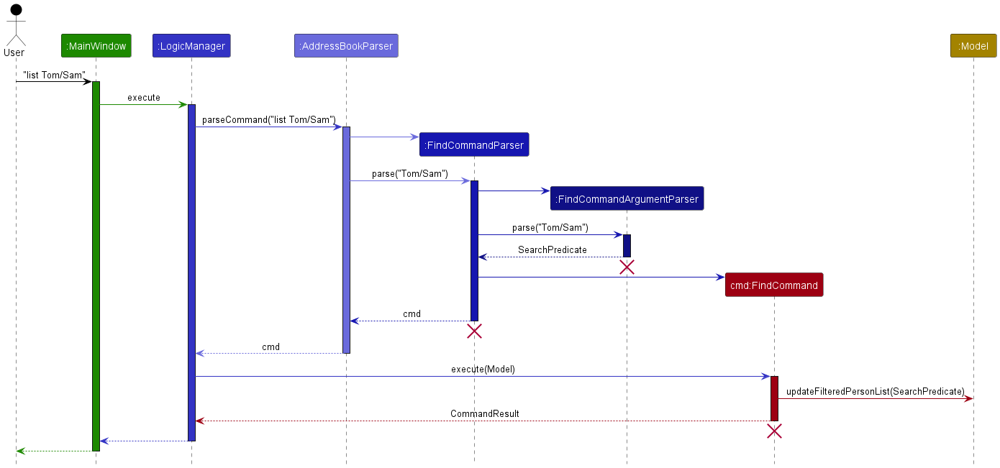

# Developer Guide

## Table of Contents
1. [Acknowledgements](#acknowledgements)
2. [Setting Up](#setting-up)
3. [Design](#design)
   1. [Architecture](#architecture)
   2. [UI Component](#ui-component)
   3. [Logic Component](#logic-component)
   4. [Model Component](#model-component)
   5. [Storage Component](#storage-component)
   6. [Common Classes](#common-classes)
4. [Implementation](#implementation)
   1. [Add Command](#add-command)
      1. [Implementation](#implementation)
      2. [Design Considerations](#design-considerations)
   2. [Edit Command](#edit-command)
      1. [Implementation](#implementation)
      2. [Design Considerations](#design-considerations)
   3. [Delete Command](#delete-command)
      1. [Implementation](#implementation)
      2. [Design Considerations](#design-considerations)
   4. [List Command](#list-command)
      1. [Implementation](#implementation)
      2. [Design Considerations](#design-considerations)
   5. [Sort Command](#sort-command)
       1. [Implementation](#implementation)
       2. [Design Considerations](#design-considerations)
   6. [Find Command](#find-command)
      1. [Implementation](#implementation)
      2. [Design Considerations](#design-considerations)
   7. [Clear Command](#clear-command)
      1. [Implementation](#implementation)
      2. [Design Considerations](#design-considerations)
   8. [Interview and Interview Commands](#interview-and-interview-commands)
      1. [Implementation](#implementation)
      2. [Design Considerations](#design-considerations)
5. [Appendix A: Requirements](#appendix-a-requirements)
   1. [Product scope](#product-scope)
   2. [User stories](#user-stories)
   3. [Use cases](#use-cases)
   4. [Non-Functional Requirements](#non-functional-requirements)
   5. [Glossary](#glossary)
6. [Appendix B: Instructions for Manual Testing](#appendix-b-instructions-for-manual-testing)
7. [Appendix C: Effort](#appendix-c-effort)
8. [Appendix D: Planned Enhancements](#appendix-d-planned-enhancements)
---
## Acknowledgements
{list here sources of all reused/adapted ideas, code, documentation, and third-party libraries – include links to the original source as well}

---
## Setting Up
Refer to the guide [Setting up and getting started].

---
## Design

### Architecture

### UI Component

**API:**
[`Ui.java`](https://github.com/AY2324S1-CS2103T-W12-3/tp/blob/master/src/main/java/seedu/application/ui/Ui.java)

**Description:**

The `UI` component is responsible for managing the user interface of the application so that it can respond according to
the user's actions or commands entered.

The `UI` component uses the JavaFx UI framework. The layout of these UI parts are defined in matching `.fxml` files that
are in the `src/main/resources/view folder`. For example, the layout of
the [`MainWindow`](https://github.com/AY2324S1-CS2103T-W12-3/tp/blob/master/src/main/java/seedu/application/ui/MainWindow.java)
is specified
in [`MainWindow.fxml`](https://github.com/AY2324S1-CS2103T-W12-3/tp/blob/master/src/main/resources/view/MainWindow.fxml).

**Functionality:**

The UI component,

- executes user commands using the `Logic` component.
- listens for changes to `Model` data so that the UI can be updated with the modified data.
- keeps a reference to the `Logic` component, because the UI relies on the Logic to execute commands.
- depends on some classes in the `Model` component, as it displays Person object residing in the Model.

**Component Structure:**

The UI consists of a `MainWindow` that is made up of parts like `CommandBox` and `ResultDisplay`.
These parts are always being shown in `MainWindow`, while other parts like `JobListPanel`, `JobDetailsPanel` are only
visible
to the user depending on the state of the application e.g. when the job list if not empty, when a job is selected.

etc. All these, including the `MainWindow`, inherit from the abstract `UiPart` class which captures the commonalities
between classes that represent parts of the visible GUI.

### Logic Component

### Model Component

### Storage Component

### Common Classes

---

## **Implementation**

This section describes some noteworthy details on how certain features are implemented.

### Add Command

The add command allows the user to add job applications with various attributes.

Compulsory attributes are `Company` and `Role`.

Optional attributes are `Status`, `Industry`, `Deadline` and `JobType`

#### Implementation

It is implemented by `AddCommand` and `AddCommandParser`.

`AddCommandParser` parses the users' input and checks for the presence of compulsory and optional prefixes.
The information is then used to create a new Job Application through the `AddCommand`.

(insert UML diagram here)

The following sequence/activity diagram illustrates the process of invocation for the AddCommand:

(insert UML diagram here)

#### Design Considerations

---

### Edit Command

The edit command allows the user to edit any field in their job application.

#### Implementation

It is implemented by `EditCommand` and `EditCommandParser`.

`EditCommandParser` parses the users' input and checks for the valid prefixes to determine the field the user wants to
change.
The information is then used to create a new Job Application with the updated fields while retaining the unchanged
fields through the `EditCommand`.

The following Class Diagram of EditCommand illustrates the interactions between EditCommand and other classes:

(insert UML diagram here)

The following sequence diagram illustrates the process of invocation for the EditCommand:

(insert UML diagram here)

#### Design Considerations

---

### Delete Command

The delete command allows the user to delete a job application using its index.

#### Implementation

The following sequence diagram illustrates the process of invocation for the command:

(insert UML sequence diagram)

The `DeleteCommand` class implements this command. It accepts an index and deletes the job application at the specified
index.

The `DeleteCommandParser` class is used to parse the arguments for the command from the user input. If the user input
does not conform to the expected format e.g. the index is out of bounds, a `ParseException` is thrown. If the user input is
valid,
then `DeleteCommandParser` returns the corresponding `DeleteCommand`.

#### Design considerations

---

### List Command

The list command allows the user to view the list of all job applications.

#### Implementation

The following sequence diagram illustrates the process of invocation for the command:

(insert UML diagram here)

The `ListCommand` class implements this command. It sets the predicate for the `filteredList` of `Model` to
`PREDICATE_SHOW_ALL_JOBS` which evaluates any `Job` to true.

#### Design Considerations

---

### Sort Command

The sort command allows the user to sort the current list of job applications based on a specified field.

#### Implementation

The following sequence diagram illustrates the process of parsing and invocation for the command:

The `SortCommand` class implements this command. It accepts a `FieldComparator` which will be set as the comparator when
`Model::sortJobs` is called.

The `SortCommandParser` class is used to parse the arguments for the command from the user input. If the user input does
not conform to the expected format, a `ParseException` is thrown. If the user input is valid, then `SortCommandParser`
generates the corresponding `FieldComparator` which will be set as the comparator when sorting the list.

The overriding `FieldComparator::compare` method compares the field indicated by the specifier. To achieve this, the
relevant field method must be invoked.

* For alphabetically sorted fields (`Company`, `Role`, `Status`, `Industry`, `JobType`), `String::compareToIgnoreCase`
  is used.
* For chronologically sorted fields (`Deadline`), a custom `compareTo()` method is implemented.

#### Design considerations

1. **Implementing sorting in reverse order**: Create a command which, when called, would reverse the order of the list sorted.
   * *Pros*: It is relatively simple to implement, as the `Comparator::reversed` method allows the ordering of the list
     to be reversed easily.
   * *Cons*: This is not an important feature which users will need frequently, and it requires additional time to be
     spent on implementing the command and creating test cases. In light of the tight schedule and other more important
     features, we decided that this feature was not a priority.
  
2. **Implementing sorting by multiple fields**: When multiple prefixes are provided, sort by the prefix listed first, and if two
   applications have the same value in that field, sort by the next prefix listed.
   * *Pros*: This is slightly more complicated to implement, requiring a `Comparator` which can sort fields according to
     the desired order of importance.
   * *Cons*: Once again, we decided that this is not an important feature, as the primary purpose of the command is to
     allow users to group similar applications together. Grouping by one field should be sufficient for the user to have
     organised list.

---

### Find Command

The find command allows the user to get a filtered list of job applications.

#### Implementation

The following sequence diagram illustrates the process of parsing and invocation for the command:

The `FindCommand` class implements this command. Its constructor accepts a `CombinedPredicate` which will be set as the
predicate when `Model::updateFilteredJobList` is called.

The `FindCommandParser` class is used to parse the arguments for the command from the user input. If the user input does
not conform to the expected format, a `ParseException` is thrown. If the user input is valid, then `FindCommandParser`
generates the corresponding `FindCommand`.

The `CombinedPredicate` simply represents the logical AND of multiple `Predicate<Job>` objects generated by
`FindCommandParser`. Each can be either:
1. A `FieldContainsKeywordsPredicate` which represents a search
within a specific field, or
2. Another `Predicate<Job>` which represents a search in any field. This is generated using the
   `FieldContainsKeywordsPredicate::getPreamblePredicate` method.

#### Design considerations

1. **How to combine multiple conditions**
   * *Chosen implementation*: The constructor of a `FindCommand` accepts a `CombinedPredicate`. This predicate is
     contains multiple other `Predicate` objects chained together with `Predicate::and` and `Predicate::or`. This
     assigns the responsibility of handling multiple search conditions solely to the `FindCommandParser` class. The
     `FindCommand` class behaves the same way regardless of the number of conditions specified by the user.
   * *Alternative*: Allow the constructor of `FindCommand` to accept a list of `FieldContainsKeywordsPredicates`, each
     representing a condition specified by the user. This implementation was not adopted as it would involve changing
     the `FindCommand` class to handle multiple conditions. However, this should be handled purely by the
     `FindCommandParser` class as how the conditions are chained depends on the user input.

---

### Clear Command

The clear command allows the user to delete all job applications.

#### Implementation

The following sequence diagram illustrates the process of invocation for the command:

(insert UML sequence diagram)

The `ClearCommand` class implements this command.

#### Design considerations

---
## **Appendix A: Requirements**

### Product scope

**Target user profile**:

* NUS fresh graduates who are looking for jobs
* Has a need to manage a significant number of job applications
* Prefers desktop apps over other types
* Able to type fast
* Prefers typing to mouse interactions
* Reasonably comfortable using CLI apps

**Value proposition**: Manage job applications faster than a typical mouse/GUI-driven app.

---
### User stories

Priorities: High (must have) - `***`, Medium (nice to have) - `**`, Low (unlikely to have) - `*`

| Priority | As a … | I want to …                                                                       | So that I can…                                   |
|----------|--------|-----------------------------------------------------------------------------------|--------------------------------------------------|
| `***`    | user   | add applications I have applied to, including their names and contact information | keep track and manage my job applications        |
| `***`    | user   | record application deadlines for each job listing                                 | stay organized on application deadlines          |
| `***`    | user   | mark the status of each application                                               | keep track of application progress               |
| `***`    | user   | delete job applications that are no longer relevant                               | update my list according to my current interests |
| `***`    | user   | view all applications I have added                                                |                                                  |

*{More to be added}*

---

### Use cases

For all use cases below, the **System** is the `JobFindr` (JobFindr) and the **Actor** is the `User`, unless specified otherwise. Furthermore, any reference to the `list` refers to the main list of job applications, unless specified otherwise.

**System:** JobFindr

**Actor:** User

**Application:** Job Application

#### Use case: UC1 - Add an application

**MSS**

1. User requests to add a job application to the list.
2. System adds the application.

   Use case ends.

**Extensions**

* 1a. System detects an error in the input.
    * 1a1. System shows an error message.

      Use case resumes at step 1.

#### Use case: UC2 - Delete an application

**MSS**

1. User requests to delete an application in the list, specifying an index.
2. System deletes the application at the index specified.

   Use case ends.

**Extensions**

* 2a. The list is empty.

  Use case ends.

* 3a. The given index is invalid.
    * 3a1. System shows an error message.

      Use case resumes at step 3.

#### Use case: UC3 - List applications

**MSS**

1. User requests to list applications
2. System shows a list of applications

   Use case ends.

#### Use case: UC4 - Find an application

**MSS**

1. User lists application UC3.
2. User requests to find a list of applications based on the given keywords.
3. System shows a list of applications with any of the fields (`Company`, `Role`, `Status`, `Deadline`, `JobType`, `Industry`) containing the given keywords.

   Use case ends.

**Extensions**

* 2a. No applications match the given keywords.

   Use case ends.

#### Use case: UC5 - Find an application by specific field(s)

**MSS**
1. User lists application UC3.
2. User requests to find a list of applications based on the given keywords for specific field(s).
3. System shows a list of applications with the given field(s) containing the given keywords for each field.

   Use case ends.

**Extensions**

* 2a. No applications match the given keywords.

   Use case ends.

#### Use case: UC6 - Edit an application

**MSS**
1. User finds application UC4.
2. User requests to edit an application in the list, specifying an index.
3. System updates the relevant fields in the application at the index specified.

   Use case ends.

**Extensions**

* 2a. The list is empty.

   Use case ends.

* 3a. The given index is invalid.
   * 3a1. System shows an error message.

     Use case resumes at step 2.

#### Use case: UC7 - Sort applications

**MSS**
1. User requests to sort the list of applications by a specific field.
2. System sorts the list of applications by the given field.

   Use case ends.

**Extensions**

* 1a. The list is empty.

   Use case ends.

* 2a. The given field is invalid.
   * 2a1. System shows an error message.

     Use case resumes at step 1.

#### Use case: UC8 - Select an application

**MSS**
1. User requests to select an application in the list by clicking on it.
2. System displays details of the selected application.

   Use case ends.

#### Use case: UC9 - Add interview

**MSS**
1. User finds application UC4.
2. User requests to add an interview to the application, specifying an index.
3. System creates an Interview object.
4. System adds the interview to the application at the index specified.

   Use case ends.

**Extensions**
* 1a. The application does not exist.
  * 1a1. System shows an error message.

    Use case resumes at step 2.
* 2a. The given index is invalid.
  * 2a1. System shows an error message.

    Use case resumes at step 2.
* 2b. The interview already exists.
  * 2b1. System shows an error message.

    Use case resumes at step 2.
* 2c. The interview has invalid fields.
  * 2c1. System shows an error message.

    Use case resumes at step 2.

#### Use case: UC10 - Delete interview

**MSS**
1. User requests to delete an interview from the application, specifying the interview index and the application index.
2. System deletes the interview from the application at the index specified.

   Use case ends.

**Extensions**
* 1a. The application does not exist.
  * 1a1. System shows an error message.

    Use case resumes at step 2.
* 1b. The interview to be deleted does not exist.
  * 1b1. System shows an error message.

    Use case resumes at step 2.

#### Use case: UC11 - Edit interview

**MSS**
1. User requests to edit an interview from the application, specifying the interview index and the application index.
2. System updates the relevant fields in the interview at the index specified.

   Use case ends.

**Extensions**
* 1a. The application does not exist.
  * 1a1. System shows an error message.

    Use case resumes at step 2.
* 1b. The interview to be edited does not exist.
  * 1b1. System shows an error message.

    Use case resumes at step 2.
* 1c. The interview to be created has invalid fields.
  * 1c1. System shows an error message.

    Use case resumes at step 2.

#### Use case: UC12 - Clear all applications

**MSS**
1. User requests to clear all applications.
2. System clears all applications.

   Use case ends.

#### Use case: UC13 - Exit application

**MSS**
1. User requests to exit the application.
2. System exits the application.

   Use case ends.

#### Use case: UC14 - Open help window

**MSS**
1. User requests to open the help window.
2. System opens the help window.

   Use case ends.

---
### Non-Functional Requirements

**Availability**

- The application is available for download on our GitHub release page in the form of a JAR file.

**Capacity**

- The application should be able to store up to 1000 job applications.

**Performance**

- Response time to any user command is within 3 seconds.
- The application should be able to contain and handle up to 300 job applications before facing any form of performance bottleneck issues.

**Reliability**

- The application should guide the user if it is unable to execute any of the user actions for various reasons.

**Compatibility**

- The application should work as intended on any mainstream operating systems.
- The application is guaranteed to work on Java version 11.

**Usability**

- A user with above average typing speed for regular English text (i.e. not code, not system admin commands) should be able to accomplish most of the tasks faster using commands than using the mouse.

**Robustness**

- The application should remain highly relevant to job applications at any point in the future.

**Integrity**

- There should be user updates to the job applications to ensure its integrity.
- When there is an application update, it should not compromise the integrity of the save file.

**Maintainability**

- The application should be compliant with the coding standard and best coding practices highlighted in CS2103T.
- The application should be designed such that any programmer with at least a year of experience should be able to read, maintain, and contribute to the source code easily.

**Process**

- The project features are to be in line with any changes to real world job application process.

**Project Scope**

- The application requires manual addition of job applications into the system.

**Privacy**

- The application should not store any information related to the user's job applications in remote storage.

---
### Glossary

* **Mainstream OS**: Windows, Linux, Unix, OS-X
* **CLI**: Command Line Interface
* **GUI**: Graphical User Interface
* **UI**: User Interface
* **MSS**: Main Success Scenario
* **Job Application**: A record of a job application that contains relevant information.
* **Fields**: The attributes of a job application, namely company, role, status, deadline, job type, industry, and interview details.

---
## **Appendix B: Instructions for Manual Testing**

Given below are instructions to test the app manually.

> Note: These instructions only provide a starting point for testers to work on; testers are expected to do more *exploratory* testing.

### B.1. Launch and Shutdown

1. Initial launch
   1. Download the jar file and copy into an empty folder
   2. Double-click the jar file

      Expected: Shows the GUI with a set of sample contacts. The window size may not be optimum.

2. Saving window preferences
   1. Resize the window to an optimum size. Move the window to a different location. Close the window.
   2. Re-launch the app by double-clicking the jar file.

      Expected: The most recent window size and location is retained.

### B.2. View Sample Job Application List

1. Close JobFindr.
2. Delete the file `./ApplicationBook.json` in the data folder (if applicable).
3. Launch JobFindr.

   Expected: A sample job application list with 7 job applications is loaded.

### B.3. View Job Application List

1. Viewing the list of job application(s).
   1. Test case: `list`

      Expected: The list of job applications is shown in the GUI.

### B.4. Add Job Application

1. Adding a job application.
   1. Test case: `add c/Microsoft r/Project Manager d/Dec 31 2023 1400 i/Technology s/Pending t/FULL_TIME`

      Expected: New job application is added to the bottom of the list. Details of the newly-added application is shown in the feedback box.

   2. Test case: `add r/Data Analyst`

        Expected: Job application is not added. Error details are shown in feedback box.

### B.5. Delete Job Application

1. Deleting a job application by index.
   1. Prerequisites: At least one job application is displayed.
      1. Test case: `delete 1`

         Expected: The first job application is deleted from the list. Details of the deleted application is shown in the feedback box.
      2. Test case: `delete 0`

         Expected: No job application is deleted. Error details are shown in feedback box.
      3. Other test cases: `delete`, `delete x` (where x is larger than the list size)

            Expected: Similar to test case 2.

### B.6. Edit Job Application

1. Editing a job application by index.
   1. Prerequisites: At least one job application is displayed.
      1. Test case: `edit 1 c/Google r/Software Engineer`

         Expected: The first job application is edited. Details of the edited application is shown in the feedback box.
      2. Test case: `edit 0 c/Google r/Software Engineer`

         Expected: No job application is edited. Error details are shown in feedback box.
      3. Test case: `edit c/Google r/Software Engineer`

            Expected: Similar to test case 2.
      4. Test case: `edit 1 d/Nov 31 2023 1400`

            Expected: Invalid date format. Error details are shown in feedback box.
      5. Test case: `edit 1 s/`

            Expected: Invalid status format. Error details are shown in feedback box.
      6. Test case: `edit 1 q/`

            Expected: Invalid prefix. Error details are shown in feedback box.'

### B.7. Add Interview to Job Application

1. Adding an interview to a job application by index.
   1. Prerequisites: List all job applications using `list`.
      1. Test case: `interview add 1 t/Technical a/Changi Business Park Central 1, 486036 d/Nov 30 2023 1400`

         Expected: Interview is added to the job application. Details of the interview is shown in the job details panel.
      2. Test case: `interview add 0 t/Technical a/Changi Business Park Central 1, 486036 d/Nov 30 2023 1400`

         Expected: No interview is added. Error details are shown in feedback box.
      3. Test case: `interview add 1 t/Technical d/Nov 30 2023 1400`

            Expected: No interview is added. All fields are compulsory. Error details are shown in feedback box.

### B.8. Delete Interview from Job Application

1. Deleting an interview from a job application by index.
   1. Prerequisites: List all job applications using `list`.
      1. Test case: `interview delete 1 from/1`

         Expected: Interview is deleted from the job application. Details of the interview is removed from the job details panel.
      2. Test case: `interview delete 0 from/1`

         Expected: No interview is deleted. Error details are shown in feedback box.
      3. Test case: `interview delete 1 from/0`

            Expected: Similar error to test case 2.

### B.9. Edit Interview from Job Application

1. Editing an interview from a job application by index.
   1. Prerequisites: List all job applications using `list`.
      1. Test case: `interview edit 1 from/1 t/Technical a/Changi Business Park Central 1, 486036 d/Nov 30 2023 1200`

         Expected: Interview is edited. Details of the interview is updated in the job details panel.
      2. Test case: `interview edit 0 from/1 t/Technical a/Changi Business Park Central 1, 486036 d/Nov 30 2023 1400`

         Expected: No interview is edited. Error details are shown in feedback box.
      3. Test case: `interview edit 1 from/0 t/Technical a/Changi Business Park Central 1, 486036 d/Nov 30 2023 1400`

            Expected: Similar error to test case 2.
      4. Test case: `interview edit 1 from/1 t/Technical d/Nov 30 2023 1400`

            Expected: Interview is edited. Details of the interview is updated in the job details panel.
      5. Test case: `interview edit 1 from/1 t/Home`

            Expected: No interview is edited. Invalid interview type. Error details are shown in feedback box.

### B.10. Sort Job Application List

1. Sorting the list of job application(s).
   1. Prerequisites: At least one job application is displayed.
      1. Test case: `sort c/`

         Expected: The list of job applications is sorted by company name.
      2. Test case: `sort r/`

         Expected: The list of job applications is sorted by role.
      3. Test case: `sort s/`

            Expected: The list of job applications is sorted by status.
      4. Test case: `sort d/`

            Expected: The list of job applications is sorted by deadline.
      5. Test case: `sort t/`

            Expected: The list of job applications is sorted by job type.
      6. Test case: `sort i/`

            Expected: The list of job applications is sorted by industry.
      7. Test case: `sort x/`

            Expected: No sorting is done. Error details are shown in feedback box.
   2. Prerequisites: Use `find` command to reduce size of job application list without deleting any job applications. For example, `find r/program`.
      1. Test case: `sort c/`

         Expected: No change to the number of job applications displayed.
    3. Prerequisites: Ensure current job applications list has multiple applications with fields of the same value. For example, multiple applications with the `role` of `software developer`.
       1. Test case: `sort r/`

          Expected: No change in order of job applications with identical roles.

### B.11. Find Job Application

1. Finding a job application by keywords.
   1. Prerequisites: Starting with the sample job application list. Refer to B.2. for steps to load the sample job application list.
      1. Test case: `find`

         Expected: No change in list. Error details shown in the feedback box as at least one of the optional parameters must be entered.
      2. Test case: `find full_time`

         Expected: Applications with the keyword `full_time` in any field are shown in the list.
      3. Test case: `find s/Pending`

            Expected: All applications with `PENDING` status are shown in the list.
      4. Test case: `find Dec`

            Expected: All applications with `Dec` in the deadline are shown in the list.
      5. Test case: `find Shop`

            Expected: No application is listed. `find` does not work with partial keywords.

### B.12. Clear Job Application List

1. Clearing the list of job application(s).
   1. Prerequisites: At least one job application is displayed.
      1. Test case: `clear`

         Expected: The list of job applications is cleared. The list is empty.

### B.13. Exit JobFindr

1. Exiting the application.
   1. Test case: `exit`

      Expected: The application window closes.

### B.14. Help

1. Opening the help window.
   1. Test case: `help`

      Expected: The help window opens.

---

## **Appendix C: Effort**

Explain the difficulty level, challenges faced, effort required, and achievements of the project.

---

## **Appendix D: Planned Enhancements**

listing fixes you propose to add in the near future, to counter known feature flaws.
This section may contain up to team_size x 2 enhancements e.g., a 5-person team can have up to 10 enhancements.
Each enhancement should be specific, describing the feature flaw it addresses and how exactly the feature will be changed, providing sample UIs/inputs/outputs if applicable. e.g.,
The current error message for a failed contact deletion Operation failed! is too general. We plan to make the error message also mention which action failed and the reason for the failure: The contact Amy Lee could not be deleted as it is referenced by another contact Ben Chua.
Each enhancement should be a tweak to an existing feature, and should not be a new feature altogether.
type.FeatureFlaw bug reports matching an item in this section will not be penalized for the team, and testers will not earn credit for reporting them either. However, testers can report type.FeatureFlaw bugs on the enhancements listed in this section, if they think the planned feature tweak itself is flawed/inadequate.
