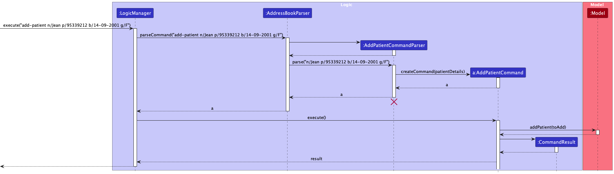

## Table Of Contents

* Table of Contents
  {:toc}

--------------------------------------------------------------------------------------------------------------------

## **Acknowledgements**

MediLink Contacts is a brownfield software project based
off [AddressBook Level-3](https://se-education.org/addressbook-level3/), created under the module CS2103 for the School
of Computing in the National University of Singapore

Java dependencies:

* Jackson for JSON data storage
* JavaFX for our GUI
* JUnit5 for testing

Documentation dependencies:

* Jekyll

--------------------------------------------------------------------------------------------------------------------

## **Setting up, getting started**

Refer to the guide [_Setting up and getting started_](SettingUp.md).

--------------------------------------------------------------------------------------------------------------------

## **Design**

:bulb: **Tip:** The `.puml` files used to create diagrams in this document `docs/diagrams` folder. Refer to the [
_PlantUML
Tutorial_ at se-edu/guides](https://se-education.org/guides/tutorials/plantUml.html) to learn how to create and edit
diagrams.

### Architecture

The ***Architecture Diagram*** given above explains the high-level design of the App.

Given below is a quick overview of main components and how they interact with each other.

**Main components of the architecture**

**`Main`** (consisting of
classes [`Main`](https://github.com/se-edu/addressbook-level3/tree/master/src/main/java/seedu/address/Main.java)
and [`MainApp`](https://github.com/se-edu/addressbook-level3/tree/master/src/main/java/seedu/address/MainApp.java)) is
in charge of the app launch and shut down.

* At app launch, it initializes the other components in the correct sequence, and connects them up with each other.
* At shut down, it shuts down the other components and invokes cleanup methods where necessary.

The bulk of the app's work is done by the following four components:

* [**`UI`**](#ui-component): The UI of the App.
* [**`Logic`**](#logic-component): The command executor.
* [**`Model`**](#model-component): Holds the data of the App in memory.
* [**`Storage`**](#storage-component): Reads data from, and writes data to, the hard disk.

[**`Commons`**](#common-classes) represents a collection of classes used by multiple other components.

**How the architecture components interact with each other**

The *Sequence
Diagram* below shows how the components interact with each other for the scenario where the user issues the
command `delete NRIC`.

Each of the four main components (also shown in the diagram above),

* defines its *API* in an `interface` with the same name as the Component.
* implements its functionality using a concrete `{Component Name}Manager` class (which follows the corresponding
  API `interface` mentioned in the previous point.

For example, the `Logic` component defines its API in the `Logic.java` interface and implements its functionality using
the `LogicManager.java` class which follows the `Logic` interface. Other components interact with a given component
through its interface rather than the concrete class (reason: to prevent outside component's being coupled to the
implementation of a component), as illustrated in the (partial) class diagram below.

The sections below give more details of each component.

### UI component

The **API** of this component is specified
in [`Ui.java`](https://github.com/se-edu/addressbook-level3/tree/master/src/main/java/seedu/address/ui/Ui.java)

The UI consists of a `MainWindow` that is made up of parts
e.g.`CommandBox`, `ResultDisplay`, `PersonListPanel`, `StatusBarFooter` etc. All these, including the `MainWindow`,
inherit from the abstract `UiPart` class which captures the commonalities between classes that represent parts of the
visible GUI.

The `UI` component uses the JavaFx UI framework. The layout of these UI parts are defined in matching `.fxml` files that
are in the `src/main/resources/view` folder. For example, the layout of
the [`MainWindow`](https://github.com/se-edu/addressbook-level3/tree/master/src/main/java/seedu/address/ui/MainWindow.java)
is specified
in [`MainWindow.fxml`](https://github.com/se-edu/addressbook-level3/tree/master/src/main/resources/view/MainWindow.fxml)

The `UI` component,

* executes user commands using the `Logic` component.
* listens for changes to `Model` data so that the UI can be updated with the modified data.
* keeps a reference to the `Logic` component, because the `UI` relies on the `Logic` to execute commands.
* depends on some classes in the `Model` component, as it displays `Person` object residing in the `Model`.

### Logic component

**API** : [`Logic.java`](https://github.com/se-edu/addressbook-level3/tree/master/src/main/java/seedu/address/logic/Logic.java)

Here's a (partial) class diagram of the `Logic` component:

The sequence diagram below illustrates the interactions within the `Logic` component, taking `execute("delete NRIC")` API
call as an example.

:information_source: **Note:** The lifeline for `DeleteCommandParser` should end at the destroy marker (X) but due to a limitation of PlantUML, the lifeline reaches the end of diagram.

How the `Logic` component works:

1. When `Logic` is called upon to execute a command, it is passed to an `AddressBookParser` object which in turn creates
   a parser that matches the command (e.g., `DeleteCommandParser`) and uses it to parse the command.
2. This results in a `Command` object (more precisely, an object of one of its subclasses e.g., `DeleteCommand`) which
   is executed by the `LogicManager`.
3. The command can communicate with the `Model` when it is executed (e.g. to delete a person).
4. The result of the command execution is encapsulated as a `CommandResult` object which is returned back from `Logic`.

Here are the other classes in `Logic` (omitted from the class diagram above) that are used for parsing a user command:

How the parsing works:

* When called upon to parse a user command, the `AddressBookParser` class creates an `XYZCommandParser` (`XYZ` is a
  placeholder for the specific command name e.g., `AddCommandParser`) which uses the other classes shown above to parse
  the user command and create a `XYZCommand` object (e.g., `AddCommand`) which the `AddressBookParser` returns back as
  a `Command` object.
* All `XYZCommandParser` classes (e.g., `AddCommandParser`, `DeleteCommandParser`, ...) inherit from the `Parser`
  interface so that they can be treated similarly where possible e.g, during testing.

### Model component

**API** : [`Model.java`](https://github.com/se-edu/addressbook-level3/tree/master/src/main/java/seedu/address/model/Model.java)

The `Model` component,

* stores the address book data i.e., all `Person` objects (which are contained in a `UniquePersonList` object).
* stores the currently 'selected' `Person` objects (e.g., results of a search query) as a separate _filtered_ list which
  is exposed to outsiders as an unmodifiable `ObservableList<Person>` that can be 'observed' e.g. the UI can be bound to
  this list so that the UI automatically updates when the data in the list change.
* stores a `UserPref` object that represents the user’s preferences. This is exposed to the outside as
  a `ReadOnlyUserPref` objects.
* does not depend on any of the other three components (as the `Model` represents data entities of the domain, they
  should make sense on their own without depending on other components)

:information_source: **Note:** An alternative (arguably, a more OOP) model is given below. It has a `Tag` list in the `AddressBook`, which `Person` references. This allows `AddressBook` to only require one `Tag` object per unique tag, instead of each `Person` needing their own `Tag` objects. 

### Storage component

**API** : [`Storage.java`](https://github.com/se-edu/addressbook-level3/tree/master/src/main/java/seedu/address/storage/Storage.java)

The `Storage` component,

* can save both address book data and user preference data in JSON format, and read them back into corresponding
  objects.
* inherits from both `AddressBookStorage` and `UserPrefStorage`, which means it can be treated as either one (if only
  the functionality of only one is needed).
* depends on some classes in the `Model` component (because the `Storage` component's job is to save/retrieve objects
  that belong to the `Model`)

### Common classes

Classes used by multiple components are in the `seedu.addressbook.commons` package.

--------------------------------------------------------------------------------------------------------------------

## **Implementation**

This section describes some noteworthy details on how certain features are implemented.

### Add Patient/Doctor Feature

This feature allows users to add patients or doctors to the address book. No duplicated person should be added. There
are many fields for each patient/doctor which can be found in the user guide.

#### Implementation

Implementation of adding patients is similar to the original addCommand. The adding mechanism is facilitated by the
AddressBook in the model.

Given below is an example usage scenario and how the add patient/doctor mechanism behaves at each step.

Step 1. The user launches the application for the first time. The AddressBook will be initialized with the initial
address book state.

Step 2. The user types `add-patient` (or `add-Doctor`) as command, with the appropriate arguments for the person, for
example, `add-patient n/John Doe ic/S9851386G g/M p/98765432 ec/90123456 e/johnd@example.com a/John street, block 123, #01-01 d/T0123456H c/pneumothorax b/O+`.

Step 3. The `AddressBookParser` parses the arguments and determine the required command parser based on the first word
of the arguments.

Step 4. Then `addPatientCommandParser` parses the remaining arguments and creates an `AddPatientCommand` with the
details of the patient given.

:information_source: **Note:** If the details of the person added does not match the correct format for any fields,
there will be an error telling user that the attributes are in the wrong format.

Step 5. The `AddPatientCommand` then gets executed and calls the Model#addPatient() and the patient will be added to
the `uniquePatientList` of the addressbook in the model.

:information_source: **Note:** If the Person to be added is already in the respective list in the addressbook, it will
return an error saying that this is a duplicate person. This will be checked during the execution of the Add command.

Step 6. The UI should display using the updated list of patients and the newly added patient should be in the patient
section of the GUI.

The following sequence diagram shows how the add patient works:

### Design Considerations

1. Option 1 (Current Choice): Use two different commands for adding patients and doctors
    - Pros: Easier to implement. Clear to the user which type of person to add, since we have different fields for
      patients and doctors.
    - Cons: Increased number of classes and tests.
2. Option 2: Use a single add command like the original implmentation
    - Pros: Fewer files to be changed.
    - Cons: Harder to implement, since we will have more checkings to be done when adding the person.

### Edit Patient/Doctor Feature

This feature allows users to edit patients or doctors to the address book. The person must already
exist in the address book. There are many fields for each patient/doctor to be
edited which can be found in the user guide.

#### Implementation

Implementation of editing patients is similar to the original editCommand. The editing mechanism is facilitated by the
AddressBook in the model.

Given below is an example usage scenario and how the edit patient/doctor mechanism behaves at each step.

Step 1. The user launches the application for the first time. The AddressBook will be initialized with the initial
address book state.

Step 2. The user types `edit T0123456H` (or the relevant ic number) as command, with the appropriate arguments for the person, for
example, `edit T0123456H n/John Doe g/M p/98765432 ec/90123456 e/johnd@example.com a/John street, block 123, #01-01 d/T0123456H c/pneumothorax b/O+`.

Step 3. The `AddressBookParser` parses the arguments and determines the that EditCommandParser is required based on the first word
of the arguments.

Step 4. Then `editCommandParser` parses the remaining arguments and creates an `EditCommand` with the
details of the patient given.

:information_source: **Note:**  If the details of the person added does not match the correct format for any fields,
there will be an error telling user that the attributes are in the wrong format. Also, if there are no attributes passed there will be an error.
It's ok if the attributes are the same as the original attributes. 
Lastly, an NRIC must be provided and if the nric cannot be found within the list of doctors and patients, there will be an error.

Step 5. The `EditCommand` then gets executed and calls the Model#setPerson() with the original person and the new
edited person. The original person will be replaced by the edited person.

Step 6. The UI should display using the updated list of patients and the newly edited person should reflect the changes
in the GUI.

The following sequence diagram shows how the add patient works:

### Design Considerations

1. Option 1 (Current Choice): Use a single EditCommand for both doctors and patients
    - Pros: Easier for the user. Can use a single command to edit both.
    - Cons: The program has to check whether the person is a doctor or patient. This mandates that a person cannot
    be both a patient as a doctor, as patients have additional attributes. The program also might be slightly slower 
   since it has to check through both the doctors and patients list to locate the person.
2. Option 2: Use 2 commands edit-patient and edit-doctor
    - Pros: The program might be faster. If you call edit-doctor you only need to search through a few doctors
      rather than all the patients as well.
    - Cons: Harder to implement, and there's a need to create new classes and add repeated code.
      More commands for the user to remember as well.

### Delete Patient/Doctor Feature

This feature allows users to delete the desired patient or doctor based on the
nric provided.

#### Implementation

Implementation of the delete feature is similar to the original delete command, except that it is done with Ic instead
of Index.

Given below is an example usage scenario and how the delete mechanism behaves at each step.

Step 1. The user launches the application for the first time. The AddressBook will be initialized with the initial
address book state.

Step 2. The user populates the AddressBook with patients and doctors using the appropriate commands, if not already
done.

Step 3. The user types `delete` as the command, with the appropriate nric of the patient/doctor to be deleted, for
example `delete S9567312G`.

Step 4. The `deleteCommandParser` parses the delete command and creates a `deleteCommand` with the target Ic.

Step 5. The PatientCard / DoctorCard then processes the deletion and The UI should display the updated list without the
deleted Doctor/Patient.

### Create New Appointment Feature

This feature allows users to create a new appointment between patients and doctors. The patient and doctor for whom the
appointment is created should already exist in the address book. No conflicting appointment should be added (i.e, the
same doctor/patient cannot have 2 different appointments at the same time. More details about the fields for Appointment
can be found in the user guide.

#### Implementation

Implementation of creating an appointment is comprised of fairly new code. The adding mechanism is facilitated by the
AddressBook in the model.

Given below is an example usage scenario and how the new appointment mechanism behaves at each step.

Step 1. The user launches the application for the first time. The AddressBook will be initialized with the initial
address book state.

Step 2. The user populates the AddressBook with patients and doctors using the appropriate commands, if not already
done.

Step 3. The user types `new-appointment`as command, with the appropriate arguments for the appointment, for example,
`new-appt pic/T0123456H dic/S9851586G time/2022-02-14 13:00:00`.

Step 4. The `Doctor` and `Patient` Class methods are used to add the details to the respective objects. This works in
a similar way to how the `NRIC` Class works for the `Doctor` and `Patient` Classes. `Appointment` is done externally for
OOP reasons.

Step 5. The `addPatientCommandParser`/ `addDoctorCommandParser` parses the Appointment and creates an `AddPatientCommand`/
`addDoctorCommand` with the details of the `Appointment` given.

:information_source: **Note:** If the details of the person added does not match the correct format for any fields,
there will be an error telling user that the attributes are in the wrong format.

Step 6. The `PatientCard` / `DoctorCard` then processes the appointment details and The UI should display the appointment
details for each Person in the AddressBook.

The following sequence diagram shows how the New Appointment works:

 //change this

### Undo/redo feature

#### Implementation

The proposed undo/redo mechanism is facilitated by two ArrayLists of AddressBooks stored in the Model Manager class,
which are the redoList and the undoList. Each time an action is performed, the two lists are updated accordingly
by the following three methods:

* `Model#updateBackup()`— Saves the current address book state in its history.
* `Model#undo()`— Restores the previous address book state by retrieving it from the undoList.
* `Model#redo()`— Restores a previously undone address book state by retrieving it from the redoList.

Given below is an example usage scenario and how the undo/redo mechanism behaves at each step.

Step 1. The user launches the application for the first time. The undoList and RedoList will both be initialised as
empty ArrayLists, and the `addressBook` instance, `ab0`,  stores the current AddressBook.

Step 2. The user executes `delete NRIC` command to delete a person in the address book. The `delete` command
calls `Model#updateBackup()`, causing the current `addressBook` instance, `ab0`, to be added to the undoList while the 
model now stores the updated address book with the deleted person, `ab1`,  as the new `addressBook` instance.

Step 3. The user executes `add-patient n/David …​` to add a new patient. The `add` command also
calls `Model#updateBackup()`, causing another modified address book state to be saved into undoList, `ab1`, and the 
current `addressBook` instance to be updated to the new `ab2`.

:information_source: **Note:** If a command fails its execution, it will not call `Model#updateBackup()`, so the address book state will not be saved into the undoList.

Step 4. The user now decides that adding the person was a mistake, and decides to undo that action by executing
the `undo` command. The `undo` command will call `Model#undo()`, which will add the current `addressBook` instance,
`ab2` to redoList, as well as removing the most recently added AddressBook, `ab1`, from the undoList and setting it as 
the new `addressBook` instance.

:information_source: **Note:** If the undoList is empty, then there are no previous AddressBook states to restore. The `undo` command checks if this is the case. If so, it will return an error to the user rather
than attempting to perform the undo.

The following sequence diagram shows how the undo operation works:

:information_source: **Note:** The lifeline for `UndoCommand` should end at the destroy marker (X) but due to a limitation of PlantUML, the lifeline reaches the end of diagram.

The `redo` command does the opposite — it calls `Model#redo()`, which restores the addressBook to its previous state 
before the `undo` command.

:information_source: **Note:** If the redoList is empty, then there are no undone AddressBook states to restore. The `redo` command checks if this is the case. If so, it will return an error to the user rather than attempting to perform the redo.

Step 5. The user then decides to execute the command `list`. Commands that do not modify the address book, such
as `list`, will usually not call `Model#commitAddressBook()`, `Model#undoAddressBook()` or `Model#redoAddressBook()`.
Thus, the `addressBookStateList` remains unchanged.

Step 6. The user then decides that the person he added in step 3 was not a mistake, and executes the command `redo`.
The `redo` command will call `Model#redo()`, which will add the current `addressBook` instance,
`ab1` to undoList, as well as removing the most recently added AddressBook, `ab2`, from the redoList and setting it as
the new `addressBook` instance. Notice that the current state has been restored to the state at the end of step 3.

:information_source: **Note:** If the number of AddressBook states stored
in the undoList reaches 5, any additional commands that makes changes to the address book will lead to the least
recently added state in the undoList to be purged as a redundant state and will no longer be accessible via `undo`.

The following activity diagram summarizes what happens when a user executes a new command:

#### Design considerations:

**Aspect: How undo & redo executes:**

* **Alternative 1 (current choice):** Saves the entire address book.
    * Pros: Easy to implement.
    * Cons: May have performance issues in terms of memory usage.

* **Alternative 2:** Individual command knows how to undo/redo by
  itself.
    * Pros: Will use less memory (e.g. for `delete`, just save the person being deleted).
    * Cons: We must ensure that the implementation of each individual command are correct.

_{more aspects and alternatives to be added}_

### \[Proposed\] Data archiving

_{Explain here how the data archiving feature will be implemented}_

--------------------------------------------------------------------------------------------------------------------

## **Documentation, logging, testing, configuration, dev-ops**

* [Documentation guide](Documentation.md)
* [Testing guide](Testing.md)
* [Logging guide](Logging.md)
* [Configuration guide](Configuration.md)
* [DevOps guide](DevOps.md)

--------------------------------------------------------------------------------------------------------------------

## **Appendix: Requirements**

### Product scope

**Target user profile**: Clinic staff who

* has a need to manage a significant number of contacts
* prefer desktop apps over other types
* can type fast
* prefers typing to mouse interactions
* is reasonably comfortable using CLI apps

**Value proposition**: When medical emergencies arise, it becomes crucial to provide rapid access to emergency contacts
and patients' details. Our app provides a way to efficiently navigate through pertinent contacts for their everyday
tasks.

### User stories

Priorities: High (must have) - `* * *`, Medium (nice to have) - `* *`, Low (unlikely to have) - `*`

| Priority | As a …​                           | I want to …​                        | So that I can…​                                                        |
|----------|-----------------------------------|-------------------------------------|------------------------------------------------------------------------|
| `* * *`  | new user                          | see usage instructions              | refer to instructions when I forget how to use the App                 |
| `* * *`  | Hospital Staff                    | add a new patient                   | access patient details quickly next time                               |
| `* * *`  | Hospital Staff                    | add a new doctor                    | include doctors assigned to the patients                               |
| `* * *`  | Hospital Staff                    | delete a patient/doctor             | remove entries that I no longer need                                   |
| `* * *`  | Hospital Staff                    | add an appointment                  | tell which patient/doctor is coming at what time                       |
| `* * *`  | Hospital Staff                    | update patient's details            | information remains accurate                                           |
| `* * *`  | Hospital Staff                    | update doctor's details             | information remains accurate                                           |
| `* * *`  | Hospital Staff                    | find a patient/doctor by NRIC       | locate details of persons without having to go through the entire list |
| `* * *`  | Hospital Staff                    | reassign patients to doctors/nurses | account for changes in the people treating the patients                |
| `* *`    | Hospital Staff                    | hide private contact details        | minimize chance of someone else seeing them by accident                |
| `*`      | Hospital Staff with many contacts | sort persons by name                | locate a person easily                                                 |
| `*`      | Hospital Staff                    | undo previous command               | prevent mistakes                                                       |
| `*`      | Hospital staff                    | redo previously undid command       | prevent mistakes                                                       |

*{More to be added}*

### Use cases

(For all use cases below, the **System** is the `AddressBook` and the **Actor** is the `user`, unless specified
otherwise)
**Use case: UC1 - See Usage Instructions**

**MSS**

1. User requests for help.
2. Medilink Contacts displays usage instructions.
   Use case ends.

**Extensions**

* 1a. Medilink Contacts detects error in command.
    * 1a1. Medilink Contacts prompts user to correct the format of the command.
      Use case ends.

**Use case: UC2 - Add Patient**

**MSS**

1. User requests to add a patient by specifying details about the patient.
2. Medilink Contacts adds the patient to the database.

   Use case ends.

**Extensions**

* 1a. Medilink Contacts detects error in command.
    * 1a1. Medilink Contacts prompts user to correct the format of the command.
      Use case ends.

* 1b. Medilink Contacts detects duplicate patient entry by checking the NRIC.
    * 1b1. Medilink Contacts prompts user patient already exists.
      Use case ends.

**Use case: UC3 - Add Doctor**

**MSS**

1. User requests to add a doctor by specifying details about the doctor.
2. Medilink Contacts adds the doctor to the database.

   Use case ends.

**Extensions**

* 1a. Medilink Contacts detects error in command.
    * 1a1. Medilink Contacts prompts user to correct the format of the command.
      Use case ends.

* 1b. Medilink Contacts detects duplicate doctor entry by checking the NRIC.
    * 1b1. Medilink Contacts prompts user doctor already exists.
      Use case ends.

**Use case: UC4 - Delete a person**

**MSS**

1. User requests to list persons
2. Medilink Contacts shows a list of persons
3. User requests to delete a specific person in the list
4. Medilink Contacts deletes the person

   Use case ends.

**Extensions**

* 2a. The list is empty.

  Use case ends.

* 3a. The given NRIC is invalid.

    * 3a1. Medilink Contacts shows an error message.

      Use case resumes at step 2.

**Use case: UC5 - Add Appointment**

**MSS**

1. User requests to create a new appointment between a patient and doctor by specifying details of the appointment.
2. Medilink Contacts creates a new appointment and adds it to the database.
   Use case ends.

**Extensions**

* 1a. No patient matching the details specified is found.
    * 1a1. Medilink Contacts informs the user that the patient does not exist.
      Use case ends.
* 1b. No doctor matching the details specified is found.
    * 1b1. Medilink Contacts informs the user that the doctor does not exist.
      Use case ends.
* 1c. The patient specified already has another appointment at the time.
  * 1c1. Medilink Contacts informs the user that the patient has a conflicting appointment.
    Use case ends.
* 1d. The doctor specified already has another appointment at the time.
  * 1d1. Medilink Contacts informs the user that the doctor has a conflicting appointment.
        Use case ends.

**Use case: UC6 - Edit a person**

**MSS**

1. User requests to list persons
2. Medilink Contacts shows a list of persons
3. User requests to edit a specific person in the list by specifying edited details about the person
4. Medilink Contacts edits the person

   Use case ends.

**Extensions**

* 2a. The list is empty.

  Use case ends.

* 3a. The given NRIC is does not exist in the database.

    * 3a1. Medilink Contacts shows an error message.

      Use case resumes at step 2.

* 4a. There are no edited fields, i.e. either no fields provided or new fields are the same as the previous ones

    * 4a1. Medilink Contacts shows an error message.

      Use case resumes at step 2.

* 4b. The edited fields include invalid inputs.

    * 4b1. Medilink Contacts shows an error message.

      Use case resumes at step 2.

**Use case: UC7 - Find Patient**

**MSS**

1. User inputs a query for a patient or doctor with an attribute.
2. Medilink Contacts lists all patients or doctors with matching attribute.
   Use case ends.

**Extensions**

* 1a. No person with matching attribute found.
    * 1a1. Medilink Contacts lists 0 persons. 

      Use case ends.

**Use case: UC8 - Undo a command**

**MSS**

1. User requests to delete a specific person in the list.
2. Medilink Contacts deletes the person.
3. User realises mistake, requests to undo previous action.
4. Medilink Contacts reverts to state before patient was deleted.

   Use case ends.

**Extensions**

* 4a. User wants to redo the command.

    * 4a1. User requests to redo last command.
    * 4a2. MediLink Contacts reverts to state where patient was deleted.

  Use case ends.

* 4b. User wants to perform another undo when there are no further actions to be undone.

    * 4b1. User requests to undo again.
    * 4b2. Medilink Contacts shows an error message.

  Use case ends.

### Non-Functional Requirements

1. Should work on any _mainstream OS_ as long as it has Java `11` or above installed.
2. Should be able to hold up to 1000 persons without a noticeable sluggishness in performance for typical usage.
3. A user with above average typing speed for regular English text (i.e. not code, not system admin commands) should be
   able to accomplish most of the tasks faster using commands than using the mouse.

*{More to be added}*

### Glossary

* **Mainstream OS**: Windows, Linux, Unix, OS-X
* **Private contact detail**: A contact detail that is not meant to be shared with others

--------------------------------------------------------------------------------------------------------------------

## **Appendix: Instructions for manual testing**

Given below are instructions to test the app manually.

:information_source: **Note:** These instructions only provide a starting point for testers to work on;
testers are expected to do more *exploratory* testing.

### Launch and shutdown

1. Initial launch

    1. Download the jar file and copy into an empty folder

    2. Double-click the jar file Expected: Shows the GUI with a set of sample contacts. The window size may not be
       optimum.

2. Saving window preferences

    1. Resize the window to an optimum size. Move the window to a different location. Close the window.

    2. Re-launch the app by double-clicking the jar file. 
       Expected: The most recent window size and location is retained.

3. _{ more test cases …​ }_

### Deleting a person

1. Deleting a person while all persons are being shown

    1. Prerequisites: List all persons using the `list` command. Multiple persons in the list.

    2. Test case: `delete 1` 
       Expected: First contact is deleted from the list. Details of the deleted contact shown in the status message.
       Timestamp in the status bar is updated.

    3. Test case: `delete 0` 
       Expected: No person is deleted. Error details shown in the status message. Status bar remains the same.

    4. Other incorrect delete commands to try: `delete`, `delete x`, `...` (where x is larger than the list size) 
       Expected: Similar to previous.

2. _{ more test cases …​ }_

### Saving data

1. Dealing with missing/corrupted data files

    1. _{explain how to simulate a missing/corrupted file, and the expected behavior}_

2. _{ more test cases …​ }_
