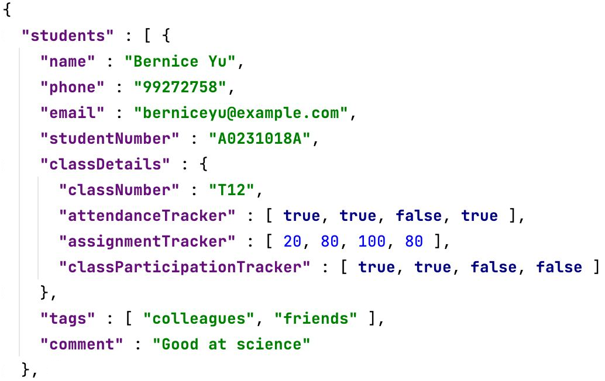

# Class Manager 2023 Developer Guide

<!-- * Table of Contents -->
<page-nav-print />

--------------------------------------------------------------------------------------------------------------------

## **Acknowledgements**

- The features `undo`, `redo`, `history` and arrow key command navigation (including the code) were reused with some changes from [AddressBook-Level4](https://github.com/se-edu/addressbook-level4).
- Our book icon favicon was taken from [Smashicons at Flaticon](https://www.flaticon.com/free-icon/book_2232688).

--------------------------------------------------------------------------------------------------------------------

## **Setting up, getting started**

Refer to the guide [_Setting up and getting started_](SettingUp.md).

--------------------------------------------------------------------------------------------------------------------

## **Design**

### Architecture

<puml src="diagrams/ArchitectureDiagram.puml" width="280" />

The ***Architecture Diagram*** given above explains the high-level design of the app.

Below is a quick overview of the main components and how they interact with each other.

**Main components of the architecture**

**`Main`** (consisting of classes [`Main`](https://github.com/AY2324S1-CS2103T-T11-1/tp/tree/master/src/main/java/seedu/classmanager/Main.java) and [`MainApp`](https://github.com/AY2324S1-CS2103T-T11-1/tp/tree/master/src/main/java/seedu/classmanager/MainApp.java)) is in charge of the app launch and shutdown.
* At app launch, it initialises the other components in the correct sequence and connects them up with each other.
* At shutdown, it shuts down the other components and invokes cleanup methods where necessary.

The bulk of the app's work is done by the following four components:

* [**`UI`**](#ui-component): The UI of the app.
* [**`Logic`**](#logic-component): The command executor.
* [**`Model`**](#model-component): Holds the data of the app in memory.
* [**`Storage`**](#storage-component): Reads data from and writes data to the hard disk.

[**`Commons`**](#common-classes) represent a collection of classes used by multiple other components.

**How the architecture components interact with each other**

The *Sequence Diagram* below shows how the components interact with each other for the scenario where the user issues the command `delete s/A0249112A`.

<puml src="diagrams/ArchitectureSequenceDiagram.puml" width="600" />

Each of the four main components (also shown in the diagram above),

* defines its *API* in an `interface` with the same name as the component.
* implements its functionality using a concrete `{Component Name}Manager` class (which follows the corresponding API `interface` mentioned in the previous point).

For example, the `Logic` component defines its API in the `Logic.java` interface and implements its functionality using the `LogicManager.java` class, which follows the `Logic` interface. Other components interact with a given component through its interface rather than the concrete class (reason: to prevent outside components' being coupled to the implementation of a component), as illustrated in the (partial) class diagram below.

<puml src="diagrams/ComponentManagers.puml" width="300" />

The sections below give more details of each component.

### UI component

The **API** of this component is specified in [`Ui.java`](https://github.com/AY2324S1-CS2103T-T11-1/tp/tree/master/src/main/java/seedu/classmanager/ui/Ui.java)

<puml src="diagrams/UiClassDiagram.puml" alt="Structure of the UI Component"/>

The UI consists of a `MainWindow` that is made up of parts e.g.`CommandBox`, `ResultDisplay`, `StudentListPanel`, `StatusBarFooter`, etc. All these, including the `MainWindow`, inherit from the abstract `UiPart` class, which captures the commonalities between classes that represent parts of the visible GUI.

The `UI` component uses the JavaFx UI framework. The layout of these UI parts is defined in matching `.fxml` files that are in the `src/main/resources/view` folder. For example, the layout of the [`MainWindow`](https://github.com/AY2324S1-CS2103T-T11-1/tp/tree/master/src/main/java/seedu/classmanager/ui/MainWindow.java) is specified in [`MainWindow.fxml`](https://github.com/AY2324S1-CS2103T-T11-1/tp/tree/master/src/main/resources/view/MainWindow.fxml)

The `UI` component,

* executes user commands using the `Logic` component.
* listens for changes to `Model` data so that the UI can be updated with the modified data.
* keeps a reference to the `Logic` component because the `UI` relies on the `Logic` to execute commands.
* depends on some classes in the `Model` component, as it displays the `Student` object residing in the `Model`.

### Logic component

**API** : [`Logic.java`](https://github.com/AY2324S1-CS2103T-T11-1/tp/tree/master/src/main/java/seedu/classmanager/logic/Logic.java)

Here's a (partial) class diagram of the `Logic` component:

<puml src="diagrams/LogicClassDiagram.puml" width="550"/>

How the `Logic` component works:

1. When `Logic` is called upon to execute a command, it is passed to a `ClassManagerParser` object, which in turn creates a parser that matches the command (e.g., `DeleteCommandParser`) and uses it to parse the command.
2. This results in a `Command` object (more precisely, an object of one of its subclasses e.g., `DeleteCommand`), which is executed by the `LogicManager`.
3. The command can communicate with the `Model` when it is executed (e.g. to delete a student).
4. The result of the command execution is encapsulated as a `CommandResult` object, which is returned from `Logic`.

Here are the other classes in `Logic` (omitted from the class diagram above) that are used for parsing a user command:

<puml src="diagrams/ParserClasses.puml" width="600"/>

How the parsing works:
* When called upon to parse a user command, the `ClassManagerParser` class creates an `XYZCommandParser` (`XYZ` is a placeholder for the specific command name, e.g. `AddCommandParser`), which uses the other classes shown above to parse the user command and creates an `XYZCommand` object (e.g., `AddCommand`) which the `ClassManagerParser` returns as a `Command` object.
* All `XYZCommandParser` classes (e.g., `AddCommandParser`, `DeleteCommandParser`, etc.) inherit from the `Parser` interface so that they can be treated similarly where possible, e.g during testing.

### Model component
**API** : [`Model.java`](https://github.com/AY2324S1-CS2103T-T11-1/tp/tree/master/src/main/java/seedu/classmanager/model/Model.java)

<puml src="diagrams/ModelClassDiagram.puml" />


The `Model` component,

* stores Class Manager data, i.e. all `Student` objects (which are contained in a `UniqueStudentList` object).
* stores the currently 'selected' `Student` objects (e.g., results of a search query) as a separate _filtered_ list which is exposed to outsiders as an unmodifiable `ObservableList<Student>` that can be 'observed' e.g. the UI can be bound to this list so that the UI automatically updates when the data in the list change.
* stores a `UserPref` object that represents the user’s preferences. This is exposed to the outside as a `ReadOnlyUserPref` object.
* does not depend on any of the other three components (as the `Model` represents data entities of the domain, they should make sense on their own without depending on other components)

### Storage component

**API** : [`Storage.java`](https://github.com/AY2324S1-CS2103T-T11-1/tp/tree/master/src/main/java/seedu/classmanager/storage/Storage.java)

<puml src="diagrams/StorageClassDiagram.puml" width="650" />

The `Storage` component,
* can save both Class Manager data and user preference data in JSON format and read them back into corresponding objects.
* inherits from both `ClassManagerStorage` and `UserPrefStorage`, which means it can be treated as either one (if only the functionality of only one is needed).
* depends on some classes in the `Model` component (because the `Storage` component's job is to save/retrieve objects that belong to the `Model`)

### Common classes

Classes used by multiple components are in the `seedu.classmanager.commons` package.

--------------------------------------------------------------------------------------------------------------------

## **Implementation**

This section describes some noteworthy details on how certain features are implemented.

### Tag feature

#### About this feature

This feature allows users to tag their student with labels to allow easier recognition of their students by their traits.

#### Implementation

Tagging a student with `Tag` is facilitated by `TagCommand`, `AddTagCommand`, `DeleteTagCommand` and `TagCommandParser`.
* `TagCommand` will replace all existing tags of a student with input tags.
* `AddTagCommand` will add input tags to the existing tags of the student.
* `DeleteTagCommand` will delete input tags from the existing tags of the student.
* `TagCommandParser` will parse the user input and create the correct command object to execute.

<box type="info" seamless>

**Note:** Only 1 of the 3 commands will be executed per user input.

</box>

Here is a step-by-step example of how the tag command might be executed.

Step 1. User inputs the `tag` command.

Step 2. `Logic` will receive the input and pass it to a `ClassManagerParser` object, which in turn creates a `TagCommandParser` object to parse the command.

Step 3. Next `TagCommandParser` will check for any action identifiers,
`/add` or `/delete`, which will create a `AddTagCommand` object or `DeleteTagCommand` object respectively,
else a `TagCommand` object. `ParseException` will be thrown for any invalid inputs.

Step 4a. `AddTagCommand` will union the `HashSet<Tag>` with the student's existing `Tag`.

Step 4b. `DeleteTagCommand` will remove all `Tag` that are in the intersection of the student's existing `Tag` and `HashSet<Tag>`.

Step 4c. `TagCommand` will replace all existing `Tag` of the student with `HashSet<Tag>`.

Step 5. `TagCommand` creates a new `Student` object with the new `Tag` and copy all other details.

Step 6. `TagCommand` updates the `Model` with the new Student by calling `Model#setStudent()`.

Step 7. Finally, the `TagCommand` creates a CommandResult with a success message and returns it to the LogicManager to complete the command execution. The GUI would also be updated with the change of status.

<box type="info" seamless>

**Note:** For Step 5, 6 and 7, `AddTagCommand` and `DeleteTagCommand` behaves the same way as `TagCommand`.

</box>

The following sequence diagram summarizes what happens when a user executes a `tag` command:

<puml src="diagrams/TagCommand.puml" alt="TagCommand" />

The following activity diagram summarises what happens when a user executes a `tag` command:

<puml src="diagrams/TagCommandActivityDiagram.puml" alt="TagCommandActivityDiagram" />

#### Design considerations:

**Aspect: TagCommand**

* **Alternative 1 (current choice):** Use different types of TagCommand to handle adding and deletion of tags.
  * Pros: Able to handle adding and deletion of tags. Users do not have to retype tags that they want to keep.
  * Cons: Users have to input more details.
  
* **Alternative 2:** Replace all existing tags with input tags.
  * Pros: Easy to implement.
  * Cons: Users must replace tags that they want to keep.

### Undo/redo feature

#### Implementation

The undo/redo feature works similarly to the one implemented in AddressBook-Level 4, but with support for more commands and a limit to the number of Class Manager states stored. The undo/redo mechanism is facilitated by `VersionedClassManager`. It extends `ClassManager` with an undo/redo history, stored internally as a `classManagerStateList` and `currentStatePointer`. `classManagerStateList` only stores up to 10 most recent states of Class Manager to avoid performance issues when a large number of commands are executed. Additionally, it implements the following operations:

* `VersionedClassManager#commit()` — Saves the current Class Manager state in its history.
* `VersionedClassManager#undo()` — Restores the previous Class Manager state from its history.
* `VersionedClassManager#redo()` — Restores a previously undone Class Manager state from its history.

These operations are exposed in the `Model` interface as `Model#commitClassManager()`, `Model#undoClassManager()` and `Model#redoClassManager()` respectively.

Given below is an example usage scenario and how the undo/redo mechanism behaves at each step.

Step 1. The user launches the application for the first time. The `VersionedClassManager` will be initialized with the initial Class Manager state and the `currentStatePointer` pointing to that single Class Manager state.

<puml src="diagrams/UndoRedoState0.puml" alt="UndoRedoState0" />

Step 2. The user executes `delete s/A0123456L` command to delete the student with the Student Number A0123456L in Class Manager. The `delete` command calls `Model#commitClassManager()`, causing the modified state of Class Manager after the `delete s/A0123456L` command executes to be saved in the `classManagerStateList`, and the `currentStatePointer` is shifted to the newly inserted Class Manager state.

<puml src="diagrams/UndoRedoState1.puml" alt="UndoRedoState1" />

Step 3. The user executes `add n/David …​` to add a new student. The `add` command also calls `Model#commitClassManager()`, causing another modified Class Manager state to be saved into the `classManagerStateList`.

<puml src="diagrams/UndoRedoState2.puml" alt="UndoRedoState2" />

<box type="info" seamless>

**Note:** If a command fails its execution, it will not call `Model#commitClassManager()`, so the Class Manager state will not be saved into the `classManagerStateList`.

</box>

Step 4. The user now decides that adding the student was a mistake and decides to undo that action by executing the `undo` command. The `undo` command will call `Model#undoClassManager()`, which will shift the `currentStatePointer` once to the left, pointing it to the previous Class Manager state and restores Class Manager to that state.

<puml src="diagrams/UndoRedoState3.puml" alt="UndoRedoState3" />


<box type="info" seamless>

**Note:** If the `currentStatePointer` is at index 0, pointing to the initial ClassManager state, then there are no previous ClassManager states to restore. The `undo` command uses `Model#canundoClassManager()` to check if this is the case. If so, it will return an error to the user rather
than attempting to perform the undo.

</box>

The following sequence diagram shows how the undo operation works:

<puml src="diagrams/UndoSequenceDiagram.puml" alt="UndoSequenceDiagram" />

<box type="info" seamless>

**Note:** The lifeline for `UndoCommand` should end at the destroy marker (X), but due to a limitation of PlantUML, the lifeline reaches the end of the diagram.

</box>

The `redo` command does the opposite — it calls `Model#redoClassManager()`, which shifts the `currentStatePointer` once to the right, pointing to the previously undone state, and restores Class Manager to that state.

<box type="info" seamless>

**Note:** If the `currentStatePointer` is at index `classManagerStateList.size() - 1`, pointing to the latest Class Manager state, then there are no undone Class Manager states to restore. The `redo` command uses `Model#canRedoClassManager()` to check if this is the case. If so, it will return an error to the user rather than attempting to perform the redo.

</box>

Step 5. The user then decides to execute the command `list`. Commands that do not modify Class Manager, such as `list`, will usually not call `Model#commitClassManager()`, `Model#undoClassManager()` or `Model#redoClassManager()`. Thus, the `classManagerStateList` remains unchanged.

<puml src="diagrams/UndoRedoState4.puml" alt="UndoRedoState4" />

Step 6. The user executes `clear`, which calls `Model#commitClassManager()`. Since the `currentStatePointer` is not pointing at the end of the `classManagerStateList`, all Class Manager states after the `currentStatePointer` will be purged. Reason: It no longer makes sense to redo the `add n/David …​` command. This is the behaviour that most modern desktop applications follow.

<puml src="diagrams/UndoRedoState5.puml" alt="UndoRedoState5" />

In order to implement `undo` and `redo` in Class Manager, `load` and `config` commands are not supported by `undo` and `redo`. This is because undoing `load` and `config` can cause Class Manager to be in an inconsistent state. To prevent this, `load` and `config` commands call `Model#loadReset()` and `Model#configReset()`, respectively. These methods essentially clear `classManagerStateList` and reset the `currentStatePointer` to the current Class Manager state, allowing 9 more states of Class Manager to be stored after `load` and `config` commands.

The following activity diagram summarizes what happens when a user executes a new command:

<puml src="diagrams/CommitActivityDiagram.puml" width="450" />

#### Design considerations:

**Aspect: How undo & redo executes:**

* **Alternative 1 (current choice):** Saves the entire Class Manager.
  * Pros: Easy to implement.
  * Cons: May have performance issues in terms of memory usage.

* **Alternative 2:** Individual command knows how to undo/redo by
  itself.
  * Pros: Will use less memory (e.g. for `delete`, just save the student being deleted).
  * Cons: We must ensure that the implementation of each command is correct.

**Aspect: Data structure to support the undo/redo commands**

* **Alternative 1 (current choice):** Use a list to store the history of Class Manager states.
  * Pros: Easy to understand.
  * Cons: Logic is duplicated twice. For example, when a new command is executed, we must remember to update both `HistoryManager` and `VersionedClassManager`.

* **Alternative 2:** Use `HistoryManager` for undo/redo.
  * Pros: We do not need to maintain a separate list and can just reuse what is already in the codebase.
  * Cons: Requires dealing with commands that have already been undone: We must remember to skip these commands. Violates Single Responsibility Principle and Separation of Concerns as `HistoryManager` now needs to do two different things.

**Aspect: Commands that support undo & redo**

* **Alternative 1 (current choice):** Not supporting undo/redo for `load` and `config`
  * Pros: Ensures that Class Manager will not run into issues such as inconsistent states when undoing `load` for missing saved files.
  * Cons: Unable to restore student's class information after `config` command resets student class information.
* **Alternative 2:** Supporting undo/redo for all commands.
  * Pros: Ensures that app is consistent with undo/redo, and users will not be unsure if a certain command can be undone.
  * Cons: Can be confusing for the user to use undo/redo with `load` and `config`.

**Aspect: Number of Class Manager states to store**

* **Alternative 1 (current choice):** Store up to 10 Class Manager states.
  * Pros: Ensures that Class Manager will not run into performance issues when a large number of commands are executed.
  * Cons: Unable to undo/redo more than 10 commands.
* **Alternative 2:** Store all Class Manager states.
  * Pros: Able to undo/redo more than 10 commands and restore any state of Class Manager in the current session.
  * Cons: Will have performance issues when a large number of commands are executed.

### Load feature

#### About this feature

The load feature allows users to load a saved JSON file into the app. Load allows data from the new JSON file to be displayed in Class Manager while setting the new default save file to be the new JSON file. The status bar footer also updates to show the current file path.

This feature is an improvement to the previous method of directly editing the `classmanager.json` file located in `[JAR file location]/data`. Users are now able to have multiple JSON files in `[JAR file location]/data` and choose which file is to be loaded into Class Manager. This allows TAs with multiple courses to have a JSON file for each course and load the JSON file for the course they are currently teaching.

#### How it is implemented

<puml src="diagrams/LoadSequenceDiagram.puml" alt="LoadSequenceDiagram" />

The `load` command is facilitated by `LoadCommand` and `LoadCommandParser`. `LoadCommand` attempts to read the JSON file and checks if the tutorial and assignment count for each student matches the current configuration of Class Manager. If the file is valid (each Student's information follows the format in the image below), it then calls `setClassManager` and `setClassManagerFilePath` of `Model` to update the new save file path and Class Manager data to be displayed. `LoadCommand` then resets `VersionedClassManager` to clear the undo/redo history of Class Manager.

#### Valid JSON format

 <br><br>

#### Parsing user input

1. The user inputs the `load` command.
2. The `ClassManagerParser` processes the input and creates a new `LoadCommandParser`.
3. The `LoadCommandParser` then calls ArgumentTokenizer#tokenize(String argString, Prefix... prefixes) to extract the file name. If there are duplicate prefixes, a ParseException would be thrown.
4. The file name is then checked to ensure that it is valid. If the file name is missing, null or contains a forward slash, a ParseException would be thrown.
5. The `LoadCommandParser` then creates the `LoadCommand` based on the processed input.

#### Design considerations:

**Aspect: Files that can be loaded:**

* **Alternative 1 (current choice):** Only JSON files can be loaded.
  * Pros: Easy to implement.
  * Cons: Users may want to load other types of files.
* **Alternative 2:** Allow users to load any type of file.
  * Pros: Users can use files of other formats that may be generated from other applications.
  * Cons: A lot of effort is needed to ensure that the data of each file type is valid.

### Config feature

The `config` command allows TAs to set the number of tutorials and the number of assignments in a module. This allows the Class Manager to be able to display the correct number of tutorials and assignments for the TA to enter the grades for each student. This also provides more flexibility to TAs as their class may differ from the default configuration of 13 tutorials and 6 assignments.

#### How it is implemented

<puml src="diagrams/ConfigSequenceDiagram.puml" alt="ConfigSequenceDiagram" />

The `config` command is facilitated by `ConfigCommand` and `ConfigCommandParser`. `ConfigCommand` updates the tutorial and assignment count of Class Manager by calling `setTutorialCount` and `setAssignmentCount` of `Model` to update the `preferences.json` file. Simultaneously, it updates the static tutorial and assignment count of `ClassDetails` to recreate the `ClassDetails` objects for students accurately. All students in the current file will have their class information updated to reflect the new configuration. `ConfigCommand` then resets the student shown in the view panel, as well as `VersionedClassManager`, to clear the undo/redo history of Class Manager.

#### Parsing user input

1. The user inputs the `config` command.
2. The `ClassManagerParser` processes the input and creates a new `ConfigCommandParser`.
3. The `ConfigCommandParser` then calls ArgumentTokenizer#tokenize(String argString, Prefix... prefixes) to extract the tutorial count and assignment count. If there are duplicate prefixes, a ParseException would be thrown.
4. The tutorial and assignment counts are then checked to ensure that they are integers between 1 and 40 inclusive. If any of the counts are not valid, a ParseException would be thrown.
5. The `ConfigCommandParser` then creates the `ConfigCommand` based on the processed input.

#### Design considerations:

In v1.2, `config` was initially implemented as a command that users could only execute once before they started using Class Manager. This allows `ClassDetails` to create fixed-length arrays for `AssignmentTracker`, `AttendanceTracker` and `ClassParticipationTracker`. 

However, this implementation was changed in v1.3 to allow users to execute `config` multiple times. This allows users to reconfigure Class Manager if they have entered the wrong information previously. We decided to reset the class information of a student back to the default values of 0 for attendance, class participation and assignment grades, as it ensures a consistent implementation of `config` regardless of whether the new tutorial count and assignment count were smaller or larger than the previous configuration.

In addition, the tutorial and assignment count was limited to an integer between 1 and 40 inclusive in v1.4. This prevents division by zero bugs encountered in data visualisation, as well as Class Manager being unresponsive when the user enters a large number of tutorials and assignments.

**Aspect: Number of times Class Manager can be configured**

* **Alternative 1 (current choice):** Class Manager can be configured multiple times.
  * Pros: Provides more flexibility to TAs as they may enter the wrong information when configuring.
  * Cons: Student class information is completely reset upon configuration, which may be an issue for the user.
* **Alternative 2:** Class Manager can only be configured once.
  * Pros: Ensures that Class Manager will not run into issues with data visualisation.
  * Cons: Unable to change the tutorial and assignment count of Class Manager after it has been configured.


### Lookup feature

The `lookup` command allows TAs to search and filter for students in the Class Manager. This allows TAs to find the student they are looking for quickly, and perform subsequent operations such as editing class information for student(s). This also provides more flexibility to TAs as they may want to search for students based on different criteria.

#### How it is implemented

<puml src="diagrams/LookupCommand.puml" alt="Lookup Command" />

The `lookup` command is facilitated by `LookupCommand` and `LookupCommandParser`. 

`LookupCommandParser` will parse the user input and create a corresponding `StudentContainsKeywordsPredicate`, which implements the `Predicate<Student>` _interface_.

`LookupCommand` will then call `Model#updateFilteredStudentList()` to update the student list by utilizing the `StudentContainsKeywordsPredicate` to test whether a student satisfies the given criteria or not. The filtered list will then be displayed in the UI.

#### Parsing user input

1. The user inputs the `lookup` command.
2. The `ClassManagerParser` processes the input and creates a new `LookupCommandParser`.
3. The `LookupCommandParser` then calls `ArgumentTokenizer#tokenize(String argString, Prefix... prefixes)` to extract the criteria provided by the user. If there are duplicate prefixes, a ParseException would be thrown.
4. A `StudentContainsKeywordsPredicate` is then created based on the processed input.
5. The `LookupCommandParser` then creates the `LookupCommand` based on the processed input.

#### Design considerations:

**Aspect: Criteria for lookup**
* **Alternative 1 (current choice):** Only basic student information can be used as criteria for lookup.
    * Pros: Easy to implement.
    * Cons: Users may want to use other types of student information as criteria for lookup.
* **Alternative 2:** Allows users to use any type of student information (Including class information) as criteria for lookup.
    * Pros: Users have more flexibility when searching for students.
    * Cons: There will be more coupling between classes.

**Aspect: Criteria Validation**
* **Alternative 1 (current choice):** The `LookupCommandParser` does not apply any validation to the user input.
    * Pros: Easy to implement.
    * Cons: Users may enter invalid criteria for lookup, and the `LookupCommand` will still be executed. This can cause some confusion for the user.

* **Alternative 2:** The `LookupCommandParser` will apply validation to the user input.
    * Pros: Less confusion for the user, and behaviour is consistent with other commands.
    * Cons: The implementation will be more complex.

**Aspect: Criteria Combination for complex lookup**

* **Alternative 1 (current choice):** Within a field, the operation is _OR_, and between fields the operation, is _AND_.

    For example, `lookup n/alex david c/T11 T12` will have the criteria:
    ```
    (name contains alex OR david) AND (class number is T11 OR T12)
    ```

    * Pros: The behaviour is consistent with other commands.
    * Cons: This combination may not be intuitive for the user.

* **Alternative 2:** The combination can be specified by the user.

    For example, `lookup n/alex \AND david \OR c/T11 \OR T12` will have the criteria:
    ```
    (name contains alex AND david) OR (class number is T11 OR T12)
    ```

    * Pros: The user can specify any combination of criteria.
    * Cons: The command will be more complicated to implement, as the order of the keywords and the logic operators will be used to determine the `StudentContainsKeywordsPredicate`. In addition, the syntax can be confusing for the user. <br>
      One such example is the command `lookup n/alex \AND david \OR li` which can have two different interpretations:
      ```
      (name contains alex AND david) OR (name contains li)
      ```
      ```
      (name contains alex) AND (name contains david OR li)
      ```
      
### Theme feature

The `theme` command allows TAs to toggle/switch between _light_ and _dark_ themes.

#### Implementation
The `theme` feature is facilitated by the `ThemeCommand`, and inside the `Model` component, the `UserPrefs` class stores the current colour theme settings. 

Here is a step-by-step example of how the theme command might be executed.

1. The user inputs the `theme` command.
2. The `Logic` component will receive the input and create a new `ThemeCommand` object.
3. When `ThemeCommand` is executed, it will call `Model#toggleTheme()` to update the colour theme settings in the `UserPrefs` class.
4. The `MainWindow` class in the `UI` component will then fetch the new colour theme settings from the `UserPrefs` class.
5. The `MainWindow` class will then update the GUI colour theme accordingly.

Below is a sequence diagram that shows how the `theme` command is executed.

<puml src="diagrams/ThemeSequenceDiagram.puml" alt="Theme Sequence Diagram" />

#### Design considerations:

**Aspect: Fetching the new colour theme setting**

* **Alternative 1 (current choice):** The `MainWindow` class fetches the new colour theme through the `Logic` component.
  * Pros: Easy to implement.
  * Cons: Additional operations are required to fetch the new setting from the `UserPrefs` class.

* **Alternative 2:** The new setting is contained in the `CommandResult` object.
  * Pros: The `MainWindow` class can use the new setting directly from the `CommandResult` object.
  * Cons: The `CommandResult` class will be modified to contain the new setting.


### Class Details feature

#### Implementation

The proposed class details mechanism for each student will be facilitated by `ClassDetails`. It allows for the tracking
of a `Student`'s class details, such as their tutorial group, tutorial attendance, class participation, and assignment
grades. It will be stored as 3 separate classes to model each of the 3 different types of class details (We will
call them "class information"), and a tracker
class to act as the manager for each of the class information, with the trackers composing the `ClassDetails` class.

<puml src="diagrams/ClassInformation.puml" alt="ClassInformation" />

The 3 different types of class information are:

* `Attendance` - Stores the details of a student's attendance in a specific tutorial. Attendance will be stored as
a boolean value.
* `ClassParticipation` - Stores the details of a student's participation in a specific tutorial. Class participation
will be stored as a boolean value.
* `Assignment` - Stores the details of a student's assignment grades for a specific tutorial. Assignment grades will be
stored as an integer value, with the total marks standardized to 100 marks.

These components will be stored in their respective tracker classes, using Java Arrays to store the objects. The position
of the classes in the array will correspond to the index of the tutorial or assignment. For example, the first index of
the array will correspond to either the first tutorial or assignment, depending on the tracker class.

<puml src="diagrams/ClassDetails.puml" width="500" />

The tracker classes will be stored in the `ClassDetails` class, which will be composed of the following classes:
* `AttendanceTracker` - Stores the `Attendance` objects for a specific student.
* `ClassParticipationTracker` - Stores the `ClassParticipation` objects for a specific student.
* `AssignmentTracker` - Stores the `Assignment` objects for a specific student.

These tracker classes will inherit from a `tracker` *interface*. They will also support the following operations:
* `getPercentage()` - Returns the average grade of the student for the specific tracker class. For example, the average
tutorial attendance percentage or the average assignment score.
* `getJson()` - Returns a Json Friendly representation of the tracker.

Each of these tracker classes will be initialized with a specific size, which will be the number of tutorials
or assignments.

#### Design considerations:

**Aspect: `Class Information` classes**

* **Alternative 1 (current choice):** Use a class for each type of class information.
  * Pros: Easy to implement, follows OOP principle. If we want to edit the implementation of each of the classes or
  change the data structure/details of each instance, it can be done easily.
  * Cons: May have performance issues in terms of memory usage.

* **Alternative 2:** Store class values as a primitive type (String or Integer).
  * Pros: Will use less memory.
  * Cons: We must ensure that the implementation of each class is correct. Implementation will be more
  complex as different class detail types will require different implementations for the same operation.

**Aspect: Tracker classes**

* **Alternative 1 (current choice):** Use a tracker class for each type of class information.
  * Pros: Easy to implement. Shared functions can be abstracted out, and polymorphism can be applied.
  * Cons: May have performance issues in terms of memory usage.

* **Alternative 2:** Store class values as an Object Array.
  * Pros: Will use less memory.
  * Cons: Will need to implement different functions for each type of class details. Implementation will be more
  complex. SLAP principle might not be able to be adhered to.

### Data visualisation feature

#### About this feature
The data visualisation feature allows users to visualize the `Class Information` fields of each student. The display will be located inside the student list card, next to the other details of the students.
There will be 3 bar graphs associated with each student, one for each of the `Class Information` fields, representing the overall percentage of each field across a semester.

#### How it is implemented
The data visualisation feature is facilitated by each Class Information `Tracker`. Each tracker will have a method that will calculate the average percentage of the field.
These methods are called by the `StudentCard` class in the UI package within a method used to initialize the FXML bar chart.


### Present feature

#### About this feature

The present feature allows users to mark a specific student to be present in a specific tutorial in the app.

This feature builds upon the current design of Student and ClassDetails.

#### How it is implemented

<puml src="diagrams/MarkPresentSequenceDiagram.puml" alt="MarkPresentSequenceDiagram" />

<box type="info" seamless>

**Note:** The diagram above only shows part of the interactions within the model component. The interactions within the logic component are similar to other commands.

</box>

#### Design considerations:

The feature should be implemented based on the current design of Student and ClassDetails. Alternative designs may exist, such as treating the attendance and participation as association classes.

<box type="info" seamless>

**Note:** Other similar features, such as `absent`, `class-part`, and `grade`, are implemented similarly.

</box>

### View feature

#### About this feature

The view feature allows users to view the class information of their students.

<box type="info" seamless>

**Note:** The `view` command is the only way to change the student being viewed in the `GUI`.

</box>

#### Implementation

The `view` command is facilitated by the `ViewCommandParser` and the `ViewCommand`. It uses `Model#setSelectedStudent()` to select the student that is to be viewed in the `GUI`.

Here is a step-by-step example of how a `view` command is executed:

Step 1. User inputs a `view` command.
Step 2. `Logic` will receive the input and pass it to a `ClassManagerParser` object, which in turn creates a `ViewCommandParser` object to parse the command.
Step 3. `ViewCommandParser` will check if the input is valid. If the input is valid, it will create a `ViewCommand` object to execute the command. Else `ParseException` is thrown.
Step 4. `ViewCommand` will use `Model#setSelectedStudent()` to set the requested student to be viewed in the `GUI`.

The following sequence diagram will show what happens when a user executes a `view` command:

<puml src="diagrams/ViewCommand.puml" alt="ViewCommand" />

The following activity diagram will show what happens when a user executes a `view` command:

<puml src="diagrams/ViewCommandActivityDiagram.puml" alt="ViewCommandActivityDiagram" />

#### Design Considerations

**Aspect: ViewCommand**

* **Alternative 1 (current choice):** Using a command to view the class information of a student.
  * Pros: Reduces clutter in the `GUI`.
  * Cons: User has to enter a command whenever they want to view the class information of a different student.

* **Alternative 2:** Listing all the class information of every student.
  * Pros: Easy to implement.
  * Cons: Very messy and clutters the `GUI`.

--------------------------------------------------------------------------------------------------------------------

## **Documentation, logging, testing, configuration, dev-ops**

* [Documentation guide](Documentation.md)
* [Testing guide](Testing.md)
* [Logging guide](Logging.md)
* [Configuration guide](Configuration.md)
* [DevOps guide](DevOps.md)

--------------------------------------------------------------------------------------------------------------------

## **Appendix: Requirements**

### Product scope

**Target user profile**:

* NUS CS2103/T Teaching Assistants
* needs to manage student information across different classes
* prefer desktop apps over other types
* can type fast
* prefers typing to mouse interactions
* is reasonably comfortable using CLI apps

**Value proposition**:

* provide fast access to student’s contact information
* provide easy ways to compare and visualise student's grades across classes
* optimised for users who prefer CLI

### User stories

Priorities: High (must have) - `* * *`, Medium (nice to have) - `* *`, Low (unlikely to have) - `*`


| Priority | As a …​  | I want to …​                                                 | So that I can…​                                                         |
|----------|----------|--------------------------------------------------------------|-------------------------------------------------------------------------|
| `* * *`  | TA       | manually enter the details of students into my Class Manager | track the information                                                   |
| `* * *`  | TA       | be able to delete students from the class                    | manage students who drop out                                            |
| `* * *`  | TA       | edit the contact information of students                     | maintain the correct information if it changes                          |
| `* *`    | TA       | keep track of the attendance percentage of each student      | use it for their participation grade                                    |
| `* *`    | TA       | be able to add the grades of each student in each tutorial   | use it to view students that need help                                  |
| `*`      | TA       | be able to keep records of my students in past semesters     | refer to the history of student performance                             |
| `*`      | TA       | add comments to specific students                            | attach additional information to them                                   |
| `* * *`  | TA       | tag students with certain labels                             | filter and search more conveniently                                     |
| `* * *`  | TA       | lookup all students in a particular tutorial group           | obtain their contact information                                        |
| `* *`    | TA       | search particular students across different tutorial groups  | contact them easily                                                     |
| `*`      | TA       | know the students I searched recently                        | minimize repeated searches                                              |
| `* *`    | TA       | filter students by tags/labels                               | categorise and organise students                                        |
| `* *`    | TA       | filter students by their year of study                       | gain a better understanding of the whole tutorial                       |
| `*`      | TA       | have a composite filter for tutorial group attendance        | look up the attendance of a particular tutorial group on a certain week |
| `*`      | TA       | randomly select a specific number of students                | use as a feature during teaching                                        |
| `* *`    | TA       | sort students by coding experience                           | group students with similar experience levels                           |
| `* *`    | TA       | sort students based on their score marks                     | understand the performance of the whole class                           |
| `* *`    | TA       | sort students by alphabetical order                          | compare to the attendance sheet                                         |
| `* *`    | TA       | sort students by their overall grades                        | identify students falling behind in my class                            |
| `* `     | TA       | customise my GUI                                             | use a theme that suits my desktop theme                                 |
| `* `     | TA       | enable dark mode for my device                               | use it at night                                                         |
| `* `     | TA       | choose different layouts                                     | select a comfortable layout                                             |
| `* *`    | TA       | have keyboard shortcuts for commonly used features           | save time and fit my habit                                              |
| `* *`    | TA       | customise commands                                           | save time and fit my habit                                              |
| `* * *`  | TA       | export and import app’s data                                 | work on different devices                                               |
| `* * *`  | TA       | save queries and searches to the application                 | not lose progress                                                       |
| `* * *`  | new user | see usage instructions                                       | refer to instructions when I forget how to use the app                  |

### Use cases

(For all use cases below, the **System** is `Class Manager`, and the **Actor** is the `user`, unless specified otherwise)

---

**Use case: UC01 - Delete a student**

**MSS**

1.  User requests to delete a specific student with the student's student number
2.  Class Manager deletes the student

    Use case ends.

**Extensions**

* 1a. The given student number is invalid.

    * 1a1. Class Manager shows an error message.

      Use case resumes at step 1.

* 1b. The given student number does not exist in Class Manager.

    * 1b1. Class Manager shows an error message.

      Use case resumes at step 1.

---

**Use case: UC02 - Tag a student with a label**

**MSS**

1.  User requests to list students
2.  Class Manager shows a list of students
3.  User requests to tag a specific student in the list
4.  Class Manager tags the student

    Use case ends.

**Extensions**

* 2a. The list is empty.

  Use case resumes at step 1.

* 3a. The given student number is invalid.

    * 3a1. Class Manager shows an error message.

      Use case resumes at step 3.

* 3b. The given tag is invalid.

    * 3b1. Class Manager shows an error message.

      Use case resumes at step 3.

* 3c. The given student number does not belong to any student in the list.

    * 3c1. Class Manager shows an error message.

      Use case resumes at step 3.

---

**Use case: UC03 - Loading a saved file**

**MSS**

1.  User copies saved JSON file to data folder
2.  User requests to load JSON file
3.  Class Manager reads and loads the JSON file
4.  Class Manager updates the app to show the new data

    Use case ends.

**Extensions**

* 3a. The JSON file cannot be found.

  * 3a1. Class Manager shows an error message.

    Use case resumes at step 2.

* 4a. The JSON file data is invalid.

    * 4a1. Class Manager shows an error message.

      Use case resumes at step 3.

---

**Use case: UC04 - Look up a list of students**

**MSS**

1.  User requests to look up students with a given criteria.
2.  Class Manager checks each student in the list with the given criteria.
3.  Class Manager shows a list of students that match the criteria.

    Use case ends.

**Extensions**

* 1a. There are no criteria given.

    * 1a1. Class Manager shows an error message.

      Use case ends.

* 2a. There are no students in the list that match the criteria.

    * 2a1. Class Manager shows an error message.

      Use case ends.

---

**Use case: UC05 - Randomly select a specific number of students**

**MSS**

1.  User requests to select a specific number of students randomly.
2.  Class Manager randomly selects the students from all students displayed.
3.  Class Manager shows a list of students that are randomly selected.

    Use case ends.

**Extensions**

* 1a. The number of students to be selected is more than the number of students in the list.

    * 1a1. Class Manager shows an error message.

      Use case resumes at step 1.

* 1b. The number of students to be selected is less than 1.

    * 1b1. Class Manager shows an error message.

      Use case resumes at step 1.

---

**Use case: UC06 - Modifying a student's class information**

**MSS**

1.  User requests to modify a student's class information.
2.  Class Manager modifies the student's class information.
3.  Class Manager shows the student's updated class information.

    Use case ends.

**Extensions**

* 1a. The student does not exist in Class Manager.

    * 1a1. Class Manager shows an error message.

      Use case resumes at step 1.

* 1b. The modifying request is invalid.

    * 1b1. Class Manager shows an error message.

      Use case resumes at step 1.

---

**Use case: UC07 - Configuring module information**

**MSS**

1.  User requests to configure Class Manager.
2.  Class Manager modifies the tutorial and assignment count.
3.  Class Manager updates the app to show the new class information.

    Use case ends.

**Extensions**

* 2a. The tutorial or assignment count is invalid.

    * 2a1. Class Manager shows an error message.

      Use case resumes at step 1.

---

**Use case: UC08 - Undoing a command**

**MSS**

1.  User deletes a specified student (UC01).
2.  User requests to undo the deletion.
3.  Class Manager restores the deleted student.

    Use case ends.

---

**Use case: UC09 - Redoing a command**

**MSS**

1.  User undoes the deletion of a specified student (UC08).
2.  User requests to redo the undone command.
3.  Class Manager deletes the student.

    Use case ends.

---

**Use case: UC10 - Viewing command history**

**MSS**

1.  User requests to view command history.
2.  Class Manager displays the command history of the current session.

    Use case ends.

---

**Use case: UC11 - Viewing a student's class information**

**MSS**

1. User request to view a student's class information.
2. Class manager displays the student's class information.

**Extensions**

* 1a. The requested student does not exist in the Class Manager.

    * 1a1. Class Manager displays an error message.

      Use case resumes at step 1.

---

*{More to be added}*

---

### Non-Functional Requirements

1.  Should work on any _mainstream OS_ as long as it has Java `11` or above installed.
2.  Should be able to hold up to 1000 students without a noticeable sluggishness in performance for typical usage.
3.  A user with above average typing speed for regular English text (i.e. not code, not system admin commands) should be able to accomplish most of the tasks faster using commands than using the mouse.
4.  The Application needs to have proper documentation and user guide so that users can understand how to use the application.
5.  The Application should allow users to customize the color scheme to enhance the user experience.

### Glossary

* **CLI**: Command Line Interface.
* **Class information**: The grades, attendance and class participation details of a student in Class Manager.
* **Email**: An electronic mail address, such as NUS email addresses (eXXXXXXX@u.nus.edu).
* **GUI**: Graphical User Interface.
* **JAR**: Java Archive, a package file format typically used to aggregate many Java class files and associated metadata and resources (text, images, etc.) into one file to distribute application software or libraries on the Java platform.
* **JSON**: JavaScript Object Notation, a lightweight data-interchange format.
* **Mainstream OS**: Windows, Linux, Unix, OS-X
* **Student Number**: Unique matriculation number of a NUS student. In Class Manager, it must begin with the capital letter 'A', followed by 1 or more consecutive digits, and end with a single alphabetical character. Student Number must not be blank as well.

--------------------------------------------------------------------------------------------------------------------

## **Appendix: Instructions for manual testing**

Given below are instructions to test the app manually.

<box type="info" seamless>

**Note:** These instructions only provide a starting point for testers to work on;
Testers are expected to do more *exploratory* testing.

</box>

### Launch and shutdown

1. Initial launch

   1. Download the jar file and copy it into an empty folder.

   2. Double-click the jar file.<br>
      Expected: Shows the GUI with a set of sample contacts. The window size may not be optimal.

2. Save window preferences

   1. Resize the window to an optimal size. Move the window to a different location. Close the window.

   2. Re-launch the app by double-clicking the jar file.<br>
       Expected: The most recent window size and window location are retained.
      <br><br>

### Configure Class Manager

###### Setup
- Move the JAR file to a fresh directory.
- Run and close the app before starting this test. (This is to ensure a fresh `classmanager.json` and `preferences.json`)<br>

###### Test cases
1. Configure Class Manager with valid tutorial and assignment counts
    - Enter: `config #t/3 #a/3`<br>
        Expected: The list of students shown in the GUI is the same as the one in `classmanager.json`.
    - Enter: `add n/John Doe p/999 e/john@gmail.com s/A0981234X c/T11`<br>
        Expected: The student John Doe is added to the bottom of the Student List. Details of John Doe are shown in the result display box.
    - Enter: `view s/A0981234X`<br>
        Expected: The student John Doe is shown in the view panel. The student's class information is shown in the view panel, with the tutorial and assignment count both updated to 3.
    - Enter: `present-all tut/1`<br>
        Expected: All the students have their attendance marked for tutorial 1. The bar graph for all student's attendance is updated to show the attendance for tutorial 1. The attendance of John Doe for tutorial 1 is now present in the view panel.
    - Enter: `config #t/4 #a/4`<br>
        Expected: The list of students shown in the GUI is the same as the one in `classmanager.json`, but their attendance bar graph is reset to 0.
    - Enter: `view s/A0981234X`<br>
        Expected: The student John Doe is shown in the view panel. The student's class information is shown in the view panel, with the tutorial and assignment count both updated to 4. The student's attendance for tutorial 1 is now absent.
    <br><br>

2. Configure Class Manager with a tutorial count that is less than 1
    - Enter: `config #t/0 #a/3`<br>
      Expected: Error message `Invalid count values! The count value of tutorials cannot be less than 1.`
      <br><br>
3. Configure Class Manager with a valid tutorial count but is missing an assignment count
    - Enter: `config #t/10`<br>
      Expected: Error message: `Invalid command format!
                                config: Configures Class Manager with the module information.
                                WARNING: Configuring Class Manager resets the grades, attendance and class participation details of all students. This cannot be undone.
                                The default Class Manager is configured with 13 tutorials and 6 assignments.
                                Parameters: #t/TUTORIAL_COUNT #a/ASSIGNMENT_COUNT
                                Example: config #t/10 #a/4`
      <br><br>

### Display help

1. Display help.

   1. Test case: `help`<br>
      Expected: The help window with the full list of commands is shown.
      <br><br>
   
### Add a student

1. Add a new student to Class Manager.

   1. Test case: `add n/NAME s/STUDENT_NUMBER e/EMAIL`<br>
      Expected: The student with NAME, STUDENT_NUMBER and EMAIL is added to the list. Details of the added student are shown in the result display box.
      <br><br>
   
2. Add an already existing student to Class Manager.

   1. Test case: Student Number that is already present in the list <br>
      Expected: No student is added. Error details are shown in the result display box.
      <br><br>
   
3. Add a student without some required fields.<br>
   1. Test case: `add n/NAME s/STUDENT_NUMBER e/EMAIL`, `add n/NAME s/PHONE e/EMAIL`<br>
      Expected: No student is added. Error details are shown in the result display box.
      <br><br>
   
### Add a comment to a student

1. Add a comment to a student in Class Manager.

   1. Test case: `comment s/STUDENT_NUMBER cm/COMMENT`<br>
      Expected: The student with STUDENT_NUMBER is edited to have the new COMMENT.
      <br><br>
   
2. Add a comment to a student where the student is not in Class Manager (Invalid Student Number). 

   1. Test case: Comment command with Student Number that is not present in the list.<br>
      Expected: No student is edited. Error details are shown in the result display box.
      <br><br>
   
3. Add a comment to a student where the new comment is empty.

   1. Test case: `comment s/STUDENT_NUMBER cm/`<br>
      Expected: Student is edited to have an empty comment.
      <br><br>

### Delete a student

1. Delete a student from Class Manager.

   1. Test case: `delete s/STUDENT_NUMBER`<br>
      Expected: STUDENT_NUMBER is a valid Student Number that exists in the Class Manager. The student with STUDENT_NUMBER is deleted from the list. Details of the deleted student are shown in the result display box.
      <br><br>
2. Delete a student with an invalid student number.

   1. Test case: `delete s/vnqvq1924`<br>
      Expected: No student is deleted. Student Number error and its details are shown in the result display box.
      <br><br>
   
### Edit a student

1. Edit a student's details in Class Manager.

   1. Test case: `edit STUDENT_NUMBER n/NAME`<br>
      Expected: The student with STUDENT_NUMBER is edited to have the new NAME.
   2. Test case: `edit STUDENT_NUMBER s/NEW_STUDENT_NUMBER`<br>
      Expected: The student with STUDENT_NUMBER is edited to have the NEW_STUDENT_NUMBER.
      <br><br>
2. Edit a student's details who do not exist in Class Manager.

   1. Test case: Edit command with Student number that does not belong to any student in Class Manager.<br>
      Expected: No student is edited. Error details shown in the result display box.
      <br><br>

### List students

1. List all students in Class Manager.

   1. Test case: `list`<br>
      Expected: The list of students is shown in the student list.
      <br><br>

### Lookup students

1. Lookup students in Class Manager using valid criteria.

   1. Test case: `lookup n/NAME`<br>
      Expected: The list of students with NAME will be displayed in the student list.
   2. Test case: `lookup c/CLASS_NUMBER`<br>
      Expected: The list of students who are in CLASS_NUMBER will be displayed in the student list.
   3. Test case: `lookup t/TAG c/CLASS_NUMBER`<br>
      Expected: The list of students who have tags that match TAG and are in CLASS_NUMBER will be displayed in the student list.
      <br><br>
2. Lookup students in Class Manager using invalid criteria.

   1. Test case: `lookup s/x` (where x is an invalid student number)<br>
      Expected: The display result will show `No match found!`. This is because the lookup command does not do field validation.
   2. Test case: `lookup c/class 11 n/john` (where "class 11" is an invalid class number)<br>
      Expected: The display result will show `No match found!`. This is because the lookup command does not do field validation.
      <br><br>
3. Lookup with no criteria given.

   1. Test case: `lookup`<br>
      Expected: Error message shown in the display result.
   2. Test case: `lookup c/`<br>
      Expected: Error message shown in the display result.
      <br><br>
   
### Tag a student

1. Tag an existing student in the Class Manager.

   1. Test case: `tag s/STUDENT_NUMBER t/TAG`<br>
      Expected: All tags of student with STUDENT_NUMBER will be replaced with TAG.
      <br><br>
2. Add a tags to student.

   1. Test case: `tag s/STUDENT_NUMBER /add t/TAG`<br>
      Expected: The student with STUDENT_NUMBER will have TAG added to existing tags.

   <box type="info" seamless>

   **Note:** Even if the student has TAG tagged, the command ensures that the student will have TAG as one of the tags.

    </box>

3. Delete tags from student.

   1. Test case: `tag s/STUDENT_NUMBER /delete t/TAG`<br>
      Expected: The student with STUDENT_NUMBER will have the `Tag` TAG removed from existing tags.

    <box type="info" seamless>

    **Note:** Even if the student does not have TAG tagged, the command ensures that the student will not have TAG as one of the tags.

    </box>
4. Delete all tags from student.

   1. Test case: `tag s/STUDENT_NUMBER t/`<br>
      Expected: The student with STUDENT_NUMBER will have all tags removed.
      <br><br>
5. Attempt to tag a student not in Class Manager.

   1. Test case: `tag` command with a student number that is not in the Class Manager.<br>
      Expected: Error message is shown in the display result.
      <br><br>

### Mark a student as present

<box type="info" seamless>

**Note:** A similar way can be adopted to test `absent`.

</box>

1. Mark a student as present in Class Manager.

   1. Test case: `present s/STUDENT_NUMBER tut/1`<br>
      Expected: The student with STUDENT_NUMBER is marked as present for the first tutorial.
      <br><br>

### Mark all displayed students as present

<box type="info" seamless>

**Note:** A similar way can be adopted to test `absent-all`.

</box>

1. Mark all displayed students as present in Class Manager.

   1. Test case: `present-all tut/1`<br>
      Expected: All displayed students are marked as present for the first tutorial.
      <br><br>

### Randomly select students

1. Randomly select a specified number of students from the list of displayed students.

   1. Test case: `random 2`<br>
      Expected: Two students from the list of displayed students are selected randomly. Ensure at least two students are displayed.
      <br><br>

### View a student

1. View a student who exists in Class Manager.

   1. Test case: `view s/STUDENT_NUMBER`<br>
      Expected: The class information of the student with STUDENT_NUMBER will be displayed in the class information panel on the right.
      <br><br>
2. View a student who does not exist not in Class Manager.

   1. Test case: `view` command with a student number that does not exist in Class Manager<br>
      Expected: Error message shown in the display result.
      <br><br>
3. Invalid Student number.

   1. Test case: `view s/x` (where x is an invalid student number)<br>
      Expected: Error message shown in the display result.
      <br><br>

### Load data files
###### Setup
- Move the JAR file to a fresh directory.
- Run and close the app before starting this test. (This is to ensure a fresh `classmanager.json` and `preferences.json`)<br>
- Copy the sample data file `classmanager.json`. Paste 2 copies of the file in the same directory as `classmanager.json`. Rename the copies to `t1.json` and `t2.json`.
- Please do not delete the data file `classmanager.json`, as it will be used as the starting default file.

###### Test cases
1. Load a valid data file.
   - Enter: `load f/t1`<br>
        Expected: The data in `t1.json` is loaded into the app. The status bar on the bottom left is updated to show the new file path.
        The list of students shown in the GUI is the same as the one in `classmanager.json`.
   <br><br>
2. Load a corrupted data file.
   - Open and edit `t2.json` with a text editor. Add some random text to the file or delete some text from the file.
   - Enter: `load f/t2`<br>
        Expected: The data in `t2.json` is not loaded into the app. The status bar on the bottom left is unchanged.
        File error details are shown in the result display box.
    <br><br>
3. Load a missing data file.
   - Enter: `load f/t3`<br>
       Expected: The status bar on the bottom left is unchanged. File error details are shown in the result display box.
     <br><br>
   
### Undo/redo commands
###### Test cases
1. Undo a command
    1. Test case: `clear` -> `undo`<br>
        Expected: The `clear` command is undone. The list of students shown in the GUI is the same as the one before the `clear` command.

    2. Test case: `add` -> `undo`<br>
        Expected: The `add` command is undone. The newly added student is removed from the list of students.

2. Redo a command
    1. Test case: `clear` -> `undo` -> `redo`<br>
        Expected: The `clear` command is redone. The list of students shown in the GUI is empty.

    2.  Test case: `add` -> `add` -> `undo` -> `undo` -> `redo` (Add 2 students, and then 2 undo with 1 redo)<br>
        Expected: The first `add` command is redone. The first student is added back to the list of students.
        <br><br>
   
### History

###### Setup
- Close the app and rerun it before starting this test. Do not type any commands (This is to reset command history).<br>

###### Test cases
1. View command history
    - Enter: `history`<br>
      Expected: The command history is shown in the result display box. The command history is empty.
    - Enter: `list`<br>
      Expected: The list of students is shown in the student list. The command history is updated to show the command `list`.
    - Enter: `help`<br>
      Expected: The help window is shown. The command history is updated to show the command `help`.
    - Enter: `history`<br>
      Expected: The command history is shown in the result display box. The command history shows `help` as the most recent command at the top of the list, followed by `list` below it.
    <br><br>
      
### Launching with erroneous data files
###### Setup
- Move the JAR file to a fresh directory.
- Run and close the app before starting this test. (This is to ensure a fresh `classmanager.json` and `preferences.json`)<br>
- Copy the sample data file `classmanager.json`. Paste 2 copies of the file in the same directory as `classmanager.json`. Rename the copies to `corrupt.json` and `wrong.json`.

###### Test cases
1. Handling missing data files.
    - Edit the `preferences.json` to have the entry:
    ```
    "classManagerFilePath" : "data\\missing.json"
    ```
   (Ensure that there is **no** file named `missing.json`)
   - Launch Class Manager<br>
      Expected: Class Manager will be populated with sample students. Class Manager will create a new data file when it is next closed.
      <br><br>
2. Handling corrupted data files.
    - Edit the data file `corrupt.json`, by adding or deleting lines of data and resulting in a file that does not match the [valid JSON format](#valid-json-format). <br>
    - Edit the `preferences.json` to have the entry:
    ```
    "classManagerFilePath" : "data\\corrupt.json"
    ```
    - Launch Class Manager<br>
      Expected: Class Manager will launch with an empty student list. The app will create a new data file when it is next closed.
      <br><br>
3. Handling valid data files but with the wrong configuration.
    - Edit the `preferences.json` to have the entries:
    ```
    "classManagerFilePath" : "data\\wrong.json",
    "tutorialCount" : 1,
    "assignmentCount" : 1,
    ```
   (Ensure that the `tutorialCount` and `assignmentCount` are **modified**)
    - Launch the app<br>
      Expected: The app will launch with an empty student list. The app will create a new data file when it is next closed.
      <br><br>

### Toggle colour theme

1. Toggle colour theme

   1. Test case: `theme`<br>
      Expected: The colour theme of the app will be switched. If the current theme is dark, it will be switched to light and vice versa.
      <br><br>

### Exit the app

1. Exit the app.

   1. Test case: `exit`<br>
      Expected: The app closes, and all data is saved.
      <br><br>

--------------------------------------------------------------------------------------------------------------------

## **Appendix: Planned Enhancements**

1. The current keywords are case-sensitive. We plan to make keywords not case-sensitive in the future iteration. For example, `add` is currently case-sensitive. We will accept keywords such as `Add` and `ADD` in the future.
2. Class Numbers are currently limited to tutorials that begin with T. We plan to allow Class Numbers to be any sensible alphanumeric string, such as `R15` and `SG06`.
3. Clicking on a student in the student list currently highlights the student's card. We plan to remove this interaction as it affects the visibility of the student's contact details and visualised graphs.
4. Class Participation is currently limited to being true or false for each tutorial session. We plan to allow Class Participation to be an enum level instead, such as `NONE`, `MINIMAL`, `SUFFICIENT`, `ACTIVE`, `VERY_ACTIVE` etc., to allow for better representation of student's efforts in class.
5. Users currently can only search for basic student information. We plan to allow users to search based on class information in the future. For example, users can search for students with average grades or attendance percentage less than a certain value.
6. The lookup command currently does not check for invalid fields. We plan to add field validation to the lookup command in the future.
7. The comment command doesn't support handling long strings (exact length depends on the size of the user's screen) as it might get cut off. We plan to allow users to add comments of any length that will not get cut off in the future.
