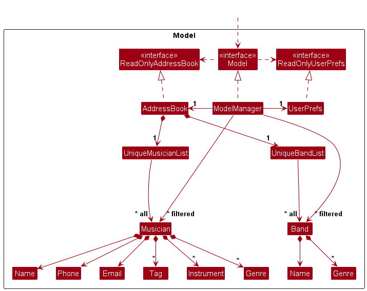
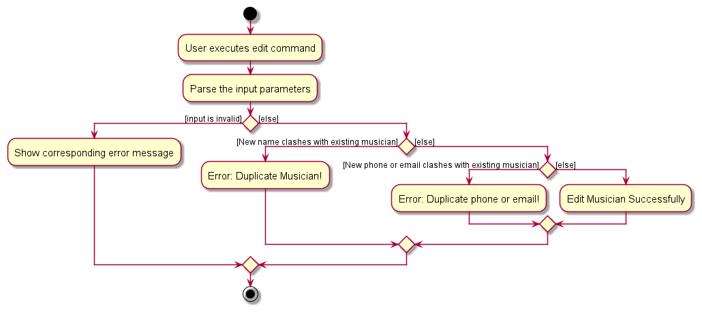

* Table of Contents
{:toc}

--------------------------------------------------------------------------------------------------------------------

## **Acknowledgements**

* [SE-EDU Address-Book Level 3](https://github.com/se-edu/addressbook-level3)

--------------------------------------------------------------------------------------------------------------------

## **Setting up, getting started**

Refer to the guide [_Setting up and getting started_](SettingUp.md).

--------------------------------------------------------------------------------------------------------------------

## **Design**

<div markdown="span" class="alert alert-primary">

:bulb: **Tip:** The `.puml` files used to create diagrams in this document `docs/diagrams` folder. Refer to the [_PlantUML Tutorial_ at se-edu/guides](https://se-education.org/guides/tutorials/plantUml.html) to learn how to create and edit diagrams.
</div>

### Architecture


The ***Architecture Diagram*** given above explains the high-level design of the App.

Given below is a quick overview of main components and how they interact with each other.

**Main components of the architecture**

**`Main`** (consisting of classes [`Main`](https://github.com/se-edu/addressbook-level3/tree/master/src/main/java/seedu/address/Main.java) and [`MainApp`](https://github.com/se-edu/addressbook-level3/tree/master/src/main/java/seedu/address/MainApp.java)) is in charge of the app launch and shut down.
* At app launch, it initializes the other components in the correct sequence, and connects them up with each other.
* At shut down, it shuts down the other components and invokes cleanup methods where necessary.

The bulk of the app's work is done by the following four components:

* [**`UI`**](#ui-component): The UI of the App.
* [**`Logic`**](#logic-component): The command executor.
* [**`Model`**](#model-component): Holds the data of the App in memory.
* [**`Storage`**](#storage-component): Reads data from, and writes data to, the hard disk.

[**`Commons`**](#common-classes) represents a collection of classes used by multiple other components.

**How the architecture components interact with each other**

The *Sequence Diagram* below shows how the components interact with each other for the scenario where the user issues the command `delete 1`.


Each of the four main components (also shown in the diagram above),

* defines its *API* in an `interface` with the same name as the Component.
* implements its functionality using a concrete `{Component Name}Manager` class (which follows the corresponding API `interface` mentioned in the previous point.

For example, the `Logic` component defines its API in the `Logic.java` interface and implements its functionality using the `LogicManager.java` class which follows the `Logic` interface. Other components interact with a given component through its interface rather than the concrete class (reason: to prevent outside component's being coupled to the implementation of a component), as illustrated in the (partial) class diagram below.


The sections below give more details of each component.

### UI component

The **API** of this component is specified in [`Ui.java`](https://github.com/se-edu/addressbook-level3/tree/master/src/main/java/seedu/address/ui/Ui.java)


The UI consists of a `MainWindow` that is made up of parts e.g.`CommandBox`, `ResultDisplay`, `PersonListPanel`, `StatusBarFooter` etc. All these, including the `MainWindow`, inherit from the abstract `UiPart` class which captures the commonalities between classes that represent parts of the visible GUI.

The `UI` component uses the JavaFx UI framework. The layout of these UI parts are defined in matching `.fxml` files that are in the `src/main/resources/view` folder. For example, the layout of the [`MainWindow`](https://github.com/se-edu/addressbook-level3/tree/master/src/main/java/seedu/address/ui/MainWindow.java) is specified in [`MainWindow.fxml`](https://github.com/se-edu/addressbook-level3/tree/master/src/main/resources/view/MainWindow.fxml)

The `UI` component,

* executes user commands using the `Logic` component.
* listens for changes to `Model` data so that the UI can be updated with the modified data.
* keeps a reference to the `Logic` component, because the `UI` relies on the `Logic` to execute commands.
* depends on some classes in the `Model` component, as it displays `Person` object residing in the `Model`.

### Logic component

**API** : [`Logic.java`](https://github.com/se-edu/addressbook-level3/tree/master/src/main/java/seedu/address/logic/Logic.java)

Here's a (partial) class diagram of the `Logic` component:


The sequence diagram below illustrates the interactions within the `Logic` component, taking `execute("delete 1")` API call as an example.


<div markdown="span" class="alert alert-info">:information_source: **Note:** The lifeline for `DeleteCommandParser` should end at the destroy marker (X) but due to a limitation of PlantUML, the lifeline reaches the end of diagram.
</div>

How the `Logic` component works:

1. When `Logic` is called upon to execute a command, it is passed to an `AddressBookParser` object which in turn creates a parser that matches the command (e.g., `DeleteCommandParser`) and uses it to parse the command.
1. This results in a `Command` object (more precisely, an object of one of its subclasses e.g., `DeleteCommand`) which is executed by the `LogicManager`.
1. The command can communicate with the `Model` when it is executed (e.g. to delete a musician).
1. The result of the command execution is encapsulated as a `CommandResult` object which is returned back from `Logic`.

Here are the other classes in `Logic` (omitted from the class diagram above) that are used for parsing a user command:


How the parsing works:
* When called upon to parse a user command, the `AddressBookParser` class creates an `XYZCommandParser` (`XYZ` is a placeholder for the specific command name e.g., `AddCommandParser`) which uses the other classes shown above to parse the user command and create a `XYZCommand` object (e.g., `AddCommand`) which the `AddressBookParser` returns back as a `Command` object.
* All `XYZCommandParser` classes (e.g., `AddCommandParser`, `DeleteCommandParser`, ...) inherit from the `Parser` interface so that they can be treated similarly where possible e.g, during testing.

### Model component
**API** : [`Model.java`](https://github.com/se-edu/addressbook-level3/tree/master/src/main/java/seedu/address/model/Model.java)




The `Model` component,

* stores the address book data i.e., all `Person` objects (which are contained in a `UniquePersonList` object).
* stores the currently 'selected' `Person` objects (e.g., results of a search query) as a separate _filtered_ list which is exposed to outsiders as an unmodifiable `ObservableList<Person>` that can be 'observed' e.g. the UI can be bound to this list so that the UI automatically updates when the data in the list change.
* stores a `UserPref` object that represents the user’s preferences. This is exposed to the outside as a `ReadOnlyUserPref` objects.
* does not depend on any of the other three components (as the `Model` represents data entities of the domain, they should make sense on their own without depending on other components)

<div markdown="span" class="alert alert-info">:information_source: **Note:** An alternative (arguably, a more OOP) model is given below. It has a `Tag` list in the `AddressBook`, which `Person` references. This allows `AddressBook` to only require one `Tag` object per unique tag, instead of each `Person` needing their own `Tag` objects.<br>


</div>


### Storage component

**API** : [`Storage.java`](https://github.com/se-edu/addressbook-level3/tree/master/src/main/java/seedu/address/storage/Storage.java)


The `Storage` component,
* can save both address book data and user preference data in JSON format, and read them back into corresponding objects.
* inherits from both `AddressBookStorage` and `UserPrefStorage`, which means it can be treated as either one (if only the functionality of only one is needed).
* depends on some classes in the `Model` component (because the `Storage` component's job is to save/retrieve objects that belong to the `Model`)

### Common classes

Classes used by multiple components are in the `seedu.addressbook.commons` package.

--------------------------------------------------------------------------------------------------------------------

## **Implementation**

This section describes some noteworthy details on how certain features are implemented.

### Add Musician Feature
The user can add a new musician to the storage through the `add` Command.

Command: `add n/NAME p/PHONE_NUMBER e/EMAIL [t/TAG]…​  [i/INSTRUMENT]…​  [g/GENRE]…​`

#### Behaviour
* **Success Scenario:**
    1. A success message is returned.
    2. The musician panel immediately reflects the updated musician list with the new musician just added. The band panel shows all bands.

* **Failed Scenario (when musician already exists in storage):**
    1. An error message is returned.
    2. In the musician panel, it shows all musicians. In the band panel, it shows all bands.

#### Implementation
Within the `execute()` method of the command, a check is done to ensure that the model does not currently contain any musician with the same name, phone, or email. This is achieved through the use of `Model::hasMusician` and `Model::hasDuplicateInfo` method.

### Edit Musician Feature
The user can edit all fields about an existing musician through the `edit` command, referenced by current index in the musician list.


Command: `edit INDEX [n/NAME] [p/PHONE_NUMBER] [e/EMAIL] [t/TAG]…​  [i/INSTRUMENT]…​  [g/GENRE]…​`

#### Behaviour
* **Success Scenario:**
    1. A success message is returned.
    2. The musician panel immediately reflects the updated musician list with the edited musician. The band panel shows all bands.

* **Failed Scenario:**
    1. An error message is returned.
    2. In the musician panel, it shows all musicians. In the band panel, it shows all bands.
* **Failing condition:** When edited information leads to duplicate name, phone or email with another musician already exists in storage.

#### Implementation


Within the `execute()` method of the command, a check is done to ensure that the model does not currently contain any musician with the same name, phone, or email with the edited musician information. This is achieved through the use of `Model::isSameMusician` and `Model::hasDuplicateInfo` method.

#### Design Considerations
It is important to maintain the unique constraint of name, phone, and email of musicians at all times. Hence, `Model::isSameMusician` is called to check that no musicians have the same name as the edited musician, and `Model::hasDuplicateInfo` is called to check the uniqueness of phone and email of the edited musician.


### Tagging Musician with Instruments and Genres Feature

There is no specialised command for tagging a musician with the instruments and genres they are specialised in. Instead, the user can tag a musician using the `i/` (for instruments) and `g/` (for genres) prefixes in both the `add` and `edit` commands. For example, to tag an existing musician with the instruments `guitar` and genre `jazz`, the user can use the command `edit INDEX i/guitar g/jazz`. For more detailed information on the `add` and `edit` command implementations, please refer to the [Add Musician Feature](#add-musician-feature) and [Edit Musician Feature](#edit-musician-feature) sections.

#### Implementation
The instruments and genres of a musician are implemented as the subclasses of the general `Tag` class. They all have a single attribute called `tagName`, which denotes the content of the tag. 

However, they have different static methods for checking the validity of the inputs. While `Tag::isValidTagName(String)` allows any alphanumeric characters, `Instrument::isValidInstrumentName(String)` and `Genre::isValidGenreName(String)` checks for the semantics (against a comprehensive list of instruments/genres) to prevent any input that does not make sense or has typos.


Since the implementation of [`Instrument`](https://github.com/AY2324S1-CS2103T-W11-3/tp/blob/master/src/main/java/seedu/address/model/tag/Instrument.java) and [`Genre`](https://github.com/AY2324S1-CS2103T-W11-3/tp/blob/master/src/main/java/seedu/address/model/tag/Genre.java) are similar, we will take `Instrument` as an example. 

The `Instrument` class contains a static field `VALID_INSTRUMENTS` which contains a list of valid instruments.

```java
// LinkedHashSet is used to preserve the alphabetical order of the instrument list
// when displayed to the user.
public static final HashSet<String> VALID_INSTRUMENTS = new LinkedHashSet<>(
         Arrays.asList("bass", "cello", ... "violin", "voice", "other"));
```

Then, when the user inputs an instrument in the command, the `Instrument::isValidInstrumentName(String)` method is called to check if the input is in the `VALID_INSTRUMENTS` before creating and storing the `Instrument` object for the musician.

#### Design Considerations

**Aspect: Validation checks for instruments and genres**
* **Alternative 1 (current design):** Enforce validation checks for instruments and genres by creating more specialised subclasses of the general `Tag` classes.
  * Pros: Prevents the user from storing invalid instruments and genres for a musician.
  * Pros: Implementing `Instrument` and `Genre` as subclasses of `Tag` allows them to be treated as `Tag` objects in other components, which increases compatibility and reduces coupling with other existing components.
  * Cons: Currently, the user cannot directly modify the lists of valid instruments and genres, so these lists have to be updated frequently by the developers to ensure niche instruments and genres are captured. 
* **Alternative 2:** Store instruments and genres as general `Tag` objects with basic validation checks.
  * Pros: Gives the user more freedom of tagging the musicians with instruments and genres.
  * Cons: The user can store invalid instruments and genres (due to typos) for a musician. This way, the user will encounter difficulties when finding musicians by instruments or genres.


### Find Musician Feature

The find musician feature allows the user to search for musicians by their name, general tags, instruments, and genres. The following activity diagram illustrates the logic flow of the feature.


As shown by the diagram, the find feature finds musicians who satisfy the matching criteria (matching at least one keyword) for _all_ specified categories. For example, if the user inputs `find n/John i/piano i/guitar g/jazz`, the find feature will return all musicians whose name contains `John` **and** plays the instrument `guitar` **or** `piano` **and** specialises in the genre `jazz`.

#### Implementation

The following sequence diagram explains in detail how the find feature works with an example scenario.


<div markdown="block" class="alert alert-info">

:information_source: **Meanings of the abbreviations used in the diagram:**

* `NCKP`: `NameContainsKeywordsPredicate`
* `IMP`: `InstrumentMatchesPredicate`
* `GMP`: `GenreMatchesPredicate`

Abbreviations are used to reduce the clutter in the diagram.

</div>

Step 1. A `FindCommandParser` parses the command and creates a predicate for each category (`NCKP`, `IMP`, `GMP`) based on the keywords specified by the user. Since the user specifies nothing for the `tag` category, the `TagMatchesKeywordPredicate` is not created.

Step 2. Then, the `FindCommndParser` creates a `FindCommand` object with the set of predicates created in the previous step.

Step 3. When the `FindCommand` object is executed, it combines all the predicates into a single `combinedPrediacte`. This predicate is then used to filter the musician list using the `Model::updateFilteredMusicianList(Predicate)` method.

#### Design Considerations

**Aspect: Filtering musicians by multiple categories**
* **Alternative 1 (current design):** only allow finding musicians by four categories: name, tag, genre, and instrument.
* **Alternative 2:** on top of the four categories, the application also supports find by email and phone.
The reasons for us to choose alternative 1 are:
* The four categories are the most important frequently used categories for the user to find musicians. A music producer (the user for our product) is more likely to remember musicians by their names, instruments, genres over their emails and phones.
* Implementing the extra two categories is simply a repetitive task of creating two more predicates and adding them to the `FindCommandParser`. Hence, there is not sufficient value of implementing the extra two categories in both technical aspects and usability.

### Add Band Feature 
The user can add a new Band entity to the storage through the `addb` Command.

Command: `addb n/BANDNAME`

#### Behaviour
* **Success Scenario:**
    1. A success message is returned.
    2. In the musician panel, it shows all musicians. In the band panel, it shows the updated list of bands after the specified band has been added.

* **Failed Scenario (when band already exists in storage):**
    1. An error message is returned.
    2. In the musician panel, it shows all musicians. In the band panel, it shows all bands.

#### Implementation
Within the execute method of the command, a check is done to ensure that the model does not currently contain the band
to be added. This is achieved through the use of `Model#hasBand(Band)` method.


### Add Musician To Band Feature

The user can add multiple musicians to a band through the `addm` command.

#### Implementation
Multiple checks are put in place to ensure the correct execution of the command. The `AddMusicianToBandCommandParser` is responsible for checking the validity of the input format, e.g. both musician and band indices should be provided, while the `AddMusicianToBandCommand` is responsible for checking the validity of the indices, e.g. the musician is not already in the band, and the indices are valid.

The following activity diagram illustrates the logic flow of the feature and how it deals with different invalid inputs.


### Delete Band Feature
The user can remove a Band from the storage through the `deleteb` Command.

Command: `deleteb [INDEX]`

#### Behaviour
* **Success Scenario:**
    1. A success message is returned.
    2. In the musician panel, it shows all musicians. In the band panel, it shows the updated list of bands after the specified band has been deleted. 

* **Failed Scenario (when band index is invalid):**
    1. An error message is returned.
    2. In the musician panel, it shows all musicians. In the band panel, it shows all bands.

#### Implementation

Within the execute method of the command, a check is done to ensure that the index specified is not equal to or greater 
than the size of the list containing all Bands.


### Find Band Members Feature
**Command**:`findb [BANDNAME]`

This feature lists all the musicians in band with name of `BANDNAME`. 

#### Behaviour
* **Success Scenario:**
  1. A success message is returned.
  2. In the musician panel, it shows every musician who is a member of the band. In the band panel, it shows only this particular band.

* **Failed Scenario (when band name is invalid):** 
    1. An error message is returned.
    2. In the musician panel, it shows all musicians. In the band panel, it shows all bands.
#### Implementation
The following activity diagram shows the logic flow of this feature.

Find band members through a band name is achieved via `ModelManager.updateFilteredBandMusicianList(Predicate<Band>)` method.

Step 1: It takes in a `BandNameContainsKeywordPredicate` as argument and updates the filtered band based on this predicate. 

Step 2: If the band name is valid, the filtered band list is guaranteed to contain only the correct (one) band. Next, it updates the musician list based on `MusicianInBandPredicate` and successfully returns all musicians in that band.

Step 3: If the band name is not valid (There is no band with such a name), a `MESSAGE_UNKNOWN_BAND` error message will be throw as a command exception.

The following sequence diagram explains in detail how the findb feature works in an example scenario.


<div markdown="block" class="alert alert-info">

**Meanings of the abbreviations used in the diagram:**

* `BNCKP`: `BandNameContainsKeywordsPredicate`

Abbreviations are used to reduce the clutter in the diagram.

</div>
#### Rationale 
1. **Rationale for abstracting a method for updating band and musician list simultaneously:**

    While it is possible to use existing methods `updateFilteredBandList` followed by `updateFilteredMusicianList` to compose the same logic, abstracting it out makes it obvious that filtering musicians is based on the results from filtering bands, which is a main mechanism the feature relies on. If the alternative is used and a person accidentally inserts any statements that modifies the filtered band list in between the two methods,  this feature will break.


2. **Rationale for the error condition:**
    
   Our current error condition:
   
    ~~~
   if (model.getFilteredBandList().size() > 1 || !predicate.test(model.getFilteredBandList().get(0)) {
       // throw exception
   }
    ~~~
   i. If the band is valid and exists, filtered band list is guaranteed to have only one band (because add a band enforce no band with the same name (case-insensitive) is allowed). Hence, If filtered band list size > 1, the band name must be invalid, exception is thrown.

   ii. If filtered band list size == 1 but the band obtained does not pass the predicate (in the possible scenario of user only stored 1 band), it means that the band name is invalid and does not correspond to the current band, exception is thrown.

### Edit Band Feature
The user can edit the name and genres of an existing band through the `editb` command, referenced by current index in the band list.


Command: `editb INDEX [n/NAME] [g/GENRE]…​`

#### Behaviour
* **Success Scenario:**
    1. A success message is returned.
    2. The band panel immediately reflects the updated band list with the updated band. The musician panel shows all musicians.

* **Failed Scenario:**
    1. An error message is returned.
    2. In the musician panel, it shows all musicians. In the band panel, it shows all bands.
* **Failing condition:** When edited information leads to duplicate name, phone or email with another musician already exists in storage.

#### Implementation


Within the `execute()` method of the command, a check is done to ensure that the model does not currently contain any band with the same name as the edited band. This is achieved through the use of `Model::hasBand` method.

#### Design Considerations
It is important to maintain the unique constraint of name of bands at all times. Hence, `Model::hasBand` is called to check that no bands have the same name as the edited band.

--------------------------------------------------------------------------------------------------------------------

## **Documentation, logging, testing, configuration, dev-ops**

* [Documentation guide](Documentation.md)
* [Testing guide](Testing.md)
* [Logging guide](Logging.md)
* [Configuration guide](Configuration.md)
* [DevOps guide](DevOps.md)

--------------------------------------------------------------------------------------------------------------------

## **Appendix: Requirements**

### Product scope

**Target user profile**:

* has a need to manage a significant number of musician contacts
* has a need to categorise musicians by genre or instrument
* prefer desktop apps over other types
* can type fast
* prefers typing to mouse interactions
* is reasonably comfortable using CLI apps

**Value proposition**: manage contacts faster than a typical mouse/GUI driven app, tracking relevant information
about musicians to potentially work with


### User stories

Priorities: High (must have) - `* * *`, Medium (nice to have) - `* *`, Low (unlikely to have) - `*`

| Priority | As a …​                                          | I want to …​                                     | So that I can…​                                                          |
|--------|--------------------------------------------------|--------------------------------------------------|--------------------------------------------------------------------------|
| `* * *` | producer                                         | see usage instructions                           | refer to instructions when I forget how to use the App                   |
| `* * *` | producer                                         | add a new musician                               | contact them to form a band                                              |
| `* * *` | producer                                         | delete a record for one musician                 | remove entries that I no longer need                                     |
| `* * *` | producer                                         | find a musician by name                          | locate details of musicians without having to go through the entire list |
| `* *`  | producer                                         | tag a musician with an instrument they play      | understand their potential role in a band                                |
| `* *`  | producer                                         | create a band                                    |                                                                          |
| `* *`  | producer                                         | add a musician to a band                         | group musicians together                                                 |
| `* *`  | producer                                         | view the members of a specific band              | keep track of the band members in each band                              |
| `* *`  | producer                                         | delete a band                                    |                                                                          |
| `* *`  | producer                                         | tag a musician with the genre they specialise in | find musicians suiting the song I am making                              |
| `* *`  | producer                                         | edit a record for a musician                     | modify or update the information for a musician                          |
| `* *`  | producer                                         | view all records of musicians I have stored      | easily see all the information I have                                    |
| `* *`  | producer                                         | hide private contact details                     | minimize chance of someone else seeing them by accident                  |
| `*`    | producer                                         | tag a band with the genre it specialises in      | find the band suited to performing the song I wish                       |
| `*`    | producer who has worked with a musician before   | give a musician a rating                         | keep track of my past experience with them                               |
| `*`    | producer who has worked with a musician before   | give a musician a rating                         | keep track of my past experience with them                               |
| `*`    | producer who is actively producing music         | check the availability of a musician             | avoid musicians with clashing schedules                                  |
| `*`    | producer with many musicians in the address book | sort musicians by name                           | locate a musician easily                                                 |


*{More to be added}*

### Use cases

(For all use cases below, the **System** is `BandConnect++` and the **Actor** is the `producer`, unless specified otherwise)

**Use case: UC01 - Add a musician**

**MSS**

1. User enters the musician details
2. User requests to create a new contact for this musician
3. System creates and stores the new contact

   Use case ends.

**Extensions**

* 2a. This musician is already stored in the system
* 2a1. System shows a message showing that the contact is already stored.

  Use case ends.


**Use case: UC03 - Delete a musician**

**MSS**

1.  User requests to list musicians
2.  BandConnect++ shows a list of musicians
3.  User requests to delete a specific musician in the list
4.  BandConnect++ deletes the musician

    Use case ends.

**Extensions**

* 2a. The list is empty.

  Use case ends.

* 3a. The given index is invalid.

    * 3a1. BandConnect++ shows an error message.

      Use case resumes at step 2.

**Use case: UC04 - Tag a musician with the instrument they play**

**MSS**

1.  User requests to list musicians
2.  BandConnect++ shows a list of musicians
3.  User tags a specific musician with the instrument they play
4.  BandConnect++ tags the musician appropriately

    Use case ends.

**Extensions**

* 2a. The list is empty.

  Use case ends.

* 3a. BandConnect++ detects an error in the entered data.

    * 3a1. BandConnect++ shows an error message.

      Use case resumes at step 2.


**Use case: UC05 - Tag a musician with the genre(s) he/she specialises in**

**MSS**

1.  User requests to list musicians
2.  BandConnect++ shows a list of musicians
3.  User tags a specific musician with one or more genres
4.  BandConnect++ tags the musician appropriately

    Use case ends.

**Extensions**

* 2a. The list is empty.

  Use case ends.

* 3a. BandConnect++ detects an empty genre tag or no genre tag.

    * 3a1. BandConnect++ shows an error message.

      Use case resumes at step 2.

**Use case: UC06 - Find a musician based on their name**

**MSS**

1.  User requests to find a musician with a keyword
2.  BandConnect++ shows a list of musicians that matches the keyword

    Use case ends.

**Extensions**

* 2a. The list is empty.

  Use case ends.

**Use case: UC07 - Create a band**

**MSS**

1. User enters the band details
2. User requests to create a new band with the specified name
3. System creates and stores the new band

   Use case ends.

**Extensions**

* 2a. This band is already stored in the system
* 2a1. System shows a message showing that the contact is already stored.

* 2b. User enters input wrongly
* 2b1. System shows a message showing the proper input format.

  Use case ends.
  
**Use case: UC08 - Add a musician to a band**

**MSS**

1. User enters the band details and musician details
2. User requests to add the specified musician to the band
3. BandConnect++ adds the musician to the band

   Use case ends.

**Extensions**

* 2a. The musician specified is already part of the band specified
* 2a1. System shows a message showing that the musician is already part of the band.

* 2b. User enters input wrongly
* 2b1. System shows a message showing the proper input format.

  Use case ends.

**Use case: UC09 - Delete band**

**MSS**

1. User enters the band details they want to delete.
2. User requests to delete band.
3. BandConnect++ deletes the band.

   Use case ends.

**Extensions**

* 2a. User enters input wrongly
* 2a1. System shows a message showing the proper input format.

  Use case ends.

**Use case: UC10 - View all musicians inside a band**

**MSS**

1. User enters the band details they want to view the members of.
2. User requests view musicians inside the band.
3. BandConnect++ shows the musicians inside the specified band.

   Use case ends.

**Extensions**

* 2a. User enters input wrongly
* 2a1. System shows a message showing the proper input format.

  Use case ends.

**Use case: UC11 - Remove a musician from a band**

**MSS**

1. User enters the band details and musician details.
2. User requests to remove the musician from the band.
3. BandConnect++ removes the musician from the band.

   Use case ends.

**Extensions**

* 2a. User enters input wrongly
* 2a1. System shows a message showing the proper input format.

  Use case ends.

*{More to be added}*


### Non-Functional Requirements

1.  Should be able to hold up to 1000 musician contacts without a noticeable sluggishness in performance for typical usage.
3.  A user with above average typing speed for regular English text (i.e. not code, not system admin commands) should be able to accomplish most of the tasks faster using commands than using the mouse.
4. The GUI should be intuitive enough for musicians who are not IT-savvy.
5. The response to any use action should become visible within 5 seconds.
6. Should work on any _mainstream OS_ as long as it has Java `11` or above installed.

### Glossary

* **Mainstream OS**: Windows, Linux, Unix, OS-X
* **Genre**: Genre of music, including but not limited to: Jazz, Classical, Rock
* **Private contact detail**: A contact detail that is not meant to be shared with others

--------------------------------------------------------------------------------------------------------------------

## **Appendix: Instructions for manual testing**

Given below are instructions to test the app manually.

<div markdown="span" class="alert alert-info">:information_source: **Note:** These instructions only provide a starting point for testers to work on;
testers are expected to do more *exploratory* testing.

</div>

### Launch and shutdown

1. Initial launch

    1. Download the jar file and copy into an empty folder

    1. Double-click the jar file Expected: Shows the GUI with a set of sample contacts. The window size may not be optimum.

1. Saving window preferences

    1. Resize the window to an optimum size. Move the window to a different location. Close the window.

    1. Re-launch the app by double-clicking the jar file.<br>
       Expected: The most recent window size and location is retained.

1. _{ more test cases …​ }_

### Deleting a musician

1. Deleting a musician while all musicians are being shown

    1. Prerequisites: List all musicians using the `list` command. Multiple musicians in the list.

    1. Test case: `delete 1`<br>
       Expected: First contact is deleted from the list. Details of the deleted contact shown in the status message. Timestamp in the status bar is updated.

    1. Test case: `delete 0`<br>
       Expected: No musician is deleted. Error details shown in the status message. Status bar remains the same.

    1. Other incorrect delete commands to try: `delete`, `delete x`, `...` (where x is larger than the list size)<br>
       Expected: Similar to previous.

1. _{ more test cases …​ }_

### Saving data

1. Dealing with missing/corrupted data files

    1. _{explain how to simulate a missing/corrupted file, and the expected behavior}_

1. _{ more test cases …​ }_
