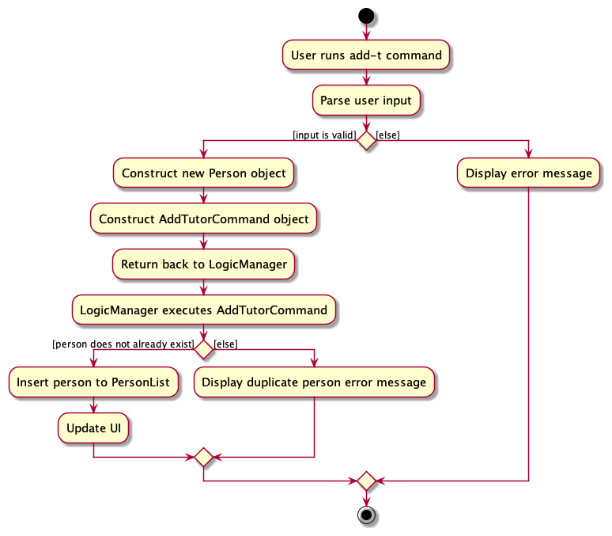
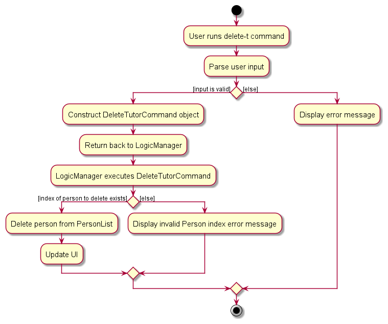
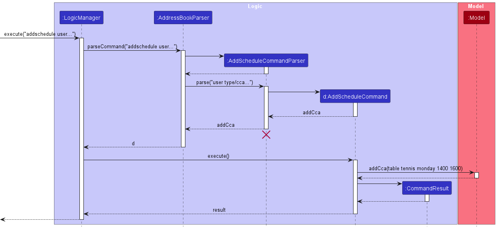
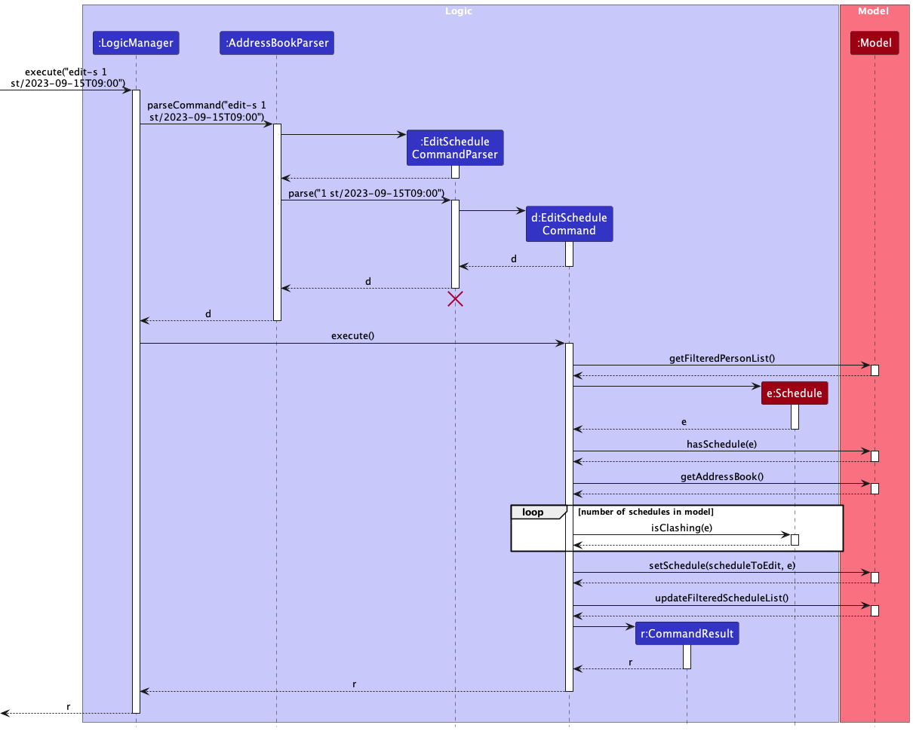
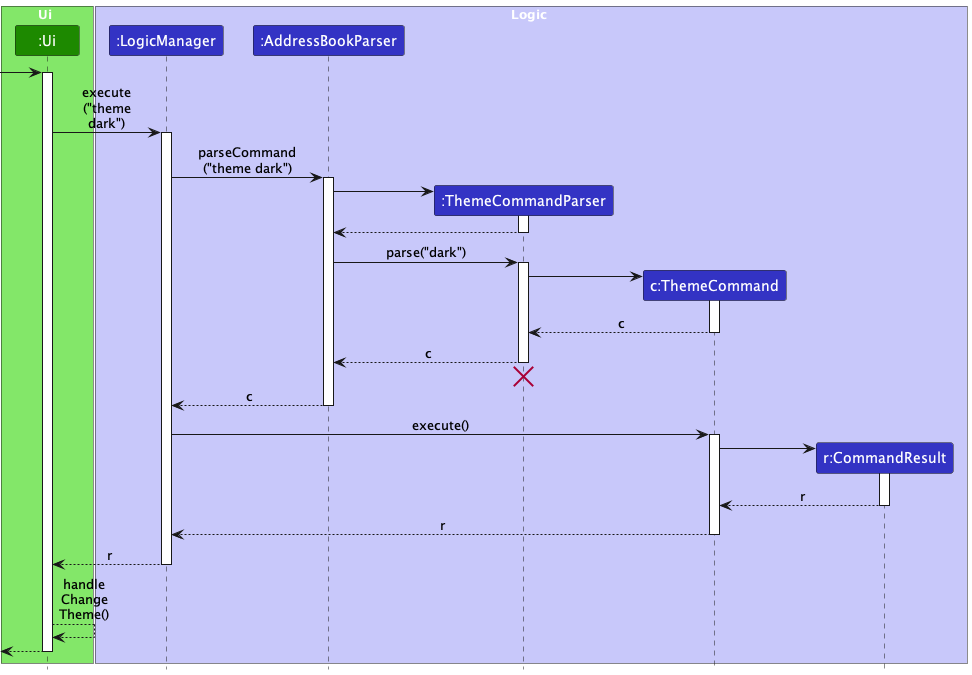

* Table of Contents
{:toc}

--------------------------------------------------------------------------------------------------------------------

## **Acknowledgements**

* {list here sources of all reused/adapted ideas, code, documentation, and third-party libraries -- include links to the original source as well}

--------------------------------------------------------------------------------------------------------------------

## **Setting up, getting started**

Refer to the guide [_Setting up and getting started_](SettingUp.md).

--------------------------------------------------------------------------------------------------------------------

## **Design**

:bulb: **Tip:** The `.puml` files used to create diagrams in this document `docs/diagrams` folder. Refer to the [_PlantUML Tutorial_ at se-edu/guides](https://se-education.org/guides/tutorials/plantUml.html) to learn how to create and edit diagrams.

### Architecture

The ***Architecture Diagram*** given above explains the high-level design of the App.

Given below is a quick overview of main components and how they interact with each other.

**Main components of the architecture**

**`Main`** (consisting of classes [`Main`](https://github.com/se-edu/addressbook-level3/tree/master/src/main/java/seedu/address/Main.java) and [`MainApp`](https://github.com/se-edu/addressbook-level3/tree/master/src/main/java/seedu/address/MainApp.java)) is in charge of the app launch and shut down.
* At app launch, it initializes the other components in the correct sequence, and connects them up with each other.
* At shut down, it shuts down the other components and invokes cleanup methods where necessary.

The bulk of the app's work is done by the following four components:

* [**`UI`**](#ui-component): The UI of the App.
* [**`Logic`**](#logic-component): The command executor.
* [**`Model`**](#model-component): Holds the data of the App in memory.
* [**`Storage`**](#storage-component): Reads data from, and writes data to, the hard disk.

[**`Commons`**](#common-classes) represents a collection of classes used by multiple other components.

**How the architecture components interact with each other**

The *Sequence Diagram* below shows how the components interact with each other for the scenario where the user issues the command `delete 1`.

Each of the four main components (also shown in the diagram above),

* defines its *API* in an `interface` with the same name as the Component.
* implements its functionality using a concrete `{Component Name}Manager` class (which follows the corresponding API `interface` mentioned in the previous point.

For example, the `Logic` component defines its API in the `Logic.java` interface and implements its functionality using the `LogicManager.java` class which follows the `Logic` interface. Other components interact with a given component through its interface rather than the concrete class (reason: to prevent outside component's being coupled to the implementation of a component), as illustrated in the (partial) class diagram below.

The sections below give more details of each component.

### UI component

The **API** of this component is specified in [`Ui.java`](https://github.com/se-edu/addressbook-level3/tree/master/src/main/java/seedu/address/ui/Ui.java)

The UI consists of a `MainWindow` that is made up of parts e.g.`CommandBox`, `ResultDisplay`, `PersonListPanel`, `ScheduleListPanel`, `CalendarPanel`, `StatusBarFooter` etc. All these, including the `MainWindow`, inherit from the abstract `UiPart` class which captures the commonalities between classes that represent parts of the visible GUI.

The `UI` component uses the JavaFx UI framework. The layout of these UI parts are defined in matching `.fxml` files that are in the `src/main/resources/view` folder. For example, the layout of the [`MainWindow`](https://github.com/se-edu/addressbook-level3/tree/master/src/main/java/seedu/address/ui/MainWindow.java) is specified in [`MainWindow.fxml`](https://github.com/se-edu/addressbook-level3/tree/master/src/main/resources/view/MainWindow.fxml)

The `UI` component,

* executes user commands using the `Logic` component.
* listens for changes to `Model` data so that the UI can be updated with the modified data.
* keeps a reference to the `Logic` component, because the `UI` relies on the `Logic` to execute commands.
* depends on some classes in the `Model` component, as it displays `Person` object residing in the `Model`.

### Logic component

**API** : [`Logic.java`](https://github.com/se-edu/addressbook-level3/tree/master/src/main/java/seedu/address/logic/Logic.java)

Here's a (partial) class diagram of the `Logic` component:

The sequence diagram below illustrates the interactions within the `Logic` component, taking `execute("delete 1")` API call as an example.

:information_source: **Note:** The lifeline for `DeleteCommandParser` should end at the destroy marker (X) but due to a limitation of PlantUML, the lifeline reaches the end of diagram.

How the `Logic` component works:

1. When `Logic` is called upon to execute a command, it is passed to an `AddressBookParser` object which in turn creates a parser that matches the command (e.g., `DeleteCommandParser`) and uses it to parse the command.
1. This results in a `Command` object (more precisely, an object of one of its subclasses e.g., `DeleteCommand`) which is executed by the `LogicManager`.
1. The command can communicate with the `Model` when it is executed (e.g. to delete a person).
1. The result of the command execution is encapsulated as a `CommandResult` object which is returned back from `Logic`.

Here are the other classes in `Logic` (omitted from the class diagram above) that are used for parsing a user command:

How the parsing works:
* When called upon to parse a user command, the `AddressBookParser` class creates an `XYZCommandParser` (`XYZ` is a placeholder for the specific command name e.g., `AddCommandParser`) which uses the other classes shown above to parse the user command and create a `XYZCommand` object (e.g., `AddCommand`) which the `AddressBookParser` returns back as a `Command` object.
* All `XYZCommandParser` classes (e.g., `AddCommandParser`, `DeleteCommandParser`, ...) inherit from the `Parser` interface so that they can be treated similarly where possible e.g, during testing.

### Model component
**API** : [`Model.java`](https://github.com/se-edu/addressbook-level3/tree/master/src/main/java/seedu/address/model/Model.java)

The `Model` component,

* stores the address book data i.e., all `Person` objects (which are contained in a `UniquePersonList` object) and `Schedule` objects (which are contained in a `UniqueScheduleList` object).
* stores the currently 'selected' `Person` objects (e.g., results of a search query) as a separate _filtered_ list which is exposed to outsiders as an unmodifiable `ObservableList<Person>` that can be 'observed' e.g. the UI can be bound to this list so that the UI automatically updates when the data in the list change.
* similarly also stores the currently 'selected' `Schedule` objects and this is exposed to outsiders as an unmodifiable `ObservableList<Schedule>`
* stores a `UserPref` object that represents the user’s preferences. This is exposed to the outside as a `ReadOnlyUserPref` objects.
* does not depend on any of the other three components (as the `Model` represents data entities of the domain, they should make sense on their own without depending on other components)

### Storage component

**API** : [`Storage.java`](https://github.com/se-edu/addressbook-level3/tree/master/src/main/java/seedu/address/storage/Storage.java)

The `Storage` component,
* can save both address book data and user preference data in JSON format, and read them back into corresponding objects.
* inherits from both `AddressBookStorage` and `UserPrefStorage`, which means it can be treated as either one (if only the functionality of only one is needed).
* depends on some classes in the `Model` component (because the `Storage` component's job is to save/retrieve objects that belong to the `Model`)

### Common classes

Classes used by multiple components are in the `seedu.addressbook.commons` package.

--------------------------------------------------------------------------------------------------------------------

## **Implementation**

This section describes some noteworthy details on how certain features are implemented.

### Add tutor feature

The "Add Tutor" feature allows users to add a new tutor to the address book. Below, we provide an example usage scenario and a detailed description of how the add tutor mechanism behaves at each step.

The following shows the activity diagram from when a user executes the `add-t` command:

#### Implementation

Step 1. The user launches the application for the first time.

Step 2. The user executes `add-t n/John Doe p/98765432 e/johnd@example.com` to add a tutor to the address book. The 
command is parsed in `AddressBookParser`.

Step 3. `AddTutorCommandParser` is created, which constructs the `Person` to be added.  The `AddTutorCommand` is 
called with the `Person` created.

Step 4. The `AddTutorCommand` object executes the `addPerson` method through the `LogicManager`. The method then 
adds the `Person` in `model` and returns the `CommandResult`.

The following sequence diagram shows how the above steps for add tutor operation works:

#### Design rationale

The `add-t` command was designed this way to ensure consistency with the previous `add` person.

**Aspect: Optional fields**
* **Alternative 1:** Allow optional fields when adding tutor (e.g. user can omit phone number or email when adding a 
  tutor).
    * Pros: Allows users to input only necessary fields.
    * Cons: Increases code complexity to handle blank fields.
* **Alternative 2 (current choice):** Disallow optional fields when adding tutor (user must enter name, phone 
  number and email).
    * Pros: Easier to implement, and less error prone.
    * Cons: Users must have every field filled before they can add a tutor.

**Aspect: Non-unique phone number and email restriction**
* **Alternative 1:** Allow only unique phone numbers and emails of tutors.
    * Pros: Decreases erroneous user input when duplicated tutors are entered.
    * Cons: There can be real life scenarios where tutors have the same phone numbers of emails (since there is no 
      strict requirement against it).
* **Alternative 2 (current choice):** Allow only non-unique phone numbers and emails of tutors.
    * Pros: In line with real-life scenario as mentioned above.
    * Pros: Phone numbers and emails are means of contacting the tutors and there is no real need for them to be unique.
    * Cons: Duplicated tutors could be added.

**Aspect: Tutor name restrictions**
* **Alternative 1:** Allow tutors to have name input as only alphabets.
    * Pros: Decreases erroneous user input when phone numbers are accidentally input as names using `n/` tags.
    * Cons: With the implementation of unique names, tutor names cannot be differentiated with numbers.
* **Alternative 2 (current choice):** Allow tutors to have alphanumeric names.
    * Pros: Tutors with the same name can be differentiated with numbers.
    * Pros: Tutors' names are restricted to a limited number of characters to promote easy searching and reference 
      in the future. This also introduces uniformity.
    * Cons: Number inputs are accepted as names and users can erroneously use phone numbers as names instead.
    * Cons: Tutors' names with commas cannot be recognised and entered.
* **Alternative 3:** Allow tutors to have names with special characters, especially commas.
    * Pros: More representative of various name types, especially those with commas in their names.
    * Cons: Allowing too many special characters decreases the ability to locate and reference the tutors in future 
      (e.g. ABC,123@!?:" should not be accepted as a valid name).

### Edit tutor feature 

 The “Edit Tutor” feature allows users to edit an existing tutor in the address book given a tutor index. 

 Below, we provide an example usage scenario and a detailed description of how the edit tutor mechanism behaves at 
 each step.

 

 

**:information_source: Limitations** 
* Input format must adhere to the follow limitations:
    * `TUTOR_INDEX`: Only number input accepted, starting from 1 to the last tutor index shown in the list of tutors.
    * `NAME`: Only contain alphanumeric characters and spaces, and should not be blank
    * `PHONE NUMBER`: Only contain numbers, and should be at least 3 digits long
    * `EMAIL`: Of the format local-part@domain
* Tutor to be edited must not already exist in the addressbook (excluding the current specified one).
* TUTOR_INDEX parameter is compulsory and at least one edited field must be provided.

#### Implementation

The bulk of the implementation details is identical to that of other commands.
As such only details specific to `edit-t` will be discussed.

Step 1. The user has the application launched with at least 1 tutor added.

Step 2. The user executes `list-t` to view all added tutors.

Step 3. The user executes `edit-t 1 n/John Doe` to edit the first tutor's name in the list of tutors displayed. 
The command is parsed in AddressBookParser.

Step 4. EditTutorCommandParser is created, and constructs an `EditPersonDescriptor` which describes the edited 
`Person`. An EditTutorCommand object is then constructed with this `EditPersonDescriptor` and the specified tutor index.

Step 5. The EditTutorCommand object gets the specified person from the current filtered person list using the 
tutor index.

Step 6. EditTutorCommand object then creates an edited person from the specified person and the editPersonDescriptor.

Step 7. EditTutorCommand object then calls the setPerson method in the ModelManager with the new edited person. This 
method sets the specified `Person` in the model to be that edited person.

Step 8. Finally, the EditTutorCommand object updates the person list to display the edited person.

The following sequence diagram shows how the above steps for edit tutor operation works, taking 
`execute("edit-t 1 n/New Name")` API call as an example.

:information_source: **Note:** 
The lifeline for `EditTutorCommandParser` should end at the destroy marker (X) but due to a limitation of PlantUML,
the lifeline reaches the end of diagram.

#### Design rationale
The `edit-t` command was designed this way to ensure consistency with the previous `edit` person command.
 
### Delete tutor feature

The "Delete Tutor" feature allows users to delete an existing tutor in the address book given a tutor index.

Below, we provide an example usage scenario and a detailed description of how the delete tutor mechanism behaves at
each step. The following shows the activity diagram when a user executes the `delete-t` command:

**:information_source: Limitations** 
* Input format must adhere to the follow limitations:
    * `TUTOR_INDEX`: Only number input accepted, starting from 1 to the last tutor index shown in the list of tutors.
* TUTOR_INDEX parameter is compulsory.

#### Implementation

The bulk of the implementation details is identical to that of other commands.
As such only details specific to `delete-t` will be discussed.

Step 1. The user has the application launched with at least 1 tutor added.

Step 2. The user executes `list-t` to view all added tutors.

Step 3. The user executes `delete-t 1` to delete the tutor with Tutor index 1 in the list of tutors displayed.
The command is parsed in the AddressBookParser.

Step 4. DeleteTutorCommandParser is created and gets the index of the tutor to be deleted.
A DeleteTutorCommand object is then constructed with the specified tutor index.

Step 5. The DeleteTutorCommand object gets the specified person from the current filtered person list using the tutor
index.

Step 6. The DeleteTutorCommand object then calls the deletePerson method in the ModelManager with the specified person 
to delete. This method deletes the specified `Person` in the model.

Step 7. Finally, the DeleteTutorCommand object returns the `CommandResult`.

The following sequence diagram shows how the above steps for delete tutor operation works, taking
`execute("delete-t 1")` API call as an example.

**:information_source: Note:** 
The lifeline for `DeleteTutorCommandParser` should end at the destroy marker (X) 
but due to a limitation of PlantUML, the lifeline reaches the end of diagram.

#### Design rationale
The `delete-t` command was designed this way to ensure consistency with the previous `delete` person command.

### Add Schedule Feature

#### Implementation Details

The add schedule feature is facilitated by `AddScheduleCommand`. It extends `Command` with the necessary implementation to add a schedule to a `Model`. Additionally, it implements the following operation:

* `AddScheduleCommand#execute(Model)` — Adds the schedule to the `Model`.

This operation is exposed in the abstract `Command` class as an abstract method.

Given below is an example usage scenario and how the add schedule command behaves.

The user executes `add-s 1 s/2023-09-15T09:00:00 e/2023-09-15T11:00:00` command. The `AddScheduleCommandParser` will be initialized to parse the user input to create a `AddScheduleCommand` with a `Index`, `StartTime` and `EndTime` representing the user's input.

The `AddScheduleCommand#exceute(Model)` will perform the following checks in this order to ensure that the `Schedule` can be added to the `Model`:
1. The `Index` is valid.
2. A valid schedule can be created with the given `Index`, `StartTime` and `EndTime`.
    
:information_source: **Note:** A `Schedule` is considered valid if its start time is before its end time. This is enforced by the constructor of the `Schedule` class, it throws an `IllegalArgumentException` if it is not valid.

    

3. Executing this command would not result in a duplicate schedule in the `Model`.
    
:information_source: **Note:** A `Schedule` is considered a duplicate if it belongs to the same `Person` and have the same `StartTime` and `EndTime` as an existing schedule in the `Model`.

    

4. Executing this command would not result in a clashing schedule for the tutor specified by `Index` in the `Model`.
    
:information_source: **Note:** A `Schedule` is considered a clashing if it belongs to the same `Person` and have overlapping times. This is checked by `Schedule#isClashing(Schedule)`.

    

If any of these checks fail a `CommandException` with an appropriate error message will be thrown. Otherwise, it will create a `Schedule` and use `Model#addSchedule` to add the schedule to the `Model`.

The following shows the activity diagram from when a user executes the `add-s` command:

The following sequence diagram shows how the operation works:

:information_source: **Note:** The lifeline for `AddScheduleCommandParser` and `AddScheduleCommand` should end at the destroy marker (X) but due to a limitation of PlantUML, the lifeline reaches the end of diagram.

#### Design rationale

**Aspect: Checking for clashing schedule:**

* **Alternative 1 (current choice):** Perform the check in `AddScheduleCommand`.
    * Pros: Easy to implement.
    * Cons: Have to directly access schedules in the `UniqueScheduleList` creating dependencies.
    * Cons: Can be inefficient, as we have to iterate over all schedules in the schedule list.

* **Alternative 2:** Perform the check in `UniqueScheduleList`.
    * Pros: Consistent throughout the system as this check is enforced on all schedules being added to the `UniqueScheduleList` regardless of where it is being added from.
    * Pros: Can be optimised to use more efficient searching algorithms like binary search if the implementation of the underlying list is sorted.
    * Cons: Every schedule in the system have to adhere to that. For eg., if we want to allow the user to override such constraints it would not be possible without modifying the functionality of the list.

**Aspect: Checking for valid schedule:**

* **Alternative 1 (current choice):** Perform the check in `Schedule`.
    * Pros: Easy to implement.
    * Pros: Consistent throughout the system as it does not make any sense to have a schedule with a `StartTime` after its `EndTime`.
    * Cons: Have to handle the exception if an invalid schedule is being created.

* **Alternative 2:** Perform the check in `AddScheduleCommand`.
    * Pros: Allows for flexibility in the constraints.
    * Cons: Have to repeatedly write logic perform this check everywhere a new `Schedule` is being created.

### Edit schedule feature

The "Edit Schedule" feature allows users to edit an existing schedule in the address book. Below, we provide an example
usage scenario and a detailed description of how the edit schedule mechanism behaves at each step.

#### Implementation

Step 1. The user has the application launched with at least 1 schedule added.

Step 2. The user executes `list-s` to view all added schedules.

Step 3. The user executes `edit-s 1 st/2023-09-15T09:00` to edit the first schedule's start time in the list of
schedules displayed. The command is parsed in AddressBookParser.

Step 4. EditScheduleCommandParser is created, and constructs an `EditScheduleDescriptor` which describes the edited
`Schedule`. An EditScheduleCommand object is then constructed with this `EditScheduleDescriptor` and the
specified schedule index.

Step 5. The EditScheduleCommand object gets the specified schedule from the current filtered schedule list using the
schedule index.

Step 6. EditScheduleCommand object then creates an edited schedule from the specified schedule and the
`EditScheduleDescriptor`.

Step 7. EditScheduleCommand object then calls the setSchedule method in the ModelManager with the new edited schedule.
This method sets the specified `Schedule` in the model to be that edited schedule.

Step 8. Finally, the EditScheduleCommand object updates the schedule list to display the edited schedule.

The following sequence diagram shows how the above steps for edit schedule operation works:

:information_source: **Note:** 
The lifeline for `EditScheduleCommandParser` should end at the destroy marker (X) but due to a limitation of PlantUML,
the lifeline reaches the end of diagram.

#### Design rationale

**Aspect: Setting of schedule status**
* **Alternative 1:** Use an additional prefix to edit the status of a schedule. 
  * Pros: Allows users to directly edit the schedule status using the edit schedule command. 
  * Cons: Edit schedule command would have a considerable number of tags (it already has 3). It would also not match 
    up with add schedule command.
* **Alternative 2 (current choice):** Have a separate command for setting schedule status. 
  * Pros: It is more intuitive to the user and separates the responsibility of edit schedule. 
  * Cons: Requires separate commands for marking and unmarking schedule status.

**Aspect: Reassigning of tutor**
* **Alternative 1:** Allow user to edit the tutor allocated to the schedule. 
  * Pros: Allows users to easily modify schedule details, including allocated tutor. 
  * Cons: Users will need to provide the schedule index to identify the schedule to be edited, and provide the tutor 
    index that the schedule should be allocated to. This is difficult to implement with one list view.
* **Alternative 2 (current choice):**  Users cannot edit the tutor allocated to the schedule.
  * Pros: An additional optional flag is not needed, and the new tutor to be allocated does not need to be 
    identified from the tutor list.
  * Cons: In the editing of schedule, a `Person` is needed to create a new `Schedule`. Thus, the tutor allocated to 
    the target schedule needs to be obtained and used to create a new `Schedule`.

### Delete Schedule Feature
#### Implementation Details
The delete schedule feature is facilitated by `DeleteScheduleCommand`, which extends from `Command` with the necessary implementation to delete a schedule by a given index.
The following operation is exposed in the abstract `Command` class as an abstract method:
* `DeleteScheduleCommand#execute(Model)` - Deletes the schedule from the `Model` using the given index.

The following shows the activity diagram in which a user executes the `delete-s` command:

Given below is an example scenario on how the delete schedule command behaves:
1. The user has the application launched with at least 1 schedule added.
2. The user executes `list-s` to view the list of schedules.
3. The user executes `delete-s 1` command, which deletes the schedule with index 1 shown in the list of schedules displayed. The command is parsed in the `AddressBookParser`.
4. `DeleteScheduleCommandParser` is initialized to parse the user input to create a `DeleteSchedulecommand` with the given `Index` representing the user's input.
5. The `DeleteScheduleCommand#execute(Model)` will perform the following checks in this order to ensure that `Schedule` can be safely deleted from the `Model`:
   - The `Index` is a valid integer.
   - The `Index` is not out of bounds.
     
:information_source: **Note:** An `Index` is considered valid if it's within the range of the schedule list's size. This is enforced by throwing an `CommandException` if it is not valid.
       

6. The `execute()` will then call `Model::getFilteredScheduleList` and get the specified Schedule using the `Index` given.
7. Once the checks are successful, the method then calls `Model::deleteSchedule` in `ModelManager` to delete the specified `Schedule` in the model.
8. Finally, the `DeleteScheduleCommand` returns the `CommandResult`.

The following sequence diagram shows how the above steps for delete schedule operation works, taking `execute("delete-s 1")` API call as an example.

#### Design rationale
The `delete-s` command was designed this way to ensure consistency with the previous delete person command.

### Change theme feature

The "Change Theme" feature allows users to change the colour theme of the address book. Below, we provide an example 
usage scenario and a detailed description of how the change theme mechanism behaves at each step.

#### Implementation

Step 1. The user launches the application for the first time.

Step 2. The user executes `theme dark` to change the address book theme to dark. The command is parsed in 
`AddressBookParser`.

Step 3. `ThemeCommandParser` is created.  The `ThemeCommand` is called with the filepath and theme to be changed to.

Step 4. The `ThemeCommand` object returns the `CommandResult` where `isTheme` is true.

Step 5. The `handleChangeTheme` method is called from `MainWindow` with the new theme to change to.

**:information_source: Saving to UserPrefs**
In order for the app to apply the last used theme when run again, the theme has to be saved to `GuiSettings` on exit.
* Implementation of saving last used theme is similar to implementation of saving window width and height in AB3.
* An additional method `getCurrentTheme` is called to obtain current theme during `handleExit`.
* When the app is opened, the theme from `GuiSettings` is applied, along with window width and height.
This is not depicted in the following sequence diagram, which focuses on implementation of changing theme.

The following sequence diagram shows how the above steps for change theme operation works:

:information_source: **Note:** 
The lifeline for `ThemeCommandParser` should end at the destroy marker (X) but due to a limitation of PlantUML,
the lifeline reaches the end of diagram.

#### Design rationale

**Aspect: Parsing the NEW_THEME**
- **Alternative 1 (current choice):** New theme is parsed and the filepath is allocated in `ThemeCommandParser`.
  - Pros: This design is in line with how `FindTutorCommand` and `FindScheduleCommand` obtain the keyword to 
    implement predicate to get the filtered lists, within their respective parsers.
  - Cons: The filepath needs to be passed to `ThemeCommand` to construct `CommandResult` with the filepath. The 
    filepath is then obtained from `CommandResult` at `MainWindow`.
  - Cons: Thus, `CommandResult` needs another constructor and getter method.
- **Alternative 2:** New theme is parsed and the filepath is allocated in `AddressBookParser`.
  - Pros: Switch cases are handled early and the command is verified in the same place it was parsed.
  - Cons: The filepath needs to be passed to `ThemeCommandParser` and `ThemeCommand` to construct `CommandResult` with 
    the filepath. The filepath is then obtained from `CommandResult` at `MainWindow`.
  - Cons: Thus, `CommandResult` needs another constructor and getter method.
- **Alternative 3:** New theme is parsed and the filepath is allocated in `MainWindow`.
  - Pros: The filepath does not need to pass through `ThemeCommand` and `CommandResult`. It is allocated and access 
    from `MainWindow` directly. Thus, `CommandResult` does not need another constructor and getter method.
  - Cons: `MainWindow` has to parse arguments.

--------------------------------------------------------------------------------------------------------------------

## **Documentation, logging, testing, configuration, dev-ops**

* [Documentation guide](Documentation.md)
* [Testing guide](Testing.md)
* [Logging guide](Logging.md)
* [Configuration guide](Configuration.md)
* [DevOps guide](DevOps.md)

--------------------------------------------------------------------------------------------------------------------

## **Appendix: Requirements**

### Product scope

**Target user profile**:

* has a need to manage a significant number of tutors and their schedules
* prefer desktop apps over other types
* can type fast
* prefers typing to mouse interactions

**Value proposition**: help tuition centre managers easily track, schedule, and notify tutors of their upcoming schedule

### User stories

Priorities: High (must have) - `* * *`, Medium (nice to have) - `* *`, Low (unlikely to have) - `*`

| Priority &nbsp; | As a …​   | I want to …​                                                                                   | So that I can…​                                                             |
|-----------------|-----------|------------------------------------------------------------------------------------------------|-----------------------------------------------------------------------------|
| `* * *`         | manager   | add new tutors to the system                                                                   | manage them                                                                 |
| `* * *`         | manager   | store each tutor's contact information, including their name, phone number, and email address  | access it later                                                             |
| `* * *`         | manager   | remove tutors from the system when they are no longer available                                | keep the system up to date                                                  |
| `* * *`         | manager   | view a list of all tutors in the system                                                        | have an overview of available tutors                                        |
| `* * *`         | manager   | find a tutor by their name                                                                     | quickly find their information                                              |
| `* * *`         | manager   | create a schedule for each tutor                                                               | track their schedule                                                        |
| `* * *`         | manager   | delete a schedule for a tutor                                                                  | remove an appointment when the tutor is not available                       |
| `* * *`         | manager   | view a summary of all upcoming tutoring sessions                                               | plan accordingly                                                            |
| `* * *`         | manager   | save the schedule and tutor’s information                                                      | can access it again in the future                                           |
| `* *`           | manager   | find schedules by tutor name                                                                   | easily plan the schedule of that tutor                                      |
| `* *`           | manager   | view both tutors and schedules side by side together                                           | perform actions related to the two without having to change my list view    |
| `* *`           | manager   | view schedules in a sorted order                                                               | easily see upcoming schedules first                                         |
| `* *`           | manager   | see where upcoming schedules end and where past schedules begin                                | distinguish between the two easily                                          |
| `* *`           | manager   | mark sessions as attended or missed                                                            | track the status of tutoring sessions                                       |
| `* *`           | manager   | unmark sessions                                                                                | update the actual status of the session                                     |
| `* *`           | manager   | keep a record of completed tutoring sessions                                                   | maintain a history of successful sessions                                   |
| `* *`           | manager   | keep a record of missed tutoring sessions                                                      | monitor attendance and address any issues                                   |
| `* *`           | manager   | edit the tutor information                                                                     | update their details easily                                                 |
| `* *`           | manager   | edit the schedule information                                                                  | reschedule tutoring sessions                                                |
| `* *`           | manager   | view schedules by tutor                                                                        | easily plan the schedule of that tutor                                      |
| `* *`           | manager   | view the schedules of a given date as a calendar view                                          | have a quick overview of the schedules and find available time slots        |
| `* *`           | manager   | change the theme of TutorConnect                                                               | use a preferred colour theme                                                |
| `*`             | manager   | have a help function                                                                           | quickly check the command parameters without having to check the User Guide |
| `*`             | manager   | shorter syntax                                                                                 | work faster                                                                 |
| `*`             | manager   | export data to an excel file                                                                   | use the data for other purposes                                             |
| `*`             | manager   | import data from an excel file                                                                 | easily restore and update records                                           |
| `*`             | manager   | add new students to the system                                                                 | enrol them                                                                  |
| `*`             | manager   | store each students contact information, including their name, phone number, and email address | access it later                                                             |
| `*`             | manager   | remove students from the system when they are no longer enrolled                               | maintain an accurate student list                                           |
| `*`             | manager   | view a list of all students in the system                                                      | have an overview of enrolled students                                       |
| `*`             | manager   | edit the student information                                                                   | keep their details up to date                                               |
| `*`             | manager   | assign specific tutors to a student                                                            | have personalised tutoring (one tutor to many students)                     |
| `*`             | manager   | reassign tutors to students                                                                    | adapt to changing needs and preferences                                     |

### Use cases

Given below are the use cases for a few representative user stories that need multiple steps to complete.

:information_source: 
For all use cases below, the **System** is the `AddressBook` and the **Actor** is the `user`, unless specified 
otherwise.

#### **Use case: Edit a tutor**
{:.no_toc}

**MSS**

1.  User requests to list tutors
2.  TutorConnect shows a list of tutors
3.  User requests to edit a specific tutor information in the list
4.  TutorConnect modifies the tutor information

    Use case ends.

**Extensions**

* 2a. The list is empty.

  Use case ends.

* 3a. The given index is invalid.

    * 3a1. TutorConnect shows an error message.

      Use case resumes at step 2.

* 3b. The tutor information parameters is invalid.

    * 3b1. TutorConnect shows an error message.

      Use case resumes at step 2.

#### **Use case: Delete a tutor**
{:.no_toc}

**MSS**

1.  User requests to list tutors
2.  TutorConnect shows a list of tutors
3.  User requests to delete a specific tutor in the list
4.  TutorConnect deletes the tutor

    Use case ends.

**Extensions**

* 2a. The list is empty.

  Use case ends.

* 3a. The given index is invalid.

    * 3a1. TutorConnect shows an error message.

      Use case resumes at step 2.

#### **Use case: Add a schedule**
{:.no_toc}

**MSS**

1.  User requests to list tutors
2.  TutorConnect shows a list of tutors
3.  User requests to add a schedule for a specific tutor in the list
4.  TutorConnect adds the schedule and displays a list of schedule

    Use case ends.

**Extensions**

* 2a. The list is empty.

  Use case ends.

* 3a. The given index is invalid.

    * 3a1. TutorConnect shows an error message.

      Use case resumes at step 2.

* 3b. The schedule parameters is invalid.

    * 3b1. TutorConnect shows an error message.

      Use case resumes at step 2.

#### **Use case: Edit a schedule**
{:.no_toc}

**MSS**

1.  User requests to list schedules
2.  TutorConnect shows a list of schedules
3.  User requests to edit a specific schedule information in the list
4.  TutorConnect modifies the schedule information

    Use case ends.

**Extensions**

* 2a. The list is empty.

  Use case ends.

* 3a. The given index is invalid.

    * 3a1. TutorConnect shows an error message.

      Use case resumes at step 2.

* 3b. The schedule information parameters is invalid.

    * 3b1. TutorConnect shows an error message.

      Use case resumes at step 2.

#### **Use case: Delete a schedule**
{:.no_toc}

**MSS**

1.  User requests to list schedules
2.  TutorConnect shows a list of schedules
3.  User requests to delete a specific schedule in the list
4.  TutorConnect deletes the schedule

    Use case ends.

**Extensions**

* 2a. The list is empty.

  Use case ends.

* 3a. The given index is invalid.

    * 3a1. TutorConnect shows an error message.

      Use case resumes at step 2.

#### **Use case: Mark a schedule as completed**
{:.no_toc}

**MSS**

1.  User requests to list schedules
2.  TutorConnect shows a list of schedules
3.  User requests to mark a specific schedule in the list as completed
4.  TutorConnect marks the schedule as completed

    Use case ends.

**Extensions**

* 2a. The list is empty.

  Use case ends.

* 3a. The given index is invalid.

    * 3a1. TutorConnect shows an error message.

      Use case resumes at step 2.

#### **Use case: View schedules by tutor**
{:.no_toc}

**MSS**

1.  User requests to list tutors
2.  TutorConnect shows a list of tutors
3.  User requests to view schedules for a specific tutor in the list
4.  TutorConnect displays a list of schedules for the tutor

    Use case ends.

**Extensions**

* 2a. The list is empty.

  Use case ends.

* 3a. The given index is invalid.

    * 3a1. TutorConnect shows an error message.

      Use case resumes at step 2.

### Non-functional requirements

1.  Should work on any _mainstream OS_ as long as it has Java `11` installed.
2.  Should be able to hold up to 1000 persons without a noticeable sluggishness in performance for typical usage.
3.  A user with above average typing speed for regular English text (i.e. not code, not system admin commands) should be able to accomplish most of the tasks faster using commands than using the mouse.
4. Should work without requiring an installer
5. _GUI_ should work well for standard screen resolutions 1920x1080 and higher, and, for screen scales 100% and 125%.
6. _GUI_ should be usable for resolutions 1280x720 and higher, and, for screen scales 150%.
7. Should not require the user to have an internet connection to use.
8. Should be a single-user application.
9. Should persistently save data in a human-readable text file between sessions.
10. Should be able to transfer the data file to another device with no loss of data.

### Glossary

* **Mainstream OS**: Windows, Linux, Unix, OS-X
* **Use case**: A description of a set of sequences of actions, including variants, that a system performs to yield an observable result of value to an actor
* **GUI**: Graphical user interface

--------------------------------------------------------------------------------------------------------------------

## **Appendix: Instructions for manual testing**

Given below are instructions to test the app manually.

:information_source: **Note:** These instructions only provide a starting point for testers to work on;
testers are expected to do more *exploratory* testing.

### Launch and shutdown

1. Initial launch

   1. Download the jar file and copy into an empty folder

   1. Double-click the jar file Expected: Shows the GUI with a set of sample tutors and schedules. The window size may 
      not be optimum.

1. Saving window preferences

   1. Resize the window to an optimum size. Move the window to a different location. Close the window.

   1. Re-launch the app by double-clicking the jar file. 
       Expected: The most recent window size and location is retained.

1. Saving theme preferences

   1. Change the theme to another one. Close the window.
   
   2. Re-launch the app by double-clicking the jar file. 
      Expected: The most recent theme is retained. 

### Deleting a person

1. Deleting a person while all persons are being shown

   1. Prerequisites: List all persons using the `list-t` command. Multiple persons in the list.

   1. Test case: `delete 1` 
      Expected: First contact is deleted from the list. Details of the deleted contact shown in the status message. Timestamp in the status bar is updated.

   1. Test case: `delete 0` 
      Expected: No person is deleted. Error details shown in the status message. Status bar remains the same.

   1. Other incorrect delete commands to try: `delete`, `delete x`, `...` (where x is larger than the list size) 
      Expected: Similar to previous.

1. _{ more test cases …​ }_

### Editing a schedule

1. Edits a schedule while all schedules are being shown
   1. Prerequisites: List all schedules using the `list-s` command. At least 1 existing schedule in the list.
   
   2. Test case: `edit-s 1 st/2023-05-05T09:00 et/2023-05-05T11:00` 
      Expected: First schedule start and end time updated. Details of edited schedule shown in the status message.
   
   3. Test case: `edit-s 1 st/2023-05-05T05:00` 
      Expected: First schedule start time updated. Details of edited schedule shown in the status message.
   
   4. Test case: `edit-s 1 et/2023-05-05T17:00` 
      Expected: First schedule end time updated. Details of edited schedule shown in the status message.

   5. Test case: `edit-s 1` 
      Expected: First schedule not updated. Error details shown in the status message.
   
   6. Other incorrect edit schedule commands to try: `edit-s`, `edit-s abc`, `edit-s 1 st/2023-05-05`,
      `edit-s 0 st/2023-05-05`, `edit-s 1 st/2023-05-05T05:00 st/2023-05-05T05:00`, `edit-s x et/2023-05-05T17:00`
      (where x is larger than the schedule list size) 
      Expected: Similar to previous.

### Saving data

1. Dealing with missing/corrupted data files

   1. _{explain how to simulate a missing/corrupted file, and the expected behavior}_

1. _{ more test cases …​ }_

## **Appendix: Planned enhancements** 

Given below are the planned enhancements for future iterations of the app.

### Tutor name case sensitivity
The current [add tutor feature](#add-tutor-feature) validates unique tutor names with case sensitivity (e.g. John 
DOe is different from john Doe). This may not be applicable in the real world. We plan to remove the case 
sensitivity check for tutor names.

**Proposed implementation**

In the `isEquals` method in the `Name.java`, the check for the same tutor using their names can be replaced with one 
that removes capitalisation of the tutors' names before checking if they are equal.

### Editing a tutor allocated to a schedule
The `edit-s` function should allow users to edit the allocated tutor.

The current [edit schedule feature](#edit-schedule-feature) does not allow editing of assigned tutor. We plan to 
allow reassignment of tutor by adding a new prefix to edit schedule command `t/` which allows users to specify a tutor index to reassign the 
schedule to. Proper input validation and error handling would be in place to ensure safe modifications to the schedule.

In the planned enhancement of this feature, alternative 1 of [reassigning the tutor](#design-rationale-2) will be 
implemented. This is possible because of the double list view.

This implementation will remove the need for the tutor of the schedule to be edited to be obtained and fixed.

**Proposed implementation**

Step 1. The user has the application launched with at least 1 schedule added.

Step 2. The user executes `list-s` to view all added schedules.

Step 3. The user executes `edit-s 1 t/1 st/2023-09-15T09:00` to edit the first schedule's start time in the list of
schedules displayed and to assign the schedule to the first tutor instead. The command is parsed in AddressBookParser.

Step 4. EditScheduleCommandParser is created, and constructs an `EditScheduleDescriptor` which describes the edited
`Schedule`. An EditScheduleCommand object is then constructed with this `EditScheduleDescriptor` and the
specified schedule index.

Step 5. The EditScheduleCommand object gets the specified schedule from the current filtered schedule list using the
schedule index and the current filtered person list using the tutor index.

Step 6. EditScheduleCommand object then creates an edited schedule from the specified schedule, using the specified 
tutor, and the `EditScheduleDescriptor`.

Step 7. EditScheduleCommand object then calls the setSchedule method in the ModelManager with the new edited schedule.
This method sets the specified `Schedule` in the model to be that edited schedule.

Step 8. Finally, the EditScheduleCommand object updates the schedule list to display the edited schedule.

### Disallowing future schedules to be marked
The `mark` function should prohibit setting a schedule status if either the start or end time is in the future.

**Proposed implementation**

An extra validation should be included in the `execute` method within the `MarkScheduleCommand` to ensure that both the 
scheduleToEdit's start and end times are earlier than the current datetime.

If this validation fails, a `CommandException` with a clear and descriptive error message should be thrown.

### Schedule `datetime` input

**Proposed implementation**

More details...

### Switching back to list view from calendar view
In the current system, when executing any commands, including actions like marking, unmarking, or deleting schedules 
while in the calendar view, the GUI switches back to the main view displaying the list of tutors and schedules. This 
behavior can be disruptive and frustrating for the user.

To enhance user experience, we propose implementing a more persistent calendar view. This would allow the user to 
perform certain actions on schedules without being returned to the list view.

Only certain actions, such as adding or editing schedules, should return the user to the main list view. This is
because these actions necessitate the clearing of any applied filter predicate including the one that was used to
display schedules only for the specified date.

Conversely, other actions should keep the user within the calendar view.

**Proposed implementation**

A new boolean attribute `exitCalendar` will be added to `CommandResult`, which indicates whether the command executed
should exit the calendar view (if active).

The `execute` methods for commands like `AddScheduleCommand` and `EditScheduleCommand` will return a `CommandResult` 
object with this new attribute set to `true` while all other commands will have the value `false`.

In the `handleListDisplay` method in `MainWindow`, it will call `showLists` only if this attribute is `true` and 
do nothing otherwise. The only exception is if the `commandResult` FeedbackToUser is a 
`ShowCalendarCommand.MESSAGE_SUCCESS` in which case it will call `showCalendar`.

### Schedules at the same time being arranged alphabetically

**Proposed implementation**

More details...

### UI for calendar to use colours to reflect status of schedules
In the calendar view, incorporating schedule colors to represent their respective statuses can enhance user 
intuitiveness.

**Proposed implementation**
In `CalendarCard.java`, the background color of the calendar card will be determined based on schedule status: green 
for completed, red for missed, and yellow for pending (please note that these colors are not finalised).

To differentiate between rows in the calendar, an alternating shading of green, red, and yellow will be applied.

Additionally, each calendar card will have a visible border to separate it from adjacent schedule cards on 
the same row.

### Allow partial name search for find command

The `find-t` and `find-s` commands should allow users to search for tutors without having to input their full names.

The current two `find` commands only allow searching for tutor when a full word in their names matches the user 
input exactly. We plan to change search to match partial words instead of only a full word match.

This would allow users to search for tutors without knowing the tutors' exact name. They can search using just a few
characters of the name.

For example: `find-t john` will now match: `john`, `JOHN123` and `johnetta`.

**Proposed implementation**:

A new method `containsPartialWordIgnoreCase` can be added in `StringUtil` that will be used by
`NameContainsKeywordsPredicate` and `TutorNameContainsKeywordsPredicate` to test for a match.

This method will call `String::contains` instead of `String::equals` to match partial words too.

Depending on the command prefix, the parse method of the `findTutorCommandParser` or `findScheduleCommandParser` will 
create the `find` command object with the updated predicate.

This would then be used in the `execute` method of the `find` command object to get the filtered tutor 
or schedule list with part of their names matching the user input.

