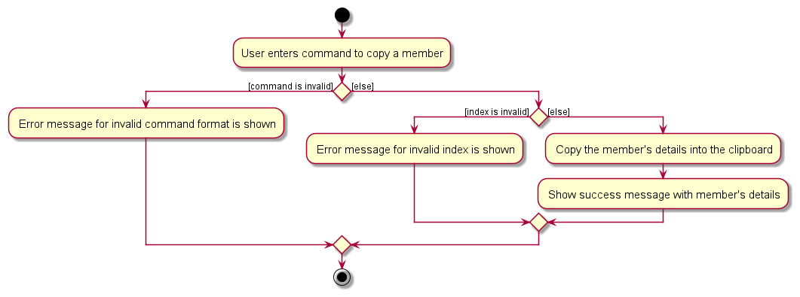
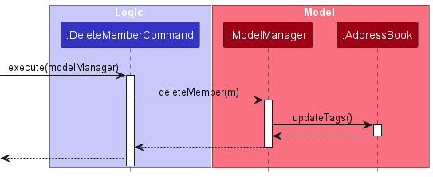

## Table of Contents

--------------------------------------------------------------------------------------------------------------------

* Table of Contents
{:toc}

--------------------------------------------------------------------------------------------------------------------

## **Acknowledgements**

This project is based on the AddressBook-Level3 project created by the [SE-EDU initiative](https://se-education.org).

--------------------------------------------------------------------------------------------------------------------

## **Setting up, getting started**

Refer to the guide [_Setting up and getting started_](SettingUp.md).

--------------------------------------------------------------------------------------------------------------------

## **Design**

:bulb: **Tip:** The `.puml` files used to create diagrams in this document `docs/diagrams` folder. Refer to the [
_PlantUML Tutorial_ at se-edu/guides](https://se-education.org/guides/tutorials/plantUml.html) to learn how to create
and edit diagrams.

### Architecture

The ***Architecture Diagram*** given above explains the high-level design of the App.

Given below is a quick overview of main components and how they interact with each other.

**Main components of the architecture**

**`Main`** (consisting of
classes [`Main`](https://github.com/AY2324S1-CS2103T-W15-3/tp/blob/master/src/main/java/seedu/address/Main.java)
and [`MainApp`](https://github.com/AY2324S1-CS2103T-W15-3/tp/blob/master/src/main/java/seedu/address/MainApp.java)) is
in charge of the app launch and shut down.

* At app launch, it initializes the other components in the correct sequence, and connects them up with each other.
* At shut down, it shuts down the other components and invokes cleanup methods where necessary.

The bulk of the app's work is done by the following four components:

* [**`UI`**](#ui-component): The UI of the App.
* [**`Logic`**](#logic-component): The command executor.
* [**`Model`**](#model-component): Holds the data of the App in memory.
* [**`Storage`**](#storage-component): Reads data from, and writes data to, the hard disk.

[**`Commons`**](#common-classes) represents a collection of classes used by multiple other components.

**How the architecture components interact with each other**

The *Sequence Diagram* below shows how the components interact with each other for the scenario where the user issues
the command `delm 1`.

Each of the four main components (also shown in the diagram above),

* defines its *API* in an `interface` with the same name as the Component.
* implements its functionality using a concrete `{Component Name}Manager` class (which follows the corresponding
  API `interface` mentioned in the previous point).

For example, the `Logic` component defines its API in the `Logic.java` interface and implements its functionality using
the `LogicManager.java` class which follows the `Logic` interface. Other components interact with a given component
through its interface rather than the concrete class (reason: to prevent outside component's being coupled to the
implementation of a component), as illustrated in the (partial) class diagram below.

The sections below give more details of each component.

### UI component

The **API** of this component is specified
in [`Ui.java`](https://github.com/AY2324S1-CS2103T-W15-3/tp/blob/master/src/main/java/seedu/address/ui/Ui.java)

The UI consists of a `MainWindow` that is made up of parts
e.g.`CommandBox`, `ResultDisplay`, `MemberListPanel`, `StatusBarFooter` etc. All these, including the `MainWindow`,
inherit from the abstract `UiPart` class which captures the commonalities between classes that represent parts of the
visible GUI.

The `UI` component uses the JavaFx UI framework. The layout of these UI parts are defined in matching `.fxml` files that
are in the `src/main/resources/view` folder. For example, the layout of
the [`MainWindow`](https://github.com/AY2324S1-CS2103T-W15-3/tp/blob/master/src/main/java/seedu/address/ui/MainWindow.java)
is specified
in [`MainWindow.fxml`](https://github.com/AY2324S1-CS2103T-W15-3/tp/blob/master/src/main/resources/view/MainWindow.fxml)

The `UI` component,

* executes user commands using the `Logic` component.
* listens for changes to `Model` data so that the UI can be updated with the modified data.
* keeps a reference to the `Logic` component, because the `UI` relies on the `Logic` to execute commands.
* depends on some classes in the `Model` component, as it displays `Member`, `Applicant` and `Tag` objects residing in the `Model`.

### Logic component

**API**: [`Logic.java`](https://github.com/AY2324S1-CS2103T-W15-3/tp/blob/master/src/main/java/seedu/address/logic/Logic.java)

Here's a (partial) class diagram of the `Logic` component:

The sequence diagram below illustrates the interactions within the `Logic` component, taking `execute("delm 1")` API
call as an example.

:information_source: **Note:** The lifeline for `DeleteMemberCommandParser` should end at the destroy marker (X) but due to a limitation of PlantUML, the lifeline reaches the end of diagram.

How the `Logic` component works:

1. When `Logic` is called upon to execute a command, it is passed to an `AddressBookParser` object which in turn creates
   a parser that matches the command (e.g., `DeleteMemberCommandParser`) and uses it to parse the command.
1. This results in a `Command` object (more precisely, an object of one of its subclasses e.g., `DeleteMemberCommand`) which
   is executed by the `LogicManager`.
1. The command can communicate with the `Model` when it is executed (e.g. to delete a member).
1. The result of the command execution is encapsulated as a `CommandResult` object which is returned back from `Logic`.

Here are the other classes in `Logic` (omitted from the class diagram above) that are used for parsing a user command:

How the parsing works:

* When called upon to parse a user command, the `AddressBookParser` class creates an `XYZCommandParser` (`XYZ` is a
  placeholder for the specific command name e.g., `AddMemberCommandParser`) which uses the other classes shown above to parse
  the user command and create a `XYZCommand` object (e.g., `AddMemberCommand`) which the `AddressBookParser` returns back as
  a `Command` object.
* All `XYZCommandParser` classes (e.g., `AddMemberCommandParser`, `DeleteMemberCommandParser`, ...) inherit from the `Parser`
  interface so that they can be treated similarly where possible e.g, during testing.

### Model component

**API**: [`Model.java`](https://github.com/AY2324S1-CS2103T-W15-3/tp/blob/master/src/main/java/seedu/address/model/Model.java)

The `Model` component,

* stores the address book data i.e., objects that extend from the abstract `Person` class (which are contained in a generic `UniquePersonList` object) and an `ObservableList<Tag>`.
* stores an updatable `ObservableList<Task>` of `Task` objects that update based on which `Member` is selected with the `viewtasks` command.
* stores the currently 'selected' `Member` and `Applicant` objects (e.g., results of a search query) as a separate _filtered_ list which
  is exposed to outsiders as an unmodifiable `ObservableList<? extends Person>` that can be 'observed' e.g. the UI can be bound to
  this list so that the UI automatically updates when the data in the list change.
* stores a `UserPref` object that represents the user’s preferences. This is exposed to the outside as
  a `ReadOnlyUserPref` objects.
* does not depend on any of the other three components (as the `Model` represents data entities of the domain; they
  should make sense on their own without depending on other components)

The `Member` and `Applicant` classes both extend from the abstract `Person` class, and each of these classes have the
associated fields specific to them.

### Storage component

**API**: [`Storage.java`](https://github.com/AY2324S1-CS2103T-W15-3/tp/blob/master/src/main/java/seedu/address/storage/Storage.java)

The `Storage` component,

* can save both address book data and user preference data in JSON format, and read them back into corresponding
  objects.
* inherits from both `AddressBookStorage` and `UserPrefStorage`, which means it can be treated as either one (if only
  the functionality of only one is needed).
* depends on some classes in the `Model` component (because the `Storage` component's job is to save/retrieve objects
  that belong to the `Model`)

### Common classes

Classes used by multiple components are in the `seedu.addressbook.commons` package.

--------------------------------------------------------------------------------------------------------------------

## **Implementation**

This section describes some noteworthy details on how certain features are implemented.

### Add `Member`/`Applicant` feature

The `addMember` and `addApplicant` command is used to add a member or an applicant to the address book.
The commands are implemented in the `AddMemberCommand` and `AddApplicantCommand` class, which extends the `Command`
class.

The add mechanism is facilitated by `LogicManager` which parses the command input from the user to determine the
appropriate
command to execute. The execute function checks whether the `Member`/`Applicant` is present in the `AddressBook`.
The `Member`/`Applicant` is added into the `AddressBook` if it is not present. Otherwise, an error message is returned.

The diagram above describes the behaviour of adding an applicant to the `AddressBook`. When the user enters the command,
the command is parsed to determine whether it is a valid command. If it is valid, the `Applicant` is added into the 
`AddressBook` and a success message is shown, else, an error message is shown.

### View all `Member`/`Applicant` feature

Lists all members/applicants in the address book to the user. For example, if the previous list was filtered (say by `FindMemberCommand` or `FindApplicantCommand`),
then set it to unfiltered again.

1. The `ViewMembersCommand` or `ViewApplicantsCommand` object's execute() method is called. 
2. This updates the model via its `updateFilteredMemberList()` or `updateFilteredApplicantList()` method which is called with its predicate as always returning true. 
3. All members/applicants in the address book are shown to the user in the members/applicants list.

### Delete an applicant

The applicant at the specific `applicantIndex` in the applicant list will be deleted. Compulsory fields for the
`DeleteApplicantCommand` include: `applicantIndex`. An example of how this feature can be used is as follows:

* Step 1. The `DeleteApplicantCommand` object's `execute()` method is called.
* Step 2. The `applicantIndex` is checked to be within the valid range of the applicant list. If the `applicantIndex`
  given
  is invalid, a `CommandException` is thrown.
* Step 3. The applicant at the given `applicantIndex` is referenced.
* Step 4. The model object's `deleteApplicant()` method is called. The input parameter is the referenced applicant.
* Step 5. The applicant is deleted from the applicant list.

### Delete a member

The member at the specific memberIndex in the member list will be deleted. Compulsory fields for
the `DeleteMemberCommand`
include: `memberIndex`. An example of how this feature can be used is as follows:

* Step 1. The `DeleteMemberCommand` object's `execute()` method is called.
* Step 2. The `memberIndex` is checked to be within the valid range of the member list. If the `memberIndex` given is
  invalid, a `CommandException` is thrown.
* Step 3. The member at the given `memberIndex` is referenced.
* Step 4. The model object's `deleteMember()` method is called. The input parameter is the referenced member.
* Step 5. The member is deleted from the member list.

### Delete an applicant

The applicant at the specific `applicantIndex` in the applicant list will be deleted. Compulsory fields for the
`DeleteApplicantCommand` include: `applicantIndex`. An example of how this feature can be used is as follows:

* Step 1. The `DeleteApplicantCommand` object's `execute()` method is called.
* Step 2. The `applicantIndex` is checked to be within the valid range of the applicant list. If the `applicantIndex`
  given
  is invalid, a `CommandException` is thrown.
* Step 3. The applicant at the given `applicantIndex` is referenced.
* Step 4. The model object's `deleteApplicant()` method is called. The input parameter is the referenced applicant.
* Step 5. The applicant is deleted from the applicant list.

### Find an applicant

All applicants that contains any field with the specified keyword will be listed. Compulsory fields for the
`FindApplicantCommand` include: `keyword`. An example of how this feature can be used is as follows:

* Step 1. The `FindApplicantCommand` object's `execute()` method is called.
* Step 2. The model object's `updateFilteredApplicantList()` is called, with the keyword as the predicate.
* Step 3. The applicant list is filtered to only reflect applicants with fields (name, phone number) that contain the
  keyword.
* Step 4. The filtered member list is shown.

### Find a member

All members that contains any field with the specified keyword will be listed. Compulsory fields for
`FindApplicantCommand` include: `keyword`. An example of how this feature can be used is as follows:

* Step 1. The `FindMemberCommand` object's `execute()` method is called.
* Step 2. The model object's `updateFilteredMemberList()` is called, with the keyword as the predicate.
* Step 3. The member list is filtered to only reflect members with fields (name, email, phone number, telegram handle,
  tag) that contain the keyword.
* Step 4. The filtered member list is shown.

### Edit a member

Edits the details of an existing member identified by their index number in the displayed member list. Existing values
will be overwritten by the input values.

* Step 1: The `EditMemberCommand` object's `execute()` method is called.
* Step 2: The member index is checked to be within the valid range of the member list. If the member index given is
  invalid (e.g., out of range), a `CommandException` is thrown.
* Step 3: The member at the given index is referenced based on the provided member index.
* Step 4: The `EditMemberCommand` calls the model object's `setMember()` method. It updates the member with the new
  details
  provided, effectively modifying the existing member's information.
* Step 5: After the execution of the `EditMemberCommand`, the member's details are successfully edited in the member
  list.

### Edit an applicant

Edits the details of an existing applicant identified by their index number in the displayed applicant list. Existing
values will be overwritten by the input values.

* Step 1: The `EditApplicantCommand` object's `execute()` method is called.
* Step 2: The applicant index is checked to be within the valid range of the applicant list. If the applicant index
  given is invalid (e.g., out of range), a `CommandException` is thrown.
* Step 3: The applicant at the given index is referenced based on the provided applicant index.
* Step 4: The `EditApplicantCommand` calls the model object's `setApplicant()` method. It updates the member with the
  new
  details provided, effectively modifying the existing applicant's information.
* Step 5: After the execution of the `EditApplicantCommand`, the applicant's details are successfully edited in the
  applicant list.

### Copy a `Member`/`Applicant`

Copies the details of an existing `Member`/`Applicant` identified by their index number in the displayed member/applicant list into the
clipboard. The commands are implemented in the `CopyMemberCommand` and `CopyApplicantCommand` classes, which extend the `Command` class.

1. The `CopyMemberCommand`/`CopyApplicantCommand` object's execute() method is called.
2. The `Member`/`Applicant` index is checked to be within the valid range of the member list. If the index given is invalid (e.g., out of range), a `CommandException` is thrown.
3. The `Member`/`Applicant` at the given index is referenced based on the provided member index.
4. The `CopyMemberCommand`/`CopyApplicantCommand` calls the copies the details given by the `Member#detailsToCopy`/`Applicant#detailsToCopy` method into the clipboard.

The diagram below describes this behaviour concisely. It shows how a user's command is processed and what message is ultimately shown if they decide, for example, to copy a member's details.

### View all available tags

The view tags mechanism lists all available tags in the address book that a user can use to tag a member.
All available tags in the address book are shown to the user in the tags list.
When a new member is added, deleted or edited, the `updateTags` method is called to update the list of available tags.

In the above diagram, when the `DeleteMemberCommand::execute` method is called,`Member` is deleted from 
the `ModelManager` using the `deleteMember()` method, which then updates the `tags` in `AddressBook` using 
the `updateTags()` method.

`tags` is an `ObservableList` which will update the `TagsListPanel` UI component when there is a change in the `tags`
list.

### \[Proposed\] Allocating tasks to Members

#### Proposed Implementation

The proposed allocating tasks to `Member` objects is implemented using either `ToDo` or `Deadline` or `Events` object.
They extend from the `Tasks` class. A `Tasklist` object will be instantiated for each `Member` object, used to store the
list of tasks assigned to each individual. Additionally, it implements the following operations:

* `ToDo#markAsDone()`— Will be used to mark the todo of each Member as done
* `ToDo#markAsUnDone()`— Will be used to mark the todo of each Member as undone
* `Deadline#markAsDone()`— Will be used to mark the deadline of each Member as done
* `Deadline#markAsUnDone()`— Will be used to mark the deadline of each Member as done
* `Event#markAsDone()`— Will be used to mark the deadline of each Member as done
* `Event#markAsUnDone()`— Will be used to mark the deadline of each Member as done

These operations are exposed in the `Task` parent class as `Task#markAsDone()` and `Task#markAsUnDone()` to execute the
above-mentioned operations.

Step 1: The user adds a new `Member` using the `addMember` command. At this point, a `TaskList` instance will be
assigned to that member.

Step 2: When the user uses the `addToDo` command, a `ToDo` object containing the details parsed in through the code will
be stored and under the user identified by their telegram handle, which is passed as a parameter. It namely stores the
`Tasks.taskName`.

Step 3: When the user uses the `addDeadline` command, a `Deadline` object containing the details parsed in through the
code will
be stored and under the user identified by their telegram handle, which is passed as a parameter. It namely stores the
`Tasks.taskName`, `Deadline.dueDate` and `Deadline.dueTime`.

Step 4: When the user uses the `addEvent` command, an `Event` object containing the details parsed in through the code
will
be stored and under the user identified by their telegram handle, which is passed as a parameter. It namely stores the
`Tasks.taskName`, `Event.startDate`, `Deadline.startTime`, `Event.endDate` and `Deadline.endTime`.

### \[Proposed\] Undo/redo feature

#### Proposed Implementation

The proposed undo/redo mechanism is facilitated by `VersionedAddressBook`. It extends `AddressBook` with an undo/redo
history, stored internally as an `addressBookStateList` and `currentStatePointer`. Additionally, it implements the
following operations:

* `VersionedAddressBook#commit()`— Saves the current address book state in its history.
* `VersionedAddressBook#undo()`— Restores the previous address book state from its history.
* `VersionedAddressBook#redo()`— Restores a previously undone address book state from its history.

These operations are exposed in the `Model` interface as `Model#commitAddressBook()`, `Model#undoAddressBook()`
and `Model#redoAddressBook()` respectively.

Given below is an example usage scenario and how the undo/redo mechanism behaves at each step.

Step 1. The user launches the application for the first time. The `VersionedAddressBook` will be initialized with the
initial address book state, and the `currentStatePointer` pointing to that single address book state.

Step 2. The user executes `delm 5` command to delete the 5th member in the address book. The `DeleteMemberCommand`
calls `Model#commitAddressBook()`, causing the modified state of the address book after the `delm 5` command executes
to be saved in the `addressBookStateList`, and the `currentStatePointer` is shifted to the newly inserted address book
state.

Step 3. The user executes `adda /name David …​` to add a new person. The `addm` command also
calls `Model#commitAddressBook()`, causing another modified address book state to be saved into
the `addressBookStateList`.

:information_source: **Note:** If a command fails its execution, it will not call `Model#commitAddressBook()`, so the address book state will not be saved into the `addressBookStateList`.

Step 4. The user now decides that adding the person was a mistake, and decides to undo that action by executing
the `undo` command. The `undo` command will call `Model#undoAddressBook()`, which will shift the `currentStatePointer`
once to the left, pointing it to the previous address book state, and restores the address book to that state.

:information_source: **Note:** If the `currentStatePointer` is at index 0, pointing to the initial AddressBook state, then there are no previous AddressBook states to restore. The `undo` command uses `Model#canUndoAddressBook()` to check if this is the case. If so, it will return an error to the user rather
than attempting to perform the undo.

The following sequence diagram shows how the undo operation works:

:information_source: **Note:** The lifeline for `UndoCommand` should end at the destroy marker (X) but due to a limitation of PlantUML, the lifeline reaches the end of diagram.

The `redo` command does the opposite — it calls `Model#redoAddressBook()`, which shifts the `currentStatePointer` once
to the right, pointing to the previously undone state, and restores the address book to that state.

:information_source: **Note:** If the `currentStatePointer` is at index `addressBookStateList.size() - 1`, pointing to the latest address book state, then there are no undone AddressBook states to restore. The `redo` command uses `Model#canRedoAddressBook()` to check if this is the case. If so, it will return an error to the user rather than attempting to perform the redo.

Step 5. The user then decides to execute the command `list`. Commands that do not modify the address book, such
as `list`, will usually not call `Model#commitAddressBook()`, `Model#undoAddressBook()` or `Model#redoAddressBook()`.
Thus, the `addressBookStateList` remains unchanged.

Step 6. The user executes `clear`, which calls `Model#commitAddressBook()`. Since the `currentStatePointer` is not
pointing at the end of the `addressBookStateList`, all address book states after the `currentStatePointer` will be
purged. Reason: It no longer makes sense to redo the `add n/David …​` command. This is the behavior that most modern
desktop applications follow.

The following activity diagram summarizes what happens when a user executes a new command:

#### Design considerations:

**Aspect: How undo & redo executes:**

* **Alternative 1 (current choice):** Saves the entire address book.
    * Pros: Easy to implement.
    * Cons: May have performance issues in terms of memory usage.

* **Alternative 2:** Individual command knows how to undo/redo by
  itself.
    * Pros: Will use less memory (e.g. for `delm`, just save the member being deleted).
    * Cons: We must ensure that the implementation of each individual command are correct.

_{more aspects and alternatives to be added}_

### \[Proposed\] Data archiving

_{Explain here how the data archiving feature will be implemented}_

--------------------------------------------------------------------------------------------------------------------

## **Documentation, logging, testing, configuration, dev-ops**

* [Documentation guide](Documentation.md)
* [Testing guide](Testing.md)
* [Logging guide](Logging.md)
* [Configuration guide](Configuration.md)
* [DevOps guide](DevOps.md)

--------------------------------------------------------------------------------------------------------------------

## **Appendix: Requirements**

### Product scope

**Target user profile**:

* is a member of an organisation
* has a responsibility in managing applicants who are applying into the organisation
* has a need to manage a significant number of contacts
* prefers data to be organized and separated into categories
* prefers desktop apps over other types
* prefers typing to mouse interactions
* prefers to use a separate app that is made to manage CCA-related contacts efficiently
* is reasonably comfortable using CLI apps

**Value proposition**: categorises contacts into 'members' and 'applicants' groups, allowing for easier management of
contacts

### User stories

Priorities: High (must have) - `* * *`, Medium (nice to have) - `* *`, Low (unlikely to have) - `*`

| Priority | As a …​ | I want to …​                                                | So that I can…​                                                     |
|----------|---------|-------------------------------------------------------------|---------------------------------------------------------------------|
| `* * *`  | user    | add a member                                                | keep track of all my members when I need to                         |
| `* * *`  | user    | view all members                                            | see a list of all current members in the CCA                        |
| `* * *`  | user    | delete a member                                             | remove members from the database if they have left                  |
| `* * *`  | user    | edit a member                                               | update the member's details should they change                      |
| `* * *`  | user    | add an applicant                                            | keep track of all my applicants to contact them for further updates |
| `* * *`  | user    | view all applicants                                         | see a list of all applicants to my CCA                              |
| `* * *`  | user    | delete an applicant                                         | remove applicants if they have withdrawn their application          |
| `* * *`  | user    | edit an applicant                                           | update the applicant's details should they change                   |
| `* *  `  | user    | schedule a time and date for an interview with an applicant | mark out a time period of a specific date for an interview          |

### Use cases

(For all use cases below, the **System** is the `ClubMembersContact` and the **Actor** is the `user`, unless specified
otherwise)

**Use case: UC01 - Schedule a date for an interview**

**MSS**

1. User requests to list applicants
2. ClubMembersContact shows a list of applicants
3. User requests to schedule a date and time for an interview for a specific applicant in the list
4. ClubMembersContact marks out the time of that date

   Use case ends.

**Extensions**

* 2a. The list is empty.

  Use case ends.

* 3a. The requested time and date is unavailable.

    * 3a1. ClubMembersContact shows an error message.

      Use case resumes at step 2.

---

**Use case: UC02 - Add a member**

---

**Use case: UC03 - Finding members**

---

**Use case: UC04 - Viewing members**

**MSS**

1. User requests to view all members

2. ClubMembersContact shows a list of all members and displays a success message

   Use case ends.

**Use case: UC05 - Editing a member**

---

**Use case: UC06 - Deleting a member**

---

**Use case: UC07 - Copying a member**

**MSS**

1. User requests to copy a member

2. ClubMembersContact copies the member's details to the clipboard

3. ClubMembersContact displays a success message along with the member's details

   Use case ends.

**Extensions**

* 1a. The copy member command format is invalid.

  * 1a1. ClubMembersContact shows an error message.
    
      Use case resumes at step 1.

* 1b. The member index is invalid or out of range.

  * 1b1. ClubMembersContact shows an error message.

    Use case resumes at step 1.

### Non-Functional Requirements

1. The system should respond to user requests within 2 seconds for all functions.
2. The user interface should be consistent across all modules and functions of the application.

### Glossary

* **Mainstream OS**: Windows, Linux, Unix, OS-X
* **Private contact detail**: A contact detail that is not meant to be shared with others

--------------------------------------------------------------------------------------------------------------------

## **Appendix: Instructions for manual testing**

Given below are instructions to test the app manually.

:information_source: **Note:** These instructions only provide a starting point for testers to work on;
testers are expected to do more *exploratory* testing.

### Launch and shutdown

1. Initial launch

    1. Download the jar file and copy into an empty folder

    1. Double-click the jar file. Expected: Shows the GUI with a set of sample contacts. The window size may not be
       optimum.

1. Saving window preferences

    1. Resize the window to an optimum size. Move the window to a different location. Close the window.

    1. Re-launch the app by double-clicking the jar file. 
       Expected: The most recent window size and location is retained.

1. _{ more test cases …​ }_

### Deleting a member

1. Deleting a member while all members are being shown

    1. Prerequisites: List all members using the `viewm` command. Multiple members in the list.

    1. Test case: `delm 1` 
       Expected: First member is deleted from the list. Details of the deleted member shown in the status message.
       Timestamp in the status bar is updated.

    1. Test case: `delm 0` 
       Expected: No member is deleted. Error details shown in the status message. Status bar remains the same.

    1. Other incorrect delete commands to try: `delm`, `dela`, `deletemember x`, `...` (where x is larger than the list size) 
       Expected: Similar to previous.

1. _{ more test cases …​ }_

### Saving data

1. Dealing with missing/corrupted data files

    1. _{explain how to simulate a missing/corrupted file, and the expected behavior}_

1. _{ more test cases …​ }_
