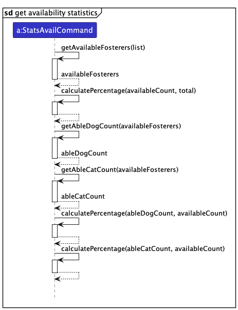

* Table of Contents
{:toc}

--------------------------------------------------------------------------------------------------------------------

## **Acknowledgements**
* [File icon](https://www.flaticon.com/free-icon/document_2258853?term=file&page=1&position=6&origin=search&related_id=2258853) and [Help icon](https://www.flaticon.com/free-icon/question_471664?term=help&page=1&position=2&origin=search&related_id=471664) used in the main window are from Flaticon.

* Useful notations in the User Guide was inspired from a past project [TaskBook](https://ay2223s1-cs2103t-t13-4.github.io/tp/UserGuide.html#useful-notations).
* {list here sources of all reused/adapted ideas, code, documentation, and third-party libraries -- include links to the original source as well}

--------------------------------------------------------------------------------------------------------------------

## **Setting up, getting started**

Refer to the guide [_Setting up and getting started_](SettingUp.md).

--------------------------------------------------------------------------------------------------------------------

## **Design**

:bulb: **Tip:** 
The `.puml` files used to create diagrams in this document `docs/diagrams` folder. Refer to the [_PlantUML Tutorial_ at se-edu/guides](https://se-education.org/guides/tutorials/plantUml.html) to learn how to create and edit diagrams.

### Architecture

The ***Architecture Diagram*** given above explains the high-level design of the App.

Given below is a quick overview of main components and how they interact with each other.

**Main components of the architecture**

**`Main`** (consisting of classes [`Main`](https://github.com/AY2324S1-CS2103T-T13-4/tp/blob/master/src/main/java/seedu/address/Main.java) and [`MainApp`](https://github.com/AY2324S1-CS2103T-T13-4/tp/blob/master/src/main/java/seedu/address/MainApp.java)) is in charge of the app launch and shut down.
* At app launch, it initializes the other components in the correct sequence, and connects them up with each other.
* At shut down, it shuts down the other components and invokes cleanup methods where necessary.

The bulk of the app's work is done by the following four components:

* [**`UI`**](#ui-component): The UI of the App.
* [**`Logic`**](#logic-component): The command executor.
* [**`Model`**](#model-component): Holds the data of the App in memory.
* [**`Storage`**](#storage-component): Reads data from, and writes data to, the hard disk.

[**`Commons`**](#common-classes) represents a collection of classes used by multiple other components.

**How the architecture components interact with each other**

The *Sequence Diagram* below shows how the components interact with each other for the scenario where the user issues the command `delete 1`.

Each of the four main components (also shown in the diagram above),

* defines its *API* in an `interface` with the same name as the Component.
* implements its functionality using a concrete `{Component Name}Manager` class (which follows the corresponding API `interface` mentioned in the previous point.

For example, the `Logic` component defines its API in the `Logic.java` interface and implements its functionality using the `LogicManager.java` class which follows the `Logic` interface. Other components interact with a given component through its interface rather than the concrete class (reason: to prevent outside component's being coupled to the implementation of a component), as illustrated in the (partial) class diagram below.

The sections below give more details of each component.

### UI component

The **API** of this component is specified in [`Ui.java`](https://github.com/AY2324S1-CS2103T-T13-4/tp/blob/master/src/main/java/seedu/address/ui/Ui.java)

The UI consists of a `MainWindow` that is made up of parts e.g.`CommandBox`, `ResultDisplay`, `PersonListPanel`, `StatusBarFooter` etc. All these, including the `MainWindow`, inherit from the abstract `UiPart` class which captures the commonalities between classes that represent parts of the visible GUI.

The `UI` component uses the JavaFx UI framework. The layout of these UI parts are defined in matching `.fxml` files that are in the `src/main/resources/view` folder. For example, the layout of the [`MainWindow`](https://github.com/AY2324S1-CS2103T-T13-4/tp/blob/master/src/main/java/seedu/address/ui/MainWindow.java) is specified in [`MainWindow.fxml`](https://github.com/AY2324S1-CS2103T-T13-4/tp/blob/master/src/main/resources/view/MainWindow.fxml)

The `UI` component,

* executes user commands using the `Logic` component.
* listens for changes to `Model` data so that the UI can be updated with the modified data.
* keeps a reference to the `Logic` component, because the `UI` relies on the `Logic` to execute commands.
* depends on some classes in the `Model` component, as it displays `Person` object residing in the `Model`.

### Logic component

**API** : [`Logic.java`](https://github.com/AY2324S1-CS2103T-T13-4/tp/blob/master/src/main/java/seedu/address/logic/Logic.java)

Here's a (partial) class diagram of the `Logic` component:

The sequence diagram below illustrates the interactions within the `Logic` component, taking `execute("delete 1")` API call as an example.

:information_source: **Note:** The lifeline for `DeleteCommandParser` should end at the destroy marker (X) but due to a limitation of PlantUML, the lifeline reaches the end of diagram.

How the `Logic` component works:
1. When `Logic` is called upon to execute a command, it is passed to an `AddressBookParser` object which in turn creates a parser that matches the command (e.g., `DeleteCommandParser`) and uses it to parse the command.
1. This results in a `Command` object (more precisely, an object of one of its subclasses e.g., `DeleteCommand`) which is executed by the `LogicManager`.
1. The command can communicate with the `Model` when it is executed (e.g. to delete a person).
1. The result of the command execution is encapsulated as a `CommandResult` object which is returned back from `Logic`.

Here are the other classes in `Logic` (omitted from the class diagram above) that are used for parsing a user command:

How the parsing works:
* When called upon to parse a user command, the `AddressBookParser` class creates an `XYZCommandParser` (`XYZ` is a placeholder for the specific command name e.g., `AddCommandParser`) which uses the other classes shown above to parse the user command and create a `XYZCommand` object (e.g., `AddCommand`) which the `AddressBookParser` returns back as a `Command` object.
* All `XYZCommandParser` classes (e.g., `AddCommandParser`, `DeleteCommandParser`, ...) inherit from the `Parser` interface so that they can be treated similarly where possible e.g, during testing.

### Model component
**API** : [`Model.java`](https://github.com/AY2324S1-CS2103T-T13-4/tp/blob/master/src/main/java/seedu/address/model/Model.java)

The `Model` component,

* stores the address book data i.e., all `Person` objects (which are contained in a `UniquePersonList` object).
* stores the currently 'selected' `Person` objects (e.g., results of a search query) as a separate _filtered_ list which is exposed to outsiders as an unmodifiable `ObservableList<Person>` that can be 'observed' e.g. the UI can be bound to this list so that the UI automatically updates when the data in the list change.
* stores a `UserPref` object that represents the user’s preferences. This is exposed to the outside as a `ReadOnlyUserPref` objects.
* does not depend on any of the other three components (as the `Model` represents data entities of the domain, they should make sense on their own without depending on other components)

:information_source: **Note:** An alternative (arguably, a more OOP) model is given below. It has a `Tag` list in the `AddressBook`, which `Person` references. This allows `AddressBook` to only require one `Tag` object per unique tag, instead of each `Person` needing their own `Tag` objects. 

### Storage component

**API** : [`Storage.java`](https://github.com/AY2324S1-CS2103T-T13-4/tp/blob/master/src/main/java/seedu/address/storage/Storage.java)

The `Storage` component,
* can save both address book data and user preference data in JSON format, and read them back into corresponding objects.
* inherits from both `AddressBookStorage` and `UserPrefStorage`, which means it can be treated as either one (if only the functionality of only one is needed).
* depends on some classes in the `Model` component (because the `Storage` component's job is to save/retrieve objects that belong to the `Model`)

### Common classes

Classes used by multiple components are in the `seedu.addressbook.commons` package.

--------------------------------------------------------------------------------------------------------------------

## **Implementation**

This section describes some noteworthy details on how certain features are implemented.

### Add feature

#### Implementation

The add mechanism allows users to add new fosterers to the address book. This feature is facilitated by the `AddCommand` and `AddCommandParser` classes, to handle user input and create the appropriate `Person` object. Specifically, the feature is implemented through the following components and operations:

* `AddCommand` — The core component responsible for executing the addition of a new fosterer to the address book. It handles the validation of input fields and ensures there are no duplicate persons in the address book.
* `Person` — Represents the structure of a person, including attributes such as name, phone, email, address, housing, availability, animal name, animal type, and associated tags.
* `ParserUtil` and `AddCommandParser` — Contains parsing methods for various input fields (e.g., name, phone, email, etc.) to ensure they are valid by meeting specific requirements and conditions.
* `ArgumentMultimap` — Tokenizes and manages command arguments.

Given below is an example usage scenario and how the add mechanism behaves at each step.

Step 1. The user enters the `add` command with relevant details for the new fosterer. The `AddCommandParser` is invoked to parse the user's input.

Step 2. The `AddCommandParser` processes the user's input and verifies the presence of mandatory fields inputted in the correct format. 
If this check fails, the system will generate a specific error message indicating which field format is invalid. 
For example, if the email format is incorrect, the system will report that the email input is invalid. The error message will be displayed to the user, providing clear feedback about the issue and the specific constraints that are not met.

Step 3. If all mandatory fields are present with the valid format, the new person is created using the `Person` class. The person's details, including their name, phone, email, address, housing, availability, animal name, animal type, and tags, are recorded, and the Person class also ensures that there is no conflicting data. 
If this check fails, the system will generate a specific error message indicating which field is invalid, and how can it be resolved.

Step 4. The `Person` is then passed to the new `AddCommand` created, which adds the person to the address book, ensuring that it is not a duplicate of an existing entry. This check is performed in the `execute` method of the `AddCommand`.

Step 5. A success message is displayed to the user to confirm that the new fosterer has been added to the address book.

The add feature ensures that user input is correctly parsed and validated, and it prevents duplicate entries in the address book.

#### Design considerations:

* **Data Validation** — The add feature performs thorough validation on input data, ensuring that it adheres to constraints for each field.
* **Duplicates** — The system checks for duplicate persons to prevent the addition of redundant data.

**Aspect: Handling duplicate persons:**

* **Alternative 1 (current choice):** Checks for duplicates based on the person's name, which is case-sensitive.
    * Pros: Easy to implement, and is simple and effective.
    * Cons: May not catch duplicates with different names but similar attributes or similar names in different letter case.

* **Alternative 2:** Implement a more comprehensive duplicate check considering multiple attributes.
    * Pros: Provides better duplicate detection by comparing multiple attributes.
    * Cons: May be more complex to implement.

* **Alternative 3:** Implement a more effective duplicate check considering the presence of multiple spaces between different words of the same name, and case-sensitivity of names.
    * Pros: Provides better duplicate detection by identifying fosterers with the same name, but inputted in different formats.
    * Cons: May be more complex to implement and such cases might be less likely to happen.

**Aspect: How add executes:**

* **Alternative 1 (current choice):** The Add feature saves the entire address book, including the newly added fosterer.
    * Pros: Easy to implement.
    * Cons: May have performance issues in terms of memory usage.

* **Alternative 2:** Individual command knows how to undo/redo by
  itself.
    * Pros: Will use less memory (e.g. for `add`, just save the person being added).
    * Cons: We must ensure that the implementation of each individual command are correct.

### Delete feature

#### Implementation

The delete mechanism allows users to delete fosterers in the address book. This feature is facilitated by the `DeleteCommand`, `DeleteCommandParser` and `Indices` classes, to handle user input and delete the correct fosterers.  This feature is implemented using the following components and operations:

* `DeleteCommand` — The core component responsible for executing the deletion of fosterers in the address book.
* `Indices` — Represents the indices that the user inputs, each index corresponding to a fosterer in the last seen list of fosterers. This class encapsulates one or more `Index` objects. 
* `ParserUtil` and `DeleteCommandParser` — Contains the parsing methods for string input of the user. They ensure that the indices are valid by meeting specific requirements. 

Given below is an example usage scenario and how the delete mechanism behaves at each step. The sequence diagram for deleting multiple fosterers is similar to the example in [Logic](#logic-component).

:information_source: **Note:** The lifeline for `DeleteCommandParser` should end at the destroy marker (X) but due to a limitation of PlantUML, the lifeline reaches the end of diagram.

Step 1. The user enters the delete command with at least one index. The `DeleteCommandParser` is invoked to parse the user's input. 

Step 2. `DeleteCommandParser` will then invoke the `ParserUtil` to check for the validity of indices (omitted from diagram for simplicity). If indices are invalid, the system will generate an error message. The error message will be displayed to the user, providing feedback about the issue and the specific constraints that are not met.

Step 3. For each valid index, the `DeleteCommand` will execute the deletion by obtaining that fosterer from the list of unique persons in the address book, and then updating the model to remove the fosterer. This is done in the `execute` method of `DeleteCommand`.

Step 4. A success message is displayed to the user to confirm that the selected fosterers have been deleted from the address book.

Therefore, by ensuring that the user input indices are correctly parsed and validated, this delete feature allows the user to delete multiple fosterers at once.

#### Design considerations:

**Aspect: How delete executes:**

* **Alternative 1 (current choice):** Delete multiple fosterers at once.
    * Pros: Do not have to parse user input multiple times in order for the user to perform mass deletion.
    * Cons: Slightly harder to implement.

* **Alternative 2:** Delete only one fosterer at a time.
    * Pros: Easy to implement. 
    * Cons: Overhead associated with a chain of delete commands should the user choose to perform multiple deletions.

### Statistics feature
#### Implementation

The Statistics feature provides a summary of selected address book data to the user. The data we can provide insights to are those of available fosterers, current fosterers and housing type of fosterers. Statistics include _number_ and _percentage_ information.  
This is facilitated by the `StatsCommand`, `StatsAvailCommand`, `StatsCurrentCommand` and `StatsHousingCommand` classes, as well as the `StatsCommandParser` class. The relationship between the Stats command classes are shown below.

* `StatsCommand` — This is an abstract class that contains utility methods used by its subclasses for percentage calculation.
* `StatsAvailCommand` — Contains methods to calculate statistics of available fosterers and the animals they can foster. 
* `StatsCurrentCommand` — Contains methods to calculate statistics of current fosterers and the animals they are currently fostering. 
* `StatsHousingCommand` — Contains methods to calculate statistics of the different housing types of fosterers. 
* `StatsCommandParser` — Contains the parsing methods for string input of the user. It is in charge of parsing the type of statistics requested by the user, and creating the corresponding `StatsCommand`. 

Given below is an example usage scenario and how the statistics feature behaves at each step. It shows the execution of a `stats avail` command, which requests for statistics about the available fosterers. 

:information_source: **Note:** The lifeline for `StatsCommandParser` should end at the destroy marker (X) but due to a limitation of PlantUML, the lifeline reaches the end of diagram.

Step 1. The user enters the `stats avail` command. The `StatsCommandParser` is invoked to parse the user's input.

Step 2. `StatsCommandParser` will then parse the argument inputted with the `stats` command, in this case it is `avail`. If the argument is not `avail`, `curr` or `housing`, the `StatsCommandParser` will then generate an error message to the user, indicating that the requested statistic is not available. 

Step 3. The `StatsAvailCommand` will then call relevant methods to obtain the needed numbers and percentages, done in the `execute` command. 

Step 4. A success message with the statistics will then be displayed to the user.

The other commands `stats curr` and `stats housing` have a similar execution path, replacing `StatsAvailCommand` with `StatsCurrCommand` and `StatsHousingCommand` respectively.

#### Design considerations:

**Aspect: How to display the statistics:**

* **Alternative 1 (current choice):** Show the availability and current statistics separately.
    * Pros: Displayed statistics are specific to the user's query, showing only the relevant data.
    * Cons: Need to create more classes.

* **Alternative 2:** Show availability and current statistics together.
    * Pros: Easier to implement.
    * Cons: Result message displayed will be very long, making the UI less desirable.

**Aspect: Which list should the statistics be calculated from:**

* **Alternative 1 (current choice):** Calculated from the currently displayed list.
    * Pros: The resulting statistic corresponds to what the user sees, allowing for easy verification.
    * Cons: The user may need to perform a find or list to query the list of interest before entering the stats command. 

* **Alternative 2:** Calculated from the main list of fosterers.
    * Pros: The resulting statistic corresponds to the whole address book, which may cause less confusion for the user.
    * Cons: Less flexibility for the user.

### \[Proposed\] Undo/redo feature

#### Proposed Implementation

The proposed undo/redo mechanism is facilitated by `VersionedAddressBook`. It extends `AddressBook` with an undo/redo history, stored internally as an `addressBookStateList` and `currentStatePointer`. Additionally, it implements the following operations:

* `VersionedAddressBook#commit()` — Saves the current address book state in its history.
* `VersionedAddressBook#undo()` — Restores the previous address book state from its history.
* `VersionedAddressBook#redo()` — Restores a previously undone address book state from its history.

These operations are exposed in the `Model` interface as `Model#commitAddressBook()`, `Model#undoAddressBook()` and `Model#redoAddressBook()` respectively.

Given below is an example usage scenario and how the undo/redo mechanism behaves at each step.

Step 1. The user launches the application for the first time. The `VersionedAddressBook` will be initialized with the initial address book state, and the `currentStatePointer` pointing to that single address book state.

Step 2. The user executes `delete 5` command to delete the 5th person in the address book. The `delete` command calls `Model#commitAddressBook()`, causing the modified state of the address book after the `delete 5` command executes to be saved in the `addressBookStateList`, and the `currentStatePointer` is shifted to the newly inserted address book state.

Step 3. The user executes `add n/David …​` to add a new person. The `add` command also calls `Model#commitAddressBook()`, causing another modified address book state to be saved into the `addressBookStateList`.

:information_source: **Note:** If a command fails its execution, it will not call `Model#commitAddressBook()`, so the address book state will not be saved into the `addressBookStateList`.

Step 4. The user now decides that adding the person was a mistake, and decides to undo that action by executing the `undo` command. The `undo` command will call `Model#undoAddressBook()`, which will shift the `currentStatePointer` once to the left, pointing it to the previous address book state, and restores the address book to that state.

:information_source: **Note:** If the `currentStatePointer` is at index 0, pointing to the initial AddressBook state, then there are no previous AddressBook states to restore. The `undo` command uses `Model#canUndoAddressBook()` to check if this is the case. If so, it will return an error to the user rather
than attempting to perform the undo.

The following sequence diagram shows how the undo operation works:

:information_source: **Note:** The lifeline for `UndoCommand` should end at the destroy marker (X) but due to a limitation of PlantUML, the lifeline reaches the end of diagram.

The `redo` command does the opposite — it calls `Model#redoAddressBook()`, which shifts the `currentStatePointer` once to the right, pointing to the previously undone state, and restores the address book to that state.

:information_source: **Note:** If the `currentStatePointer` is at index `addressBookStateList.size() - 1`, pointing to the latest address book state, then there are no undone AddressBook states to restore. The `redo` command uses `Model#canRedoAddressBook()` to check if this is the case. If so, it will return an error to the user rather than attempting to perform the redo.

Step 5. The user then decides to execute the command `list`. Commands that do not modify the address book, such as `list`, will usually not call `Model#commitAddressBook()`, `Model#undoAddressBook()` or `Model#redoAddressBook()`. Thus, the `addressBookStateList` remains unchanged.

Step 6. The user executes `clear`, which calls `Model#commitAddressBook()`. Since the `currentStatePointer` is not pointing at the end of the `addressBookStateList`, all address book states after the `currentStatePointer` will be purged. Reason: It no longer makes sense to redo the `add n/David …​` command. This is the behavior that most modern desktop applications follow.

The following activity diagram summarizes what happens when a user executes a new command:

#### Design considerations:

**Aspect: How undo & redo executes:**

* **Alternative 1 (current choice):** Saves the entire address book.
  * Pros: Easy to implement.
  * Cons: May have performance issues in terms of memory usage.

* **Alternative 2:** Individual command knows how to undo/redo by
  itself.
  * Pros: Will use less memory (e.g. for `delete`, just save the person being deleted).
  * Cons: We must ensure that the implementation of each individual command are correct.

_{more aspects and alternatives to be added}_

--------------------------------------------------------------------------------------------------------------------
## Planned Enhancements

### Shorter Command Formats
Currently, the default add command may be too long for an average typer to key in quickly. A future enhancement we are planning would be to allow the addition of a fosterer with just the basic details, such as their name, phone number, email, housing type and availability. The rest of the fields will be set to `nil` by default.
Only when the fosterer is ready to foster, then other details such as animal name, animal type and address need to be filled in via the `edit` command.

We are also planning to shorten some input parameters when adding or editing a fosterer:

| Current                   | Enhancement  |
|---------------------------|--------------|
| availability/Available    | avail/true   |
| availability/NotAvailable | avail/false  |
| availability/nil          | avail/nil    |
| animalType/               | type/        |

With this, the command `add n/Jerry Tan p/98765412 e/jerry123@example.com housing/HDB avail/true` will be a valid add
command. 

### Reduce Coupling Between Availability and Animal Type
Currently, the `animalType` field also contains information about the availability of a fosterer. 
e.g. if the `animalType` field of a fosterer is `able.Dog`, it suggests that the fosterer is available, and is 
able to foster a dog. However, the user will still need to enter the `availability` field as `available`.  

Building on the enhancement in [Shorter Command Formats](#shorter-command-formats), we will be revising the 
`AVAILABILITY` and `ANIMAL_TYPE` parameters:

| Param                  | About                                                             | Values                 | 
|------------------------|-------------------------------------------------------------------|------------------------|
| `AVAILABILITY`         | Indicates availability of fosterer                                | `false`, `true`, `nil` |     
| `ABLE_ANIMAL_TYPE`     | Indicates the type of animals the fosterer can foster             | `dog`, `cat`, `nil`    |     
| `CURRENT_ANIMAL_TYPE`  | Indicates the type of animals the fosterer is currently fostering | `dog`, `cat`, `nil`    |

### Support More Animal Types

Building on the enhancement in [Reduce Coupling Between Availability and Animal Type](#reduce-coupling-between-availability-and-animal-type), we can support more animal types by allowing the addition of animals other than cats and dogs under `ABLE_ANIMAL_TYPE` and `CURRENT_ANIMAL_TYPE`. Some examples include 
`hamster` and `rabbit`. This will make our product available to more animal shelters.

### Allow Fosterers To Foster More Than One Animal At A Time

Currently, we only allow the assignment of one fosterer to one animal. To improve this, we can make the `ANIMAL_NAME`,
`ABLE_ANIMAL_TYPE` and `CURRENT_ANIMAL_TYPE` fields to be maintained as lists instead. This will allow one fosterer to be associated with more than one animal.

### Case-sensitivity of Inputs
Currently, the fields and parameters for housing, availability and animal type are case-sensitive. An enhancement to this would be to make these fields and their parameters case-insensitive to improve the user experience. Moreover, the aforementioned enhancements will also be case-insensitive.

### Allow Symbols in Name
Currently, names in Foster Family must be alphanumeric. However, this excludes certain legal names that have other 
characters such as `/`. For example, we currently do not allow  `s/o` in a person's name as the `/` is used as a command
delimiter. Hence, one possible improvement is to enforce that the name inputted by the user must be enclosed in quotation marks for parsing, and to allow symbols such as `/`, `'`, `-` etc. using regex. Additionally, we will disallow the use of numeric values in names, to prevent the case where a number is inputted as a name.

e.g. `name/"Henry Tan"` and `name/"Nagaratnam s/o Suppiah"` are now valid name parameters.

### Phone Number Input

### Handle Invalid Fosterer - Corrupt Data File

### Notes Feature as a Separate Command

### Specificity of Error Messages

--------------------------------------------------------------------------------------------------------------------

## **Documentation, logging, testing, configuration, dev-ops**

* [Documentation guide](Documentation.md)
* [Testing guide](Testing.md)
* [Logging guide](Logging.md)
* [Configuration guide](Configuration.md)
* [DevOps guide](DevOps.md)

--------------------------------------------------------------------------------------------------------------------

## **Appendix: Requirements**

### Product scope

**Target user profile**:
* Foster manager of non-profit animal shelters for cats and dogs, who currently do not have a good logistical workflow to keep track of their fosterers
* Prefer desktop apps over other types
* Can type fast
* Prefers typing to mouse interactions
* Is reasonably comfortable using CLI apps

**Value proposition**: Low budget and efficient system that manages fosterers 

### User stories

Priorities: High (must have) - `* * *`, Medium (nice to have) - `* *`, Low (unlikely to have) - `*`

| Priority | As a …                  | I want to …                                                                                   | So that I can…                                                                                                   |
|----------|-------------------------|-----------------------------------------------------------------------------------------------|------------------------------------------------------------------------------------------------------------------|
| `* * *`  | foster manager          | delete a fosterer from the list when they want to stop fostering with us                      | update the list to see the fosterers who are currently in our program                                            |
| `* * *`  | foster manager          | delete multiple fosterers at once                                                             | perform mass deletions quickly                                                                                   |
| `* * *`  | foster manager          | add each fosterer's details efficiently                                                       | know how to contact the fosterer should I have animals that require fostering                                    |
| `* * *`  | foster manager          | provide details of the fostered animal of concern to the fosterer                             | ensure that the animal is well taken care by informing the fosterer of existing health conditions to prepare for |
| `* * *`  | foster manager          | update a fosterer's details                                                                   | keep track of fosterer's most up-to-date information, including information about the animal fostered            |
| `* * *`  | foster manager          | search for a specific animal / fosterer’s detail  instead of browsing through the entire list | be more productive when searching for suitable fosterers for the animal that needs fostering                     |
| `* * *`  | foster manager          | to be aware of the address of the fosterer                                                    | conduct checks on the fosterer to ensure the animal is well taken care of                                        |
| `* * *`  | foster manager          | retrieve the information about the foster family                                              | provide the necessary information to the Nparks authorities for audit                                            |
| `* * *`  | foster manager          | sort the list of fosterers alphabetically                                                     | have a neater, and more organised view of all the fosterers                                                      |
| `* * * ` | foster manager          | know the distribution of the different housing types among fosterers                          | correctly allocate the animals to foster homes that are able to accommodate them                                 |
| `* * *`  | foster manager          | obtain statistics about the currently available fosterers                                     | better estimate shelter capacity                                                                                 |
| `* * `   | foster manager          | have the fosterer’s important information collated neatly                                     | get all the information I need with one glance                                                                   |
| `* * `   | foster manager          | have an easily accessible and visible help button                                             | get help when I am unsure of what command to use                                                                 |
| `* * `   | foster manager          | undo my previous command                                                                      | quickly resolve errors caused by the erroneous command                                                           |
| `* *`    | new foster manager      | have my initial data file pre-populated with sample data                                      | work with this sample data as an introduction to the app                                                         |
| `* *`    | new foster manager      | purge all current data from address book                                                      | remove all sample/ experimental data I used to explore the app                                                   |
| `* *`    | careless foster manager | be asked to confirm my decision before purging all fosterer data                              | prevent myself from accidentally deleting all fosterer records                                                   |

### Use cases

(For all use cases below, the **System** is the `Foster Family`, and the **Actor**  is the `Foster Manager`, unless specified otherwise)

**Use case: UC1 - Add Fosterer**

**Preconditions**: Foster Manager has collected fosterer details.

**MSS**

1. Foster Manager requests to add fosterer to the System. 
2. System adds the specified fosterer.

   Use case ends.

**Extensions**

* 1a. System detects a format error in the entered command.
    * 1a1. System indicates the error and requests for data to be inputted in the correct format.
    * 1a2. Foster Manager enters new command.

      Steps 1a1 - 1a2 are repeated until the command entered is in the correct format.
  
      Use case resumes from step 2.
  
    
**Use case: UC2 - List Fosterers**

**MSS**

1. Foster Manager requests to list fosterers.
2. System displays list of fosterers that matches the Foster Manager's query.

   Use case ends.

**Extensions**

* 1a. System detects a format error in the entered command.
    * 1a1. System indicates the error and requests for data to be inputted in the correct format.
    * 1a2. Foster Manager enters new command.

      Steps 1a1 - 1a2 are repeated until the command entered is in the correct format. 

      Use case resumes from step 2.

**Use case: UC3 - Edit Fosterer**

**MSS**

1. Foster Manager lists fosterers (UC2).
2. Foster Manager requests to edit a fosterer referenced by their index shown in the list.
3. System displays details of the selected fosterer. 
4. Foster Manager enters the desired changes. 
5. Foster Manager requests to save the changes. 
6. System displays the updated list of fosterers.

   Use case ends.

**Extensions**
* 1a. System detects an invalid index.
    * 1a1. System indicates the error and requests for a valid index.
    * 1a2. Foster Manager enters new command.

      Steps 1a1 - 1a2 are repeated until the entered index is valid.

      Use case resumes from step 2.
  
* 4a. System detects that the Foster Manager did not fill up compulsory fields.
    * 4a1. System indicates missing field error.
    * 4a2. Foster Manager fills up the missing compulsory fields.
    * 4a3. Foster Manager requests to save the changes.

      Steps 4a1-4a3 are repeated until every compulsory field is filled.
  
      Use case resumes from step 5.

**Use case: UC4 - Delete Fosterers**

**MSS**

1. Foster Manager lists fosterers (UC2).
2. Foster Manager requests to delete fosterers referenced by their index shown in the list.
3. System deletes selected fosterers.
4. System displays updated list of fosterers.

   Use case ends.

**Extensions**

* 2a. The displayed list is empty.
  * 2a1. System indicates error as there are no fosterers to delete.
  
    Use case ends.
  

* 2b. System detects invalid indices.
    * 2b1. System indicates the error and requests for valid indices.
    * 2b2. Foster Manager enters new command.

      Steps 2b1 - 2b2 are repeated until all entered indices are valid.

      Use case resumes from step 3.

**Use case: UC5 - Sort List Of Fosterers**

**MSS**

1. Foster Manager lists fosterers (UC2).
2. Foster Manager requests to sort the list of fosterers.
3. System displays the updated list of fosterers, sorted alphabetically by name.

   Use case ends.

**Extensions**

* 1a. System detects an error in the entered command.
    * 1a1. System indicates the error.
    * 1a2. Foster Manager <u>requests for command 'help' (UC7)</u>.
    * 1a3. Foster Manager enters new command.

      Steps 1a1 - 1a3 are repeated until the command entered is correct.

      Use case resumes from step 2.

**Use case: UC6 - View Statistics**

**MSS**

1. Foster Manager lists fosterers (UC2). 
2. Foster Manager requests to view a certain statistic of the displayed fosterers.
3. System displays the relevant statistic.

   Use case ends.

**Extensions**

* 2a. The displayed list is empty.
  * 2a1. System indicates error.
  
    Use case ends.  
  
  
* 2b. Requested statistic is invalid.
  * 2b1. System indicates error, and prompts Foster Manager to request for a valid statistic. 
  * 2b2. Foster Manager enters new command.

    Steps 2b1 - 2b2 are repeated until a valid statistic is requested.
  
    Use case resumes from step 3.

**Use case: UC7 - Undo Previous Command**

**MSS**

1. Foster Manager requests to undo the previous command.
2. System undoes the previous command.

   Use case ends.

**Extensions**

* 1a. No more undo history is found.
    * 1a1. System indicates error.

      Use case ends.

**Use case: UC8 - Request For Command Help**

**MSS**

1. Foster Manager requests for help.
2. System displays the help page link.

   Use case ends.

**Use case: UC9 - Reset System**

**MSS**

1. Foster Manager requests to reset the System.
2. System requests for confirmation.
3. Foster Manager confirms.
4. System purges all fosterer data from the system.

   Use case ends.

**Extensions**

* 2a. Foster Manager chooses to cancel reset.

    Use case ends.

**Use case: UC10 - Exit**

**MSS**

1. Foster Manager requests to exit the program.
2. System closes program.

   Use case ends.

### Non-Functional Requirements

1.  Should work on any _mainstream OS_ as long as it has Java `11` or above installed.
2.  Should be able to hold up to 1000 fosterers without a noticeable sluggishness in performance for typical usage.
3.  A user with above average typing speed for regular English text (i.e. not code, not system admin commands) should be able to accomplish most of the tasks faster using commands than using the mouse.
4.  The system should be usable by a novice foster manager who has never tried out keeping track of fosterers through this new system. 
5.  The system should respond within two seconds. (i.e. each time a valid command is entered or there is any use action)
6. The user interface should be intuitive enough for users who are not IT-savvy. 
7. The user guide should be easily understood by target users. (foster managers of animal shelters, assuming they have no relevant technical knowledge)
8. The system should be able to detect invalidity of command within 2 seconds. 
9. The system must be able to scale up or down as needed (in the case where there is a sudden fosterers).
10. The system must comply with all applicable laws and regulations like the Personal Data Protection Act (PDPA). 
11. The system should be reliable, easy to maintain, and accessible 24/7. 
12. The product should be able to run on mainstream OS.

### Glossary

* **Mainstream OS**: Windows, Linux, Unix, OS-X
* **Fosterer**: A person who temporarily cares for an animal in their own home
* **Housing type**: Categorised into HDB, Condo, Landed
* **Types of animal fostered**: Categorised into solely cats and/or dogs (current.dog/cat or able.dog/cat depends on availability of fosterer)
* **Current list**: The currently displayed list obtained from a list command or its variants

--------------------------------------------------------------------------------------------------------------------

## **Appendix: Instructions for manual testing**

Given below are instructions to test the app manually.

:information_source: **Note:** These instructions only provide a starting point for testers to work on;
testers are expected to do more *exploratory* testing.

### Launch and shutdown

1. Initial launch

   1. Download the jar file and copy into an empty folder

   1. Double-click the jar file Expected: Shows the GUI with a set of sample contacts. The window size may not be optimum.

1. Saving window preferences

   1. Resize the window to an optimum size. Move the window to a different location. Close the window.

   1. Re-launch the app by double-clicking the jar file. 
       Expected: The most recent window size and location is retained.

### Deleting a person

1. Deleting a person while all fosterers are being shown

   1. Prerequisites: List all persons using the `list` or `find` command. At least 3 fosterers in the list.

   1. Test case: `delete 1` 
      Expected: First fosterer is deleted from the list. Details of the deleted fosterer shown in the status message.
   
   1. Test case: `delete 1 2 3` 
      Expected: First, second and third fosterers are deleted from the list. Number of deleted fosterers, and their details are shown in the status message.

   1. Test case: `delete 0` 
      Expected: No person is deleted. Error details shown in the status message.

   1. Other incorrect delete commands to try: `delete`, `delete x`,  (where x is larger than the list size) 
      Expected: Similar to previous.
