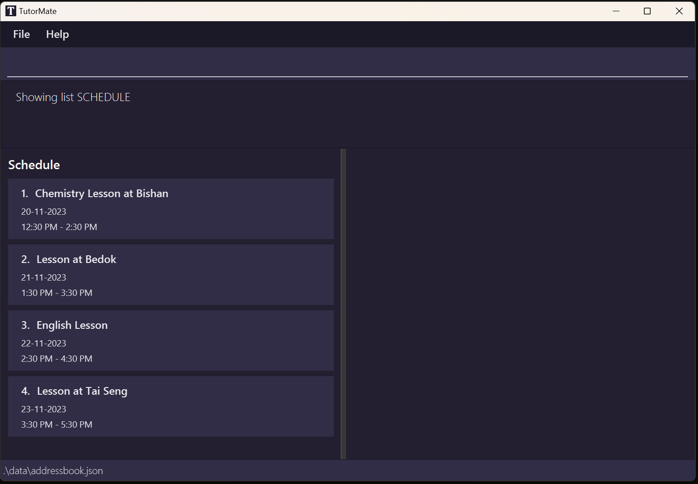
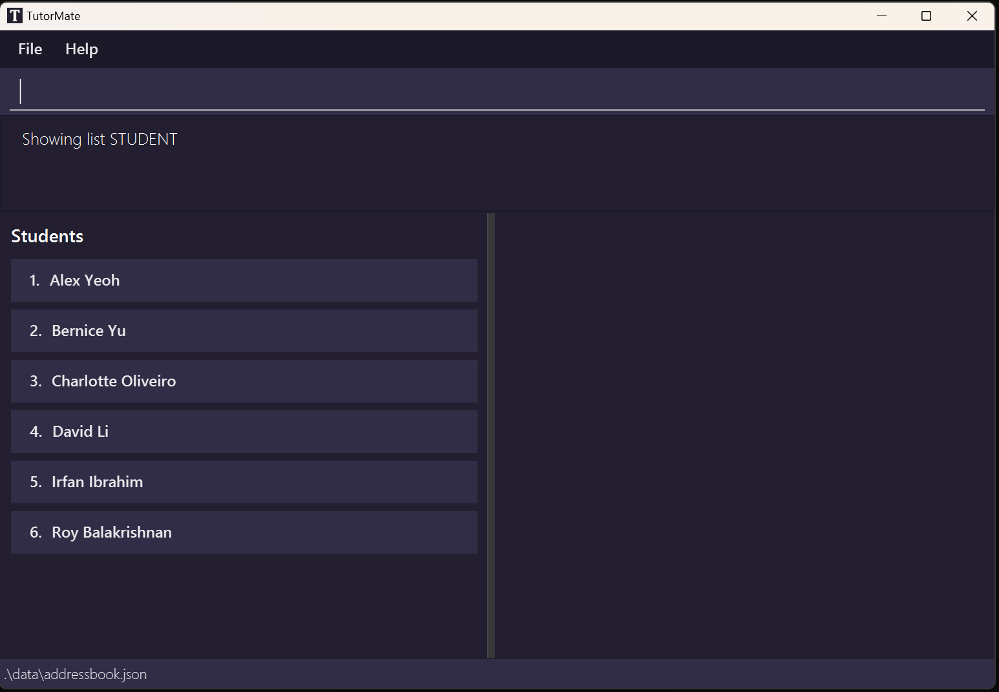

# TutorMate User Guide
<br>

## About

TutorMate is a desktop app targeted to private tuition teachers on handling tuition related matters.

It is optimized for use via a Command Line Interface (CLI) while still having the benefits of a Graphical User Interface (GUI). 
If you can type fast, TutorMate can get your administrative tasks done faster than traditional GUI apps.

This document describes the main features of TutorMate:
1. Student Management System: track all student details
2. Lesson Schedule: easily plan and manage lessons
3. Task Lists: keep track of tasks to be done for lessons

With a customised student list and schedule in TutorMate just for you, organising lessons and managing students
will be the least of your worries.

This project is based on the [AddressBook-Level3 project](https://se-education.org).

<!-- * Table of Contents -->
<page-nav-print />

--------------------------------------------------------------------------------------------------------------------

## Quick Start

1. Ensure you have Java 11 or above installed in your Computer. You can check by opening a command terminal and typing `java -version`.

1. Download the latest `tutormate.jar` from [here](https://github.com/AY2324S1-CS2103T-T11-3/tp/releases).

1. Copy the file to the folder you want to use as the _home folder_ for your TutorMate.

1. Open a command terminal, navigate into the folder you put the jar file in using the change directory command `cd`, and use the `java -jar tutormate.jar` command to run the application.<br>
   A GUI similar to the below should appear in a few seconds. Note how the app contains some sample data.<br>

   

1. Type the command in the command box and press Enter to execute it. e.g. typing `help` and pressing Enter will open the help window.<br>
   Some example commands you can try:

    * `list students` : Lists all students with their name.

    * In ___STUDENTS list___:

        * `add -name Leah` : Adds a student named "Leah" to the application.

        * `show 3` : Shows the details of the person with the index 3 in TutorMate.

    * `exit` : Exits the app.

1. Refer to the [Features](#features) below for details of each command.
2. Refer to the [Command Summary](#command-summary) below for the summary of all commands.
2. Refer to the [Glossary](#glossary) below for definitions of glossary terms.

--------------------------------------------------------------------------------------------------------------------

## Important Notes

### Basic Usage

<!-- todo, illustrate -->
* The app is split into 3 states: ___STUDENTS list___, ___SCHEDULE list___ (default) and ___TASKS list___. Each corresponds to the main features of TutorMate.
* Each state has its associated features, while certain features work with all states but has differing functionalities.
* The ___STUDENTS list___ handles student details management, ___SCHEDULE list___ handles lessons, scheduling and the tasks for each lesson while the full ___TASKS list___ is a view to display all tasks.
* The GUI has several main components (see GUI image below):
  * The command box is for users to enter and execute commands.
  * The response box is to display responses for command execution, to indicate success or errors.
  * The left side has the list panel, which shows different list types (student, schedule, tasks).
  * The right side has the details panel, which shows details of any specific item in the list.


### Terminologies / Symbols
* Flag: denoted with a dash before the flag name e.g. -name.
<!-- todo, validate that all boxes thing works, as IDE does not show it -->
* Text formatted as code snippets are either commands e.g. `list schedule`, command formats e.g. `list [LIST][KEYWORDS]` or parameters e.g. `NAME`.
* <box type="info" seamless>This box denotes additional information.</box>
* <box type="tip" seamless>This box denotes tips to improve usability.</box>
* <box type="warning" seamless>This box denotes warnings that can cause errors.</box>
```
This box denotes command outputs.
```

### Notes on Command Format
<box type="info" seamless>

* Words in upper case are compulsory parameters to be supplied by the user.<br>
  e.g. in `add -name NAME`, `NAME` is a parameter which can be used as `add -name Leah`.
  In this case, "Leah" is substituted for `NAME`.
* Words in square brackets are optional.<br>
  e.g. `list [LIST] [KEYWORDS]` can be used as `list` or as `list students email`, though the behaviour may differ.
* Flags can be in any order.<br>
  e.g. both `link -student student name -lesson lesson name` and `link -lesson lesson name -student student name` are acceptable.
* Parameters without a flag need to strictly follow the order specified.<br>
  e.g. For delete command which specifies `delete INDEX`, the "index" parameter must immediately follow the command name "delete".<br>
* All command name are case-insensitive. <br>
  e.g. `linkTo` is the same as `linkto` or `LiNkTo`.
* When applicable, extraneous parameters and flags for commands will be ignored .<br>
  e.g. if the command entered is `add info -name new name -notValid flagBody -subject physics`, it will be interpreted as `add -name new name -subject physics`. "info " and "-notValid flagBody" will be ignored. <br>
  e.g. if the command entered is `delete 3 extra`, it will be interpreted as `delete 3`.<br>
  e.g. However, `delete extra 3` will not be accepted as delete command specifies that the index parameter must immediately follow the command name.
</box>

### Other Notes
<box type="warning" seamless>

* Please avoid using " -" in the value of a parameter as tutorMate treats " -" as a reserved word that signifies the start of a new flag.
* Please do not abuse the parser of tutorMate. For example, do not game it with special characters or code injections. TutorMate does not guarantee the behaviour of the application on deliberate and malicious abuse beyond supported normal usage.
* TutorMate supports a maximum of 99999 students, 99999 lessons and 99999 tasks. Further data beyond this limit might be lost and not accessible in the application.
* Please avoid manually modifying the data files in the data folder. Doing so may result in unexpected behaviour and data loss.
* Please avoid running multiple instances of TutorMate at the same time. Doing so may result in unexpected behaviour and data loss.
* If you are using a PDF version of this document, be careful when copying and pasting commands that span multiple lines as space characters surrounding line-breaks may be omitted when copied over to the application.
</box>

### Parameter Summary

| Parameter       | Used in                                                                   | Constraints                                                                                                                                                                                                                                                                                                                                                                                                                                                                                                                                                                                                                        | Valid examples                                                                                                  | Invalid examples            |
|-----------------|---------------------------------------------------------------------------|------------------------------------------------------------------------------------------------------------------------------------------------------------------------------------------------------------------------------------------------------------------------------------------------------------------------------------------------------------------------------------------------------------------------------------------------------------------------------------------------------------------------------------------------------------------------------------------------------------------------------------|-----------------------------------------------------------------------------------------------------------------|-----------------------------|
| `INDEX`         | `show`<br/>`editPerson` `deletePerson`<br/>`editLesson` `deleteLesson`    | Must be a positive integer in the range of 1 to 99999 inclusive.                                                                                                                                                                                                                                                                                                                                                                                                                                                                                                                                                                   | "1", "24", "12"                                                                                                 | "-1", "2147483648", "10000" |
| `LIST`          | `list`                                                                    | Must be either "Students", "Schedule", "Tasks". Parameter is case-insensitive.                                                                                                                                                                                                                                                                                                                                                                                                                                                                                                                                                     | "STUDENTS", "stuDEnts"                                                                                          | "task", "student"           |
| `KEYWORDS`      | `list`                                                                    | Must be either "phone", "email", "address", "tags", "subjects", "remark", "none", or "all"                                                                                                                                                                                                                                                                                                                                                                                                                                                                                                                                         | "none", "all", "subJeCts"                                                                                       | "subject", ""               |
| `NAME`          | `addLesson` `editLesson`<br/>`addPerson` `editPerson`<br/>`filter` `find` | Must not be empty. <br/>Must only contain alphanumeric characters.                                                                                                                                                                                                                                                                                                                                                                                                                                                                                                                                                                 | "John", "Elton"                                                                                                 | "", "jo!"                   |   
| `SUBJECT`       | `addLesson` `editLesson`                                                  | Must be either "Mathematics", "Physics", <br/>"Biology", "Chemistry" or "English".                                                                                                                                                                                                                                                                                                                                                                                                                                                                                                                                                 | "mathematics", "MATHEMATICS",                                                                                   | "math"                      |
| `SUBJECTS`      | `addPerson` `editPerson`<br/>`filter`                                     | Must be a valid SUBJECT (see row above) or multiple entries of SUBJECT separated using a comma (,).                                                                                                                                                                                                                                                                                                                                                                                                                                                                                                                                | "mathematics", "mathematics, physics"                                                                           | "math, physics"             | 
| `PHONE`         | `addPerson` `editPerson`                                                  | Should be at least 3 characters long, and can only contain numbers.                                                                                                                                                                                                                                                                                                                                                                                                                                                                                                                                                                | "96681234", "823234"                                                                                            | "+6592212341", "98"         |
| `EMAIL`         | `addPerson` `editPerson`                                                  | Should follow the format localpart@domain.<br/>The local-part should only contain alphanumeric characters and these special characters, excluding the parentheses, (+_.-). The local-part may not start or end with any special characters.<br/>This is followed by a '@' and then a domain name. The domain name is made up of domain labels separated by periods.<br/>The domain name must:<br/>- end with a domain label at least 2 characters long<br/>- have each domain label start and end with alphanumeric characters<br/>- have each domain label consist of alphanumeric characters, separated only by hyphens, if any. | "hello@gmail.com", "test@g.com"                                                                                 | "hello.com", "f@f"          |
| `ADDRESS`       | `addPerson` `editPerson`                                                  | Must not be empty.                                                                                                                                                                                                                                                                                                                                                                                                                                                                                                                                                                                                                 | "Bedok", "25 Lower Kent Ridge Road"                                                                             | ""                          |  
| `TAG`           | `addPerson` `editPerson`<br/>`filter`                                     | Must not be empty and cannot contain any spaces. Multiple tags can be specified at once by using a comma (,) as a separator.                                                                                                                                                                                                                                                                                                                                                                                                                                                                                                       | "jc,express", "weak"                                                                                            | "junior college"            |
| `DATE`          | `addLesson` `editLesson`<br/>`filter`                                     | Must follow either the date format **yyyy/MM/dd**, **yy/MM/dd**, **MM/dd**, **dd**. See [here](https://www.unicode.org/reports/tr35/tr35-dates.html#Date_Field_Symbol_Table) for an exhaustive explanation of the allowable formats.                                                                                                                                                                                                                                                                                                                                                                                               | To represent the date 13/08/2023 and assuming today is 07/08/2023: <br/>"2023/08/13", "23/08/13", "08/13", "13" | "20222/08/2", "13/1"        | 
| `TIME`          | `addLesson` `editLesson`<br/>`filter`                                     | Must follow either HH:MM or H:MM (only for 0:00 to 9:59)                                                                                                                                                                                                                                                                                                                                                                                                                                                                                                                                                                           | "13:30", "9:17"                                                                                                 | "9:1", "13:70"              |
| `SEARCH_STRING` | `find`                                                                    | Must not be empty.                                                                                                                                                                                                                                                                                                                                                                                                                                                                                                                                                                                                                 | "Alex", "alex yeoh", "+asdf-"                                                                                   | ""                          |

--------------------------------------------------------------------------------------------------------------------

## Features

### List Feature : `list`

The list command is the way to navigate between the 3 states in our app.
It will display the specified list and its corresponding details panel.

Format: `list [LIST] [KEYWORDS]`
* Shows the list and associated detail panel for the specified `[LIST]`.
* The `[KEYWORDS]` is for which specifying student details to display, and is only valid for ___STUDENTS list___. When used for ___SCHEDULE list___ and ___TASKS list___, they will be ignored.
* Refer to the parameter constraints [here](#parameter-summary).

<box type="tip" seamless>

**Tips:**
- `list` without specifying the `[LIST]` parameter defaults to showing the ___SCHEDULE list___.

</box>

Example usages:
* `list` and `list schedule` displays the ___SCHEDULE list___ with all the lessons with their names in time order.
* `list students` displays all the students with their names (including previously specified fields).
* `list students subjects email` displays all the students with their names, a list of subjects for each student and their email.
* `list tasks` displays all the tasks with their description.

Success outputs:
* Input: `list` or `list schedule`
```
Showing list SCHEDULE
```
  
* Input: `list students` (with no additional student details):
```
Showing list STUDENT
```
  
* Input: `list tasks`
```
Showing list TASKS
```
  
* If there are no entries, e.g. there are no students added yet or there are no tasks added yet, an empty list is displayed.


Failure outputs:
* Input: `list student`, `list task`, `list students EMAIL`, `list students subject`, `list students subjects,phone`
  * Error: First command should spell `students` instead of `student`.
  * Error: Second command should spell `tasks` instead of `task`.
  * Error: Third command should spell `email` in lower case, not `EMAIL`.
  * Error: Fourth command should spell `subjects` instead of `subject`.
  * Error: Fifth command should use space separation `subjects phone` for keywords instead of comma separation.
```Invalid command format!
  list: Displays the specified list, which can be a STUDENTS list, SCHEDULE list or TASKS list. Default command without specified list displays the schedule list. When specifying STUDENTS list, optional parameters can be used to specify what student details to display.
  Parameters: [LIST] [KEYWORDS]...
  Example: list schedule
  Example: list students phone email
  Example: list tasks
```

<br>

### Show Feature : `show`

The show command has different behaviours depending on the current list. It shows the details of the specified item in the current list in the application.

Format: `show INDEX`
* The command format is the same for all lists.
* Shows the details of the lesson/task/student at the specified `INDEX`.
* The index refers to the index number shown in the displayed list.
* Refer to the parameter constraints [here](#parameter-summary).


#### For Student:

In ___STUDENT list___, the show command shows the details of the specified student from the ___STUDENT list___ in the application.

Example usages:
* `list STUDENTS` followed by `show 2` shows the details of the 2nd student in the ___STUDENT list___.
* `find Betsy` followed by `show 1` shows the details of the 1st student in the results of the `find` command.

Success outputs:
* Input: `show 1`
```
Showing Person: Alex Yeoh; Phone: 87438807; Email: alexyeoh@example.com; Address: Blk 30 Geylang Street 29, #06-40; Subjects: BIOLOGYCHEMISTRY; Tags: [friends]; Remark: To be added
```


#### For Schedule:

In ___SCHEDULE list___, the show command shows the details of the specified lesson from the ___SCHEDULE list___ in the application.

Example usages:
*  `list SCHEDULE` followed by `show 2` shows the details of the 2nd lesson in the ___SCHEDULE list___.
* `find lesson1` followed by `show 1` shows the details of the 1st lesson in the results of the `find` command.

Success outputs:
* Input: `show 1`
```
Showing Lesson: Start: 12:30 PM; End: 2:30 PM
```


#### For Task:

In ___TASKS list___, the show command shows the details of the specified task from the full ___TASKS list___ in the application.

Example usages:
* `list TASKS` followed by `show 2` shows the description of the 2nd task in the full ___TASKS list___.

Success outputs:
* Input: `show 1`
```
Showing Task: Description: Revise CS2103T Materials
```


#### General Examples

Failure outputs:
* Input: `show`
  * Error: No index given. Enter a valid index!
```  
  Invalid command format!
  show: Shows the details of the item identified by the index number used in the last item listing.
  Parameters: INDEX (must be a positive integer)
  Example: show 1
 ```


* Input: `show 100`
  * Error: Index given exceeds the length of the displayed list. Enter a valid index!
```
The lesson index provided is invalid
```


<br>

### Add Feature

#### For Student:

Format: `addPerson -name NAME [-phone PHONE_NUMBER] [-email EMAIL] [-address ADDRESS]
[-subject SUBJECTS] [-tag TAG] [-remark REMARK]`
* A new student cannot have the same name as existing students in the ___STUDENTS list___.
* A student can have any number of unique tags (including 0)
* Duplicate phone numbers are allowed, since it is possible for 2 children to use their parent's number.
* Refer to the parameter constraints [here](#parameter-summary).

<box type="tip" seamless>

**Tips:**
- If the user is currently in ___STUDENTS list___, the command can be shortened to `add`.

</box>

Example usages:
* `addPerson -name John`
* `addPerson -name John -phone 91234567 -email test@gmail.com -address 10 Kent Ridge Drive -subject MATHEMATICS`
* In `STUDENTS` list :
    * `add -name John -phone 91234567 -email test@gmail.com -address 10 Kent Ridge Drive -subject MATHEMATICS`

Success outputs:
* Input: `addPerson -name John -phone 91234567 -email test@gmail.com -address 10 Kent Ridge Drive -subject MATHEMATICS`
```
New person added: John; Phone: 91234567; Email: test@gmail.com; Address: 10 Kent Ridge Drive; Subjects: MATHEMATICS; Tags: ; Remark: To be added
```


Failure outputs:
* Input: `addPerson`
  * Error: No name given. Enter the -name flag with a valid name.
```  
Invalid person format: Flag name not found. 
Usage: addPerson -name NAME (any number of unique [-phone|email|address|subject|tag|remark] VALUE). 
For example, addPerson -name John -phone 91234567
If you are currently displaying student list, you could use 'add' inplace of 'addPerson'. 
Note you must provide a 'name' not already in the address book.
 ```


#### For Schedule:
<!-- use "SUBJECT" as parameter for lesson -->
Format: `addLesson -name NAME [-day DATE] [-start TIME] [-end TIME] [-subject SUBJECT]` (for list specific format)
* Format info 1
* Format info 2

<box type="tip" seamless>

**Tips:**
- Tip 1
- Tip 2

</box>

Example usages:
* `some code here`
* `another code here`

Success outputs:
* Input: `code with compulsory parameters`
* Input: `code with compulsory and optional parameters`
```
This block of code is for success outputs
```
Failure outputs:
* Input: `invalid command code here`
  * Error: Explanation and solution here, this is because the flag has an incorrect value, bla bla bla
```
Invalid command with the error message here
```

* Input: `invalid command code here`
  * Error: Explanation and solution here, this is because the flag has an incorrect value, bla bla bla
```
Invalid command with the error message here
```

#### For Task:

Format: `command COMPULSORY [optional]` (for list specific format)
* Format info 1
* Format info 2

<box type="tip" seamless>

**Tips:**
- Tip 1
- Tip 2

</box>

Example usages:
* `some code here`
* `another code here`

Success outputs:
* Input: `code with compulsory parameters`
* Input: `code with compulsory and optional parameters`
```
This block of code is for success outputs
```
Failure outputs:
* Input: `invalid command code here`
  * Error: Explanation and solution here, this is because the flag has an incorrect value, bla bla bla
```
Invalid command with the error message here
```

* Input: `invalid command code here`
  * Error: Explanation and solution here, this is because the flag has an incorrect value, bla bla bla
```
Invalid command with the error message here
```


<br>

### Delete Feature

Deletes the specified item in the ___STUDENTS list___ or ___SCHEDULE list___ of the application.


#### For Student:

Deletes a student in the ___STUDENTS list___ of the application. 

Format: `deletePerson INDEX`
* Deletes the student at the specified `INDEX`.
* The index refers to the index number shown in the displayed ___STUDENTS list___.
* The command is case-insensitive: e.g. `deleteperson`, `deletePerson` and `DELETEPERSON` are all valid.
* Refer to the parameter constraints [here](#parameter-summary).

<box type="tip" seamless>

**Tips:**
- If the user is currently in the ___STUDENTS list___, the command can be shortened to `delete`.

</box>

Example usages:
* `deletePerson 1`
* In ___STUDENTS list___ : `delete 1`

Success outputs:
* Input: `deletePerson 1`
```
Deleted Person: Alex Yeoh; Phone: 87438807; Email: alexyeoh@example.com; Address: Blk 30 Geylang Street 29, #06-40; Subjects: BIOLOGYCHEMISTRY; Tags: [friends]; Remark: To be added
```


Failure outputs:
* Input: `deletePerson`
  * Error: No index given. Enter a valid index!
```  
Invalid command format! 
deleteperson: Deletes the entry identified by the index number used in the displayed list.
Parameters: INDEX (must be a positive integer)
Example: delete 1
 ```


#### For Schedule:

Deletes a lesson in the ___SCHEDULE list___ of the application. 

Format: `deleteLesson INDEX`

* Deletes the lesson at the specified `INDEX`.
* The index refers to the index number shown in the displayed ___SCHEDULE list___.
* The command is case-insensitive: e.g. `deletelesson`, `deleteLesson` and `DELETELESSON` are all valid.
* Refer to the parameter constraints [here](#parameter-summary).

<box type="tip" seamless>

**Tips:**
- If the user is currently in the ___SCHEDULE list___, the command can be shortened to `delete`.

</box>

Example usages:
* `deleteLesson 1`
* In ___SCHEDULE list___ : `delete 1`

Success outputs:
* Input: `deleteLesson 1`
```
Deleted Lesson: Lesson lesson1 from 12:30 PM to 2:30 PM on 20-11-2023 for MATHEMATICS
```


Failure outputs:
* Input: `deleteLesson`
  * Error: No index given. Enter a valid index!
```  
Invalid command format! 
deletelesson: Deletes the lesson identified by the index number used in the displayed schedule list.
Parameters: INDEX (must be a positive integer)
Example: deletelesson 1
 ```


#### For Task:

Deletes the specified task from the shown lesson in the application. User must be in the ___SCHEDULE list___ and showing a lesson.

Format: `deleteTask INDEX`
* Deletes the task at the specified `INDEX` of the ___TASKS list___ in the shown lesson.
* The index refers to the index number shown in the displayed ___TASKS list___ of the lesson.
* The command is case-insensitive: e.g. `deletetask`, `deleteTask` and `DELETETASK` are all valid.
* Refer to the parameter constraints [here](#parameter-summary).

<box type="warning" seamless>

**Caution:**
The deleteTask command can only be used in the ___SCHEDULE list___ and while a lesson is shown.
</box>

Example usages:
* In ___SCHEDULE list___ : `show 1` followed by `deleteTask 2` deletes the 2nd task of the 1st lesson in the ___SCHEDULE list___.

Success outputs:
* Input: `show 1` followed by `deleteTask 1`
```
Deleted Task: Revise CS2103T Materials
```


Failure outputs:
* Input: `show 1` followed by `deleteTask 100`
  * Error: The index given is invalid. Enter a valid task index!
```
Task index do not belong to any tasks!
```


* Input: `show 1` followed by `deleteTask`
  * Error: No index given. Enter a valid task index!
```
Invalid command format! 
deletetask: Deletes the task identified by the task index from the currently displayed lesson.
Parameters: task index (must be a positive integer)
Example: deletetask 1
```


* Input: `deleteTask 1` without showing a lesson
  * Error: No lesson shown. Show a lesson with the `show` command.
```
Please use show lessonIndex before deleting task!
```


<br>

### Edit Feature

About the feature (generally that is similar across states)

Format: `command COMPULSORY [optional]` (if same command format across states)
* Format info 1
* Format info 2

<box type="tip" seamless> 

**Tips:**
- Tip 1
- Tip 2

</box>


#### For Student:
<!-- use -subject SUBJECT for student -->
Format: `command COMPULSORY [optional]` (for list specific format)
* Format info 1
* Format info 2

<box type="tip" seamless>

**Tips:**
- Tip 1
- Tip 2

</box>

Example usages:
* `some code here`
* `another code here`

Success outputs:
* Input: `code with compulsory parameters`
* Input: `code with compulsory and optional parameters`
```
This block of code is for success outputs
```
Failure outputs:
* Input: `invalid command code here`
  * Error: Explanation and solution here, this is because the flag has an incorrect value, bla bla bla
```
Invalid command with the error message here
```

* Input: `invalid command code here`
  * Error: Explanation and solution here, this is because the flag has an incorrect value, bla bla bla
```
Invalid command with the error message here
```

#### For Schedule:
<!-- use "-subject SUBJECTS" for lesson -->
Format: `command COMPULSORY [optional]` (for list specific format)
* Format info 1
* Format info 2

<box type="tip" seamless>

**Tips:**
- Tip 1
- Tip 2

</box>

Example usages:
* `some code here`
* `another code here`

Success outputs:
* Input: `code with compulsory parameters`
* Input: `code with compulsory and optional parameters`
```
This block of code is for success outputs
```
Failure outputs:
* Input: `invalid command code here`
  * Error: Explanation and solution here, this is because the flag has an incorrect value, bla bla bla
```
Invalid command with the error message here
```

* Input: `invalid command code here`
  * Error: Explanation and solution here, this is because the flag has an incorrect value, bla bla bla
```
Invalid command with the error message here
```

#### For Task:

Editing of ___TASKS list___ is not supported at this time!


<br>

### Find Feature : `find`

The find command finds students (in ___STUDENTS list___) or lessons (in ___SCHEDULE list___) whose names contain the search string.

Format: `find SEARCH_STRING`
* The search is case-insensitive. e.g. `lesson` will match `Lesson`. `hans` will match `Hans`.
* Names does not need to match the search string, as long as they contain it they will be returned. e.g. search string `sson Che` will return `Lesson Chemistry`. 
* While non-alphanumeric characters are allowed in the search string, they will likely not return any results as `NAME` parameter only allows alphanumeric characters.

<box type="warning" seamless>

**Caution:**
* Find tasks by name/description is disabled.
* Tasks can be found based on the lesson (find lesson by name) and `show` lesson to see list of tasks of the lesson.
</box>

#### For Student:

Example usages:
* `find bernice`
* `find a`

Success outputs:
* Input: `find bernice`
```
1 persons listed!
```
* Input: `find a[s*(|o`
```
0 persons listed!
```

#### For Schedule:

Example usages:
* `find lesson`
* `find b`

Success outputs:
* Input: `find lesson`
```
4 lessons listed!
```
* Input: `find &*af1`
```
0 lessons listed!
```

#### General Examples

Failure outputs:
* Input: `find` or `find `
  * Error: search string is empty.
```
Invalid command format! 
find: Finds all persons or lesson whose names contains the specified search string (case-insensitive) and displays them as a list with index numbers.
Parameter: SEARCH_STRING
Example: find alex yeoh
```
* Input: `find task1` (in ___TASKS list___)
    * Error: Find command is disabled in task list.
```
Unknown command
```

<br>

### Filter Feature : `filter`

About the feature (generally that is similar across states)
<!-- use "SUBJECTS" as parameter here -->
Format: `command COMPULSORY [optional]` (if same command format across states)
* Format info 1
* Format info 2

<box type="tip" seamless> 

**Tips:**
- Tip 1
- Tip 2

</box>


#### For Student:

Format: `command COMPULSORY [optional]` (for list specific format)
* Format info 1
* Format info 2

<box type="tip" seamless>

**Tips:**
- Tip 1
- Tip 2

</box>

Example usages:
* `some code here`
* `another code here`

Success outputs:
* Input: `code with compulsory parameters`
* Input: `code with compulsory and optional parameters`
```
This block of code is for success outputs
```
Failure outputs:
* Input: `invalid command code here`
  * Error: Explanation and solution here, this is because the flag has an incorrect value, bla bla bla
```
Invalid command with the error message here
```

* Input: `invalid command code here`
*   Error: Explanation and solution here, this is because the flag has an incorrect value, bla bla bla
```
Invalid command with the error message here
```

#### For Schedule:

Format: `command COMPULSORY [optional]` (for list specific format)
* Format info 1
* Format info 2

<box type="tip" seamless>

**Tips:**
- Tip 1
- Tip 2

</box>

Example usages:
* `some code here`
* `another code here`

Success outputs:
* Input: `code with compulsory parameters`
* Input: `code with compulsory and optional parameters`
```
This block of code is for success outputs
```
Failure outputs:
* Input: `invalid command code here`
  * Error: Explanation and solution here, this is because the flag has an incorrect value, bla bla bla
```
Invalid command with the error message here
```

* Input: `invalid command code here`
  * Error: Explanation and solution here, this is because the flag has an incorrect value, bla bla bla
```
Invalid command with the error message here
```

#### For Task:

Format: `command COMPULSORY [optional]` (for list specific format)
* Format info 1
* Format info 2

<box type="tip" seamless>

**Tips:**
- Tip 1
- Tip 2

</box>

Example usages:
* `some code here`
* `another code here`

Success outputs:
* Input: `code with compulsory parameters`
* Input: `code with compulsory and optional parameters`
```
This block of code is for success outputs
```
Failure outputs:
* Input: `invalid command code here`
  * Error: Explanation and solution here, this is because the flag has an incorrect value, bla bla bla
```
Invalid command with the error message here
```

* Input: `invalid command code here`
  * Error: Explanation and solution here, this is because the flag has an incorrect value, bla bla bla
```
Invalid command with the error message here
```

<br>

### Link Feature : `linkTo`

About the feature (generally that is similar across states)

Format: `command COMPULSORY [optional]` (if same command format across states)
* Format info 1
* Format info 2

<box type="tip" seamless> 

**Tips:**
- Tip 1
- Tip 2

</box>


#### For Student:

Format: `command COMPULSORY [optional]` (for list specific format)
* Format info 1
* Format info 2

<box type="tip" seamless>

**Tips:**
- Tip 1
- Tip 2

</box>

Example usages:
* `some code here`
* `another code here`

Success outputs:
* Input: `code with compulsory parameters`
* Input: `code with compulsory and optional parameters`
```
This block of code is for success outputs
```
Failure outputs:
* Input: `invalid command code here`
  * Error: Explanation and solution here, this is because the flag has an incorrect value, bla bla bla
```
Invalid command with the error message here
```

* Input: `invalid command code here`
  * Error: Explanation and solution here, this is because the flag has an incorrect value, bla bla bla
```
Invalid command with the error message here
```

#### For Schedule:

Format: `command COMPULSORY [optional]` (for list specific format)
* Format info 1
* Format info 2

<box type="tip" seamless>

**Tips:**
- Tip 1
- Tip 2

</box>

Example usages:
* `some code here`
* `another code here`

Success outputs:
* Input: `code with compulsory parameters`
* Input: `code with compulsory and optional parameters`
```
This block of code is for success outputs
```
Failure outputs:
* Input: `invalid command code here`
  * Error: Explanation and solution here, this is because the flag has an incorrect value, bla bla bla
```
Invalid command with the error message here
```

* Input: `invalid command code here`
  * Error: Explanation and solution here, this is because the flag has an incorrect value, bla bla bla
```
Invalid command with the error message here
```

#### For Task:

Format: `command COMPULSORY [optional]` (for list specific format)
* Format info 1
* Format info 2

<box type="tip" seamless>

**Tips:**
- Tip 1
- Tip 2

</box>

Example usages:
* `some code here`
* `another code here`

Success outputs:
* Input: `code with compulsory parameters`
* Input: `code with compulsory and optional parameters`
```
This block of code is for success outputs
```
Failure outputs:
* Input: `invalid command code here`
  * Error: Explanation and solution here, this is because the flag has an incorrect value, bla bla bla
```
Invalid command with the error message here
```

* Input: `invalid command code here`
  * Error: Explanation and solution here, this is because the flag has an incorrect value, bla bla bla
```
Invalid command with the error message here
```

<br>

### Navigate Feature : `nav`

About the feature (generally that is similar across states)

Format: `command COMPULSORY [optional]` (if same command format across states)
* Format info 1
* Format info 2

<box type="tip" seamless> 

**Tips:**
- Tip 1
- Tip 2

</box>


#### For Student:

Format: `command COMPULSORY [optional]` (for list specific format)
* Format info 1
* Format info 2

<box type="tip" seamless>

**Tips:**
- Tip 1
- Tip 2

</box>

Example usages:
* `some code here`
* `another code here`

Success outputs:
* Input: `code with compulsory parameters`
* Input: `code with compulsory and optional parameters`
```
This block of code is for success outputs
```
Failure outputs:
* Input: `invalid command code here`
  * Error: Explanation and solution here, this is because the flag has an incorrect value, bla bla bla
```
Invalid command with the error message here
```

* Input: `invalid command code here`
  * Error: Explanation and solution here, this is because the flag has an incorrect value, bla bla bla
```
Invalid command with the error message here
```

#### For Schedule:

Format: `command COMPULSORY [optional]` (for list specific format)
* Format info 1
* Format info 2

<box type="tip" seamless>

**Tips:**
- Tip 1
- Tip 2

</box>

Example usages:
* `some code here`
* `another code here`

Success outputs:
* Input: `code with compulsory parameters`
* Input: `code with compulsory and optional parameters`
```
This block of code is for success outputs
```
Failure outputs:
* Input: `invalid command code here`
  * Error: Explanation and solution here, this is because the flag has an incorrect value, bla bla bla
```
Invalid command with the error message here
```

* Input: `invalid command code here`
  * Error: Explanation and solution here, this is because the flag has an incorrect value, bla bla bla
```
Invalid command with the error message here
```

#### For Task:

Format: `command COMPULSORY [optional]` (for list specific format)
* Format info 1
* Format info 2

<box type="tip" seamless>

**Tips:**
- Tip 1
- Tip 2

</box>

Example usages:
* `some code here`
* `another code here`

Success outputs:
* Input: `code with compulsory parameters`
* Input: `code with compulsory and optional parameters`
```
This block of code is for success outputs
```
Failure outputs:
* Input: `invalid command code here`
  * Error: Explanation and solution here, this is because the flag has an incorrect value, bla bla bla
```
Invalid command with the error message here
```

* Input: `invalid command code here`
  * Error: Explanation and solution here, this is because the flag has an incorrect value, bla bla bla
```
Invalid command with the error message here
```

<br>

### Command History Feature

The command history feature allows you to retrieve previously typed commands into the command text box.

* To start navigating the command history, press the up or down arrow, which will point and return the most recent command text (for invalid commands, it will retrieve it again since it is also saved, hence it will not change the command text yet). 
* Cycle through the command history using the up arrow to go back to previous commands, and down arrow to go to next commands, going beyond the command history will retrieve the oldest or newest command text for respectively. 

<box type="tip" seamless>

**Tips:**
- Command history is only valid per session, it does not save into storage. 
- Invalid commands are also saved into command history. 
- During each successful command execution, the pointer resets again, hence pressing the up or down arrow will point and return the most recent command text.
- Retrieved commands will replace the existing text in command box.

</box>

<box type="warning" seamless>

**Caution:**
* The index in command history remains when user clears the command box while scrolling through the history.
* e.g. For the history [`list tasks`, `list students`, `list schedule`], if user is retrieves the command history with `list students` and clears his command box, pressing up again will retrieve `list tasks`.
</box>

Example usages:
* Input: `list students`, `list schedule`, `list tasks` were entered in this order.
1. Pressing up arrow will go back in the command history and retrieve: `list tasks`.
2. Pressing up arrow will go further back in the command history and retrieve: `list schedule`.
3. Pressing down arrow will go forward in the command history and retrieve: `list tasks`.


<br>

### Clearing Data : `clear`

Clears the program data.

Format: `clear`

<br>

### Exit Program : `exit`

Exits the program.

Format: `exit`

<br>

### View Help : `help`

Shows a message explaining how to access the help page.
Click on the button to copy the link, enter it in a web browser to visit our user guide.


Format: `help`

<br>

### Saving Data

TutorMate data is saved in the hard disk automatically after any command that changes the data. There is no need to save manually.

<br>

### Editing Data File

TutorMate data is saved automatically as JSON files `[JAR file location]/data/addressbook.json`, `[JAR file location]/data/schedulelist.json` and `[JAR file location]/data/personLessonMap.json`. Advanced users are welcome to update data directly by editing that data file.
Be very careful, especially when you modify attributes such as Start and End time of lessons, as any overlapping lesson timings will render the data as invalid. For example, lesson clashes will not be detected. Scenarios like these are not exhaustive.

<box type="warning" seamless>

**Caution:**
If your changes to the data file makes its format invalid, TutorMate will discard all data and start with an empty data file at the next run.  Hence, it is recommended to take a backup of the file before editing it.
</box>

--------------------------------------------------------------------------------------------------------------------

## FAQ

**Q**: How do I transfer my data to another Computer? <br>
**A**: Copy TutorMate's jar file into the folder you want to use as the home folder in the other computer. Before running the application, copy _addressbook.json_, _personLessonMap.json_ and _schedulelist.json_ files from the home folder in your current computer into the home folder of the other computer. After copying the 3 files, running the application will show the same data. However, do note that the changes made through the application in one computer will not be reflected in the data in another computer.

**Q**: Can I edit the data in the application through the _addressbook.json, personLessonMap.json, schedulelist.json_ files directly? <br>
**A**: It is possible. However, it is not advisable for you to do so as if the changes made to the data file makes its format invalid, TutorMate will discard all data and start with an empty data file at the next run. Please use the `edit` command to make changes to your data instead.

**Q**: Can I still use the application without internet connection? <br>
**A**: Yes, you can. TutorMate is an offline desktop application. The only exception is the "help" command which provides a URL to the user guide.

--------------------------------------------------------------------------------------------------------------------

## Known Issues

1. **When using multiple screens**, if you move the application to a secondary screen, and later switch to using only the primary screen, the GUI will open off-screen. The remedy is to delete the `preferences.json` file created by the application before running the application again.


--------------------------------------------------------------------------------------------------------------------

## Command Summary

| Action       | Format           | Examples               | List    | Remarks                     |
|--------------|------------------|------------------------|---------|-----------------------------|
| **Feature1** | `command format` | `sample valid command` | Student | Any additional remarks here |
| **Feature2** | `command format` | `sample valid command` | Any     | Any additional remarks here |

--------------------------------------------------------------------------------------------------------------------

## Glossary

| Term                 | Definition                                                                                                                                                                                                          |
|----------------------|---------------------------------------------------------------------------------------------------------------------------------------------------------------------------------------------------------------------|
| **Command Terminal** | A text based user interface where most of the interaction is done by inputting commands. You can search for "terminal" to find and launch the inbuilt terminal in your operating system (Windows, Linus and MacOS). |
| **GUI**              | Abbreviation for graphical user interface, which allow user to interact with graphical components such as icons, buttons, and menus.                                                                                |
| **Home Folder**      | The folder TutorMate is located at while running. This will be the folder where tutorMate read the date from and write the data to.                                                                                 |
| **Java**             | A programming language that you need to install before you are able to launch tutorMate. You could refer to FAQ for tips on how to verify whether you already have Java installed and how to install it.            |
| **Flag**             | A flag is a tab started with dash "-" that is used to identify the type of information that is being provided. For example, in "add -name John", "-name" is a flag and "John" is the value of this flag.            |

