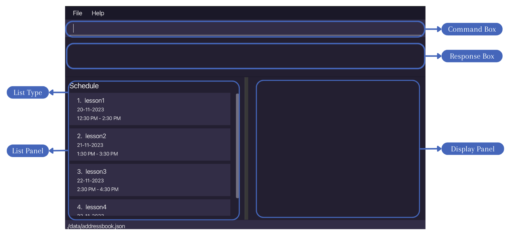

# TutorMate User Guide
<br>

## About

TutorMate is a desktop app targeted to private tuition teachers on handling tuition related matters.

It is optimized for use via a Command Line Interface (CLI) while still having the benefits of a Graphical User Interface (GUI). 
If you can type fast, TutorMate can get your administrative tasks done faster than traditional GUI apps.

This document describes the main features of TutorMate:
1. Student Management System: track all student details
2. Lesson Schedule: easily plan and manage lessons
3. Task Lists: keep track of tasks to be done for lessons

With a customised student list and schedule in TutorMate just for you, organising lessons and managing students
will be the least of your worries.

This project is based on the [AddressBook-Level3 project](https://se-education.org).

<!-- * Table of Contents -->
<page-nav-print />

--------------------------------------------------------------------------------------------------------------------

## Quick start

1. Ensure you have Java 11 or above installed in your Computer. You can check by opening a command terminal and typing `java -version`.

1. Download the latest `tutormate.jar` from [here](https://github.com/AY2324S1-CS2103T-T11-3/tp/releases).

1. Copy the file to the folder you want to use as the _home folder_ for your TutorMate.

1. Open a command terminal, navigate into the folder you put the jar file in using the change directory command `cd`, and use the `java -jar tutormate.jar` command to run the application.<br>
   A GUI similar to the below should appear in a few seconds. Note how the app contains some sample data.<br>
   

1. Type the command in the command box and press Enter to execute it. e.g. typing `help` and pressing Enter will open the help window.<br>
   Some example commands you can try:

    * `list students` : Lists all students with their name.

    * In list `STUDENTS`:

        * `add -name Leah` : Adds a student named "Leah" to the application.

        * `show 3` : Shows the details of the person with the index 3 in TutorMate.

    * `exit` : Exits the app.

1. Refer to the [Features](#features) below for details of each command.
2. Refer to the [Command Summary](#command-summary) below for the summary of all commands.
2. Refer to the [Glossary](#glossary) below for definitions of glossary terms.

--------------------------------------------------------------------------------------------------------------------

## Important notes

### Basic usage
* The app is split into 3 states: student list, schedule list and task list. Each corresponds to the main features of TutorMate.
* Each state has its associated features, while certain features work with all states but has differing functionalities.
* The student list handles student details management, schedule list handles lessons and scheduling, task list handles tasks.
* The GUI has several main components (see GUI image below):
  * The command box is for users to enter and execute commands.
  * The response box is to display responses for command execution, to indicate success or errors.
  * The left side has the list panel, which shows different list types (student, schedule, tasks).
  * The right side has the details panel, which shows details of any specific item in the list.


### Terminologies / Symbols
* Flag: denoted with a dash before the flag name e.g. -name.
* Text formatted as code snippets are either commands e.g. `list SCHEDULE`, command formats e.g. `list [LIST][KEYWORDS]` or parameters e.g. `NAME`.
* <box type="info" seamless>This box denotes additional information.</box>
* <box type="tip" seamless>This box denotes tips to improve usability.</box>
* <box type="warning" seamless>This box denotes warnings that can cause errors.</box>
* ```This box denotes command outputs.```

### Notes on command format
<box type="info" seamless>

* Words in upper case are compulsory parameters to be supplied by the user.<br>
  e.g. in `add -name NAME`, `NAME` is a parameter which can be used as `add -name Leah`.
  In this case, "Leah" is substituted for `NAME`.

* Items in square brackets are optional.<br>
  e.g. `list [LIST] [KEYWORDS]` can be used as `list` or as `list students email`.

* Flags can be in any order.<br>
  e.g. if the command specifies `-name NAME -phone PHONE_NUMBER`, `-phone PHONE_NUMBER -name NAME` is also acceptable.

* Extraneous parameters for commands that do not take in parameters (such as `help`, `exit` and `clear`) will be ignored.<br>
  e.g. if the command entered is `help 123`, it will be interpreted as `help`.

* If you are using a PDF version of this document, be careful when copying and pasting commands that span multiple lines as space characters surrounding line-breaks may be omitted when copied over to the application.

</box>

### Table of flags

| Flag               | Description          | Format             | Valid inputs     | Invalid inputs    |
|--------------------|----------------------|--------------------|------------------|-------------------|
| **-name, -remark** | describe flag        | `command format`   | input            | invalid input     |


--------------------------------------------------------------------------------------------------------------------

## Features

### Template feature without state: `temp`

About the feature

Format: `command COMPULSORY [optional]`
* Format info 1
* Format info 2

<box type="tip" seamless>

**Tips:**
- Tip 1
- Tip 2

</box>

Example usages:
* `some code here`
* `another code here`

Success outputs:
* Input: `code with compulsory parameters`
* Input: `code with compulsory and optional parameters`
```
This block of code is for success outputs
```
Failure outputs:
* Input: `invalid command code here`
* Explanation and solution here, this is because the flag has an incorrect value, bla bla bla
```
Invalid command with the error message here
```

* Input: `invalid command code here`
* Explanation and solution here, this is because the flag has an incorrect value, bla bla bla
```
Invalid command with the error message here
```

<br>

### Template feature with states

About the feature (generally that is similar across states)

Format: `command COMPULSORY [optional]` (if same command format across states)
* Format info 1
* Format info 2

<box type="tip" seamless> 

**Tips:**
- Tip 1
- Tip 2

</box>


#### For student list:

Format: `command COMPULSORY [optional]` (for list specific format)
* Format info 1
* Format info 2

<box type="tip" seamless>

**Tips:**
- Tip 1
- Tip 2

</box>

Example usages:
* `some code here`
* `another code here`

Success outputs:
* Input: `code with compulsory parameters`
* Input: `code with compulsory and optional parameters`
```
This block of code is for success outputs
```
Failure outputs:
* Input: `invalid command code here`
* Explanation and solution here, this is because the flag has an incorrect value, bla bla bla
```
Invalid command with the error message here
```

* Input: `invalid command code here`
* Explanation and solution here, this is because the flag has an incorrect value, bla bla bla
```
Invalid command with the error message here
```

#### For schedule list:

Format: `command COMPULSORY [optional]` (for list specific format)
* Format info 1
* Format info 2

<box type="tip" seamless>

**Tips:**
- Tip 1
- Tip 2

</box>

Example usages:
* `some code here`
* `another code here`

Success outputs:
* Input: `code with compulsory parameters`
* Input: `code with compulsory and optional parameters`
```
This block of code is for success outputs
```
Failure outputs:
* Input: `invalid command code here`
* Explanation and solution here, this is because the flag has an incorrect value, bla bla bla
```
Invalid command with the error message here
```

* Input: `invalid command code here`
* Explanation and solution here, this is because the flag has an incorrect value, bla bla bla
```
Invalid command with the error message here
```

#### For task list:

Format: `command COMPULSORY [optional]` (for list specific format)
* Format info 1
* Format info 2

<box type="tip" seamless>

**Tips:**
- Tip 1
- Tip 2

</box>

Example usages:
* `some code here`
* `another code here`

Success outputs:
* Input: `code with compulsory parameters`
* Input: `code with compulsory and optional parameters`
```
This block of code is for success outputs
```
Failure outputs:
* Input: `invalid command code here`
* Explanation and solution here, this is because the flag has an incorrect value, bla bla bla
```
Invalid command with the error message here
```

* Input: `invalid command code here`
* Explanation and solution here, this is because the flag has an incorrect value, bla bla bla
```
Invalid command with the error message here
```


* list 
* show 
* add (person, lesson, task)
* delete (person, lesson, task)
* edit (person, lesson)
* find 
* filter (person, lesson)
* link 
* nav 
* command history 
* clear 
* exit 
* help
* save data 
* edit data 

--------------------------------------------------------------------------------------------------------------------

## FAQ

**Q**: How do I transfer my data to another Computer? <br>
**A**: Copy TutorMate's jar file into the folder you want to use as the home folder in the other computer. Before running the application, copy _addressbook.json_, _personLessonMap.json_ and _schedulelist.json_ files from the home folder in your current computer into the home folder of the other computer. After copying the 3 files, running the application will show the same data. However, do note that the changes made through the application in one computer will not be reflected in the data in another computer.

**Q**: Can I edit the data in the application through the _addressbook.json, personLessonMap.json, schedulelist.json_ files directly? <br>
**A**: Yes, it is possible. However, it is not advisable for you to do so as if the changes made to the data file makes its format invalid, TutorMate will discard all data and start with an empty data file at the next run. Please use the `edit` command to make changes to your data instead.

**Q**: Can I still use the application without internet connection? <br>
**A**: Yes, you can. TutorMate is an offline desktop application.

--------------------------------------------------------------------------------------------------------------------

## Known issues

1. **When using multiple screens**, if you move the application to a secondary screen, and later switch to using only the primary screen, the GUI will open off-screen. The remedy is to delete the `preferences.json` file created by the application before running the application again.


--------------------------------------------------------------------------------------------------------------------

## Command summary

| Action       | Format           | Examples               | List    | Remarks                     |
|--------------|------------------|------------------------|---------|-----------------------------|
| **Feature1** | `command format` | `sample valid command` | Student | Any additional remarks here |
| **Feature2** | `command format` | `sample valid command` | Any     | Any additional remarks here |

--------------------------------------------------------------------------------------------------------------------

## Glossary

| Term                | Definition                  |
|---------------------|-----------------------------|
| **Glossary term 1** | definition of glossary term |
| **Glossary term 2** | definition of glossary term |
