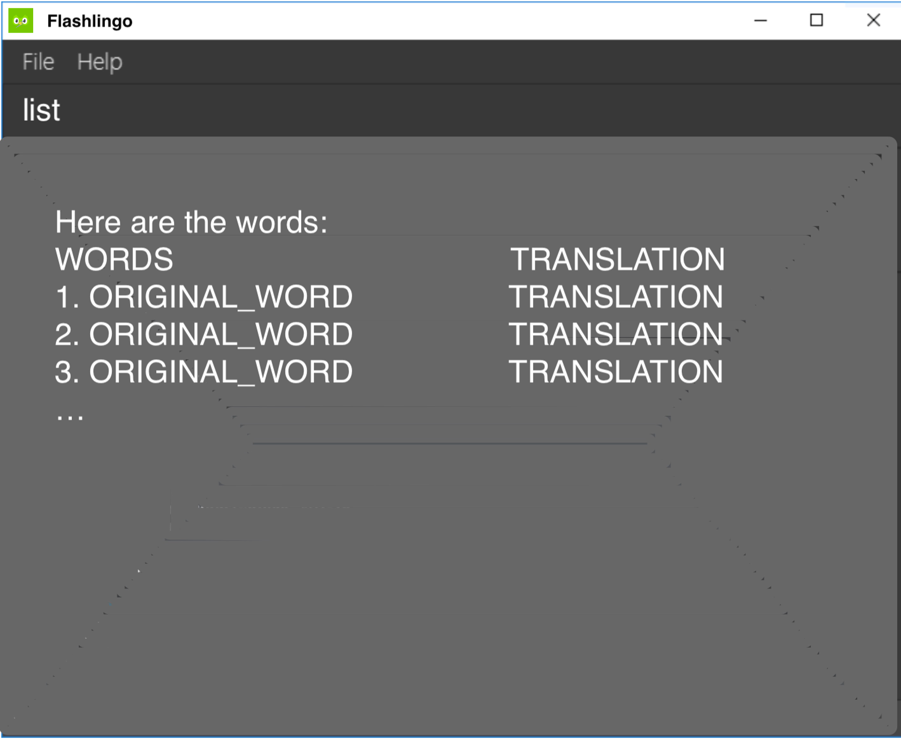
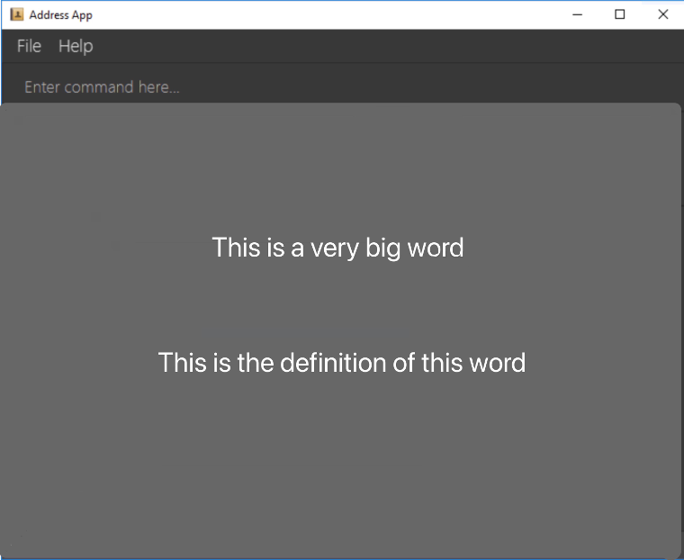
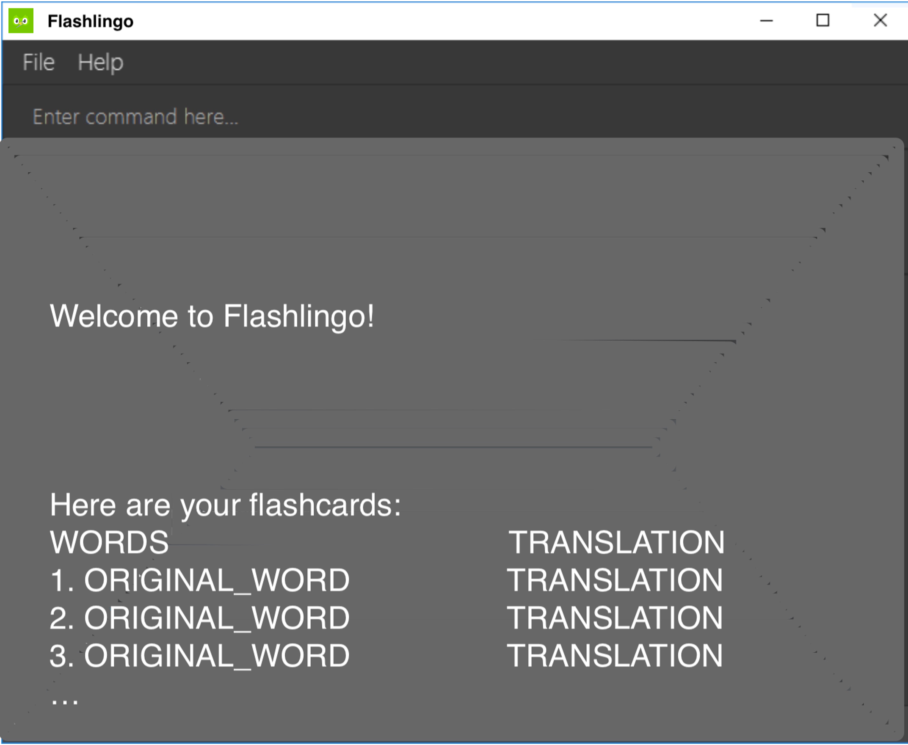

# User Guide
- [Usage](#usage)
    * [Help](#help)
    * [Add](#add)
    * [Delete](#del)
    * [List](#list)
    * [Start](#start)
    * [Flip](#flip)
    * [Yes](#Yes)
    * [No](#No)
    * [Stop](#stop)
    * [Exit](#exit)
    * [Save](#save)
    * [Load](#load)

## Usage

### Help
**`help` :  Shows the User Guide**

Opens a browser with the help page (User Guide)

Format: `help`

### Add
**`add` : Adds a word**
Adds a word to the flashcard with its translation.
* Creates a wild card.
* Works to add a word with its translation in the expected language.
* The already saved translation can be overridden with a new translation in a different language.

Format: `add w/WORD t/TRANSLATION`

Examples:
* `add w/regarder t/look` saves the translation of regarder as look
* `add w/entschuldigung t/sorry` saves the translation of entschuldigung as sorry

### Del
**`del` : Deletes a word**
Deletes a words and its related information
* Deletes a wild card.
* Looks up the word and deletes it and all its related information.

Format: `del w/WORD`

Examples:
* `del w/regarder` deletes the word and its translation
* `del w/entschuldigung` deletes the word and its translation.

### List
**`list` :  Shows the list of cards**

Shows the list of cards with both the original word and the corresponding translation.

Format: `list`

Output:
* `There are no words in the list! Add your flashcards now!`
* `Here are the words:`  
  `1. ORIGINAL_WORD - TRANSLATION`  
  `2. ORIGINAL_WORD - TRANSLATION`  
  `3. ORIGINAL_WORD - TRANSLATION`  
  `...`

### Start
**`start` : Shows flashcard, starts today’s flashcard session**

Shows the words the user is going to study.

Format: `start`

Output:

### Flip
**`flip` : Shows the other side of the flash card**

Shows the meaning of the word.

Format: `flip`/`f`

Output :

### Yes
**`yes` :  Indicates user has memorized the word**

Marks the word as memorized and pushes the word into the next retention stage.

Format: `yes`

### No
**`no` :  Indicates user has forgotten the word**

Marks the word as not grasped and leaves it in its current retention stage.

Format: `no`

### Stop
**`stop` :  Stops the current flashcard session**

Stops the current flashcard session and returns to the main menu.

Format: `stop`

Output: `Congratulations! You have completed FINISHED_WORDS out of TOTAL_WORDS words!`

### Exit
**`exit` : Terminates the program**

Closes the GUI and terminates the Java program

Format: `exit`

### Save
**`save` : Changes save location**

FlashLingo data is stored automatically to hard disk after every change, there is no need to manually save.

This function is to change the file path where the cards will be stored as a .txt file.

Format: `save <FILEPATH> `

* Changes the default save location to the FILEPATH.
* ⚠️ Please specify a directory that exists, or a file that ends with .txt

Examples:
* `save C:/Users/Directory` will save to C:/Users/Directory/FlashLingo.txt
* `save C:/Users/Directory/FileName.txt` will save to C:/Users/Directory/FileName.txt

Output:
* `Success`: File has been successfully saved to <FILEPATH>
* `Failure`: File has not been saved to <FILEPATH>. Please confirm that the path is correct

### Load
**`load` : Loads the previously stored data**

Loads the data stored by the save function into the program’s list

Format: `load <FILEPATH> `

* Loads the data specified from the .txt file.
* ⚠️ Please specify a .txt file that was created by the save function. Do NOT load any other txt files.

Examples:
* `load C:/Users/Directory/FileName.txt` will load the data from FileName.txt

Output:
* `Success`: File has been successfully loaded from <FILEPATH>
* `Failure`: File has not been loaded from <FILEPATH>. Please confirm that the path is correct, and that it is a file generated by FlashLingo.

## Main UI
