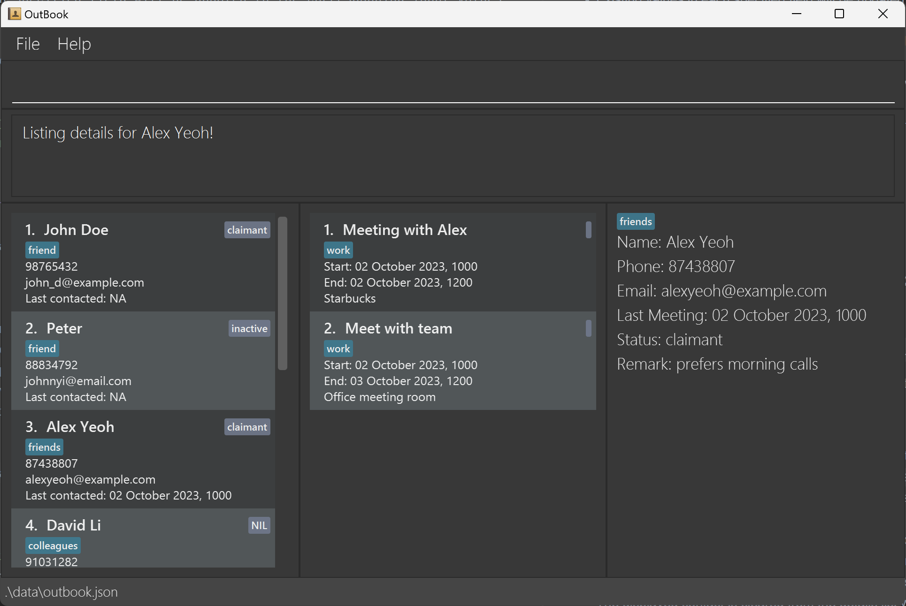
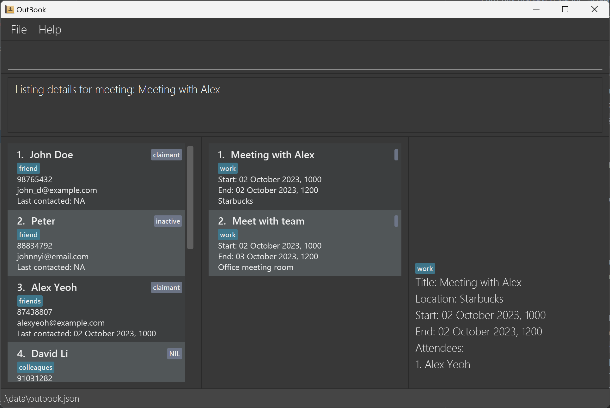

## About OutBook
OutBook is a desktop application designed for freelance insurance agents, enabling them to effectively organize and oversee their extensive contacts and meeting schedules. It is optimised for Command Line Interface (CLI) and aims to significantly reduce the time needed for organizational tasks.

This guide aims to help you explore its features and learn how to use them.

## Key Features
To help you simplify and streamline the process of organizing your contacts and meeting schedule, our application provides these easy-to-use and efficient features:
1. **Client Information Management**: Easily store, access and modify client details such as contact number, email and last contacted time. Add statuses, custom tags and remarks to organize your clients according to your preferences.
2. **Meeting Schedule and Information Management**: Keep track of where and when your meetings are, and who you are meeting, to ensure you will be prepared for every appointment.

Managing clients and a busy schedule has never been easier. With OutBook, all you need is a keyboard and a few seconds to type out simple commands!

# Table of Contents

- [Quick Start](#quick-start)
- [Navigating OutBook](#navigating-outbook)
- [Features](#features)
  - [Contact Commands](#contact-commands)
    - [Contact Parameters](#contact-parameters)
    - [Adding a contact: `addc`](#adding-a-contact--addc)
    - [Listing all contacts: `listc`](#listing-all-contacts--listc)
    - [Deleting a contact: `deletec`](#deleting-a-contact--deletec)
    - [Editing a contact: `editc`](#editing-a-contact--editc)
    - [Viewing detailed contact information: `viewc`](#viewing-detailed-contact-information--viewc)
    - [Finding contacts: `findc`](#finding-contacts--findc)
  - [Meeting Commands](#meeting-commands)
    - [Meeting Parameters](#meeting-parameters)
    - [Adding a meeting: `addm`](#adding-a-meeting--addm)
    - [Listing all meetings: `listm`](#listing-all-meetings--listm)
    - [Deleting a meeting: `deletem`](#deleting-a-meeting--deletem)
    - [Editing a meeting: `editm`](#editing-a-meeting--editm)
    - [Viewing detailed meeting information: `viewm`](#viewing-detailed-meeting-information--viewm)
    - [Finding meetings: `findm`](#finding-meetings--findm)
    - [Adding contact to meeting: `addmc`](#adding-contact-to-meeting--addmc)
    - [Removing contact from meeting: `rmmc`](#removing-contact-from-meeting--rmmc)
    - [Marking a meeting as complete : `mark`](#marking-a-meeting-as-complete--mark)
  - [Miscellaneous Commands](#miscellaneous-commands)
    - [Viewing help: `help`](#viewing-help--help)
    - [Clearing all entries: `clear`](#clearing-all-entries--clear)
    - [Exiting the program: `exit`](#exiting-the-program--exit)
  - [Saving the data](#saving-the-data)
    - [Editing the data file](#editing-the-data-file)
- [Command Summary](#command-summary)
- [FAQ](#faq)
- [Known issues](#known-issues)

---

# Quick start

1. Ensure you have Java `11` or above installed in your Computer.

2. Download the latest `OutBook.jar` [here](https://github.com/AY2324S1-CS2103T-F12-4/tp/releases).

3. Copy the file to the folder you want to use as the _home folder_ for OutBook.

4. Open a command terminal, navigate to the _home folder_ using `cd`, and use the `java -jar OutBook.jar` command to run the application. 
   A GUI similar to the below should appear in a few seconds. Note how the app comes pre-loaded with some sample data. 

      
5. Type a command in the command box and press Enter to execute it. e.g. typing **`help`** and pressing Enter will open the help window. 
   Some example commands you can try:

   - `listc` : Lists all contacts.

   - `addc n/John Doe p/98765432 e/johnd@example.com lc/10.10.2023 1000` : Adds a contact named `John Doe` to OutBook.

   - `deletec 3` : Deletes the 3rd contact shown in the contact list.

   - `deletem 1` : Deletes the 1st meeting shown in the meeting list.

   - `clear` : Deletes all contacts and meetings.

   - `exit` : Exits the app.

6. You can refer to the [Features](#features) section below for details of each command. 

[Click here to return to the Table of Contents](#table-of-contents)
___

# Navigating OutBook

| Name          | Function                                                                                                                                                                                                                                              |
|---------------|-------------------------------------------------------------------------------------------------------------------------------------------------------------------------------------------------------------------------------------------------------|
| Command Box   | Allows you to enter your commands here.                                                                                                                                                                                                               |
| Status Box    | Displays the results after a command is executed.                                                                                                                                                                                                     |
| Contacts List | Displays your contacts along with a summary of their details.                                                                                                                                                                                         |
| Meetings List | Displays meetings that are scheduled along with a summary of their details.                                                                                                                                                                           |
| Details List  | Displays all the fields of a contact and/or meeting in full detail, complete with labels. Use [viewc](#viewing-detailed-contact-information--viewc)/[viewm](#viewing-detailed-meeting-information--viewm) to specify the contact/meeting to display.  |

[Click here to return to the Table of Contents](#table-of-contents)

---

# Features

**:information_source: Notes about the command format:** 

- Every word in uppercase represents a field you can supply. 
  e.g. in `addc n/NAME`, `NAME` is a parameter that can be substituted for `John Doe`, as in `addc n/John Doe`.

- Fields contained in square brackets are optional. 
  e.g. when provided with the fields `n/NAME [t/TAG]`, you can submit `n/John Doe t/friend` if you want to mark this contact as a `friend`, or `n/John Doe` otherwise.

- Fields with `…`​ after them can be submitted any number of times, including zero. 
  e.g. when provided with the field `[t/TAG]…​`, you can leave the field blank, or submit `t/friend`, `t/friend t/family`, etc.

- You can submit fields in any order. 
  e.g. if the command specifies `n/NAME p/PHONE_NUMBER`, submitting in the format `p/PHONE_NUMBER n/NAME`, such as in `p/91472381 n/John Doe`, is also acceptable.

- If you are using a PDF version of this document, be careful when copying and pasting commands that span multiple lines. This is to avoid omission of space characters surrounding line-breaks when lengthy text is copied over to the application.

## Contact Commands

### Contact Parameters
| Parameter             | Description​                                                                                                                                                                                                      | Examples​                                                      |
|-----------------------|-------------------------------------------------------------------------------------------------------------------------------------------------------------------------------------------------------------------|----------------------------------------------------------------|
| `NAME`                | The name of the contact.     It should only contain alphanumeric characters and spaces, and it should not be blank.                                                                                       | <ul><li>`John Doe`</li><li>`Miguel-James Lee`</li></ul>        |
| `PHONE`               | The phone number of the contact.     It must contain only numbers, and be at least 3 digits long.                                                                                                         | <ul><li>`999`</li><li>`91243253`</li></ul>                     |
| `EMAIL`               | The email address of the contact.     It must adhere to the format `[LOCAL-PART]@[SERVER].[DOMAIN]`.                                                                                                      | <ul><li>`example@mail.com`</li><li>`john@hotmail.sg`</li></ul> |
| `LAST_CONTACTED_TIME` | The last date and time you had a meeting with the contact.     It must contain both date and time in the format `DD.MM.YYYY HHMM` or left blank.                                                          | <ul><li>`29.10.2023 1000`</li><li>`05.01.2023 2200`</li></ul>  |
| `STATUS`              | The status of the contact with regards to the insurance sales process.     It must be one of `NIL, Prospective, Active, Inactive, Claimant, Renewal` (case-insensitive) or blank.                         | <ul><li>`active`</li><li>`Prospective`</li></ul>               |
| `REMARK`              | The remark you have about the contact, if any.                                                                                                                                                                    | <ul><li>`has 4 cars`</li><li>`Loves coffee`</li></ul>          |
| `TAG`                 | The tag you want to associate with the contact, if any. A contact can have more than 1 tag.     It must be alphanumeric, i.e. special and non-alphanumeric characters (including spaces) are not allowed. | <ul><li>`Friend`</li><li>`TermLife`</li></ul>                  |
| `CONTACT_INDEX`       | The number shown beside each contact's name in the displayed contacts list.     It must be a positive integer and not more than the total number of contacts.                                             | <ul><li>`1`</li></ul>                                          |

### Adding a contact: `addc`

Adds a contact to OutBook.

Format: `addc n/NAME p/PHONE e/EMAIL [lc/LAST_CONTACTED_TIME] [s/STATUS] [r/REMARK] [t/TAG]…​`

- Duplicate contacts are not allowed. Contacts are duplicates if they have the same `NAME`, `PHONE`, or `EMAIL`.
- `NAME`, `PHONE`, and `EMAIL` are compulsory fields.
- `LAST_CONTACTED_TIME`, `STATUS`, `REMARK` and `TAG` are optional fields:
    - If `LAST_CONTACTED_TIME` is not specified, it will be defaulted to the minimum datetime provided by Java (i.e. `LocalDateTime.MIN`) and displayed as `NA` in the contacts list.
    - If `STATUS` is not specified, it will be defaulted to `NIL`.
- This command may change the contact that is currently displayed in the details list via the `viewc` command, as detailed [here](#viewing-detailed-contact-information--viewc).

:bulb: **Tip:**
You can put any number of tags (including 0) on a contact.

Examples:
- `addc n/John Doe p/98765432 e/johnd@example.com`
- `addc n/Betsy Crowe t/friend e/betsycrowe@example.com p/1234567 lc/01.01.2023 0100 t/Professor`

  

### Listing all contacts: `listc`

Shows an unfiltered list of all contacts in OutBook in the contacts list. Contacts are sorted by their `LAST_CONTACTED_TIME`.

Format: `listc`

* This command may change the contact that is currently displayed in the details list via the `viewc` command, as detailed [here](#viewing-detailed-contact-information--viewc).

### Deleting a contact: `deletec`

Deletes a contact from OutBook.

Format: `deletec CONTACT_INDEX`

- Deletes the contact at the specified `CONTACT_INDEX`.
- This command clears the contact that is currently displayed in the details list via the `viewc` command.

Examples:
- `listc` followed by `delete 2` deletes the 2nd person in the unfiltered contacts list returned by [`listc`](#listing-all-contacts--listc).
- `findc Betsy` followed by `delete 1` deletes the 1st person in the filtered contacts list returned by [`findc`](#finding-contacts--findc).

### Editing a contact : `editc`

Edits an existing contact in OutBook.

Format: `editc CONTACT_INDEX [n/NAME] [p/PHONE] [e/EMAIL] [lc/LAST_CONTACTED_TIME] [s/STATUS] [r/REMARK] [t/TAG]…​`

- Edits the contact at the specified `CONTACT_INDEX`. 
- All fields are optional, but at least one must be provided.
- Existing values in each specified field will be updated to the corresponding input values.
- When editing tags, the existing tags of the contact will be removed i.e. adding of tags is not cumulative.
- You can remove all the contact's tags by typing `t/` without specifying any tags after it.
- This command may change the contact that is currently displayed via the `viewc` command, as detailed [here](#viewing-detailed-contact-information--viewc).

Examples:
- `editc 1 p/91234567 e/johndoe@example.com` edits the phone number and email address of the 1st contact to be `91234567` and `johndoe@example.com` respectively.
- `editc 2 n/Betsy Crower t/` edits the name of the 2nd contact to be `Betsy Crower` and clears all existing tags.

### Viewing detailed contact information : `viewc`

Displays detailed information of a contact in the details list.

Format: `viewc CONTACT_INDEX`

- Displays the `NAME`, `PHONE`, `EMAIL`, `LAST_CONTACTED_TIME`, `STATUS`, `REMARK` and `TAG` of the contact at the specified `CONTACT_INDEX`.
- As this command displays the contact at the specified `CONTACT_INDEX` in the contacts list, the contact displayed in the details list may change due to a modification in list order through the use of `addc`, `editc` or `listc` commands. This is intentional.
- The displayed contact is cleared from the details list when the `deletec` and `findc` commands are used.

Examples:
- `viewc 3` displays detailed information related to the 3rd contact on the contacts list.

### Finding contacts: `findc`
Finds contact(s) that match the keywords specified for at least 1 of these fields: `NAME`, `PHONE`, `EMAIL`, `LAST_CONTACTED_TIME`, `STATUS`, `TAG`. The contacts list will be filtered to show only the results of this command. 

Format: `findc [n/KEYWORDS] [p/KEYWORDS] [e/KEYWORDS] [lc/DATETIME] [s/KEYWORDS] [t/KEYWORDS]`

* The search is case-insensitive, e.g `shop` will return `SHOP`.
* The order of the keywords does not matter, e.g. `Shop Meet` will return `Meet Shop`.
* For `NAME`, `STATUS` and `TAG`, only full words will be matched, e.g. `John` will return `John Lee` but not `Johnny`.
* For `EMAIL`, any email addresses that contains the sequence of characters specified in the inputs will be given as a result, e.g.  `_` will return `m_e@gmail.com`.
* For `PHONE`, any phone number that contains the sequence of digits specified in the inputs will be given as a result, e.g. `913` will return `90091300` but not `90103000`.
* For `LAST_CONTACTED_TIME`, the input must adhere to the `DD.MM.YYYY HHMM` format, e.g. 9th October 2023, 10.30am will be written as `09.10.2023 1030`.
* If only one field is provided, all contacts matching at least one keyword will be returned (i.e. `OR` search).
* If multiple fields are provided, only contacts matching at least one keyword in each field will be returned (i.e. `AND` search).
  - e.g. `n/John s/active` will return `Name: John Lee, Status: Active` but not `Name: John Doe, Status: Claimant`.
* This command clears the contact that is currently displayed in the details list via the `viewc` command.

Examples:
- `findc n/Alice` returns all contacts with a name that contains `alice`
- `findc p/51` returns all contacts with a phone number that contains `51`
- `findc e/_@GMAIL` returns all contacts with an email address that contains `alice_@gmail.com`
- `findc p/9 s/inactive claimant t/friend` returns contacts with a phone number that contains a `9`, a status of either `inactive` or `claimant`, and a `friend` tag
  

## Meeting Commands

**:information_source: Notes about meetings:** 

- Meetings in OutBook are sorted by their start time.

- Meetings are allowed to overlap and multiple meetings can be occurring at the same time.

### Meeting Parameters

| Parameter        | Description                                                                                                                                                                                                                                      | Examples                                                             |
|------------------|--------------------------------------------------------------------------------------------------------------------------------------------------------------------------------------------------------------------------------------------------|----------------------------------------------------------------------|
| `TITLE`          | The title of the meeting.    It can take any values, but should not be blank.                                                                                                                                                             | <ul><li>`1st Meeting with Alex`</li><li>`Quick-chat`</li></ul>       |
| `LOCATION`       | The location of the meeting.    It can take any values, but should not be blank.                                                                                                                                                          | <ul><li>`Zoom`</li><li>`21 Lower Kent Ridge Rd, S(119077)`</li></ul> |
| `START` / `END`  | The start/end times of the meeting.    They must contain both date and time and adhere to the `DD.MM.YYYY HHMM` format. `START` must be equal or before `END`.                                                                            | <ul><li>`29.10.2023 1000`</li><li>`05.01.2023 2200`</li></ul>        |
| `TAG`            | The tag you want to associate with the meeting, if any. A meeting can have more than 1 tag.    It must be alphanumeric, i.e. special and non-alphanumeric characters (including spaces) are not allowed.                                  | <ul><li>`Casual`</li><li>`Remote`</li></ul>                          |
| `ATTENDEE_NAME`  | The name of the contact added to the meeting as an attendee via the [`addmc`](#adding-contact-to-meeting--addmc) command.                                                                                                                        | <ul>-</ul>                                                           |
| `ATTENDEE_INDEX` | The number shown beside each attendee's name in the detailed view of the meeting (as described [here](#viewing-detailed-meeting-information--viewm)).     It must be a positive integer and not more than the total number of attendees. | <ul><li>`2`</li></ul>                                                |
| `MEETING_INDEX`  | The number shown beside each meeting's title in the displayed meetings list.     It must be a positive integer and not more than the total number of meetings.                                                                           | <ul><li>`1`</li></ul>                                                |                                                                      |

### Adding a meeting: `addm`

Adds a meeting to OutBook.

Format: `addm m/TITLE a/LOCATION s/START e/END [t/TAG]…​`

* `TITLE`, `LOCATION`, `START` and `END` are compulsory fields. `TAG` is optional.
* This command may change the meeting that is currently displayed in the details list via the `viewm` command, as detailed [here](#viewing-detailed-meeting-information--viewm).

Examples:
- `addm m/Lunch a/Cafeteria s/20.09.2023 1200 e/20.09.2023 1300`
- `addm m/CS2103T meeting a/Zoom call url s/20.09.2023 1000 e/20.09.2023 1200`

### Listing all meetings : `listm`

Shows an unfiltered list of all meetings in OutBook in the meetings list. Meetings are sorted by their `START` time.

Format: `listm`

* This command may change the meeting that is currently displayed in the details list via the `viewm` command, as detailed [here](#viewing-detailed-meeting-information--viewm).

### Deleting a meeting : `deletem`

Deletes a meeting from OutBook.

Format: `deletem MEETING_INDEX`

- Deletes the meeting at the specified `MEETING_INDEX`.
- This command clears the meeting that is currently displayed in the details list via the `viewm` command.

Examples:
- `listm` followed by `deletem 2` deletes the 2nd meeting in the unfiltered meetings list returned by [`listm`](#listing-all-meetings--listm).
- `findm m/Project` followed by `deletem 1` deletes the 1st meeting in the filtered meetings list returned by [`findm`](#finding-meetings--findm).

### Editing a meeting : `editm`

Edits an existing meeting in OutBook.

Format: `editm MEETING_INDEX [m/TITLE] [a/LOCATION] [s/START] [e/END] [t/TAG]…​`

- Edits the meeting at the specified `MEETING_INDEX`.
- All fields are optional, but at least one must be provided.
- Existing values in each specified field will be updated to the corresponding input values.
- When editing tags, the existing tags of the meeting will be removed, i.e. adding of tags is not cumulative.
  - You can therefore remove all of a meeting’s tags by typing `t/` without specifying any tags after it.
- This command may change the meeting that is currently displayed in the details list via the `viewm` command, as detailed [here](#viewing-detailed-meeting-information--viewm).

Examples:
- `editm 1 a/Hawker Centre s/15.09.2023 1500` edits the location and start of the 1st meeting to be `Hawker Centre` and `15.09.2023 1500` respectively.
- `editm 2 m/Zoom meeting t/` edits the title of the 2nd meeting to be `Zoom meeting` and clears all existing tags.

### Viewing detailed meeting information : `viewm`

Displays detailed information of a meeting in the details list.

Format: `viewm MEETING_INDEX`

- Displays the `TITLE`, `LOCATION`, `START`, `END`, `TAG` and attendees of the meeting at the specified `INDEX`.
- As this command displays the contact at the specified `MEETING_INDEX` in the meetings list, the meeting displayed in the details list may change due to a modification in list order through the use of `addm`, `editm` and `listm` commands. This is intentional.
- The displayed meeting is cleared from the details list when the `deletem` and `findm` commands are used.

Examples:
- `viewm 1` displays detailed information of the 1st meeting on the meetings list, including current attendees.

### Finding meetings: `findm`

Finds meetings with details matching the keywords you specified for at least 1 of these fields: `TITLE`, `LOCATION`, `ATTENDEE_NAME`, `TAG`; and falls within the `START` and `END` times given.
The meetings list will be filtered to show only the results of this command.

Format: `findm [m/KEYWORDS] [a/KEYWORDS] [t/KEYWORDS] [n/ATTENDEE_NAME] [s/START e/END]`

- The search is case-insensitive. e.g `shop` will return `SHOP`.
- The order of the keywords does not matter. e.g. `Shop Meet` will return `Meet Shop`.
- `TITLE`, `LOCATION`, `TAG` and `ATTENDEE_NAME` are searched, within the time frame given by `START` and `END`.
- Only full words will be matched e.g. `Meet` will return `Meet with John` but not `Meeting`.
- If only one field is provided, all meetings matching at least one keyword will be returned (i.e. `OR` search). 
  - e.g. `m/Shop Meet` will return `Meeting: Shop at mall`, `Meeting: Meet client`.
- If multiple fields are provided, only meetings matching at least one keyword in each field will be returned (i.e. `AND` search). 
  - e.g. `m/Shop Meet a/Mall` will return `Meeting: Shop at mall, Location: Mall` but not `Meeting: Meet client, Location: Park`.
- This command clears the meeting that is currently displayed in the details list via the `viewm` command.

Examples:
- `findm m/project` returns all meetings with a title that contains `project`.
- `findm m/zoom meeting` returns all meetings with a title that contains at least one of `zoom` or `meeting`.
- `findm s/09.09.2023 0000 e/09.10.2023 0000` returns all meetings between 09.09.2023 0000 and 09.10.2023 0000.
- `findm m/Meeting s/18.10.2023 0000 e/18.10.2023 2359 n/John` returns `Meeting with friends`, as it starts after 18.10.2023 0000 and ends before 18.10.2023 2359, and is attended by John.

### Adding contact to meeting: `addmc`

Adds a contact to a meeting as an attendee.

Format: `addmc MEETING_INDEX CONTACT_INDEX`

- Adds the contact at the specified `CONTACT_INDEX` to the meeting specified at `MEETING_INDEX`.
- The specified contact's name will be listed under "Attendees" in the detailed view of the specified meeting when [`viewm`](#viewing-detailed-meeting-information--viewm) is used.

Examples:
- `addmc 3 1` adds the 1st contact in the contacts list to the 3rd meeting in the meetings list.

### Removing contact from meeting: `rmmc`

Removes a contact from a meeting.

Format: `rmmc MEETING_INDEX ATTENDEE_INDEX`

- Removes a contact at the specified `ATTENDEE_INDEX` to the meeting at the specified `MEETING_INDEX`.

Examples:
- `rmmc 3 2` removes the 2nd attendee from the 3rd meeting.

### Marking a meeting as complete : `mark`

Marks a meeting as complete.

Format: `mark MEETING_INDEX`

- Marks the meeting at the specified `MEETING_INDEX` as complete.
- All attendees of the meeting will have their `LAST_CONTACTED_TIME` field updated to the `END` time of the meeting

Examples:
- `listm` followed by `mark 2` marks the 2nd meeting in the unfiltered meetings list returned by [`listm`](#listing-all-meetings--listm).

## Miscellaneous Commands

### Viewing help : `help`

Displays a message explaining how to access the help page.

Format: `help`

### Clearing all entries : `clear`

Clears all entries from the contacts, meetings and details list in OutBook, effectively wiping all data from OutBook.

Format: `clear`

### Exiting the program : `exit`

Closes and exits OutBook.

Format: `exit`

## Saving the data

OutBook's data is saved in the hard disk automatically after any command that modifies the data. There is no need to save manually.

### Editing the data file

OutBook's data is saved as a JSON file `[JAR file location]/data/outbook.json`. If you are an experienced user, you may attempt to update data directly by editing this data file.

:exclamation: **Caution:**
If your changes to the data file render its format invalid, OutBook will discard all data and start with an empty data file at the next run. Hence, it is recommended to make a backup of the file before editing it.

  

[Click here to return to the Table of Contents](#table-of-contents)

## Command summary

| Action                          | Format, Example                                                                                                                                                                   |
|---------------------------------|-----------------------------------------------------------------------------------------------------------------------------------------------------------------------------------|
| **Add contact**                 | `addc n/NAME p/PHONE e/EMAIL [lc/LAST_CONTACTED_TIME] [r/REMARK] [t/TAG]…​`   e.g., `addc n/James Ho p/22224444 e/jamesho@example.com lc/09.09.2023 0000 t/friend t/colleague` |
| **Add contact to meeting**      | `addmc MEETING_INDEX CONTACT_INDEX`   e.g., `addmc 2 1`                                                                                                                        |
| **Add meeting**                 | `addm m/TITLE a/LOCATION s/START e/END [t/TAG]…​`   e.g., `addm m/Lunch a/Cafeteria s/20.09.2023 1200 e/20.09.2023 1300`                                                       |
| **Clear**                       | `clear`                                                                                                                                                                           |
| **Delete contact**              | `deletec CONTACT_INDEX`   e.g., `deletec 3`                                                                                                                                    |
| **Delete meeting**              | `deletem MEETING_INDEX`   e.g., `deletem 3`                                                                                                                                    |
| **Edit contact**                | `editc CONTACT_INDEX [n/NAME] [p/PHONE] [e/EMAIL] [lc/LAST_CONTACTED_TIME] [r/REMARK] [t/TAG]…​`  e.g.,`editc 2 n/James Lee e/jameslee@example.com`                            |
| **Edit meeting**                | `editm MEETING_INDEX [m/TITLE] [a/LOCATION] [s/START] [e/END] [t/TAG]…​`  e.g.,`editm 1 a/Hawker Centre s/15.09.2023 1500`                                                     |
| **Find contact**                | `findc [n/KEYWORDS] [p/KEYWORDS] [e/KEYWORDS] [lc/LAST_CONTACTED_TIME] [s/KEYWORDS] [t/KEYWORDS]`   e.g., `findc n/James Jake s/active claimant`                               |
| **Find meeting**                | `findm [m/KEYWORDS] [a/KEYWORDS] [t/KEYWORDS] [n/ATTENDEE_NAME] [s/START e/END]`   e.g., `findm m/Zoom Meet s/09.09.2023 0000 e/09.10.2023 0000`                               |
| **Help**                        | `help`                                                                                                                                                                            |
| **List contacts**               | `listc`                                                                                                                                                                           |
| **List meetings**               | `listm`                                                                                                                                                                           |
| **Mark meeting**                | `mark MEETING_INDEX`   e.g., `mark 1 `                                                                                                                                         |
| **Remove contact from meeting** | `rmmc MEETING_INDEX ATTENDEE_INDEX`   e.g., `rmmc 2 2`                                                                                                                         |
| **View contact details**        | `viewc CONTACT_INDEX`   e.g., `viewc 4`                                                                                                                                        |
| **View meeting details**        | `viewm MEETING_INDEX`   e.g., `viewm 4`                                                                                                                                        |
| **Exit**                        | `exit`                                                                                                                                                                            |

[Click here to return to the Table of Contents](#table-of-contents)

---

## FAQ

**Q**: How do I transfer my data to another computer? 
**A**: Follow these steps:
1. Install OutBook on the other computer following the same instructions as in the [Quick Start Guide](#quick-start). An empty data file will be created in the same folder as the application. 
2. Replace this empty data file with the file that contains the data from your previous OutBook installation.
3. Your transferred data should now be visible upon launching OutBook.

[Click here to return to the Table of Contents](#table-of-contents)

---

## Known issues

1. **When using multiple screens**, if you move the application to a secondary screen, and later switch to using only the primary screen, the GUI will open off-screen. You can solve this by deleting the `preferences.json` file created by the application, before running the application again.

[Click here to return to the Table of Contents](#table-of-contents)

---
