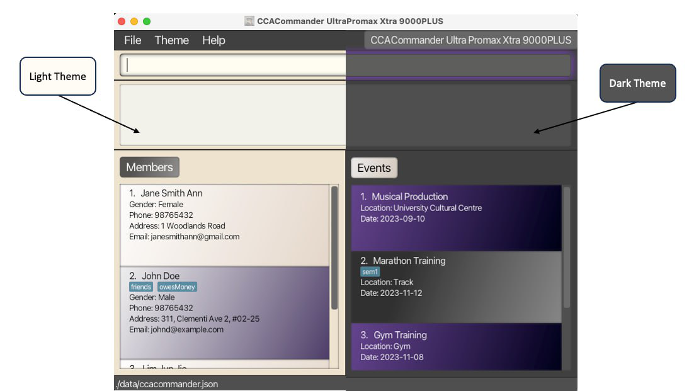
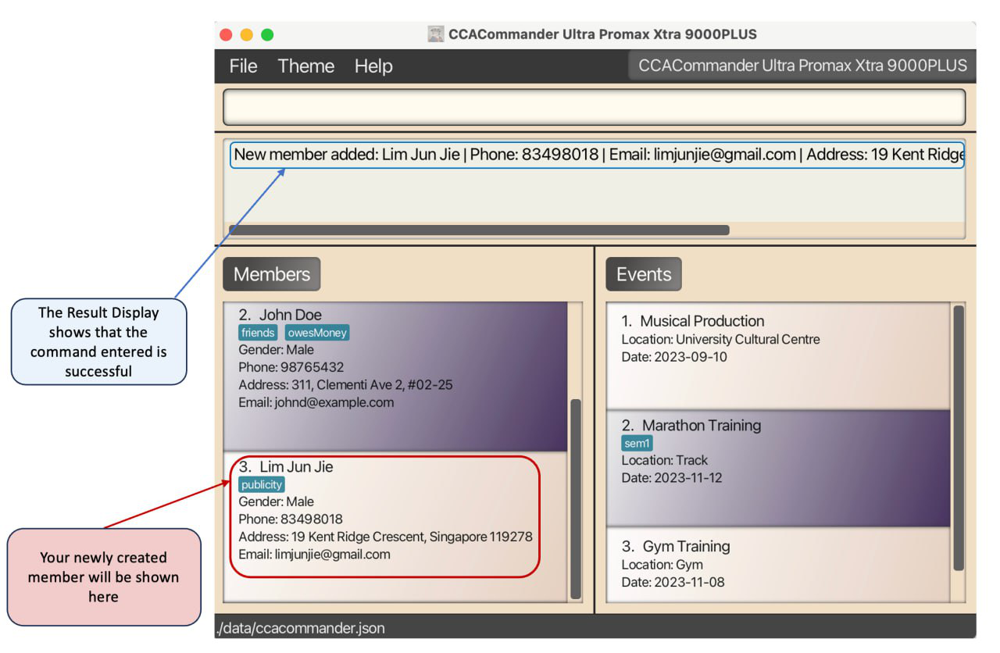
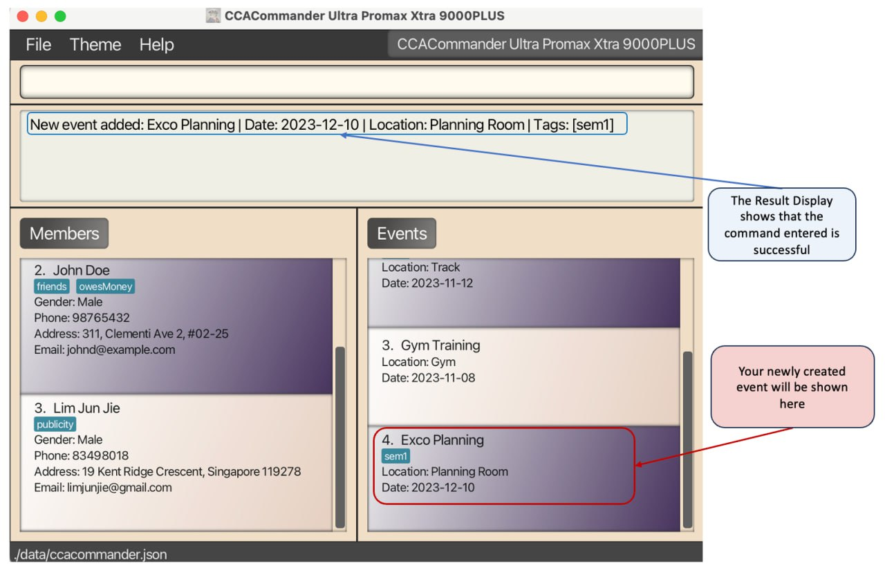
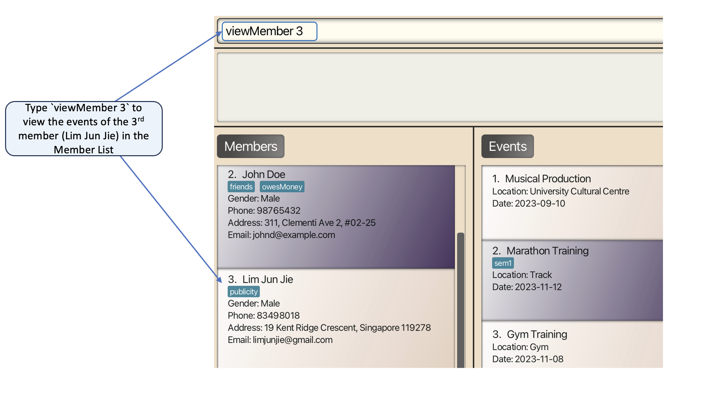
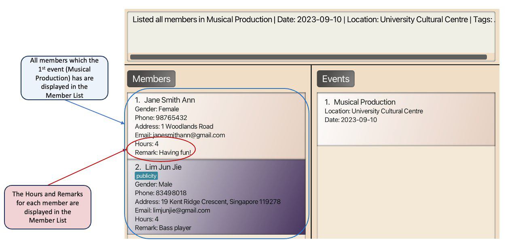
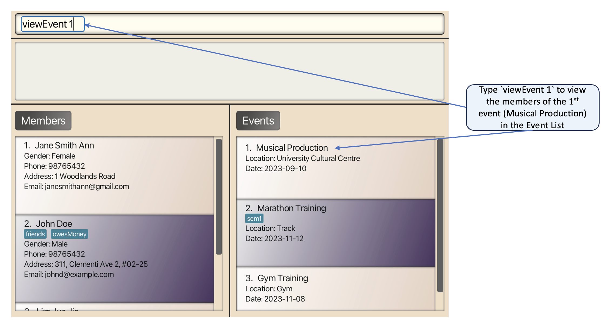
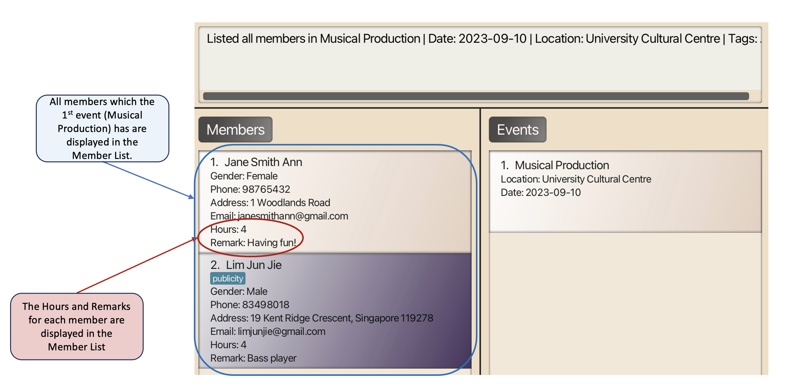

<link rel="stylesheet" href="./assets/css/guide.css">

 
 
 
 
 
 

    

        <h1>User Guide</h1>
        
Everything you need to know about CCACommander Ultra Promax Xtra 9000PLUS

    

    

        
    

 
 

## Table of Contents
{: .no_toc }
1. Table of Contents
{:toc}

## Introduction
As a Co-curricular Activity (CCA) head, do you find yourself struggling to manage your CCA members’ attendances and record the array of events that your CCA has?
Are the heaps of spreadsheets you are using to manage them making you feel overwhelmed? Well, fear not, **CCACommander Ultra Promax Xtra 9000PLUS** is here to save the day!

CCACommander is a desktop application that helps CCA leaders record details of their members and events, whilst tracking every member’s attendance.
It helps to organise members and events into easy-to-view compartments under a singular [Graphical User Interface (GUI)](https://blog.hubspot.com/website/what-is-gui) while providing granular control to you via its in-built [Command Line Interface (CLI)](https://www.techtarget.com/searchwindowsserver/definition/command-line-interface-CLI).
If you can type quickly, CCACommander can help you complete your administrative tasks much more efficiently than traditional GUI applications.

## About
This user guide provides documentation on how you can install and use **CCACommander Ultra Promax Xtra 9000PLUS**. Descriptions of CCACommander’s features and how to use them have been carefully organised into key sections for your convenience.
To get started, take a look at our [quick start](#quick-start) guide!

This guide uses the following features to make it easier for you to navigate around:
* Words that look like [this](#about) can be clicked to jump to the related section.
* Words that look like `this` refer to commands which you can type into the command box of CCACommander.
* Words that look like <kbd>this</kbd> refer to keyboard keys that you can press.

:warning: Boxes with the :warning: icon contain important information that you should read.

:information_source: Boxes with the :information_source: icon contain additional useful information.

:bulb: Boxes with the :bulb: icon contain additional tips and tricks to help you get the most out of CCACommander.

--------------------------------------------------------------------------------------------------------------------
## Quick Start

:warning: We assume that you have some basic knowledge of terminal commands. You can learn how to use the terminal with [this guide](https://www.freecodecamp.org/news/command-line-for-beginners/).

1. Ensure you have Java `11` installed in your computer by following [this guide](https://phoenixnap.com/kb/check-java-version-on-mac-windows).

2. Download the latest `ccacommander.jar` from [here](https://github.com/AY2324S1-CS2103T-F11-1/tp/releases).

3. Put the downloaded file into a folder of your choice (preferably a new empty folder).

4. Open a command terminal in the folder you put the CCACommander file in, and use the `java -jar ccacommander.jar` command to run the application. A GUI resembling the one shown below should appear in a few seconds. Note how the app contains some sample data. 
    <figure style="margin-bottom:200px">
        
        <figcaption>Fig 1: Initial application display</figcaption>
    </figure>

5. Type the command in the command box and press <kbd>↵ Enter</kbd> to execute it.   E.g. typing `help` and pressing <kbd>↵ Enter</kbd> will open the help window.  
   Some example commands you can try:

    * `list` : Lists all members and events.

    * `createMember n/Lim Jun Jie g/Male p/98765432 e/limjunjie@gmail.com a/19 Kent Ridge Crescent, Singapore 119278`: Creates a member named "Lim Jun Jie" in CCACommander.

    * `deleteMember 3` : Deletes the 3rd member shown in the current list.

6. You can refer to the [Features](#features) section below for the details of each command.

:bulb: You can use the `clear` command to remove the sample data.

--------------------------------------------------------------------------------------------------------------------

> [Back to top](#top)

## Navigating User Interface
<figure>
    
    <figcaption>Fig 2: Components of CCACommander</figcaption>
</figure>
Here are the important components of CCACommander that you will use and interact with.

**Menu**: The CCACommander menu is located at the top-left corner of your screen. Click the sub-menu items to execute the following:
1. File: Exit the program
2. Theme: Toggle between light and dark themes
    <figure>
        
        <figcaption>Fig 3: Light and dark theme</figcaption>
   </figure>
3. Help: Access our user guide

**Command Box**: Type in your text commands.  
**Result Display**: View messages from CCACommander regarding your commands.  
**Member List**: View the members stored in CCACommander.  
**Event List**: View the events stored in CCACommander.  
**Storage Location**: Locate where your CCACommander data is stored in your computer.

## Command History
You can quickly recall previously entered commands for convenience as CCACommander stores almost all (see the info card below to see what commands are stored) commands entered by the user.

Upon selecting the command box, you can use the <kbd>↑</kbd> to <kbd>↓</kbd> key to navigate through the commands entered.

Example:
1. You have just marked attendance for the first member in the member list using the `editEnrolment m/1 e/1 r/Present` command.
2. You can then use <kbd>↑</kbd> to get `editEnrolment m/1 e/1 r/Present`
3. You can edit the member index to get `editEnrolment m/2 e/1 r/Present` to mark the second member as present.

:information_source: CCACommander will not store 2 of the same commands if they were entered twice in a row. Likewise, commands containing exclusively of blank spaces will not be stored as well.

Upon entering the <kbd>⌫ Backspace</kbd> or the <kbd>↵ Enter</kbd> key, users will have to re-navigate from the most recent command as it will be treated as an edit or entry of command.

--------------------------------------------------------------------------------------------------------------------

> [Back to top](#top)

## Features

**:information_source: Notes about the command format:** 

* Words in `UPPER_CASE` are the parameters to be supplied by the user. 
  E.g. in `createMember n/NAME`, `NAME` is a parameter which can be used as `createMember n/John Doe`.

* Items in square brackets are optional. 
  E.g. `n/NAME [t/TAG]` can be used as `n/John Doe t/friend` or as `n/John Doe`.

* Items with `…`​ after them can be used multiple times including zero times. 
  E.g. `[t/TAG]…​` can be used as ` ` (i.e. 0 times), `t/friend`, `t/friend t/family` etc.

* Parameters can be in any given order. 
  E.g. if the command specifies `n/NAME p/PHONE_NUMBER`, `p/PHONE_NUMBER n/NAME` is also acceptable.

* Some parameters of certain commands have constraints on the acceptable inputs.  
  You can refer to the [List of Acceptable Values](#list-of-acceptable-values) section below for more details.

* Extraneous parameters for commands that do not take in parameters (such as `help`, `list`, `exit` and `clear`) will be ignored. 
  E.g. if the command specifies `help 123`, it will be interpreted as `help`.

* If you are using a PDF version of this document, be careful when copying and pasting commands that span multiple lines as space characters surrounding line-breaks may be omitted when copied over to the application.

> [Back to top](#top)

### Member Commands
The vitality of a CCA lies in its members. CCACommander allows you to manage your members with the commands below:

#### Create a Member: `createMember`
Creates a new member with accompanying personal details (name, gender, phone number, email address, home address, tag).

Format: `createMember n/MEMBER_NAME g/GENDER [p/PHONE_NUMBER] [e/EMAIL] [a/ADDRESS] [t/TAG]...`

Examples:
* `createMember n/Lim Jun Jie g/Male p/83498018 e/limjunjie@gmail.com a/19 Kent Ridge Crescent, Singapore 119278 t/publicity` creates a member **named** "Lim Jun Jie" with **gender** "Male", **phone number** of "83498018", **email** of "limjunjie@gmail.com", home **address** of "19 Kent Ridge Crescent, Singapore 119278" and a "publicity" **tag**:

<figure>
    
    <figcaption>Fig 4: After executing the <code>createMember</code> command</figcaption>
</figure>

:information_source: CCACommander will automatically capitalise the members' names for you, meaning an input of "john doe" will become "John Doe" automatically! 

#### Edit a Member: `editMember`
Edits the member at the specified index with the specified fields.

Format: `editMember MEMBER_INDEX [n/MEMBER_NAME] [g/GENDER] [p/PHONE_NUMBER] [e/EMAIL] [a/ADDRESS] [t/TAG]...`

* `MEMBER_INDEX` refers to the index number shown in the **currently displayed** member list.
* At least one field to edit must be provided.

Examples:
* `editMember 1 p/91234567 e/johndoe@example.com` edits the member at **index** 1, changing their **phone number** to "91234567" and **email** to "johndoe@example.com".

#### Delete a Member: `deleteMember`

Deletes the member at the specified index.

Format: `deleteMember MEMBER_INDEX`

* Deletes the member at the specified `MEMBER_INDEX`.
* `MEMBER_INDEX` refers to the index number shown in the **currently displayed** member list.

Examples:
* `deleteMember 1` deletes the member at **index** 1 in the member list.
* `deleteMember 10` deletes the member at **index** 10 in the member list.

### Event Commands

As a CCA head, keeping track of event details is a major responsibility. CCACommander allows you to do so with the event-related commands below:

#### Create an Event: `createEvent`

Creates a new event with accompanying details (name, location, date, tag).

Format: `createEvent n/EVENT_NAME l/LOCATION d/DATE [t/TAG]...`

Examples:
* `createEvent n/Exco Planning l/Planning Room d/2023-12-10 t/Sem1` creates an event **named** "Exco Planning" held at the **location** "Planning Room" on the
  **date** 2023-12-10, with **tag** "Sem1".

<figure>
    
    <figcaption>Fig 5: After executing the <code>createEvent</code> command</figcaption>
</figure>

#### Edit an Event: `editEvent`

Edits the event at the specified index with the specified attributes.

Format: `editEvent EVENT_INDEX [n/EVENT_NAME] [l/LOCATION] [d/DATE] [t/TAG]...`

* `EVENT_INDEX` refers to the index number shown in the **currently displayed** event list.
* At least one field to edit must be provided.

Examples:
* `editEvent 1 l/MBS d/2023-10-20` edits the event at **index** 1, changing the **location** to "MBS" and the **date** to "2023-10-20"
* `editEvent 3 l/UCC Theater` edits the event at **index** 3, changing the **location** to "UCC Theater".

#### Delete an Event: `deleteEvent`

Deletes the event at the specified index.

Format: `deleteEvent EVENT_INDEX`

* Deletes the event at the specified `EVENT_INDEX`.
* `EVENT_INDEX` refers to the index number shown in the **currently displayed** event list.

Examples:
* `deleteEvent 1` deletes the event at **index** 1 in the event list.
* `deleteEvent 10` deletes the event at **index** 10 in the event list.

:information_source: The `EVENT_INDEX` parameter refers to the index number shown in the **currently displayed** event list.

> [Back to top](#top)

### Enrolment Commands

Enrolments are a way for you to manage your members’ involvements in your events. The enrolment commands below are the bread-and-butter for your participation tracking needs:

#### Enrol a Member to an Event: `enrol`

Enrols a member to an event.

Format: `enrol m/MEMBER_INDEX e/EVENT_INDEX [h/NUMBER_OF_HOURS] [r/REMARK]`

* Enrols the member at the specified `MEMBER_INDEX` to the event at the specified `EVENT_INDEX` with `NUMBER_OF_HOURS` specifying the number of hours that the member contributed and `REMARK` stating extra remarks about the member and event.

Examples:
* `enrol m/1 e/1 h/2 r/Role: Photographer` enrols member at **member index** 1 in the member list to the event at **event index** 1 in the event list, where the member had 2 **hours** of contributions to that event and has a **remark** of "Role: Photographer".
* `enrol m/5 e/1` enrols the member at **member index** 5 in the member list to the event at **event index** 1 in the event list.

#### Edit an Enrolment: `editEnrolment`
* Edits the specified `MEMBER_INDEX`'s enrolment of the event at the specified `EVENT_INDEX` with `NUMBER_OF_HOURS` specifying the number of hours that the member contributed and `REMARK` stating extra remarks about the member and event.

Format: `editEnrolment m/MEMBER_INDEX e/EVENT_INDEX [h/NUMBER_OF_HOURS] [r/REMARK]
`

:information_source: Remember to provide at least one field to be edited!

Examples:
* `editEnroment m/1 e/2 h/5 r/Role: Exco` edits the enrolment of the member at **member index** 1 to the event at **event index** 2, changing the number of **hours** to 5 and the **remark** to "Role: Exco".

#### Unenrol a Member from an Event: `unenrol`
Unenrol a member from an event.

Format: `unenrol m/MEMBER_INDEX e/EVENT_INDEX`

* Unenrol the member at the specified `MEMBER_INDEX` from the event at the specified `EVENT_INDEX`.
* The member at `MEMBER_INDEX` must be enrolled to the event at `EVENT_INDEX`.

Examples:
* `unenrol m/1 e/5` unenrols the member at **member index** 1 in the member list from the event at **event index** 5 in the event list.
* `unenrol m/5 e/1` unenrols the member at **member index** 5 in the member list from the event at **event index** 1 in the event list.

:information_source: The `MEMBER_INDEX`/`EVENT_INDEX` parameter refers to the index number shown in the **currently displayed** member/event list.

> [Back to top](#top)

### View Commands
In CCACommander, you can quickly change the view to fit your current use case, be it to check for the enrolment of an event,
searching for a member and more!

#### View Events of Member: `viewMember`

Lists all the events of a specified member index.

Format: `viewMember MEMBER_INDEX`

* Views the events of the member at the specified `MEMBER_INDEX`.
* `MEMBER_INDEX` refers to the index number shown in the **currently displayed** member list.

Examples:
* `viewMember 3` displays events of the 3rd member in the member list.

<figure>
    
    <figcaption>Fig 6: Before executing the <code>viewMember</code> command</figcaption>
</figure>
 
<figure>
    
    <figcaption>Fig 7: After executing the <code>viewMember</code> command</figcaption>
</figure>

#### View Members of Event: `viewEvent`

Lists all the members of a specified event index.

Format: `viewEvent EVENT_INDEX`
* Views the members of the event at the specified `EVENT_INDEX`.
* `EVENT_INDEX` refers to the index number shown in the **currently displayed** event list.

Examples:
* `viewEvent 1` displays members of the 1st event in the event list.

<figure>
    
    <figcaption>Fig 8: Before executing the <code>viewEvent</code> command</figcaption>
</figure>
 
<figure>
    
    <figcaption>Fig 9: After executing the <code>viewEvent</code> command</figcaption>
</figure>

#### Find Member in member list: `findMember`

Finds and lists member(s) whose name(s) contain the provided `MEMBER_NAME`.

Format: `findMember MEMBER_NAME [MORE_NAMES]...`
* Finds and lists member(s) whose name(s) contain the specified `MEMBER_NAME`.
* More than 1 `MEMBER_NAME` can be provided to find more members.

Examples:
* `findMember alice` displays the member(s) whose name(s) contain 'alice'
* `findMember alice bob charlie` displays the member(s) whose name(s) contain 'alice', 'bob' and/or 'charlie'.

:information_source:
The <code>findMember</code> command requires the names to be typed in full, meaning "Nich" will not suffice for finding "Nicholas". 
To make it convenient for you, the names do not have to be capitalised! 

#### Find Event in event list: `findEvent`

Finds and lists event(s) which name(s) contain the provided `EVENT_NAME`.

Format: `findEvent EVENT_NAME [MORE_NAMES]...`
* Finds and lists event(s) which name(s) contain the specified `EVENT_NAME`.
* More than 1 `EVENT_NAME` can be provided to find more events.

Examples:
* `findEvent party` displays the event(s) which name(s) contain 'party'
* `findEvent party marathon gaming` displays the event(s) which name(s) contain "party", "marathon" and/or "gaming".

:information_source:
The <code>findEvent</code> command requires the names to be typed in full, meaning "Par" will not suffice for finding "Party". 
To make it convenient for you, the names do not have to be capitalised! 

#### List all Members and all Events: `list`
List all members and all events in the CCA in two separate columns.

Format: `list`

### Utility Commands
CCACommander provides you with powerful utility commands to make your admin tasks even more of a breeze than it was before.

#### Undoing a command: `undo`

Undoes the previous command that the user has entered, which has changed the data within CCACommander.

Format: `undo`

List of commands that can be undone:
* `clear`
* `createMember`
* `deleteMember`
* `editMember`
* `createEvent`
* `deleteEvent`
* `editEvent`
* `enrol`
* `unenrol`
* `editEnrolment`

#### Redoing a command: `redo`

Redoes a command that the user has undone previously.

Format: `redo`

#### Clear all Members and Events: `clear`
Clears all Member and Event entries from CCACommander.

Format: `clear`

:bulb: Accidentally cleared your list? 
Fret not as you can use the `undo` command to recover your data! 

#### Help: `help`

Displays a pop-out window that shows a link to this User Guide.

Format: `help`

<figure>
    
    <figcaption>Fig 10: A help pop-up window will appear upon entering the <code>help</code> command</figcaption>
</figure>

#### Exit: `exit`

Closes CCACommander and its display window.

Format: `exit`

:information_source: The <code>exit</code> command exists for your convenience. 
It performs the same task as the cross in the top bar and the Exit button in the File sub-menu item.

#### Saving the data

CCACommander data are saved automatically as a JSON file `[JAR file location]/data/ccacommander.json`. Advanced users are welcome to update data directly by editing that data file.

:exclamation: **Caution:**
If your changes to the data file makes its format invalid, CCACommander will discard all data and start with an empty data file at the next run. Hence, it is recommended to take a backup of the file before editing it.

> [Back to top](#top)

## FAQ

**Q**: How do I transfer my data to another computer? 
**A**: Install the app in the other computer and overwrite the empty data file it creates with the file that contains the data of your previous CCACommander folder.

**Q**: Do I need Wi-Fi connection to use CCACommander? 
**A**: No, you can use CCACommander offline.

**Q**: How much storage space do I need for CCACommander? 
**A**: CCACommander is so lightweight that you only need 30 MB on your computer.

**Q**: What happens if my laptop battery dies suddenly? 
**A**: Rest assured, your data remains securely stored on your laptop.
Once your laptop is recharged, you can regain access to all your stored information.

--------------------------------------------------------------------------------------------------------------------

## Known Issues

1. **When using multiple screens**, if you move the application to a secondary screen, and later switch to using only the primary screen, the GUI will open off-screen. The remedy is to delete the `preferences.json` file created by the application before running the application again.
2. **Edit** commands go back to the main view no matter what view you were in.

--------------------------------------------------------------------------------------------------------------------

## Glossary
This glossary provides definitions for the special terms used in this user guide.

**CCA**: Co-curricular activity.

**Command**: The text typed in by the user as a CCA Head for CCACommander.

**Index**: The number beside the corresponding entry in a list.

**Tag**: A word or phrase that labels a member or an event.

-------------------------------------------------------------------------------------------------------------------

## Command Summary

Action | Format, Examples
--------|------------------
[**Create a Member**](#create-a-member-createmember) | `createMember n/MEMBER_NAME g/GENDER [p/PHONE_NUMBER] [e/EMAIL] [a/ADDRESS] [t/TAG]...`   e.g. `createMember n/Lim Jun Jie g/Male p/83498018 e/limjunjie@gmail.com a/19 Kent Ridge Crescent, Singapore 119278 t/publicity`
[**Edit a Member**](#edit-a-member-editmember) | `editMember MEMBER_INDEX [n/MEMBER_NAME] [g/GENDER] [p/PHONE_NUMBER] [e/EMAIL] [a/ADDRESS] [t/TAG]...`   e.g.`editMember 1 p/91234567 e/johndoe@example.com`
[**Delete a Member**](#delete-a-member-deletemember) | `deleteMember MEMBER_INDEX`   e.g.`deleteMember 1`
[**Create an Event**](#create-an-event-createevent) | `createEvent n/EVENT_NAME [l/LOCATION] [d/DATE] [t/TAG]...`   e.g.`createEvent n/Party l/Raffles Hall d/2023-09-16 t/Dinner t/Sem1`
[**Edit an Event**](#edit-an-event-editevent) | `editEvent EVENT_INDEX [n/EVENT_NAME] [l/LOCATION] [d/DATE] [t/TAG]...`   e.g. `editEvent 1 l/MBS d/2023-10-20`
[**Delete an Event**](#delete-an-event-deleteevent) | `deleteEvent EVENT_INDEX`   e.g.`deleteEvent 1`
[**Enrol a Member to an Event**](#enrol-a-member-to-an-event-enrol) | `enrol m/MEMBER_INDEX e/EVENT_INDEX [h/NUMBER_OF_HOURS] [r/REMARK]`   e.g.`enrol m/1 e/1 h/2 r/Role: Photographer`
[**Edit an Enrolment**](#edit-an-enrolment-editenrolment) | `editEnrolment m/MEMBER_INDEX e/EVENT_INDEX [h/NUMBER_OF_HOURS] [r/REMARK]`   e.g. `editEnrolment m/1 e/2 h/5 r/Role: Exco`
[**Unenrol Member from an Event**](#unenrol-a-member-from-an-event-unenrol) | `unenrol m/MEMBER_INDEX e/EVENT_INDEX`   e.g.`unenrol m/1 e/1`
[**View Events of Member**](#view-events-of-member-viewmember) | `viewMember MEMBER_INDEX`   e.g.`viewMember 3`
[**View Members of Event**](#view-members-of-event-viewevent) | `viewEvent EVENT_INDEX`   e.g.`viewEvent 1`
[**Find Member in member list**](#find-member-in-member-list-findmember) | `findMember MEMBER_NAME [MORE_NAMES]...`   e.g.`findMember anthony nicholas`
[**Find Event in event list**](#find-event-in-event-list-findevent) | `findEvent EVENT_NAME [MORE_NAMES]...`   e.g.`findEvent party`
[**List all Members and all Events**](#list-all-members-and-all-events-list) | `list`
[**Undo**](#undoing-a-command-undo) | `undo`
[**Redo**](#redoing-a-command-redo) | `redo`
[**Clear all Members and Events**](#clear-all-members-and-events-clear) | `clear`
[**Help**](#help-help) | `help`
[**Exit**](#exit-exit) | `exit`

> [Back to top](#top)

## List of Acceptable Values

<table class="tg">
<thead>
  <tr>
    <th class="tg-0pky">Command</th>
    <th class="tg-0pky">Field</th>
    <th class="tg-0pky">Acceptable values</th>
  </tr>
</thead>
<tbody>
  <tr>
    <td class="tg-0pky command" rowspan="6"><code>createMember</code> / <code>editMember</code></td>
    <td class="tg-0pky">MEMBER_NAME</td>
    <td class="tg-0pky">Only contain alphanumeric characters and spaces, and should not be blank</td>
  </tr>
  <tr>
    <td class="tg-0pky">GENDER</td>
    <td class="tg-0pky"><code>Male</code>, <code>Female</code>, <code>Others</code> in any case</td>
  </tr>
  <tr>
    <td class="tg-0pky">PHONE_NUMBER</td>
    <td class="tg-0pky">Only contain numbers, and at least 3 digits long</td>
  </tr>
  <tr>
    <td class="tg-0pky">EMAIL</td>
    <td class="tg-0pky">An email with a valid extension (e.g. <code>@gmail.com</code>)</td>
  </tr>
  <tr>
    <td class="tg-0pky">ADDRESS</td>
    <td class="tg-0pky">Any non-blank values except the following prefixes: <code>n/</code>, <code>g/</code>, <code>p/</code>, <code>e/</code>, <code>a/</code>, <code>t/</code></td>
  </tr>
  <tr>
    <td class="tg-0pky">TAG</td>
    <td class="tg-0pky">Only contain alphanumeric characters with no spaces in between, but can be blank</td>
  </tr>
  <tr>
    <td class="tg-0pky command" rowspan="4"><code>createEvent</code> / <code>editEvent</code></td>
    <td class="tg-0pky">EVENT_NAME</td>
    <td class="tg-0pky">Only contain alphanumeric characters and spaces, and should not be blank</td>
  </tr>
  <tr>
    <td class="tg-0pky">LOCATION</td>
    <td class="tg-0pky">Must not be blank and can take in any values, except the following prefixes:<code>e/</code>, <code>l/</code>, <code>d/</code>, <code>t/</code></td>
  </tr>
  <tr>
    <td class="tg-0pky">DATE</td>
    <td class="tg-0pky">Must be a valid date in the format of YYYY-MM-DD</td>
  </tr>
  <tr>
    <td class="tg-0pky">TAG</td>
    <td class="tg-0pky">Only contain alphanumeric characters with no spaces in between, but can be blank</td>
  </tr>
  <tr>
    <td class="tg-0pky command"><code>deleteMember</code> / <code>deleteEvent</code></td>
    <td class="tg-0pky">MEMBER_INDEX / EVENT_INDEX</td>
    <td class="tg-0pky">Must be a positive integer that is within the range of the length of the currently displayed member/event list</td>
  </tr>
  <tr>
    <td class="tg-0pky command" rowspan="3"><code>enrol</code> / <code>editEnrolment</code></td>
    <td class="tg-0pky">MEMBER_INDEX / EVENT_INDEX</td>
    <td class="tg-0pky">Must be a positive integer that is within the range of the length of the currently displayed member/event list</td>
  </tr>
  <tr>
    <td class="tg-0pky">NUMBER_OF_HOURS</td>
    <td class="tg-0pky">Must be a positive integer and must be less than or equal to 2147483647</td>
  </tr>
  <tr>
    <td class="tg-0pky">REMARK</td>
    <td class="tg-0pky">Must not be blank and can take in any values, except the following prefixes:<code>m/</code>, <code>e/</code>, <code>h/</code>, <code>r/</code></td>
  </tr>
  <tr>
    <td class="tg-0pky command"><code>viewMember</code> / <code>viewEvent</code></td>
    <td class="tg-0pky">MEMBER_INDEX / EVENT_INDEX</td>
    <td class="tg-0pky">Must be a positive integer that is within the range of the length of the currently displayed member/event list</td>
  </tr>
  <tr>
    <td class="tg-0pky command"><code>findMember</code> / <code>findEvent</code></td>
    <td class="tg-0pky">MEMBER_NAME / EVENT_NAME / MORE_NAMES</td>
    <td class="tg-0pky">Any non-blank values</td>
  </tr>
</tbody>
</table>

> [Back to top](#top)
