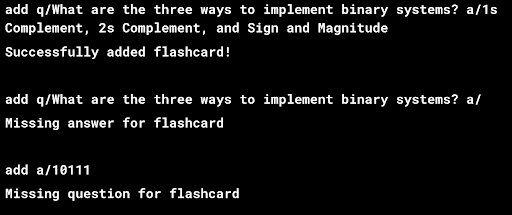
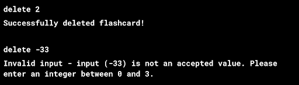
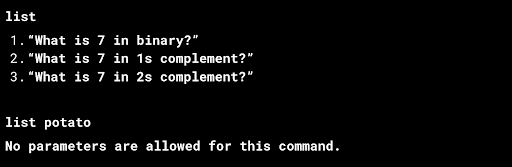
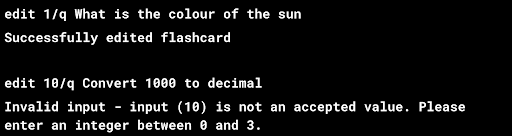
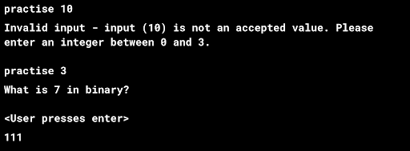

lesSOn is a **flashcard software aimed to help individuals with their memory work in school, optimized for use via a Command Line Interface (CLI)** while still having the benefits of a Graphical User Interface (GUI). If you can type fast, lesSon can get your contact management tasks done faster than traditional GUI apps.
 
* Table of Contents
{:toc}

--------------------------------------------------------------------------------------------------------------------

## Feature List

### Adding a Flashcard `add`
Adds a flashcard to the deck.

Format: `add q/question a/answer [t/TAG]​`

**Tip**: Tagging is not supported in v1.2 and earlier

Examples:

```
- add q/What are the three ways to implement binary systems? a/1s Complement, 2s Complement, and Sign and Magnitude

- add q/How do you convert from binary to 1s Complement? a/By inverting all the bits, i.e. 0 to 1 and vice versa t/CS2100 t/Number Systems
```

#### Acceptable values for each parameters:
1. No Empty Input after q/, a/ and t/.
#### Expected outputs:
```
1. add q/What are the three ways to implement binary systems? a/1s Complement, 2s Complement, and Sign and Magnitude
“Successfully added flashcard!” message will be returned to the user via the CLI

2. add q/What are the three ways to implement binary systems? a/
”Missing answer for flashcard” error message will be returned to the user via the CLI

3. add a/10111
”Missing question for flashcard” error message will be returned to the user via the CLI
```
#### MockUp



### Deleting a Flashcard : `delete`
Deletes the flashcard in the deck

Format: `delete INDEX`
Examples:
```
- delete 2
 (deletes the 2nd flashcard in the deck)
```

#### Acceptable values for each parameters:
1. Index must be positive integer
2. Index cannot exceed size of the deck

#### Expected outputs:
```
1. delete 2
“Successfully deleted flashcard!” message will be returned to the user via the CLI

2. delete -100
“Invalid input - input (<input>) is not an accepted value. Please enter an integer between 0 and deck.lenght()” message will be displayed on error.
```
#### Mockup:



### View All Flashcards : `list`
Shows a list of all flashcards in the deck.

Format: `list`
Examples:
```
list shows the full list of flashcards.
```

#### Acceptable values for each parameters:
No parameters are needed

#### Expected output:
```
1. list
   (Questions to all the flashcards that are added with their index)
 
2. list potato
   “No parameters are allowed for this command.”
```

#### Mockup


### Editing a specific Flashcard : `edit`
Edits an existing person in the address book.

Format: `edit index/(q/a) (question/answer)`

Examples:
```
1. edit 1/q What is the colour of the sun changes the question at index 1 to “What is the colour of the sun”
2. edit 1/a Red changes the answer at index 1 to “Red”
```
#### Expected output:
```
“Successfully edited flashcard” message will be returned to the user via the CLI
“Invalid input - input (<input>) is not an accepted value. Please enter an integer between 0 and deck.length()” message will be displayed on error.
```
#### Mockup:



### Practise Flashcards: `practise`
Practise a single Flashcard in the deck

Format: `practise INDEX`

#### Acceptable values for each parameters:
1. Index must be positive integer
2. Index cannot exceed size of the deck

#### Examples:
```
practise 1 displays the question of the card of index 1, click enter to reveal the answer
(Practise the Flashcard at the specified INDEX. The index refers to the index number shown in the displayed deck. ​))
```
#### Expected outputs:
```
displays the question of the card of index (<input>), click enter to reveal the answer
“Invalid input - input (<input>) is not an accepted value. Please enter an integer between 0 and deck.length()” message will be displayed on error.
```

#### Mockup:

