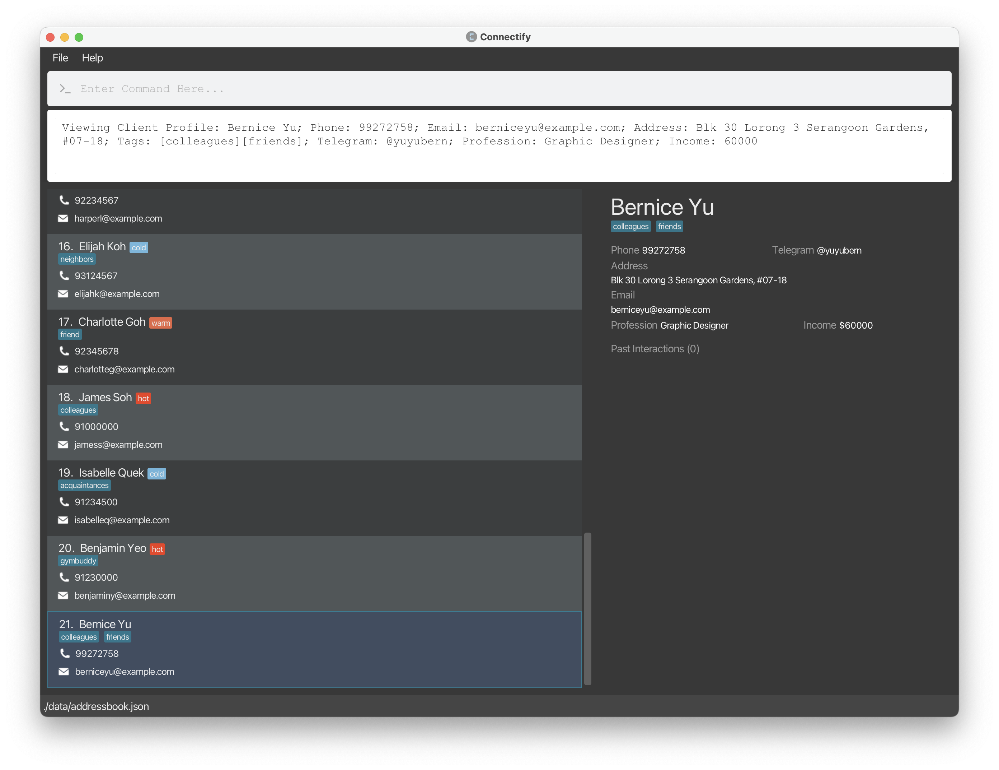
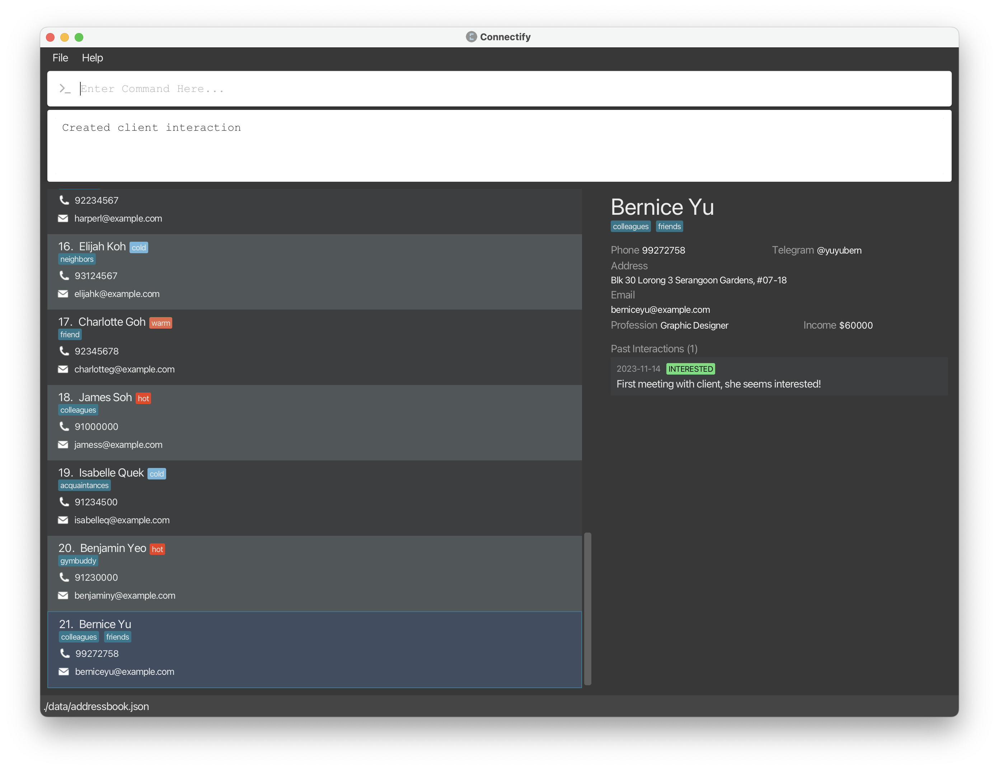
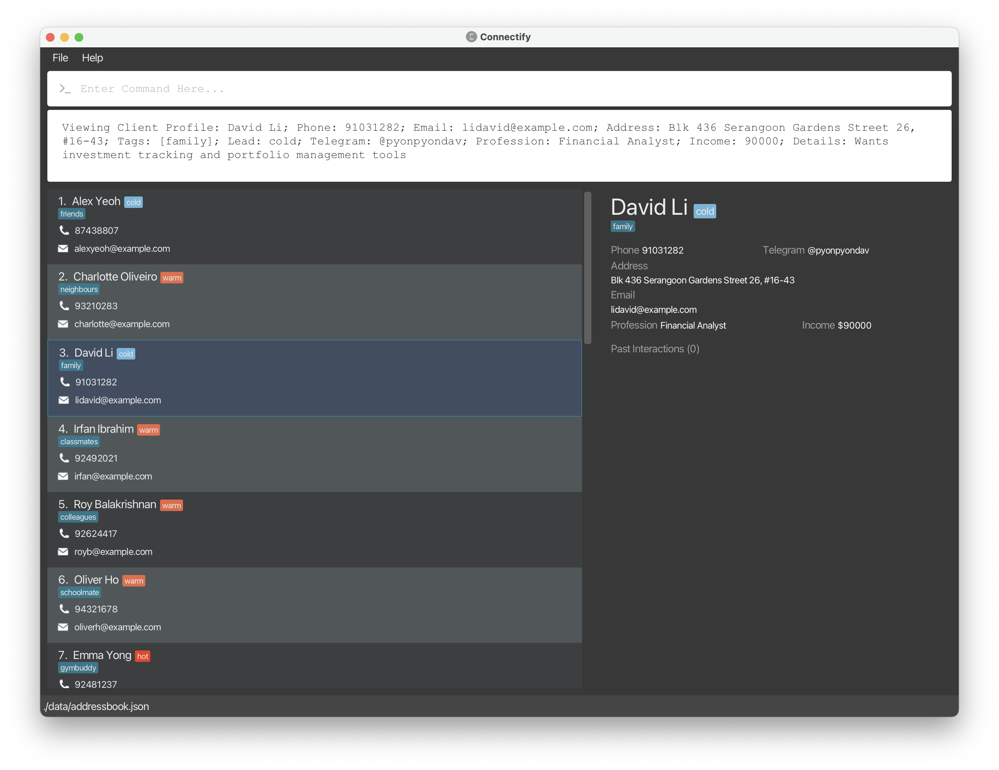
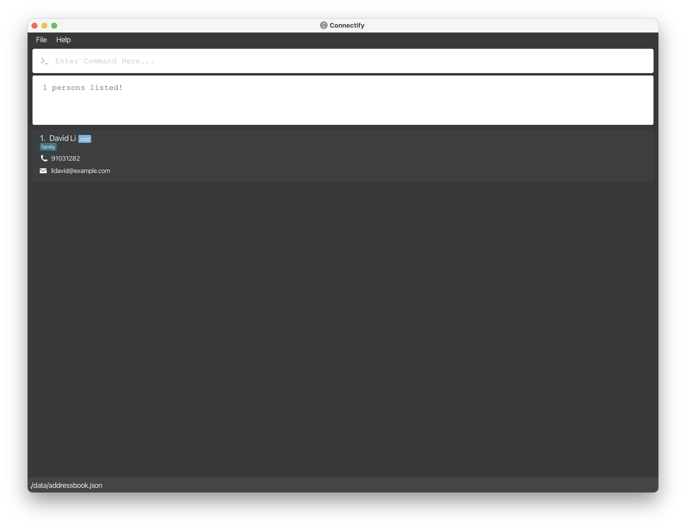
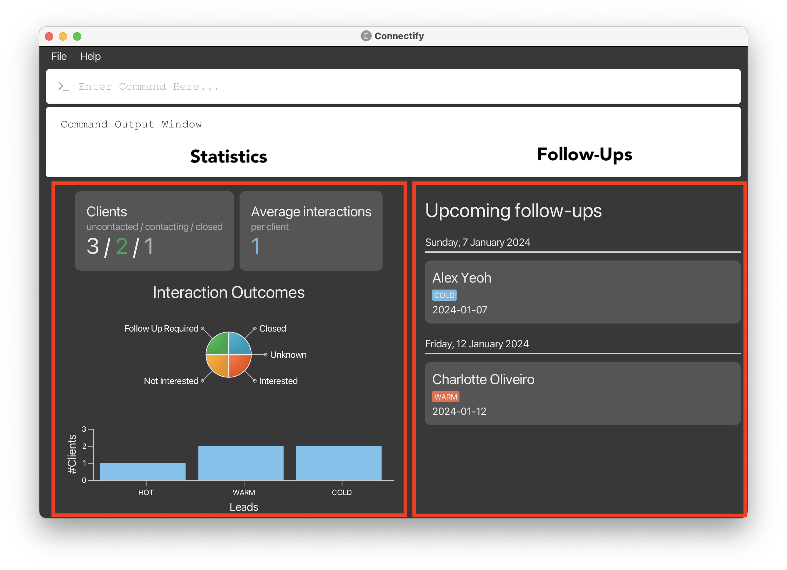

# Welcome to Connectify!


Connectify is a **desktop app for managing clients, optimized for use via a Command Line Interface** (CLI). Connectify helps salespersons manage their clients information records and data, boosting their efficiency in building customer relationships! If you can type fast, Connectify can get your client management tasks done faster than traditional GUI apps.

In this user guide, you will find instructions on how to install Connectify and use its many features to manage your clients.

Choose a topic from the table of contents below to find out how to manage your clients using Connectify!

# Table of Contents
* Table of Contents
{:toc}


--------------------------------------------------------------------------------------------------------------------

# Quick start

1. Ensure that you have Java 11 installed on your Computer.

2. Download the latest `connectify.jar` from our [releases](https://github.com/AY2324S1-CS2103T-F11-4/tp/releases/).

3. Copy the file over to the folder you would want to use as the home folder for Connectify. An option is to create a folder named `Connectify` in your`Desktop` and place the file there.

4. Open the command terminal.
   
    a. For Windows, you can open `Command Prompt` from your list of installed applications.

    b. For macOS and other operating systems, open the `Terminal` app.

5. Change the directory of the terminal by using the `cd` command.

    a. For example, if you saved your file at `C:\Users\John\Desktop\Connectify\connectify.jar`, run the command `cd C:\Users\John\Desktop\Connectify` in your terminal.

6. Run `java -jar connectify.jar` to start the application.

7. A window similar to the one below should appear in a few seconds, containing sample data.

   <figure>
       
       <figcaption align="center">
           <em>The GUI you see on start-up may be slightly different due to differences in data.</em>
       </figcaption>
   </figure>
   <br>
   
8. Type the command in the command box and press `Enter` to execute it.
   
   Some examples you can try:

   - `list`: Lists all client profiles.
   
   - `create n/John Doe p/98765432 e/johnd@example.com a/John street, block 123, #01-01`: Creates a client named `John Doe` in the client list.
   
   - `delete 3`: Deletes the 3rd contact currently shown in the displayed client list.
   
   - `exit`: Exits the app.

9. Refer to [Features](#features) below for more commands and details for each command.

[↑ Back to Table of Contents](#table-of-contents)

--------------------------------------------------------------------------------------------------------------------

# ***If you're new***: What are Commands?

Commands start with a command word.

  - e.g. In `create n/John Doe...` example gave above, `create` is the command word. 

Other command words are `lead`, `edit` and `view`.

Sometimes these commands require additional information, as we see in the case above we have to specify the name of the client we want to create. These are done through ***parameters***.

***Parameters*** are additional information to be supplied by the user.

- e.g. in `n/NAME`, `NAME` is a parameter which can be used as `n/John Doe`.

For most commands, to input parameters in, they have to be prefixed by ***flags***.
Flags are indicators to differentiate various parts of the command. They follow the format of a `<letter>` followed by a `/`.

 - e.g. in `n/NAME`, `n/` is the flag for the `NAME` parameter.

[↑ Back to Table of Contents](#table-of-contents)

--------------------------------------------------------------------------------------------------------------------

# Reading the examples in this user guide

The examples in this guide are formatted with the following conventions:
* **Command** - The command to be typed into the command box.

* **Command word** - Words that specify the type of command to be executed. Written in ***bold italics***, always at the start of a line.

* **Flags** - Indicators to differentiate various parts of the command. It takes the format `$/` followed by a **Parameter**. The `$` varies depending on the type of flag.

    e.g. `o/` in ***interaction*** command specifies the **Outcome** of the interaction, while `l/` in ***edit*** command specifies the **Lead** of the client.

* **Parameters** - Component of the command that usually follows a **Flag**. In this guide, parameters are given in `UPPER_CASE`.

    e.g. `INDEX` following an ***edit*** command specifies the index of the client to be edited.

<div markdown="block" class="alert alert-info">

**:information_source: Technical notes about commands**<br>

- Commands, flags and parameters are case-sensitive, unless otherwise specified.
  
- Items in square brackets are optional.

   e.g. `n/NAME [tg/TELEGRAM]` can be used as `n/John Doe tg/@johndoe` or as `n/John Doe`.

- Items with `...` after them can be repeated any number of times, including zero.

   e.g. `[t/TAG]...` can be used as ` ` (0 times), `t/friend`, or `t/friend t/neighbour`, while
`n/NAME` has to be used exactly once.

- Parameters can be entered in any order.

   e.g. If the command specifies its parameters as `n/NAME p/PHONE`, `p/PHONE n/NAME` is also acceptable.

- Extraneous parameters for commands that do not take in parameters will be ignored.

    e.g. The ***list*** command does not take in any parameters. If the command `list 123` is entered, it will be interpreted as `list`.

<div>

[↑ Back to Table of Contents](#table-of-contents)

--------------------------------------------------------------------------------------------------------------------

# Features

## Viewing help: ***help***

Shows a message explaining how to access the user guide.

<figure>
    
    <figcaption align="center">
        <em>Pop-up message that appears after running help.</em>
    </figcaption>
</figure>

## Adding

### Adding a client profile: ***create***

Your job as a salesperson starts with adding a client profile to Connectify. This is a one-time process for each client that has been made simple for you.
Use the ***create*** command to add a client profile.

**Format**
```text
create n/NAME p/PHONE e/EMAIL a/ADDRESS [t/TAG]... [tg/TELEGRAM]
[pf/PROFESSION] [i/INCOME] [d/DETAILS]
```

<div markdown="block" class="alert alert-info">

**:information_source: Unique profiles**<br>

Connectify checks for the uniqueness of a profile by its `NAME`. It doesn't allow you to create two profiles with the same name. If you happen to have two clients with the exact same name, we suggest differentiating them by adding some notes in brackets!

e.g. `John Doe (Company A)` vs `John Doe (Company B)`

</div>

**Example**
```text
create n/Bernice Yu p/99272758 e/berniceyu@example.com 
a/Blk 30 Lorong 3 Serangoon Gardens, #07-18 t/colleagues 
t/friends tg/@yuyubern pf/Graphic Designer i/60000
```

<figure>
    
    <figcaption align="center">
        <em>Result of executing the above create command: Bernice Yu's profile is at index 7. Indices may be different.</em>
    </figcaption>
</figure>
<br>

You should directly see the client profile added to the list of clients in the application window. After adding a client profile, you can now perform various operations on the client profile as specified in the next few sections!

[↑ Back to Table of Contents](#table-of-contents)

### Adding a client interaction: ***interaction***

After adding a client profile, their information is now recorded and easily accessible for you to contact them!
After contacting them, you may also want a way to log your interactions with the client. 
Use the ***interaction*** command when you want to record down an interaction you had with a client.

**Format**
```text
interaction INDEX o/OUTCOME [DETAILS]
```

<div markdown="block" class="alert alert-info">

**:information_source: Notes about the interaction command**<br>

- At least one of the `OUTCOME` or `DETAILS` parameters must be provided.

- `OUTCOME` must be one of the following: `INTERESTED`, `NOT_INTERESTED`, `CLOSED`, `UNKNOWN`.

- `OUTCOME` is case insensitive.

</div>

**Example**
```
interaction 7 o/INTERESTED First meeting with client, she seems interested!
```

<figure>
    
    <figcaption align="center">
        <em>There are initially no past interactions for Bernice Yu's profile.</em>
    </figcaption>
</figure>

<figure>
    
    <figcaption align="center">
        <em>Result of adding an interaction for Bernice Yu's profile.</em>
    </figcaption>
</figure>
<br>

You should directly see the interaction added to the client profile in the application window.

[↑ Back to Table of Contents](#table-of-contents)

--------------------------------------------------------------------------------------------------------------------

## Viewing

Sometimes, you may want to view the details of a client profile or the interactions you have had with a client to quickly catch up before contacting them.

This section contains multiple commands that allow you to view various details of your clients that is collated in a single view for your convenience.

### Viewing the list of clients: ***list***

From the Dashboard page, you may wish to see a comprehensive list of your clients. 
Use the ***list*** command to view all clients.

**Format**
```text
list
```

<figure>
    
    <figcaption align="center">
        <em>The client list view. Data shown may vary.</em>
    </figcaption>
</figure>
<br>

You should then see the list of clients in the application window.

[↑ Back to Table of Contents](#table-of-contents)

### Viewing the full details of a client: ***view***

Catching up on the details of a client before contacting them is important. Most of the time, remembering the details of previous interactions with a client is difficult as the data is scattered everywhere.

Connectify gives you the powerful ***view*** command to view the full details of a client profile in a single view.

**Format**
```text
view INDEX
```

<div markdown="block" class="alert alert-info">

**:information_source: Notes about the view command**<br>

`INDEX` refers to the index of the client profile in the displayed list of clients.

</div>

**Example**
```text
view 4
```

<figure>
    
    <figcaption align="center">
        <em>The client list view. Note that David's profile is at index 4.</em>
    </figcaption>
</figure>
<br>

<figure>
    
    <figcaption align="center">
        <em>Result of executing the above view command: David's profile details are shown.</em>
    </figcaption>
</figure>
<br>

[↑ Back to Table of Contents](#table-of-contents)

### Finding a client by name: ***find***

Managing a large client list can be difficult. Sometimes their index on the list can be hard to remember and this could affect your experience keying in certain commands. Don't worry though, we have a solution for you! The ***find*** command allows you to search for a client by name, and you use this client's index (usually 1) in other commands.

**Format**
```text
find NAME
```

<div markdown="block" class="alert alert-info">

**:information_source: Notes about the find command**<br>

You need to type either the **first**, **middle** or **last** name of the client. You cannot type a partially spelt name!

</div>

**Example**
```text
find David
```

<figure>
    
    <figcaption align="center">
        <em>The client list view. Data shown may vary.</em>
    </figcaption>
</figure>
<br>

<figure>
    
    <figcaption align="center">
        <em>Result of executing the above find command: David's profile is found at index 1. Indices may be different.</em>
    </figcaption>
</figure>
<br>

[↑ Back to Table of Contents](#table-of-contents)

### Viewing the dashboard: ***dashboard***

To keep track of a broad view of statistics of your clients, Connectify provides you with the ***dashboard*** command.
Use the ***dashboard*** command to view a summarised information of all your clients and their interactions with you in a single place.
This page also shows you upcoming follow-ups that you have to do.

**Format**
````text
dashboard
````

You should see the following dashboard view in the application window.

<figure>
   
   <figcaption align="center">
       <em>The dashboard view. Data shown may vary.</em>
   </figcaption>
</figure>
<br>

On the left, we have Connectify's statistics which shows:

1. Uncontacted / Contacted / Closed clients
2. Average interactions amongst all clients
2. Breakdown of the different interaction outcomes
3. Number of HOT / WARM / COLD leads

On the right, we have the follow-ups section which shows upcoming follow-ups. Follow-up dates are determined automatically by the latest interaction date and the lead of the client.

<details>
<summary>Detailed explanation of follow-up calculation</summary>
<br>
The follow up date is calculated by the day of last interaction plus a follow-up period, determined by lead type as shown:

| LeadType | Follow-Up Time |
|----------|----------------|
| HOT      | 1 week         |
| WARM     | 4 weeks        |
| COLD     | 8 weeks        |
| UNKNOWN  | 4 weeks        |


Say your last interaction with John is on 1st Jan 2021 and he is a HOT lead. The follow-up date will be 1 week after 1st Jan 2021, which is 8th Jan 2021. 
</details>

[↑ Back to Table of Contents](#table-of-contents)

--------------------------------------------------------------------------------------------------------------------

## Editing

### Editing a client profile: ***edit***

Each different client may be marked with different lead (hot, warm, cold) that may change over time.
Not only that, you might find yourself needing to update the details of a client profile. Use the command ***edit*** to edit the specified client profile in your client list.

**Format**
```text
edit INDEX [n/NAME] [p/PHONE] [e/EMAIL] [a/ADDRESS] [t/TAG]... [l/LEAD] 
[tg/TELEGRAM] [pf/PROFESSION] [i/INCOME] [d/DETAILS]
```

Note that at least one of the optional parameters must be provided.

Example
1. `edit 1 l/HOT`
2. `edit 2 e/berniceyu@gmail.com p/123456789`
3. `edit 3 t/buddies t/relatives`

<figure>
    
    <figcaption align="center">
        <em>Initial state of 4 contacts.</em>
    </figcaption>
</figure>

<figure>
    
    <figcaption align="center">
        <em>Result of running commands (1) to (3).</em>
    </figcaption>
</figure>
<br>

<div markdown="block" class="alert alert-warning">

**:bulb: Clearing all tags of a particular client**<br>

You can use the ***edit*** command to clear all tags of a client by supplying an empty tag parameter! For example, if you wish to clear the tags of a client at index 4, you can use `edit 4 t/`.

</div>

[↑ Back to Table of Contents](#table-of-contents)

### Editing a single field

We understand the edit command can be a little tedious to use if you only want to edit a single field of a client profile. Hence, we have provided a shortcut for you to edit a single field of a client profile.

This command is special because it's command word is the same as the field you want to edit. For example, if you want to edit the name of a client profile, you can use the ***name*** command.

**Format**
```text
FIELD INDEX NEW_VALUE
```

Example

1. `name 1 John Doe`
2. `email 2 johndoe@example.com`

The first will edit the name of the client at index 1 to `John Doe`.
The second will edit the email of the client at index 2 to `johndoe@example.com`.

<div markdown="block" class="alert alert-info">

**:information_source: Notes about the edit commands**<br>
This does not work for tags and interactions.
</div>

[↑ Back to Table of Contents](#table-of-contents)

--------------------------------------------------------------------------------------------------------------------

## Deleting

### Deleting a client profile: ***delete***

Keep the list of clients in Connectify clean by deleting client profiles that are no longer relevant.

Deleting a client profile is easy with the ***delete*** command.

**Format**
```text
delete INDEX
```

**Example**
```
delete 1
```

[↑ Back to Table of Contents](#table-of-contents)

--------------------------------------------------------------------------------------------------------------------

# Miscellaneous Notes

## Command history
You can use the up arrow key <kbd>&uarr;</kbd> to view your past commands and press <kbd>Enter</kbd> to execute them again.

## `INCOME` Parameter

Incomes must only consist of numerical inputs. Connectify does not yet support:
* Decimal values `600.50`
* Currencies `10000 USD`
* Other non-numeric input e.g. `10,000`

--------------------------------------------------------------------------------------------------------------------

# FAQ

**Q**: How do I save my progress?
<br>
**A**: Your progress is saved after every command.

**Q**: How do I transfer my data to another computer?
<br>
**A**: Download Connectify on the other computer and overwrite the data folder it creates with the data folder of your previous Connectify home folder.

[↑ Back to Table of Contents](#table-of-contents)

--------------------------------------------------------------------------------------------------------------------

# Known issues 

--------------------------------------------------------------------------------------------------------------------

# Command summary

| Action              | Format                                                                                                            | Example                                                                                                                                                              |
|---------------------|-------------------------------------------------------------------------------------------------------------------|----------------------------------------------------------------------------------------------------------------------------------------------------------------------|
| Help                | `help`                                                                                                            | `help`                                                                                                                                                               |
| Add Client          | `create n/NAME p/PHONE e/EMAIL a/ADDRESS [t/TAG] [tg/TELEGRAM] [pf/PROFESSION] [i/INCOME] [d/DETAILS]`            | `create n/Bernice Yu p/99272758 e/berniceyu@example.com a/Blk 30 Lorong 3 Serangoon Gardens, #07-18 t/colleagues t/friends tg/@yuyubern pf/Graphic Designer i/60000` |
| Add Interaction     | `interaction INDEX o/OUTCOME [DETAILS]`                                                                           | `interaction 1 o/INTERESTED d/Client is interested in our products`                                                                                                  |
| View Dashboard      | `dashboard`                                                                                                       | `dashboard`                                                                                                                                                          |                                                                                                                                                        |
| View Client List    | `list`                                                                                                            | `list`                                                                                                                                                               |
| Find Client         | `find NAME`                                                                                                       | `find Chemmy`                                                                                                                                                        |
| View Client Details | `view INDEX`                                                                                                      | `view 1`                                                                                                                                                             |
| Edit Client         | `edit INDEX [n/NAME] [e/EMAIL] [a/ADDRESS] [t/TAG] [l/LEAD] [tg/TELEGRAM] [pf/PROFESSION] [i/INCOME] [d/DETAILS]` | `edit 2 e/berniceyu@gmail.com p/123456789`                                                                                                                           |
| Delete Client       | `delete INDEX`                                                                                                    | `delete 1`                                                                                                                                                           |
| Exit                | `exit`                                                                                                            | `exit`                                                                                                                                                               |

[↑ Back to Table of Contents](#table-of-contents)
