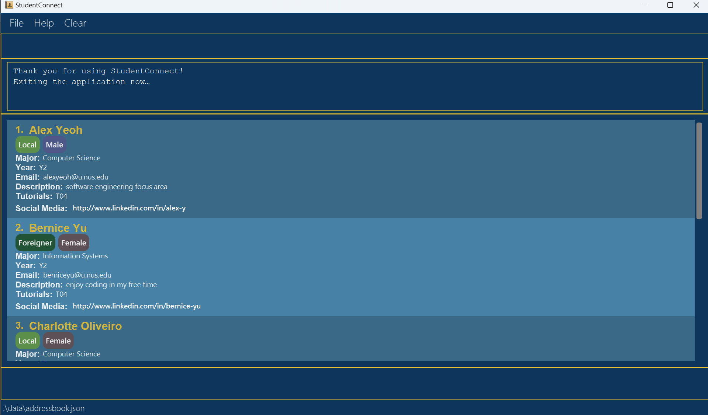

HouR is a **desktop app for managing employee records, optimized for use via a Command Line Interface** (CLI) while still having the benefits of a Graphical User Interface (GUI). If you can type fast, HouR can get your HR management tasks done faster than traditional GUI apps.

* Table of Contents
{:toc}

--------------------------------------------------------------------------------------------------------------------

## Quick start

1. Ensure you have Java `11` or above installed in your Computer.

1. Download the latest `hour.jar` from [here](https://github.com/AY2324S1-CS2103T-W12-1/tp/releases).

1. Copy the file to the folder you want to use as the _home folder_ for your employee list.

1. Open a command terminal, `cd` into the folder you put the jar file in, and use the `java -jar hour.jar` command to run the application. 
   A GUI similar to the below should appear in a few seconds. Note how the app contains some sample data. 
   

1. Type the command in the command box and press Enter to execute it. e.g. typing **`help`** and pressing Enter will open the help window. 
   Some example commands you can try:

   * `list` : Lists all contacts.

   * `add n/John Doe p/Senior Software Enginner id/EID2023-7890` : Adds an employee named `John Doe` to the employee list.

   * `delete 3` : Deletes the 3rd contact shown in the current list.

   * `clear` : Deletes all contacts.

   * `exit` : Exits the app.

1. Refer to the [Features](#features) below for details of each command.

--------------------------------------------------------------------------------------------------------------------

## Features

**:information_source: Notes about the command format:** 

* Words in `UPPER_CASE` are the parameters to be supplied by the user. 
  e.g. in `add n/NAME`, `NAME` is a parameter which can be used as `add n/John Doe`.

* Items in square brackets are optional. 
  e.g `edit INDEX [n/NAME] [p/POSITION] [id/EMPLOYEE_ID]` can be used as `edit 1 n/John Doe` or as `edit 1 p/Software Engineer`.

* Parameters can be in any order. 
  e.g. if the command specifies `n/NAME p/POSITION`, `p/POSITION n/NAME` is also acceptable.

* Extraneous parameters for commands that do not take in parameters (such as `help`, `list`, `exit` and `clear`) will be ignored. 
  e.g. if the command specifies `help 123`, it will be interpreted as `help`.

* If you are using a PDF version of this document, be careful when copying and pasting commands that span multiple lines as space characters surrounding line-breaks may be omitted when copied over to the application.

### Viewing help : `help`

Shows a message explaning how to access the help page.

Format: `help`

### Adding an employee: `add`

Adds an employee to the employee list.

Format: `add n/NAME p/POSITION id/EMPLOYEE_ID`

Examples:
* `add n/John Doe p/Senior Software Enginner id/EID2023-7890`
* `add n/Jane Doe p/Manager id/EID2023-7891`

### Listing all persons : `list`

Shows a list of all persons in the address book.

Format: `list`

### Editing an employee : `edit` [coming soon]

Edits an existing employee in the employee list.

Format: `edit INDEX [n/NAME] [p/POSITION] [id/EMPLOYEE_ID]`

* Edits the employee at the specified `INDEX`. The index refers to the index number shown in the displayed employee list. The index **must be a positive integer** 1, 2, 3, …​
* At least one of the optional fields must be provided.
* Existing values will be updated to the input values.

Examples:
*  `edit 1 p/Software Engineer` Edits the position of the 1st person to be `Software Engineer`.
*  `edit 2 n/Janelle Doe t/` Edits the name of the 2nd person to be `Janelle Doe`.

### Locating persons by name: `find`

Finds persons whose names contain any of the given keywords.

Format: `find KEYWORD [MORE_KEYWORDS]`

* The search is case-insensitive. e.g `hans` will match `Hans`
* The order of the keywords does not matter. e.g. `Hans Bo` will match `Bo Hans`
* Only the name is searched.
* Only full words will be matched e.g. `Han` will not match `Hans`
* Persons matching at least one keyword will be returned (i.e. `OR` search).
  e.g. `Hans Bo` will return `Hans Gruber`, `Bo Yang`

Examples:
* `find John` returns `john` and `John Doe`
* `find alex david` returns `Alex Yeoh`, `David Li` 
  

### Deleting a person : `delete`

Deletes the specified person from the address book.

Format: `delete INDEX`

* Deletes the person at the specified `INDEX`.
* The index refers to the index number shown in the displayed person list.
* The index **must be a positive integer** 1, 2, 3, …​

Examples:
* `list` followed by `delete 2` deletes the 2nd person in the address book.
* `find Betsy` followed by `delete 1` deletes the 1st person in the results of the `find` command.

### Clearing all entries : `clear`

Clears all entries from the address book.

Format: `clear` 

### Exiting the program : `exit`

Exits the program.

Format: `exit`

### Saving the data

HouR data are saved in the hard disk automatically after any command that changes the data. There is no need to save manually.

### Editing the data file

HouR data are saved automatically as a JSON file `[JAR file location]/data/hour.json`. Advanced users are welcome to update data directly by editing that data file.

:exclamation: **Caution:**
If your changes to the data file makes its format invalid, HouR will discard all data and start with an empty data file at the next run. Hence, it is recommended to take a backup of the file before editing it.

### Archiving data files `[coming in v2.0]`

_Details coming soon ..._

--------------------------------------------------------------------------------------------------------------------

## FAQ

**Q**: How do I transfer my data to another Computer? 
**A**: Install the app in the other computer and overwrite the empty data file it creates with the file that contains the data of your previous HouR home folder.

--------------------------------------------------------------------------------------------------------------------

## Known issues

1. **When using multiple screens**, if you move the application to a secondary screen, and later switch to using only the primary screen, the GUI will open off-screen. The remedy is to delete the `preferences.json` file created by the application before running the application again.

--------------------------------------------------------------------------------------------------------------------

## Command summary

Action | Format, Examples
--------|------------------
**Add** | `add n/NAME p/POSITION id/EMPLOYEE_ID`   e.g., `add n/James Ho p/Auditor id/EID2023-0928`
**Clear** | `clear`
**Delete** | `delete INDEX`  e.g., `delete 3`
**Edit** | `edit INDEX [n/NAME] [p/POSITION] [id/EMPLOYEE_ID]`  e.g.,`edit 2 n/James Lee p/Head Auditor`
**Find** | `find KEYWORD [MORE_KEYWORDS]`  e.g., `find James Jake`
**List** | `list`
**Help** | `help`
**Exit** | `exit`
