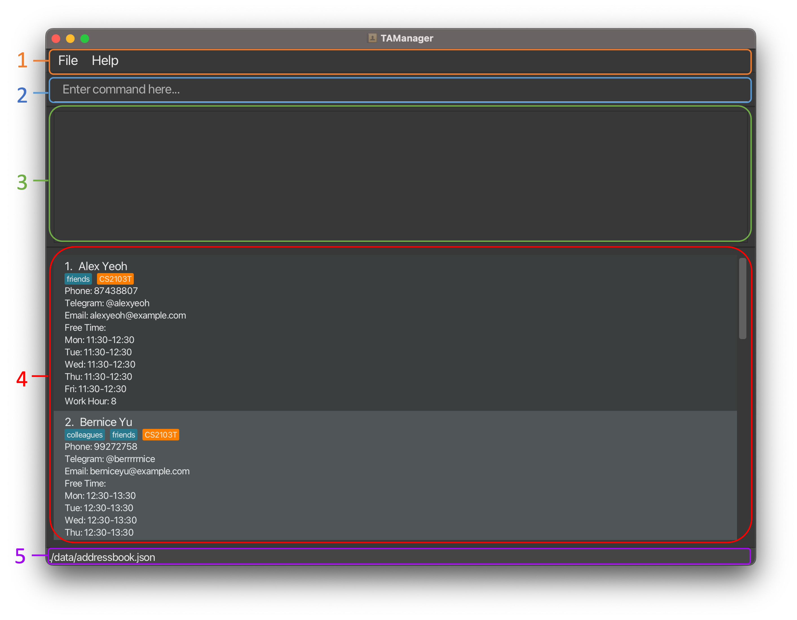
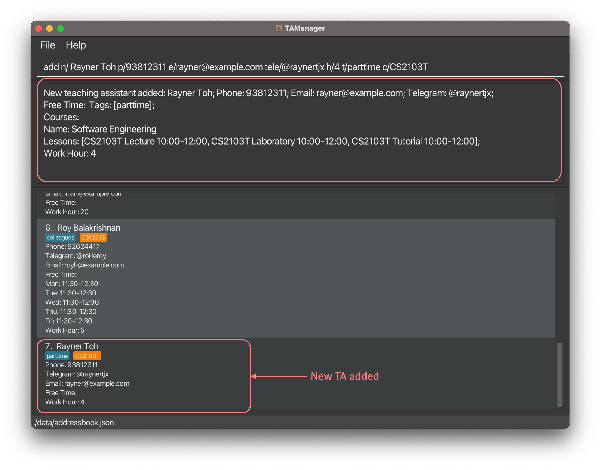
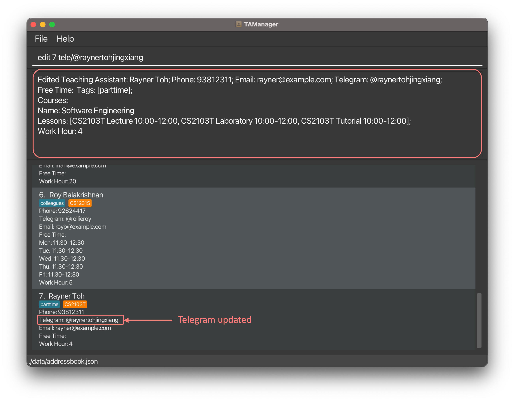
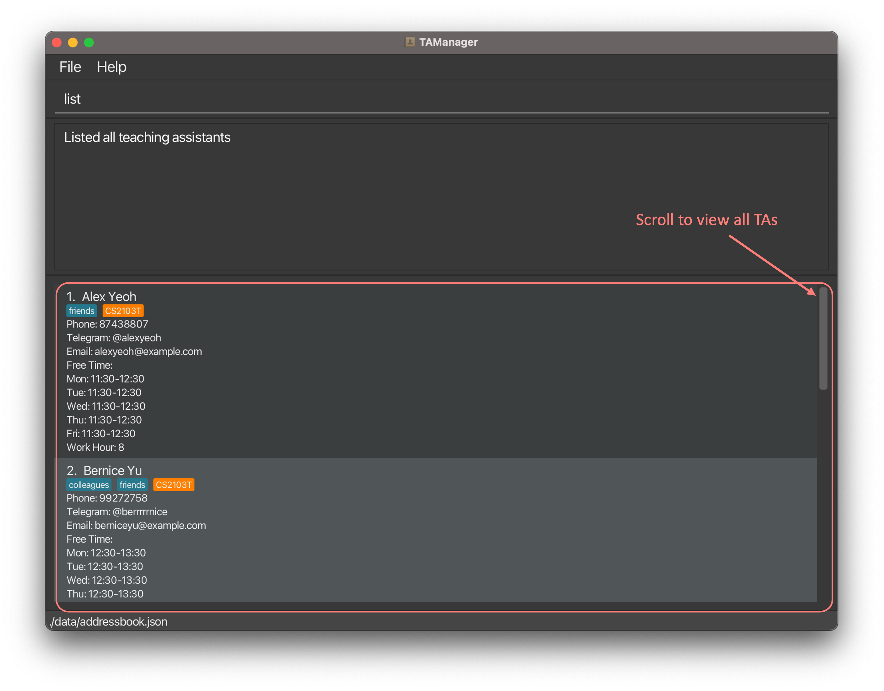
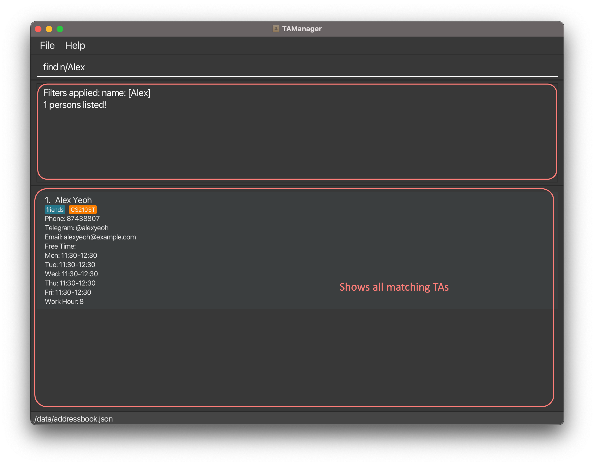
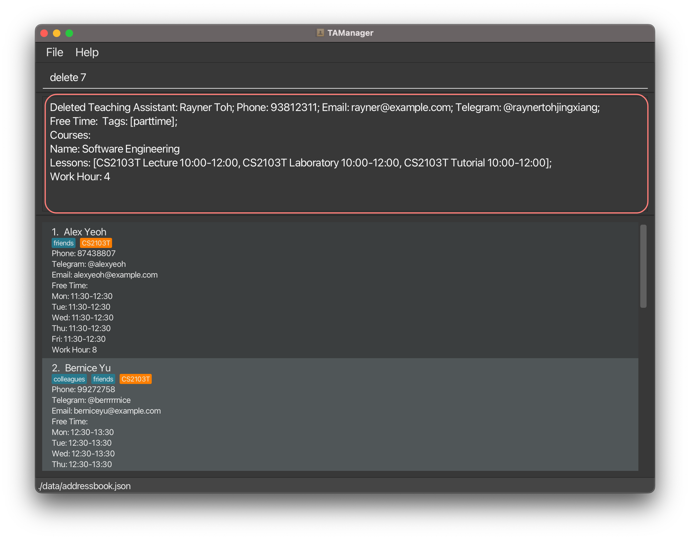
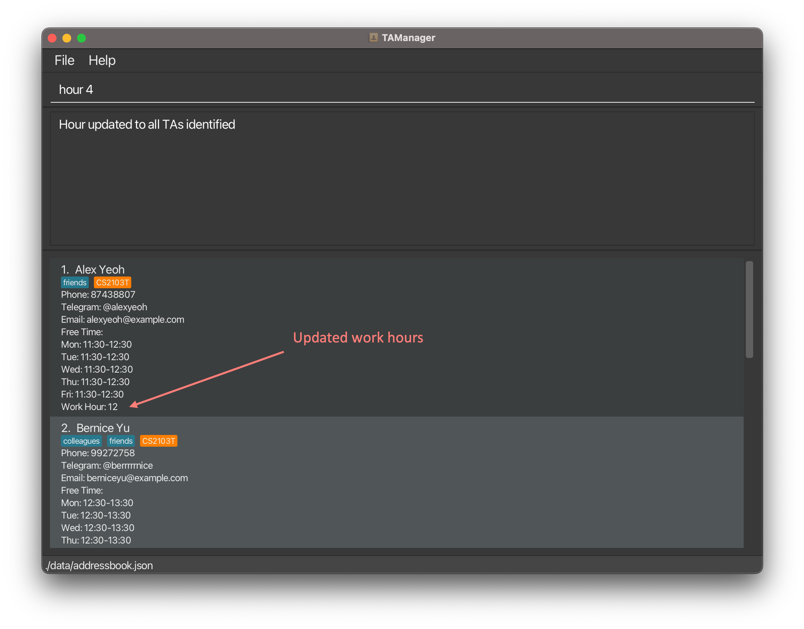
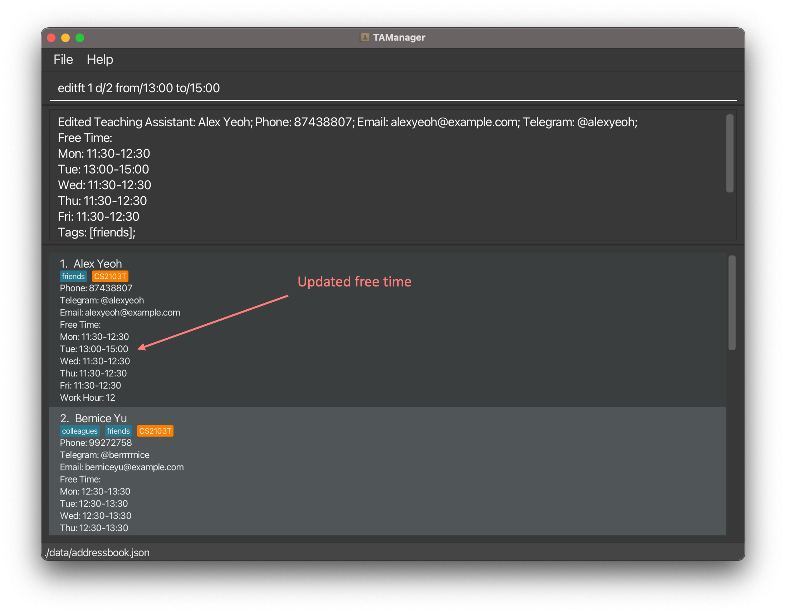
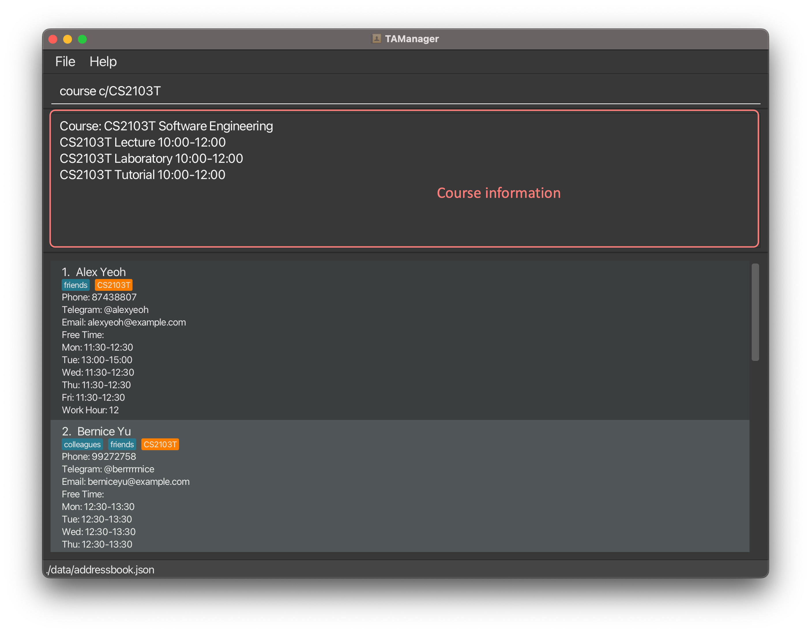
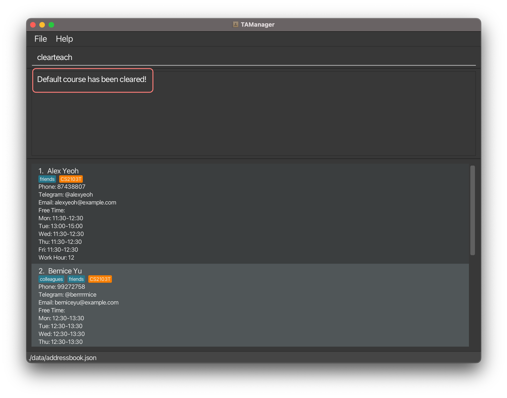

Hello School of Computing (SoC) Professors! Have you ever felt that managing your teaching assistants (TAs) manually is a chore? Do you wish that you could have a tool that helps you manage your TAs more efficiently? 

If so, **TAManager** is the tool for you! 

TAManager, or Teaching Assistant Manager, is your reliable desktop application that helps you manage your TAs, so you can focus on what matters most - **teaching**!

While TAManager is mainly catered to SoC Professors, all educators are welcomed to use TAManager too! With our **user-centric** design, TAManager is crafted with consideration for both new and experienced educators.

Gone are the days of having to manually manage your TAs. TAManager is here to help you manage your TAs with ease!

### 💡 Why choose TAManager?
{:.no_toc}
- **Easy-to-use**: TAManager is optimized for use via a [Command Line Interface (CLI)](#command-line-interface-cli), with all the benefits of a [Graphical User Interface (GUI)](#graphical-user-interface-gui), making it intuitive to use.
- **Efficient**: If you can type fast, TAManager can help you manage your TAs faster than traditional GUI apps, allowing you to save more time.

### 🎉 What can TAManager do for you?
{:.no_toc}
- Effortlessly manage your TAs contact list
- Efficiently track the total working hours of your TAs
- Conveniently find replacement for your absent TAs

<br/>

Don't let the stress of administrative work affect your teaching quality.

Let TAManager handles all your TA management needs, while you power up your lectures and tutorials with your teaching prowess!

---

## Using this Guide

Whether you're a new user or an experienced one, this guide is designed to help you make the most of TAManager.
Follow the instructions below based on your familiarity with TAManager.

- **New Users:** If you're just getting started, we recommend beginning with the [Quick Start](#quick-start) section. This will provide you with a comprehensive introduction to TAManager's essential features.

- **Experienced Users:** If you are an experienced user of TAManager, you can use the [Table of Contents](#table-of-contents) to quickly navigate to specific sections of interest. If you're looking for a quick reference, the [Command Summary](#command-summary) provides an overview of the command syntax.

Throughout our guide, you will see the following annotations:

| Annotation                         | Meaning                                                                                    |
|------------------------------------|--------------------------------------------------------------------------------------------|
| [Text in blue](javascript: void)   | Clicking on the highlighted text will bring you to the relevant section of the user guide. |
| `Text with light blue background`  | These represent inputs by you, or outputs from your machine.                               |

<br/>

---

## Table of Contents
* Table of Contents
{:toc}

<br/>

---

## Quick Start

1. Ensure you have **Java 11** or above installed on your computer. To check, run the command `java -version` in the terminal.

2. Download the latest `TAManager.jar` from [here](https://github.com/AY2324S1-CS2103T-T10-1/tp/releases).

3. Copy the file to the folder you want to use as the home folder for your Teaching Assistant Manager.

4. Open a command terminal, `cd` into the folder where you placed the jar file, and use the `java -jar TAManager.jar` command to run the application.
   A GUI similar to the one below should appear in a few seconds. Note how the app contains some sample data.
   

5. Type a command in the command box and press Enter to execute it. For example, typing `help` and pressing Enter will open the help window.
   Here are some more example commands you can try:

   - `list`: Lists all teaching assistants.
   - `add n/Snowball p/98765432 e/snowball@example.com tele/@snowball t/fulltime c/CS1231S h/10`: Adds a teaching assistant named Snowball to the list.
   - `edit 1 n/Napoleon p/23456789`: Edits the name and phone number of the 1st teaching assistant shown in the current list.
   - `delete 3`: Deletes the 3rd teaching assistant shown in the current list.
   - `exit`: Exits the app.

6. Refer to the following sections below for details on each command.
   - [TA Management Commands](#1-ta-management-commands)
   - [Course Management Commands](#2-course-management-commands)
   - [Utility Commands](#3-utility-commands)

7. You're all set! Use the `clear` command to clear the sample data and embark on your journey with TAManager!

<span style="display: flex; justify-content: right; font-size: 0.8em;">[BACK TO TOP](#table-of-contents)</span>

--------------------------------------------------------------------------------------------------------------------


## Command Format

<div markdown="block" class="alert alert-info">

**:information_source: Notes about the command format:**<br>

* Words in `UPPER_CASE` are parameters to be supplied by the user.<br>
  e.g. in `add n/NAME`, `NAME` is a parameter which can be used as `add n/John Doe`.

* Items in square brackets are optional.<br>
  e.g. `n/NAME [t/TAG]` can be used as `n/John Doe t/fulltime` or as `n/John Doe`.

* Items with `…`​ after them can be used multiple times including zero times.<br>
  e.g. `[t/TAG]…​` can be used as ` ` (i.e. 0 times), `t/fulltime`, `t/student t/year2` etc.

* Parameters can be in any order.<br>
  e.g. if the command specifies `n/NAME p/PHONE_NUMBER`, `p/PHONE_NUMBER n/NAME` is also acceptable.

* Extraneous parameters for commands that do not take in parameters (such as `help`, `list`, `exit` and `clear`) will be ignored.<br>
  e.g. if the command specifies `help 123`, it will be interpreted as `help`.

* If you are using a PDF version of this document, be careful when copying and pasting commands that span multiple lines as space characters surrounding line-breaks may be omitted when copied over to the application.
</div>

<span style="display: flex; justify-content: right; font-size: 0.8em;">[BACK TO TOP](#table-of-contents)</span>

---

## Understanding Our GUI



Here are the various components of TAManager's GUI:
1. Menu Bar: Access the File and Help features.
2. Command Line: Enter commands to execute.
3. Command Result: View the results or error messages of executed commands.
4. Teaching Assistant List: View and manage teaching assistants.
5. Data Storage: View the path where your data is stored.

<span style="display: flex; justify-content: right; font-size: 0.8em;">[BACK TO TOP](#table-of-contents)</span>

--------------------------------------------------------------------------------------------------------------------
## Commands 

## 1. TA Management Commands

### 1.1 Adding a Teaching Assistant: `add`

You can add a new teaching assistant into TAManager, so that you can keep track of the team of teaching assistants you are managing.

##### Format: 
```
add n/NAME p/PHONE e/EMAIL tele/TELEGRAM [h/HOUR] [t/TAG]... [c/COURSE_CODE]...
```

| Fields        | Format                                         | Remarks                                                                                                    |
|---------------|------------------------------------------------|------------------------------------------------------------------------------------------------------------|
| `NAME`        | Alphanumeric string                            | Full name of the teaching assistant                                                                        |
| `PHONE`       | Integer of 3-10 digits                         | Phone number of the teaching assistant                                                                     |
| `EMAIL`       | String in "local-part@domain" format           | Email address of the teaching assistant                                                                    |
| `TELEGRAM`    | String of 5-32 characters that starts with "@" | Telegram handle of the teaching assistant                                                                  |
| `HOUR`        | Integer between 0 and 9999                     | Total working hours of the teaching assistant - defaults to 0 if not provided                              |
| `TAG`         | Alphanumeric string without spaces             | Tag(s) of the teaching assistant                                                                           |
| `COURSE_CODE` | String in valid NUS course code format         | Course code of the course the teaching assistant is teaching and it should be one of the available courses |

##### Example:
- `add n/ Rayner Toh p/93812311 e/rayner@example.com tele/@raynertjx h/4 t/parttime c/CS2103T` adds a new teaching assistant named Rayner Toh to TAManager.


*<center>TAManager adds a new teaching assistant with the corresponding details.</center>*

<div markdown="block" class="command-succeed">
<div class="alert alert-success">
:heavy_check_mark: When the command succeeds:
</div>
```
New teaching assistant added: Rayner Toh; Phone: 93812311; Email: rayner@example.com; Telegram: @raynertjx;
Free Time:  Tags: [parttime];
Courses:
Name: Software Engineering
Lessons: [CS2103T Lecture 10:00-12:00, CS2103T Tutorial 10:00-12:00, CS2103T Laboratory 10:00-12:00];
Work Hour: 4
```
</div>

<div markdown="block" class="command-fail">
<div class="alert alert-danger">
:x: When the command fails:
</div>

| Error                                                        | Resolution                                                       |
|--------------------------------------------------------------|------------------------------------------------------------------|
| `Invalid command format!`                                    | Ensure that all required parameters are present                  |
| `Course not found.`                                          | Ensure that the `COURSE_CODE` is an existing course              |
| `This teaching assistant already exists in the address book` | Ensure that the teaching assistant is not already in TAManager   |
| Invalid parameter                                            | Ensure that input causing the error follows the required format  |

</div>

<span style="display: flex; justify-content: right; font-size: 0.8em;">[BACK TO TOP](#table-of-contents)</span>

### 1.2 Editing a Teaching Assistant: `edit`

You can change the details of an existing teaching assistant in TAManager, so that you can keep the information in your contact list up-to-date.

##### Format: 
```
edit INDEX [n/NAME] [p/PHONE] [e/EMAIL] [tele/TELEGRAM] [h/HOUR] [t/TAG]... [c/COURSE_CODE]...
```

| Fields        | Format                                         | Remarks                                                                                                                |
|---------------|------------------------------------------------|------------------------------------------------------------------------------------------------------------------------|
| `INDEX`       | Positive integer (1, 2, 3, ...)                | Index of the teaching assistant in the TA List to be edited. This index is with reference to the **displayed** TA list |
| `NAME`        | Alphanumeric string                            | Full name of the teaching assistant                                                                                    |
| `PHONE`       | Integer of 3-10 digits                         | Phone number of the teaching assistant                                                                                 |
| `EMAIL`       | String in "local-part@domain" format           | Email address of the teaching assistant                                                                                |
| `TELEGRAM`    | String of 5-32 characters that starts with "@" | Telegram handle of the teaching assistant                                                                              |
| `HOUR`        | Integer between 0 and 9999                     | Total working hours of the teaching assistant                                                                          |
| `TAG`         | Alphanumeric string without spaces             | Tag(s) of the teaching assistant                                                                                       |
| `COURSE_CODE` | String in valid NUS course code format         | Course code of the course the teaching assistant is teaching and it should be one of the available courses             |

<div markdown="block" class="alert alert-info">

**:information_source: Notes:**<br>
- At least one field to edit must be provided.
- After running the `edit` command on a filtered list, the teaching assistant list will be updated to the full list of teaching assistants.
- Editing tags or courses will **overwrite** the existing tags or courses of the teaching assistant.
</div>

##### Example: 
- `edit 7 tele/@raynertohjingxiang` edits the Telegram handle of the 7th person in the list into `@raynertohjingxiang`.


*<center>TAManager edits the Telegram handle of the 7th person in the list.</center>*


<div markdown="block" class="command-succeed">
<div class="alert alert-success">
:heavy_check_mark: When the command succeeds:
</div>
```
Edited Teaching Assistant: Rayner Toh; Phone: 93812311; Email: rayner@example.com; Telegram: @raynertohjingxiang;
Free Time:
Mon: 08:00-12:00
Tue: 08:00-12:00
Wed: 08:00-12:00
Thu: 08:00-12:00
Fri: 08:00-12:00
Tags: [parttime];
Courses:
Name: Software Engineering
Lessons: [CS2103T Lecture 10:00-12:00, CS2103T Tutorial 10:00-12:00, CS2103T Laboratory 10:00-12:00];
Work Hour: 4
```
</div>

<div markdown="block" class="command-fail">
<div class="alert alert-danger">
:x: When the command fails:
</div>

| Error                     | Resolution                                                      |
|---------------------------|-----------------------------------------------------------------|
| `Invalid command format!` | Ensure that all required parameters are present                 |
| `Course not found.`       | Ensure that the `COURSE_CODE` is an existing course             |
| Invalid parameter         | Ensure that input causing the error follows the required format |

</div>

<span style="display: flex; justify-content: right; font-size: 0.8em;">[BACK TO TOP](#table-of-contents)</span>

### 1.3 Viewing Teaching Assistants: `list`

You can view the list of all teaching assistants in TAManager, so that you can conveniently browse through all the teaching assistants you are managing.

##### Format: 
```
list
```


*<center>TAManager shows you the full list of teaching assistants.</center>*


<div markdown="block" class="command-succeed">
<div class="alert alert-success">
:heavy_check_mark: When the command succeeds:
</div>
```
Listed all teaching assistants
```
</div>

<span style="display: flex; justify-content: right; font-size: 0.8em;">[BACK TO TOP](#table-of-contents)</span>

### 1.4 Finding a Teaching Assistant: `find`

You can find specific teaching assistants using various search parameters, so that you can quickly find the specific teaching assistant(s) you are looking for.

##### Format: 
```
find [n/NAME] [c/COURSE_CODE] [d/DAY from/FROM to/TO] [t/TAG]
```

| Fields        | Format                                               | Remarks                                                                                                    |
|---------------|------------------------------------------------------|------------------------------------------------------------------------------------------------------------|
| `NAME`        | String, case insensitive                             | Full name of the teaching assistant                                                                        |
| `COURSE_CODE` | String in valid NUS course code format               | Course code of the course the teaching assistant is teaching and it should be one of the available courses |
| `DAY`         | Integer between 1 and 5                              | Day of the week (Monday-Friday) the teaching assistant is free                                             |
| `FROM`        | String in "HH:mm" format                             | Start time of the free time of the teaching assistant                                                      |
| `TO`          | String in "HH:mm" format                             | End time of the free time of the teaching assistant                                                        |
| `TAG`         | Alphanumeric string without spaces, case *sensitive* | Tag(s) of the teaching assistant                                                                           |

<div markdown="block" class="alert alert-info">

**:information_source: Notes:**<br>
- The name prefix `n/` allows for **multiple keywords** to be used, separated by spaces.
- The course prefix `c/` and free time prefixes `d/ from/ to/` allows for **one keyword** to be used for each prefix.
- To **search by the free time** field, **all three prefixes** `d/ from/ to/` **must be present** and all respective parameters need to be correctly given.
- The search for names and courses are **case-insensitive** (e.g. `alex` will match `Alex`, `cs1231s` will match `CS1231S`).
- The search for tags is **case-sensitive** (e.g. `parttime` will not match `partTime`).
- **Only full words** will be matched (e.g. `Alex` will not match `Alexis`, `cs1231` will not match `cs1231s`).
- You can apply **multiple search filters** to narrow down the search results by **including multiple filters in one command**.
- The search filters are **applied to the full list of TAs**, not the displayed list of TAs.

</div>

##### Examples:
- `find n/Alex` returns all teaching assistants whose names contain `alex` (e.g. `Alex Yeoh`).
- `find n/Alex Bernice` gives all TAs who have either "Alex" or "Bernice" in their names.
- `find c/cs1231s` returns all teaching assistants that are teaching `cs1231s`.
- `find t/parttime` returns all teaching assistants with the `parttime` tag.
- `find n/Alex c/cs1231s` returns all teaching assistants whose names contain `alex` and are teaching `cs1231s`.
- `find d/1 from/10:00 to/12:00` returns all teaching assistants that are free on `Monday` from `10:00` to `12:00`.
- `find c/cs2103t d/1 from/10:00 to/12:00` returns all teaching assistants who are teaching `cs2103t` and are free on `Monday` from `10:00` to `12:00`.


*<center>TAManager finds all teaching assistants whose names contain <code>Alex</code>.</center>*

<div markdown="block" class="command-succeed">
<div class="alert alert-success">
:heavy_check_mark: When the command succeeds:
</div>
```
Filters applied: name: [Alex]
1 persons listed!
```
</div>

<div markdown="block" class="command-fail">
<div class="alert alert-danger">
:x: When the command fails:
</div>

| Error                     | Resolution                                                                                  |
|---------------------------|---------------------------------------------------------------------------------------------|
| `Invalid command format!` | Ensure that there is at least one prefix provided and parameter provided follows the format |

</div>

<span style="display: flex; justify-content: right; font-size: 0.8em;">[BACK TO TOP](#table-of-contents)</span>

### 1.5 Removing a Teaching Assistant: `delete`

You can remove a specified teaching assistant from TAManager, so that you can remove TAs who are no longer part of your teaching team.

##### Format: 
```
delete INDEX
```

| Fields  | Format                          | Remarks                                                                                                                  |
|---------|---------------------------------|--------------------------------------------------------------------------------------------------------------------------|
| `INDEX` | Positive integer (1, 2, 3, ...) | Index of the teaching assistant in the TA List to be deleted. This index is with reference to the **displayed** TA list. |

##### Examples:
- [`list`](#13-viewing-teaching-assistants-list) followed by `delete 2` deletes the second teaching assistant in the address book.
- `find n/Betsy` followed by `delete 1` deletes the first teaching assistant in the results of the [`find`](#14-finding-a-teaching-assistant-find) command.


*<center>TAManager deletes the teaching assistant at index <code>7</code>.</center>*

<div markdown="block" class="command-succeed">
<div  class="alert alert-success">
:heavy_check_mark: When the command succeeds:
</div>
```
Deleted Teaching Assistant: Rayner Toh; Phone: 93812311; Email: rayner@example.com; Telegram: @raynertohjingxiang;
Free Time:
Mon: 08:00-12:00
Tue: 08:00-12:00
Wed: 08:00-12:00
Thu: 08:00-12:00
Fri: 08:00-12:00
Tags: [parttime];
Courses:
Name: Software Engineering
Lessons: [CS2103T Lecture 10:00-12:00, CS2103T Tutorial 10:00-12:00, CS2103T Laboratory 10:00-12:00];
Work Hour: 4
```
</div>


<div markdown="block" class="command-fail">
<div class="alert alert-danger">
:x: When the command fails:
</div>

| Error                                  | Resolution                                               |
|----------------------------------------|----------------------------------------------------------|
| `Invalid command format!`              | Ensure that `INDEX` is present and is a positive integer |
| `The person index provided is invalid` | Ensure that `INDEX` corresponds to a TA in the list      |

</div>

<span style="display: flex; justify-content: right; font-size: 0.8em;">[BACK TO TOP](#table-of-contents)</span>

### 1.6 Updating Hours for Teaching Assistants: `hour`

You can add hours to all teaching assistants in the current list, so that you can efficiently update the total working hours of your teaching assistants.

##### Format: 
```
hour HOUR
```

| Fields | Format  | Remarks                                                                                                                                                                            |
|--------|---------|------------------------------------------------------------------------------------------------------------------------------------------------------------------------------------|
| `HOUR` | Integer | The number of hours to be added to all teaching assistants in the current list. `HOUR` can be **positive** to **increment** the value, or **negative** to **decrement** the value. |

<div markdown="block" class="alert alert-info">

**:information_source: Notes:**<br>
- The resulting total working hour after running the `HOUR` command should still be within the range of 0-9999.
</div>

##### Examples:

- `hour 4` adds 4 hours to all TAs in the TA list.
- `find c/CS1231S` then `hour 4` adds 4 hours to all `CS1231S` TAs and other TAs will not be affected.


*<center>TAManager adds 4 hours to all teaching assistants in the current list.</center>*

<div markdown="block" class="command-succeed">
<div class="alert alert-success">
:heavy_check_mark: When the command succeeds:
</div>
```
Hour updated to all TAs identified!
```
</div>

<div markdown="block" class="command-fail">
<div class="alert alert-danger">
:x: When the command fails:
</div>

| Error                                                    | Resolution                                                                  |
|----------------------------------------------------------|-----------------------------------------------------------------------------|
| `Resulting hours after update should be in range 0-9999` | Ensure that `HOUR` is present and the resulting value is between 0 and 9999 |

</div>

<span style="display: flex; justify-content: right; font-size: 0.8em;">[BACK TO TOP](#table-of-contents)</span>

### 1.7 Editing free time of a Teaching Assistant: `editft`

You can edit the free time of a specific teaching assistant on a specified day, so that you can keep track of changes in your teaching assistants' free time.

##### Format: 
```
editft INDEX d/DAY from/FROM to/TO
```

| Fields  | Format                          | Remarks                                                                                                                |
|---------|---------------------------------|------------------------------------------------------------------------------------------------------------------------|
| `INDEX` | Positive integer (1, 2, 3, ...) | Index of the teaching assistant in the TA List to be edited. This index is with reference to the **displayed** TA list |
| `DAY`   | Integer between 1 and 5         | Day of the week (Monday-Friday) the teaching assistant is free                                                         |
| `FROM`  | String in "HH:mm" format        | Start time of the free time of the teaching assistant                                                                  |
| `TO`    | String in "HH:mm" format        | End time of the free time of the teaching assistant                                                                    |

<div markdown="block" class="alert alert-info">

**:information_source: Notes:**<br>
- `FROM` time should be before `TO` time.
- After running the `editft` command on a filtered list, the TA list will be updated to the full list of TAs.
</div>

##### Example:
- `editft 1 d/2 from/13:00 to/15:00` updates the free time of the TA at index `1` to be from `13:00` to `15:00` on Tuesday.


*<center>TAManager edits the free time of the teaching assistant at index <code>1</code> to be from <code>13:00</code> to <code>15:00</code> on Tuesday.</center>*

<div markdown="block" class="command-succeed">
<div class="alert alert-success">
:heavy_check_mark: When the command succeeds:
</div>
```
Edited Teaching Assistant: Alex Yeoh; Phone: 87438; Email: alexyeoh@example.com; Telegram: @12345_; 
Free Time: 
Mon: 11:30-12:30
Tue: 13:00-15:00
Wed: 11:30-12:30
Thu: 11:30-12:30
Fri: 11:30-12:30
Tags: ; 
Courses:
Name: Software Engineering
Lessons: [CS2103T Project 11:00-14:00, CS2103T Lecture 10:00-12:00, CS2103T Tutorial 10:00-12:00, CS2103T Laboratory 10:00-12:00]; 
Work Hour: 8
```
</div>

<div markdown="block" class="command-fail">
<div class="alert alert-danger">
:x: When the command fails:
</div>

| Error                                                             | Resolution                                          |
|-------------------------------------------------------------------|-----------------------------------------------------|
| `Invalid command format!`                                         | Ensure that all prefixes are present                |
| `The person index provided is invalid`                            | Ensure that `INDEX` corresponds to a TA in the list |
| `TA's free time should have a start and end time in HH:mm format` | Ensure that `FROM` and `TO` follow the format       |
| `The start time should be before the end time.`                   | Ensure that `FROM` is before `TO`                   |

</div>

<span style="display: flex; justify-content: right; font-size: 0.8em;">[BACK TO TOP](#table-of-contents)</span>

## 2. Course Management Commands

<div markdown="block" class="alert alert-info">

**:information_source: Notes about courses:**<br>
- TAManager only contains a fixed list of courses.

- At the moment, TAManager does not support adding course to the course list.

- Advanced users can edit the course list directly by editing the `courses.json` file.
</div>

### 2.1 Viewing Course Information : `course`

You can view the information for a specific course and its tutorial timings.

##### Format: 
```
course c/COURSE_CODE
```

| Fields        | Format                                 | Remarks                                                                                                    |
|---------------|----------------------------------------|------------------------------------------------------------------------------------------------------------|
| `COURSE_CODE` | String in valid NUS course code format | Course code of the course the teaching assistant is teaching and it should be one of the available courses |

##### Example: 
- `course c/CS2103T` returns the course information and tutorial timings for CS2103T.


*<center>TAManager displays the information for the CS2103T.</center>*

<div markdown="block" class="command-succeed">
<div class="alert alert-success">
:heavy_check_mark: When the command succeeds:
</div>
```
Course: CS2103T Software Engineering
CS2103T Lecture 10:00-12:00
CS2103T Tutorial 10:00-12:00
CS2103T Laboratory 10:00-12:00
```
</div>

<div markdown="block" class="command-fail">
<div class="alert alert-danger">
:x: When the command fails:
</div>

| Error                                                                                                       | Resolution                                      |
|-------------------------------------------------------------------------------------------------------------|-------------------------------------------------|
| `Invalid command format!`                                                                                   | Ensure that prefix `c/` is present              |
| `Course codes should start with 2-3 alphabets, followed by 4 numbers, and optionally end with an alphabet.` | Ensure that `COURSE_CODE` follows the format    |
| `Course not found.`                                                                                         | Ensure that `COURSE_CODE` is an existing course |

</div>

<span style="display: flex; justify-content: right; font-size: 0.8em;">[BACK TO TOP](#table-of-contents)</span>

### 2.2 Adding a Default Course : `teach`

You can add a default course you are teaching to TAManager. 

This will automatically filter the list of TAs teaching under the default course when you launch the app, so that you can easily browse through your team of TAs.

##### Format: 
```
teach c/COURSE_CODE
```

| Fields        | Format                                 | Remarks                                                                                                    |
|---------------|----------------------------------------|------------------------------------------------------------------------------------------------------------|
| `COURSE_CODE` | String in valid NUS course code format | Course code of the course the teaching assistant is teaching and it should be one of the available courses |

<div markdown="block" class="alert alert-info">

**:information_source: Notes:**<br>
- This command updates the name of the window with the default course.
- The default course is saved even after you close the application.
</div>

##### Example: 
- `teach c/CS2103T` sets the default course to the course CS2103T.


*<center>TAManager sets the default course to CS2103T.</center>*

<div markdown="block" class="command-succeed">
<div class="alert alert-success">
:heavy_check_mark: When the command succeeds:
</div>
```
CS2103T is successfully added as default course.
```
</div>

<div markdown="block" class="command-fail">
<div class="alert alert-danger">
:x: When the command fails:
</div>

| Error                                                                                                       | Resolution                                      |
|-------------------------------------------------------------------------------------------------------------|-------------------------------------------------|
| `Invalid command format!`                                                                                   | Ensure that prefix `c/` is present              |
| `Course codes should start with 2-3 alphabets, followed by 4 numbers, and optionally end with an alphabet.` | Ensure that `COURSE_CODE` follows the format    |
| `Course not found.`                                                                                         | Ensure that `COURSE_CODE` is an existing course |

</div>

<span style="display: flex; justify-content: right; font-size: 0.8em;">[BACK TO TOP](#table-of-contents)</span>

### 2.3 Reset the Default Course : `clearteach`

You can reset the default course in TAManager.

This will revert the changes made by the [`teach`](#22-adding-a-default-course--teach) command.

If no default course is set, the command will execute successfully but nothing will happen.

##### Format: 
```
clearteach
```


*<center>TAManager resets the default course.</center>*

<div class="command-succeed">
<div markdown="block" class="alert alert-success">
:heavy_check_mark: When the command succeeds:
</div>
<div markdown="block" class="code">
```
Default course has been cleared!
```
</div>
</div>

<span style="display: flex; justify-content: right; font-size: 0.8em;">[BACK TO TOP](#table-of-contents)</span>

## 3. Utility Commands

### 3.1 Viewing Help : `help`

You can access the link to access this user guide if you need it while you are using the app.

##### Format: 
```
help
```


*<center>TAManager brings up a help window.</center>*

<div class="command-succeed">
<div markdown="block" class="alert alert-success">
:heavy_check_mark: When the command succeeds:
</div>
<div markdown="block" class="code">
```
Opened help window.
```
</div>
</div>

<span style="display: flex; justify-content: right; font-size: 0.8em;">[BACK TO TOP](#table-of-contents)</span> 

### 3.2 Clearing All Entries : `clear`

You can clear all entries from TAManager, so that you can quickly reset the TA contact list.

<div markdown="block" class="alert alert-warning">
**:exclamation: Caution:** This is a dangerous command that will delete all TA data and is irreversible. Please ensure that you have backed up your data before executing this command.
</div>

##### Format: 
```
clear
```

<div class="command-succeed">
<div markdown="block" class="alert alert-success">
:heavy_check_mark: When the command succeeds:
</div>
<div markdown="block" class="code">
```
Address book has been cleared!
```
</div>
</div>

<span style="display: flex; justify-content: right; font-size: 0.8em;">[BACK TO TOP](#table-of-contents)</span>

### 3.3 Exiting the Program : `exit`

You can safely exit the program.

##### Format: 
``` 
exit
```

<span style="display: flex; justify-content: right; font-size: 0.8em;">[BACK TO TOP](#table-of-contents)</span>

--------------------------------------------------------------------------------------------------------------------

## Saving Your Data

TAManager data is saved in the hard disk automatically after any command that changes the data. There is no need for you to save manually.

<span style="display: flex; justify-content: right; font-size: 0.8em;">[BACK TO TOP](#table-of-contents)</span>

---

## Editing the Data File

TAManager data are saved automatically as a JSON file `[JAR file location]/data/addressbook.json`. Advanced users are welcome to update data directly by editing that data file.


<div markdown="span" class="alert alert-warning">:exclamation: **Caution:**
If your changes to the data file makes its format invalid, TAManager will discard all data and start with an empty data file at the next run. Hence, it is recommended to make a backup of the file before editing it.
</div>

<span style="display: flex; justify-content: right; font-size: 0.8em;">[BACK TO TOP](#table-of-contents)</span>

--------------------------------------------------------------------------------------------------------------------

## Frequently Asked Questions

**Q**: How do I transfer my data to another computer?<br>
**A**: Install the app in your other computer and overwrite the empty data file it creates with the file that contains the data of your previous TAManager.

**Q**: What is default course?<br>
**A**: The default course is the course that you are currently managing or teaching. It is a useful setting to personalize your TAManager experience. After setting your default course, the list of teaching assistants will be filtered to only show teaching assistants that are teaching the default course on startup.

**Q**: Why can't I add a course to the course list?<br>
**A**: At the moment, TAManager does not support adding course to the course list. However, advanced users can edit the course list directly by editing the `courses.json` file.

**Q**: Why is free time only available from Monday to Friday?<br>
**A**: At the moment, TAManager only supports free time from Monday to Friday. As teaching assistants are usually not working on weekends, we have decided to not include weekends in the free time feature.

**Q**: Why can't I add a teaching assistant with the same name as an existing teaching assistant?<br>
**A**: TAManager does not allow duplicate teaching assistants. This is to prevent confusion when you are managing your teaching assistants.

**Q**: What if I teach multiple courses?<br>
**A**: Instead of the [`teach`](#22-adding-a-default-course--teach) command, you might opt to filter the list of TAs each time using the [`find`](#14-finding-a-teaching-assistant-find) command.

<span style="display: flex; justify-content: right; font-size: 0.8em;">[BACK TO TOP](#table-of-contents)</span>

--------------------------------------------------------------------------------------------------------------------

## Glossary 

### Command Line Interface (CLI)
CLI is a text-based interface that allows users to interact with a computer or software application by typing commands into a terminal. CLI relies on text commands to perform tasks.

TAManager is a CLI application where you can type commands to manage your teaching assistants.

Example: When a user types `hour 2` and presses Enter, TAManager will add 2 hours to all TAs in the list.

### Graphical User Interface (GUI)
GUI is a type of interface that uses visual representations, such as icons, buttons and windows to interact with the system.  

TAManager has a GUI that allows you to view and manage the contact information of your teaching assistants.

Example: When a user types `list` and presses Enter, the application will list all TAs and user can scroll through the list to view the list.

### Javascript Object Notation (JSON)
JSON is a lightweight data-interchange format that is easy for humans to read and write. It is also easy for machines to parse and generate.

We have decided to use JSON as the format for TAManager data so that advanced users can easily edit the data file directly.

<span style="display: flex; justify-content: right; font-size: 0.8em;">[BACK TO TOP](#table-of-contents)</span>

--------------------------------------------------------------------------------------------------------------------
## Known Issues
<div markdown="span" class="alert alert-warning">
**Issue:** When using multiple screens, TAManager does not open on the correct screen.
<br>
<br>
**Solution:** Delete the <code>preferences.json</code> file in the <code>data</code> folder and restart TAManager.
</div>

<div markdown="span" class="alert alert-warning">
**Issue:** When the window size is small, longer fields such as names and emails may get cut off.
<br>
<br>
**Solution:** Resize the window to view the full field where possible, or consider shorting the field by using initials or abbreviations.
</div>

<span style="display: flex; justify-content: right; font-size: 0.8em;">[BACK TO TOP](#table-of-contents)</span>

--------------------------------------------------------------------------------------------------------------------
## Command Summary
Commands are arranged in alphabetical order for your easy reference.

| Action                                                                     | Format, Examples                                                                                                                                                                                           |
|----------------------------------------------------------------------------|------------------------------------------------------------------------------------------------------------------------------------------------------------------------------------------------------------|
| **[Add](#11-adding-a-teaching-assistant-add)**                             | `add n/NAME p/PHONE e/EMAIL tele/TELEGRAM [t/TAG]... [c/COURSE_CODE]... h/HOUR` <br> e.g. `add n/Snowball p/98765432 e/snowball@example.com tele/@snowball from/10:00 to/12:00 t/fulltime c/CS1231S h/10`  |
| **[Clear](#32-clearing-all-entries--clear)**                               | `clear`                                                                                                                                                                                                    |
| **[Clear default course](#23-reset-the-default-course--clearteach)**       | `clearteach`                                                                                                                                                                                               |
| **[Course](#21-viewing-course-information--course)**                       | `course c/[COURSE_CODE]`<br> e.g. `course c/CS2103T`                                                                                                                                                       |
| **[Delete](#15-removing-a-teaching-assistant-delete)**                     | `delete INDEX`<br> e.g. `delete 3`                                                                                                                                                                         |
| **[Edit](#12-editing-a-teaching-assistant-edit)**                          | `add n/NAME p/PHONE e/EMAIL tele/TELEGRAM [t/TAG]... [c/COURSE_CODE]... h/HOUR` <br> e.g. `edit n/Snowball p/98765432 e/snowball@example.com tele/@snowball from/10:00 to/12:00 t/fulltime c/CS1231S h/10` |
| **[Edit free time](#17-editing-free-time-of-a-teaching-assistant-editft)** | `editft INDEX d/DAY from/FROM to/FROM` <br> e.g. `editft 1 d/2 from/12:30 to/13:30`                                                                                                                        |
| **[Exit](#33-exiting-the-program--exit)**                                  | `exit`                                                                                                                                                                                                     |
| **[Find](#14-finding-a-teaching-assistant-find)**                          | `find PREFIX KEYWORD [MORE_KEYWORDS]`<br> e.g. `find n/Alex`, `find c/cs1231s`, `find from/10:00 to/12:00`, `find n/Alex c/cs1231s`, `find c/cs2103t from/10:00 to/12:00`                                  |
| **[Help](#31-viewing-help--help)**                                         | `help`                                                                                                                                                                                                     |
| **[Hour](#16-updating-hours-for-teaching-assistants-hour)**                | `hour INTEGER`<br> e.g. `hour 2`                                                                                                                                                                           |
| **[List](#13-viewing-teaching-assistants-list)**                           | `list`                                                                                                                                                                                                     |
| **[Teach](#22-adding-a-default-course--teach)**                            | `teach c/[COURSE_CODE]`<br> e.g. `teach c/CS2103T`                                                                                                                                                         |

<span style="display: flex; justify-content: right; font-size: 0.8em;">[BACK TO TOP](#table-of-contents)</span>
