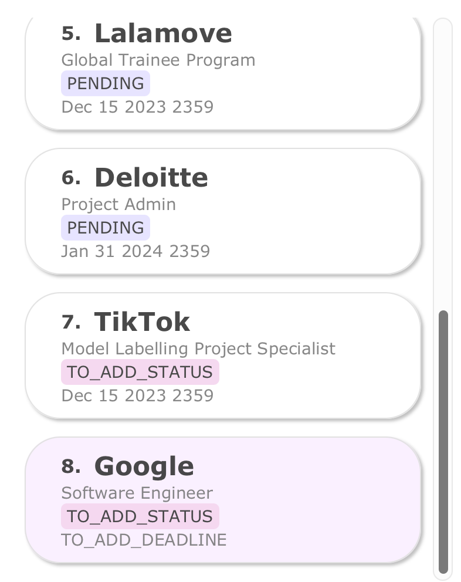
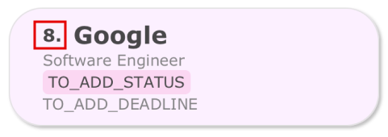
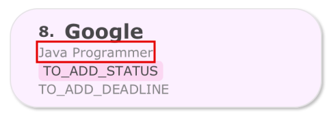
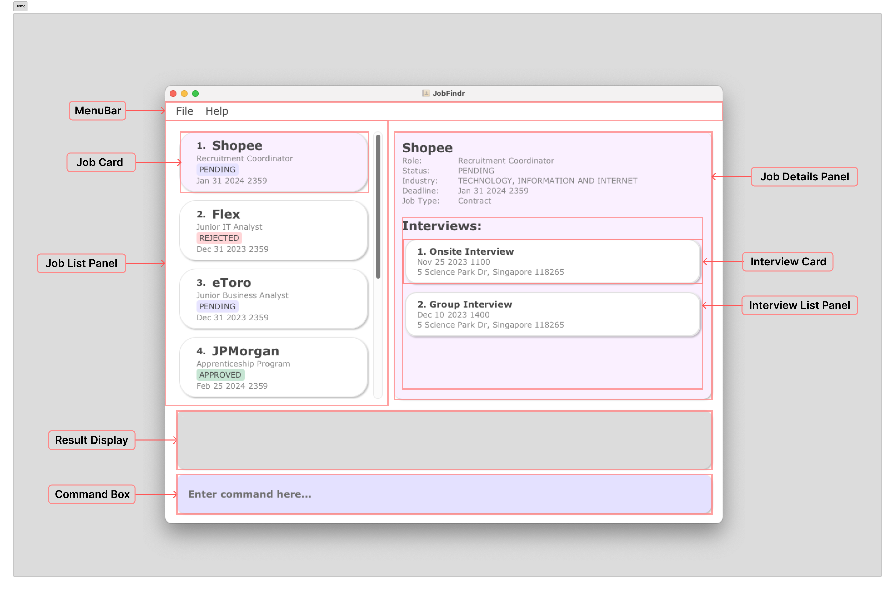
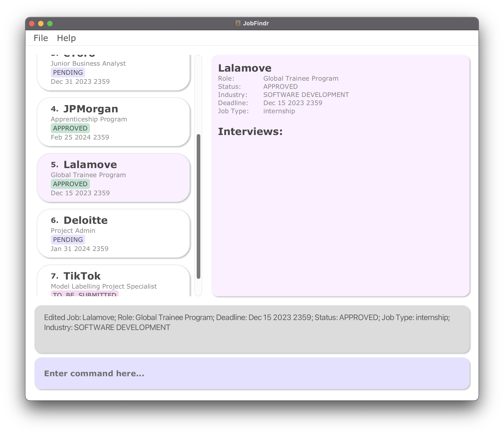
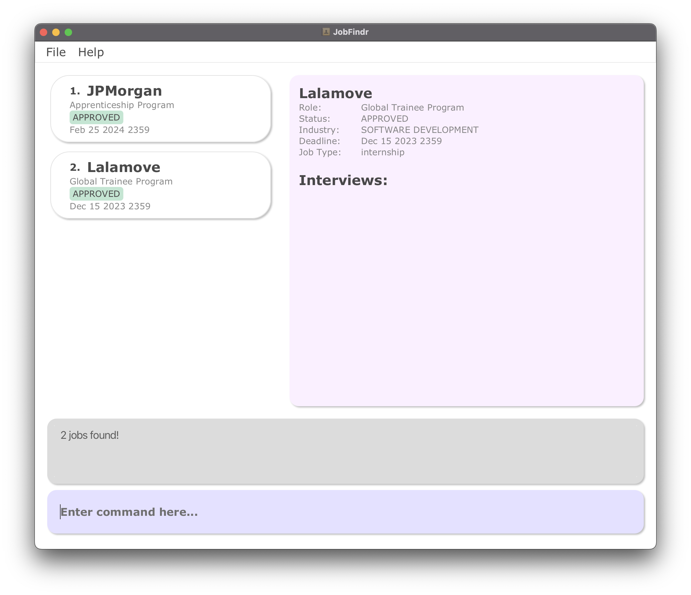
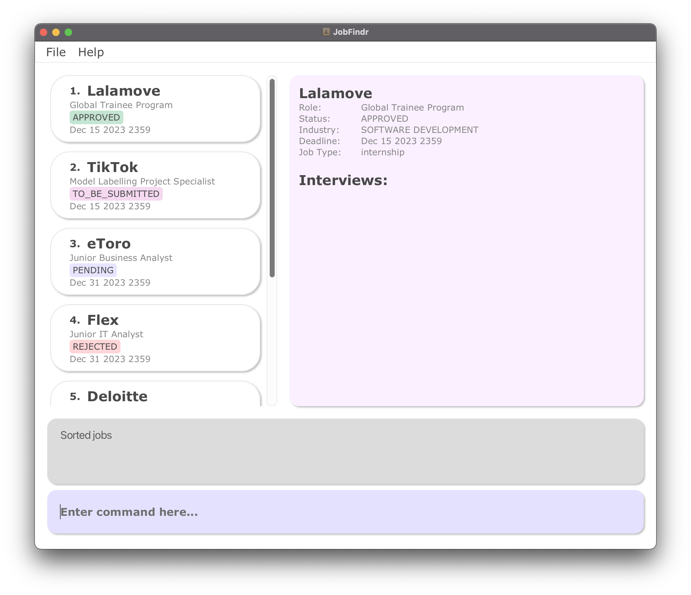
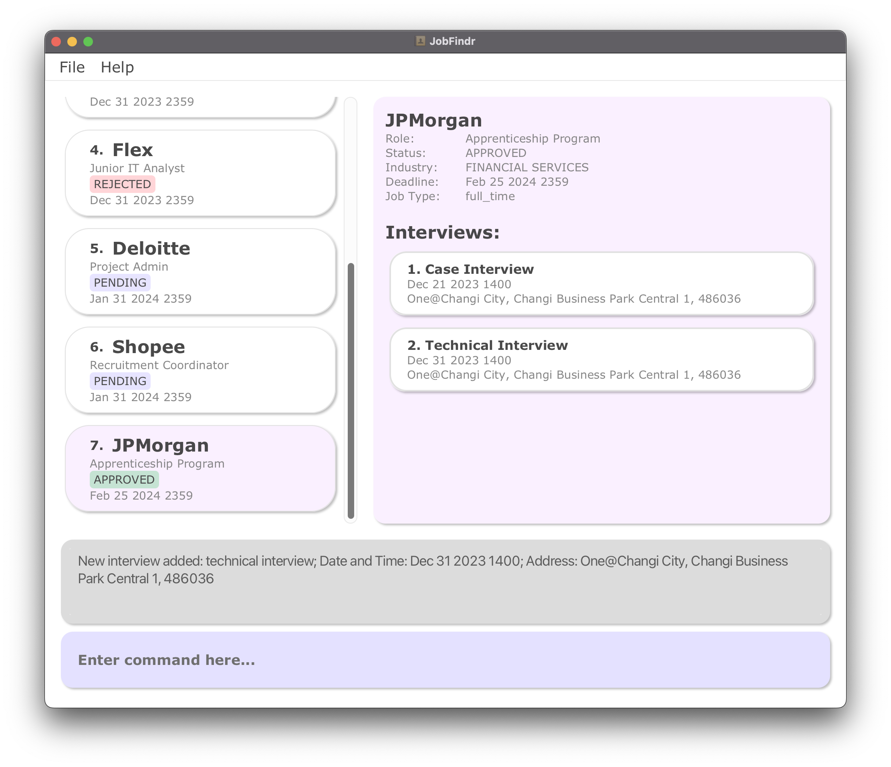
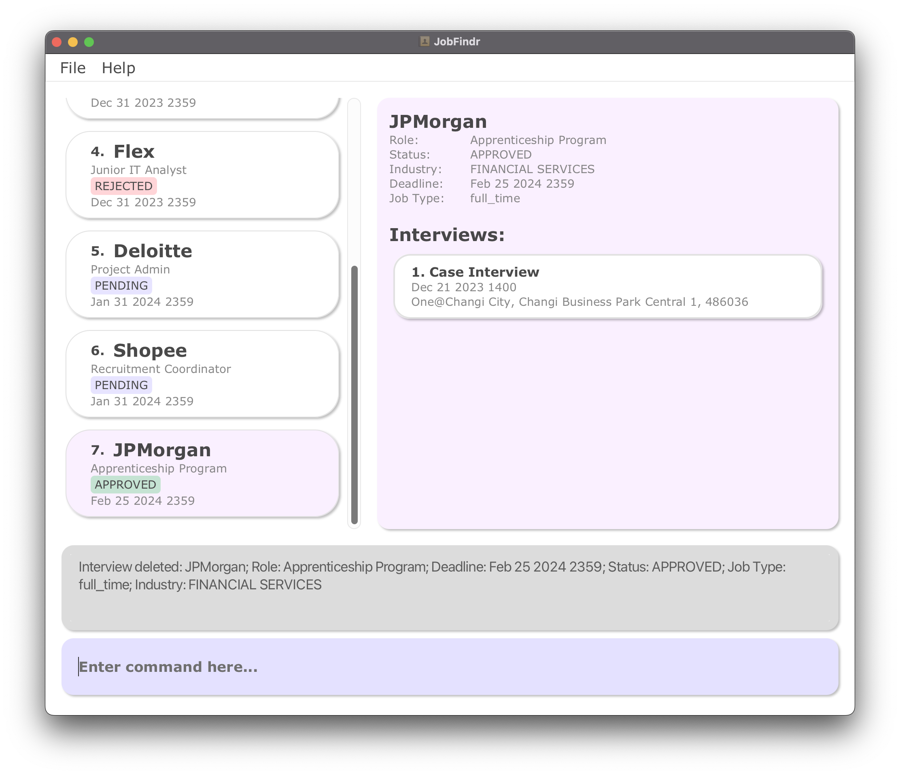

# Welcome to JobFindr!

_Find Your Success with JobFindr_

## Table of Contents

1. [Introduction](#introduction)
    1. [First Time at JobFindr](#first-time-at-jobfindr)
    2. [Experience at JobFindr](#experienced-at-jobfindr)
2. [Quick Start](#quick-start)
3. [Quick Tutorial](#quick-tutorial)
4. [Key Information](#key-information)
    1. [User Interface](#user-interface)
    2. [Structure of a job application](#structure-of-a-job-application)
    3. [Valid statuses](#valid-statuses)
    4. [Valid job types](#valid-job-types)
    5. [Structure of an interview](#structure-of-an-interview)
    6. [Valid interview types](#valid-interview-types)
    7. [Command Format](#command-format)
5. [Features](#features)
    1. [Command Summary](#command-summary)
    2. [Asking for help: `help`](#asking-for-help-help)
    3. [Listing all applications: `list`](#listing-all-applications--list)
    4. [Adding an application: `add`](#adding-an-application--add)
    5. [Deleting an application: `delete`](#deleting-an-application--delete)
    6. [Editing an application: `edit`](#editing-an-application--edit)
    7. [Finding an application: `find`](#finding-an-application--find)
    8. [Sorting the applications: `sort`](#sorting-all-applications--sort)
    9. [Adding an Interview: `interview add`](#adding-an-interview-interview-add)
    10. [Deleting an Interview: `interview delete`](#deleting-an-interview-interview-delete)
    11. [Editing an Interview: `interview edit`](#editing-an-interview-interview-edit)
    12. [Clearing All Applications: `clear`](#clearing-all-applications-clear)
    13. [Exiting the Programme: `exit`](#exiting-the-programme-exit)
6. [FAQ](#faq)
7. [Glossary](#glossary)

--------------------------------------------------------------------------------------------------------------------

## Introduction

JobFindr is a **Desktop-based Job Application Management App** for NUS Fresh Graduates to record, track and organise
their job applications.

JobFindr aims to simplify your job application management by targeting the following benefits:

1. _Flexibility_ in **adding**, **deleting** and **editing** job applications and interviews
2. _Efficiency_ in **finding** the specific application with minimal keywords
3. _Organisation_ in **sorting** the list of applications to not miss out on key opportunities

JobFindr combines the rapid efficiency of Command Line Interface (CLI) with the visual clarity of
[Graphical User Interface (GUI)](#user-interface), offering job application management that is suited for your specific
needs and preferences.

### First Time at JobFindr?

_Welcome onboard JobFindr! Let us be part of your job search journey!_

1. To get started with JobFindr, refer to the [Quick Start](#quick-start) below.
2. After setting up JobFindr on your computer, you can get started with a [Quick Tutorial](#quick-tutorial) to get
   familiar with the
   features.
3. You may also explore JobFindr at your own pace, you can refer to the [Feature](#features) section for all the
   available features on JobFindr.

### Experienced at JobFindr

_Good to see you back here! Let see how we can help you?_

1. Facing problem with specific command?
    * You may refer to the detailed instruction for each command in the [Features](#features) section or access the
      hyperlink from our [Table of Contents](#table-of-contents).
2. Forgot the commands available on JobFindr?
    * Please kindly refer to the [Command Summary](#command-summary) for a quick reminder of what you can do on
      JobFindr.
3. Any other issues faced when using JobFindr?
    * You may refer to the [FAQ](#faq) Section for solutions to common issues faced by our users.

--------------------------------------------------------------------------------------------------------------------

## Quick Start

1. Ensure you have Java `11` or above installed in your Computer.
    1. To check if you have installed the correct Java version
       over [here](#1-how-do-i-make-sure-i-have-installed-the-correct-java-version)
    2. Follow the instruction
       over [here](https://docs.oracle.com/en/java/javase/11/install/overview-jdk-installation.html#GUID-8677A77F-231A-40F7-98B9-1FD0B48C346A)
       to install Java `11`
2. Download the latest `JobFindr.jar` from [here](https://github.com/AY2324S1-CS2103T-W12-3/tp/releases).
   
3. Copy the file to the folder you want to use as the **home folder** for your AddressBook.
4. [Open a command terminal](#2-how-do-i-open-up-terminal-on-my-computer), `cd` into the folder you put the jar file in,
   and enter the command `java -jar JobFindr.jar` to run the application.
5. A GUI similar to the below should appear in a few seconds. Note that the app contains some sample data.  
   
6. Get started on JobFindr with our guided [Quick Tutorial](#quick-tutorial) to learn the basics of using JobFindr in a
   few minutes.
7. Refer to [Key Information](#key-information) below for details of each command.

--------------------------------------------------------------------------------------------------------------------

## Quick Tutorial

Let us help you begin your job search journey with JobFindr. Here is a quick tutorial to help you understand the basic
features to get started on JobFindr.

1. [Add your first job application on JobFindr](#1-add-your-first-job-application-on-jobfindr)
2. [Edit a field in the newly added application](#2-edit-a-field-in-the-newly-added-application)
3. [Delete the application](#3-delete-the-application)

### 1. Add your first job application on JobFindr

Leverage on the power of flexibility by adding applications with minimal mandatory fields. Now let us try to add an
application onto JobFindr.

**Step 1**: Find the [Command Box](#user-interface) on JobFindr and type in `add c/Google r/Software Engineer` before
pressing **Enter**. 

* Learn more about the structure of a job application [here](#structure-of-a-job-application).

**Step 2**: You should see a new entry added to the Job List Panel just like this:  

* You may need to scroll down the list to view the new entry by using the scroll bar.

_[Optional]_ Good job! You have added your first application onto JobFindr! Now, you may try out adding other
applications with different field inputs. Try entering or copy-paste the following into the Command Box:

1. `add c/Apple r/iOS Engineer d/Jan 02 2024 2359`
2. `add c/Facebook r/Product Manager d/Jan 04 2023 1200 s/Pending`
3. `add c/Microsoft r/Project Manager d/Dec 31 2023 1400 i/Technology s/Pending t/FULL_TIME`

### 2. Edit a field in the newly added application

Now you have learnt how to add applications onto JobFindr, what if you want to edit/update a specific field in the newly
added application? Let's try using the edit feature.

**Step 1**: Locate the [index](#command-format) of the application you want to edit. Let's edit our newly added
application to `Google` for now.  

* You may want to enter the [`list`](#listing-all-applications--list) command to list all available applications.

**Step 2**: Type `edit 8 r/Java Programmer` into the Command Box and press **Enter**. You should see an update to the
application's
role. 

_[Optional]_ Great! You have now edited the role of your application. Try editing other fields as well:

1. `edit 8 s/PENDING`
2. `edit 8 d/Dec 02 2023 2359`

### 3. Delete the application

What if the application is no longer relevant to you now? Can we delete the application from our app? Yes, definitely
let's do exactly that now.

**Step 1**: Locate the [index](#command-format) of the application you want to edit. Let's edit our newly added
application to `Google` for now.  

* You may want to enter the [`list`](#listing-all-applications--list) command to list all available applications.

**Step 2**: Type `delete 8` into the Command Box and press **Enter**. You should notice that the application will be
removed from the list of applications. 
 

Congrats! You have now master the basics of JobFindr! You may head right below to learn more
about [JobFindr in details](#key-information)
or go on to learn about [the other commands](#features) you can utilise in JobFindr.

--------------------------------------------------------------------------------------------------------------------

## Key Information

### User Interface

We designed our Graphical User Interface(GUI) with both **functionality** and **visual appeal** in mind. To provide a
seamless experience for you at JobFindr.

Below are the components of our GUI:

| Index | Component            | Description                                                            |
|-------|----------------------|------------------------------------------------------------------------|
| 1     | Menu Bar             | Contains system based features like `exit` and `help`                  |
| 2     | Job Card             | Displays the specific job application                                  |
| 3     | Job List Panel       | Displays the list of applications you have added to JobFindr           |
| 4     | Result Display       | Displays success or error messages of the most recent command          |
| 5     | Command Box          | Key in your commands here                                              |
| 6     | Job Details Panel    | Displays detail of the application you have selected                   |
| 7     | Interview Card       | Displays the specific interview                                        |
| 8     | Interview List Panel | Displays the list of interviews you have added to that job application |

### Structure of a Job Application

| Field    | Prefix | Remarks                                                        | Optional? | Sort Order    |
|----------|--------|----------------------------------------------------------------|-----------|---------------|
| Company  | `c/`   | No restrictions                                                | No        | Alphabetical  |
| Role     | `r/`   | Must only contain alphanumeric characters and spaces           | No        | Alphabetical  |
| Status   | `s/`   | Possible values in "[Valid statuses](#valid-statuses)"         | Yes       | Alphabetical  |
| Industry | `i/`   | Must start with an alphanumeric character                      | Yes       | Alphabetical  |
| Deadline | `d/`   | Must be in the format MMM dd yyyy HHmm (e.g. Dec 01 2030 1200) | Yes       | Chronological |
| Job Type | `t/`   | Possible values in "[Valid job types](#valid-job-types)"       | Yes       | Alphabetical  |

* Applications with the same company _AND_ role are considered duplicate jobs.
  JobFindr does not allow the creation of duplicate jobs.

* Deadline refers to the application submission deadline.

### Valid Statuses

The following are valid statuses:

| Status          | Remarks                                                                   |
|-----------------|---------------------------------------------------------------------------|
| `TO_ADD_STATUS` | The default status if not specified                                       |
| `PENDING`       | An application that you have applied for but have yet to receive a result |
| `APPROVED`      | An application that you have received a job offer for                     |
| `REJECTED`      | An application that you have been rejected for                            |

### Valid Job Types

The following are valid job types:

| Job Type          | Remarks                               |
|-------------------|---------------------------------------|
| `TO_ADD_JOB_TYPE` | The default job type if not specified |
| `FULL_TIME`       | A full time job                       |
| `PART_TIME`       | A part time job                       |
| `INTERNSHIP`      | An internship                         |
| `TEMPORARY`       | A temporary job                       |
| `CONTRACT`        | A contract job                        |
| `FREELANCE`       | A freelance job                       |
| `VOLUNTEER`       | A volunteered job                     |

### Structure of an Interview

| Field    | Prefix | Remarks                                                                                                             | Optional? |
|----------|--------|---------------------------------------------------------------------------------------------------------------------|-----------|
| Type     | `t/`   | Possible values in "[Valid Interview Types](#valid-interview-types)"                                                | No        |
| DateTime | `d/`   | Must be in the format MMM dd yyyy HHmm (e.g. Dec 31 2030 1200) and cannot be earlier than the current date and time | No        |
| Address  | `a/`   | Must start with an alphanumeric character                                                                           | No        |

* Interviews in the **same application** with the same type _AND_ datetime _AND_ address are considered duplicate
  interviews.
  JobFindr does not allow the creation of duplicate interviews.

* DateTime of interview can be after Deadline of application.

* Multiple interviews with the same DateTime can be added if they are not duplicate interviews.

### Valid Interview Types

The following are valid interview types:

| Interview Type | Remarks                 |
|----------------|-------------------------|
| `BEHAVIOURAL`  | A behavioural interview |
| `TECHNICAL`    | A technical interview   |
| `CASE`         | A case interview        |
| `GROUP`        | A group interview       |
| `PHONE`        | A phone interview       |
| `VIDEO`        | A video interview       |
| `ONLINE`       | An online interview     |
| `ONSITE`       | An onsite interview     |
| `OTHER`        | Other interviews        |

### Command format

* If you are using a PDF version of this document, be careful when copying and pasting commands that span multiple lines
  as space characters surrounding line-breaks may be omitted when copied over to the application.

* Words in upper case are the parameters to be supplied by the user. 
    * e.g. in `add c/COMPANY`, `COMPANY` is a parameter which can be used as `add c/Google`.

* Items in square brackets are optional. 
    * e.g. `c/COMPANY [s/STATUS]` can be used as `c/Google s/Pending` or as `c/Google`.

* Parameters can be in any order. 
    * e.g. if the command specifies `c/COMPANY r/ROLE`, `r/ROLE c/COMPANY` is also acceptable.
    * When `INDEX` is required, it has to be the first parameter.

* Extraneous parameters for commands that do not take in parameters (such as `help`, `exit` and `clear`) will be
  ignored. 
    * e.g. if the command specifies `help 123`, it will be interpreted as `help`.

* A _white space_ must be included directly before each [prefix](#prefix).

* The same prefix cannot be used multiple times in the same command.
    * e.g. `add r/Cleaner c/Google c/Microsoft` is an invalid input.

* `INDEX` and `JOB_INDEX` refers to the index number of the chosen application in the displayed application list and
  must be a _positive
  integer_ 1, 2, 3, …

* `INTERVIEW_INDEX` refers to the index number of the chosen interview of an application and must be a _positive
  integer_ 1, 2, 3, …

--------------------------------------------------------------------------------------------------------------------

## Features

### Command summary

| Action               | Format                                                                                   |
|----------------------|------------------------------------------------------------------------------------------|
| **Add**              | `add c/COMPANY r/ROLE [s/STATUS] [d/DEADLINE] [i/INDUSTRY] [t/JOB_TYPE]`                 |
| **Edit**             | `edit INDEX [c/COMPANY] [r/ROLE] [s/STATUS] [d/DEADLINE] [i/INDUSTRY] [t/JOB_TYPE]`      |
| **Delete**           | `delete INDEX`                                                                           |
| **List**             | `list`                                                                                   |
| **Find**             | `find [KEYWORDS] [c/COMPANY] [r/ROLE] [s/STATUS] [d/DEADLINE] [i/INDUSTRY] [t/JOB_TYPE]` |
| **Sort**             | `sort PREFIX`                                                                            |
| **Interview add**    | `interview add INDEX t/TYPE d/DATETIME a/ADDRESS`                                        |
| **Interview delete** | `interview delete INTERVIEWINDEX from/JOBINDEX`                                          |
| **Interview edit**   | `interview edit INTERVIEWINDEX from/JOBINDEX`                                            |
| **Help**             | `help`                                                                                   |
| **Clear**            | `clear`                                                                                  |
| **Exit**             | `exit`                                                                                   |

---

### Asking for help: `help`

Shows a list of commands and how they can be used.

**Format:** `help`

***Successful Commands:***

1. Launching the help window: `help`

* This command opens up a separate window, displaying all the availble commands on JobFindr and their formats.

[&uarr; Back to Table of Contents](#table-of-contents)

---

### Listing all applications : `list`

Shows a list of all applications in the list in alphabetical order.

**Format:** `list`

**Successful command:**

* List out all applications to companies in the list with index.

**UI mockup:**

[&uarr; Back to Table of Contents](#table-of-contents)

---

### Adding an application : `add`

Adds a job application to the list.

**Format:** `add c/COMPANY r/ROLE [s/STATUS] [d/DEADLINE] [i/INDUSTRY] [t/JOB_TYPE]`

**Examples:**

***Successful Commands:***

1. Adding a basic job application: `add c/Google r/Software Engineer`

* This command adds a job application for the company "Google" with the role "Software Engineer."
* Optional fields like deadline, status, industry, and job type are not provided, so they will use their default values.

2. Adding a complete job application with all
   fields: `add c/Microsoft r/Project Manager d/Dec 31 2023 1400 i/Technology s/Pending t/FULL_TIME`

* This command adds a job application for the company "Microsoft" with the role "Project Manager" and provides a
  deadline, industry, status, and job type.

***Failed Commands:***

1. Missing required fields: `add r/Data Analyst`

* This command is invalid because it doesn't provide the "c/COMPANY" field, which is required.

2. Invalid Job Type: `add c/Apple r/Software Developer t/Part-Time`

* This command is invalid because "t/Part-Time" is not a valid job type. It should be "t/PART_TIME."

**UI mockup:**

[&uarr; Back to Table of Contents](#table-of-contents)

---

### Deleting an application : `delete`

Deletes the specified application from the list.

**Format:** `delete INDEX`

* Deletes the application to the company at the specified `INDEX`.

**Examples:**

* `list`
* followed by `delete 2`

  Deletes the 2nd application in the list.

**UI mockup:**

***Successful Commands:***

1. Deleting a job application: `delete 2`

* This command deletes the job application at the 2nd index in the list.
* This is provided that this job application indeed exists.

***Failed Commands:***

1. Invalid job index: `delete 5` when there is no job application at index 5.

* This command is invalid because 5 is not a valid job index.

[&uarr; Back to Table of Contents](#table-of-contents)

---

### Editing an application : `edit`

Edits an application in the list.

**Format:** `edit INDEX [c/COMPANY] [r/ROLE] [s/STATUS] [d/DEADLINE] [i/INDUSTRY] [t/JOB_TYPE]`

* Edits the application to the company at the specified `INDEX`.
* At least one of the optional fields must be provided.

**Examples:**

***Successful Commands:***

1. Editing the role of a job application: `edit 1 r/Marketing Manager`

* This command edits the role of the first job application to "Marketing Manager."

2. Editing multiple fields of a job application: `edit 2 c/Amazon r/Product Manager d/Dec 15 2023 1000 s/APPROVED`

* This command edits the company, role, deadline, and status of the second job application.

***Failed Commands:***

1. Missing index: `edit c/Google r/Software Engineer`

* This command is invalid because it doesn't specify the index of the job application to edit.

2. Invalid field: `edit 3 q/Designer`

* This command is invalid because "q/Designer" is not a valid field. It should be "r/Designer."

3. Invalid Job Type: `edit 4 t/Part-Time`

* This command is invalid because "t/Part-Time" is not a valid job type. It should be "t/PART_TIME."

**UI mockup:**

[&uarr; Back to Table of Contents](#table-of-contents)

---

### Finding an application : `find`

Finds all applications whose fields match the keywords provided.

**Format:** `find [KEYWORDS] [c/COMPANY] [r/ROLE] [s/STATUS] [d/DEADLINE] [i/INDUSTRY] [t/JOB_TYPE]`

* At least one optional parameter must be provided. Multiple parameters can be provided.
* If a [prefix](#prefix) is given, the search will only find applications containing the given keywords in the specified
  field.
* Multiple keywords can be provided for one parameter.
    * e.g. `find r/Software Engineer` is a valid command.
* Keywords are case-insensitive.
* If `KEYWORDS` is provided, the command will find all applications that contains the `KEYWORDS` in any field.
* An application will be listed only if it contains _ALL_ the keywords provided.
* Applications with partially matching keywords will not be listed.
    * e.g. searching for the keyword "Goo" will not list applications containing "Google".
* Characters not separated by white space are considered _ONE_ word.
    * e.g. searching for the keyword "ADD" will not list applications containing "TO_ADD_DEADLINE".
* Searches for deadline must be formatted correctly. Refer to
  "[Structure of a job application](#structure-of-a-job-application)" for the correct format of a deadline.

**Examples:**

***Successful Commands:***

1. Finding by company: `find c/Google`

* This command searches for all job applications with "Google" in the company name.

2. Finding using multiple conditions: `find Google r/Software Engineer`

* This command searches for all job applicaitons with "Google" in any field and the words "Software" and "Engineer".

***Failed Commands:***

1. Missing keywords: `find`

* This command is invalid because it doesn't specify any keywords to search for.

**UI mockup:**

[&uarr; Back to Table of Contents](#table-of-contents)

---

### Sorting all applications : `sort`

Sorts the list based on the prefix provided.

**Format:** `sort PREFIX`

* A single valid `PREFIX` must be provided. Refer to "[Structure of a job application](#structure-of-a-job-application)"
  for the list of valid prefixes.
* The sort order cannot be reversed.
    * e.g. when sorting by company, companies cannot be listed from Z-A.
* For optional fields, applications with empty fields will be listed first.

**Examples:**

***Successful Commands:***

1. Sort by company: `sort c/`

* This command sorts all job applications in ascending alphabetical order of company name.

2. Sort by role: `sort r/`

* This command sorts all job applications in chronological order of deadline, starting from applications with the
  earliest deadline.

***Failed Commands:***

1. Multiple prefixes: `sort r/ c/`

* This command is invalid because only one prefix is accepted.

2. Input following prefix: `sort r/Software`

* This command is invalid because there should be nothing following the prefix provided.

**UI mockup:**

[&uarr; Back to Table of Contents](#table-of-contents)

---

### Adding an interview: `interview add`

Adds an interview to the specified application from the list.

**Format:** `interview add INDEX t/TYPE d/DATETIME a/ADDRESS`

**Successful command:**

* When an interview is successfully added, display “New interview added: (`TYPE`) interview; Date and
  Time: (`DATETIME`); Address: (`ADDRESS`)”.

**Failed command:**

* If any fields or prefixes are not included with the command,
  display "Invalid command format!" and the correct format for interview add command.

* If any fields have invalid input, display the possible valid inputs for that field.

**Examples:**

* `interview add 1 t/Technical d/Nov 12 2024 1200 a/Home`

  Adds a technical interview at Nov 12 2024 1200 at Home to the first application in the list.

**UI mockup:**

[&uarr; Back to Table of Contents](#table-of-contents)

---

### Deleting an interview: `interview delete`

Deletes an interview of the specified application from the list.

**Format:** `interview delete INTERVIEW_INDEX from/JOB_INDEX`

* Deletes the interview at the specified `INTERVIEW_INDEX` of the application at the specified `JOB_INDEX`.

**Successful command:**

* When an interview is successfully deleted, display “Interview deleted: (`TYPE`) interview; Date and
  Time: (`DATETIME`); Address: (`ADDRESS`)”.

**Failed command:**

* If any fields or prefixes are not included with the command,
  display "Invalid command format!" and the correct format for interview delete command.

**Examples:**

* `interview delete 1 from/2`

  Deletes the 1st interview from the 2nd job application in the list.

**UI mockup:**

[&uarr; Back to Table of Contents](#table-of-contents)

---

### Editing an interview: `interview edit`

Edits an interview of the specified application from the list.

**Format:** `interview edit INTERVIEW_INDEX from/JOB_INDEX [t/TYPE] [d/DATETIME] [a/ADDRESS]`

* Edits the interview at the specified `INTERVIEW_INDEX` of the application at the specified `JOB_INDEX`.
* At least one of the optional fields must be provided.

**Successful command:**

* When an interview is successfully edited, display “Interview successfully edited: (`TYPE`) interview; Date and
  Time: (`DATETIME`); Address: (`ADDRESS`)”.

**Failed command:**

* If any fields or prefixes are not included with the command,
  display "Invalid command format!" and the correct format for interview edit command.

**Examples:**

* `interview edit 2 from/4 t/GROUP d/Jan 20 2025 1200`

  Edits the interview type and date time for the 2nd interview from the 4th job application in the list.

* `interview edit 4 from/8 a/NTU`

  Edits the address for the 4th interview from the 8th job application in the list.

**UI mockup:**

[&uarr; Back to Table of Contents](#table-of-contents)

---

### Clearing all applications: `clear`

Clears all applications from the application book.

**Format:** `clear`

[&uarr; Back to Table of Contents](#table-of-contents)

---

### Exiting the programme: `exit`

Exits the program.

**Format:** `exit`

**:information_source: Notes:**  
* Applications will be saved automatically before exiting. No further action is required.

[&uarr; Back to Table of Contents](#table-of-contents)

--------------------------------------------------------------------------------------------------------------------

## FAQ

### 1. How do I make sure I have installed the correct Java version?

- [Open up terminal](#2-how-do-i-open-up-terminal-on-my-computer) on your computer.
- Type `java -version` in your terminal and press enter. You will see the following if you have installed Java 11
  correctly:
  
- If you do not have Java 11 installed, please refer
  to [this guide](https://docs.oracle.com/en/java/javase/11/install/overview-jdk-installation.html#GUID-8677A77F-231A-40F7-98B9-1FD0B48C346A)
  to download it to your computer.

### 2. How do I open up terminal on my computer?

On **Mac**:

1. Open up **Spotlight Search** by clicking the button in your menu bar. Or simply use the keyboard
   shortcut `Command + Space`.
2. Type **“Terminal”**
3. You should see the Terminal application at the top of your results. **Double-click** it or **press Enter** to
   open up
   Terminal.

On **Windows**:

1. Open your computer's **Start** menu by clicking the Windows Start
   icon 
   at the bottom-left corner of your desktop or press the Win
   key 
   on your keyboard.
2. Type **"Command Prompt"** or **"Powershell"**
3. You should see the corret application at the top of your results. **Double-click** it or **press Enter** to
   open up Command Prompt or Powershell.

### 3. How do I transfer my data to another Computer?

- Install the app in the other computer and overwrite the empty data file it creates with the file that contains
  the data of your previous AddressBook home folder.

[&uarr; Back to Table of Contents](#table-of-contents)

--------------------------------------------------------------------------------------------------------------------

## Glossary

#### Prefix

* An affix that placed before the field to indicate the type of field
* Examples: c/ r/ s/ from/

[&uarr; Back to Table of Contents](#table-of-contents)
