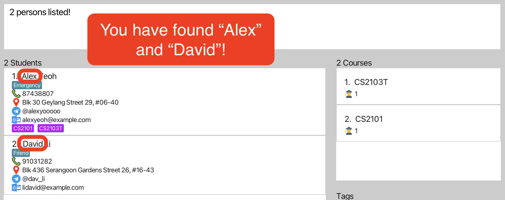

UNOFAS (One Financial Advisors app) is a **desktop app for Financial Advisors to manage client's contacts,
optimized for use via a Command Line Interface** (CLI) while still having the benefits of a
Graphical User Interface (GUI). If you can type fast, UNOFAS can help you manage and retrieve client's information
better than traditional GUI apps.

**Table of Contents**
* Quick Start
* Features
* FAQ
* Known Issues
* Command Summary

--------------------------------------------------------------------------------------------------------------------

## Quick start

1. Ensure you have Java `11` or above installed in your Computer.

1. Download the latest `unofas.jar` from [here](https://github.com/AY2324S1-CS2103T-F12-1/tp/releases).

1. Copy the file to the folder you want to use as the _home folder_ for your UNOFAS.

1. Open a command terminal, `cd` into the folder you put the jar file in, and use the `java -jar unofas.jar` command to run the application. 
   A GUI similar to the below should appear in a few seconds. Note how the app contains some sample data. 
   

1. Type the command in the command box and press Enter to execute it. e.g. typing **`help`** and pressing Enter will open the help window. 
   Some example commands you can try:

   * `list` : Lists all contacts.

   * `add n/John Doe p/98765432 e/johnd@example.com a/John street, block 123, #01-01` : Adds a contact named `John Doe` to the Address Book.

   * `delete 3` : Deletes the 3rd contact shown in the current list.

   * `clear` : Deletes all contacts.

   * `exit` : Exits the app.

1. Refer to the [Features](#features) below for details of each command.

--------------------------------------------------------------------------------------------------------------------

## Features

**:information_source: Notes about the command format:** 

* Words in `UPPER_CASE` are the parameters to be supplied by the user. 
  e.g. in `add n/NAME`, `NAME` is a parameter which can be used as `add n/John Doe`.

* Items in square brackets are optional. 
  e.g `n/NAME [t/TAG]` can be used as `n/John Doe t/friend` or as `n/John Doe`.

* Items with `…`​ after them can be used multiple times including zero times. 
  e.g. `[t/TAG]…​` can be used as ` ` (i.e. 0 times), `t/friend`, `t/friend t/family` etc.

* Parameters can be in any order. 
  e.g. if the command specifies `n/NAME p/PHONE_NUMBER`, `p/PHONE_NUMBER n/NAME` is also acceptable.

* Any input parameters that do not adhere to the accepted values will result in the command **failing and not executing**.

* Extraneous parameters for commands that do not take in parameters (such as `help`, `list`, `exit` and `clear`) will be ignored. 
  e.g. if the command specifies `help 123`, it will be interpreted as `help`.

* If you are using a PDF version of this document, be careful when copying and pasting commands that span multiple lines as space characters surrounding line-breaks may be omitted when copied over to the application.

### Viewing help : `help`
> :warning: Due to new features, help page is currently being updated.

Shows a message explaning how to access the help page.

Format: `help`

### Adding a client's contact: `add`

Add a client’s contacts to address book (name, phone number, email, home address, next-of-kin name, next-of-kin phone number) into Address Book

Format: `add n/NAME p/PHONE_NUMBER e/EMAIL a/ADDRESS nk/NEXT_KIN nkp/NEXT_KIN_PHONE [t/TAG]…​`

Acceptable Values:
1. NAME - any value is possible
2. PHONE_NUMBER - Numbers (0-9) and symbols, but no alphabets
3. EMAIL - string in valid email format
4. ADDRESS - any value is possible
5. NEXT_KIN - any value is possible
6. NEXT_KIN_PHONE - Numbers (0-9), and symbols, no alphabets

:bulb: **Tip:**
A person can have any number of tags (including 0)

Examples:
* `add n/John p/80101010 e/johndoe@gmail.com a/Punggol Central Blk 444 #15-32 820123 nk/Brennan nkp/82020202 [t/TAG]…​`

### Listing all persons : `list`

Display a list of all the clients and their contact details

Format: `list`

### Editing a person : `edit`

Edit clients contact fields using an entry index followed by the updated details.

Format: `edit ENTRY_INDEX [n/NAME] [p/PHONE_NUMBER] [e/EMAIL] [a/ADDRESS] [nk/NEXT_KIN] [nkp/NEXT_KIN_PHONE] [t/TAG]…​`

* Edits the person at the specified `INDEX`. The index refers to the index number shown in the displayed person list. The index **must be a positive integer** 1, 2, 3, …​
* At least one of the optional fields must be provided.
* Existing values will be updated to the input values.
* When editing tags, the existing tags of the person will be removed i.e adding of tags is not cumulative.
* You can remove all the person’s tags by typing `t/` without
    specifying any tags after it.

Acceptable Values:
1. ENTRY_INDEX - Number (1 to current size of the address book)
2. NAME - any value is possible
3. PHONE_NUMBER - Numbers (0-9) and symbols, no alphabets
4. EMAIL - string in valid email format
5. ADDRESS - any value is possible
6. NEXT_KIN - any value is possible
7. NEXT_KIN_PHONE - Numbers (0-9), and symbols, no alphabets

Examples:
*  `edit 1 n/john doe a/23 woodlands ave 123` Edits the name and address of the 1st person to be `john doe` and `woodlands ave 123` respectively.

Successful Output:
`This contact has been updated: Name: john doe
Phone: 80101010
Email: johndoe@gmail.com
Address: 23 woodlands ave 123
Next-of-Kin: Brennan
Next-of-Kin Phone: 82020202
`

### Locating persons by name: `find`

Finds persons whose names contain any of the given keywords.

Format: `find KEYWORD [MORE_KEYWORDS]`

* The search is case-insensitive. e.g `hans` will match `Hans`
* The order of the keywords does not matter. e.g. `Hans Bo` will match `Bo Hans`
* Only the name is searched.
* Only full words will be matched e.g. `Han` will not match `Hans`
* Persons matching at least one keyword will be returned (i.e. `OR` search).
  e.g. `Hans Bo` will return `Hans Gruber`, `Bo Yang`

Examples:
* `find John` returns `john` and `John Doe`
* `find alex david` returns `Alex Yeoh`, `David Li` 
  

### Deleting a client's contact : `delete`

Deletes the client contact from the contact book by their index.

Format: `delete ENTRY_INDEX`

* Deletes the person at the specified `INDEX`.
* The index refers to the index number shown in the displayed person list.

Acceptable Values:
1. ENTRY_INDEX - Number (1 to current size of the address book).

Examples:
* `list` followed by `delete 1` deletes the 1st person in the address book.

Successful Output:
`Contact Deleted!
Low Jun Yu is removed.`

### Clearing all entries : `clear`

Clears all entries from the address book.

Format: `clear`

### Exiting the program : `exit`

Exits the program.

Format: `exit`

### Saving the data

UNOFAS data are saved in the hard disk automatically after any command that changes the data. There is no need to save manually.

### Editing the data file

UNOFAS data are saved automatically as a JSON file `[JAR file location]/data/addressbook.json`. Advanced users are welcome to update data directly by editing that data file.

:exclamation: **Caution:**
If your changes to the data file makes its format invalid, UNOFAS will discard all data and start with an empty data file at the next run. Hence, it is recommended to take a backup of the file before editing it.

### Archiving data files `[coming in v2.0]`

_Details coming soon ..._

--------------------------------------------------------------------------------------------------------------------

## FAQ

**Q**: How do I transfer my data to another Computer? 
**A**: Install the app in the other computer and overwrite the empty data file it creates with the file that contains the data of your previous UNOFAS home folder.

--------------------------------------------------------------------------------------------------------------------

## Known issues

1. **When using multiple screens**, if you move the application to a secondary screen, and later switch to using only the primary screen, the GUI will open off-screen. The remedy is to delete the `preferences.json` file created by the application before running the application again.

--------------------------------------------------------------------------------------------------------------------

## Command summary

Action | Format, Examples
--------|------------------
**Add** | `add n/NAME p/PHONE_NUMBER e/EMAIL a/ADDRESS nk/NEXT_KIN nkp/NEXT_KIN_PHONE [t/TAG]…​`   e.g., `add n/John p/80101010 e/johndoe@gmail.com a/Punggol Central Blk 444 #15-32 820123 nk/Brennan nkp/82020202 [t/TAG]…​`
**Clear** | `clear`
**Delete** | `delete INDEX`  e.g., `delete 3`
**Edit** | `edit ENTRY_INDEX [n/NAME] [p/PHONE_NUMBER] [e/EMAIL] [a/ADDRESS] [nk/NEXT_KIN] [nkp/NEXT_KIN_PHONE] [t/TAG]…​`  e.g.,`edit 1 n/john doe a/23 woodlands ave 123`
**Find** | `find KEYWORD [MORE_KEYWORDS]`  e.g., `find James Jake`
**List** | `list`
**Help** | `help`
