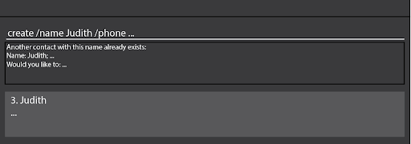
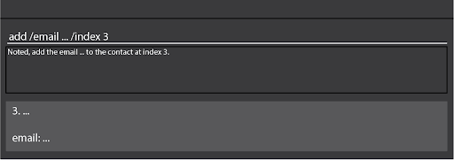
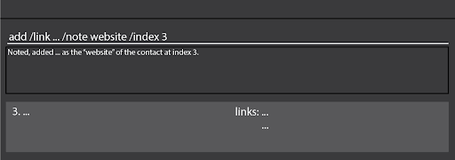
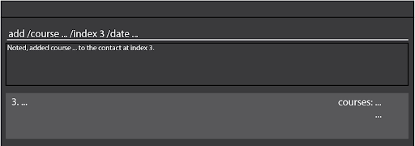
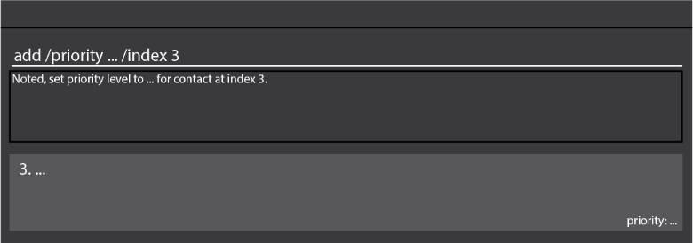
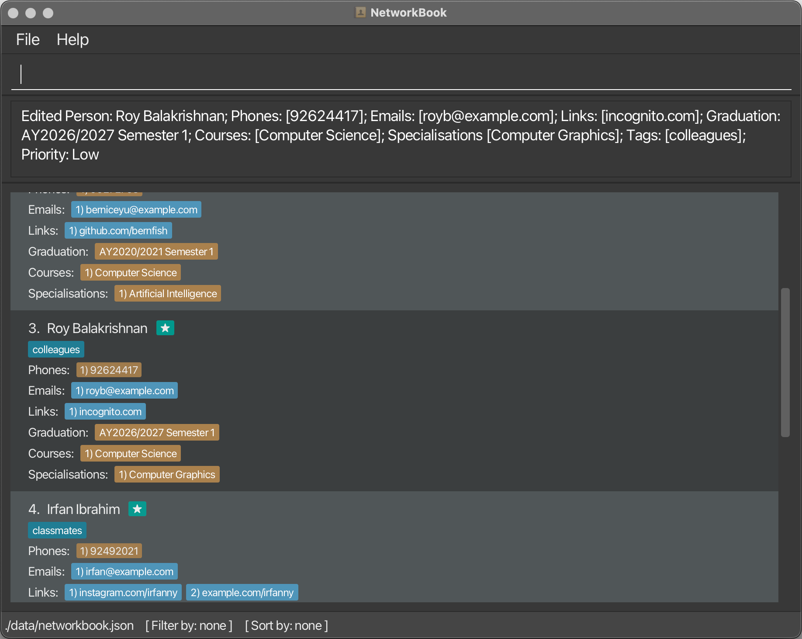
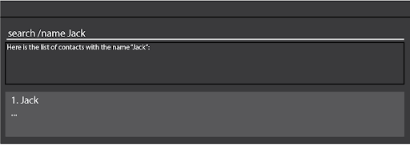

NetworkBook is a **desktop contact book application**. You can use it to network with other computing students and professionals from NUS.

## Features

### <u>Category 1 - Add contact information</u>

### Create new contact: `create /name [/optional fields]`

You can use the create command to create a new contact. When creating a contact, you must provide the name field, and it's optional to provide other fields which will be added to the new contact.

Format: `create /name [name] [/phone /email /link /grad /course /spec /priority /tag]`

Example usage:
* `create /name Oreki`
* `create /name Oreki /phone +12345678 /grad AY2526-S2`

Parameters:
* `[name]`  is the name of the contact you wish to add.
* `[optional fields]` are the non-mandatory fields you can associate with the contact at the point of creation. The fields can also be added using the add command.

When the command succeeds:
* `create /name Oreki`

`Noted, I have added contact with the name Oreki at index 1.`

When the command fails:
* `create /name`

`Oops, you did not provide the name of the contact to be added.`

When adding contacts, if there is a contact with the same name, the program will inform the user that another contact with the same name already exists (not case sensitive)
The program will then give the user the option of either creating a new contact (so there are 2 contacts with the same name), deleting the old contact and adding the new one, or aborting the current add operation

Example usage:
* `Hey! We noticed another contact with the same name below:`
  * `Contact name`
  * `Phone(s) [if it exists]`
  * `Email(s) [if it exists]`
* `Would you like to:`
  * `1. Delete the old contact and add the new contact`
  * `2. Add the new contact and keep the old contact`
  * `3. Don’t add the new contact`

When the command succeeds:
* `Old contact deleted. New contact added.`
* `New contact added`
* `New contact discarded`



When the command fails:
* `Invalid response, please type ‘1, 2, 3’ only`

### Add phone number to contact: `add [index] /phone`

You can add a phone number to an existing contact. A new phone number will be added to the contact's list of phone numbers, and no new contact will be created.

Format: `add [index] /phone [phone]`

Example usage:
* `add 1 /phone +6591234567`
* `add 2 /phone +11234567890`

Parameters:
* `[phone]` is a valid phone number (Country code must be included with + (plus sign) present.)
* `[index]` is the index of the contact in the list.

When the command succeeds:
* `add 1 /phone +6591234567`

`Noted, I have added phone number +6591234567 to the contact at index 1 (Oreki).`

When the command fails:
* `add /phone +6591234567`

`Oops, you did not provide the index of the contact to add to.`
* `add 1 /phone 91234567`

`Oops, you did not provide a valid phone number that includes a country code.`

### Add email to a contact: `add [index] /email`

You can add an email to an existing contact.
A new email will be added to the contact's list of emails,
and no new contact will be created.

Format: `add [index] /email [email]`

Example usage:
* `add 1 /email nknguyentdn@gmail.com`
* `add 2 /email test@example.com`

Parameters:
* `[email]` is a valid email (`@` (at sign) must be present, 
and `.` (period) must be present after `@` (at sign)).
* `[index]` is the index of the contact in the list.

When the command succeeds:
* `add 1 /email nknguyentdn@gmail.com`

`Noted, I have added email nknguyentdn@gmail.com to the contact at index 1.`

* `add 2 /email test@example.com`

`Noted, I have added email test@example.com to the contact at index 2.`



When the command fails:
* `add 1 /email nknguyentdn@gmail`

`Oops, you did not provide a valid email address.`

* `add /email nknguyentdn@gmail.com`

`Oops, you did not provide the index of the contact to add the email to.`

### Add link to a contact: `add [index] /link`

You can add a social link to an existing contact.
A new link will be added to the contact's list of links,
and no new contact will be created.

Format: `add [index] /link [link] [note]`

Example usage:
* `add 1 /link https://nknguyenhc.github.io/ website`
* `add 2 /link https://www.linkedin.com/in/nguyen-khoi-nguyen-6279341a8/`

Parameters:
* `[link]` is a valid URL linking to a contact’s social media page.
* `[note]` is a note on the URL for your own reference. 
This parameter is optional, and should be separated.
* `[index]` is the index of the person in the list.

When the command succeeds:
* `add 1 /link https://nknguyenhc.github.io/ /note website`

`Noted, I have added https://nknguyenhc.github.io/ 
as the “website” of your contact at index 1.`

* `add 2 /link https://www.linkedin.com/in/nguyen-khoi-nguyen-6279341a8/`

`Noted, I have added https://www.linkedin.com/in/nguyen-khoi-nguyen-6279341a8/ 
as a link to your contact at index 2.`



When the command fails:
* `add /link https://nknguyenhc.github.io/`

`Oops, you did not provide the index of the contact to add the link to.`

### Add course to a contact: `add [index] /course`

You can add a course to an existing contact.  A new course will be added to the contact's list of courses, and no new contact will be created.
The courses will be sorted by start_date. If there are multiple courses with the same code, the old course detail is replaced with the new course detail

Format: `add [index] /course [course code] /date [start date] [end date]`

Example usage:
* `add 1 /course CS1101S /date 01-08-2022 07-12-2022`
* `add 2 /course CS2030S /date 02-01-2023`

Parameters:
* `course code` is the code of a course the contact is taking. The course should not be longer than 8 characters (NUS course code).
* `index` is the index of the contact.
* `start date` is when the contact started taking this course.
* `end date` is when the contact finished taking this course, optional (not finished reading the course).

When the command succeeds:
* `add 1 /course CS1101S /date 01-08-2022 07-12-2022`

`Added course CS1101S to [name of contact]`



When the command fails:
* `add 1 /course CS1101S /date 1`
  * `Incorrect format for start date/end date`
* `add 1 /course CS1101S /date 30-02-2022`
  * `Invalid date entered`
* `add 1 /course CS1234567S /date 01-08-2022`
  * `Course code should not be longer than 8 characters`
* `add /course CS1101S`
  * `Course index date missing`
* `add 20000 /course CS1101S /date 01-08-2022 07-12-2022`
  * `Student with index 20000 cannot be found`

### Add specialisation: `add [index] /spec`

You can add a specialisation to an existing contact.  A new specialisation will be added to the contact's list of specialisations, and no new contact will be created.
Specialisations are displayed in the order they are added.

Format: `add [index] /spec [specialisation]`

Example usage:
* `add 1 /spec Robotics & AI`

Parameters:
* `index` is the index of the contact.
* `spec` is the specialisation that contact is taking.

When the command succeeds:
* `add 1 /spec Robotics & AI`

`Added specialisation Robotics & AI to [name of contact]`

When the command fails:
* `add 1 /spec`
  * `Specialisation cannot be blank`
* `add 20000 /spec Robotics & AI`
  * `Student with index 20000 cannot be found`
* `add /spec Robotics & AI`
  * `Index missing`
* `add 1 /spec Robotics & AI`
  * `Specialization already exists on contact with index 1 ([name of contact])`

### Assign priority levels: `add [index] /priority` 

You can set the priority level of a contact, 

so that you can easily filter them by priority for future reference.

Format: `add [index] /priority [priority level]`

Example usage:

- `add 1 /priority high`
- `add 10 /priority L`
- `add 23 /priority m`

Parameters:

- `[priority level]` is a word or letter representing the priority level to be assigned to the contact.

  There are three priority levels, **high, medium and low**, 

  represented by either the word itself (e.g. "high") or the first letter ("h"), 

  and they are not case-sensitive.

- `[index]` is the index of the person in the list

When the command succeeds:

- `add 3 /priority high`

`Noted. I have set the priority level to High for contact at index 3.`



When the command fails:

- `add 1 /priority hhhhh`

`OOPS, to assign a priority level, use:`

`add [index] /priority [priority level]`

- `add 100000 /priority h`

`OOPS, no matching contact with index 100000.`


### Add tag to a contact: `add [index] /tag`

You can use the `tag` command to associate a custom category with a contact, 

so that you can filter them by unique criteria for easier searching.

Format: `add [index] /tag [tag name]`

Example usage:

- `add 1 /tag data analytics`
- `add 18 /tag internship`

Parameters:

- `[tag name]` is the name of the tag to associate the contact with
- `[index]` is the index of the person in the list

When the command succeeds:

- `add 1 /tag data analytics`

`Noted. I have added "data analytics" tag to contact at index 1.`

When the command fails:

- `add /tag internship`

`OOPS, to add tag to a contact, use:`

`add [index] /tag [tag name]`

- `add 100000 /tag internship`

`OOPS, no matching contact with index 100000.`


### <u>Category 2 - Edit contact details</u>

### Edit contact detail : `edit [index] /field`

You can edit contact details of existing contacts in your book.

Format: `edit [index] /[parameter name] [new parameter value]`

Example usage:
* `edit 1 /name nkn`
* `edit 1 /link https://nknguyenhc.github.io/`

Parameters:

* `[parameter name]` refers to the name of the parameters. Names can be:
  * `name`
  * `phone`
  * `course`
  * `specialisation`
  * `email`
  * `link`
  * `grad`
  * `priority`
  * `tag`
* `[new parameter value]` is the new value of the parameter. The new value must follow the formatting of the parameter.
* `[index]` is the index of the contact in the list.

When command succeeds:
* `edit 1 /name nkn`

`OK, the name of the contact at index 1 (Nguyen) has been updated to “nkn”.`

* `update 1 /link https://nknguyenhc.github.io/`

```
There are multiple links to the contact at index 1. Which one do you wish to update?
https://nknguyenhc.github.io/ip
https://www.linkedin.com/in/nguyen-khoi-nguyen-6279341a8/
```

Assume that you in 1:

`OK, a link of the contact at index 1 (Nguyen) has been updated
from https://nknguyenhc.github.io/ip to https://nknguyenhc.github.io/.`



When the command fails:

* `update 1 /email nknguyentdn@gmail`

`Oops, you did not provide a valid email address.`

* `update /email nknguyentdn@gmail.com`

`Oops, you did not provide the index of the contact to update email.`

### Delete a contact: `delete` 

You can remove a contact from your NetworkBook using the `delete` command, 

so that your book only contains contact details of those relevant.

Format: `delete [index]`

Example usage:

- `delete 1`
- `delete 16`

Parameters:

- `[index]` is the index of the person in the list

When the command succeeds:

- `delete 1`

`Noted. I have deleted contact at index 1.`

When the command fails:

- `delete`

`OOPS, to delete a contact, use:`

`delete [index]`

- `delete 100000`

`OOPS, no matching contact with index 100000.`


### <u>Category 3 - Find contacts</u>

### Search for a contact: `search /name`

You can use the `search` command to search for contacts by their name if you wish to quickly reference a particular contact’s details.

Format: `search /name [name]`

Example usage:
* `search /name Jack`
* `search /name Kai Jie`

Parameters:
* `[name]` is the name of the contact, or a part of it.

When the command succeeds:
* `search /name Jack`

`Here is the list of contacts with the name "Jack": [list of relevant contacts]`



When the command fails:
* `search /name`:

`Oops, it seems you did not include a search term.`


### Sort contacts list: `sort /by /order`

You can use the `sort` command to sort your list of contacts.

Format: `sort /by [field] /order [order]`

Example usage:

* `sort /by grad /order asc`
* `sort /by name /order descending`
* `sort /by course`

Parameters

* `[field]` is the information to sort by.

    List of options:
    * `name` - Sort alphabetically by contact name
    * `grad` - Sort chronologically by graduation year
    * `course` - Sort alphabetically by course taken
    * `spec`/`specialization` - Sort alphabetically by specialization
    * `priority` - Sort by priority

* `[order]` (optional) is the order to sort in. If not specified, defaults to ascending.

    List of options:
    * `asc`/`ascending` - Sort in ascending order
    * `desc`/`descending` - Sort in descending order

When the command succeeds:

* `sort /by course`

```text
Here’s your sorted list of contacts:
[list of contacts, sorted in ascending order by course]
```

* `sort /by name /order desc`

```text
Here’s your sorted list of contacts:
[list of contacts, sorted in descending order by name]
```

When the command fails:

* Field not specified: `sort`

`OOPS, I don’t know what to sort by. Please use the following command format: [correct format]`


* Invalid field: `sort /by nickname`

`OOPS, I don’t know what [input field] is. Please use one of the following options:
name, grad, course, spec/specialization, priority.`


* Invalid order: `sort /by name /order normal`

`OOPS, I don’t know how to sort by "normal". Please use one of the following options: asc/ascending, desc/descending.`


## Command summary


| Category | Format, Examples                                                                                                                                                                                                                                                                                                                                                                                                                                                                                                                                                                                                                                                                                                                                                                          |
|----------|-------------------------------------------------------------------------------------------------------------------------------------------------------------------------------------------------------------------------------------------------------------------------------------------------------------------------------------------------------------------------------------------------------------------------------------------------------------------------------------------------------------------------------------------------------------------------------------------------------------------------------------------------------------------------------------------------------------------------------------------------------------------------------------------|
| **Add**  | `create /name [name] [/phone /email /link /grad /course /spec /priority /tag]` <br> e.g., `create /name Oreki /phone +6598765432 /grad AY2526-S2`<br><br>`add [index] /phone [phone]` <br> e.g., `add 1 /phone +6591234567`<br><br>`add [index] /email [email]` <br> e.g., `add 2 /email test@example.com`<br><br>`add [index] /link [link] [note]`<br>e.g., `add 1 /link https://nknguyenhc.github.io/ website`<br><br>`add [index] /course [course code] /date [start date] [end date]`<br>e.g., `add 1 /course CS1101S /date 01-08-2022 07-12-2022`<br><br>`add [index] /spec [specialisation]`<br>e.g., `add 1 /spec Robotics & AI`<br><br>`add [index] /priority [priority level]`<br>e.g., `add 1 /priority high`<br><br>`add [index] /tag [tag name]`<br>e.g., `add 1 /tag friend` |                                                                                                                                                                                                                                                                                                                                                                                                                                                                                                                                                                                                                                                                    |                                                                                                                                                                                                                                                                                                                                                                                                                                                                                                                                                                                                                                                                                                                                                     |  
| **Edit** | `update [index] /[parameter name] [new parameter value]`<br> e.g.,`update /name nkn /index 1`<br><br>`delete [index]`<br>e.g., `delete 1`                                                                                                                                                                                                                                                                                                                                                                                                                                                                                                                                                                                                                                                 |                                                                                                                                                                                                                                                                                                                                                                                                                                                                                            |
| **Find** | `search /name [name]` <br> e.g., `search /name Ness`<br><br>`sort /by [field] /order [order]`<br>e.g., `sort /by name /order asc`                                                                                                                                                                                                                                                                                                                                                                                                                                                                                                                                                                                                                                                         |                                                                                                                                                                                                                                                                                                                                                                                                                                                                                                                                                       |  

