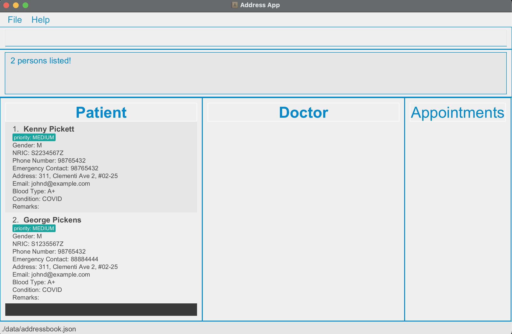

MediLink Contacts (MLC) is a **desktop app for managing patients and doctors details, optimized for use via a Command
Line Interface** (CLI) while still having the benefits of a Graphical User Interface (GUI). If you can type fast, MLC
can get your patients management tasks done faster than traditional GUI apps.

### Table of Contents

* Table of Contents
{:toc}

--------------------------------------------------------------------------------------------------------------------

## Quick start

1. Ensure you have Java `11` or above installed in your Computer. If you don't, install it for your relevant operating
    system at this link https://www.oracle.com/sg/java/technologies/javase/jdk11-archive-downloads.html

2. Download the latest `MediLink.jar` from [here](https://github.com/AY2324S1-CS2103T-T09-3/tp/releases).

3. Copy the file to the folder you want to use as the _home folder_ for your MLC.

4. Open a command terminal, `cd` into the folder you put the jar file in, and use the `java -jar MediLink.jar` command
   to run the application. 
   A GUI similar to the below should appear in a few seconds. Note how the app contains some sample data. 
   

5. Type the command in the command box and press Enter to execute it. e.g. typing **`help`** and pressing Enter will
   open the help window. 
   Some example commands you can try:

    * `list` : Lists all contacts.

    * `add-doctor n/John Doe ic/S9851386G g/M p/98765432 e/johnd@example.com a/John street, block 123, #01-01` : Adds a
      doctor named `John Doe` to the Address Book.

    * `delete ic/S9851386G` : Deletes the person with ic S9851386G.

    * `clear` : Deletes all contacts.

    * `exit` : Exits the app.

6. Refer to the [Features](#features) below for details of each command.

--------------------------------------------------------------------------------------------------------------------
## Parameters

The list below contains the parameters that are used in various commands as well as their various constraints. Failing to input valid parameters will lead to errors when entering commands.

| Parameter           | Constraints                                                                                                                                                                                                                                                                                                                                                                                                                                                                           | Valid Examples                                                                                                  | Invalid Examples                   |
|:--------------------|:--------------------------------------------------------------------------------------------------------------------------------------------------------------------------------------------------------------------------------------------------------------------------------------------------------------------------------------------------------------------------------------------------------------------------------------------------------------------------------------|:----------------------------------------------------------------------------------------------------------------|:-----------------------------------|
| NRIC                | Starting with S or T, followed by 7 numbers, and ends with a letter. Not case-sensitive.                                                                                                                                                                                                                                                                                                                                                                                              | T0123456G, s33344476i                                                                                           | T01234567G, “”, t12367K            |
| Doctor/Patient Name | Empty strings are not allowed. Name must contain only alphanumeric characters.                                                                                                                                                                                                                                                                                                                                                                                                        | Cristiano Ronaldo, Tanveer Singh                                                                                | “”, 高橋紳助, s/o someone              |
| Contact Number      | 3 digit or more integer as phone number. Empty strings are not allowed.                                                                                                                                                                                                                                                                                                                                                                                                               | 91234569                                                                                                        | “”,  99                            |
| Email               | Must be of the format `local-name`@`domain`. `local-name` should only contain alphanumeric characters and these special characters, excluding the parentheses, (+_.-), and may not start or end with any special characters. `domain` is made up of domain labels separated by periods, and must end with a domain label at least 2 characters long. Domain labels start and end with alphanumeric characters, consist of alphanumeric characters, separated only by hyphens, if any. | j@Email.com, isaac@a-b.com                                                                                      | isaac@a+b.com, james.com           |
| Blood Type          | Accepts only strings containing valid blood types, that is a combination of A/B/AB/O and +/-. Letters must be in caps.                                                                                                                                                                                                                                                                                                                                                                | B+, O+, B-, AB+                                                                                                 | J, K, A, O                         |
| Address             | Any non-empty string.                                                                                                                                                                                                                                                                                                                                                                                                                                                                 | Clementi, OneCare@Hougang Avenue                                                                                | ""                                 |
| Gender              | Either the character “M” or “F”. Must be in caps.                                                                                                                                                                                                                                                                                                                                                                                                                                     | M, F                                                                                                            | G, girl, male, f                   |
| Emergency Contact   | Valid Contact number. Same constraints as the Contact Number parameter.                                                                                                                                                                                                                                                                                                                                                                                                               | 91234569                                                                                                        | “”, 99                             |
| Condition           | Any non-empty string.                                                                                                                                                                                                                                                                                                                                                                                                                                                                 | Knee Injury, appendicitis                                                                                       | ""                                 |
| Patient Tag         | Accepts only strings containing valid priority levels, either low, medium or high. Not case-sensitive.                                                                                                                                                                                                                                                                                                                                                                                | low, MEDIUM, hiGh                                                                                               | extreme, med                       |
| Doctor Tag          | Accepts only strings containing valid specialisations. Not case-sensitive. The current allowed specialisations are listed in the examples box.                                                                                                                                                                                                                                                                                                                                        | CARDIOLOGIST, ORTHOPEDIC, PEDIATRICIAN, DERMATOLOGIST, NEUROLOGIST, GENERAL_PRACTITIONER, PSYCHIATRIST, SURGEON | Nurse, Head-Doctor                 |
| Time                | Accepts only strings that follow the specified format (ie. `yyyy-MM-dd HH:mm`), where `HH:mm` follows the 24hr format.                                                                                                                                                                                                                                                                                                                                                                | 2016-10-10 18:00,   2000-01-30 23:59                                                                        | 2005-10-32 18:00, 2016-11-02 27:00 |

## Features

**:information_source: Notes about the command format:** 

* Words in `UPPER_CASE` are the parameters to be supplied by the user. 
  e.g. in `add n/NAME`, `NAME` is a parameter which can be used as `add n/John Doe`.

* Items in square brackets are optional. 
  e.g `n/NAME [t/TAG]` can be used as `n/John Doe t/friend` or as `n/John Doe`.

* Items with `…`​ after them can be used multiple times including zero times. 
  e.g. `[t/TAG]…​` can be used as ` ` (i.e. 0 times), `t/friend`, `t/friend t/family` etc.

* Parameters can be in any order. 
  e.g. if the command specifies `n/NAME p/PHONE_NUMBER`, `p/PHONE_NUMBER n/NAME` is also acceptable.

* Extraneous parameters for commands that do not take in parameters (such as `help`, `list`, `exit` and `clear`) will be
  ignored. 
  e.g. if the command specifies `help 123`, it will be interpreted as `help`.

* If you are using a PDF version of this document, be careful when copying and pasting commands that span multiple lines
  as space characters surrounding line-breaks may be omitted when copied over to the application.

### Viewing help : `help`

Shows a message explaining how to access the help page.

Format: `help`

### Adding a Doctor: `add-doctor`

Adds a Doctor to the clinic database.

Format: `add-doctor n/NAME ic/IC g/GENDER p/PHONE_NUMBER e/EMAIL a/ADDRESS [t/TAG]…​`

:bulb:
**Tip:**
A doctor can have any number of tags (including 0). Duplicate tags, however, are NOT allowed.

**:information_source: Take Note:** 

- A doctor cannot have the same NRIC as another person.
- A person can either be a doctor or a patient, but not both. Hence, if the doctor's NRIC is already in the app
as a patient, it may result in an error.
- Adding additional prefixes (eg. `b/O+`) not specified by the command format above will be considered as a **parameter input**. For example: 
  `add-doctor n/John Doe ic/S9851386G g/M p/98765432 e/johnd@example.com a/John street, block 123, #01-01 b/O+` will result
  in Address inputted as `a/John street, block 123, #01-01 b/O+`.  
  Do avoid adding  your own prefixes as it may lead to unwanted errors!
- However, inputting `r/REMARKS` will be ignored and automatically removed by the system. To add remarks, use the Edit Command mentioned later below.

Examples:

* `add-doctor n/John Doe ic/S9851386G g/M p/98765432 e/johnd@example.com a/John street, block 123, #01-01 t/Pediatrician`
* `add-doctor n/Betsy Crowe ic/S9851586G g/F p/98765433 e/betsycrowe@example.com a/#104-C, Wakanda St 42 t/Surgeon`

### Adding a Patient: `add-patient`

Adds a Patient to the clinic database.

Format: `add-patient n/NAME ic/IC g/GENDER p/PHONE_NUMBER ec/EMERGENCY_CONTACT e/EMAIL a/ADDRESS c/CONDITION b/BLOODTYPE  [t/TAG] ​`

**:information_source: Take Note:** 

- A patient cannot have the same NRIC as another person.
- A person can either be a doctor or a patient, but not both. Hence, if the patient's IC is already in the app
    as a doctor, it may result in an error.
- EMERGENCY_CONTACT must contain valid emergency contact number, which needs to be a valid phone number. This number can be the same the person's contact number.
- A patient can only have up to one tag at any time.
- Adding additional prefixes (eg. `k/Always Injured`) not specified by the command format above will be considered as a **parameter input**. For example: 
  `add-patient n/John Doe ic/S9851386G g/M p/98765432 ec/90123456 e/johnd@example.com a/John street, block 123, #01-01 c/pneumothorax k/Always Injured b/O+` will result
  in Condition inputted as `pneumothorax k/Always Injured`.  
  Do avoid adding  your own prefixes as it may lead to unwanted errors!
- However, inputting `r/REMARKS` will be ignored and automatically removed by the system. To add remarks, use the Edit Command mentioned later below.

Examples:

* `add-patient n/John Doe ic/S9851386G g/M p/98765432 ec/90123456 e/johnd@example.com a/John street, block 123, #01-01 c/pneumothorax b/O+ t/Low`
* `add-patient n/Betsy Crowe ic/S9851586G g/F p/98765433 ec/12345678 e/betsycrowe@example.com a/#104-C, Wakanda St 42 c/AIDS b/O+ t/High`

### Creating an Appointment : `new-appt`

Creates a new appointment for patients.

Format: `new-appt pic/IC dic/IC time/yyyy-MM-dd HH:mm`

**:information_source: Take Note:** 

- All fields are Required.
- PATIENT must contain the valid IC of a Patient in the Database.
- DOCTOR must contain the valid IC of a Doctor in the Database.
- There must not be conflicting Appointments. (eg. the doctor already has an appointment with another patient at the same time) However, the duration of each appointment is flexible and up to the users. As long as appointments are not at the exact same time, users can add it in.

Examples:

* `new-appt pic/T0123456H dic/S9851586G time/2023-10-30 13:00`

### Deleting an Appointment : `delete-appt`

Deletes an existing appointment.

Format: `delete-appt INDEX`

**:information_source: Take Note:** 

- Index is according to the list view in the application.
- Use `list` command to find index of desired appointment.

Examples:

* `delete-appt 1`

### Finding a Appointment : `find-appt`

Finds all appointments that involve a specific patient/doctor.

Format: `find-appt NRIC`

**:information_source: Take Note:** 

- All fields are Required.
- NRIC must contain the valid NRIC of a Patient or Doctor in the Database.
- Either Doctor NRIC or Patient NRIC can be used in the search
- It is recommended to use `list` to restore the view of all data after a `find` command.

Examples:

* `find-appt T0001222Q`

### Listing all persons : `list`

Shows a list of all persons and appointments in the MediLink Contacts.

Format: `list`

### Editing a person : `edit`

Edits an existing person in the MediLink Contacts.

Format: `edit NRIC [n/NAME] [p/PHONE] [e/EMAIL] [a/ADDRESS] [t/TAG]…​`

* Edits the person with the specified `NRIC`. The NRIC **must be a valid IC number**
* At least one of the optional fields must be provided.
* If the provided fields are the same as the original, the command will still work.
* Must edit appropriate fields based on whether the person is a patient or doctor (e.g. can't update condition of a
  doctor).
* Existing values will be updated to the input values.
* When editing tags, the existing tags of the person will be removed i.e adding of tags is not cumulative.
* You can remove all the person’s tags by typing `t/` without
  specifying any tags after it.
* Note: In our app, the Remark Section will be left blank by default. The edit Command can be used to add any miscellaneous info not captured by other fields such as possible allergies, medical history, etc.

Examples:

* `edit T0123456A p/91234567 e/johndoe@example.com g/F` edits the phone number and email address of the 1st person to
  be `91234567` and `johndoe@example.com` respectively.
* `edit S9876543B n/Betsy Crower t/` edits the name of the 2nd person to be `Betsy Crower` and clears all
  existing tags.

### Locating persons by name: `find`

Finds persons that match the query.

Format: `find KEYWORD [MORE_KEYWORDS]`

* When searching names, the search is case-insensitive. e.g `hans` will match `Hans`.
* When searching names, the order of the keywords does not matter. e.g. `Hans Bo` will match `Bo Hans`.
* When searching names, only full words will be matched e.g. `Han` will not match `Hans`.
* When searching names, Persons matching at least one keyword will be returned (i.e. `OR` search).
  e.g. `Hans Bo` will return `Hans Gruber`, `Bo Yang`.
* Note that if the name coincides with other find commands, it will be interpreted as the other find command first and extraneous paremeters will be ignored. e.g. `find F Kennedy John` will search for all female persons. 
* It is recommended to use `list` to restore the view of all data after a `find` command.

Examples:

* `find John` returns `john` and `John Doe`.
* `find kenny pickens` returns `Kenny Pickett`, `George Pickens`.  
  

### Locating a person by NRIC : `find` ###

Finds person that matches the NRIC query.

Format: `find NRIC`

* NRIC input must be capitalised!
* It is recommended to use `list` to restore the view of all data after a `find` command.

Examples:

* `find T1125726G` returns the person with the matching NRIC.

### Locating people by gender : `find M`, `find F` ###

Finds all persons with matching gender.

Format: `find M` or `find F`

* M and F must be capitalised.
* It is recommended to use `list` to restore the view of all data after a `find` command.

Examples:

* `find M` returns all male persons.

### Locating people by blood types : `find Blood Type` ###

Finds all Patients with query blood type.

Format: `find Blood Type QUERY` 

* It is recommended to use `list` to restore the view of all data after a `find` command.

Examples:

* `find Blood Type A+` returns all Patients with blood type A+.

### Deleting a person : `delete`

Deletes the specified person from the address book.

Format: `delete NRIC`

* Deletes the person with the specified NRIC.

Examples:

* `delete S1234567J` deletes Jonathan who has the NRIC `S1234567J`.

### Clearing all entries : `clear`

Clears all entries from the MediLink Contacts.

Format: `clear`

### Undo last action : `undo`

**:information_source: Take Note:** 

- Upon restarting the app, you will no longer be able to undo actions previously performed before exiting the app.

Undoes the effect of the last command.

Format: `undo`

* Can only do up to 5 undos at any one time.

### Redo last action : `redo`

**:information_source: Take Note:** 

- Upon restarting the app, you will no longer be able to redo actions previously undone before exiting the app.

Restores the effects of actions that were previously undone using the undo command. 

Format: `redo`

* Can only do up to 5 redos at any one time.

### Exiting the program : `exit`

Exits the program.

Format: `exit`

### Saving the data

MediLink Contacts data are saved in the hard disk automatically after any command that changes the data. There is no
need to save manually.

### Editing the data file

MediLink Contacts data are saved automatically as a JSON file `[JAR file location]/data/addressbook.json`. Advanced users are welcome to update data directly by editing that data file. However, please ensure that the edits are valid, else it may cause unexpected behaviours when the invalid data is not detected by the system.

:exclamation: **Caution:**
If your changes to the data file makes its format invalid, MediLink Contacts may discard all data and start with an empty data file at the next run. Hence, it is recommended to take a backup of the file before editing it. Some changes may also be invalid, but not detected by the system. In that case, there may be many unexpected behaviours due to those undetected errors.

### Archiving data files `[coming in v2.0]`

_Details coming soon ..._

--------------------------------------------------------------------------------------------------------------------

## FAQ

**Q**: How do I transfer my data to another Computer? 
**A**: Install the app in the other computer and overwrite the empty data file it creates with the file that contains
the data of your previous MediLink Contacts home folder.

--------------------------------------------------------------------------------------------------------------------

## Known issues

1. **When using multiple screens**, if you move the application to a secondary screen, and later switch to using only
   the primary screen, the GUI will open off-screen. The remedy is to delete the `preferences.json` file created by the
   application before running the application again.

--------------------------------------------------------------------------------------------------------------------

## Command summary

| Action                 | Format, Examples                                                                                                                                                                                                                                                                   |
|------------------------|------------------------------------------------------------------------------------------------------------------------------------------------------------------------------------------------------------------------------------------------------------------------------------|
| **New Doctor**         | `add-doctor n/NAME ic/IC g/GENDER p/PHONE_NUMBER e/EMAIL a/ADDRESS [t/TAG]…​`   e.g., `add-doctor n/John Doe ic/S9851386G g/M p/98765432 e/johnd@example.com a/John street, block 123, #01-01 t/Pediatrician`                                                                   |
| **New Patient**        | `add-patient n/NAME ic/IC g/GENDER p/PHONE_NUMBER ec/EMERGENCY_CONTACT e/EMAIL a/ADDRESS [t/TAG] [d/DOCTOR] [c/CONDITION] [b/BLOODTYPE] …​`   e.g., `add-patient n/Betsy Crowe ic/S9851586G g/F p/98765433 e/betsycrowe@example.com a/#104-C, Wakanda St 42 c/AIDS b/O+ t/High` |
| **New Appointment**    | `new-appt pic/IC dic/IC time/yyyy-MM-dd HH:mm`   e.g., `new-appt pic/T0123456H dic/S9851586G time/2023-10-30 13:00`                                                                                                                                                             |
| **Delete Appointment** | `delete-appt INDEX`    e.g., delete-appt 1                                                                                                                                                                                                                                      |
| **Find Appointment**   | `find-appt NRIC`   e.g., find-appt T00012220                                                                                                                                                                                                                                    |
| **Clear**              | `clear`                                                                                                                                                                                                                                                                            |
| **Undo**               | `undo`                                                                                                                                                                                                                                                                             |
| **Redo**               | `redo`                                                                                                                                                                                                                                                                             |
| **Delete**             | `delete NRIC`  e.g., `delete T0666485G`                                                                                                                                                                                                                                         |
| **Edit**               | `edit NRIC [n/NAME] [p/PHONE_NUMBER] [e/EMAIL] [a/ADDRESS] [t/TAG]…​`  e.g.,`edit S9760431H n/James Lee e/jameslee@example.com`                                                                                                                                                 |
| **Find**               | `find KEYWORD [MORE_KEYWORDS]`  e.g., `find James Jake`                                                                                                                                                                                                                         |
| **List**               | `list`                                                                                                                                                                                                                                                                             |
| **Help**               | `help`                                                                                                                                                                                                                                                                             |
| **Exit**               | `exit`                                                                                                                                                                                                                                                                             |

