# HealthSync User Guide

> "HealthSync will be your patient’s best friend, the frontdesk’s right hand, and time’s biggest foe." - Yi Chee, Developer, HealthSync

<br>

<!-- Hopefully this is centered in GH pages, else might need to make changes to css or remove this -->
 

<br>


HealthSync is a **powerful desktop application designed specifically for clinic assistants in small private clinics.** It offers a unique combination of a Command Line Interface (CLI) and a Graphical User Interface (GUI) to efficiently manage and organize patient details. If you're a fast typist, HealthSync can streamline your workflow and help you handle patient information more effectively than traditional GUI apps.

## Why HealthSync?

1. **Tailored for Front Desk Workers**: HealthSync is built with the needs of front desk workers in mind. It provides a user-friendly interface that simplifies patient management tasks, allowing you to focus on providing excellent service to patients.

2. **Fast and Efficient**: With HealthSync's CLI, you can quickly navigate through commands and perform actions without the need to rely solely on a mouse. This saves you valuable time and makes patient data management faster and more efficient.

3. **Comprehensive Patient Details**: HealthSync enables you to store and access comprehensive patient details, including personal information, medical history, appointments, and more. All the essential information you need is organized in one centralized location.

4. **Intuitive GUI Experience**: HealthSync's GUI complements the CLI by providing a visual representation of patient data. The GUI is intuitive and user-friendly, making it easy to view and update patient information with just a few keys.


<!-- * Table of Contents -->
<page-nav-print />

--------------------------------------------------------------------------------------------------------------------

## [Quick start](#quick-start)

1. Ensure you have [Java](#java) `11` or above installed in your Computer.

2. Download the latest `healthsync.jar` from [here](https://github.com/AY2324S1-CS2103T-T14-3/tp/releases).

3. Copy the file to the folder you want to use as the _home folder_ for your HealthSync.

4. Open a command terminal, `cd` into the folder you put the JAR file in, and use the `java -jar healthsync.jar`
   command to run the application.<br>


   A GUI similar to the below should appear in a few seconds. Note how the app contains some sample data.<br>

   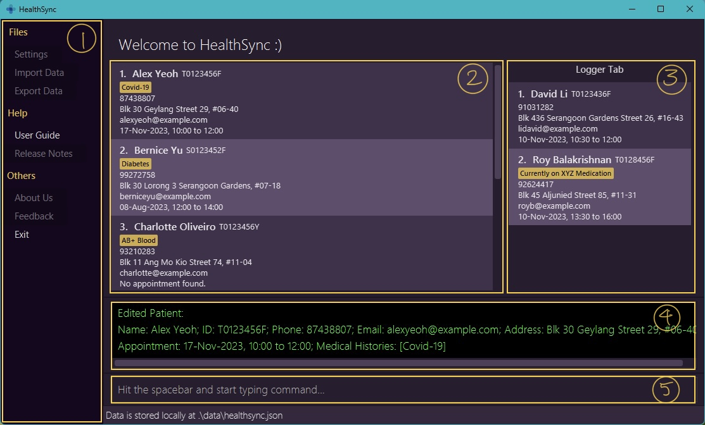


Here are the icons you will see throughout this User Guide and what they mean:
- :bulb: Tips and tricks that will help you get the most out of HealthSync
- :wrench: Example usages of the feature that will help you save time
- :exclamation: Things to take note of while reading the User Guide
- :warning: Things to take caution with, as they may affect your use of HealthSync


> :bulb: The main application consists of these components (as annotated in the image above):
> 1. [Menu Sidebar](#menu-sidebar) `*`
> 2. [Patient List View](#patient-list-view)
> 3. [Logger Tab](#logger-tab)
> 4. [Output Box](#output-box)
> 5. [Command Box](#command-box)

> :bulb: Click on the components in the list above to learn more about them.

> :warning: **`*`**: The buttons that are in grey and not pressable in the Menu Sidebar are currently not functional and will be implemented in a future version of HealthSync.

>:bulb: Longer outputs have to scrolled to be viewed.

5. Type the command in the command box and press Enter to execute it.
   e.g. typing **`help`** and pressing Enter will open the help window.<br>
   Some example commands you can try:

   * `list` : Lists all patients.

   * `add n/John Doe id/S8765432A p/98765432 e/johnd@example.com a/311, Clementi Ave 2, #02-25 ap/17-10-2023 11:00 13:00 m/hypochondriac` : Adds a patient named `John Doe` with the relevant field details to HealthSync.

   * `delete n/Alex Yeoh` : Deletes Alex Yeoh's details from the current list.

   * `clear` : Deletes all patients.

   * `exit` : Exits HealthSync.

6. Refer to the [Features](#features) below for details of each command.

--------------------------------------------------------------------------------------------------------------------

## [Features](#features)

<box type="info" seamless>
    Confused by unfamiliar terms? There is a <a href="#glossary">Glossary</a> section below!<br>
    We will also be highlighting more technical terms throughout this User Guide, so do check out
    the Glossary if you are confused.<br>
    <a href="#glossary" class="badge bg-primary">Check it out here.</a>
</box>

>:exclamation: To enhance the User Guide's clarity, command outputs have been simplified and are now presented with added information indicated by an ellipsis (...).

<br>

### Viewing Help: `help`

Shows a message explaining how to access the help page. The link will bring the user to the User Guide.

Format: `help`

>:bulb: Use `h` as a shortcut to utilise the `help` command

>:bulb: Click on `Copy URL` after entering the `help` command and paste the link in your preferred browser

<br>

### Listing All Patients: `list`

Shows a list of all patients in HealthSync.

Format: `list`

>:bulb: Use `ls` as a shortcut for `list`

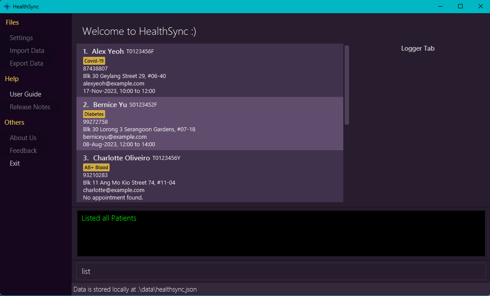

<br>

### Adding a Patient: `add`

Adds a patient into HealthSync, with the given patient information.

> :warning: Once a patient is created, their name and ID cannot be changed later

> :warning: HealthSync does not allow patients with identical names. Similarly, identical IDs are not allowed

* A patient's name and IC are required when creating a new entry into HealthSync.
* All the compulsory fields must be provided.
* Optional fields like appointment and medical history need not be provided.

Format: `add n/NAME id/ID_NUMBER [field] ...`

>:bulb: Use `a` as a shortcut for `add`

Example commands:

* `add n/Aaron Tan Jun Jie id/S8943782H p/98114839 e/example@mailhere a/Serangoon HDB 123`

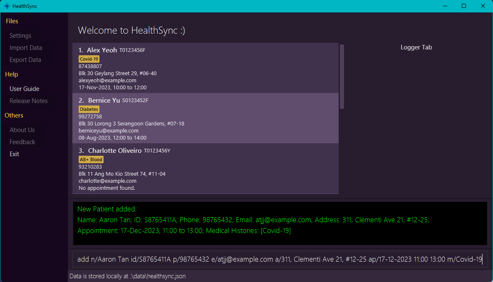

Expected outputs when the command succeeds:
* `New Patient added: ...`

Expected outputs when the command fails:
* `Patient already exists in HealthSync.`
* `Invalid command format! ...`

<br>

### Editing a Patient's Details: `edit`

Edits an existing patient's details in HealthSync.

 * Edits the patient with the specified name or id.
 * If an invalid name or IC Number is passed, an error message will be logged.
 * At least one field to edit must be provided.
 * Existing fields will be updated to the input values.
 * If the fields do not exist, the corresponding field with details will be added.

>:bulb: Update multiple fields in a single `edit` command to save time

Formats:
 * `edit n/NAME [field] ...`
 * `edit id/ID_NUMBER [field] ...`
 * `edit n/NAME id/ID_NUMBER [field] ...`

>:bulb: Use `e` as a shortcut for `edit`

Example commands:
 * `edit n/Alex Yeoh p/91234567 e/alexyeoh@example.com`

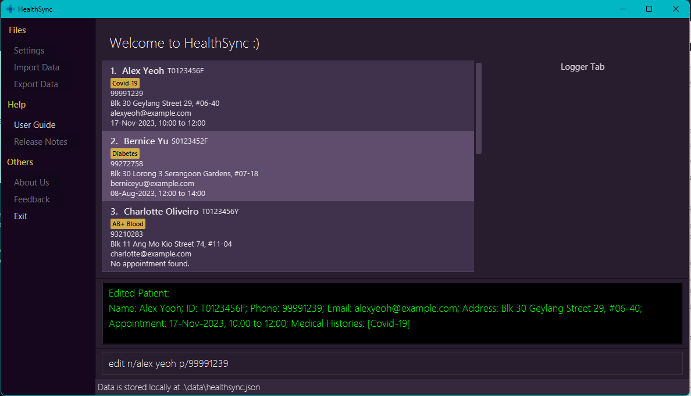

Expected outputs when the command succeeds:
* `Edited patient: ...`

Expected outputs when command fails:
* `INVALID name and/or ID! ...`

<br>

### Deleting a Patient or Field: `delete`

Deletes the specified patient or an optional fields of the patient from HealthSync.

* Deletes the patient or an optional field of the patient with the specified `n/NAME or id/ID_NUMBER`.
* You can choose to delete using only name or ID.
* If both name and ID are used, both must be valid and belong to the same person.
* You can only delete one patient at a time.
* To delete a specified field only instead of the entire patient, we indicate the field after the identification.

Formats:
 * `delete n/NAME [field] ...`
 * `delete id/ID_NUMBER [field] ...`
 * `delete n/NAME id/ID_NUMBER [field] ...`

>:bulb: Use the shortcut `d` for faster patient-deleting

Example commands:

* `delete n/Alex Yeoh`
* `delete n/John Doe m/`

>:bulb: Specify the medical history to be deleted using `m/` if it's only the medical history data that is to be deleted
e.g `delete n/John Doe m/Diabetes`

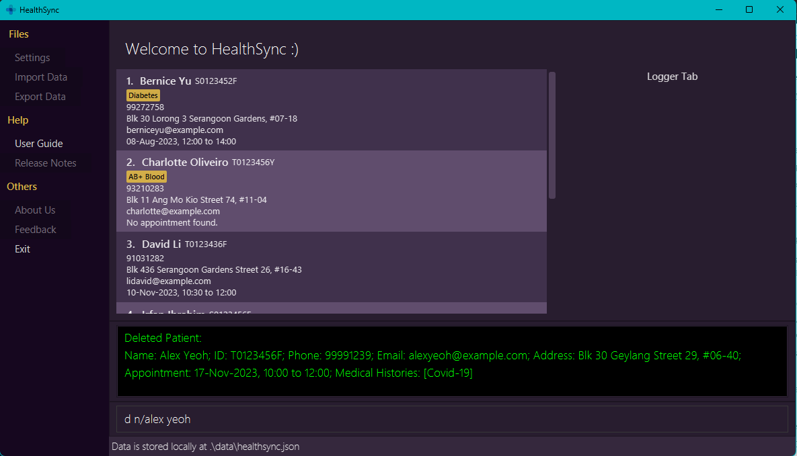

Expected outputs when the command succeeds:
* `Deleted Patient: ...`
* `Deleted Patient's field: ...`

Expected output when the command fails:
* `The given combination of Name and ID does not match any patient in the Patients list`.

<br>

### Delete All Patients: `clear`

Deletes all patients from HealthSync.

>:bulb: Use the undo command to revert accidentally clearing HealthSync

Format: `clear`

>:bulb: Use `c` as a shortcut for `clear`

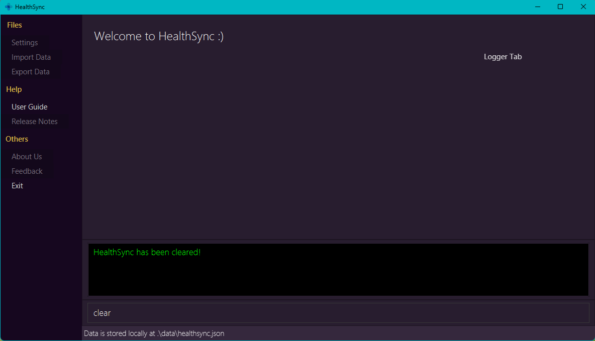

<br>

### Locating Patients by Name, ID or Appointment: `find`

Searches the patient list for all patients matching the name, IC Number or Appointment and returns their related information.

* The search is case-insensitive.
e.g `hans` will match `Hans`, `08-Jan-2023 12 13` will match `08-jan-2023 12 13`.
* The order of the keywords does not matter. e.g. `Hans Bo` will match `Bo Hans`.
* Name, IC Number and Appointment can be searched.
* Only full words will be matched e.g. `Han` will not match `Hans`.
* For the name, only patients matching at least one keyword will be returned (i.e. `OR` search).
  e.g. `Hans Bo` will return `Hans Gruber`, `Bo Yang`.

Formats:
 * `find n/NAME`
 * `find id/ID_NUMBER`
 * `find ap/APPOINTMENT`

>:bulb: Use the shortcut `f` for faster patient-finding

Example commands:
* `find n/Alex Yeoh`
* `find id/T0123436F`
* `find ap/08-Aug-2023 0000 2359`

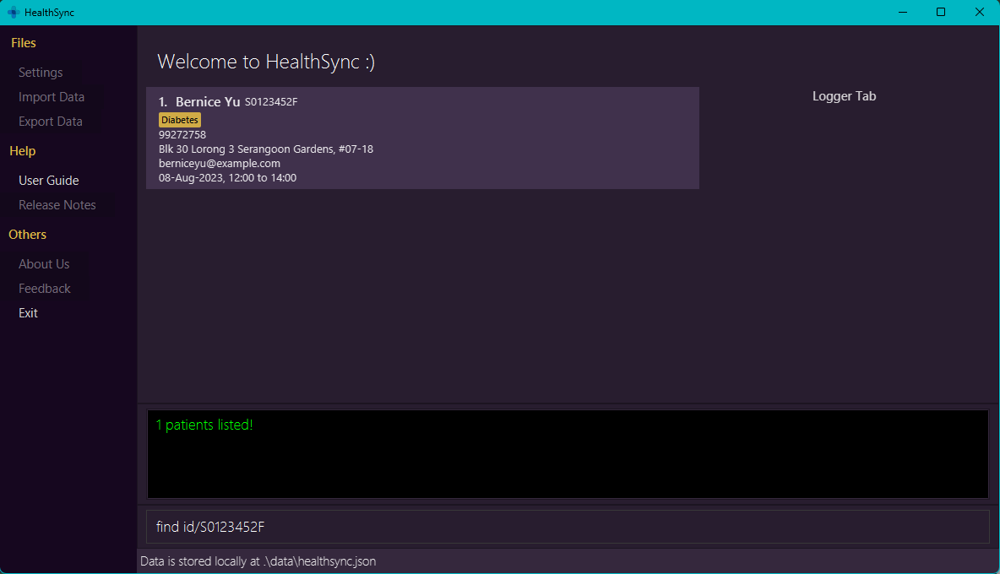

>:bulb: This list command can be used to show the original patient list after a find command is executed

<br>

### Preserving a `find` Command Result in the Log: `log`

Logs the result of the find command to the logger tab, which can be viewed at all times.

Upon app start, the logger tab is pre-populated with profiles of patients who have appointments on the day itself.

This is how it looks like:

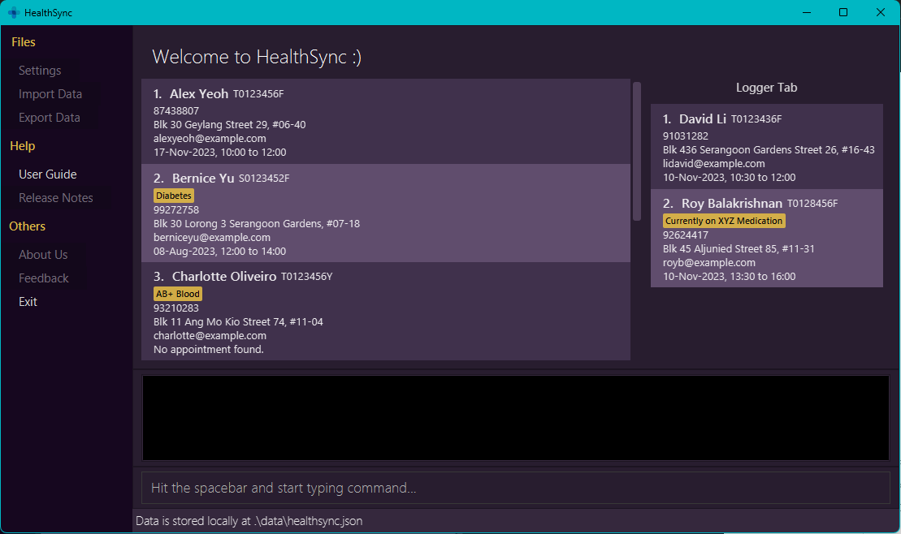


>:bulb: Use `log` command to save data you want to continue referring to

>:wrench: If you want to access the patient list or look up a new patient but would still need to refer to the current patient's details, simply `log` so the profile stays on your screen while you carry out your other tasks!

>:warning: The logger tab does not update when logged patients' profiles are edited or deleted. The logger tab is intended to be a snapshot of the patients' details at the time that they were logged. To reflect the edited changes in the logger tab after a change has been made, do `log` after the change.


* Saving to the logger tab only works for results of the `find` command.
* The entire result will be saved.
* The result will be saved in the same order and format.
* Saving a new result completely clears the current saved result from the logger tab and replaces it.

Format: `log`

>:bulb: Use the shortcut `lo` for faster patient-logging

Example Command: `log` (after entering a FindCommand)

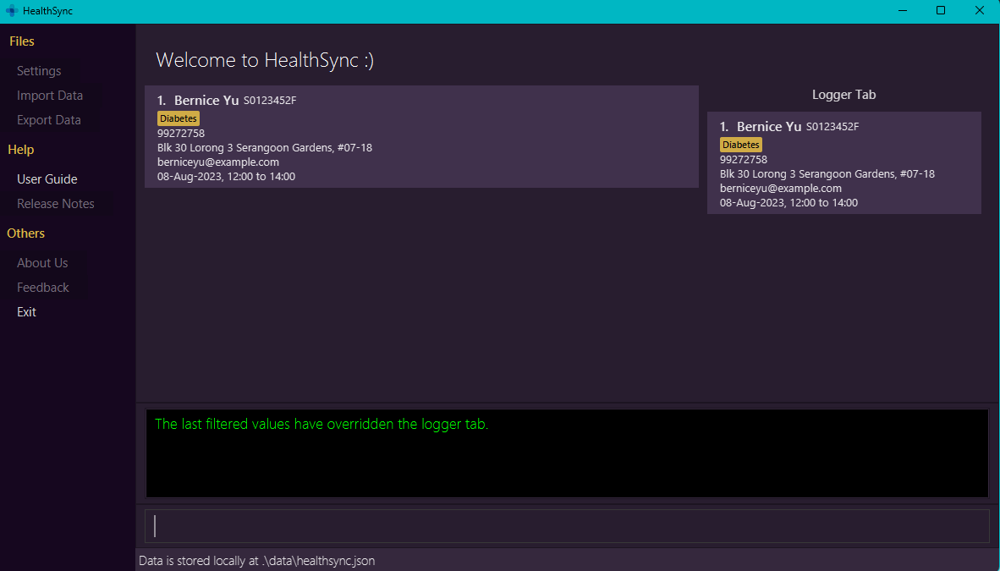

Expected outputs when the command succeeds:
* `The last filtered values have overridden the logger tab.`

Expected output when the command fails:
* `Cannot log an empty list.`

>:bulb: `log` overwrites the data currently in the logger tab, so you do not need to perform clearing prior

<br>

### Adding a New `find` Command Result to the current Log: `alog`

Appends the new results of the most recent find command to the current data in the logger tab, which can be viewed at all times.

>:bulb: Use `alog` to save patient data you want to continue referring to, on top of the profiles you currently have logged

>:wrench: If you have multiple patients you need to toggle between, and do not want to keep doing `find` to retrieve their data, simply `alog` so their profiles stay on your screen for easy access!


* Adding to the logger tab only works for results of the `find` command.
* The previously-saved result will remain the same.
* The entire new result will be saved below the previously-saved result.
* The result will be saved in the same order and format.
* Duplicate persons will not be appended to the log.

Format: `alog`

>:bulb: Use the shortcut `al` for faster log-appending

Example Command: `alog` (after entering a FindCommand)

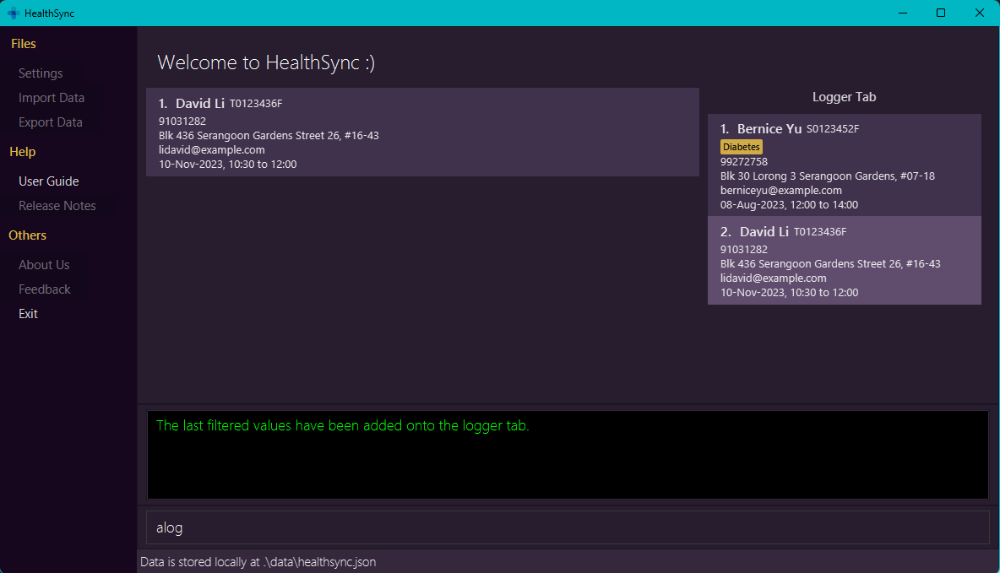

Expected outputs when the command succeeds:
* `The last filtered values have been added onto the logger tab.`

Expected output when the command fails:
* `Cannot log an empty list.`

>:bulb: `alog` does not overwrite the data and instead adds on to it, so you do not have to keep performing `log` to save more data

<br>

### Clearing Data from the Log: `clog`

Clears all current data in the logger tab.

>:bulb: Use `clog` command if you do not need the data in the current logger tab anymore

Format: `clog`

>:bulb:  Use the shortcut `cl` for faster log-clearing

Example Command: `clog`

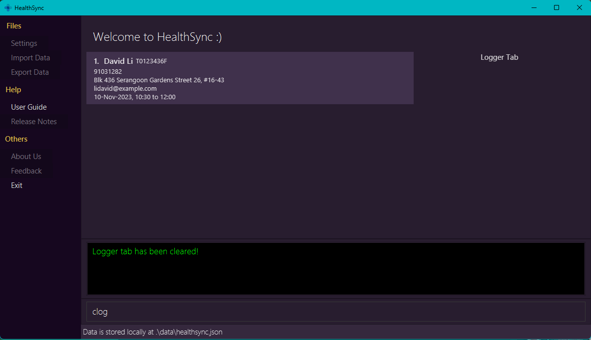

Expected output:
* `Logger tab has been cleared!`

<br>

### Undoing a Command: `undo`

Undoes an undo-able command within HealthSync.

>:warning: Upon closing HealthSync, the undo history will be erased

* An undo-able command include an add, clear, delete, edit, log, alog and clog command.
* The command allows you to undo a specific number of previous commands.
* The command can only undo a positive number of previous commands provided it does not exceed the size of the command history stack.

Format:
* `undo [number]`

>:bulb: Use `u` as a shortcut for `undo`

>:bulb: Simply entering `undo` will undo the last command

Fields that can be deleted:
* Appointment: Include `ap/` behind delete command
* Medical History: Include `m/` behind delete command. Can delete specific Medical History. e.g `m/diabetes`

Example commands:
*  `undo 2`

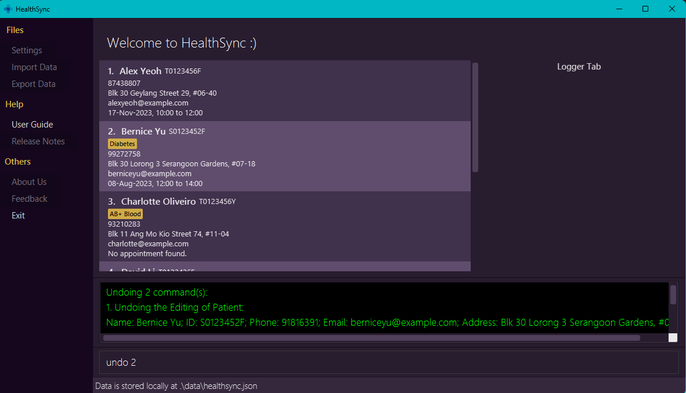

Expected outputs when the command succeeds:

* `Undoing 2 command(s): ...`

Expected outputs when command fails:
* `Please proved a valid number of steps to undo, not exceeding the available command history.`
* `Undo step count cannot be a negative number or zero.`

<br>

### Exiting HealthSync: `exit`

Exits HealthSync.

Format: `exit`

>:bulb: Use `ex` as a shortcut for `exit`

<br>

### Auto Save

HealthSync data are saved in the hard disk automatically after any command that changes the data is executed.
There is no need to save manually.

>:bulb: Only patient details inside patient list view are saved. The logger tab and command history used for `undo` are not saved after the application is closed.

<br>

### Editing the Data File

HealthSync data are saved automatically as a JSON file `[JAR file location]/data/healthsync.json`.
Advanced users are welcome to update data directly by editing that data file.


>:warning: **Caution:**
>If your changes to the data file makes its format invalid, HealthSync will discard all data and start with an empty
>data file at the next run.  Hence, it is recommended to make a backup of the file before editing it.
>
>To make a backup of the file:
>1) Locate the `healthsync.json` data file on your computer. This file is located in the same directory as `healthsync.jar`. The path is `[JAR file location]/data/healthsync.json`.
>2) Right-click on the `healthsync.json` file, and select 'copy'.
>3) Choose the location where you want to store the backup copy. You can create a separate folder for backups or choose any locations of your choice.
>4) Right-click in the chosen location and select 'paste'. This creates a copy of the `healthsync.json` data file in the selected backup location.
>
>That's it! You can now safely edit the original `healthsync.json` file.
>
>If anything goes wrong during the editing process, you can restore your data by copying the backup file back to its original location.

<br>

### Archiving Data Files `[coming in v5.0]`
It allows you to efficiently store and organize patient records in HealthSync. With this feature, you can maintain a tidy and easily accessible archive of patient data, ensuring streamlined data management and quick retrieval when needed.

<br>

## [FAQ](#faq)

**Q**: What operating systems does HealthSync support?<br>
**A**: HealthSync is a cross-platform application and supports Windows, macOS, and Linux. Simply follow the
[installation guide](#quick-start) and download the jar file to use the application.

**Q**: What are the advantages of using a CLI interface in HealthSync over traditional GUI apps?<br>
**A**: HealthSync's CLI interface offers faster data entry and navigation for users who are comfortable with typing.
It streamlines tasks and provides a more efficient way to manage patient details.

**Q**: Can multiple users access HealthSync simultaneously, and how do I set up user accounts?<br>
**A**: HealthSync is currently an application for a single user. Hence, it cannot be accessed simultaneously
by different users.

**Q**: How do I import patient data from external sources into HealthSync?<br>
**A**: The data file that is storing current patient data will be stored in `data/healthsync.json` by default under the same folder.
You may import patient data and store into that file. However, do adhere to the data format present in the current file.

**Q**: How do I transfer my data to another Computer?<br>
**A**: Install the app in the other computer and overwrite the empty data file it creates with the file that contains
       the data of your previous HealthSync home folder.

**Q**: Can I use HealthSync offline, or does it require an internet connection?<br>
**A**: HealthSync is designed to work offline, ensuring you can access and update patient data even when you don't have
an internet connection.

**Q**: What happens if there is a system crash or power outage while I'm using HealthSync?<br>
**A**: HealthSync includes auto-save functionality to minimize data loss in case of unexpected events.
The app will attempt to recover your work upon restart.


--------------------------------------------------------------------------------------------------------------------

<br>

## [Known issues](#known-issues)

1. **When using multiple screens**, if you move the application to a secondary screen, and later switch to using only
   the primary screen, the GUI will open off-screen. The remedy is to delete the `preferences.json` file created by
   the application before running the application again.

<br>

--------------------------------------------------------------------------------------------------------------------

## Glossary

### Command Format

Refers to the standardized way you have to type in your instructions to HealthSync.
Currently, there are 2 main types of Command Formats.

 * [Fielded](#fields) commands, which require you to add additional information behind the instruction.
 * Field-less commands, which do not need you to specify any more information to function.

Fielded Command Formats will generally look like this:
```
<KEYWORD> <words/numbers> identity [field]
```

 * `<KEYWORD>` is the word used to tell HealthSync what to do.
   * Example: to tell HealthSync to add a patient, you would use `add` as the keyword.

 * `<words/numbers>` are special values specific to the instruction type. These are generally
   given after the keyword.

 * `identity` represents compulsory identifying fields that need to be included with for that instruction type.
   * `or` can be specified between 2 identifying fields. This means that you may exclude one of the fields
     for that instruction type.
   * See [Fields](#fields) to understand how identifying fields are specified.

 * `field` refer to the information fields that can be specified in each command.
   * Example: for `add`, you would specify additional information like phone number and address.
   * See [Fields](#fields) to understand how each entry is specified.

 * Square brackets `[...]` indicate that the field is optional to include.

 * `[field] ...` indicate that multiple different field types can be provided.

 * `identity` and `field` can generally be specified in any order.
   * Example: if the command specifies `n/NAME p/PHONE_NUMBER`, `p/PHONE_NUMBER n/NAME` is also acceptable.

Field-less Command Formats will generally look like this:
```
<KEYWORD>
```

 * For field-less commands, only the `<KEYWORD>` will be read by HealthSync, and the rest of the data you give it
   will be ignored.
   * Example: if `help 123` was typed in, HealthSync will interpret it as `help`.

### Fields

Fields are the entries you have to input the patient's information for. These would
include names, phone numbers, appointment times, etc. Fields can be classified into
2 groups:
* Identifying fields, to let you know who the patient is. These are unique to the patient entry.
* Information fields, which gives you other information on the patient.

The 2 identifying fields of a patient are given below:

| Tag   | Representative Value  | Example Usage  | General Form in Commands |
|-------|-----------------------|----------------|--------------------------|
| `n/`  | Name                  | `n/Alex`       | `n/NAME`                 |
| `id/` | Identification Number | `id/S2345678A` | `id/ID_NUMBER`           |

1 or more identifying fields must be specified in each command, unless stated otherwise.

In addition to the identifying fields, information fields can be specified behind commands.
The information fields are given below:

| Tag    | Representative Value | Example Usage              | General Form in Commands | Remarks                         |
|--------|----------------------|----------------------------|--------------------------|---------------------------------|
| `p/`   | Phone Number         | `p/91234567`               | `p/PHONE_NUMBER`         |                                 |
| `e/`   | Email Address        | `e/example@a.com`          | `e/EMAIL`                |                                 |
| `a/`   | Address              | `a/Location, Here Rd`      | `a/ADDRESS`              |                                 |
| `m/`   | Medical History      | `m/Asthmatic`              | `m/MEDICAL_HISTORY`      | Can have multiple of this field |
| `ap/`  | Appointment          | `ap/11-2-2023 11:00 12:00` | `ap/APPT `               |                                 |

Unless stated otherwise, these fields are optional.

#### Name

The standard unique identifier for your patient. Each patient should have a unique alphanumeric name assigned to them.

#### ID

The ID-based unique identifier for your patient. Each patient should have a unique alphanumeric ID assigned to them.

There is no verification system in place for ID. This allows you to use your custom identifier for your patients, if
you wish.

#### Phone Number

A phone number to contact your patients with. Each patient should be assigned to 1 phone number.

Phone numbers must be numeric, and it must be at least 3 digits long. It does not have to be unique.

#### Email Address

An email address to contact your patients with. Each patient should be assigned to 1 email address, which
doesn't need to be unique.

Emails should be in the format `local-part@domainname`.
 * `local-part` is alphanumeric, and may also contain these symbols: `+``_``.``-`
 * `domainname` should be the site that the email leads to, such as `gmail.com`.
 * These must be separated by an `@` symbol.

#### Address

The address to contact your patients. Each patient should be assigned to 1 address that they live in,
and it does not have to be unique.

Addresses do not have a strict format to adhere to.

#### Medical History

The medical history of your patients. These are optional fields to assign to patients, and every
patient can have more than 1 medical history.

Individually, medical histories do not have a strict format to adhere to. However, every medical
history a patient has should be unique from one another.

Medical Conditions are restricted to 50 alphanumeric characters, and may also contain these symbols: `+``_``.``-`.

Some examples of valid Medical History formats are listed here:
```
Hypertension
Covid-19
Pneumonoultramicroscopicsilicovolcanoconiosis
```

#### Appointment

The appointment slot assigned to your patients. A patient may have no appointment assigned to them.
Currently, only 1 appointment may be assigned to a patient at a time.

Appointments should be given in this sequence: `Date, Start Time, End Time`. For example,
`1-Aug-2023, 11:00 13:00` is a valid appointment denoting an appointment on 1st August 2023, from 11am
to 1pm.
 * The month and day of the appointment should always be included.
 * Day can be given as a 1 to 2-digit number. It will only be accepted if the day can exist in that month or year.
 * Month can be given as a 1 to 2-digit number or a 3-letter word. Example: `Jun` and `6` both represent June.
 * The year is optional. If not included, HealthSync assumes it to be this year.
 * The date should be hyphenated.
 * The time should be given in 24-hour clock format, with 00:00 as 12am.
 * Colons are optional when time is given with hours and minutes. If no colons are given, you need to pad the hour with
   a zero when necessary. Example: `1200` for 12 noon, `0900` for 9am.
 * You may exclude minutes if you wish. Example: `15` will be interpreted as 3pm.
 * Date and the 2 Times needs to be separated by a comma or a space.
 * Appointment with the start and end time being the same is valid (ie. 0-minute appointment). HealthSync will register the start time as it is, and register end time as unconfirmed. This is useful for when you are unsure of the end time of an appointment.

Some examples of valid Appointment formats are listed here:
```
1-Nov 8 10
1-11-2023 10 12
03-03-23 0800 1400
4-Sep, 1800, 2000
```

### CLI
Command Line Interface. Refers to computer programs which require you to type to interact with it.

### GUI
Graphical User Interface. Refers to computer programs with a visual window you can interact with directly.

### [Menu Sidebar](#menu-sidebar)
The Menu Sidebar is the area on the left of the Patient List View. It contains buttons that allow you to perform actions on HealthSync. Currently, only the `User Guide` and `Exit` buttons are functional. The buttons that are in grey and not pressable in the Menu Sidebar are currently not functional and will be implemented in a future version of HealthSync.

### [Patient List View](#patient-list-view)
The main part of HealthSync where the list of all your patients are displayed. This is where you can view patient profiles in list form, and perform actions on them. When actions are performed, the Patient List View will be updated to reflect the changes/results.

### [Logger Tab](#logger-tab)
A 'sticky-note'-like area on the right of the Patient List View. Serves as a snapshot of the patient data at the time they were logged with the [`log` command](#preserving-a-find-command-result-in-the-log--log).

This comes in handy when you want to refer to certain patient profiles at the side, while still being able to carry on with other tasks.

To maximise utility, upon app start, the logger tab displays a list of profiles of patients who have appointments on the day itself. This can be overwritten by the `log` command for patient profiles thereafter.

### [Output Box](#output-box)
A small box right below the Patient List View where HealthSync will provide any feedback it has on the instructions
it has performed. This includes error messages, success messages, and other information like example commands.

### [Command Box](#command-box)
The area where you type your instructions for HealthSync to perform.<br>
> :bulb: You can use the `Spacebar` to focus on the Command Box. This allows you to type your instructions without using the mouse to click on the Command Box.

### Command History Stack
The group of instructions HealthSync remembers performing. This group allows HealthSync to undo the
instructions and return your list to an older state. This stack will be cleared when you exit HealthSync.

### Java
A piece of software that our program builds on. In order to use HealthSync, your computer must be running at least
version 11 of Java. [Get it here.](https://www.oracle.com/sg/java/technologies/javase/jdk11-archive-downloads.html)

### JSON
JavaScript Object Notation. This is the file format used by HealthSync to save and store information.

--------------------------------------------------------------------------------------------------------------------

## Command summary

| Action         | Shortcut | Format, Examples                                                                                                                               |
|----------------|----------|------------------------------------------------------------------------------------------------------------------------------------------------|
| **Help**       | `h`      | `help`                                                                                                                                         |
| **List**       | `ls`     | `list`                                                                                                                                         |
| **Add**        | `a`      | `add n/NAME id/ID_NUMBER [field] ...` <br> e.g., `add n/James Ho id/SXXXX123D p/91234567 a/A Estate, Clementi Rd, 1234665 e/james@example.com` |
| **Edit**       | `e`      | `edit n/NAME [field] ...` <br>`edit id/ID_NUMBER [field] ... `<br> e.g.,`edit n/James Lee e/jameslee@example.com`                                 |
| **Delete**     | `d`      | `delete n/NAME [field] ...`<br> `delete id/ID_NUMBER [field] ...` <br> e.g., `delete n/Alex Yeoh m/Diabetes`                                                                                                           |
| **Clear**      | `c`      | `clear`                                                                                                                                        |
| **Find**       | `f`      | `find n/NAME` <br> `find id/ID_NUMBER` <br> `find ap/APPOINTMENT` <br> e.g., `find n/James Jake` *or* `find id/T0123436F` *or* `find ap/08-aug-2023 0000 2359`                                  |
| **Log**        | `l`      | `log`                                                                                                                                          |
| **Append Log** | `al`     | `alog`                                                                                                                                         |
| **Clear Log**  | `cl`     | `clog`                                                                                                                                         |
| **Undo**       | `u`      | `undo`                                                                                                                                         |
| **Exit**       | `e`      | `exit`                                                                                                                                         |
