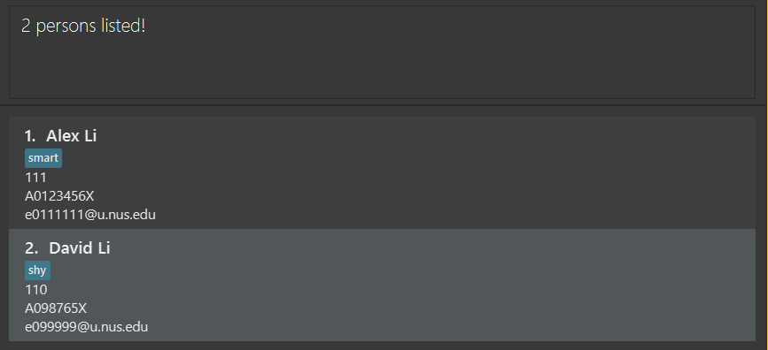
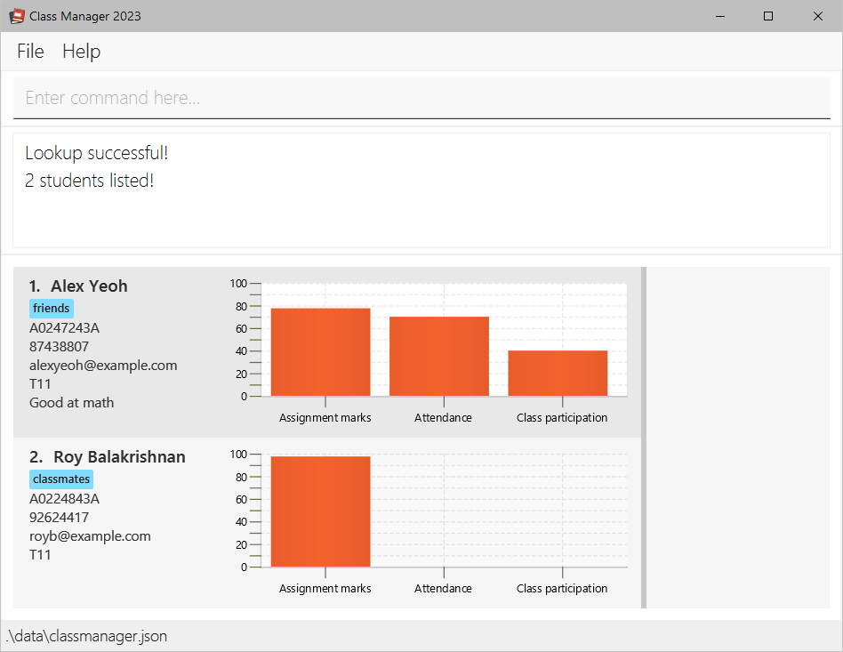

# Class Manager 2023 User Guide

Class Manager 2023 (CM 23) is a **desktop app for managing your students' contacts,
optimized for use via a Command Line Interface** (CLI) while still having the benefits of a
Graphical User Interface (GUI). If you can type fast, CM 23 can get your contact
management tasks done faster than traditional GUI apps.

<!-- * Table of Contents -->
<page-nav-print />

--------------------------------------------------------------------------------------------------------------------

## Quick start

1. Ensure you have Java `11` or above installed in your Computer.

2. Download the latest `ClassManager.jar` from [here](https://github.com/AY2324S1-CS2103T-T11-1/tp/releases).

3. Copy the file to the folder you want to use as the _home folder_ for your ClassManager.

4. Open a command terminal, `cd` into the folder you put the jar file in, and use the `java -jar classmanager.jar` command to run the application. 
   A GUI similar to the below should appear in a few seconds. Note how the app contains some sample data. 
   

5. Type the command in the command box and press Enter to execute it. e.g. typing **`help`** and pressing Enter will open the help window. 
   Some example commands you can try:

   * `list` : Lists all student details.
     
   * `add n/John Doe p/98765432 e/johnd@example.com s/A0245234A c/T11` : Adds a student named `John Doe` to the Class Manager.

   * `delete 3` : Deletes the 3rd student detail shown in the current list.

   * `clear` : Deletes all student details.

   * `exit` : Exits the app.

6. Refer to the [Features](#features) below for details of each command.

--------------------------------------------------------------------------------------------------------------------

## Features

<box type="info" seamless>

**Notes about the command format:** 

* Words in `UPPER_CASE` are the parameters to be supplied by the user. 
  e.g. in `add n/NAME`, `NAME` is a parameter which can be used as `add n/John Doe`.

* Items in square brackets are optional. 
  e.g. `n/NAME [t/TAG]` can be used as `n/John Doe t/friend` or as `n/John Doe`.

* Items with `…`​ after them can be used multiple times including zero times. 
  e.g. `[t/TAG]…​` can be used as ` ` (i.e. 0 times), `t/friend`, `t/friend t/family` etc.

* Parameters can be in any order. 
  e.g. if the command specifies `n/NAME c/CLASS_NUMBER`, `c/CLASS_NUMBER n/NAME` is also acceptable.

* Extraneous parameters for commands that do not take in parameters (such as `help`, `list`, `exit` and `clear`) will be ignored. 
  e.g. if the command specifies `help 123`, it will be interpreted as `help`.

* If you are using a PDF version of this document, be careful when copying and pasting commands that span multiple lines as space characters surrounding line-breaks may be omitted when copied over to the application.
</box>

### Viewing help : `help`

Shows a message explaining how to access the help page.

Format: `help`

### Adding a student : `add`

This feature in Class Manager 2023 is a robust tool that empowers CS2103T TAs to add new student information according
to the specified parameters (FIRST NAME, LAST NAME, SCHOOL EMAIL, CLASS NUMBER, and STUDENT NUMBER, TAG[Optional]).

Format: `add n/NAME p/PHONE_NUMBER e/EMAIL s/STUDENT_NUMBER c/CLASS_NUMBER [t/TAG]…​`

* **ALL** the fields must be provided.
* The FIRST NAME and LAST NAME fields are case-sensitive.
* SCHOOL EMAIL and STUDENT NUMBER needs to be unique

<box type="tip" seamless>

**Tip:** A student can have any number of tags (including 0)
</box>

Examples:
* `add n/ Ngee Yong Lim e/ e0930481@u.nus.edu c/ T11 s/ A0249112A t/Best Student t/Possible TA`
* `add n/ Boh Shin Yeo e/ e09301234@u.nus.edu c/ T5 s/ A0126362A`

### Listing all student details : `list`

Shows a list of all student details in the class manager.

Format: `list`

### Editing a student : `edit`

Edits an existing student in the address book.

Format: `edit INDEX [n/NAME] [p/PHONE_NUMBER] [e/EMAIL] [a/ADDRESS]​`

* Edits the student at the specified `INDEX`. The index refers to the index number shown in the displayed student list. The index **must be a positive integer** 1, 2, 3, …​
* At least one of the optional fields must be provided.
* Existing values will be updated to the input values.

Examples:
*  `edit 1 p/91234567 e/johndoe@example.com` Edits the phone number and email address of the 1st student to be `91234567` and `johndoe@example.com` respectively.
*  `edit 2 n/Betsy Crower` Edits the name of the 2nd student to be `Betsy Crower`.

### Tagging a student : `tag`

Tags the existing student in the address book.

Format: `tag STUDENT_NUMBER [/add] [/delete] t/[TAG]…​`

* Tags the student with the specified `STUDENT_NUMBER`. 
* When editing tags without `/add` or `/delete`, the existing tags of the student will be removed.
* You can remove all the student’s tags by typing without `/add` and `/delete` 
  and `t/` without specifying any tags after it.

Examples:
* `tag A1234567N t/smart t/shy t/funny` replace all tags of the specified student with smart, shy and funny.
* `tag A1234567N /add t/Java` adds the Java tag to specified student.
* `tag A1234567N /delete t/shy` removes the shy tag from the specified student.
* `tag A1234567N t/` clear all tags from the specified student.

### Lookup students : `lookup`

**TL;DR:** Lookup student details containing any of the given fields.

This feature in Class Manager 2023 is a robust tool that empowers CS2103T TAs to 
efficiently search for and access student information based on specific criteria. 
This feature offers both broad and granular search capabilities, enabling TAs to
list all students from a particular class or narrow down their search by providing
one or more lookup parameters.

Format: `lookup [c/CLASS_NUMBER] [n/NAME] [p/PHONE_NUMBER] [e/EMAIL] [s/STUDENT_NUMBER] [t/TAG]`

<box type="warning" seamless>

**Caution:**
_At least one_ of the optional fields must be provided. `lookup` alone is not allowed.
</box>

* The command is **case-insensitive**. e.g. `hans` will match `Hans`
* Only **full words** will be matched e.g. `Han` will not match `Hans`
* The order of the fields does **not** matter. e.g. `lookup n/li c/T11` will return the same result as `lookup c/T11 n/li`
* Field with nothing will be ignored. e.g. `lookup n/ c/T11` will return the same result as `lookup c/T11`.
* This command can take multiple words per field. e.g. `lookup c/T11 T12` will return all students in `T11` or `T12`.

Examples:

* `lookup n/Alex David` returns `Alex Li`, `David Li` 
     
* `lookup c/T11` returns all students in class number T11 
  

### Deleting a student : `delete`

Deletes the specific student.

Format: `delete s/STUDENT_NUMBER`

* The STUDENT NUMBER must be valid and exist. 

Examples:
* `delete s/A0249112A`

### Clearing all entries : `clear`

Clears all entries from the address book.

Format: `clear`

### Exiting the program : `exit`

Exits the program.

Format: `exit`

### Saving the data

Class Manager 2023 data is saved in the hard disk automatically after any command that changes the data. There is no need to save manually.

### Editing the data file

Class Manager 2023 data is saved automatically as a JSON file `[JAR file location]/data/addressbook.json`. Advanced users are welcome to update data directly by editing that data file.

<box type="warning" seamless>

**Caution:**
If your changes to the data file makes its format invalid, Class Manager 2023 will discard all data and start with an empty data file at the next run.  Hence, it is recommended to take a backup of the file before editing it.
</box>

### Loading the data file: `load`

Load student information from an existing JSON file. Copy the JSON file to be loaded into the data folder. The data in the JSON file will be loaded into the app. The file also becomes the new default save file.

Format: `load f/FILE_NAME`
* File name does not need to include .json extension.
* File name is case-insensitive

Examples:
* `load f/export-v1` loads the export-v1.json file in the data folder.

### Archiving data files `[coming in v2.0]`

_Details coming soon ..._

--------------------------------------------------------------------------------------------------------------------

## FAQ

**Q**: How do I transfer my data to another Computer? 
**A**: Install the app in the other computer and overwrite the empty data file it creates with the file that contains the data of your previous Class Manager 2023 home folder.

--------------------------------------------------------------------------------------------------------------------

## Known issues

1. **When using multiple screens**, if you move the application to a secondary screen, and later switch to using only the primary screen, the GUI will open off-screen. The remedy is to delete the `preferences.json` file created by the application before running the application again.

--------------------------------------------------------------------------------------------------------------------

## Command summary

Action     | Format, Examples
-----------|----------------------------------------------------------------------------------------------------------------------------------------------------------------------
**Add**    | `add n/NAME p/PHONE_NUMBER e/EMAIL a/ADDRESS [t/TAG]…​`   e.g `add n/James Ho p/22224444 e/jamesho@example.com a/123, Clementi Rd, 1234665 t/friend t/colleague`
**Clear**  | `clear`
**Delete** | `delete s/STUDENT_NUMBER`  e.g. `delete s/A0249112A`
**Edit**   | `edit INDEX [n/NAME] [p/PHONE_NUMBER] [e/EMAIL] [a/ADDRESS]​`  e.g.`edit 2 n/James Lee e/jameslee@example.com`
**Tag**    | `tag STUDENT_NUMBER [/add] [/delete] t/[TAG]…​`   e.g. `tag A0123456N t/smart t/shy`
**Lookup** | `lookup [c/CLASS_NUMBER] [n/NAME] [p/PHONE_NUMBER] [e/EMAIL] [s/STUDENT_NUMBER] [t/TAG]`   e.g. `lookup c/T11`
**List**   | `list`
**Help**   | `help`
**Load**   | `load f/FILE_NAME`
