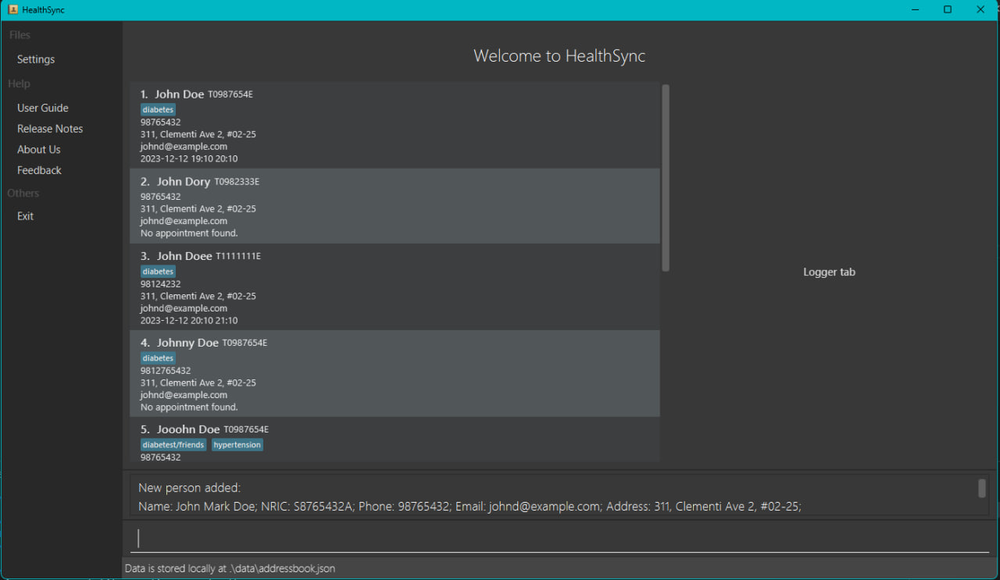
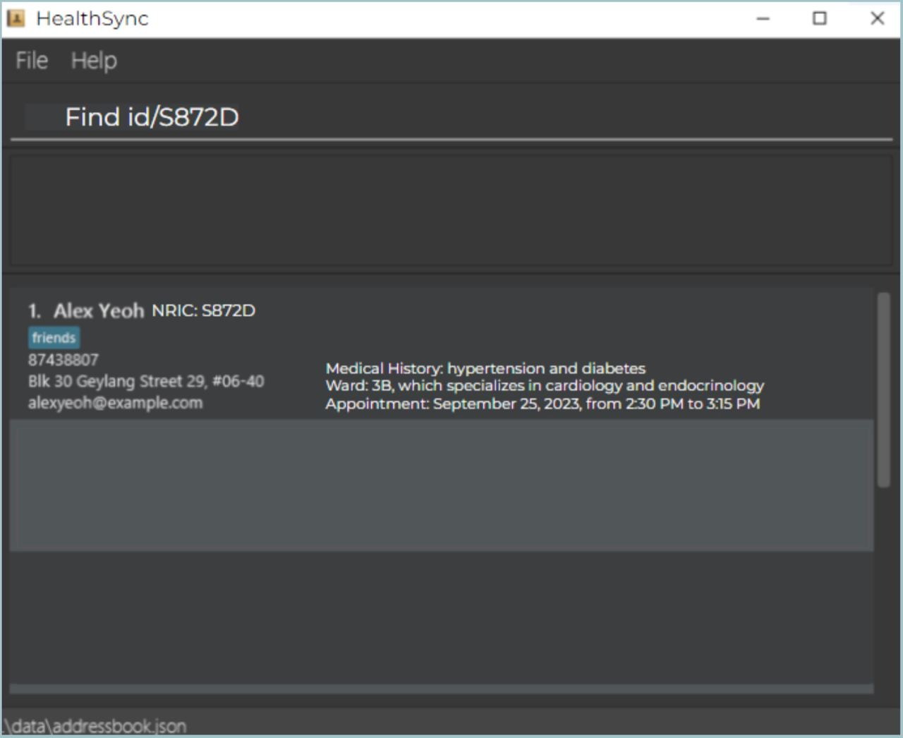

# HealthSync User Guide

HealthSync is a **desktop app for managing patient details, optimised for use via a Command Line Interface** (CLI)
while still having the benefits of a Graphical User Interface (GUI). If you can type fast, HealthSync can help you
organise and manage patient details faster than traditional GUI apps.

<!-- * Table of Contents -->
<page-nav-print />

--------------------------------------------------------------------------------------------------------------------

## Quick start

1. Ensure you have Java `11` or above installed in your Computer.

2. Download the latest `healthsync.jar` from [here](https://github.com/AY2324S1-CS2103T-T14-4/tp/releases).

3. Copy the file to the folder you want to use as the _home folder_ for your HealthSync.

4. Open a command terminal, `cd` into the folder you put the jar file in, and use the `java -jar healthsync.jar`
   command to run the application. 

   A GUI similar to the below should appear in a few seconds. Note how the app contains some sample data. 
   

5. Type the command in the command box and press Enter to execute it.
   e.g. typing **`help`** and pressing Enter will open the help window. 
   Some example commands you can try:

   * `list` : Lists all patients.

   * `add n/John Doe id/S8943782H p/98114839` : Adds a patient named `John Doe` with the relevant field details to HealthSync.

   * `delete n/Alex Yeoh` : Deletes Alex Yeoh's details from the current list.

   * `clear` : Deletes all patients.

   * `exit` : Exits the app.

6. Refer to the [Features](#features) below for details of each command.

--------------------------------------------------------------------------------------------------------------------

## Features

<box type="info" seamless>

**Notes about the command format:** 

* Words in `UPPER_CASE` are the parameters to be supplied by the user. 
  e.g. in `add n/NAME`, `NAME` is a parameter which can be used as `add n/John Doe`.

* The word `or` indicates that at least one of the fields has to be supplied by the user.
  The output `or` will return the above field that was supplied by the user.
* `[field]` are optional tags that can be added after a command.

* `[field] …` indicate that multiple fields can be supplied by the user.

* `[field] …` can be in any order.

* Parameters can be in any order. 
  e.g. if the command specifies `n/NAME p/PHONE_NUMBER`, `p/PHONE_NUMBER n/NAME` is also acceptable.

* Extraneous parameters for commands that do not take in parameters (such as `help`, `list`, `exit` and `clear`)
  will be ignored. 
  e.g. if the command specifies `help 123`, it will be interpreted as `help`.

* If you are using a PDF version of this document, be careful when copying and pasting commands that span multiple lines
  as space characters surrounding line-breaks may be omitted when copied over to the application.
</box>

### Common Shared Fields

The 2 identifying parameters of a patient are given below:

| Tag   | Representative Value  | Example Usage  | General Form in Commands |
|-------|-----------------------|----------------|--------------------------|
| `n/`  | Name                  | `n/Alex`       | `n/NAME`                 |
| `id/` | Identification Number | `id/S2345678A` | `id/IC_NUMBER`           |

1 or more identifying parameters must be specified in each command, unless stated otherwise.

`[field]` are common optional fields that can be specified behind commands. The common optional fields are:

| Tag      | Representative Value   | Example Usage         | General Form in Commands | Remarks                         |
|----------|------------------------|-----------------------|--------------------------|---------------------------------|
| `p/`     | Phone Number           | `p/91234567`          | `p/PHONE_NUMBER`         |                                 |
| `e/`     | Email Address          | `e/example@a.com`     | `e/EMAIL`                |                                 |
| `a/`     | Address                | `a/Location, Here Rd` | `a/ADDRESS`              |                                 |
| `m/`     | Medical History        | `m/Asthmatic`         | `m/MEDICAL_HISTORY`      |                                 |
| `start/` | Appointment Start Time | `start/Nov 11, 9AM`   | `start/APPT_START`       | Must be paired with `/end`      |
| `end/`   | Appointment End Time   | `end/Nov 11, 12PM`    | `end/APPT_END`           | Must be paired with `/start`    |

### Auto Save

HealthSync data are saved in the hard disk automatically after any command that changes the data.
There is no need to save manually.

### Viewing help: `help`

Shows a message explaining how to access the help page.

Format: `help`

### Adding a patient: `add`

Adds a patient into the program, with the given patient information.

* A patient's name and IC are required when creating a new entry into the program.

Format: `add n/NAME id/IC_NUMBER [field] ...`

Example commands:
 * `add n/Aaron Tan Jun Jie id/S8943782H p/98114839`

Expected outputs when the command succeeds:
 * `Patient Aaron Tan Jun Jie has been added with the fields: id/S8943782H p/98114839`

Expected outputs when the command fails:
 * `Unable to add the patient to the database: Patient already exists.`
 * `Unable to add the patient to the database: IC required.`

### Listing all persons: `list`

Shows a list of all persons in the address book.

Format: `list`

### Editing a patient's details: `edit`

Edits an existing patient's details in the address book.

 * Edits the person with the specified name or id.
 * If an invalid name or id is passed, an error message will be logged.
 * At least one of the optional fields must be provided.
 * Existing fields will be updated to the input values.
 * If the fields do not exist, the corresponding field with details will be added.

Format: `edit n/NAME or id/IC_NUMBER [field] ...`

Example commands:
 * `edit n/John Doe p/91234567 e/johndoe@example.com`

Expected outputs when the command succeeds:
* `Patient John Doe has been updated with the fields:  p/91234567 e/johndoe@example.com`

Expected outputs when command fails:
* `Unable to edit the patient: Patient identification does not exist.`

### Locating persons by name or NRIC: `find`

Searches the patient list for all patients matching the name or NRIC and returns their related information.

 * The search is case-insensitive. e.g `hans` will match `Hans`.
 * The order of the keywords does not matter. e.g. `Hans Bo` will match `Bo Hans`.
 * Only the name or IC number is searched.
 * Only full words will be matched e.g. `Han` will not match `Hans`.
 * For the name, only persons matching at least one keyword will be returned (i.e. `OR` search).
   e.g. `Hans Bo` will return `Hans Gruber`, `Bo Yang`.

Format: `find n/NAME` *or* `id/IC_NUMBER`

Example commands:
* `find n/John` returns `john` and `John Doe`
* `find id/S872D` returns `Alex Yeoh`, with IC number `S872D`  

  

Expected outputs when the command succeeds:
 * `Patient n/NAME or id/IC_NUMBER: [field] …`

Expected output when the command fails:
 * `Unable to find the patient. Check if the patient’s information is correct.`

### Preserving a `find` command result: `save`

Logs the result of the find command to the logger tab, which can be viewed at all times.

* Saving to the logger tab only works for results of the `find` command.
* The entire result will be saved.
* The result will be saved in the same order and format.
* Saving a new result clears the current saved result from the logger tab and replaces it.

Format: `save`

Expected outputs when the command succeeds:
* `Results have been saved to the logger tab.`

Expected output when the command fails:
* `Unable to save to the logger tab. Check if a find command was entered prior.`

### Deleting a person or field: `delete`

Deletes the specified person or the fields for the person from HealthSync.

* Deletes the person with the specified `n/NAME or id/IC_NUMBER`.
* The name or ic number must be a valid input.
* To delete a specified field only instead of the entire person, we indicate the field behind of the identification.
* If multiple people has the same name, HealthSync will display a list of people with that name together with their IC number.

Format: `delete n/NAME or id/IC_NUMBER [field]`

Example commands:
* `delete id/S9987362H` deletes all the details of the person with the specified IC number from HealthSync.
* `delete n/John Doe` deletes all the details of John Doe from HealthSync.
* `delete n/John Doe p/` deletes John Doe phone number from his profile.

Expected outputs when the command succeeds:
 * `Patient n/NAME or id/IC_NUMBER has been removed from the database`
 * `The [field] of Patient n/NAME or id/IC_NUMBER has been removed from the database`

Expected output when the command fails:
 * `Error code’s message (i.e. Invalid NRIC/ Invalid Field(s) / Database Error) `

<!--
Original format, can consider using
list followed by delete 2 deletes the 2nd person in the address book.
find Betsy followed by delete 1 deletes the 1st person in the results of the find command.
-->

### Delete all patients: `clear`

Deletes all patients from the program.

Format: `clear`

### Exiting the program: `exit`

Exits the program.

Format: `exit`

### Editing the data file

HealthSync data are saved automatically as a JSON file `[JAR file location]/data/healthsync.json`.
Advanced users are welcome to update data directly by editing that data file.

<box type="warning" seamless>

**Caution:**
If your changes to the data file makes its format invalid, HealthSync will discard all data and start with an empty
data file at the next run.  Hence, it is recommended to take a backup of the file before editing it.
</box>

### Archiving data files `[coming in v2.0]`

_Details coming soon ..._

--------------------------------------------------------------------------------------------------------------------

## FAQ

**Q**: How do I transfer my data to another Computer? 
**A**: Install the app in the other computer and overwrite the empty data file it creates with the file that contains
       the data of your previous HealthSync home folder.

--------------------------------------------------------------------------------------------------------------------

## Known issues

1. **When using multiple screens**, if you move the application to a secondary screen, and later switch to using only
   the primary screen, the GUI will open off-screen. The remedy is to delete the `preferences.json` file created by
   the application before running the application again.

--------------------------------------------------------------------------------------------------------------------

## Command summary

| Action     | Format, Examples                                                                                                           |
|------------|----------------------------------------------------------------------------------------------------------------------------|
| **Add**    | `add n/NAME id/IC_NUMBER [field] ...`   e.g., `add n/James Ho id/SXXXX123D p/91234567 a/A Estate, Clementi Rd, 1234665` |
| **Clear**  | `clear`                                                                                                                    |
| **Delete** | `delete n/NAME [field]` *or* `delete id/IC_NUMBER [field]`  e.g., `delete n/John Doe e/`                                |
| **Edit**   | `edit n/NAME [field]` *or* `edit id/IC_NUMBER [field] ... `  e.g.,`edit n/James Lee e/jameslee@example.com`             |
| **Find**   | `find n/NAME [field]` *or* `find id/IC_NUMBER [field]`  e.g., `find n/James Jake` *or* `find id/S872D`                  |
| **List**   | `list`                                                                                                                     |
| **Help**   | `help`                                                                                                                     |
