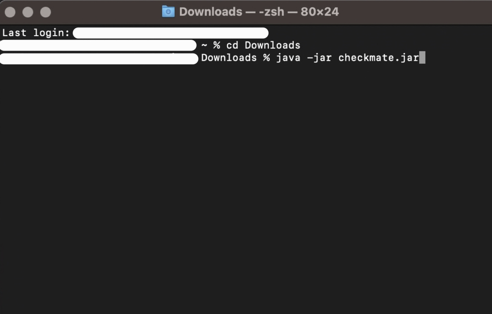

# CheckMate User Guide

---

<strong>Product Description</strong>

## Product Description

CheckMate is a **desktop app for streamlining the process of room bookings by hotel employees, optimized for use via a Command Line Interface** (CLI) while still having the benefits of a Graphical User Interface (GUI). If you can type fast, you can maximise real-time room searching, service scheduling, and amenity management. Optimized for administrative roles, it ensures that room allocation and guest needs are seamlessly addressed.

---

<strong>Table of Contents</strong>

## Table of Contents

* Table of Contents
{:toc}

---

<strong>Quick start</strong>

## Quick start

1. Ensure you have Java `11` or above installed in your Computer.

2. Download the latest `checkmate.jar` from [here](https://github.com/AY2324S1-CS2103T-F10-1/tp/releases).

3. Copy the file to the folder you want to use as the _home folder_ for your CheckMate.

4. Open a command terminal, `cd` into the folder you put the jar file in, and use the `java -jar checkmate.jar` command to run the application. 
   Kindly follow the example below, but do note that the `checkmate.jar` file in the example is in the `Downloads` folder.  
   

5. A GUI similar to the below should appear in a few seconds. Note how the app contains some sample data. 
   

6. Double-clicking on a booking will allow you to see its details.
   

7. Here is a quick summary of the Graphical User Interface (GUI), or what you can see on your screen right now.
   

8. Type the command in the command box and press Enter to execute it. e.g. typing **`help`** and pressing Enter will open the help window. 
   Some example commands you can try:

    * `help` : Access the help page.
   
    * `list` : Lists all bookings.

    * `add r/1 d/2023-11-03 08:00 to 2023-11-04 11:00 n/Aikenot Dueet p/98765432 e/aikenotdueet@gmail.com` : Adds a booking for the room number `1` to the Bookings Book.

    * `edit 1 p/91234567 e/johndoe@gmail.com`: Edits the first booking to specified details.
   
    * `find 1 Aikenot`: Finds bookings which contain room number 1 and the name Aikenot.
   
    * `delete 3` : Deletes the 3rd booking shown in the current list.

    * `clear` : Deletes all booking.

    * `undo` : Undoes the most recent deletion.

    * `exit` : Exits CheckMate and closes the application.

9. Refer to the [Commands](#commands) below for details of each command.

---

<strong>Formats</strong>

## Input Formats

<strong>Command Format</strong>

### Command Format

* Words in `UPPER_CASE` are the parameters to be supplied by the user. 
  e.g. in `add n/NAME`, `NAME` is a parameter which can be used as `add n/John Doe`.

* Items in square brackets are optional. 
  e.g `n/NAME [rk/REMARK]` can be used as `n/John Doe rk/Extra Pillows` or as `n/John Doe`.

* Parameters can be in any order. 
  e.g. if the command specifies `r/ROOM d/BOOKING_PERIOD`, `d/BOOKING_PERIOD r/ROOM` is also acceptable.

* Extraneous parameters for commands that do not take in parameters (such as `help`, `list`, `exit`, `undo` and `clear`) will be ignored. 
  e.g. if the command specifies `help 123`, it will be interpreted as `help`.

* If you are using a PDF version of this document, be careful when copying and pasting commands that span multiple lines as space characters surrounding line-breaks may be omitted when copied over to the application.

---

<strong>Parameter Format</strong>

### Parameter Format

* `r/ROOM`: `ROOM` can be any integer from 1 to 500 inclusive.
* `d/BOOKING_PERIOD`: `BOOKING_PERIOD` is in the format `YYYY-MM-dd HH:mm to YYYY-M-dd HH:mm` where the end to the period must come after the start.
* `n/NAME`: `NAME` can be any String within 50 characters, and it should not be blank.
* `p/PHONE_NUMBER`: `PHONE_NUMBER` can be any positive integer between 3 and 15 digits in length (inclusive).
* `e/EMAIL`: `EMAIL` is in the format `local-part@domain` with a 50-character limit. The local-part should only contain
  alphanumeric characters and these special characters, excluding the parentheses, (+_.-). The local-part may not start
  or end with any special characters. This is followed by a '@' and then a domain name. The domain name is made up of
  domain labels separated by periods. The domain name must end with a domain label that is supported:
    * gmail, yahoo, outlook, hotmail, icloud.
* `rk/REMARK`: `REMARK` can be any String less than or equal to 50 characters in length.

---

<strong>Commands</strong>

## Commands

<strong>help</strong>

### Viewing help : `help`

Shows a message explaining how to access the help page.

Format: `help`

---

<strong>add</strong>

### Adding a booking: `add`

Adds a booking to the bookings book.

Format: `add r/ROOM d/BOOKING_PERIOD n/NAME p/PHONE_NUMBER e/EMAIL rk/REMARK`

:bulb: **Note:**
The room number is used to assign the room type.

The **add** command makes use of the [Prefix Completion feature](#prefix-completion).

* Image above shows result of command `add r/11 d/2023-01-01 08:00 to 2023-01-02 12:00 n/John Doe p/98765432 e/johnd@gmail.com`

Examples:
* `add r/1 d/2023-01-01 08:00 to 2023-01-02 12:00 n/John Doe p/98765432 e/johnd@gmail.com`
* `add r/256 d/2023-02-01 15:00 to 2023-02-02 23:59 n/Betsy Crowe p/99990000 e/betsycrowe@gmail.com`

---

<strong>add: Potential Errors</strong>

:exclamation: **Caution:**
If your add command is missing one or more parameters except for a remark or has mutliple parameters which do not follow the parameter format, CheckMate will show the following error:
"Invalid command format!
      add: Adds a person to the booking book. Parameters: r/ROOM d/BOOKING PERIOD n/NAME p/PHONE e/EMAIL rk/REMARK
      Example: add r/1 d/2023-01-01 08:00 to 2023-01-02 12:00 n/John Doe p/98765432 e/johnd@gmail.com rk/Requested extra Queen's size bed"

:exclamation: **Caution:**
If your add command only has the room parameter that does not match the room parameter format, CheckMate will show the following error:
"Room number is an integer between 1 and 500 inclusive."

:exclamation: **Caution:**
If your add command only has the booking period parameter that does not match the booking period parameter format, CheckMate will show the following error:
"Booking periods must be in the format 'YYYY-MM-DD HH:MM to YYYY-MM-DD HH:MM', and the end datetime must be after to the start datetime."

:exclamation: **Caution:**
If your add command only has the name parameter that does not match the name parameter format, CheckMate will show the following error:
"Names should only contain alphanumeric characters and spaces, should not be blank and should be at max 50 characters in length"

:exclamation: **Caution:**
If your add command only has the phone number parameter that does not match the phone number parameter format, CheckMate will show the following error:
"Phone numbers should only contain numbers, and it should be between 3 and 15 digits in length (inclusive)"

:exclamation: **Caution:**
If your add command only has the email parameter that does not match the email parameter format, CheckMate will show the following error:
"Emails should be of the format local-part@domain and adhere to the following constraints:
1. The local-part should only contain at most 50 alphanumeric characters and these special characters, excluding the parentheses, (+_.-). The local-part may not start or end with any special characters.
2. This is followed by a '@' and then a domain name. The domain name is made up of domain labels separated by periods.
The domain name must end with a domain label that is supported: 
  - gmail, yahoo, outlook, hotmail, icloud"

---

<strong>list</strong>

### Listing all bookings : `list`

Shows a list of all bookings in the bookings book.

Format: `list`

* Example image above shows result of command `list`

---

<strong>edit</strong>

### Editing a booking : `edit`

Edits an existing booking in the bookings book.

Format: `edit INDEX [r/ROOM] [d/BOOKING_PERIOD] [n/NAME] [p/PHONE] [e/EMAIL] [rk/REMARK]`

:bulb: **Note:**
The Room number is used to map to the Room type; there is no way to directly edit the room type without changing the Room number.

The **edit** command makes use of the [Prefix Completion feature](#prefix-completion).

* Example image above shows result of command `edit 1 p/91234567 e/johndoe@gmail.com`
* Edits the booking at the specified `INDEX`. The index refers to the index number shown in the displayed booking list. The index **must be a positive integer** 1, 2, 3, …​
* At least one of the optional fields must be provided.
* Existing values will be updated to the input values.

Examples:
*  `edit 1 p/91234567 e/johndoe@gmail.com` Edits the phone number and email of the 1st booking to be `91234567` and `johndoe@gmail.com` respectively.

---

<strong>edit: Potential Errors</strong>

:exclamation: **Caution:**
If your edit command contains an index which is 0 or a negative integer, CheckMate will show the following error:
"Index should be a non-zero unsigned integer."

:exclamation: **Caution:**
If your edit command contains an index which above the number largest index shown in the Current Booking list, CheckMate will show the following error:
"The booking index provided is invalid."

:exclamation: **Caution:**
If your edit command does not change any details of the target booking, CheckMate will show the following error:
"No changes made. At least one field to edit must be provided."

---

<strong>find</strong>

### Locating bookings by name or room: `find`

Finds bookings whose bookings contain the room, name, or both.

Format: `find KEYWORD [MORE_KEYWORDS]`

* Example image above shows result of command `find 1`
* The search is case-insensitive. e.g `hans` will match `Hans`
* The order of the keywords does not matter. e.g. `Hans Bo` will match `Bo Hans`
* Only the name and room is searched.
* Only full words will be matched e.g. `Han` will not match `Hans`
* Persons matching at least one keyword will be returned (i.e. `OR` search).
  e.g. `Hans Bo` will return `Hans Gruber`, `Bo Yang`

Examples:
* `find 1 john` returns the booking which contains the room `1` and the name `john`.
* `find 1` returns the booking which contains the room `1`.
* `find john` returns the booking(s) where the name is `john`.

---

<strong>delete</strong>

### Deleting a booking : `delete`

Deletes the specified booking(s) from the bookings book.

Format: `delete INDEX ...`

* Example image above shows result of command `delete 2`
* Deletes the booking at the specified `INDEX`.
* The index refers to the index number shown in the displayed booking list.
* The index **must be a positive integer** 1, 2, 3, …
* Multiple entries can be deleted at once by including their list index i.e. `delete 1 2 3 ...`
* Incorrect indices will not be deleted instead they will be flagged out to the user

Examples:
* `list` followed by `delete 2` deletes the 2nd booking in the bookingPeriod book.
* `find Betsy` followed by `delete 1` deletes the 1st booking in the results of the `find` command.

---

<strong>delete: Potential Errors</strong>

:exclamation: **Caution:**
If your delete command contains an index which is 0 or a negative integer, CheckMate will show the following error:
"Index should be a non-zero unsigned integer."

:exclamation: **Caution:**
If your delete command contains an index which above the number largest index shown in the Current Booking list, CheckMate will show the following error:
"The booking index provided is invalid."

---

<strong>undo</strong>

### Undo a deletion : `undo`

Adds the most recently deleted booking back to the system.

Format: `undo`

* Example image above shows the result of command `undo`
* If the deleted item was manually added back, then undo was performed, the deleted booking will not be added as it 
already exists in CheckMate which compares two bookings using their room number and booking period.

---

<strong>undo: Potential Errors</strong>

:exclamation: **Caution:**
If you input an undo command without previously having deleted a booking, CheckMate will show the following error:
"No deletions to undo."

---

<strong>clear</strong>

### Clearing all entries : `clear`

Clears all entries from the bookingPeriod book.

Format: `clear`

* Example image above shows the result of command `clear`

---

<strong>exit</strong>

### Exiting the program : `exit`

Exits the program.

Format: `exit`

* The window will close automatically on command `exit`

---

<strong>Saving the data</strong>

### Saving the data

CheckMate data are saved in the hard disk automatically after any command that changes the data. There is no need to save manually.

---

<strong>Editing the data file</strong>

### Editing the data file

CheckMate data are saved automatically as a JSON file `[JAR file location]/data/checkmate.json`. Advanced users are welcome to update data directly by editing that data file.

:exclamation: **Caution:**
If your changes to the data file makes its format invalid, CheckMate will discard all data and start with an empty data file at the next run. Hence, it is recommended to take a backup of the file before editing it.

---

<strong>Prefix Completion</strong>

### Prefix Completion

Pressing `tab` while inputting a command will autocomplete relevant command prefix with examples. If no prefixes are found, your input will blink red.

Example:

* `add` followed by `space` and `tab` results in `add r/1`.
* `edit INDEX` followed by `space` and `tab` 
  * gives the unused prefix with the actual information for the booking at the index.

Prefix completions only works with `add` and `edit` command and does not validate your input format.

---

<strong>FAQ</strong>

## FAQ

**Q**: How do I transfer my data to another Computer? 
**A**: Install the app in the other computer and overwrite the empty data file it creates with the file that contains the data of your previous CheckMate home folder.

--------------------------------------------------------------------------------------------------------------------

<strong>Known Issues</strong>

## Known Issues

1. **When using multiple screens**, if you move the application to a secondary screen, and later switch to using only the primary screen, the GUI will open off-screen. The remedy is to delete the `preferences.json` file created by the application before running the application again.

--------------------------------------------------------------------------------------------------------------------

<strong>Commands Summary</strong>

## Commands Summary

| Action     | Format, Examples                                                                                                                                                                            |
|------------|---------------------------------------------------------------------------------------------------------------------------------------------------------------------------------------------|
| **Add**    | `add r/ROOM d/BOOKING_PERIOD n/NAME p/PHONE_NUMBER e/EMAIL rk/REMARK`   e.g., `add r/1 d/2023-01-01 08:00 to 2023-01-02 11:00 n/James Ho p/22224444 e/jamesho@gmail.com rk/Extra Towels` |
| **Clear**  | `clear`                                                                                                                                                                                     |
| **Delete** | `delete INDEX`  e.g., `delete 3`                                                                                                                                                         |
| **Undo**   | `undo`                                                                                                                                                                                      |
| **Edit**   | `edit INDEX [r/ROOM] [d/BOOKING _PERIOD] [n/NAME] [p/PHONE_NUMBER] [e/EMAIL] [rk/REMARK]`  e.g.,`edit 2 r/2 d/2023-01-01 08:00 to 2023-01-02 11:00 n/James Lee e/jameslee@gmail.com`     |
| **Find**   | `find KEYWORD [MORE_KEYWORDS]`  e.g., `find 1`                                                                                                                                           |
| **List**   | `list`                                                                                                                                                                                      |
| **Help**   | `help`                                                                                                                                                                                      |
| **Exit**   | `exit`                                                                                                                                                                                      |

--------------------------------------------------------------------------------------------------------------------
