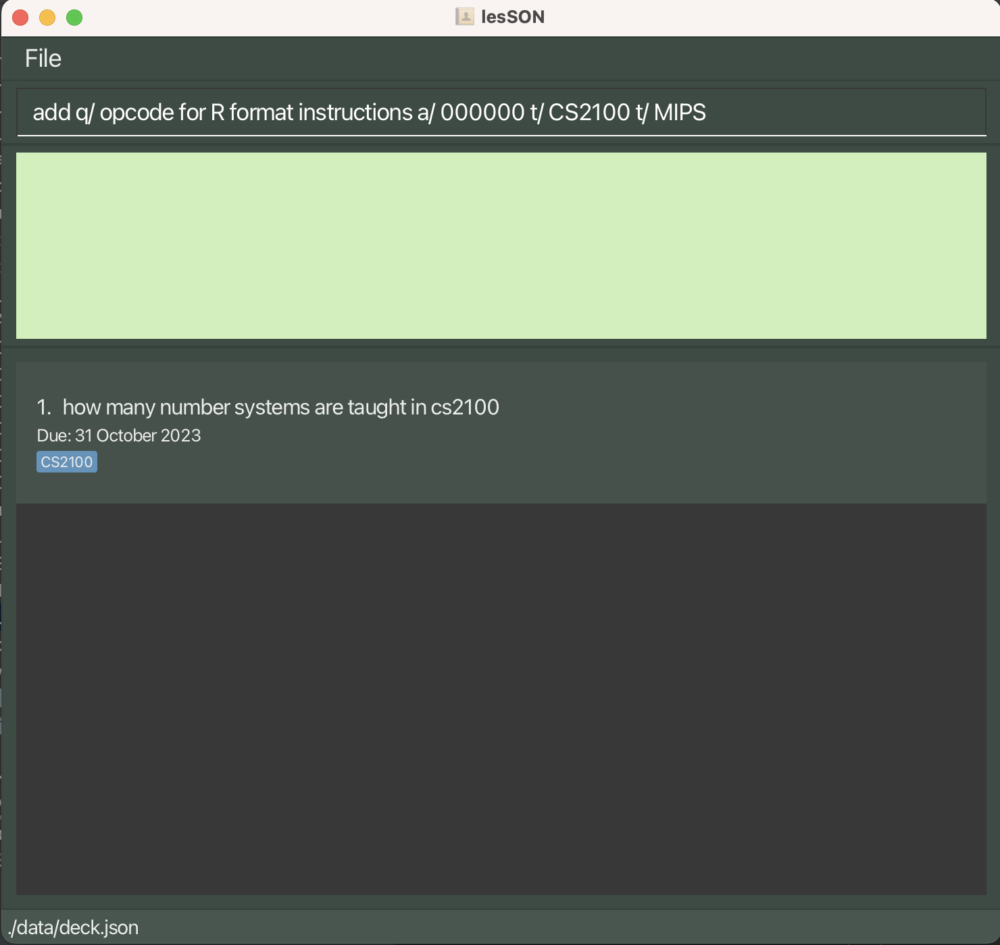
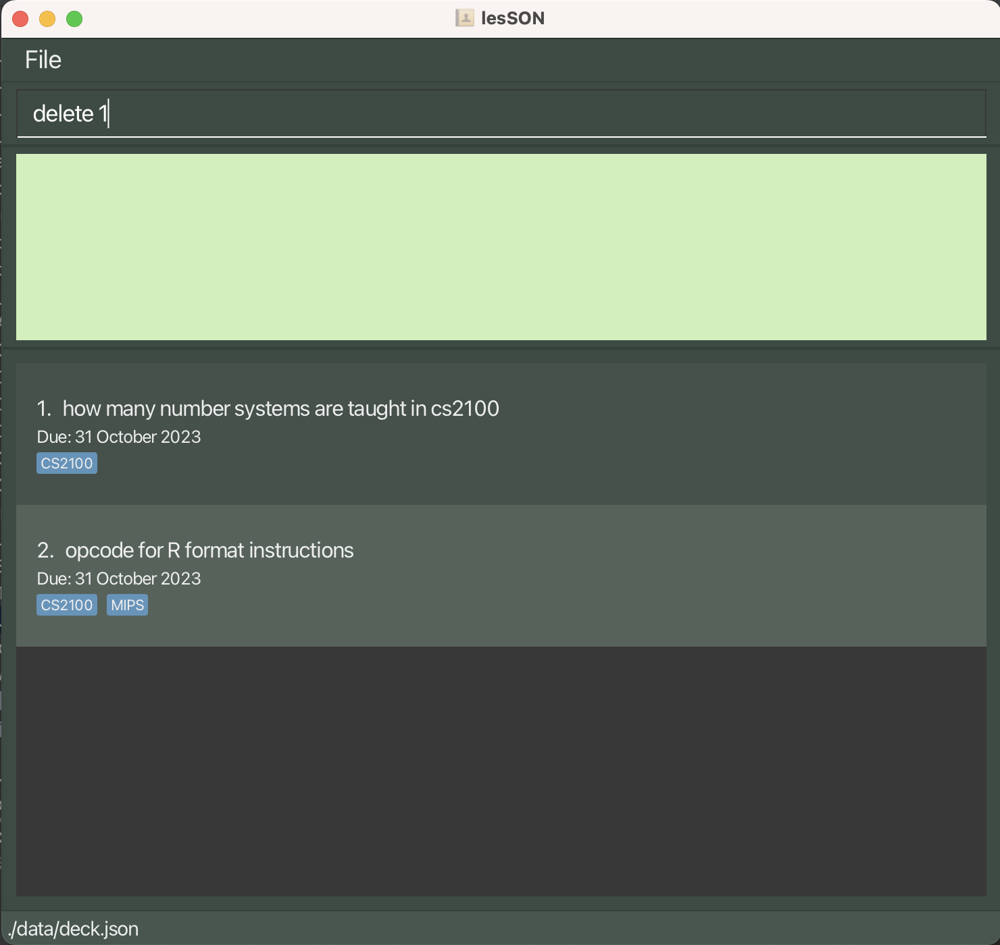
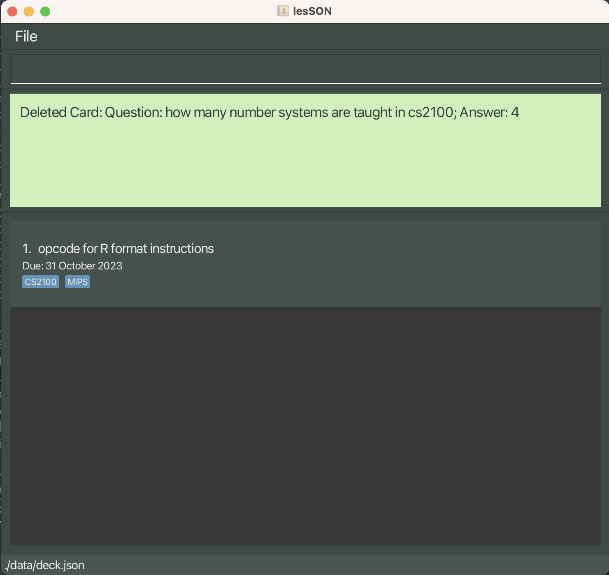
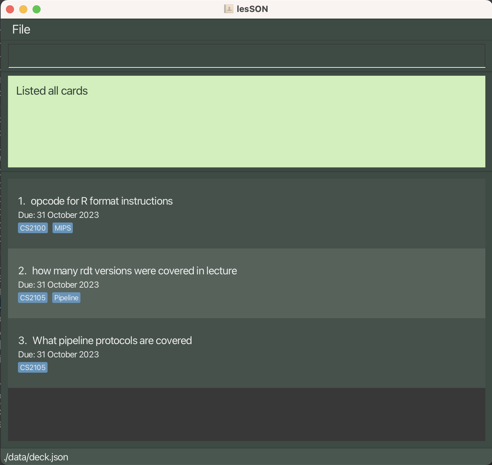
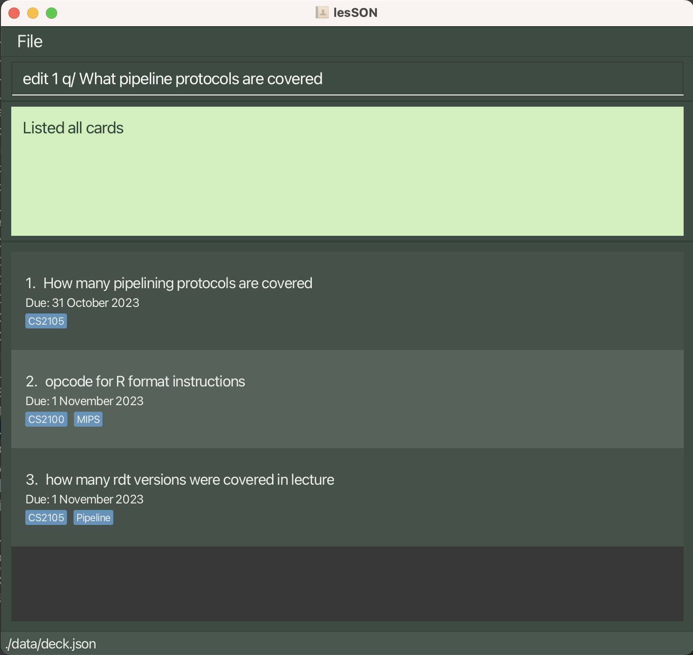
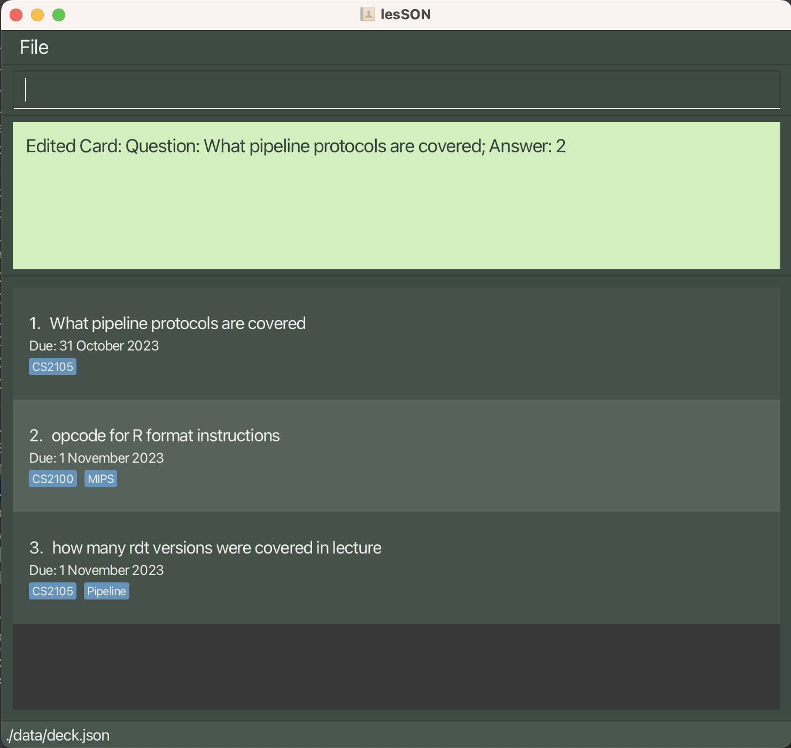
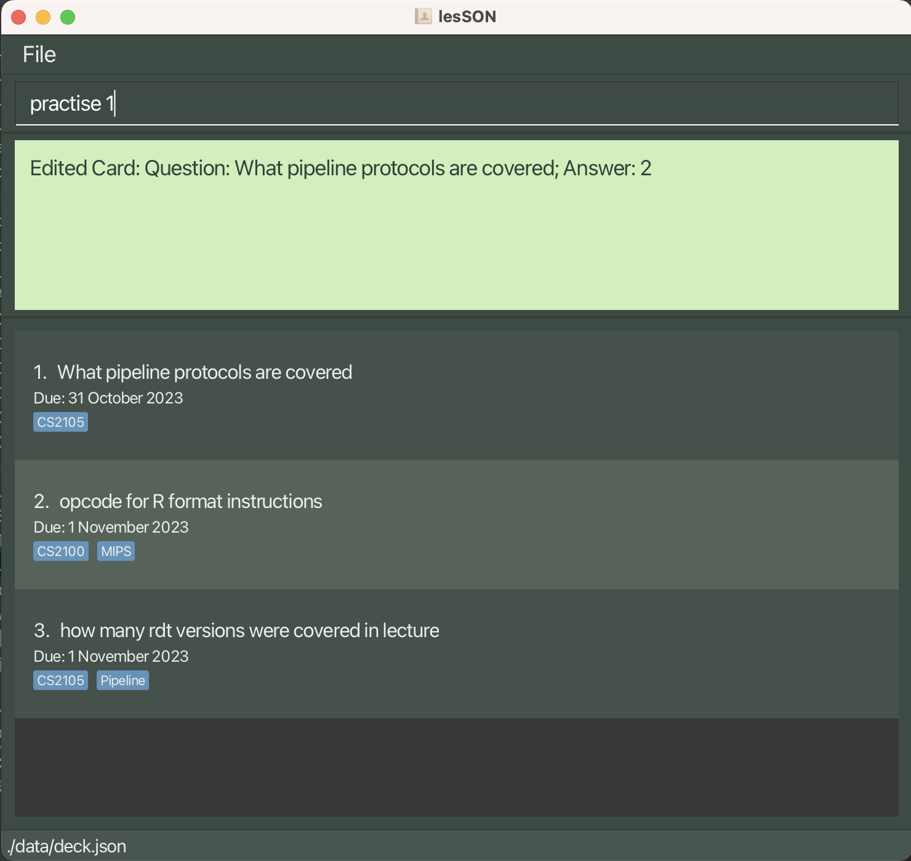
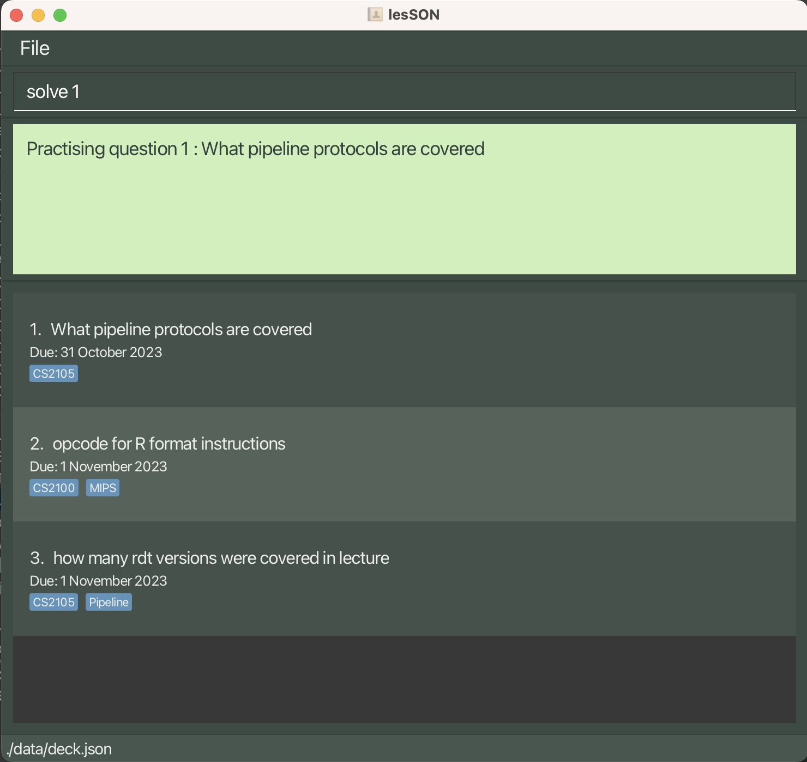
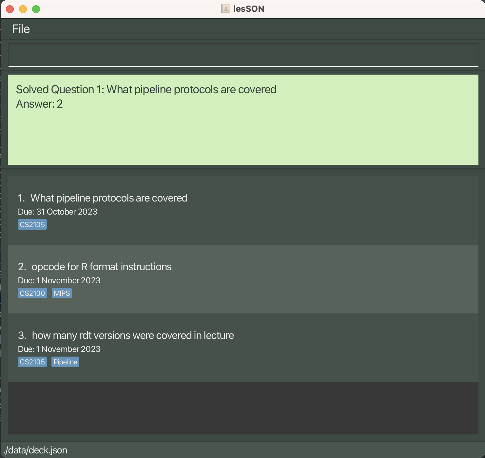

# Welcome to lesSON

***Revolutionise your studying experience with lesSON!***

lesSON is a **desktop application** aimed to help NUS Computer Science undergraduates make flashcards to aid with 
their memory work for school content.<br>
Here are some benefits of adopting lesSON in your studying experience:
- Create and Edit flashcards about key concepts taught in your courses
- Take advantage of our implemented **Spaced Repetition** to maximise your memorisation
- Categorise your flashcards based on their courses or topics

On top of these functionalities, we believe that making flashcards must be efficient. Therefore, lesSON is optimized for
use via a **Command Line Interface (CLI)** while still having the benefits of a **Graphical User Interface (GUI)**. 
If you type fast, lesSON can get your flashcards done faster than current GUI apps in the industry.

--------------------------------------------------------------------------------------------------------------------

# Table of Contents
1. [Quick start](#quick-start)
2. [Glossary](#glossary)
3. [Feature list](#feature-list)
   - [Adding a FlashCard](#adding-a-flashcard-add)
   - [Deleting a Flashcard](#deleting-a-flashcard--delete)
   - [View All Flashcards](#view-all-flashcards--list)
   - [Editing a Specific Flashcard](#editing-a-specific-flashcard--edit)
   - [Practise Flashcards](#practise-flashcards-practise)
   - [Solve Flashcards](#practise-flashcards-solve)
4. [FAQ](#faq)

--------------------------------------------------------------------------------------------------------------------

# Quick start

1. Make sure that you have **Java 11 or above** installed on your computer.
2. Download the latest jar file from [here](https://github.com/AY2324S1-CS2103T-W17-4/tp/releases/tag/v1.3(trial)).
3. Move the jar file installed to a working folder you would store all of your flashcards
4. Launch lesSON.
5. Better understand the GUI using this [guide](#table-of-contents).
6. For new users, we recommend reading this [New User Guide](#table-of-contents).
7. For advanced users, view all feature details in our [feature list](#feature-list).

--------------------------------------------------------------------------------------------------------------------

# Glossary

--------------------------------------------------------------------------------------------------------------------
# Feature list

### Adding a Flashcard `add`
Adds a flashcard to the deck for the user.

Format: `add q/question a/answer [t/TAG]`

**Tip**: Tagging is not supported in v1.2 and earlier

Examples:

```
- add q/What are the three ways to implement binary systems? a/1s Complement, 2s Complement, and Sign and Magnitude

- add q/How do you convert from binary to 1s Complement? a/By inverting all the bits, i.e. 0 to 1 and vice versa t/CS2100 t/Number Systems
```

#### Acceptable values for each parameters:
1. No Empty Input after q/, a/ and t/.
2. t/ is optional and not necessary.
#### Expected outputs:
```
1. add q/What are the three ways to implement binary systems? a/1s Complement, 2s Complement, and Sign and Magnitude
   “New Card added: Question: What are the three ways to implement binary systems?; Answer: 1s Complement, 2s Complement, and Sign and Magnitude “

2. add q/What are the three ways to implement binary systems? a/
   Answers should only contain alphanumeric characters, some special characters and spaces, and it should not be blank

3. add a/10111
   Invalid command format! 
   add: Adds a card to the deck. Parameters: q/QUESTION a/ANSWER
```
#### Usage
1. User Input


2. Successful Output


### Deleting a Flashcard : `delete`
Deletes a flashcard in the deck

Format: `delete INDEX`
Examples:
```
- delete 2
 (deletes the 2nd flashcard in the deck)
```

#### Acceptable values for each parameters:
1. Index must be positive integer
2. Index cannot exceed size of the deck

#### Expected outputs:
```
1. delete 2
   Deleted Card: Question: <provided question>; Answer: <provided answer>

2. delete -100
   Invalid command format! 
   delete: Deletes the deck identified by the index number used in the displayed card list.
   Parameters: INDEX (must be a positive integer)
   Example: delete 1
```
#### Usage:
1. User Input
   

2. Successful Output
   

### View All Flashcards : `list`
Shows a list of all flashcards in the deck.

Format: `list`
Examples:
```
(list shows the full list of flashcards.)
```

#### Acceptable values for each parameters:
No parameters are needed

#### Expected output:
```
1. list
   (Questions to all the flashcards that are added with their index)

2. list potato
   “No parameters are allowed for this command.”
```

#### Usage


### Editing a Specific Flashcard : `edit`
Edits an existing person in the address book.

Format: `edit INDEX (q/a)/ (question/answer)`

Examples:
```
1. edit 1 q/ What is the colour of the sun?
   (changes the question at index 1 to “What is the colour of the sun?”)

2. edit 1 a/ Red
   (changes the answer at index 1 to “Red”)
```
#### Expected output:
```
“Successfully edited flashcard” message will be returned to the user via the CLI
“The card index provided is invalid"
```
#### Usage:
1. User Input
   

2. Successful Output
   


### Practise Flashcards: `practise`
Practise a single Flashcard in the deck

Format: `practise INDEX`

#### Acceptable values for each parameters:
1. Index must be positive integer
2. Index cannot exceed size of the deck

#### Examples:
```
practise 1 
(showcases the question at index 1)
```
#### Expected outputs:
```
practise 1 
"Practising question 1 : <provided question>"

practise 10
"The card index provided is invalid"
```

#### Usage:
1. User Input
   

2. Successful Output
   

### Practise Flashcards: `solve`
Solves the question at the given index

Format: `solve INDEX d/DIFFICULTY`

#### Acceptable values for each parameters:
1. Index must be positive integer
2. Index cannot exceed size of the deck
3. Difficulty must be either `easy`, `medium`, `hard`.

#### Examples:
```
solve 1 d/ easy
(marks the priority of question to be easy)
```
#### Expected outputs:
```
solve 1 
"Solved Question 1 (Difficulty level: easy)"

solve 10 d/easy
"The card index provided is invalid"
```

#### Usage:
1. User Input
   

2. Successful Output
   

--------------------------------------------------------------------------------------------------------------------

# FAQ

--------------------------------------------------------------------------------------------------------------------
