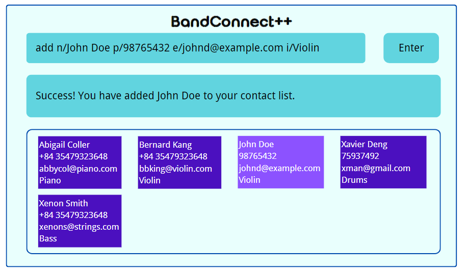

# BandConnect++ User Guide
BandConnect++ is a powerful desktop app that helps musicians manage contact with other musicians to easily form a band. You can use it to manage musician contacts, select band members, and form a band of your preference, all within a few clicks or a few seconds of typing!

--------------------------------------------------------------------------------------------------------------------
## About this guide
Welcome to the *BandConnect++ User Guide*! This user guide provides an in-depth documentation on everything about *BandConnect++*, including installation, set up, features, common FAQ and troubleshooting recommendations. 

For first-time users, please go to the [Quick start](#quick-start) section below to start an end-to-end tutorial that gets you onboard. Should you encounter any difficulty understanding the terminology, don't forget to refer to the [Glossary](#glossary)!

### Table of Contents
* [Glossary](#glossary)
* [Quick start](#quick-start)
* [Features](#features)
* [Command Summary](#command-summary)
* [Troubleshooting](#troubleshooting)

## Glossary
To be added.

--------------------------------------------------------------------------------------------------------------------

## Quick start
To be added.

--------------------------------------------------------------------------------------------------------------------

## Features

### Formatting Convention

### Adding a musician contact: `add`

Adds a musician to the contact book. Name, phone number, email, and instrument can be recorded.

**Format:** `add n/NAME p/PHONE_NUMBER e/EMAIL i/INSTRUMENT`

**Examples:**
* `add n/John Doe p/98765432 e/johnd@example.com i/Violin`
* `add n/Betsy Crowe e/pianistbetsy@smtp.com p/87988039 i/Piano`

**Upon success:**

You will see a message indicating successful addition of the musician like below:

**Upon failure:**

Should you input a musician which is already in your contact book (ie. have the same phone number or email as an existing contact),
you will see an error message showing the possible error. Please input a different phone/email for the current contact or modify the original contact's relevant details.

### Removing a musician contact: `remove`

Removes a musician contact from the address book.

**Format:** `remove INDEX`

**Examples:**
* `remove 1`

**Upon success:**

You will see a message indicating successful removal of the musician contact like below:

[insert image]

**Upon failure:**

Should you input an index greater than the number of musicians in your address book (e.g. `remove 6` in an address book
containing 5 musicians), or input a non-positive index (e.g. `remove 0` or `remove -1`), you will see a message like below.

[insert image]

Please verify that the index is correct and try again.

### Tagging a musician with instruments: `tag instrument`

Tags a musician with one or more instruments he/she is proficient in.

**Format:** `tag instrument INDEX i/INSTRUMENT…`

**Constraints:**
* `INDEX` must be a positive integer 1, 2, 3, …​
* The instrument tag must be *non-empty*.
* You have to supply *at least one instrument tag* to the musician you are tagging.

**Examples:**
* `tag instrument 1 i/Piano i/Violin`
* `tag instrument 2 i/Drums`

**Upon success:**

You will see a message indicating successful addition of instruments like below:
[insert image]

**Upon failure:**

Should you try to tag a musician with zero instrument tags or empty tags, i.e., `tag instrument 1 i/` or
`tag instrument 1`, you will see a message like below:
[insert image]

### Tagging a musician with genres: `tag genre`

Tags a musician with one or more genres he/she is proficient in.

**Format:** `tag genre INDEX g/GENRE…`

**Constraints:**
* `INDEX` must be a positive integer 1, 2, 3, …​
* The genre tag must be *non-empty*.
* You have to supply *at least one genre tag* to the musician you are tagging.

**Examples:**
* `tag genre 1 g/rock g/pop`
* `tag genre 2 g/jazz`

**Upon success:**

You will see a message indicating successful addition of tags like below:
[insert image]

**Upon failure:**

Should you try to tag a musician with zero genre tags or empty tags, i.e., `tag genre 1 g/` or `tag genre 1`,
you will see a message like below:
[insert image]

### Locating musicians by name: `find`

Finds all musicians whose names contain any of the given keywords.

**Format:** `find KEYWORD`

Examples:
* `find John` returns `john` and `John Doe`

**Upon success:**

You will see a list of musicians as follows:
[insert image]

**Upon failure:**

Should you input `find` without any keyword, you will see a message like below:
[insert image]

### Creating a band: `addb`

Creates a band with the specified band name.

**Format:** `addb n/BANDNAME`

Examples:
* `addb n/My Garage Band`

**Upon success:**

You will see a message indicating successful addition of the band like below:
[insert image]

**Upon failure:**

Should you input a band which is already in your contact book (ie. have the same name as an 
existing band), you will see an error message showing the possible error. Please input a different name for the new 
band or change the name of the existing band.
[insert image]

### Adding a musician to a band: `addm`

Adds a musician to a specified band.

**Format:** `addm bin/BANDINDEX min/MUSICIANINDEX`

Examples:
* `addm bin/1 min/2` adds the second musician in the contact list to the first band in the list of bands.

**Upon success:**

You will see a message indicating successful addition of the musician into the band like below:
[insert image]

**Upon failure:**

Should you input an index that does not exist, you will see an error message showing the possible error. 
Please input a different index as pointed out by the error message.
[insert image]

### Exiting the program : `exit`

Exits the program.

Format: `exit`

### Saving the data

BandConnect++ data are saved in the hard disk automatically after any command that changes the data. There is no need to save manually.

--------------------------------------------------------------------------------------------------------------------

## Troubleshooting

[to be added soon]

--------------------------------------------------------------------------------------------------------------------

## Command summary

| Action             | Format, Examples                                                                                               |
|--------------------|----------------------------------------------------------------------------------------------------------------|
| **Add**            | `add n/NAME p/PHONE_NUMBER e/EMAIL i/INSTRUMENT`  e.g., `add n/John Doe p/98928479 e/johndpiano@xmail.com i/Piano` |
| **Remove**         | `remove INDEX`  e.g., `remove 1`                                                                            |
| **Tag Instrument** | `tag instrument INDEX i/INSTRUMENT…​`  e.g.,`tag instrument 1 i/piano i/guitar`                             |
| **Tag Genre**      | `tag genre INDEX g/GENRE…​`  e.g., `tag genre 1 g/rock g/pop`                                               |
| **Find**           | `find KEYWORD`                                                                                                 |
