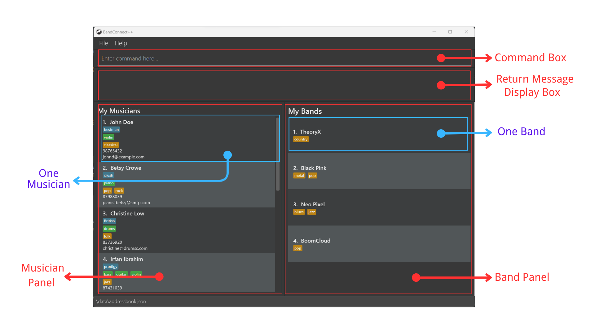
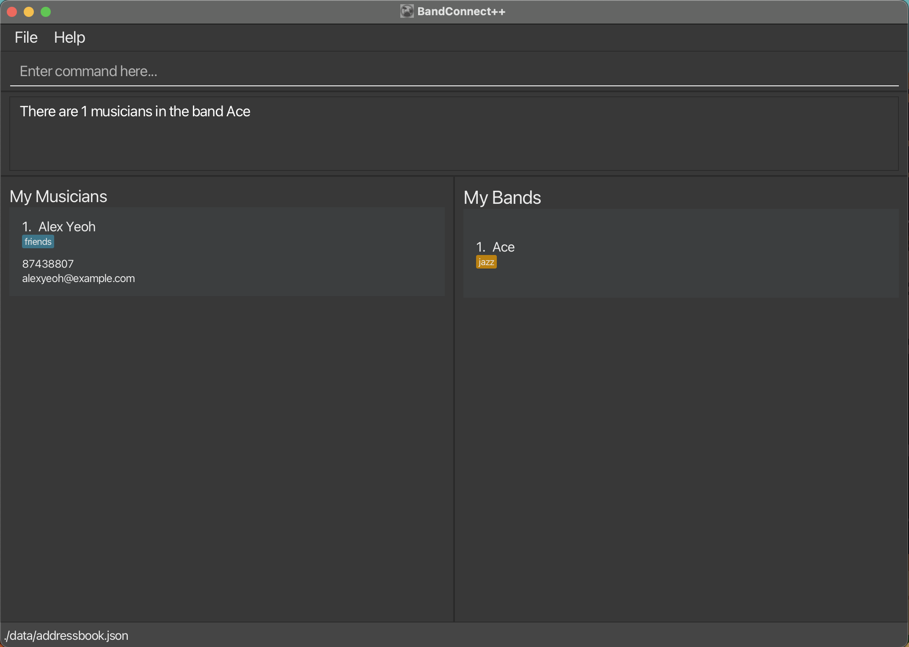
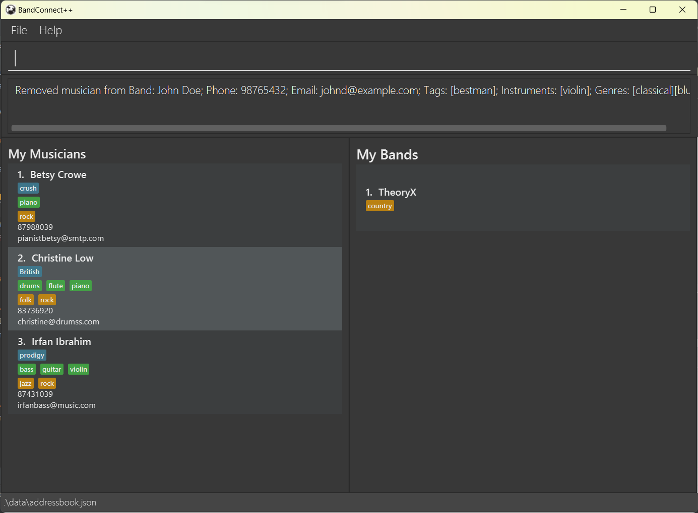
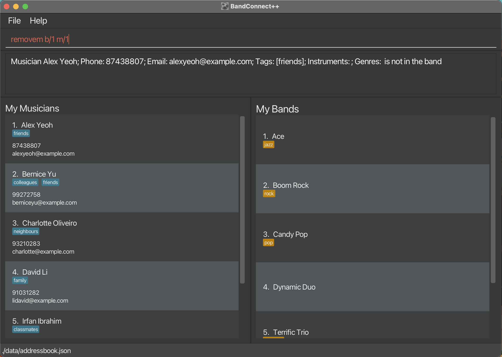

## What Is BandConnect++?
Unlock your musical potential with **_BandConnect++_** ! 

**_BandConnect++_** is a powerful desktop app that helps independent music producers manage their musician contacts and create perfect bands with ease. 

Say goodbye to the tedious process of scrolling through your phone contacts and noting down every potential musician for your dream bands! With BandConnect++, you own the freedom to experiment with various hypothetical band makeups. You can 

* create a new band from scratch
* add/remove your musician contacts to/from the band
* check if their instruments and genres are a perfect match. 

What's more, **_BandConnect++_** has a convenient and intuitive [Command Line Interface (CLI)](#glossary) that allows you to perform all the tasks with just a few keystrokes. It may be a little daunting at first, but don't worry! We have prepared a comprehensive user guide to get you started and answer your confusion. Once you get the hang of it, your efficiency will be brought to a whole new level!

So, no more waiting! Let's start creating your first dream band now!

--------------------------------------------------------------------------------------------------------------------

## Using the Guide
This user guide walks you through the essential features of *BandConnect++*, familiarises you with the [CLI](#glossary) commands, and provides the best help we can if problem arises. We have made this guide beginner-friendly so that anyone who has used a software application before should have no trouble understanding it!

Whether you are new to our application or a seasoned user, you can always find something useful in this guide. 

* For **first-time users**, please go to the [Quick Start](#quick-start) section to start an end-to-end tutorial that gets you onboard. Should you encounter any difficulty understanding the terminology, don't forget to refer to the [Glossary](#glossary)!

* For **experienced users** who have used _BandConnect++_ before, if you need help in remembering a particular command, please see [Command Summary](#command-summary). You can also refer to the [Features](#features) section for a more detailed explanation of each command.

If you encounter any problems along your journey, please take a look at the [Troubleshooting](#troubleshooting) section and also refer to our [FAQ](#frequently-asked-questions) for more information.

--------------------------------------------------------------------------------------------------------------------

## Table of Contents
* Table of Contents
{:toc}

--------------------------------------------------------------------------------------------------------------------

## Quick Start
1. Ensure you have Java 11 or above installed in your Computer. If you have never downloaded it before, download from [here](https://www.oracle.com/sg/java/technologies/javase/jdk11-archive-downloads.html).


2. Download the latest version of [BandConnect++](https://github.com/AY2324S1-CS2103T-W11-3/tp/releases/latest).


3. Move the file to the home folder you want to access the app. 

     Recommended: Drag the downloaded file to your desktop so that you can access it from there.


4. From the home folder, open "Terminal" on MacOS or "Command Prompt" in Windows, and type `java -jar BandConnect++.jar` to run the application. A GUI similar to the below should appear in a few seconds.

   
   * Musicians are displayed in the left panel.
   
   * Bands are displayed in the right panel.
   

   The app already contains some sample data to help you get started. 


5. To execute a command, enter it in the command box and press `Enter` to execute it. The following are some example commands you can try:
   * `help` : Open the help window.
   * `list` : Lists all contacts. 
   * `add n/Alice Lovelace p/98757287 e/alicel@example.com i/bass g/rock`: Adds rock bassist Alice Lovelace.
   * `addb n/Maverick g/rock`: Adds a rock band named Maverick.
   * `findb TheoryX`: Finds the band named TheoryX and checks its members.
   * `exit` : Exits the app.
   
Please refer to the [Features](#features) below for details of each command.

--------------------------------------------------------------------------------------------------------------------

## Features

<div markdown="block" class="alert alert-success">

**:bulb: How to interpret each feature description:** <br>

The description of each feature is divided into 7 parts:

* **Name** - The name of the feature.
* **Description** - A brief description of the feature.
* **Scenario** - A scenario that illustrates when and why the feature is useful.
* **Format** - The format of the command for the feature.
* **Examples** - Examples of using the command and their effects.
* **Outcomes** - The expected successful and failed outcomes.
* **Things to Note** - Any additional information that the user should take note of when using the feature.

</div>

<div markdown="block" class="alert alert-info">

**:information_source: Notes about the command format:** <br>

When looking at the command format of each feature the first time, it might seem confusing. But, they all follow a general pattern, and here is the explanation of the pattern with an example of adding a musician contact to the application:

```
add n/NAME p/PHONE_NUMBER e/EMAIL [t/TAG]…​  [i/INSTRUMENT]…​  [g/GENRE]…​ 
```

* The first word represents the command name, in this case, `add`.

* The words in uppercase represent the parameters to be provided by the user, and their meanings are self-explanatory. For example, `n/NAME` means you need to provide a name for the contact.

* The prefixes like `n/`, `p/`, `e/` are used to identify the parameters. So, when typing `add n/John Doe`, the application knows that `John Doe` is the name of the musician.

* The parameters in square brackets like `[g/GENRE]` are optional, while the parameters without square brackets like `n/NAME` are compulsory.

* The parameters in with `…​ ` like `[g/GENRE]…​ ` can be entered multiple times (including zero times). For example, `g/rock g/jazz` or `g/blues` or `` are all valid.

* The order of the parameters does not affect the result. For example, `p/PHONE_NUMBER` can be entered before `n/NAME`, and the command still works the same.

* Extraneous parameters for commands that do not take in parameters (such as `help`, `list`, or `tags`) will be ignored.
--------------------------------------------------------------------------------------------------------------------
</div>

### Get help: `help`
Access a link to our user guide.

**Format:** `help`

You will see a window like below, click `Copy URL`, paste the link in any web browser to view this user guide.


**Command Behavior**
* Extraneous parameters will be ignored.
* e.g. if the command specifies `help 1`, it will be interpreted as `help`.

### List all musicians and bands: `list`
View all musicians and bands in their separate panels.

**Format:** `list`


## Features for managing musicians

--------------------------------------------------------------------------------------------------------------------
### Add musician: `add`

Adds one musician to the contact book. 

Name, phone number, email, tag, instrument, genre about the musician can all be included.

**Format:** `add n/NAME p/PHONE_NUMBER e/EMAIL [t/TAG]…​  [i/INSTRUMENT]…​  [g/GENRE]…​ `

**Examples:**
* `add n/John Doe p/98765432 e/johnd@example.com t/bestman i/violin g/classical`
* `add n/Betsy Crowe e/pianistbetsy@smtp.com p/87988039 i/piano g/pop g/rock`

**Things to Note**
* To add the instruments and genres the musician specialises in using the `i/` and `g/` prefixes, you can only add the instruments and genres included in a pre-defined list of instruments and genres. Refer to the [tags](#show-all-valid-instruments-and-genres-tags) command for more information.


**Upon success:**
A success message like below will be displayed.

```
New musician added: John Doe; Phone: 98765432; Email: johnd@example.com; Tags: [bestman]; Instruments: [violin]; Genres: [classical]
```


**Upon failure:**

If you input a musician which is already in your contact book (i.e. a musician with either the same name, the same phone number, or the same email as an existing contact). You will be shown an error message like below. Please re-enter the correct information.
```
This musician already exists in your contact list
```

### Delete musician: `delete`

Deletes a musician from your contact list.
From the current `My Musicians` panel, find the index of the musician to be deleted.

**Format:** `delete INDEX`

**Examples:**
* `delete 1`

**Upon success:**

You will see a message indicating successful removal of the first musician contact in the musician panel like below:

```
Deleted Musician: John Doe; Phone: 98765432; Email: johnd@example.com; Tags: [bestman]; Instruments: [violin]; Genres: [classical]
```


**Upon failure:**

Should you input an index out of the range of the current `My Musicians` list, you will see the error message below:

```
The musician index provided is invalid
```

Please verify that the index is correct and try again.


### Edit musician: `edit`

Edits an existing musician in the contact book referenced by the index.

Name, phone number, email, tag, instrument, genre about the musician can all be included for edit.

**Format:** `edit INDEX [n/NAME] [p/PHONE_NUMBER] [e/EMAIL] [t/TAG]…​  [i/INSTRUMENT]…​  [g/GENRE]…​ `

**Examples:**
* `edit 1 p/98765430 g/pop`
* `edit 2 e/pianistbetsy@edited.com i/violin t/available`

**Things to Note**
* At least one of the optional field to edit must be provided.
* The `INDEX` refer to the index number shown in the currently displayed `My Musicians` list. The index **must be a positive integer** 1, 2, 3, …​
* If you would like to edit a musician not currently shown, please use the 'list' command first before editing.
* When editing tags/instruments/genres, the existing tags/instruments/genres of the musician will be removed i.e adding of tags/instruments/genres is not cumulative.
* You can remove all tags/instruments/genres of the musician by inputting an empty tag/instrument/genre field, e.g. `edit 1 t/ i/ g/`.
* You can only edit the instruments and genres of the musician using the ones included in a pre-defined list. Refer to the [tags](#show-all-valid-instruments-and-genres-tags) command for more information.

**Upon success:**
A success message like below will be displayed.

```
Edited Musician: John Doe; Phone: 98765430; Email: johnd@example.com; Tags: [bestman]; Instruments: [violin]; Genres: [pop]
```
* Before: From `list` state, John Doe's genre is classical
  


* After: John Doe's genre is changed to pop
  


**Upon failure:**
1. If you provide no argument for the musician to be edited, e.g. `edit 1`, you will see an error message like below:
    ```
    At least one field to edit must be provided.
    ```
2. If you provide invalid arguments for name, phone number, and email, you will be shown the corresponding error message with the correct format to follow. Please re-enter the correct information.
3. If you have provided at least one optional field to edit in the correct format yet the index provided is out of range, you will see the error message below:
    ```
    The musician index provided is invalid
    ```
    Please verify that the index is correct and try again.

### Find musicians: `find`

Finds all musicians whose names, tags, instruments, AND genres contain ANY of the given keywords.

**Format:** `find [n/NAME]…​  [t/TAG]…​  [i/INSTRUMENT]…​  [g/GENRE]…​ `

**Examples:**
* `find n/John i/violin i/piano` finds all musicians whose names contain "John" AND instruments contain "violin" or "piano".
* `find t/available t/friendly i/piano g/jazz` finds all musicians whose tags contain "available" or "friendly" AND instruments contain "piano" AND genres contain "jazz".

**Things to Note**
* At least one of the optional field to find must be provided.
* The argument for each field must contain only one word. It cannot be empty and cannot contain multiple words separated by whitespaces.
* The search is case-insensitive. e.g. `john` will match `John`
* Only full words will be matched e.g. `guit` will NOT match `guitar`

**Upon success:**

The `My Musicians` panel will update to show all matching musicians, while the `My Bands` panel will list all bands.

For example, when the input command is `find g/rock i/guitar i/piano`
* Before: From `list` state

* After: On the left, `My Musicians` panel will display all musicians whose genres contain "rock" AND instruments contain "guitar" or "piano"


**Upon failure:**

1. If you provide no argument for the `find` command, you will see an error message indicating the command format is invalid with the correct format to follow.
2. If you provide empty arguments for any of the fields, e.g. `find n/ i/`, you will see an error message below:
    ```
    The argument(s) provided must not be empty.
    ```
3. If you provide arguments of more than one word separated by whitespaces for any of the fields, e.g. `find n/John Doe` you will see the error message below:
    ```
    The argument(s) provided must not contain more than one word.
    ```
   

## Features for managing bands

--------------------------------------------------------------------------------------------------------------------
### Create band: `addb`

Creates a band with the specified band name and genres.

**Format:** `addb n/BANDNAME [g/GENRE…​]`

Examples:
* `addb n/My Garage Band g/rock`

**Upon success:**

You will see a message indicating successful addition of the band like below:
```
New band added: My Garage Band; Genres: [rock]
```

**Upon failure:**

Should you input a band which is already in your contact book (ie. have the same name as an 
existing band), you will see an error message showing the possible error. Please input a different name for the new 
band or change the name of the existing band.
[insert image]

Should you try to add a band with empty genre tags, i.e., addb My Garage Band g/ , you will see a message like below: [insert image]
```
Genre tags names should be a valid genre name.
For a list of valid genres, please use the command 'tags'
```
### Add musician to band: `addm`

Adds a musician to a specified band.

**Format:** `addm b/BAND_INDEX m/MUSICIAN_INDEX…​ `

**Things to Note:**
* `BANDINDEX` and `MUSICIANINDEX` must be positive integers 1, 2, 3, …​
* Before adding any musicians to any band, you should first use the [list](#list-all-musicians-and-bands-list) command to list all musicians and bands.
* You can only add musicians to a single band. Adding musicians to multiple bands is currently not supported.

Examples:
* `addm b/1 m/1 m/2 ` adds the first and second musicians in the `My Musicians` contact list to the first band in the `My Bands` list.

**Upon success:**

You will see a message indicating successful addition of the musician into the band. The `My Bands` panel will update to show ONLY the band which the new musicians are added in. The `My Musicians` panel will update to show all the members of that band.

For example, when the input command is `addm b/1 m/1 m/2`:

* Before: From `list` state

* After: On the right, `My Bands` panel will display the band "ACDC". On the left, `My Musicians` panel will display all musicians in that band.


**Upon failure:**

1. Should you input an index that is out of range (e.g. musician index 4 when there are 3 musicians, or band index 2
when there is 1 band), you will see an error message below:
    ```
    The musician index provided is invalid
    ```
    or 
    ```
    The band index provided is invalid
    ```
2. If the musician(s) you are adding is/are already in the band, you will see an error message below:
    ```
    One or more of the musicians already exist in the band
    ```
3. If you input more than one field for the prefix `b/`, meaning you are trying to add musicians to multiple bands, e.g. `addm b/1 b/2 m/1`, you will see an error message below:
    ```
    You can only add musicians to one band at a time
    ```


### Remove musician from band: `removem`

Removes a musician from a specified band. The musician must already exist in the band.

**Format:** `removem b/BANDINDEX m/MUSICIANINDEX`

**Constraints:**
* `BANDINDEX` and `MUSICIANINDEX` must be positive integers 1, 2, 3, …​

**Upon success:**
* Before: From `list` state
  
* After: You will see a message indicating successful removal of the musician from the band like below:
  

**Upon failure:**

Should you input an index that is out of range (e.g. musician index 4 when there are 3 musicians, or band index 2
when there is 1 band), you will see an error message as shown below.

Please input a different index and try again.

In addition, if the musician does not exist in the band, you will see an error message as shown below.

Please verify that the index of the musician is correct or input a different musician, and try again.


#### Find band: `findb`
Finds the band with the given input name. Lists the band members of the selected band. From `My Bands` panel, find the complete band name of the band.

**Format:** `findb BANDNAME`

**Examples:**
* `findb theory X` 

**Upon success:**
* Before: From `list` state

* After: On the left, `My Musicians` panel will display all musicians in the band. On the right, `My Bands` panel will display the band of interest.


**Upon failure:**
If you input an invalid band name, an error message `Band does not exist!` will be displayed. Please input a valid band name and enter the command again.

### Edit a band: `editb`

Edit the name and genre of a selected band.
From the current `My Bands` panel, find the index of the band to be edited.

**Format:** `editb INDEX n/NEWNAME g/GENRE…​ `

**Examples:**
* `editb 1 n/Ace`

**Upon success:**
* Before: From `list` state
  
* After: On the left, `My Musicians` panel will display all musicians. On the right, `My Bands` panel will display the updated band list.
  
You will see a message indicating successful editing of the first band in the band panel like below:

```
Edited Band: Ace; Genres: [jazz]
```

**Upon failure:**

Should you input an index out of the range of the current `My Bands` list, you will see the error message below:

```
The band index provided is invalid
```

Should you attempt to change the name of the band to an existing band name stored by the program, you will see the error message below:

```
This band already exists in the addressbook.
```

Please verify that the index is correct and try again.

Should you try to tag a band with invalid genre tags, i.e., editb 1 g/poP , you will see a message like below:
```
Genre tags names should be a valid genre name.
For a list of valid genres, please use the command 'tags'
```

### Delete a band: `deleteb`

Deletes a band from your contact list.
From the current `My Bands` panel, find the index of the band to be deleted.

**Format:** `deleteb INDEX`

**Examples:**
* `deleteb 1`

**Upon success:**

You will see a message indicating successful removal of the first band in the band panel like below:

```
Deleted Band: Ace; Genres: [jazz]
```

**Upon failure:**

Should you input an index out of the range of the current `My Bands` list, you will see the error message below:

```
The band index provided is invalid
```

Please verify that the index is correct and try again.

## Other features

--------------------------------------------------------------------------------------------------------------------
### Show all valid instruments and genres: `tags`

View all valid instrument and genre tags for musicians and bands.

The instrument and genre tags can be added/edited for a musician using the [add](#add-musician-add) and [edit](#edit-musician-edit) command with prefix `i/` and `g/` respectively.

The genre tags can also be added/edited for a band using the [addb](#create-band-addb) and [editb](#edit-band-editb) command with prefix `g/`. Currently, band does not support instrument tags.

**Format:** `tags`

**Result:**
You will see a list of valid instrument and genre tags in the message box like below:
```
Listed all valid instrument tags and genre tags below:
Instrument tags: [bass, cello, clarinet, drums, flute, guitar, piano, saxophone, trumpet, violin, voice, other]
Genre tags: [blues, classical, country, electronic, folk, hiphop, jazz, latin, metal, pop, rock, soul, other]
```
The `My Musicians` and `My Bands` panels will remain unchanged.


### Clear data: `clear`

Clears all data in the application.

<div markdown="block" class="alert alert-warning">

**:warning: Destructive Command!**<br>

This command is irreversible, and all data will be lost. Please use this command with caution.

</div>

### Exit app : `exit`

Exits the program.

Format: `exit`

--------------------------------------------------------------------------------------------------------------------
### Save data

BandConnect++ data are saved in the hard disk automatically after any command that changes the data. There is no need to save manually.

Congratulations! You are now ready to use **_BandConnect++_**!

If you wish, please refer to the below section for a more succinct [command summary](#command-summary).

--------------------------------------------------------------------------------------------------------------------
## Command summary

### Musician Command summary

| Action                                 | Format                                                                                   | Examples                                                                                                        |
|----------------------------------------|------------------------------------------------------------------------------------------|-----------------------------------------------------------------------------------------------------------------|
| **Add a Musician**                     | `add n/NAME p/PHONE_NUMBER e/EMAIL [t/TAG]…​ [i/INSTRUMENT]…​ [g/GENRE]…​`               | `add n/Betsy Crowe e/pianistbetsy@smtp.com p/87988039 i/piano g/pop g/rock`                                     |
| **Remove a Musician**                  | `delete INDEX`                                                                           | `delete 1`                                                                                                      |
| **Edit Musician Information**          | `edit INDEX [n/NAME] [p/PHONE_NUMBER] [e/EMAIL] [t/TAG]…​ [i/INSTRUMENT]…​ [g/GENRE]…​`  | `edit 2 e/pianistbetsy@edited.com i/violin t/available`                                                         |
| **Find Musicians**                     | `find [n/NAME]…​ [t/TAG]…​ [i/INSTRUMENT]…​ [g/GENRE]…​`                                 | `find n/John i/Piano`                                                                                           |
| **List**                               | `list`                                                                                   |                                                                                                                 |

### Band Command summary

| Action                            | Format                                                                                   | Examples                                                 |
|-----------------------------------|------------------------------------------------------------------------------------------|----------------------------------------------------------|
| **Add a Band**                    | `addb n/BANDNAME [g/GENRE]…​`                                                            | `addb n/Ace Jazz g/jazz g/blues`                         |
| **Delete a Band**                 | `deleteb INDEX`                                                                          | `deleteb 1`                                              |
| **Edit a Band**                   | `editb INDEX n/BANDNAME [g/GENRE]…​`                                                     | `editb 1 n/Ace Jazz g/jazz`                              |
| **Add Musicians to a Band**       | `addm b/BAND_INDEX m/MUSICIAN_INDEX…​`                                                   | `addm b/1 m/1 m/2`                                       |
| **Remove a Musician from a Band** | `removem b/BANDINDEX m/MUSICIANINDEX`                                                    | `removem b/1 m/1`                                        |
| **Find a Band**                   | `findb BANDNAME`                                                                         | `findb theory X`                                         |

### General Command summary

| Action                                         | Format                                                                                    |
|------------------------------------------------|-------------------------------------------------------------------------------------------|
| **Show All Valid Instruments and Genres Tags** | `tags`                                                                                    |  
| **List All Musicians and Bands**               | `list`                                                                                    |
| **Clear All Data**                             | `clear`                                                                                   |
| **Exit**                                       | `exit`                                                                                    |


--------------------------------------------------------------------------------------------------------------------

## Frequently Asked Questions

[to be added soon]

--------------------------------------------------------------------------------------------------------------------

## Troubleshooting
Some Mac users have encountered issues when attempting to launch BandConnect++. If you face any issues, visit [this](https://nus-cs2103-ay2324s1.github.io/website/admin/programmingLanguages.html) website for instructions on how to fix it.

--------------------------------------------------------------------------------------------------------------------

## Glossary

| Term   | Definition                                                                                                                                                                                                                                                                      |
|--------|---------------------------------------------------------------------------------------------------------------------------------------------------------------------------------------------------------------------------------------------------------------------------------|
| CLI    | Command Line Interface (CLI) is a text-based user interface that allows users to interact with a computer program by typing in commands through a keyboard. <br/> Since a mouse is not needed for CLI, it is often **a more efficient interaction method for fast typists.**    |
