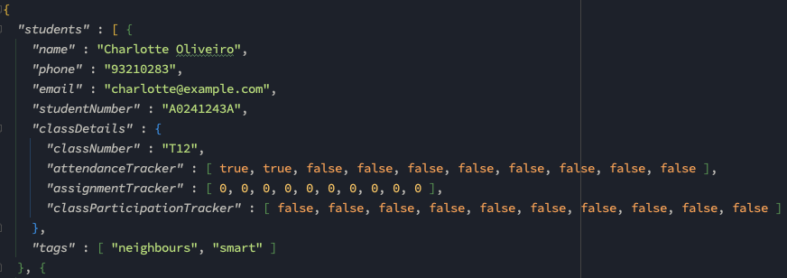

# Class Manager 2023 User Guide

Class Manager 2023 (CM 23) is a **desktop app for managing your students' contacts in the class,
optimized for use via a Command Line Interface** (CLI) while still having the benefits of a
Graphical User Interface (GUI). If you can type fast, CM 23 can get your contact
management tasks done faster than traditional GUI apps.

<!-- * Table of Contents -->
<page-nav-print />

--------------------------------------------------------------------------------------------------------------------

## Quick start

1. Ensure you have Java `11` or above installed in your Computer.

2. Download the latest `ClassManager.jar` from [here](https://github.com/AY2324S1-CS2103T-T11-1/tp/releases).

3. Copy the file to the folder you want to use as the _home folder_ for your ClassManager.

4. Open a command terminal, `cd` into the folder you put the jar file in, and use the `java -jar classmanager.jar` command to run the application. 
   A GUI similar to the below should appear in a few seconds. Note how the app contains some sample data. 
   

5. Type the command in the command box and press Enter to execute it. e.g. typing **`help`** and pressing Enter will open the help window. 
   Some example commands you can try:

   * `list` : Lists all student details.

   * `add n/John Doe p/98765432 e/johnd@example.com s/A0245234A c/T11` : Adds a student named `John Doe` to the Class Manager.

   * `delete s/A0245234A` : Deletes the student with student number A0245234A, which is added in the previous step.

   * `exit` : Exits the app.

6. Refer to the [Commands](#commands) below for details of each command.

--------------------------------------------------------------------------------------------------------------------

## GUI Overview

TODO: Add a screenshot of the GUI

TODO: Add a description of the GUI

--------------------------------------------------------------------------------------------------------------------

## Features

<box type="info" seamless>

**Notes about the command format:** 

* Words in `UPPER_CASE` are the parameters to be supplied by the user. 
  e.g. in `add n/NAME`, `NAME` is a parameter which can be used as `add n/John Doe`.

* Items in square brackets are optional. 
  e.g. `n/NAME [t/TAG]` can be used as `n/John Doe t/friend` or as `n/John Doe`.

* Items with `…`​ after them can be used multiple times including zero times. 
  e.g. `[t/TAG]…​` can be used as ` ` (i.e. 0 times), `t/friend`, `t/friend t/family` etc.

* Parameters can be in any order. 
  e.g. if the command specifies `n/NAME c/CLASS_NUMBER`, `c/CLASS_NUMBER n/NAME` is also acceptable.

* Extraneous parameters for commands that do not take in parameters (such as `help`, `list`, `exit` and `clear`) will be ignored. 
  e.g. if the command specifies `help 123`, it will be interpreted as `help`.

* If you are using a PDF version of this document, be careful when copying and pasting commands that span multiple lines as space characters surrounding line-breaks may be omitted when copied over to the application.
</box>

### Student Number

* Student Number refers to the unique matriculation number of a NUS student. It must begin with capital A, followed by any number of alphanumeric characters. It must not be blank.
* Class Manager uses the Student Number to uniquely identify each student in most commands. The Student Number is not case-sensitive, other than the first capital A. e.g. If the Student Number is `A123V`, `A123v` also refers to the same student.

### Command navigation

* Class Manager allows you to navigate to previously entered commands using the arrow keys. Navigate to earlier commands using the up arrow key, and later commands using the down arrow key.

--------------------------------------------------------------------------------------------------------------------

## Commands

### Configuring Class Manager : `config`

Before you can begin using Class Manager, you must configure the number of tutorials and assignments that your module has.

Format: `config #t/TUTORIAL_COUNT #a/ASSIGNMENT_COUNT`

* The information cannot be updated once configured.
* TUTORIAL_COUNT and ASSIGNMENT_COUNT must be valid non-negative integers.

Examples:
* `config #t/13 #a/1`
* `config #a/4 #t/26`

---

### Viewing help : `help`

Shows a message explaining how to access the help page.

Format: `help`

---

### Adding a student : `add`

Adds a student to the class manager.

Format: `add n/NAME p/PHONE e/EMAIL s/STUDENT NUMBER c/CLASS NUMBER [t/TAG]...​`

* **ALL** the fields must be provided.
* The NAME fields are case-sensitive.
* STUDENT NUMBER needs to be unique
* The class details of a student will be automatically populated to be 0 for all fields during the creation of a student.
* Comment for a student can only be added after the student is instantiated.

<box type="tip" seamless>

**Tip:** A student can have any number of tags (including 0)
</box>

Examples:
* `add n/John Doe p/98765432 e/johnd@example.com s/A0245234A c/T11 t/friends t/owesMoney`
* `add n/John Doe p/98765432 e/johnd@example.com s/A0245234A c/T11`

---
### Listing all student details : `list`

Shows a list of all student details in the class manager.

Format: `list`

---

### Editing a student : `edit`

Edits an existing student in the class manager.

Format: `edit STUDENT_NUMBER [n/NAME] [p/PHONE_NUMBER] [e/EMAIL] [s/NEW_STUDENT_NUMBER] [c/CLASS_NUMBER]`

* Edits the student with the student number `STUDENT_NUMBER`.
* The STUDENT_NUMBER must be valid and exist.
* At least one of the optional fields must be provided.
* Existing values will be updated to the input values.
* The NEW_STUDENT_NUMBER must be valid and unique (does not exist in the class manager).

Examples:
*  `edit 1 p/91234567 e/johndoe@example.com` Edits the phone number and email address of the 1st student to be `91234567` and `johndoe@example.com` respectively.
*  `edit 2 n/Betsy Crower` Edits the name of the 2nd student to be `Betsy Crower`.

---

### Tagging a student : `tag`

Tags the existing student in the class manager.

Format: `tag s/STUDENT_NUMBER [/add] [/delete] t/[TAG]…​`

* Tags the student with the specified `STUDENT_NUMBER`.
* When editing tags without `/add` or `/delete`, the existing tags of the student will be overwritten.
* You can remove all the student’s tags by typing `t/` without specifying any tags after it.

Examples:
* `tag s/A1234567N t/smart t/shy t/funny` replace all tags of the specified student with smart, shy and funny.
* `tag s/A1234567N /add t/Java` adds the Java tag to specified student.
* `tag s/A1234567N /delete t/shy` removes the shy tag from the specified student.
* `tag s/A1234567N t/` clear all tags from the specified student.

---

### Adding comment to a student : `comment`

Adds a comment to an existing student in the address book.

Format: `comment s/STUDENT_NUMBER c/COMMENT`

* The STUDENT NUMBER must be valid and exist.
* The COMMENT must be a valid string.
* Comment can only be performed after the student is created.
* Edit commands will not impact the comment tagged to the student.

Examples:
* `comment s/A0249112A c/This student is very hardworking.`
* `comment s/A0249112A c/This student is very hardworking and smart.`

---

### Lookup students : `lookup`

Lookup student details containing any of the given fields.

Format: `lookup [c/CLASS_NUMBER] [n/NAME] [p/PHONE_NUMBER] [e/EMAIL] [s/STUDENT_NUMBER] [t/TAG]`

<box type="warning" seamless>

**Caution:**
_At least one_ of the optional fields must be provided. `lookup` alone is not allowed.
</box>

* The command is **case-insensitive**. e.g. `hans` will match `Hans`
* Only **full words** will be matched e.g. `Han` will not match `Hans`
* The order of the fields does **not** matter. e.g. `lookup n/li c/T11` will return the same result as `lookup c/T11 n/li`
* Field with nothing will be ignored. e.g. `lookup n/ c/T11` will return the same result as `lookup c/T11`.
* This command can take multiple words per field. e.g. `lookup c/T11 T12` will return all students in `T11` or `T12`.

Examples:

* `lookup n/alex david` returns `Alex Yeoh`, `David Li` 
   
* `lookup c/t11` returns all students in class number T11 
   

---

### Configuring Class Manager: `config`

Configures Class Manager 2023 with the module information, such as tutorial count and assignment count.

Format: `config #t/TUTORIAL_COUNT #a/ASSIGNMENT_COUNT`
* Parameters must be zero or greater.

Examples:
* `config #t/2 #a/3` sets the tutorial count to 2 and assignment count to 3.

---

### Marking tutorial attendance for a student as present : `mark-pre`

Marking tutorial attendance for an existing student as present in the class manager.

Format: `mark-pre TUTORIAL_INDEX s/STUDENT_NUMBER`

* The `STUDENT_NUMBER` must be valid and exist.
* The `TUTORIAL_INDEX` must be a valid positive integer, within the configured tutorial count using the `config` command.

Examples:
* `mark-pre 1 s/A0249112A`

---

### Marking tutorial attendance for all students displayed as present : `mark-pre-all`

Marking tutorial attendance for all students displayed as present in the class manager.

Format: `mark-pre-all TUTORIAL_INDEX`

* The `TUTORIAL_INDEX` must be a valid positive integer, within the configured tutorial count using the `config` command.

Examples:
* `mark-pre-all 1`

---

### Marking tutorial attendance for a student as absent : `mark-abs`

Marking tutorial attendance for an existing student as absent in the class manager.

Format: `mark-abs TUTORIAL_INDEX s/STUDENT_NUMBER`

* The `STUDENT_NUMBER` must be valid and exist.
* The `TUTORIAL_INDEX` must be a valid positive integer, within the configured tutorial count using the `config` command.

Examples:
* `mark-abs 1 s/A0249112A`

---

### Setting assignment grade for a student : `grade`

Setting an assignment grade for an existing student in the class manager.

Format: `grade s/STUDENT_NUMBER a/ASSIGNMENT_INDEX g/GRADE`

* The `STUDENT_NUMBER` must be valid and exist.
* The `ASSIGNMENT_INDEX` must be a valid positive integer, within the configured assignment count using the `config` command.
* The `GRADE` must be a valid integer between 0 and 100.

Examples:
* `grade s/A0249112A a/1 g/100`

---

### Record class participation for a student : `class-part`

Recording the class participation level for an existing student in the class manager.

Format: `class-part s/STUDENT_NUMBER tut/TUTORIAL_INDEX part/PARTICIPATION_LEVEL`

* The `STUDENT_NUMBER` must be valid and exist.
* The `TUTORIAL_INDEX` must be a valid positive integer, within the configured tutorial count using the `config` command.
* The `PARTICIPATION_LEVEL` must be either `true` or `false`.
  * The `true` value indicates that the student has participated in the tutorial, while the `false` value indicates that the student has not participated in the tutorial.
* The `PARTICIPATION_LEVEL` is case-insensitive.
* In future versions, the `PARTICIPATION_LEVEL` will be replaced with various levels of participation.
  * The proposed levels includes: `none`, `sufficient`, `good`, `excellent`.

Examples:
* `class-part s/A0249112A tut/1 part/true`

---

### View a student's class details: `view`

Views the class details of a student that will be displayed on the right side of the application.

Format: `view s/STUDENT_NUMBER`

* The STUDENT_NUMBER must be valid e.g `T*`.
* The STUDENT_NUMBER must belong to a student in the class manager.

Example:

* `view s/A0245234A`

---

### Selecting students randomly: `random`

Select a specific number of students from all students displayed in the class manager.

Format: `random INDEX`

* The `INDEX` must be a valid positive integer.

Example:

* `random 2`

### Deleting a student : `delete`

Deletes the specific student.

Format: `delete s/STUDENT_NUMBER`

* The STUDENT_NUMBER must be valid and exist.

Example:
* `delete s/A0249112A`

---

### Clearing all entries : `clear`

Clears all entries from the class manager.

Format: `clear`

---

### Exiting the program : `exit`

Exits the program.

Format: `exit`

---

### Saving the data

Class Manager 2023 data is saved in the hard disk automatically after any command that changes the data. There is no need to save manually.

---

### Editing the data file

Class Manager 2023 data is saved automatically as a JSON file `[JAR file location]/data/classmanager.json`. Advanced users are welcome to update data directly by editing that data file.

<box type="warning" seamless>

**Caution:**
If your changes to the data file makes its format invalid, Class Manager 2023 will discard all data and start with an empty data file at the next run.  Hence, it is recommended to take a backup of the file before editing it.
</box>

---
### Loading the data file: `load`

Load student information from an existing JSON file. Copy the JSON file to be loaded into the data folder. The data in the JSON file will be loaded into the app. The file also becomes the new default save file.

Format: `load f/FILE_NAME`
* File name does not need to include .json extension.
* File name is case-insensitive

Examples:
* `load f/t2` loads the t2.json file in the data folder.

* 

* 

---

### Toggling color themes: `theme`

Toggles between light and dark color themes.

Format: `theme`
##### Dark theme
   

##### Light theme

---

--------------------------------------------------------------------------------------------------------------------

## FAQ

**Q**: How do I transfer my data to another Computer? 
**A**: Install the app in the other computer and overwrite the empty data file it creates with the file that contains the data of your previous Class Manager 2023 home folder.

--------------------------------------------------------------------------------------------------------------------

## Known issues

1. **When using multiple screens**, if you move the application to a secondary screen, and later switch to using only the primary screen, the GUI will open off-screen. The remedy is to delete the `preferences.json` file created by the application before running the application again.

--------------------------------------------------------------------------------------------------------------------

## Command summary (in alphabetical order)

### Useful commands
| Action                      | Format, Examples                                                                                                                                                 |
|-----------------------------|------------------------------------------------------------------------------------------------------------------------------------------------------------------|
| **Configure Class Manager** | `config #t/TUTORIAL_COUNT #a/ASSIGNMENT_COUNT`  e.g. `config #t/13 #a/3`                                                                                      |
| **Open help window**        | `help`                                                                                                                                                           |

### Core commands without parameters
| Action                 | Format, Examples                                                                                                                                                 |
|------------------------|------------------------------------------------------------------------------------------------------------------------------------------------------------------|
| **Clear student list** | `clear`                                                                                                                                                          |
| **Exit Class Manager** | `exit`                                                                                                                                                           |
| **List all students**  | `list`                                                                                                                                                           |
| **Toggle theme**       | `theme`                                                                                                                                                          |

### Core commands with parameters
| Action                         | Format, Examples                                                                                                                                                 |
|--------------------------------|------------------------------------------------------------------------------------------------------------------------------------------------------------------|
| **Add**                        | `add n/NAME p/PHONE_NUMBER e/EMAIL c/CLASS_NUMBER [t/TAG]…​`   e.g `add n/James Ho p/22224444 e/jamesho@example.com c/T11 t/friend t/colleague`               |
| **Comment**                    | `comment s/STUDENT_NUMBER c/COMMENT`   e.g. `comment s/A0249112A c/This student is very hardworking.`                                                         |
| **Delete**                     | `delete s/STUDENT_NUMBER`  e.g. `delete s/A0249112A`                                                                                                          |
| **Edit**                       | `edit STUDENT_NUMBER [n/NAME] [p/PHONE_NUMBER] [e/EMAIL] [s/NEW_STUDENT_NUMBER] [c/CLASS_NUMBER]`  e.g.`edit A0245234A n/John Bob p/98761234 e/johnd@exp.com` |
| **Lookup**                     | `lookup [c/CLASS_NUMBER] [n/NAME] [p/PHONE_NUMBER] [e/EMAIL] [s/STUDENT_NUMBER] [t/TAG]`   e.g. `lookup c/T11`                                                |
| **Load**                       | `load f/FILE_NAME`  e.g. `load f/export-v1`                                                                                                                   |
| **Mark Absent**                | `mark-abs TUTORIAL_INDEX s/STUDENT_NUMBER`   e.g. `mark-abs 1 s/A0245234A`                                                                                    |
| **Mark Present**               | `mark-pre TUTORIAL_INDEX s/STUDENT_NUMBER`   e.g. `mark-pre 1 s/A0245234A`                                                                                    |
| **Mark Present All**           | `mark-pre-all TUTORIAL_INDEX`   e.g. `mark-pre-all 1`                                                                                                         |
| **Random**                     | `random INDEX`   e.g. `random 2`                                                                                                                              |
| **Record Class participation** | `class-part s/STUDENT_NUMBER tut/TUTORIAL_INDEX part/PARTICIPATION_LEVEL`   e.g. `class-part s/A0245234A tut/1 part/true`                                     |
| **Set Grade**                  | `grade s/STUDENT_NUMBER a/ASSIGNMENT_INDEX g/GRADE`   e.g. `grade s/A0245234A a/1 g/100`                                                                      |
| **Tag**                        | `tag STUDENT_NUMBER [/add] [/delete] t/[TAG]…​`   e.g. `tag A0123456N t/smart t/shy`                                                                          |
| **View**                       | `view STUDENT_NUMBER`   e.g. `view A0245234A`                                                                                                                 |

--------------------------------------------------------------------------------------------------------------------

## Glossary

* **cd**: Change directory command in terminal/command line. cd takes the name of the folder you want to navigate to as an argument. The full command is cd `your-directory`.
* **Student Number**: Matriculation number of NUS student. It must begin with capital A, followed by any number of alphanumeric characters. It must not be blank.
* **Email**: Any valid email address, such as NUS email address (eXXXXXXX@u.nus.edu).
* **CLI**: Command Line Interface.
* **GUI**: Graphical User Interface.
