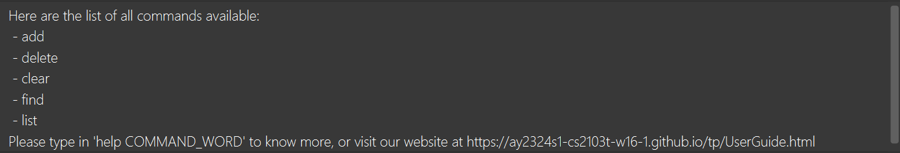
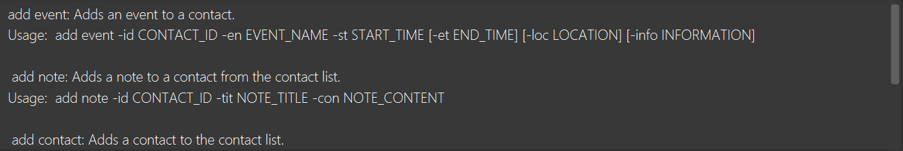
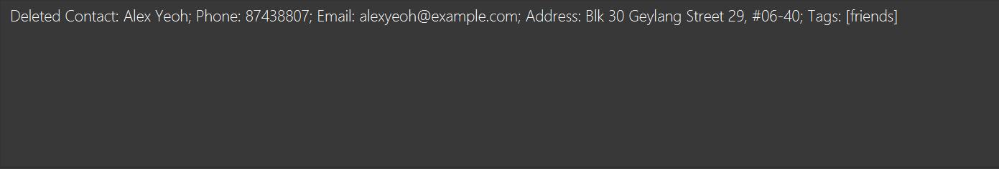
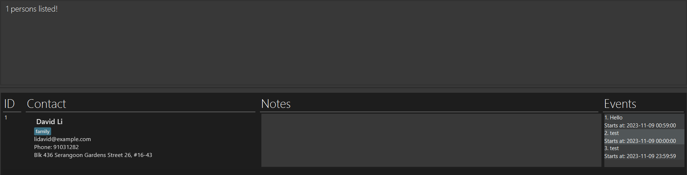
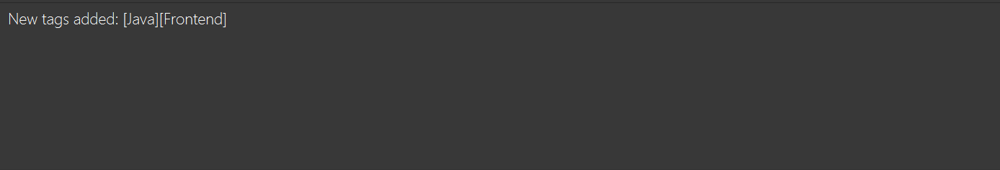
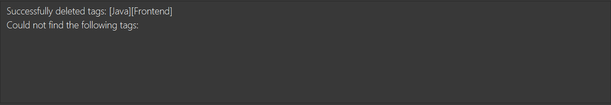
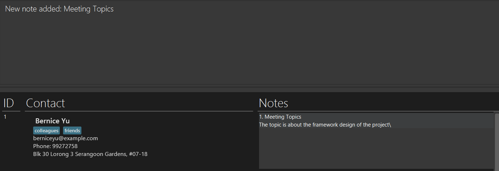
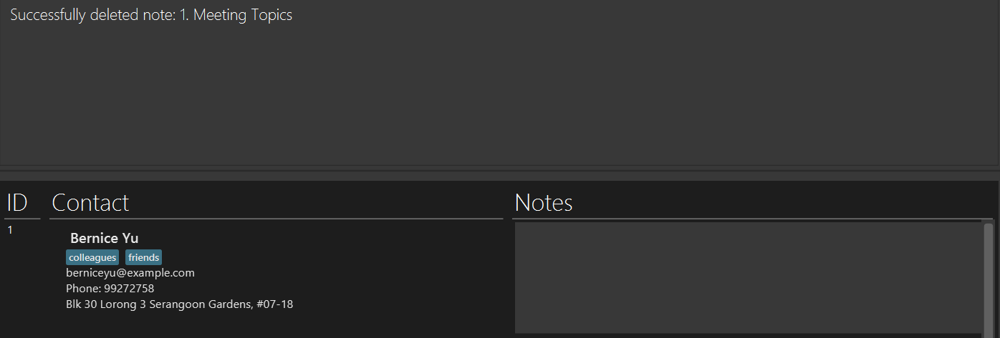
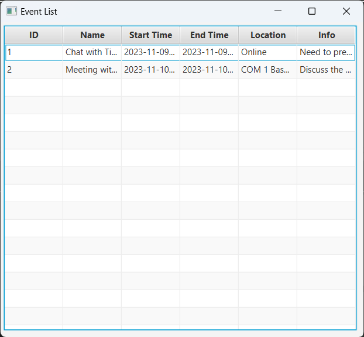

# KeepInTouch User Guide

**_KeepInTouch_** is a desktop app for **managing contacts** for **job-seekers**. It can also help job-seekers to manage **events for career purposes.**
KeepInTouch is optimized for use via a _Line Interface (CLI)_ while still having the benefits of a Graphical User Interface (GUI).
If you can type fast, KeepInTouch can get your contact management tasks done faster than traditional GUI apps.

<!-- * Table of Contents -->
<page-nav-print />

--------------------------------------------------------------------------------------------------------------------

## Table of Contents

* [Quick Start](#quick-start)
* [Features](#features)
  * [Viewing help: `help`](#viewing-help-help)
  * [Listing contacts: `list contact`](#listing-contacts-list-contact)
  * [Adding a contact: `add contact`](#adding-a-contact-add-contact)
  * [Deleting a contact: `delete contact`](#deleting-a-contact-delete-contact)
  * [Finding a contact: `find`](#finding-a-contact-find)
  * [Adding tags: `add tag`](#adding-tags-add-tag)
  * [Deleting tags: `delete tag`](#deleting-tags-delete-tag)
  * [Adding notes to a contact: `add note`](#adding-notes-to-a-contact-add-note)
  * [Deleting a note: `delete note`](#deleting-a-note-delete-note)
  * [Listing events: `list events`](#listing-events-list-events)
  * [Adding an event: `add event`](#adding-an-event-add-event)
  * [Deleting an event: `delete event`](#deleting-an-event-delete-event)
  * [Clearing data: `clear`](#clearing-data-clear)
  * [Exiting the program: `exit`](#exiting-the-program-exit)
  * [Saving the data](#saving-the-data)
  * [Other Features: _coming soon..._](#other-features)
* [Glossary](#glossary)
* [FAQ](#faq)
* [Known Issues](#known-issues)
* [Command Summary](#command-summary)

--------------------------------------------------------------------------------------------------------------------

## Quick start

1. Ensure you have [Java 11](https://www.oracle.com/sg/java/technologies/javase/jdk11-archive-downloads.html) installed in your Computer.

2. Download the latest `keepintouch.jar` from [here](https://github.com/AY2324S1-CS2103T-W16-1/tp/releases).

3. Copy the file to the folder you want to use as the [home directory](#home-directory) for your KeepInTouch app.

4. Open a command terminal, `cd` into the folder you put the jar file in, and use the `java -jar keepintouch.jar` command to run the application. (   A GUI similar to the below should appear in a few seconds. Note how the app contains some sample data.)


5. Type the command in the command box and press Enter to execute it. e.g. typing **`help`** and pressing Enter will show the list of all available commands.<br>

6. Refer to the [Features](#features) below for details of each command.

--------------------------------------------------------------------------------------------------------------------

## Features

<box type="info" seamless>

**Notes about the command format:**<br>

* Words in `UPPER_CASE` are the parameters to be supplied by the user.<br>
  e.g. in `delete contact CONTACT_ID`, `CONTACT_ID` is a parameter which can be used as `delete contact 1`.

* Items in square brackets are optional.<br>
  e.g `add contact -n NAME [-p PHONE_NUMBER] [-a ADDRESS] [-e EMAIL] [-t TAGNAME...]` can be used as `add contact -n Aaron -p 12345678 -a Baker Street 12 -e aaron123@gmail.com -t Frontend` or as `add contact -n Aaron -e aaron123@gmail.com`.

* Items with `…`​ after them can be used multiple times.<br>
  e.g. `[-t TAGNAME...]` can be used as `-t Frontend`, `-t Frontend -t Java` etc.

* Parameters can be in any order.<br>
  e.g. if the command specifies `-n NAME -t NOTE_TITLE`, `-t NOTE_TITLE -n NAME` is also acceptable.

* Extraneous parameters for commands that do not take in parameters (such as `list contact` and `exit`, etc.) will be ignored.<br>
  e.g. if the command specifies `exit 123`, it will be interpreted as `exit`.

* If you are using a PDF version of this document, be careful when copying and pasting commands that span multiple lines as space characters surrounding line-breaks may be omitted when copied over to the application.

**Requirements and details on user supplied parameters:** <br>

* `CONTACT_ID` is the number that is on the left of the contact's name in each contact card.

* `CONTACT_ID` should be a positive integer less than 2,147,483,648.

* `NAME` should be alphanumeric, spaces are allowed.

* `PHONE_NUMBER` should be numbers at least 3 digits long.

* `EMAIL` should be of the format local-part@domain:
  *  The local-part should only contain alphanumeric characters and the special characters `+`, `_`, `.`, `-`. The local-part should not start or end with any special characters.
  * The domain name should:
    *  end with a domain label at least 2 characters long
    * have each domain label start and end with alphanumeric characters
    * have each domain label consist of alphanumeric characters, separated only by hyphens, if any.

* `TAGNAME` should be alphanumeric, with no spaces.

* `TAGNAME` is case-sensitive. For example, a [contact](#contact) can have [tags](#tag) `HR REPRESENTATIVE` and `HR representative` at the same time.

* `START_TIME` and `END_TIME` can be in one of the following formats:
  * Both date and time: `yyyy-MM-dd HH:mm[:ss]`
    - Example: `2023-10-12 20:05`, `2023-10-12 20:05:30`
  * Only date (Time will be defaulted to 00:00): `yyyy-MM-dd`
    - Example: `2023-10-12`
  * Only time (Date will be defaulted to the current date): `HH:mm[:ss]`
    - Example: `00:10`, `05:01:45`


</box>

### Viewing help: `help`

Shows a list of commands and functionalities.

Format: `help [COMMAND_WORD]`

* Add `COMMAND_WORD` after `help` to view the specific functionalities of the command.
* `COMMAND_WORD` includes: `add`, `delete`, `clear`, `find`, `list`.

Examples:
* `help`
* `help add`

Successful output:



### Listing [contacts](#contact): `list contact`

Shows a list of all contacts in the contact list if tags not specified. 
Otherwise, shows a list of contacts which contains any one of the specified tags. 

Format: `list contact [-t TAGNAME...]`

* Lists all contacts if no tags passed. 
* If tags argument passed, lists only contacts that contain one of the tags.

Examples:
* `list contact` to show all contacts.
* `list contact -t Recruiter` to show all contacts which have a recruiter tag.

Successful output:


### Adding a [contact](#contact): `add contact`

Adds a contact to the contact list.

Format: `add contact -n NAME -p PHONE_NUMBER -a ADDRESS -e EMAIL [-t TAGNAME...]`

Examples:
* `add contact -n Aaron -p 12345678 -a Baker Street 12 -e aaron123@gmail.com`

Successful output:


Unsuccessful output:
* Contact already exists: `This contact already exists in the contact list`
* Invalid format<br>
```
Invalid command format! 
add contact: Adds a contact to the contact list. 
Usage: add contact -n NAME -p PHONE -e EMAIL -a ADDRESS [-t TAGNAME...]
Example: add contact -n John Doe -p 98765432 -e johnd@example.com -a 311, Clementi Ave 2, #02-25 -t frontend 
```
* Invalid email:<br>
```
Emails should be of the format local-part@domain and adhere to the following constraints:
1. The local-part should only contain alphanumeric characters and these special characters, excluding the parentheses, (+_.-). The local-part may not start or end with any special characters.
2. This is followed by a '@' and then a domain name. The domain name is made up of domain labels separated by periods.
The domain name must:
    - end with a domain label at least 2 characters long
    - have each domain label start and end with alphanumeric characters
    - have each domain label consist of alphanumeric characters, separated only by hyphens, if any.
```
* Invalid phone number: `Phone numbers should only contain numbers, and it should be at least 3 digits long`


### Deleting a [contact](#contact): `delete contact`

Deletes the specified contact from the contact list.

Format: `delete contact CONTACT_ID`

Examples:
* `delete contact 1` deletes the first contact in the contact list.

Successful output:


Unsuccessful output:
* Invalid index (out of range): `The person index provided is invalid`
* Invalid format:<br>
```
Invalid command format! 
delete contact: Deletes a contact by its index number used in the displayed contact list.
Parameters: INDEX (must be a positive integer)
Example: delete contact 1
```

### Finding a [contact](#contact): `find`

Finds a contact by their name by matching keywords with the contact's name. Only word-word matches will be detected, and partial words match will not be detected. For example, `Ale` will not match `Alex` but will match `Alex Wong`. Keywords are **case insensitive**.

Format: `find KEYWORD [OTHER_KEYWORDS...]`

Examples:
* `find David`

Successful output:


### Adding a [tag](#tag): `add tag`

Adds one or more tags to a contact. Contact list will go back to showing all contacts upon successful addition.

Format: `add tag -id CONTACT_ID -t TAGNAME...`

* Adds one or more tags to a contact.
* Duplicates are accepted but only unique tags will be added.

Examples:
* `add tag -id 1 -t Frontend` adds a tag with tag name "Frontend" to the first contact in the contact list.
* `add tag -id 1 -t Frontend -t Java` adds two tags with tag name "Frontend" and "Java" to the first contact in the contact list.

Successful output:


Unsuccessful output:
* Invalid index (out of range): `Can not find the target contact with ID: 100`
* Invalid format:<br>
```
Invalid command format! 
add tag: Adds tags to a contact from the contact list.
Usage:  add tag -id CONTACT_ID -t TAGNAME...
```

### Deleting [tags](#tag): `delete tag`

Deletes one or more tags to a contact. Contact list will go back to showing all contacts upon successful deletion.

Format: `delete tag -id CONTACT_ID -t TAGNAME...`

* Duplicate `TAGNAME` are accepted, but they will be treated as one.

Examples:
* `delete tag -id 1 -t Frontend` deletes a tag with tag name "Frontend" from the first contact in the contact list.
* `delete tag -id 1 -t Frontend -t Java` deletes two tags with tag name "Frontend" and "Java" from the first contact in the contact list.

Successful output:


Unsuccessful output:
* Invalid index (out of range): `Can not find the target contact with ID: 100`
* Invalid format:<br>
```
Invalid command format! 
delete tag: Delete one or more tags from a contact.
Usage:  delete tag -id CONTACT_ID -t TAGNAME...
```

### Adding a [note](#note) to a [contact](#contact): `add note`

Adds a note to a contact from the contact list.

Format: `add note -id CONTACT_ID -tit NOTE_TITLE -con NOTE_CONTENT`

Examples:
* `add note -id 1 -tit Meeting Topics -con The topic is about the framework design of the project`
* `add note -id 2 -tit Open Position -con Applications for SWE full-time positions will open soon`

Successful output:


Unsuccessful output:
* Invalid index (out of range): `Can not find the target contact with ID: 100`
* Invalid format:<br>
```
Invalid command format! 
add note: Adds a note to a contact from the contact list.
Usage:  add note -id CONTACT_ID -tit NOTE_TITLE -con NOTE_CONTENT
```

### Deleting a [note](#note): `delete note`

Deletes the specified note from the contact list.

Format: `delete note -id CONTACT_ID -nid NOTE_ID`

* Deletes the note with the id `NOTE_ID` from the contact with id `CONTACT_ID`.

Examples:
* `delete note -id 1 -nid 1` deletes the first note from the first contact in the contact list.

Successful output:


Unsuccessful output:
* Invalid contact index (out of range): `Can not find the target contact with ID: 100`
* Invalid note index: `Note not found: ID = 5`
* Invalid format:<br>
```
Invalid command format! 
delete note: Deletes a note from a contact.
Usage:  delete note -id CONTACT_ID -nid NOTE_ID
```

### Listing [events](#event): `list events`

Shows a list of all events or events within a specified time interval.

Format: `list events [-descending] [-st START_TIME] [-et END_TIME]` (start time and end time are inclusive)

Arguments `-st` and `-et` must both present or both not present.
  - If both are not present, all events will be listed.
  - If both present, events within the time interval wil listed.

By default, the list of events are sorted by the start time in ascending order (i.e. from earlier to latest). If you want to use descending order, add `-descending` to the command.

Executing this command will create a popup window, which shows a table representing the events within the specified time interval. The columns inside the table are resizeable.

Examples:
* `list events`
* `list events -st 2023-11-01 -et 2023-11-02`
* `list events -descending -st 2023-11-01 -et 2023-11-02`

Successful output:



Unsuccessful ouput:
* Invalid format:<br>
```
Invalid command format! 
list events: Shows a list of all events or events within a specified time interval.
Usage: list events [-descending] [-st filter_start_time] [-et filter_end_time] (-st and -et must either both present or both not present)
```

### Adding an [event](#event): `add event`

Adds an event to a contact. The event should not have clashes in timing with other existing events in the contact list. Events with start time earlier than the current time are allowed for keeping track of past events.

Format: `add event -id CONTACT_ID -en EVENT_NAME -st START_TIME [-et END_TIME] [-loc LOCATION] [-info INFORMATION]`

* If `END_TIME` is not given, it will be defaulted to the `START_TIME`.
* If `START_TIME` is exactly equals to `END_TIME`, the `END_TIME` for the event will not be displayed in text-based UI.

Examples:
* `add event -id 1 -en Meeting with professor -st 12:00 -et 13:00 -loc COM 1 Basement -info Discuss the project implementation with the professor`
* `add event -id 2 -en Chat with TikTok recruiter -st 17:00`

Successful output:


Unsuccessful output:
* Event already exists: `Error: Operation would result in duplicate events`
* Invalid contact index (out of range): `Can not find the target contact with ID: 100`
* Invalid time format: `Invalid date-time format! Text '29/05/2024' could not be parsed at index 2`
* Invalid command format:<br>
```
Invalid command format! 
add event: Adds an event to a contact.
Usage:  add event -id CONTACT_ID -en EVENT_NAME -st START_TIME [-et END_TIME] [-loc LOCATION] [-info INFORMATION]
```

### Deleting an [event](#event): `delete event`

Deletes the specified event from a contact.

Format: `delete event -id CONTACT_ID -eid EVENT_ID`

* Deletes the event with the id `EVENT_ID` from the contact `CONTACT_ID`.
* Note that `EVENT_ID` is the number that are in the left of the event line under each contact card.

Examples:
* `delete event -id 1 -eid 2` deletes the second event from the first contact in the contact list.

Successful output:


Unsuccessful output:
* Invalid contact index (out of range): `Can not find the target contact with ID: 100`
* Invalid note index: `Event not found: ID = 5`
* Invalid format:<br>
```
Invalid command format! 
delete event: Deletes an event from a contact.
Usage:  delete event -id CONTACT_ID -eid EVENT_ID
```

### Clearing data: `clear`

Clears all KeepInTouch entries.

Format: `clear`

### Exiting the program: `exit`

Exits the program.

Format: `exit`

### Saving the data

KeepInTouch data are saved in the hard disk automatically after any command that changes the data. There is no need to save manually.


### Other Features

_More features coming soon ..._

--------------------------------------------------------------------------------------------------------------------

## Glossary

 - ##### _home directory_:
   The directory where the jar file for the application and the `data` folder presents.
 - ##### _contact_:
   The unit for storing the contact information for a person/entity in the address book. You can add [tags](#tag), [notes](#note) and [events](#event) to a _contact_.
 - ##### _tag_:
   Short tags to be added to the contact for you to reference. It can be the type of the contact, for example, `company`, `HR`, etc.
 - ##### _note_
   A piece of additional information for a contact that you want to store and reference in the future. It can be any additional information you'd like to keep with the contact.
 - ##### _event_
   A representative of an event that you will happen with a person/entity in a contact in the future. It can be job interviews, career fairs or HR meeting appointments.

--------------------------------------------------------------------------------------------------------------------

## FAQ

**Q**: Why can't I run the app?<br>
**A**: Make sure you have [Java 11](https://www.oracle.com/sg/java/technologies/javase/jdk11-archive-downloads.html) installed before running the app, and make sure you have followed the way mentioned in [Quick Start](#quick-start).

**Q**: How do I transfer my data to another device?<br>
**A**: Please follow these steps:
  - Download the jar file for the app on the new device.
  - Copy the data folder from the old device to the new device, and put it in the [home directory](#home-directory) on the new device.
    - The data folder from the old device is located at [home directory](#home-directory)/data`. You need to copy the folder along with all files inside to the new device to complete data transfer.
  - Run the application on the new device. Now you should see the data from old device on your new device.
  - Similarly, if you want to move the jar file to another directory (change the [home directory](#home-directory)) within the same device, you also need to make sure that the `data` folder is always in the new [home directory](#home-directory) together with the jar file.

**Q**: Can I modify the data file outside the application itself?<br>
**A**: No, you **should _NOT_ directly modify the data file** outside the application at anytime, otherwise it may lead to unpredictable consequences and errors to the application.

--------------------------------------------------------------------------------------------------------------------

## Known issues

_No known issues at the moment_

--------------------------------------------------------------------------------------------------------------------

## Command summary

| Action             | Format, Examples                                                                                                                                                                                                                                                        |
|--------------------|-------------------------------------------------------------------------------------------------------------------------------------------------------------------------------------------------------------------------------------------------------------------------|
| **List Contact**   | `list contact [-t TAGNAME...]` <br> e.g., `list contact -t Recruiter`                                                                                                                                                                                                   |
| **Add Contact**    | `add contact -n NAME -p PHONE_NUMBER -a ADDRESS -e EMAIL [-t TAGNAME...]` <br> e.g., `add contact -n Aaron -p 12345678 -a Baker Street 12 -e aaron123@gmail.com -t Frontend`                                                                                            |
| **Delete Contact** | `delete contact CONTACT_ID`<br> e.g., `delete contact 1`                                                                                                                                                                                                                |
| **Find Contact**   | `find KEYWORD [OTHER_KEYWORDS...]`<br> e.g., `find Alex`                                                                                                                                                                                                                |
| **Add Tag**        | `add tag -id CONTACT_ID -t TAGNAME...` <br> eg., `add tag -id 1 -t Frontend`                                                                                                                                                                                            |
| **Delete Tag**     | `delete tag -id CONTACT_ID -t TAGNAME...` <br> eg., `delete tag -id 1 -t Frontend`                                                                                                                                                                                      |
| **Add Note**       | `add note -id CONTACT_ID -t NOTE_TITLE -c NOTE_CONTENT` <br> e.g., `add note -id 2 -tit Open Position -con Applications for SWE full-time positions will open soon`                                                                                                     |
| **Delete Note**    | `delete note -id CONTACT_ID -t NOTE_TITLE`<br> e.g., `delete note -id 2 -t Meeting Topics`                                                                                                                                                                              |
| **List Events**    | `list events [-descending] [-st filter_start_time] [-et filter_end_time]`<br> e.g., `list events -descending -st 2023-11-01 -et 2023-11-02`                                                                                                                             |
| **Add Event**      | `add event -id CONTACT_ID -en EVENT_NAME -st START_TIME [-et END_TIME] [-loc LOCATION] [-info INFORMATION]` <br> e.g., `add event -id 1 -en Meeting with professor -st 12:00 -et 13:00 -loc COM 1 Basement -info Discuss the project implementation with the professor` |
| **Delete Event**   | `delete event -id CONTACT_ID -eid EVENT_ID`<br> e.g., `delete event -id 1 -eid 1`                                                                                                                                                                                       |
| **Clear Data**     | `clear`                                                                                                                                                                                                                                                                 |
| **Help**           | `help [COMMAND_WORD]` <br> e.g., `help add`                                                                                                                                                                                                                             |
