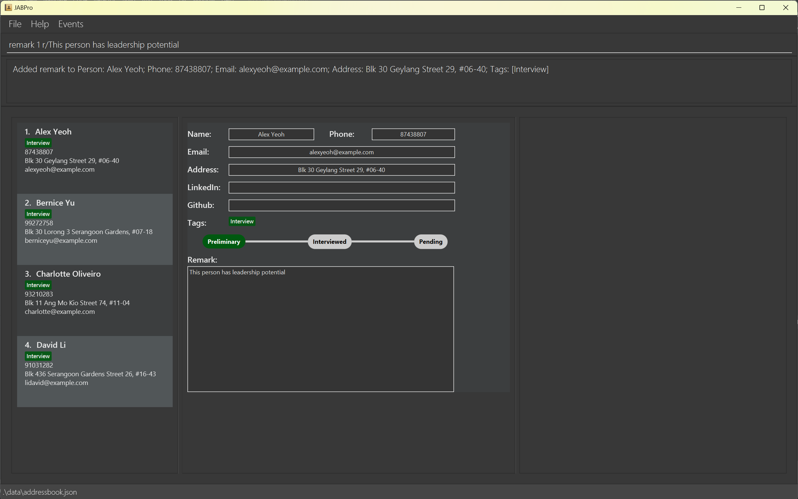
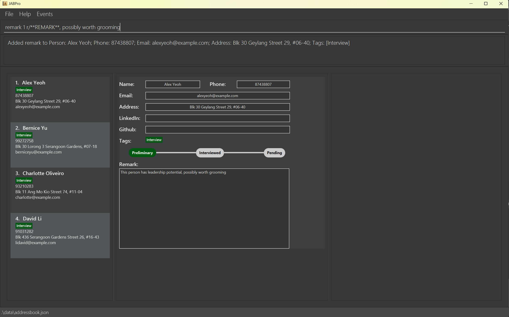
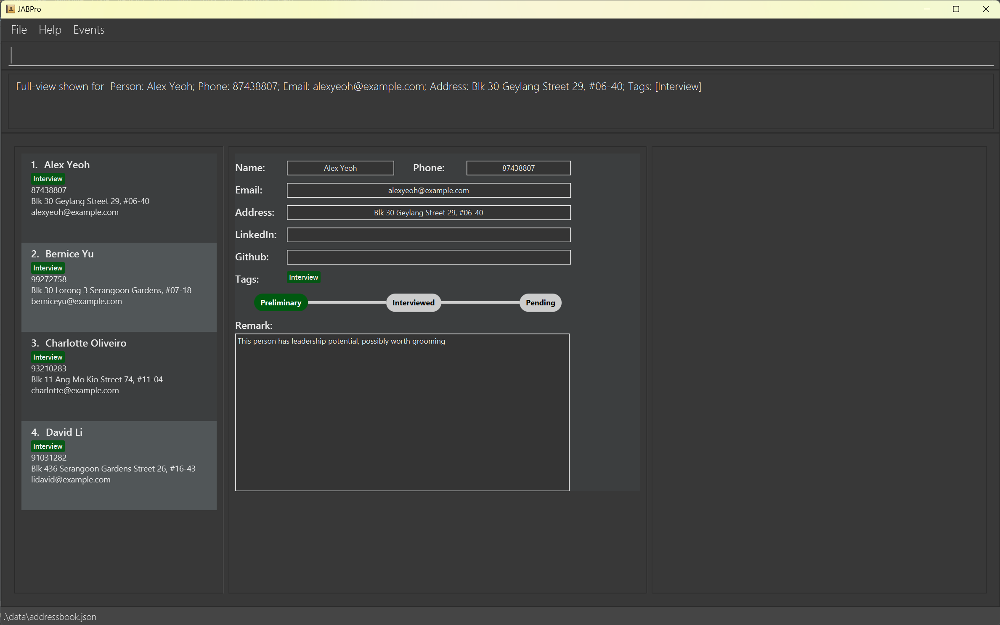
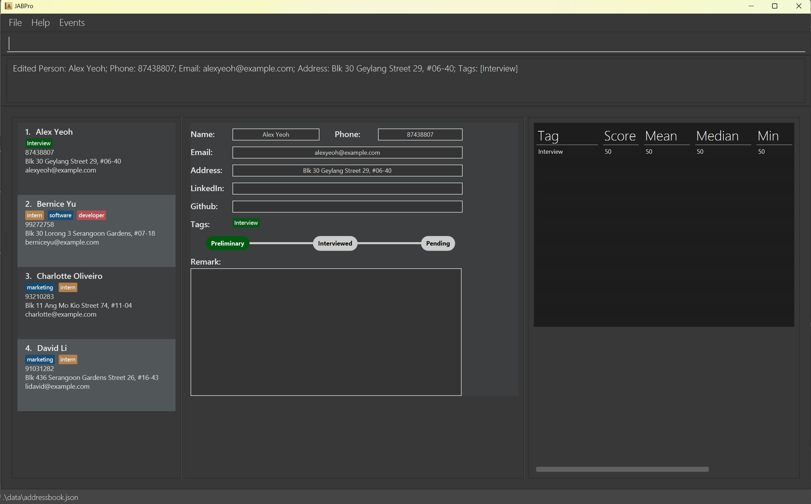
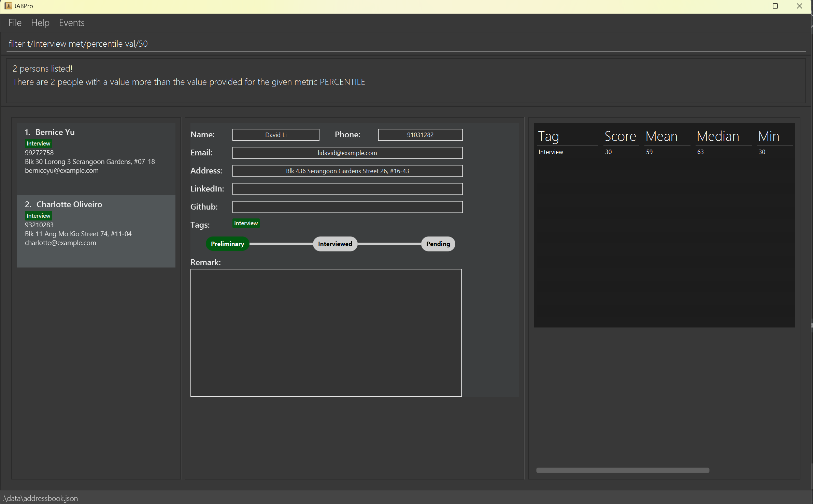

# JABPro User Guide

## Product Overview

JobApplicationsBook Pro (JABPro) is a **desktop app for hiring managers of companies to ease the management of applicants, optimized for use via a  Line Interface** (CLI) while still having the benefits of a Graphical User Interface (GUI). If you can type fast, JABPro can get your applicant management tasks done faster than traditional GUI apps.

<!-- * Table of Contents -->
<page-nav-print />

--------------------------------------------------------------------------------------------------------------------

## Key definitions
You are a 'beginner' user if ...

1. you are new to JABPro (used JABPro less than 5 times) and
2. you wish to fully rely on the JABPro interface

You are an 'advanced' user if ...
1. you have used JABPro multiple times now and
2. you use JABPro's search and summary statistics extensively for comparison or
3. you would like to challenge yourself to go beyond the JABPro user interface and manually edit files

--------------------------------------------------------------------------------------------------------------------

## Quick start

1. Ensure you have Java `11` or above installed in your Computer.

2. Download the latest `jabpro.jar` from [here](https://github.com/AY2324S1-CS2103T-W09-4/tp/releases).

3. Copy the file to the folder you want to use as the _home folder_ for your JabPro.

4. Open a command terminal, `cd` into the folder you put the jar file in, and use the `java -jar jabpro.jar` command to run the application.   
   A GUI similar to the below should appear in a few seconds. Note how the app contains some sample data.   
   

5. Type the command in the command box and press Enter to execute it. 
   Some example commands you can try:

    * `add n/John Doe p/98765432 e/johnd@example.com a/John street, block 123, #01-01`: adds an applicant with the specified contact details

    * `remark 1 r/Great attitude, hardworking`: edits the remark of the 1st person on the list to have a remark `Great attitude, hardworking`
    * `view 1`: shows the complete details of the 1st person on the list.

    * `search n/John`: Searches for applicants whose names contain the keyword `John`

    * `delete 3` : Deletes the 3rd contact shown in the current list.

    * `set` : sets the applicant status to either of: (Preliminary, Interviewed, Rejected, Offered)

    * `add linkedin 1 alexyeoh`: Adds LinkedIn account to candidate's existing contact information

    * `github Alex Yeoh`: Redirects the user to the Github account of the candidate [provided github has been added previously]

Refer to the [Features](#features) below for details of each command.

--------------------------------------------------------------------------------------------------------------------

## Features

<box type="info" seamless>

**Notes about the command format:** 

* Words in `UPPER_CASE` are the parameters to be supplied by the user. 
  e.g. in `add n/NAME`, `NAME` is a parameter which can be used as `add n/John Doe`.

* Items in square brackets are optional. 
  e.g `n/NAME [t/TAG]` can be used as `n/John Doe t/friend` or as `n/John Doe`.

* When using parentheses ( ) with items separated by the slash symbol /, at least one item must be included.  
  e.g in the command `search (n/KEYWORD [MORE KEYWORDS] / st/KEYWORD [MORE KEYWORDS] / t/KEYWORD [MORE KEYWORDS])`, it is necessary to specify at least one search category.

* Items with `…`​ after them can be used multiple times including zero times. 
  e.g. `[t/TAG]…​` can be used as ` ` (i.e. 0 times), `t/friend`, `t/friend t/family` etc.

* Parameters can be in any order. 
  e.g. if the command specifies `n/NAME p/PHONE_NUMBER`, `p/PHONE_NUMBER n/NAME` is also acceptable.

* Extraneous parameters for commands that do not take in parameters (such as `help`, `listT`, `exit` and `clear`) will be ignored. 
  e.g. if the command specifies `help 123`, it will be interpreted as `help`.

* If you are using a PDF version of this document, be careful when copying and pasting commands that span multiple lines as space characters surrounding line-breaks may be omitted when copied over to the application.
  </box>

### Viewing help : `help`

Shows a message explaining how to access the help page.

Format: `help`

### Creating tags: `create`

Creates a tag and categorises it to the specified category.
You can customize these categories as per your needs and tags will be 
color coded by the different categories. 

The only restriction is that you can only define up to 6 different categories (including the *assessment* category for score-related tags. Hence if you have
defined a tag category *assessment* for score-related tags, you will only be able to define 5 other categories).

Format: `create t/CATEGORY TAGNAME…​`

* CATEGORY is a MANDATORY field.

<box type="tip" seamless>

**Tip:** 
* You can create multiple tags at once!
* Use this command for frequently used tags for better efficiency in tagging candidates!
</box>

**Note:**
* The tags created using this command can be used to tag candidates using the `add` or `edit` command. Tagging
candidates without previously categorising the tags would still work but the tags would be *uncategorised*.
* `create` only allows tags to be categorised at creation meaning tags that have already been created, cannot be categorised further.
This feature will be supported in future iterations of JABPro through the `edit tags` command.

Examples:
* `create t/role developer`
* `create t/dept software t/dept marketing`

An example of the `create` command in action:

### Adding a person: `add`

Adds a person to JABPro.

Format: `add n/NAME p/PHONE_NUMBER e/EMAIL a/ADDRESS [t/[CATEGORY] TAGNAME]…​`

**Notes regarding the design of the `add` command:**
* The uniqueness of the person is determined by the name only. This means that you cannot have 2 persons with the same name in the application book.
* All other fields other than name can be identical between different people in JABPro.
* `n/NAME` - `NAME` must be alphanumeric (Letters and numbers, no symbols allowed such as `/`, `,` ...)
* `p/PHONE_NUMBER` - `PHONE_NUMBER` must contain numbers only and should be at-least 3 digits long
* `e/EMAIL` - `EMAIL` must be the standard email address format (There must be an email-prefix followed by  `@` symbol and email domain)
* `a/ADDRESS` - `ADDRESS` can be any value, including special characters such as `#`, `,` ...
* `n/NAME`, `p/PHONE_NUMBER`, `e/EMAIL`, `a/ADDRESS` are mandatory fields.  
They cannot be blank and must follow the convention as mentioned above.
* `t/[CATEGORY] TAGNAME` - `TAGNAME` must be alphanumeric with no spaces. Any details after the space will be ignored.
* The `t/[CATEGORY] TAGNAME` field is optional. You can add as many tags as you want, including 0 tags.
* Persons added using the `add` command will be added to the end of the list.

**Notes on adding tags:**
* If you would like to tag a user with a tag that has not been categorised yet using the `create` command,
you can specify the category that you would like it to be categorised to in the `add` command. e.g. `...t/role swe`
* If you are using a tag that has not been categorised yet and you did not specify its category in the `add` command,
the tag would still be saved but it would be "uncategorised" by default.
* If you have multiple tags in different categories with the same name, you must specify the category when you want to 
add one of these tags to the candidate you are adding.

<box type="tip" seamless>

**Tip:** 
* A person can have any number of tags (including 0)!
</box>
 

Examples:
* `add n/John Doe p/98765432 e/johnd@example.com a/John street, block 123, #01-01`
* `add n/Betsy Crowe t/friend e/betsycrowe@example.com a/Newgate Prison p/1234567 t/developer t/software` (note: *developer* and *software* tags have been categorised by the previous `create` command)
* `add n/Betsy Crowe t/friend e/betsycrowe@example.com a/Newgate Prison p/1234567 t/dept finance`
* `add n/Betsy Crowe t/friend e/betsycrowe@example.com a/Newgate Prison p/1234567 t/uncategorisedtag`

Negative Examples:
* `add n/Alex Yoh p/82384839 e/alexyeo@gmail.com a/Gardens by bay` (Name already exists in JABPro)

### Adding a remark to a person: `remark`

Edits a remark of an existing person in JABPro.

Format: `remark INDEX r/REMARK`

* Edits the remark for the person at the specified `INDEX`. The index refers to the index number shown in the displayed person list. The index **must be a positive integer** 1, 2, 3, …​
* The previous remark is not saved, and instead is replaced by the inputted remark. The command does not add to the existing remark.
* You can empty out a remark by inputting an empty string.
* You can get the remark previously inputted by using the **REMARK** keyword. It will be replaced with the previous remark. The keyword **REMARK** is case-sensitive. This means that `remark 1 r/**remark**` will just replace the remark with the word `**remark**`.
* `r/` is optional, however omitting it will clear the remark of the person at that `INDEX`.

Examples:
*  `remark 1 r/Great attitude, hardworking` Edits the remark of the 1st person on the list to have a remark `Great attitude, hardworking`.
*  `remark 1 r/**REMARK** furthermore he is great at teamwork` Edits the remark of the 1st person to have a remark `Great attitude, hardworking furthermore he is great at teamwork`.
*  `remark 1 r/` Empties the remark of the 1st person.
*  `remark 1` Empties the mark of the 1st person.

An example of the `remark` command in action:

An example of the `remark` command in action with the **REMARK** keyword:

### Viewing a person's details: `view`

Creates a complete view for details of a candidate in the second main panel and summary statistics of a candidate in the third main panel. 

Format: `view INDEX`

* Shows the complete details of the person at the specified `INDEX`. The index refers to the index number shown in the displayed person list. The index **must be a positive integer** 1, 2, 3, …​
* The index used will be the same as the index used in the `list` command.
* Compatible with search and other features that change the order and content of the list.
* Refer to the [Summary Statistics](#summary-statistics) section for more details on the summary statistics.

Examples:
* `view 1` Shows the complete details of the 1st person on the list.

An example of the `view` command in action:

<box type="tip" seamless>

**Tip:** Other operations that affect user's data will trigger a refresh of the view.
These include `add`, `edit`, `set`, `remark`, `addL`, `addG`. 

</box>

### Adding Github/LinkedIn username for a user: `addG` or `addL`

Adds the username for their social profile [LinkedIn/Github] to the existing contact details of users.

Format: `addL INDEX u/USERNAME` or `addG INDEX u/USERNAME`

* User is expected to enter a valid username for the specified social profile, and an account must exist
* The username gets added as an attribute to the existing details of a candidate

Examples:
* `addG 2 u/MadLamprey`
* `addL 4 u/aditya-misra`

### Opening user LinkedIn or GitHub account: `linkedin` or `github`

Redirect user to candidate's LinkedIn or Github account.

Format: `linkedin INDEX` or `github INDEX`

* Browser window opens, showing the profile
* If the user has not provided a valid username for the corresponding social profile, an appropriate message is displayed on the interface of the social profile (JABPro does not perform error handling for this case).

Examples:
* `linkedin 1`
* `github 2`

### Listing all persons : `list`

Shows a list of all persons in JABPro

Format: 
`list` or
`list so/ATTRIBUTE`

* `so/ATTRIBUTE` is completely **optional**, on default will NOT be sorted.
* The attributes that are supported are `name` and `email`.
* Attribute is case-insensitive: `list so/NAME` and `list so/name` return the same result.
* The result will be sorted in **ascending** order.
* The sorting algorithm is case-sensitive, which means it will treat uppercase and 
lowercase letters as distinct. This may result in names being sorted as A B C a b c, rather than A a B b C c.

Examples:
* `list` Shows a list of all persons.
* `list so/name` Shows a list of all persons, sorted by name in ascending order.

### Listing all tags: `listT`

Shows a list of all tags in JABPro

Format: `listT`

* The `listT` command does not require any additional parameters or arguments.
* Tags listed by the `listT` command are unique and do not repeat.

**Example:**
* `listT` Shows a list of all tags.

### Editing a person : `edit`

Edits an existing person in JABPro

Format: `edit INDEX [n/NAME] [p/PHONE] [e/EMAIL] [a/ADDRESS] [t/[CATEGORY] TAGNAME]…​`

* Edits the person at the specified `INDEX`. The index refers to the index number shown in the displayed person list. The index **must be a positive integer** 1, 2, 3, …​
* At least one of the optional fields must be provided.
* Existing values will be updated to the input values.

Notes on editing the tags of the specified person:
* When editing tags, the existing tags of the person will be removed i.e adding of tags is not cumulative.
* You can remove all the person’s tags by typing `t/` without
  specifying any tags after it.

Notes on editing the score of the specified person:
* The `sc/TAG SCORE` field is only applicable for the `edit` command, and not for the `add` command.
* The `sc/TAG SCORE` field can only be used if the `t/TAG` field is used before it or the `TAG` already exist
* The `SCORE` in `sc/TAG SCORE` is non-negative, that is `SCORE` must be more than or equal to 0 
* To clear a tag's score, just re-tag it with the same tag name, but without using the `sc/TAG SCORE` field

Notes on rules for `edit` command involving tags with categories:
* Consequently, similar rules for `add` apply to the `edit` command involving tags:
  * If you would like to tag a user with a tag that has not been categorised yet using the `create` command, 
    you can specify the category that you would like it to be categorised to in the `edit` command. e.g. `edit 1 t/role swe`
  * If you are using a tag that has not been categorised yet and you did not specify its category in the `add` command,
    the tag would still be saved but it would be "uncategorised" by default.
  * If you have multiple tags in different categories with the same name, you must specify the category when you want to
    tag the specified candidate with one of these tags.

Examples:
*  `edit 1 p/91234567 e/johndoe@example.com` Edits the phone number and email address of the 1st person to be `91234567` and `johndoe@example.com` respectively.
*  `edit 2 n/Betsy Crower t/` Edits the name of the 2nd person to be `Betsy Crower` and clears all existing tags.
*  `edit 2 t/Interview sc/Interview 80` Edits the tag of the 2nd person to have a tag `Interview` with a score of 80.
* `edit 1 t/role swe`
* `edit 1 t/swe`

An example of the `edit` command in action for editing `tag` and `score`:

<box type="tip" seamless>

**Note:** Editing the tags of a person or adding a score to a tag will trigger a refresh of the summary statistics table.  

To find out more about the summary statistics table, refer to the [Summary Statistics](#summary-statistics) section.

</box>

### Filter job applicants by statistics: `filter`

Filters and display job applicants using statistical metrics and values.

Format: 
`filter t/TAGNAME met/METRIC val/VALUE` or `filter t/TAGNAME met/METRIC`

* Filter works only on the current list of job applicants displayed. It is highly recommended that you enter `list` before using `filter` to ensure that you are filtering the correct list of job applicants.
* It is strongly recommended that you use `filter` after you have tagged most of the job applicants with a tag that has a score. Read more about this in the [Summary Statistics](#summary-statistics) section.
* Filters and displays job applicants whose **value** is **greater than or equal** to the specified value for the specified statistic metric.
* The `TAGNAME` must be a name of a tag that has been created using the `create` command with the `assessment` category.
* The `METRIC` must be a name of a metric that is either `score`, `percentile`, `mean`, `median`.
* The `VALUE` must be a non-negative integer.
* For `METRIC` that is `mean` or `median`, the `VALUE` is optional. Specifying a `VALUE` here will be ignored accordingly.
* This does not edit, update or in any way change the data of the job applicants. It only filters and displays the job applicants.
* Filter does not trigger view, that is your view panels represent the previous candidate you viewed before filtering.
* To get back the **original list with all the candidates**, simply type `list` again.

Examples:
* `filter t/Interview met/score val/80` filters and displays job applicants whose score tied to `interview` tag  is greater than or equal to 80.
* `filter t/Interview met/percentile val/80` filters and displays job applicants whose percentile tied to `interview` tag  is greater than or equal to 80.
* `filter t/Interview met/mean` filters and displays job applicants whose score tied to `interview` tag is greater than or equal to the mean score for `interview` tag.
* `filter t/Interview met/median` filters and displays job applicants whose score tied to `interview` tag is greater than or equal to the median score for `interview` tag.

An example of the `filter` command in action:

A more complete example guide on how to use filter effectively from when you first start JABPro:  
1. `create t/assessment interview` creates a tag `interview` under the `assessment` category.
** Take note, only edit if the index exists, adapt this guide accordingly **
2. `edit 1 t/interview sc/interview 80` edits the tag of the 1st person to have a tag `interview` with a score of 80.
3. `edit 2 t/interview sc/interview 90` edits the tag of the 2nd person to have a tag `interview` with a score of 90.
4. `edit 3 t/interview sc/interview 70` edits the tag of the 3rd person to have a tag `interview` with a score of 70.
5. `filter t/interview met/percentile val/80` filters and displays job applicants whose score tied to `interview` tag  is greater than or equal to 80.
6. `filter t/interview met/median` filters and displays job applicants whose score tied to `interview` tag is greater than or equal to the median score for `interview` tag.

In essence, this allows you to find job applicants whose performance rating is above a certain percentile, score or mean/median score for that tag.  
Ideally, this feature can then be used to find the best candidates easily without manual comparison

### Search job applicants by category: `search`

Finds job applicants whose profiles match the specified categories' keywords. The search categories are: name, status, tag.

Format: `search (n/KEYWORD [MORE KEYWORDS] / st/KEYWORD [MORE KEYWORDS] / t/KEYWORD [MORE KEYWORDS])`

#### Search job applicants by name

Finds job applicants whose names contain the given keywords.

Format: `search n/KEYWORD [MORE KEYWORDS]`

* Keywords are case-insensitive: `search n/Josh` and `search n/josh` return the same result.
* Keyword has to be a string that does not contain any non-alpha numeric characters.
* The order of the keywords does not matter. e.g. `Josh Peck` will match `Peck Josh`.
* Only full words will be matched e.g. `Jo` will not match `Josh`.
* Applicants matching at least one keyword will be returned (i.e. `OR` search)
  e.g. `Josh Peck` will return `Josh Gad`, `Josh Job`.

Examples:
* `search n/John` returns `john` and `John Doe`
* `search n/alex david` returns `Alex Yeoh`, `David Li` 

#### Search job applicants by status

Finds job applicants whose status match any of the given keywords.

Format: `search st/KEYWORD [MORE KEYWORDS]`

* Keywords can only be from the following list: `Preliminary`, `Interviewed`, `Rejected`, `Offered`
  e.g. `search st/interviewing` will give an error.
* Keywords are case-insensitive: `search st/interviewed` and `search st/INTERVIEWED` return the same result.

Example:
* `search st/interviewed`

#### Search job applicants by tag

Finds job applicants whose tag(s) match any of the given tag keywords

Format: `search t/KEYWORD [MORE KEYWORDS]`

* Keywords are case-insensitive: `search t/hardworking' and `search t/HARDWORKING` return the same result.

Example:
* `search t/hardworking`

#### Notes for advanced users:
* You can combine the search categories (e.g. `search n/Alex st/offered t/software engineer`) in a single search command.
* Each search category can be used at most once in a single search command
  e.g. `search n/Alex n/Adam st/rejected` is not allowed.

Example:
* `search n/Alex Bernice st/interviewed rejected t/intern` will output applicants whose:
    * names contain either Alex `or` Bernice
    * `and` status is either interviewed `or` rejected.
    * `and` has a tag `intern`

### Deleting a person : `delete`

Deletes the specified job applicants from the address book.

Format: `delete INDEX` or `delete t/TAG`

* Delete by index
  * Deletes the person at the specified `INDEX`.
  * The index refers to the index number shown in the displayed person list.
  * The index **must be a positive integer** 1, 2, 3, …​
* Delete by tags
  * Deletes all persons who have the specified TAG or a combination of tags. 
  * The tag(s) must be prefixed with t/.

Examples:
* `list` followed by `delete 2` deletes the 2nd person in the address book.
* `find Betsy` followed by `delete 1` deletes the 1st person in the results of the `find` command.

### Setting an applicant's status : `set`

Format: `set INDEX STATUS`

Sets the applicant to a specific status ("Preliminary"/ "Interviewed"/ "Rejected"/ "Offered")

* Sets the person at the specified `INDEX` to a specific hiring status.
* The index refers to the index number shown in the displayed person list.
* The index **must be a positive integer** 1, 2, 3, …​
* The status must be a string of exactly "Preliminary", "Interviewed", "Rejected" or "Offered".

Examples:
* `list` followed by `set 2 Interviewed` sets the 2nd person in the address book to "Interviewed".
* `find Betsy` followed by `set 1 Interviewed` sets the status of 1st person in the results of the `find` command.

### Adding an Event: `event`

Adds an event to JABPro.

Format: `event INDEX d/DESCRIPTION bt/BEGIN_TIME et/END_TIME`

* `BEGIN_TIME` and `END_TIME` must be in the format `yyyy-MM-dd HH:mm`
* Event gets added to the current list of events, and also gets written to the `eventbook.json` file

Example:
* `event 1 d/Interview bt/2023-10-27 18:00 et/2023-10-27 21:00` adds an event to the list, and stores the name of the person the event is associated with, the description, start time and end time, in a JSON file.

### Viewing events: `schedule`

Displays all events that have been added to JABPro.

Format: `schedule`

* Opens the `Events` window, which can also be accessed by clicking on `Events > Event` in the menu bar

Example:
* First, entering `event 1 d/Interview bt/2023-10-27 18:00 et/2023-10-27 21:00` adds the event, and entering `schedule` displays this event in a separate window, titled `Events`

### Clearing all entries : `clear`

Clears all entries from the address book.

Format: `clear`

### Exporting all entries : `export`

Exports the entries into a .csv file located in the current directory as (/data/export.csv)

* Note: Export currently does not support Events.

*  Usage Note: JABPro must have write permissions, this means that if the .csv file is open,
exporting again will not be possible.

Format: `export`

### Exiting the program : `exit`

Exits the program.

Format: `exit`

### Summary Statistics

Summary Statistics is a table generated by JABPro that displays the following information about a candidate:
* Tags that are categorised under the `assessment` category and **have a score**
* The **score** of the candidate for the tag
* The **mean** score of candidates with that tag
* The **median** score of candidates with that tag
* The **minimum** score of candidates with that tag
* The **maximum** score of candidates with that tag
* The **percentile** of the candidate for that tag

Understanding how to use these summary statistics meaningfully:
* You should ensure that you have **sufficient candidates** with a score for the tag you are interested in, before using the summary statistics to make comparisons.  
  * This is due to the fact that these summary statistics rely on concepts such as mean, median and percentile, which are statistical concepts that require a sufficient sample size to be meaningful.
  * For example, if you have only assigned 5 out of 100 candidates, the summary statistics will not be representative of the actual mean, median and percentile for that tag.
  * In this case, you should assign more candidates with a score for that tag, before using the summary statistics to make comparisons.
  * If you have n number candidates of the same score, their percentile will all be 0.0. This is because they are both the best and the worst performing candidate for that tag. Thus, a placeholder value of 0.0 is used to represent this.
  * If you have assigned a sufficient number of candidates with a score for that tag, you can use the summary statistics to make comparisons. For example, you want to check if a candidate's score for a tag is more than or equal to half of all the candidates who have a score for that tag, you can use the median to make this comparison.
  * A **sufficient number** could be deemed as **any number that is more than 20**, but this is not a hard and fast rule. You should use your own discretion to determine if the number of candidates with a score for that tag is sufficient.

* Use mostly `median` and `percentile` to make your judgements
  * `median` to find candidates who are the better performing half
  * `percentile` as where this candidate stands among all other candidates (treat it like a ranking system, the higher the percentile, the better the candidate is performing) 
  * `percentile` 100.0 would represent the best performing candidate for that tag and `percentile` 0.0 would represent the worst performing candidate for that tag

**Advanced users**
* Understand that `percentile` has limited functionality in certain context. Suppose you have 6 candidates with the scores `{80, 90, 100, 100, 100, 100}`
  * Median would be 90 in this case and percentile would be 50.0 for the candidate with a score of 90, however the upper half of the candidates are all 100.0 percentile
  * This comes as a consequence of the implementation where given you have the same score, you should have the same percentile / ranking
  * This is one of the root reasons why your sample size should be sufficiently large before using the summary statistics to make comparisons, this reduces the chances of having candidates with the same score

In-depth explanation of the statistics:
**mean** is calculated by using the formula `sum of all scores with that tag/ number of candidates with that tag`
**median** is calculated by using the formula `middle score of all scores with that tag`
**minimum** is calculated by using the formula `lowest score of all scores with that tag`
**maximum** is calculated by using the formula `highest score of all scores with that tag`
**percentile** is calculated by using the formula `number of candidates with a score strictly lower than the candidate/ total number of candidates with that tag`

### Saving the data

JABPro data are saved in the hard disk automatically after any command that changes the data. There is no need to save manually.

### Editing the data file

JABPro data are saved automatically as a JSON file `[JAR file location]/data/addressbook.json`. Advanced users are welcome to update data directly by editing that data file.

<box type="warning" seamless>

**Caution:**
If your changes to the data file makes its format invalid, JABPro will discard all data and start with an empty data file at the next run.  Hence, it is recommended to take a backup of the file before editing it.
</box>

_Details coming soon ..._

--------------------------------------------------------------------------------------------------------------------

## Planned Enhancements

### Deleting tags : `delete tag`

While certainly useful, JABPro currently does not have feature to delete existing tags. However, this feature will be implemented
in future iterations.

<box type="tip" seamless>

**Tip:**
* If you are an advanced user, you are welcome to delete your tags manually by editing the json file! 
</box>

### Editing tags : `edit tag`

JABPro currently does not support editing tags i.e. editing tag name or category. This feature will be implemented in future iterations.

**Tip:**
* If you are an advanced user, you are welcome to edit your tags manually by editing the json file!
  </box>

### Exporting events : `export`

JABPro currently does not support exporting Events. This feature will be implemented in future iterations.

--------------------------------------------------------------------------------------------------------------------

## FAQ

**Q**: How do I transfer my data to another Computer? 
**A**: Install the app in the other computer and overwrite the empty data file it creates with the file that contains the data of your previous JABPro home folder.

--------------------------------------------------------------------------------------------------------------------

## Known issues

1. **When using multiple screens**, if you move the application to a secondary screen, and later switch to using only the primary screen, the GUI will open off-screen. The remedy is to delete the `preferences.json` file created by the application before running the application again.

--------------------------------------------------------------------------------------------------------------------

## Command summary

 Action                   | Format, Examples                                                                                                                                               
--------------------------|----------------------------------------------------------------------------------------------------------------------------------------------------------------
 **Create**               | `create t/CATEGORY NAME…​`   e.g. `create t/dept software`
 **Add**                  | `add n/NAME p/PHONE_NUMBER e/EMAIL a/ADDRESS [t/[CATEGORY] TAG]…​`   e.g., `add n/James Ho p/22224444 e/jamesho@example.com a/123, Clementi Rd, 1234665 t/developer t/intern` 
 **Remark**               | `remark r/REMARK`   e.g., `remark 1 r/Great attitude, hardworking`                                                                                          
 **View**                 | `view INDEX`   e.g., `view 1`                                                                                                                               
 **Add Github/LinkedIn**  | `addL INDEX u/USERNAME` or `addG INDEX u/USERNAME` e.g., `addL 1 u/alex-yeoh`, `addG 2 u/bernicesanders123`                                                    
 **Open Github/LinkedIn** | `linkedin INDEX` or `github INDEX` e.g., `linkedin 1`, `github 2`                                                                                              
 **Clear**                | `clear`                                                                                                                                                        
 **Delete**               | `delete INDEX` or `delete (t/TAG [MORE TAGS] st/STATUS)`   e.g., `delete 3`, `delete t/intern st/rejected`                                                                                                                           
 **Set**                  | `set INDEX STATUS`  e.g., `set 2 Interviewed`                                                                                                               
 **Edit**                 | `edit INDEX [n/NAME] [p/PHONE_NUMBER] [e/EMAIL] [a/ADDRESS] [t/[CATEGORY] TAGNAME]... [sc/TAGNAME SCORE]​`  e.g.,`edit 2 n/James Lee e/jameslee@example.com t\MarketingInterview sc\MarketingInterview 50`                                   
 **Search**               | `search (n/NAME [MORE NAME] / st/STATUS [MORE STATUS] / t/TAGS [MORE TAGS])`   e.g., `search n/alex` 
 **Filter**               | `filter t/TAGNAME met/METRIC val/VALUE`   e.g., `filter t/interview met/score val/80`
 **List**                 | `list so/ATTRIBUTE`   e.g. `list so/name`
 **ListT**                | `listT`
 **Export**               | `export`                                                                                                                                                       
 **Help**                 | `help`
 **Event**                | `event INDEX d/DESCRIPTION bt/START_TIME et/END_TIME`
 **Schedule**             | `schedule`

