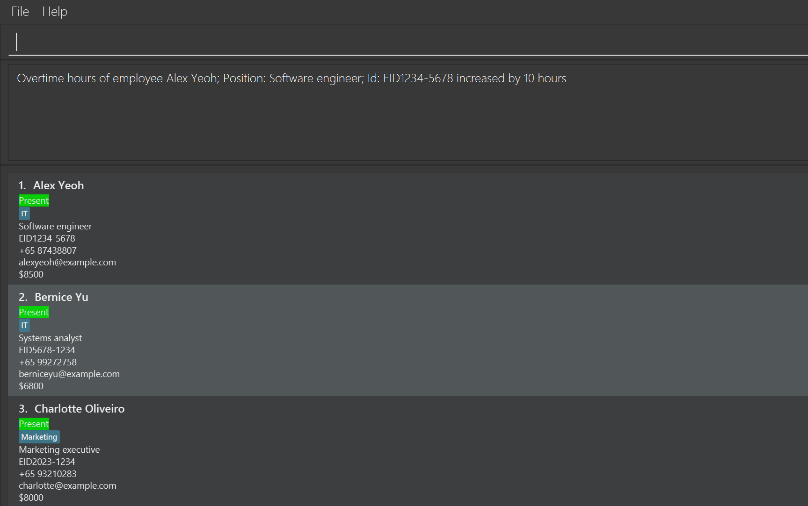
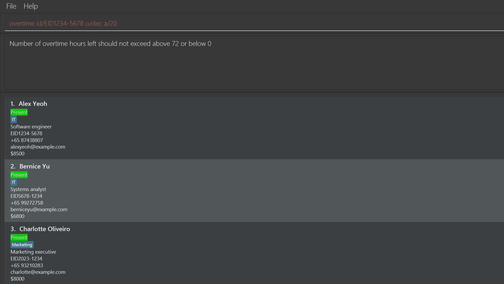
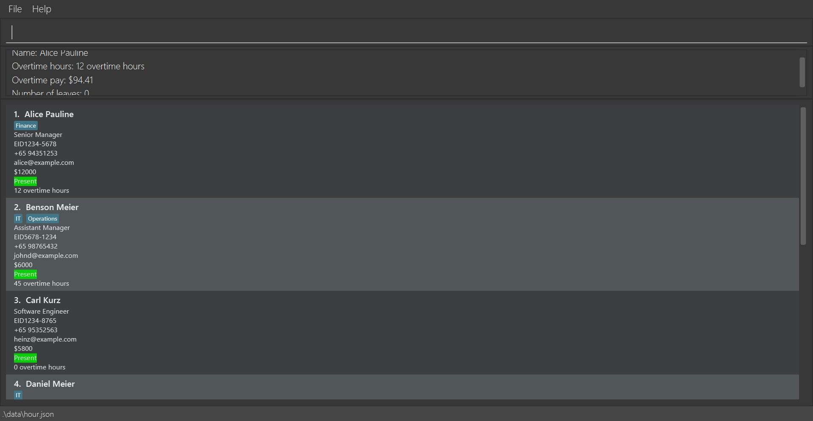
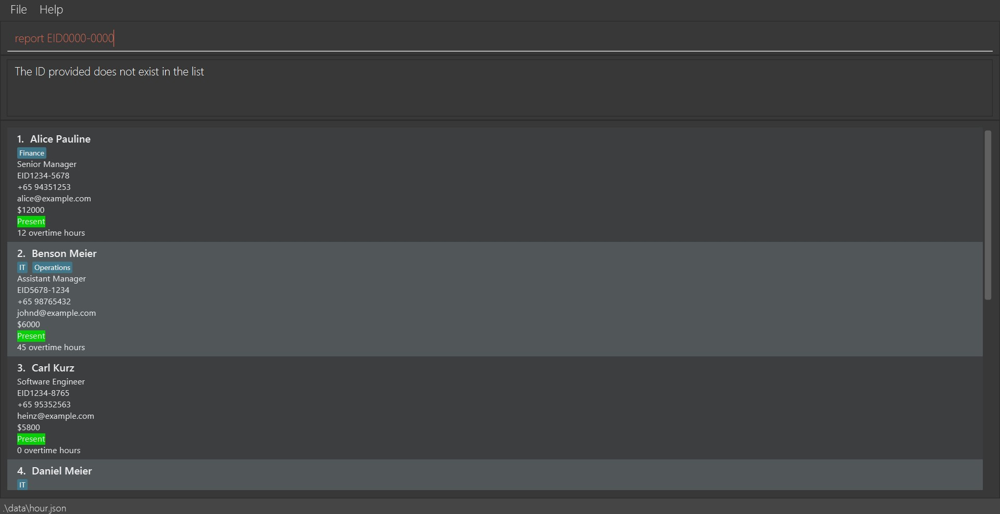

HouR is a **desktop app for managing employee records, optimized for use via a Command Line Interface** (CLI) while still having the benefits of a Graphical User Interface (GUI). If you can type fast, HouR can get your HR management tasks done faster than traditional GUI apps.

* Table of Contents
{:toc}

--------------------------------------------------------------------------------------------------------------------

## Quick start

1. Ensure you have Java `11` or above installed in your Computer.

1. Download the latest `hour.jar` from [here](https://github.com/AY2324S1-CS2103T-W12-1/tp/releases).

1. Copy the file to the folder you want to use as the _home folder_ for your employee list.

1. Open a command terminal, `cd` into the folder you put the jar file in, and use the `java -jar hour.jar` command to run the application. 
   A GUI similar to the below should appear in a few seconds. Note how the app contains some sample data. 
   

1. Type the command in the command box and press Enter to execute it. e.g. typing **`help`** and pressing Enter will open the help window. 
   Some example commands you can try:

   * `help`: Shows help window with link to user guide.

   * `add n/John Doe pos/Senior Software Enginner id/EID2023-7890 p/81239876 e/johndoe@test.com s/$5,000` : Adds an employee named `John Doe` to the employee list.

   * `list` : Lists all employees.
   
   * `edit 1 n/Alex Yeoh`: Edits the name of the 1st employee shown in the current list to `Alex Yeoh`.
   
   * `find Alex Manager`: Lists all employees with the keywords `Alex` or `Manager`.

   * `delete EID1234-5678` : Deletes the employee with employee id EID1234-5678 shown in the list.

   * `sort f/salary in/asc`: Sorts the employees by their salaries in ascending order.

   * `addleave id/EID1234-5678 from/2023-12-26 to/2023-12-28`: Adds leave dates from 29 to 31 October 2023 inclusive for employee with id EID1234-5678

   * `deleteleave id/EID1234-5678 from/2023-12-26 to/2023-12-28`: Deletes all leave dates of an employee with id EID1234-5678 that fall between 29 and 31 October 2023 inclusive
   
   * `overtime id/EID1234-5678 o/inc a/10`: Increases the overtime hours of employee with id EID1234-5678 to 10 hours.
   
   * `report EID1234-5678`: Generates a report with details on leaves and overtime for employee with id EID1234-5678.

   * `clear` : Deletes all employees.

   * `exit` : Exits the app.

1. Refer to the [Features](#features) below for details of each command.

--------------------------------------------------------------------------------------------------------------------

## Features

- List of commands: `help`
- Add an employee: `add`
- Delete an employee: `delete`
- Edits an employee: `edit`
- List all employees: `list`
- Find employees: `find`
- Sort employees by attribute: `sort`
- Add leave dates for an employee: `addleave`
- Delete leave dates of an employee: `deleteleave`
- Update overtime hours of an employee: `overtime`
- Get details on employee performance: `report`
- Clear all employees: `clear`
- Exit the program: `exit`

**:information_source: Notes about the command format:** 

* Words in `UPPER_CASE` are the parameters to be supplied by the user. 
  e.g. in `add n/NAME`, `NAME` is a parameter which can be used as `add n/John Doe`.

* Items in square brackets are optional. 
  e.g. `edit INDEX [n/NAME] [pos/POSITION] [id/EMPLOYEE_ID] [p/PHONE_NUMBER] [e/EMAIL] [s/SALARY] [d/DEPARTMENT]...` can be used as `edit 1 n/John Doe` or as `edit 1 pos/Software Engineer`.

* Parameters can be in any order. 
  e.g. if the command specifies `n/NAME p/POSITION`, `p/POSITION n/NAME` is also acceptable.

* Date parameters should be in the form of `yyyy-MM-dd`, for example `2023-10-31`

* Extraneous parameters for commands that do not take in parameters (such as `help`, `list`, `exit` and `clear`) will be ignored. 
  e.g. if the command specifies `help 123`, it will be interpreted as `help`.

* If you are using a PDF version of this document, be careful when copying and pasting commands that span multiple lines as space characters surrounding line-breaks may be omitted when copied over to the application.

### Viewing help : `help`

Shows a message explaining how to access the help page.

Format: `help`

### Adding an employee: `add`

Adds an employee to the employee list.

Format: `add n/NAME pos/POSITION id/EMPLOYEE_ID p/PHONE_NUMBER e/EMAIL s/SALARY [d/DEPARTMENT]...`

Examples:
* `add n/Jane Doe pos/Manager id/EID2023-7891 p/81234567 e/janedoe@test.com s/$5,000`
* `add n/Alex Yeoh pos/Software Engineer id/EID2023-1234 p/87428807 e/alexyeoh@example.com s/$8,500 d/IT`

* `add n/Charlotte Oliveiro pos/Software Engineer id/EID2023-1234 p/98561234 e/alexyeoh2@example.com s/$9,500 d/IT` is
  invalid because `id` already exists in the records.

### Listing all employees : `list`

Shows a list of all employees in the employee list.

Format: `list`

### Editing an employee : `edit`

Edits an existing employee in the employee list.

Format: `edit INDEX [n/NAME] [pos/POSITION] [id/EMPLOYEE_ID] [p/PHONE_NUMBER] [e/EMAIL] [s/SALARY] [d/DEPARTMENT]...`

* Edits the employee at the specified `INDEX`. The index refers to the index number shown in the displayed employee list. The index **must be a positive integer** 1, 2, 3, …​
* At least one of the optional fields must be provided.
* Existing values will be updated to the input values.

Examples:
*  `edit 1 pos/Senior Software Engineer` edits the position of the 1st employee to be `Senior Software Engineer`.

*  `edit 10 pos/Senior Software Engineer` is invalid because the index does not exist.

### Locating employees: `find`

Finds employees whose name, position, department, phone number, email, or ID contain any of the given keywords.

Format: `find KEYWORD [MORE_KEYWORDS]`

* The search is case-insensitive. e.g `hans` will match `Hans`
* The order of the keywords does not matter. e.g. `Hans Bo` will match `Bo Hans`
* Only full words will be matched e.g. `Han` will not match `Hans`
* Persons matching at least one keyword will be returned (i.e. `OR` search).
  e.g. `Hans Bo` will return `Hans Gruber`, `Bo Yang`

Examples:
* `find Alex` returns `Alex Yeoh`

* 

### Deleting an employee : `delete`

Deletes an employee from the employee list.

Format: `delete EMPLOYEE_ID`

* Deletes the employee at the specified `EMPLOYEE_ID`.
* The employee id refers to each employee's unique employee id.
* The employee id **must follow the EID format** (EID[4 digits]-[4 digits])

Examples:
* `delete EID1234-5678` deletes the employee with employee id EID1234-5678 in the employee list.
 
  

* `delete EID000-0000` is invalid because the id does not exist.

### Sorting all employees : `sort`

Sorts the employee list by a given attribute.

Format: `sort f/FIELD in/ORDER`

* Sorts the employee list by the specified `FIELD` in the given `ORDER`.
* The field has to be non-empty and can have 4 values: `name`, `salary`, `overtime`, or `leaves`.
* The order is either ascending (`asc`) or descending (`desc`)

Examples:
* `sort f/salary in/asc` sorts the employee list such that their salaries are arranged 
  in ascending order from top to bottom

* `sort f/blah in/desc` is invalid because field `blah` does not exist.

### Adding a leave date for an employee : `addleave`

Adds the dates between a specified period of time to the leaves taken by the specified employee.

Format: `add  id/EMPLOYEE_ID from/START_DATE to/END_DATE`

* Add dates between `START_DATE` and `END_DATE` inclusive into the leaves taken by employee with id `EMPLOYEE_ID`.
* `START_DATE` must not be after `END_DATE`.

Examples:
* `addleave id/EID1234-5678 from/2023-12-26 to/2023-12-28` adds the dates 26, 27, and 28 December 2023 to the leaves taken
  by employee with id EID1234-5678.

* `addleave id/EID1234-5678 from/2023-12-31 to/2023-12-28` is invalid because the start date 2023-12-31 is after the end date 2023-12-28, which is impossible.

### Deleting a leave date of an employee : `deleteleave`

Deletes the leave dates that an employee has that fall into the specified period of time.

Format: `add  id/EMPLOYEE_ID from/START_DATE to/END_DATE`

* Delete leave dates that are between `START_DATE` and `END_DATE` inclusive from the leaves taken by employee with id `EMPLOYEE_ID`.
* `START_DATE` must not be after `END_DATE`.
* If the employee does not have any leaves taken that fall between the period between `START_DATE`and `END_DATE`,
  the command will output an error and will not change anything.

Examples:
* `deleteleave id/EID1234-5678 from/2023-12-26 to/2023-12-28` deletes all leave dates
  of employee with id EID1234-5678 that fall on 26, 27, or 28 December 2023.

* `deleteleave id/EID1234-5678 from/2023-12-31 to/2023-12-28` is invalid because the start date 2023-12-31 is after the end date 2023-12-28, which is impossible.

### Updating overtime hours of an employee : `overtime`

Updates the overtime hours of an employee.

Format: `overtime id/EMPLOYEE_ID o/OPERATION a/AMOUNT`

* Updates the overtime hours of the employee with the specified `EMPLOYEE_ID` **in EID format** (EID[4 digits]-[4 digits]).
* The operation can be either `inc` or `dec` to increase or decrease the overtime hours respectively.
* The amount is the number of hours to increase or decrease the overtime hours by.
* The amount must be a positive integer, i.e. greater than 0.

Examples:
* `overtime id/EID1234-5678 o/inc a/10` increases the overtime hours of employee with id EID1234-5678 by 10 hours.

* `overtime id/EID1234-5678 o/dec a/20` is invalid because it will result in negative overtime hours.

### Generating a report : `report`

Generates a report with details on leaves and overtime for an employee.

Format: `report EMPLOYEE_ID`

* Generates and downloads a report for the employee with the specified `EMPLOYEE_ID`.
* The employee id refers to each employee's unique employee id.
* The employee id **must follow the EID format** (EID[4 digits]-[4 digits])

Examples:
* `report EID1234-5678` generates and downloads a report for the employee with employee id EID1234-5678 in the employee list.

* `report EID000-0000` is invalid because the id does not exist.

### Clearing all entries : `clear`

Clears all entries from the employee book.

Format: `clear`

### Exiting the program : `exit`

Exits the program.

Format: `exit`

### Saving the data

HouR data are saved in the hard disk automatically after any command that changes the data. There is no need to save manually.

### Editing the data file

HouR data are saved automatically as a JSON file `[JAR file location]/data/hour.json`. Advanced users are welcome to update data directly by editing that data file.

:exclamation: **Caution:**
If your changes to the data file makes its format invalid, HouR will discard all data and start with an empty data file at the next run. Hence, it is recommended to take a backup of the file before editing it.

### Archiving data files `[coming in v2.0]`

_Details coming soon ..._

--------------------------------------------------------------------------------------------------------------------

## FAQ

### Launching HouR

**Q**: How can I launch HouR if clicking on the JAR file does not work? 
**A**: There are two possible methods to launch HouR.

**Method 1**: For users familiar with the Command Prompt
1. Open the Command Prompt
2. Navigate to the directory where the JAR file is located using `cd [JAR file location]`
3. Type `java -jar hour.jar` and press Enter 
4. HouR should launch

**Method 2**: For users that wish to create a script to launch HouR (Recommended)
1. Create a new text file 
2. Copy and paste the following into the text file: `java -jar [JAR file location]/hour.jar` 
3. Save the text file as `hour.bat` (Windows) or `hour.sh` (MacOS/Linux)
4. Change the admin settings of the script to allow it to run as program:
   * Windows: Right-click on the script and select **Properties**. Under **General**, check the box that says `Allow this file to run as a program`. 
   * MacOS/Linux: Open the Terminal and navigate to the directory where the script is located. Type `chmod +x [script name]` and press Enter.  
     Note: (`chmod +x` changes permissions of the script to allow it to be executed)
5. Double-click on the script to launch HouR 
6. HouR should launch

If you have any further issues, please raise an issue on our [Github page](https://github.com/AY2324S1-CS2103T-W12-1/tp/issues). We will attend to you as soon as we can.

### Checking Java Version

**Q**: How can I check my Java version? 
**A**: Open a Command Prompt and type `java -version`. If you do not have Java installed, you can install Java 11 using the Oracle guide [here](https://www.oracle.com/java/technologies/downloads/#java11). Alternatively, you can install the OpenJDK version.

For Mac users, you may wish to follow the instructions listed [here](https://nus-cs2103-ay2324s1.github.io/website/admin/programmingLanguages.html).

### Loading Data from Another Computer

**Q**: How do I transfer my data to another Computer? 
**A**: Install HouR in the other computer and overwrite the empty data file it creates with the file that contains the data of your previous HouR home folder.

**Q**: How can I load data from one computer into HouR installed on another computer? 
**A**: This can be done by following the three steps below.
1. Delete the `hour.json` file (stored at `[hour.jar file location]/data/hour.json`) from the computer that you wish to use HouR on.
2. Copy over the `hour.json` file from the computer which you no longer wish to use HouR on.
3. Boot up HouR to check whether your employee information is properly loaded into the new computer

### Using HouR

**Q**: What are the available commands? 
**A**: Refer to the Command Summary for the list of available commands. Alternatively, from the main application window, you can type `help` to view the list of available commands.

**Q**: Do I need an internet connection to use HouR? 
**A**: All of HouR’s functionality can be used offline! No internet connection is required.

**Q**: How do I save my data? 
**A**: Data is saved in the hard disk automatically after any command that changes the data. There is no need to save manually.

--------------------------------------------------------------------------------------------------------------------

## Known issues

1. **When using multiple screens**, if you move the application to a secondary screen, and later switch to using only the primary screen, the GUI will open off-screen. The remedy is to delete the `preferences.json` file created by the application before running the application again.

--------------------------------------------------------------------------------------------------------------------

## Command summary

| Action           | Format, Examples                                                                                                                                                                           |
|------------------|--------------------------------------------------------------------------------------------------------------------------------------------------------------------------------------------|
| **Add**          | `add n/NAME pos/POSITION id/EMPLOYEE_ID p/PHONE_NUMBER e/EMAIL s/SALARY [d/DEPARTMENT]...`   e.g., `add n/James Ho pos/Auditor id/EID2023-0928 p/87651234 e/jamesho@example.com s/8000` |
| **Clear**        | `clear`                                                                                                                                                                                    |
| **Delete**       | `delete EMPLOYEE-ID`  e.g., `delete EID1234-5678`                                                                                                                                       |
| **Edit**         | `edit INDEX [n/NAME] [p/POSITION] [id/EMPLOYEE_ID] [p/PHONE_NUMBER] [e/EMAIL] [s/SALARY] [d/DEPARTMENT]...`  e.g.,`edit 2 n/James Lee pos/Head Auditor`                                 |
| **Find**         | `find KEYWORD [MORE_KEYWORDS]`  e.g., `find James Manager`                                                                                                                              |
| **List**         | `list`                                                                                                                                                                                     |
| **Sort**         | `sort f/FIELD in/ORDER`                                                                                                                                                                    |
| **AddLeave**     | `addleave id/EMPLOYEE_ID from/START_DATE to/END_DATE`   e.g., `addleave id/EID1234-5678 from/2023-12-26 to/2023-12-28`                                                                 |
| **DeleteLeave**  | `deleteleave id/EMPLOYEE_ID from/START_DATE to/END_DATE`   e.g., `deleteleave id/EID1234-5678 from/2023-12-26 to/2023-12-28`                                                           |
| **EditLeave**    | `editleave id/EMPLOYEE_ID old/OLD DATE new/NEW DATE`   e.g., `editleave id/EID1234-5678 old/2023-12-26 new/2023-12-28`                                                                 |
| **ListLeave**    | `listleave on/DATE`   e.g., `listleave on/2023-11-30`                                                                                                                                  |
| **Overtime**     | `overtime id/EMPLOYEE_ID o/OPERATION a/AMOUNT`   e.g., `overtime id/EID1234-5678 o/inc a/10`                                                                                           |
| **AddRemark**    | `addremark id/EMPLOYEE_ID r/REMARK`   e.g., `addremark id/EID1234-5678 r/Good worker`                                                                                                  |
| **DeleteRemark** | `deleteremark id/EMPLOYEE_ID r/REMARK`   e.g., `addremark id/EID1234-5678 r/Good worker`                                                                                               |
| **Report**       | `report EMPLOYEE_ID`   e.g., `report EID1234-5678`                                                                                                                                     |
| **Reset**        | `reset f/FIELD`   e.g., `reset f/overtime`                                                                                                                                             |
| **Help**         | `help`                                                                                                                                                                                     |
| **Exit**         | `exit`                                                                                                                                                                                     |
