# HealthSync User Guide

HealthSync is a **desktop app for managing patient details, optimised for use via a Command Line Interface** (CLI)
while still having the benefits of a Graphical User Interface (GUI). If you can type fast, HealthSync can help you
organise and manage patient details faster than traditional GUI apps.

<!-- * Table of Contents -->
<page-nav-print />

--------------------------------------------------------------------------------------------------------------------

## [Quick start](#quick-start)

1. Ensure you have Java `11` or above installed in your Computer.

2. Download the latest `healthsync.jar` from [here](https://github.com/AY2324S1-CS2103T-T14-3/tp/releases).

3. Copy the file to the folder you want to use as the _home folder_ for your HealthSync.

4. Open a command terminal, `cd` into the folder you put the JAR file in, and use the `java -jar healthsync.jar`
   command to run the application. 

   A GUI similar to the below should appear in a few seconds. Note how the app contains some sample data. 

   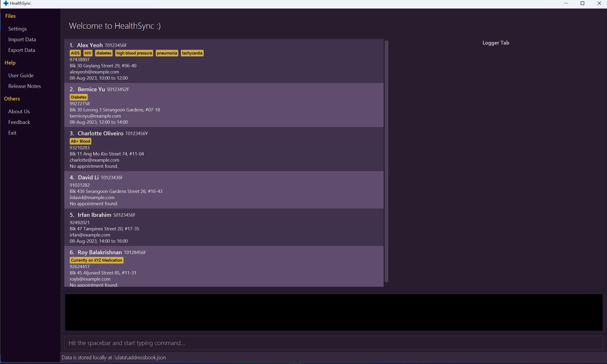

> :bulb: The main application consists of the:
> 1. Patient List View
> 2. Output Box
> 3. Command Box
> 4. Logger Tab

5. Type the command in the command box and press Enter to execute it.
   e.g. typing **`help`** and pressing Enter will open the help window. 
   Some example commands you can try:

   * `list` : Lists all patients.

   * `add n/John Doe id/S8943782H p/98114839 e/john@example/com a/Kent Ridge Avenue 21 ` : Adds a patient named `John Doe` with the relevant field details to HealthSync.

   * `delete n/Alex Yeoh` : Deletes Alex Yeoh's details from the current list.

   * `clear` : Deletes all patients.

   * `exit` : Exits HealthSync.

6. Refer to the [Features](#features) below for details of each command.

--------------------------------------------------------------------------------------------------------------------

## [Features](#features)

<box type="info" seamless>

**Notes about the command format:** 

* Words in `UPPER_CASE` are the parameters to be supplied by the user. 
  e.g. in `add n/NAME`, `NAME` is a parameter which can be used as `add n/John Doe`.

* The word `or` indicates that at least one of the fields has to be supplied by the user.
  The output `or` will return the above field that was supplied by the user.
* `[field]` are optional tags that can be added after a command.

* `[field] …` indicate that multiple fields can be supplied by the user.

* `[field] …` can be in any order.

* Parameters can be in any order. 
  e.g. if the command specifies `n/NAME p/PHONE_NUMBER`, `p/PHONE_NUMBER n/NAME` is also acceptable.

* Extraneous parameters for commands that do not take in parameters (such as `help`, `list`, `exit` and `clear`)
  will be ignored. 
  e.g. if the command specifies `help 123`, it will be interpreted as `help`.

* If you are using a PDF version of this document, be careful when copying and pasting commands that span multiple lines
  as space characters surrounding line-breaks may be omitted when copied over to the application.
</box>

### Common Shared Fields

The 2 identifying parameters of a patient are given below:

| Tag   | Representative Value         | Example Usage  | General Form in Commands |
|-------|------------------------------|----------------|--------------------------|
| `n/`  | Name                         | `n/Alex`       | `n/NAME`                 |
| `id/` | Identification Number (NRIC) | `id/S2345678A` | `id/IC_NUMBER`           |

1 or more identifying parameters must be specified in each command, unless stated otherwise.

`[field]` are common fields that can be specified behind commands. The common fields are:

| Tag    | Representative Value | Example Usage               | General Form in Commands | Remarks                                                             |
|--------|----------------------|-----------------------------|--------------------------|---------------------------------------------------------------------|
| `p/`   | Phone Number         | `p/91234567`                | `p/PHONE_NUMBER`         |                                                                     |
| `e/`   | Email Address        | `e/example@a.com`           | `e/EMAIL`                |                                                                     |
| `a/`   | Address              | `a/Location, Here Rd`       | `a/ADDRESS`              |                                                                     |
| `m/`   | Medical History      | `m/Asthmatic`               | `m/MEDICAL_HISTORY`      | Can have multiple of this field, including zero i.e. Optional field |
| `ap/`  | Appointment          | `ap/01-01-2023 11:00 12:00` | `ap/APPT `               | Optional field                                                      |

>:exclamation: To enhance the User Guide's clarity, command outputs have been simplified and are now presented with added information indicated by an ellipsis (...).

### Viewing Help: `help`

Shows a message explaining how to access the help page. The link will bring the user to the User Guide.

Format: `help`

>:bulb: Use `h` as a shortcut to utilise the `help` command

>:bulb: Click on `Copy URL` after entering the `help` command and paste the link in your preferred browser

### Listing All Patients: `list`

Shows a list of all patients in HealthSync.

Format: `list`

>:bulb: Use `ls` as a shortcut for `list`

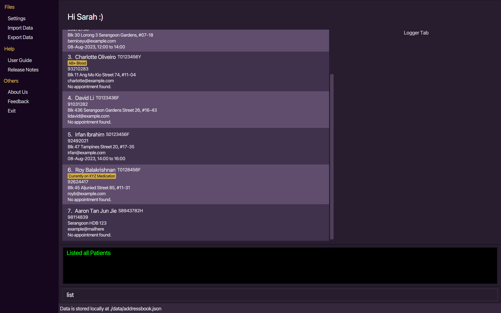

### Adding a Patient: `add`

Adds a patient into HealthSync, with the given patient information.

* A patient's name and IC are required when creating a new entry into HealthSync.
* All the compulsory fields must be provided.
* Optional fields like appointment and medical history need not be provided.

Format: `add n/NAME id/IC_NUMBER [field] ...`

>:bulb: Use `a` as a shortcut for `add`

Example commands:

* `add n/Aaron Tan Jun Jie id/S8943782H p/98114839 e/example@mailhere a/Serangoon HDB 123`

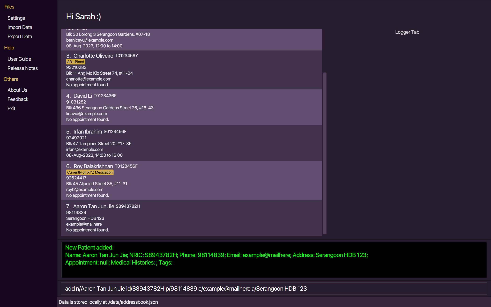

Expected outputs when the command succeeds:
* `New Patient added: ...`

Expected outputs when the command fails:
* `Patient already exists in HealthSync.`
* `Invalid command format! ...`

### Editing a Patient's Details: `edit`

Edits an existing patient's details in HealthSync.

 * Edits the person with the specified name or id.
 * If an invalid name or IC Number is passed, an error message will be logged.
 * At least one of the optional fields must be provided.
 * Existing fields will be updated to the input values.
 * If the fields do not exist, the corresponding field with details will be added.

>:bulb: Update multiple fields in a single `edit` command to save time

Format: `edit n/NAME or id/IC_NUMBER [field] ...`

>:bulb: Use `e` as a shortcut for `edit`

Example commands:
 * `edit n/Alex Yeoh p/91234567 e/alexyeoh@example.com`

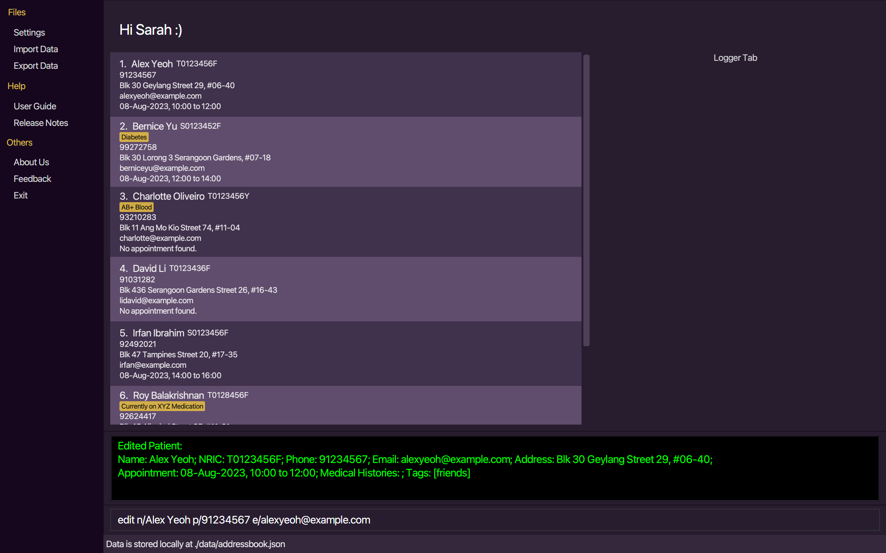

Expected outputs when the command succeeds:
* `Edited patient: ...`

Expected outputs when command fails:
* `INVALID name and/or NRIC! ...`

### Deleting a Patient or Field: `delete`

Deletes the specified patient or an optional fields of the patient from HealthSync.

* Deletes the patient or an optional field of the patient with the specified `n/NAME or id/IC_NUMBER`.
* The name or IC must be valid.
* To delete a specified field only instead of the entire patient, we indicate the field after the identification.
* If multiple people has the same name, HealthSync will display a list of people with that name together with their IC number.

Format: `delete n/NAME or id/IC_NUMBER [field]`

>:bulb: Use the shortcut `d` for faster patient-deleting

Example commands:

* `delete n/Alex Yeoh`
* `delete n/John Doe m/`

>:bulb: Specify the medical history to be deleted using `m/` if it's only the medical history data that is to be deleted

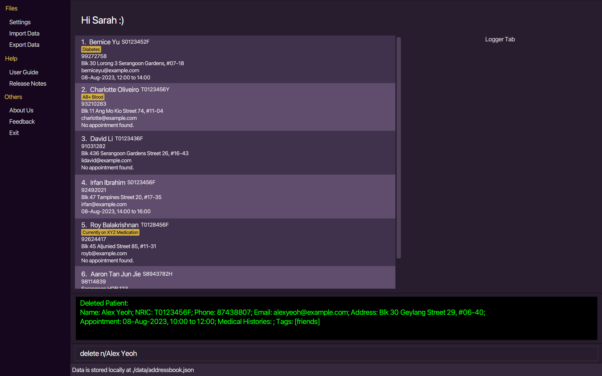

Expected outputs when the command succeeds:
* `Deleted Patient: ...`
* `Deleted Patient's field: ...`

Expected output when the command fails:
* `The given combination of Name and NRIC does not match any patient in the Patients list`.

### Delete All Patients: `clear`

Deletes all patients from HealthSync.

Format: `clear`

>:bulb: Use `c` as a shortcut for `clear`

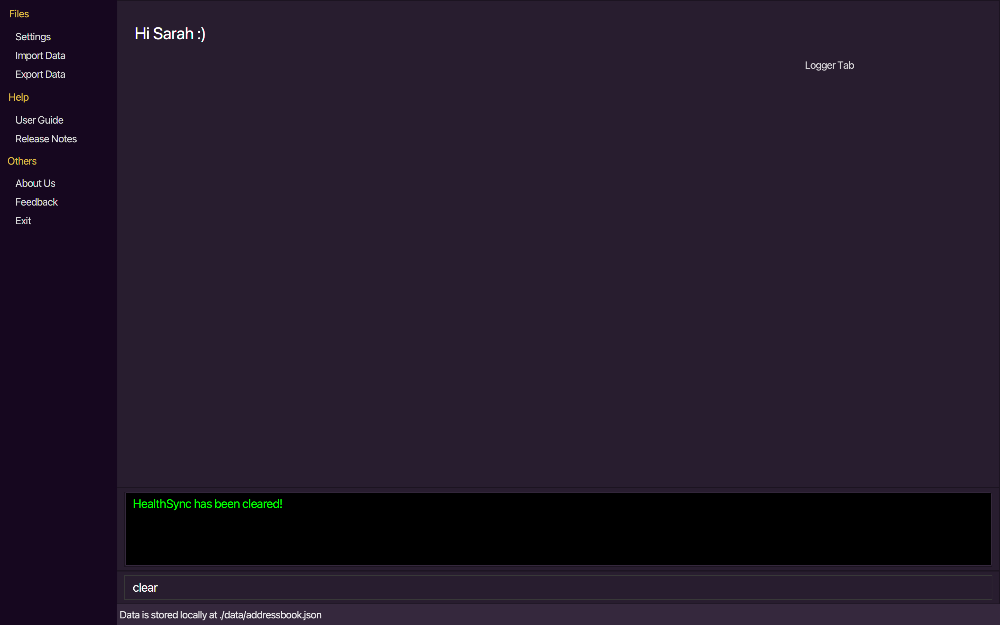

### Locating Patients by Name or NRIC: `find`

Searches the patient list for all patients matching the name or IC Number and returns their related information.

* The search is case-insensitive. e.g `hans` will match `Hans`.
* The order of the keywords does not matter. e.g. `Hans Bo` will match `Bo Hans`.
* Only the name or IC number is searched.
* Only full words will be matched e.g. `Han` will not match `Hans`.
* For the name, only patients matching at least one keyword will be returned (i.e. `OR` search).
  e.g. `Hans Bo` will return `Hans Gruber`, `Bo Yang`.
  
Format: `find n/NAME or id/IC_NUMBER`

>:bulb: Use the shortcut `f` for faster patient-finding

Example commands:
* `find n/Alex Yeoh`
* `find id/T0123436F` 

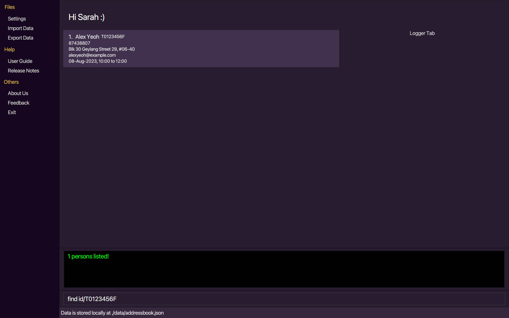

>:bulb: This list command can be used to show the original patient list after a find command is executed

### Preserving a `find` Command Result: `log`

Logs the result of the find command to the logger tab, which can be viewed at all times.

>:bulb: Use `log` command to save data you want to continue referring to

* Saving to the logger tab only works for results of the `find` command.
* The entire result will be saved.
* The result will be saved in the same order and format.
* Saving a new result clears the current saved result from the logger tab and replaces it.

Format: `log`

>:bulb: Use the shortcut `lo` for faster patient-logging

Example Command: `log` (after entering a FindCommand)

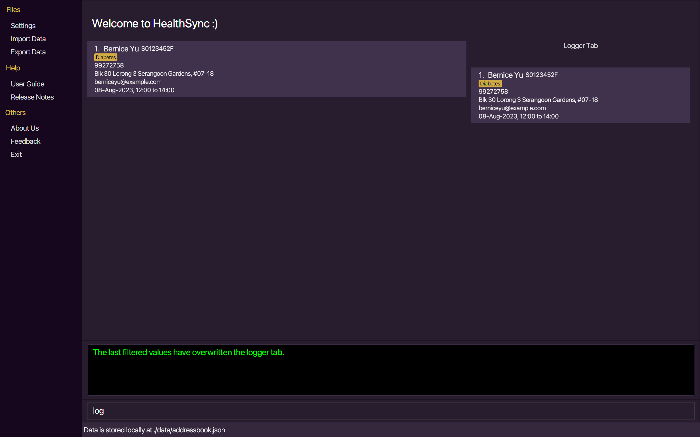

Expected outputs when the command succeeds:
* `Results of the FindCommand have been saved to the logger tab.`

Expected output when the command fails:
* `There are no FindCommand results. There is nothing to be saved to the logger tab.`

>:bulb: `log` overwrites the data currently in the logger tab, so you do not need to perform clearing prior

### Adding a New `find` Command Result to the Log: `alog`

Appends the new results of the most recent find command to the current data in the logger tab, which can be viewed at all times.

>:bulb: Use `alog` command to save data you want to continue referring to, on top of some others

* Adding to the logger tab only works for results of the `find` command.
* The previously-saved result will remain the same.
* The entire new result will be saved below the previously-saved result.
* The result will be saved in the same order and format.

Format: `alog`

>:bulb: Use the shortcut `al` for faster log-appending

Example Command: `alog` (after entering a FindCommand)

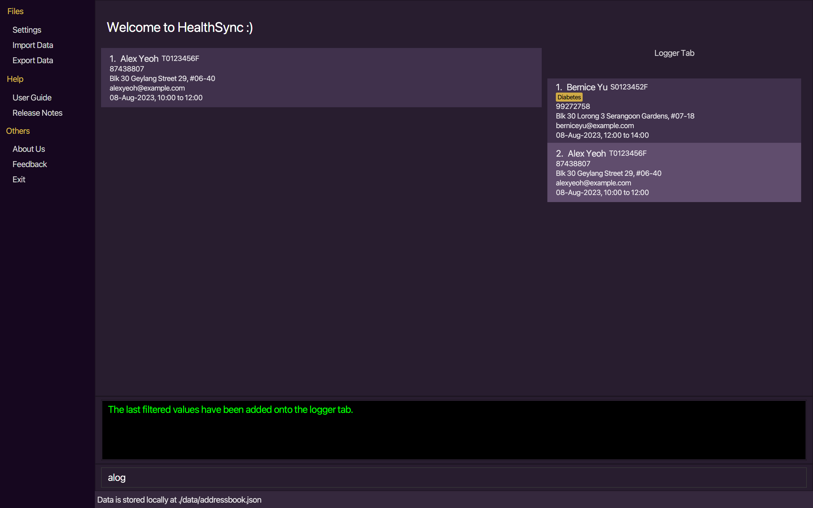

Expected outputs when the command succeeds:
* `Results of the FindCommand have been appended to the logger tab.`

Expected output when the command fails:
* `There are no FindCommand results. There is nothing to be saved to the logger tab.`

>:bulb: `alog` does not overwrite the data and instead adds on to it, so you do not have to keep performing `log` to save more data

### Clearing Data from the Log: `clog`

Clears all current data in the logger tab.

>:bulb: Use `clog` command if you do not need the data in the current logger tab anymore

Format: `clog`

>:bulb:  Use the shortcut `cl` for faster log-clearing

Example Command: `clog`

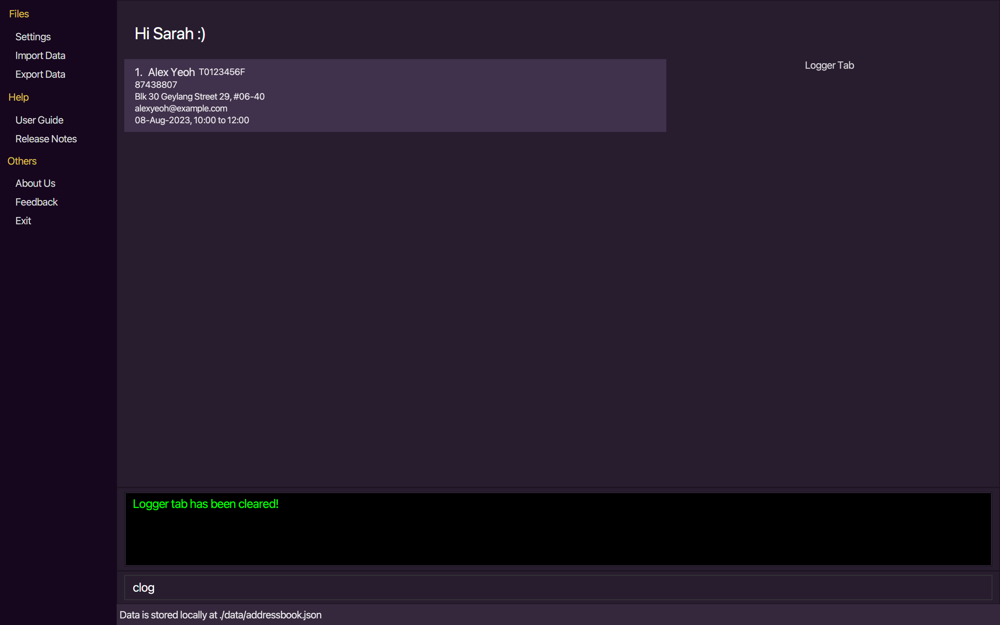

Expected output:
* `Logger tab has been cleared!`

### Undoing a Command: `undo`

Undoes an undo-able command within HealthSync.

* An undo-able command include an add, clear, delete, edit, log, alog and clog command.
* The command allows you to undo a specific number of previous commands.
* The command can only undo a positive number of previous commands provided it does not exceed the size of the command history stack.

Format:
* `undo [number]`

>:bulb: Use `u` as a shortcut for `undo`

>:bulb: Simply entering `undo` will undo the last command

Example commands:
*  `undo 2`

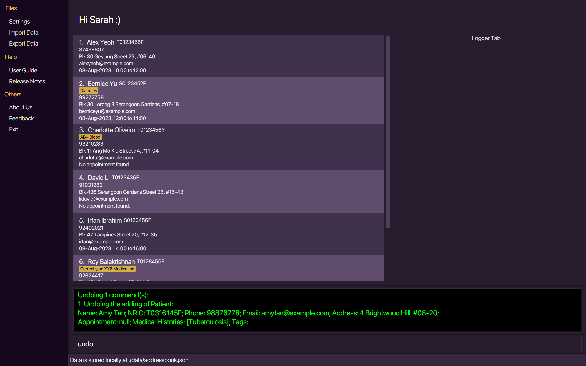

Expected outputs when the command succeeds:
* `Undoing 2 command(s): ...`

Expected outputs when command fails:
* `Please proved a valid number of steps to undo, not exceeding the available command history.`
* `Undo step count cannot be a negative number or zero.`

### Exiting HealthSync: `exit`

Exits HealthSync.

Format: `exit`

>:bulb: Use `ex` as a shortcut for `exit`

### Auto Save

HealthSync data are saved in the hard disk automatically after any command that changes the data is executed.
There is no need to save manually.

### Editing the Data File

HealthSync data are saved automatically as a JSON file `[JAR file location]/data/healthsync.json`.
Advanced users are welcome to update data directly by editing that data file.

>:warning: **Caution:**
>If your changes to the data file makes its format invalid, HealthSync will discard all data and start with an empty
>data file at the next run.  Hence, it is recommended to take a backup of the file before editing it.

### Archiving Data Files `[coming in v5.0]`

## [FAQ](#faq)

**Q**: What operating systems does HealthSync support? 
**A**: HealthSync is a cross-platform application and supports Windows, macOS, and Linux. Simply follow the
[installation guide](#quick-start) and download the jar file to use the application.

**Q**: What are the advantages of using a CLI interface in HealthSync over traditional GUI apps? 
**A**: HealthSync's CLI interface offers faster data entry and navigation for users who are comfortable with typing.
It streamlines tasks and provides a more efficient way to manage patient details.

**Q**: Can multiple users access Healthysync simultaneously, and how do I set up user accounts? 
**A**: HealthSync is currently an application for a single user. Hence, it cannot be accessed simultaneously
by different users.

**Q**: How do I import patient data from external sources into HealthSync? 
**A**: Datafile storing current patient data will be stored in `data/addressbook.json` by default under the same folder.
You may import patient data and store into that file. However, do adhere to the data format present in the current file.

**Q**: How do I transfer my data to another Computer? 
**A**: Install the app in the other computer and overwrite the empty data file it creates with the file that contains
       the data of your previous HealthSync home folder.

**Q**: Can I use HealthSync offline, or does it require an internet connection? 
**A**: HealthSync is designed to work offline, ensuring you can access and update patient data even when you don't have
an internet connection.

**Q**: What happens if there is a system crash or power outage while I'm using HealthSync? 
**A**: HealthSync includes auto-save functionality to minimize data loss in case of unexpected events.
The app will attempt to recover your work upon restart.

--------------------------------------------------------------------------------------------------------------------

## [Known issues](#known-issues)

1. **When using multiple screens**, if you move the application to a secondary screen, and later switch to using only
   the primary screen, the GUI will open off-screen. The remedy is to delete the `preferences.json` file created by
   the application before running the application again.

--------------------------------------------------------------------------------------------------------------------
## Glossary

| Term                          | Definition                                                                                                                                                                                                                   |
|-------------------------------|------------------------------------------------------------------------------------------------------------------------------------------------------------------------------------------------------------------------------|
| CLI Application               |  Stands for Command Line Interface, which is an application where the user mainly input commands using the keyboard to interact with the application.                                                                        |
| GUI  Application              | Stands for Graphical User Interface, which is  an application where the user interacts with graphical components such as icons and buttons to interact with the application.                                                 |
| Patient List View             | The main component of the application where the list of all added patients are displayed.                                                                                                                                    |
| Output Box                    | Located below the Patient List View is the output box where the output after executing a command is displayed                                                                                                                |
| Command Box                   | Located below the Output Box is the Command Box where users will type and enter the command to be executed.                                                                                                                  |
| Logger Tab                    | A special display box in the right of HealthSync that is used to store the result of the relevant log commands                                                                                                               |
| Size of Command History Stack | The current number of undo-able commands that is remembered by HealthSync. Executing an undo command reduces this number depending on number of undos exectued. Executing an un-doable command increases this number by one. |  
| JSON                          | Stands for JavaScrip Object Notation, which is a file format commonly used to store and transmit data. The data in HealthSync is stored using this format.                                                                   |  

## Command summary

| Action         | Shortcut | Format, Examples                                                                                                                               |
|----------------|----------|------------------------------------------------------------------------------------------------------------------------------------------------|
| **Help**       | `h`      | `help`                                                                                                                                         |
| **List**       | `ls`     | `list`                                                                                                                                         |
| **Add**        | `a`      | `add n/NAME id/IC_NUMBER [field] ...`   e.g., `add n/James Ho id/SXXXX123D p/91234567 a/A Estate, Clementi Rd, 1234665 e/james@example.com` |
| **Edit**       | `e`      | `edit n/NAME [field]` *or* `edit id/IC_NUMBER [field] ... `  e.g.,`edit n/James Lee e/jameslee@example.com`                                 |
| **Delete**     | `d`      | `delete n/NAME`                                                                                                                                |
| **Clear**      | `c`      | `clear`                                                                                                                                        |
| **Find**       | `f`      | `find n/NAME [field]` *or* `find id/IC_NUMBER [field]`  e.g., `find n/James Jake` *or* `find id/T0123436F`                                  |
| **Log**        | `l`      | `log`                                                                                                                                          |
| **Append Log** | `al`     | `alog`                                                                                                                                         |
| **Clear Log**  | `cl`     | `clog`                                                                                                                                         |
| **Undo**       | `u`      | `undo`                                                                                                                                         |
| **Exit**       | `e`      | `exit`                                                                                                                                         |

