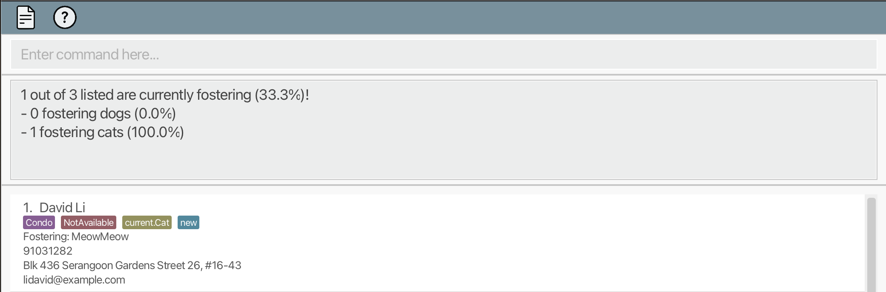

**Foster Family** is a desktop app built for the **foster managers of animal shelters** to help them perform **foster family management tasks**. 

Some tasks Foster Family can help you with: 
* Store and update the details of animal fosterers
* Search for a fosterer using _**any**_ detail you can remember of them
* Gain insights on the current status of fosterers

Foster Family is **optimised for use** via a Command Line Interface (CLI) while still having the benefits of a Graphical User Interface (GUI). If you can type fast, Foster Family can get things done faster than traditional GUI apps.

This user guide contains all the commands available to you, along with explanation and examples to help you master the use of Foster Family. If you are new, head over to [Quick Start](#quick-start) to begin your journey with us. For those who are already acquainted, you can refer to the [Table of Contents](#table-of-contents) below to navigate to the command of your interest.

## Table of Contents
* Table of Contents
{:toc}

--------------------------------------------------------------------------------------------------------------------

## Quick Start
1. Ensure you have Java `11` or above installed in your computer.

2. Download the latest `FosterFamily.jar` from [here](https://github.com/AY2324S1-CS2103T-T13-4/tp/releases/tag/v1.2.1).

3. Copy the file to the folder you want to use as the _home folder_ for Foster Family.

4. Open a command terminal, `cd` into the folder you put the jar file in, and use the `java -jar FosterFamily.jar` command to run the application.<br>
   The Foster Family GUI should appear on screen, similar to the screenshot attached below. Note how the app contains some sample data.<br>
   

5. Type a command in the command box and press Enter to execute it. e.g. typing **`help`** and pressing Enter will open the help window.<br>
   Some example commands you can try:

  * `list` : Lists all fosterers.

  * `add n/Jerry Tan p/98765412 e/jerry123@example.com a/61 Baker Street housing/nil availability/nil animal/nil animalType/nil` : Adds a fosterer named `Jerry Tan` to Foster Family.

  * `delete 3` : Deletes the 3rd fosterer shown in the current list.

  * `reset` : Deletes all fosterers.

  * `exit` : Exits the app.
6. Refer to the [Features](#features) section for details of each command.

--------------------------------------------------------------------------------------------------------------------
## Useful Notations
These are symbols we will be using to highlight certain information to you.

| Symbol               | Meaning                                 |
|----------------------|-----------------------------------------|
| :information_source: | Information information to take note of |
| :bulb:               | Tips to optimise the use of Foster Family |
| :exclamation:        | Warning about the usage of commands     |


## Features

<div markdown="block" class="alert alert-info">

**:information_source: Notes about the command format:**<br>

* Words in `UPPER_CASE` are  parameters to be supplied by you.<br>
  e.g. in `n/NAME`, `NAME` is a parameter which can be used as `add n/John Doe`.

* Items in square brackets are optional.<br>
  e.g `n/NAME [t/TAG]` can be used as `n/John Doe t/urgent` or as `n/John Doe`.

* Items with `…`​ after them can be used multiple times, _**including zero times**_.<br>
  e.g. `[t/TAG]…​` can be used as ` ` (i.e. zero times), `t/friend`, `t/friend t/family` etc.

* Parameters can be in any order.<br>
  e.g. if the command specifies `n/NAME p/PHONE_NUMBER`, `p/PHONE_NUMBER n/NAME` is also acceptable.

* Extraneous parameters for commands that do not take in parameters (such as `help`, `exit` and `reset`) will be ignored.<br>
  e.g. if the command specifies `help 123`, it will be interpreted as `help`.

* If you are using a PDF version of this document, be careful when copying and pasting commands that span multiple lines, as space characters surrounding line-breaks may be omitted when copied over to the application.
</div>

### Viewing Help for Commands : `help`

Shows the purpose and format of the different commands.

Format: `help COMMAND`

Parameter:
* `COMMAND`: One of the available commands

Examples:
* `help add` Displays the function and the format of how to use the `add` command

### Adding a fosterer: `add`

Adds a fosterer to the address book.

Format: `add n/NAME p/PHONE_NUMBER e/EMAIL a/ADDRESS housing/HOUSING_TYPE availability/AVAILABILITY animal/ANIMAL_NAME animalType/TYPE_OF_ANIMAL_FOSTERED/WANTED t/TAG…`

Parameters:
* `NAME`: Name of the fosterer
* `PHONE_NUMBER`: Phone number of the fosterer
* `EMAIL`: Email of the fosterer
* `ADDRESS`: Address of the foster family
* `HOUSING_TYPE` (case-sensitive) : HDB / Condo / Landed / nil
* `AVAILABILITY` (case-sensitive) : Available / NotAvailable / nil
* `ANIMAL_NAME`
  * `ANIMAL_NAME` (if `availability/NotAvailable`) : Name of animal fostered
  * `ANIMAL_NAME` (if `availability/nil`) : nil
  * `ANIMAL_NAME` (if `availability/Available`) : nil
* `TYPE_OF_ANIMAL_FOSTERED/WANTED` (case-sensitive) :
  * `TYPE_OF_ANIMAL_FOSTERED` (if `availability/NotAvailable`) : current.Dog / current.Cat / nil
  * `TYPE_OF_ANIMAL_WANTED` (if `availability/Available`) : able.Dog / able.Cat / nil
  * `TYPE_OF_ANIMAL_FOSTERED/WANTED` (if `availability/nil`) : nil

<div markdown="span" class="alert alert-primary">:bulb: **Tip:**
 A person can have any number of tags (including 0). ‘nil’ can be indicated for HOUSING_TYPE, AVAILABILITY, ANIMAL_NAME and TYPE_OF_ANIMAL_FOSTERED/WANTED if information is not currently available.
</div>

Valid cases:

| No. | Scenario                                                    | `AVAILABILITY` | `ANIMAL_TYPE`     | `ANIMAL_NAME` |
|-----|-------------------------------------------------------------|-------------|-------------------|---------------|
| 1   | Not fostering, insufficient info collected                  | `nil`         | `nil`             | `nil`         |
| 2   | Not fostering, insufficient info collected                  | `Available`   | `nil`             | `nil`         |
| 3   | Not fostering, preference indicated                         | `Available`   | `able.Dog/Cat`    | `nil`         |
| 4   | Not fostering (e.g. overseas, currently not able to foster) | `NotAvailable`            | `nil`             | `nil`         |
| 5   | Fostering: ALL information must be present                  | `NotAvailable`            | `current.Dog/Cat` | NOT `nil`          |

Examples:
* `add n/Jerry Tan p/98765412 e/jerry123@example.com a/Baker street, block 5, #27-01 housing/HDB availability/NotAvailable animal/Dexter animalType/current.Cat t/Urgent`
adds a fosterer named Jerry Tan with the phone number 98765412 and email address jerry123@example.com; his address is Baker street, block 5, #27-01, housing type is HDB and he is fostering a cat named Dexter. An urgent visit is required.
* `add n/Tom Lee p/98123456 e/tom@example.com a/Happy street, block 123, #01-01 t/Available t/HDB t/able.Dog`
adds a fosterer named Pete Tay with the phone number 98765411 and email address pete@example.com; his address is Happy street, block 5, #01-01, housing type is Condo and currently he is not fostering any animal but looking to foster a cat.
* In the case where duplicates are given, last one will be chosen:
  * `add n/Jerry Tan p/98765412 e/jerry123@example.com a/Baker street, block 5, #27-01 housing/HDB housing/Condo availability/Available availability/NotAvailable animal/Dexter animal/Happy animalType/able.Dog animalType/current.Cat t/Urgent`
    * Outcome will be: `New fosterer added: Jerry Tan; Phone: 98765412; Email: jerry123@example.com; Address: Baker street, block 5, #27-01; Housing: Condo; Availability: NotAvailable; Animal name: Happy; Animal type: current.Cat; Tags: [Urgent]`

### Listing fosterers: `list`

Lists fosterers that match a particular description or search, or all fosterers if the search is blank.

Format: `list *KEYWORDS`

Alias: `find`

* The keywords are case-insensitive.
* The order of the keywords does not matter. e.g. `Hans Bo` will match `Bo Hans`.
* All fields are searched (including tags).
* Keywords can match as parts of words. e.g. `john` will match `Johnny`.
* Keywords can overlap. e.g. `samm my` will match `Sammy`
* Fosterers must match all keywords (i.e. `AND` search).
  e.g. `Hans Bo` will return `Hansbo Grahm`, but not `Hans Duo`
* Symbols between keywords or sections will combine them according to the function of the symbol.
  `|` is `or`, `&` is `and` (low precedence), and ` ` (space) is `and` (high precedence).
  e.g. `a & b | c d` is the same as `a & (b | (c & d))`
* Use double quotes `"` for exact, case-sensitive, word-level match. 
  e.g. `"Tom"` matches "Tom", but not "Tommy"

Examples:
* `list` lists all fosterers in the address book
* `list john doe` matches "John Doe", "Doe John", "Johnny Doe", and "Mary" who lives on "John Doe Street"
* `find john john doe` is redundant and gives the same result as `find john doe`
* `list "John" | zam & doe` matches "John Doe" and "Doe Shazam", but not "John Grahm"


### Viewing a fosterer's detail : `view`

Views a fosterer's full details in the profile page. 

Format: `view INDEX`

Parameters:
* `INDEX`: Index of a fosterer to view their details shown in the list obtained by the find/list command

<div markdown="span" class="alert alert-primary">
  :exclamation: <b>Important:</b>
Only specific commands are available in the profile view page. 
The list of available commands are <code>help</code>, <code>save</code>, and <code>exit</code> commands. 
</div> 

Examples:
* `list` followed by `view 2` to view the profile of the 2nd fosterer in the address book.

=======
#### Editing a fosterer’s details in profile view page:

1. Enter a fosterer’s profile view page with `view INDEX` 
2. Type in the name of the field you want to edit onto the command box, for example `name`. This will make the textbox visible next to the `name` field and automatically set the text cursor to the textbox.
3. Edit the original value - if it exists - to a new value, for example `John`.
4. Press enter to return the text cursor back to the command box.
5. Type in `save` command and enter to save the changes of the fosterer. 

Example:
* `list` followed by `view 2` to view the profile of the 2nd fosterer in the address book.

Expected output (success):
```agsl
Viewing Person: Jerry Tan; Phone: 98765412; Email: jerry123@example.com; Address: Baker street, block 5, #27-01; Housing: HDB; Availability: NotAvailable; Animal name: Dexter; Animal type: current.Cat; Tags: [Urgent]
```
Expected output (fail):
```agsl
Oops! Invalid fosterer index provided, please check again.
```
### Saving changes in a fosterer's details: `save`

Saves changes in details of the fosterer made in the profile page. 
<div markdown="span" class="alert alert-primary">
  :exclamation: <b>Important:</b>
This command is only available while in fosterer profile view page. 
This command works only in a profile view page, which  after executing a view command.
</div> 

Format: `save`


### Editing a fosterer's detail : `edit`

Edits or views the details of a fosterer stored in the address book.

Format 1: `edit INDEX [n/NAME] [p/PHONE_NUMBER] [e/EMAIL] [a/ADDRESS] [housing/HOUSING_TYPE] [availability/AVAILABILITY] [animal/ANIMAL_NAME] [animalType/TYPE_OF_ANIMAL_FOSTERED/WANTED] [t/TAG…]`

Format 2: `edit INDEX`

Parameters:
* `INDEX`: Index of a fosterer to be edited shown in the list obtained by the find/list command
* `NAME`: New name of the fosterer 
* `PHONE_NUMBER`: New phone number of the fosterer
* `EMAIL`: New email of the fosterer
* `ADDRESS`: New address of the foster family
* `HOUSING_TYPE` (case-sensitive) : HDB / Condo / Landed / nil
* `AVAILABILITY` (case-sensitive) : Available / NotAvailable / nil
* `ANIMAL_NAME`
  * `ANIMAL_NAME` (if `availability/NotAvailable`) : New name of animal fostered
  * `ANIMAL_NAME` (if `availability/nil`) : nil
  * `ANIMAL_NAME` (if `availability/Available`) : nil
* `TYPE_OF_ANIMAL_FOSTERED/WANTED` (case-sensitive) :
  * `TYPE_OF_ANIMAL_FOSTERED` (if `availability/NotAvailable`) : current.Dog / current.Cat / nil
  * `TYPE_OF_ANIMAL_WANTED` (if `availability/Available`) : able.Dog / able.Cat / nil
  * `TYPE_OF_ANIMAL_FOSTERED/WANTED` (if `availability/nil`) : nil

<div markdown="span" class="alert alert-primary">
  :bulb: <b>Tip:</b>
The index of the fosterer has to be provided, however the number of parameters to be edited can vary from zero to all fields.
</div> <br>
<div markdown="span" class="alert alert-primary">
  :exclamation: <b>Important:</b>
If the parameters are not provided, <b><code>edit INDEX</code> operates the same way as <code>view INDEX</code></b>, leading you to the profile page of the person at index <code>INDEX</code> in the addressbook. 
</div> 
<br>

Examples:
*  `find` or `list` followed by `edit 3 n/John` edits the name of the 3rd fosterer in the address book to John.
*  `find` or `list` followed by `edit 1 p/12345678 animal/Bob` edits the phone number and the pet name of the 1st fosterer in the address book to 12345678 and Bob respectively.
*  `find` or `list` followed by `edit 2` changes the view to the profile page of the 2nd fosterer in the address book since parameters are not provided.

Expected output (if successful):
Format 1: 
```agsl
Edited Fosterer: [NAME]; Phone: [NUMBER]; Email: [EMAIL]; Address: [ADDRESS]; Housing: [HOUSING]; Availability: [AVAILABILITY]; Animal name: [ANIMAL NAME]; Animal type: [ANIMAL TYPE]; Tags: [TAG]
```
*  If a field is not edited, the output shows the fosterer’s original data of the field.

Format 2: 
```agsl
Viewing Fosterer: [NAME]; Phone: [NUMBER]; Email: [EMAIL]; Address: [ADDRESS]; Housing: [HOUSING]; Availability: [AVAILABILITY]; Animal name: [ANIMAL NAME]; Animal type: [ANIMAL TYPE]; Tags: [TAG]
```
*  The UI generates a window where details of the fosterer are shown.
*  Aside from the details added by the add command, here is the list of fields the pop-up window shows:
    *  NOTE : Notes for the user, examples include but are not limited to (optional and non-exhaustive):
        *  Health condition of the animal
        *  Duration / end date of foster, whichever the foster manager prefers
        *  Identifiable physical traits of the animal
      
<div markdown="span" class="alert alert-primary">
  :bulb: <b>Tip:</b> <code>NAME</code>, <code>NUMBER</code>, <code>EMAIL</code>, and <code>ADDRESS</code> are compulsory. 
Empty compulsory values disable the save command that saves the edited fosterer data.
</div>

<div markdown="span" class="alert alert-warning">:exclamation: **Caution:** Edit may cause information loss. 
Before you type the save command, make sure there is no accidental overwrite with faulty information. 
</div>

Expected Output (failure):
```agsl
The fosterer index provided is invalid. 
```

### Deleting a fosterer : `delete`

Deletes the fosterer at the index-th position of the currently displayed list.

Format: `delete INDEX [INDEX...]`

<div markdown="span" class="alert alert-warning">:exclamation: **Caution: **
The index of a fosterer is not fixed. It is relative to the current list of fosterers you are handling.
</div>

Parameters:

| Parameter | About                                                                                                                                                                     | Example |
|-----------|---------------------------------------------------------------------------------------------------------------------------------------------------------------------------|---------|
| INDEX     | - The index of a fosterer displayed in the list obtained from a `list`/`find` command <br/> - At least one index must be provided<br/> - Index must be a positive integer | 1, 2, 3 |

<div markdown="span" class="alert alert-primary">
  :bulb: **Tip: **
You can delete multiple fosterers at once. Each index just needs to be separated by a white space. Any duplicates and extra white spaces will be ignored.
</div>

Examples:
* `list` followed by `delete 2` 
  * deletes the 2nd fosterer in the address book
* `find Jerry` or `list Jerry`, followed by `delete 1`
  * deletes the 1st fosterer in the result list
* `list` followed by `delete 1 3 7` 
  * deletes the 1st, 3rd and 7th fosterers in the address book
* `list` followed by `delete 3 3 3 3` 
  * deletes the 3rd fosterer in the address book


### Sorting fosterers: `sort`

Sorts list of fosterers alphabetically, by name.

Format: `sort`

### Viewing Statistics of Available Fosterers : `stats avail`
Displays statistics about fosterers who are available to foster, and the animals they can foster.

Format: `stats avail`

<div markdown="span" class="alert alert-warning">:exclamation: **Caution: ** All statistic commands are calculated based on the currently displayed list. 

If you enter `find avail` before `stats avail`, the resulting statistic will show that 100% of listed fosterers are available. Hence, please ensure that the current list of fosterers is the desired list you want your statistics to be calculated from.
</div>

Examples:
* `list` followed by `stats avail` 
  * calculates statistics of available fosterers, based on all fosterers in the address book.
* `find cat` followed by `stats avail` 
  * calculates statistics of available fosterers, based on fosterers who are either currently fostering a cat or are able to foster a cat.


### Viewing Statistics of Current Fosterers : `stats current`
Displays statistics about fosterers who are currently fostering, and the type of animals they are fostering.

Format: `stats current`

Examples:
* `list` followed by `stats current` 
  * calculates statistics of current fosterers, based on all fosterers in the address book.
* `find dog` followed by `stats current`
  * calculates statistics of current fosterers, based on fosterers who are either currently fostering a dog,  or are able to foster a dog.




### Viewing Housing Statistics : `stats housing`
Displays statistics about fosterers who are living in a HDB, Condo or Landed.

Format: `stats housing`

Examples:
* `list` followed by `stats housing`
  * calculates housing statistics based on all fosterers in the address book.
* `find available` followed by `stats housing` 
  * calculates housing statistics based on fosterers who are available


### Clearing all entries : `reset`

Clears all entries from the address book.

Format: `reset`

### Exiting the program : `exit`

Exits the program.

Format: `exit`

<div markdown="span" class="alert alert-primary">
  :bulb: <b>Tip:</b>
  As mentioned in the <code>view</code>, <code>exit</code> exits the program when executed on the normal foster family list view, while on the profile view page you are exited out of the page back to the list view. 
</div>

### Saving data

In the main view, Foster Family data is saved in the hard disk automatically after any command that changes the data, so no manual saving is needed. However, edits made in the profile view has to be saved via the `save` command. Else, changes will be discarded once you exit out of the fosterer's profile view.

### Editing data file

Foster Family data is saved automatically as a JSON file `[JAR file location]/data/addressbook.json`. Advanced users are welcome to update data directly by editing that data file.

<div markdown="span" class="alert alert-warning">:exclamation: **Caution: **
If your changes to the data file makes its format invalid, Foster Family will discard all data and start with an empty data file at the next run. Hence, it is recommended to take a backup of the file before editing it. If the changes you make creates an invalid fosterer, the app may not start up. You will have to delete the corrupted data file to restart the app. 
</div>

--------------------------------------------------------------------------------------------------------------------
## Planned Enhancements 

### Enhanced Duplicate Detection 
Currently, duplicate detection for fosterers detect only for exact string/value matches. For instance, `John Doe` and `john doe` are likely to be the same person, but Foster Family will not detect the duplicate. Similarly, `John  Doe` will also not be detected as a duplicate. Hence, a future enhancement we will make is to remove case sensitivity, and to ensure that extra white spaces are removed when parsing input.

### Shorter Command Formats
Currently, the default add command may be too long for an average typer to key in quickly. A future enhancement we are planning would be to allow the addition of a fosterer with just the basic details, such as their name, phone number, email, housing type and availability. Only when the fosterer is ready to foster, then other details such as animal name, animal type and address need to be filled in via the `edit` command. 

We are also planning to shorten some input parameters when adding or editing a fosterer:

| Current                   | Enhancement |
|---------------------------|-------------|
| availability/Available    | avail/true  |
| availability/NotAvailable | avail/false |
| availability/nil          | avail/nil   |


### Case Sensitivity of Inputs


### Specificity of Error Messages

--------------------------------------------------------------------------------------------------------------------
## FAQ

**Q**: How do I transfer my data to another Computer?<br>
**A**: Install the app in the other computer, and overwrite the empty data file it creates with the file that contains the data of your previous Foster Family home folder.

--------------------------------------------------------------------------------------------------------------------

## Known issues

1. **When using multiple screens**, if you move the application to a secondary screen, and later switch to using only the primary screen, the GUI will open off-screen. The solution is to delete the `preferences.json` file created by the application before running the application again.

--------------------------------------------------------------------------------------------------------------------

## Command summary

| Action                                 | Format                                                                                                                                                             | Examples                                                                                                                                                                |
|----------------------------------------|--------------------------------------------------------------------------------------------------------------------------------------------------------------------|-------------------------------------------------------------------------------------------------------------------------------------------------------------------------|
| **Help**                               | `help`                                                                                                                                                             | -                                                                                                                                                                       |
| **Add**                                | `add n/NAME p/PHONE_NUMBER e/EMAIL a/ADDRESS housing/HOUSING_TYPE availability/AVAILABILITY animal/ANIMAL_NAME animalType/TYPE_OF_ANIMAL_FOSTERED/WANTED [t/TAG]…` | `add n/Jerry Tan p/98765412 e/jerry123@example.com a/Baker street, block 5, #27-01 housing/HDB availability/NotAvailable animal/Dexter animalType/current.Cat t/Urgent` |
| **List**  or **Find**                  | `list`, `find`                                                                                                                                                     | `list`, `find`,  `list available`, `find available`                                                                                                                     |
| **Edit**                               | `edit INDEX [n/NAME] [p/PHONE_NUMBER] [e/EMAIL] [a/ADDRESS] [t/TAG]…`                                                                                              | `edit 2 n/James Lee e/jameslee@example.com`                                                                                                                             |
| **View Profile**                       | `view INDEX`                                                                                                                                                       | `view 1`                                                                                                                                                                |
| **Delete**                             | `delete INDEX [INDEX...]`                                                                                                                                          | `delete 1 2 3`                                                                                                                                                          |
| **Sort**                               | `sort`                                                                                                                                                             | `sort`                                                                                                                                                                  |
| **View Available Fosterer Statistics** | `stats avail`                                                                                                                                                      | -                                                                                                                                                                       |
| **View Current Fosterer Statistics**   | `stats current`                                                                                                                                                    | -                                                                                                                                                                       |
| **View Housing Statistics**            | `stats housing`                                                                                                                                                    | -                                                                                                                                                                       |
| **Reset**                              | `reset`                                                                                                                                                             | -                                                                                                                                                                       |
