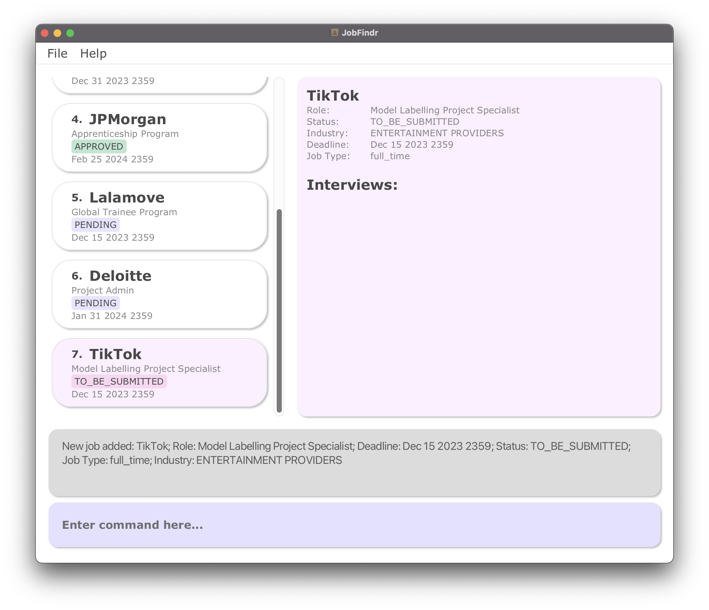
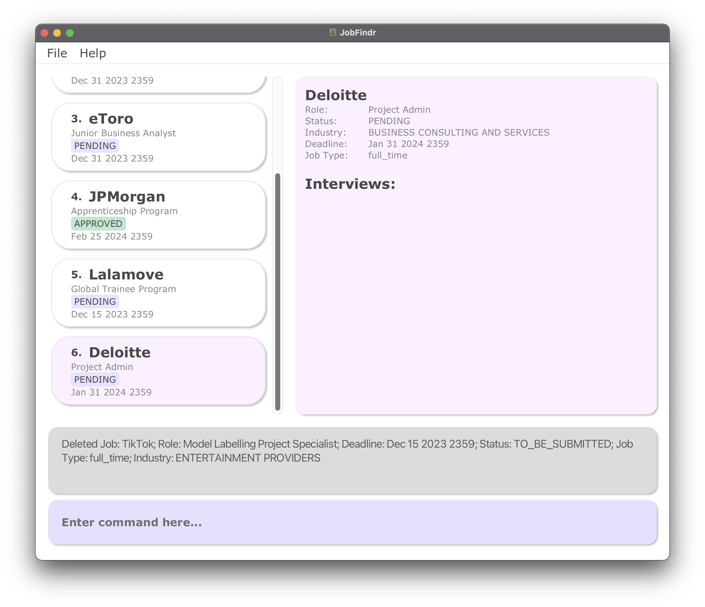
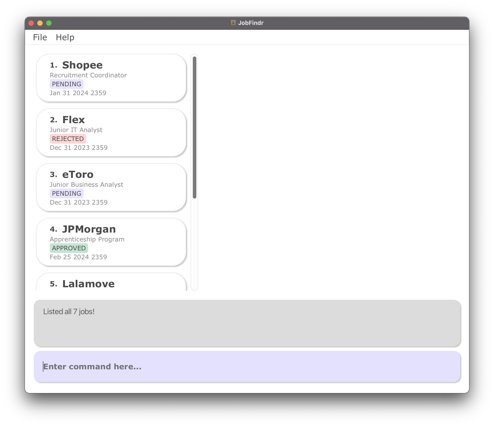

* Table of Contents
  {:toc}

--------------------------------------------------------------------------------------------------------------------

JobFindr is a **Contact Book app** for NUS fresh graduates who are looking for jobs.

It simplifies _contact management_, provides _reminders_ and enhances _organisation_, helping users _stay competitive_
in the job market.
The project simulates an ongoing software project for a desktop application (called _JobFindr_) used for managing job
applications.

--------------------------------------------------------------------------------------------------------------------

## Quick start

1. Ensure you have Java `11` or above installed in your Computer.
2. Download the latest `jobfindr.jar` from [here](https://github.com/AY2324S1-CS2103T-W12-3/tp/releases).
3. Copy the file to the folder you want to use as the _home folder_ for your AddressBook.
4. Open a command terminal, `cd` into the folder you put the jar file in, and enter the command `java -jar jobfindr.jar`
   to run the application.
5. A GUI similar to the below should appear in a few seconds. Note that the app contains some sample data.  
   

6. Type the command in the command box and press Enter to execute it. For example, typing **`help`** and pressing Enter will
   open the help window. 
   Some example commands you can try:

    * `list` : Lists all applications.

    * `add c/Microsoft r/Software Engineer d/Nov 12 2022 1200 i/Technology s/Pending` :
      Adds an application for the company named `Microsoft` to the Application Book.

    * `delete 3` : Deletes the 3rd application shown in the current list.

    * `clear` : Deletes all applications.

    * `exit` : Exits the app.

7. Refer to "[Key Information](#key-information)" below for details of each command.

--------------------------------------------------------------------------------------------------------------------

## Key Information

### User interface

### Structure of a job application

| Field    | Prefix | Remarks                                                                                                             | Optional? | Sort Order    |
|----------|--------|---------------------------------------------------------------------------------------------------------------------|-----------|---------------|
| Company  | `c/`   | No restrictions                                                                                                     | No        | Alphabetical  |
| Role     | `r/`   | Must only contain alphanumeric characters and spaces                                                                | No        | Alphabetical  |
| Status   | `s/`   | Possible values in "[Valid statuses and job types](#valid-statuses-and-job-types)"                                  | No        | Alphabetical  |
| Industry | `i/`   | Must start with an alphanumeric character                                                                           | Yes       | Alphabetical  |
| Deadline | `d/`   | Must be in the format MMM dd yyyy HHmm (e.g. Dec 31 2030 1200) and cannot be earlier than the current date and time | Yes       | Chronological |
| Type     | `t/`   | Possible values in "[Valid statuses and job types](#valid-statuses-and-job-types)"                                  |           |               |

### Valid statuses and job types

The following are valid statuses:

| Status            | Remark                                                                                  |
|-------------------|-----------------------------------------------------------------------------------------|
| `TO_BE_SUBMITTED` | An application that you plan to apply for. The default status if no status is specified |
| `PENDING`         | An application that you have applied for but have yet to receive a result               |
| `APPROVED`        | An application that you have received a job offer for                                   |
| `REJECTED`        | An application that you have been rejected for                                          |

The following are valid job types:

| Job Type     | Remark              |
|--------------|---------------------|
| `FULL_TIME`  | A full time job     |
| `PART_TIME`  | A part time job     |
| `INTERNSHIP` | An internship       |
| `TEMPORARY`  | A temporary job     |
| `CONTRACT`   | A contract job      |
| `FREELANCE`  | A freelance job     |
| `VOLUNTEER`  | A volunteered job   |

### Structure of an interview

### Command format

* If you are using a PDF version of this document, be careful when copying and pasting commands that span multiple lines
  as space characters surrounding line-breaks may be omitted when copied over to the application.

* Words in upper case are the parameters to be supplied by the user. 
    * e.g. in `add c/COMPANY`, `COMPANY` is a parameter which can be used as `add c/Google`.

* Items in square brackets are optional. 
    * e.g. `c/COMPANY [s/STATUS]` can be used as `c/Google s/Pending` or as `c/Google`.

* Parameters can be in any order. 
    * e.g. if the command specifies `c/COMPANY r/ROLE`, `r/ROLE c/COMPANY` is also acceptable.
    * When `INDEX` is required, it has to be the first parameter.

* Extraneous parameters for commands that do not take in parameters (such as `help`, `exit` and `clear`) will be
  ignored. 
    * e.g. if the command specifies `help 123`, it will be interpreted as `help`.

* The same prefix cannot be used multiple times in the same command. 
  * e.g. `add r/Cleaner c/Google c/Microsoft` is an invalid input. 

* `INDEX` refers to the index number of the chosen application in the displayed application list and must be a _positive
  integer_ 1, 2, 3, …

---

### Adding an application : `add`

Adds a job application to the list.

**Format:** `add c/COMPANY r/ROLE [d/DEADLINE] [s/STATUS] [i/INDUSTRY] [t/JOB_TYPE]`

**Examples:**

* `add c/Microsoft r/Software Engineer d/Nov 12 2022 1200 i/Technology s/Pending`
  Adds a company called Microsoft, with the role Software Engineer in the technology industry,
  deadline Nov 12 2022 1200 and status as pending.
* `add c/Google r/Cleaner`
  Adds a company called Google, with the role Cleaner and status `TO_BE_SUBMITTED`.

**UI mockup:**

---

### Editing an application : `edit`

Edits an application in the list.

**Format:** `edit INDEX [c/COMPANY] [r/ROLE] [d/DEADLINE] [s/STATUS] [i/INDUSTRY] [t/JOB_TYPE]`

* Edits the application to the company at the specified `INDEX`.
* At least one of the optional fields must be provided.

**Examples:**

* `edit 1 r/Announcer`
  Changes the role of the 1st job application to an announcer.
* `edit 5 s/approved t/volunteer`
  Changes the status and job type of the 5th job application to `APPROVED` and volunteer respectively.

---

### Deleting an application : `delete`

Deletes the specified application from the list.

**Format:** `delete INDEX`

* Deletes the application to the company at the specified `INDEX`.

**Examples:**

* `list` followed by `delete 2`
  Deletes the 2nd application in the list.

**UI mockup:**

---

### Listing all applications : `list`

Shows a list of all applications in the list in alphabetical order.

**Format:** `list`

**UI mockup:**

---

### Finding an application : `find`

Finds all applications with the specified fields containing any of the given keywords.

**Format:** `find [c/COMPANY] [r/ROLE] [d/DEADLINE] [s/STATUS] [i/INDUSTRY] [t/JOB_TYPE]`

* At least one optional field must be provided.
* An application will be listed if at least one of the keywords match. The keywords are case-insensitive.
* Applications with partially matching keywords will not be listed.
    * e.g. searching for the keyword "Goo" will not list applications with "Google".
* Searches for Deadline must be in the format `MMM DD YYYY HHMM`.

**Examples:**

* `find c/Google`
  Finds all applications with the keyword "Google" in the company name.
* `find r/Software Engineer`
  Finds all applications with the keyword "Software Engineer" in the role.

---

### Sorting the list : `sort`

Sorts the list based on the field specifier provided.

**Format:** `sort SPECIFIER`

* A single valid `SPECIFIER` must be provided.
* For optional fields, applications with empty fields will be listed first.

**Examples:**

* `sort -d`
  Lists all applications sorted by deadline.

* `sort -r`
  Lists all applications sorted by role.

---

### Asking for help: `help`

Shows a list of commands and how they can be used.

**Format:** `help`

---

### Clearing all applications: `clear`

Clears all applications from the application book.

**Format:** `clear`

---

### Exiting the programme: `exit`

Exits the program.

**Format:** `exit`

--------------------------------------------------------------------------------------------------------------------

## Command summary

| Action     | Format                                                                                   |
|------------|------------------------------------------------------------------------------------------|
| **Add**    | `add c/COMPANY r/ROLE d/DEADLINE s/STATUS i/INDUSTRY t/JOB_TYPE`                         |
| **Edit**   | `edit INDEX [c/COMPANY] [r/ROLE] [d/DEADLINE] [s/STATUS] [i/INDUSTRY] [t/JOB_TYPE]`      |
| **Delete** | `delete INDEX`                                                                           |
| **List**   | `list`                                                                                   |
| **Find**   | `find [KEYWORDS] [c/COMPANY] [r/ROLE] [d/DEADLINE] [s/STATUS] [i/INDUSTRY] [t/JOB_TYPE]` |
| **Sort**   | `sort FIELD_SPECIFIER`                                                                   |
| **Help**   | `help`                                                                                   |
| **Clear**  | `clear`                                                                                  |
| **Exit**   | `exit`                                                                                   |
