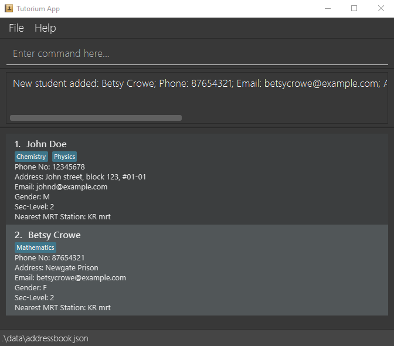
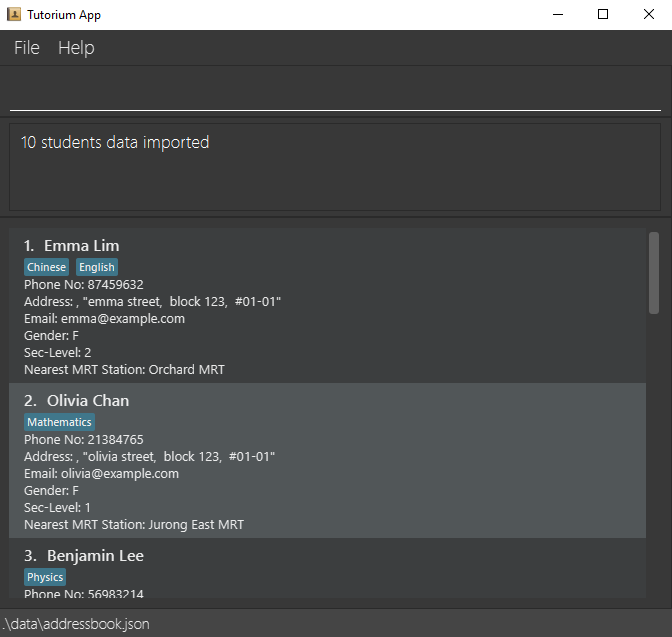
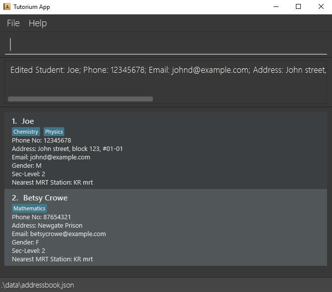
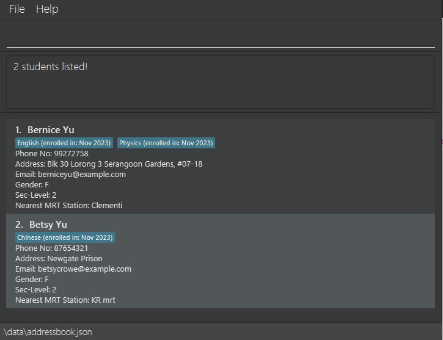
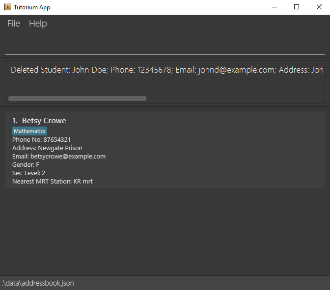
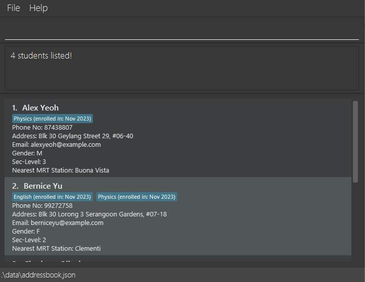

# Tutorium User Guide

Tutorium is a **desktop application for tuition centre staff** to obtain data analysis to plan marketing strategies. The user interacts with it using a CLI, and it has a GUI created with JavaFX. It is written in Java, and has about 10 kLoC.

<!-- * Table of Contents -->
<page-nav-print />

--------------------------------------------------------------------------------------------------------------------

## Quick start

1. Ensure you have Java `11` or above installed in your Computer.

1. Download the latest `tutorium.jar` from [here](https://github.com/se-edu/addressbook-level3/releases).

1. Copy the file to the folder you want to use as the _home folder_ for your Tutorium.

1. Open a command terminal, `cd` into the folder you put the jar file in, and use the `java -jar tutorium.jar` command to run the application. 
   A GUI similar to the below should appear in a few seconds. Note how the app contains some sample data. 
   

1. Type the command in the command box and press Enter to execute it. e.g. typing **`help`** and pressing Enter will open the help window. 
   Some example commands you can try:

    * `list` : Lists all contacts.

    * `add n/John Doe p/12345678 e/johnd@example.com a/John street, block 123, #01-01 g/M l/2 m/KR mrt s/English` : Adds a contact named `John Doe` to the Address Book.

    * `delete John Doe` : Deletes the contact with matching name in the current list.

    * `clear` : Deletes all contacts.

    * `exit` : Exits the app.

1. Refer to the [Features](#features) below for details of each command.

--------------------------------------------------------------------------------------------------------------------

## Features

<box type="info" seamless>

**Notes about the command format:** 

* Words in `UPPER_CASE` are the parameters to be supplied by the user. 
  e.g. in `add n/NAME`, `NAME` is a parameter which can be used as `add n/John Doe`.

* Items in square brackets are optional. 
  e.g `n/NAME [t/TAG]` can be used as `n/John Doe t/friend` or as `n/John Doe`.

* Items with `…`​ after them can be used multiple times including zero times. 
  e.g. `[t/TAG]…​` can be used as ` ` (i.e. 0 times), `t/friend`, `t/friend t/family` etc.

* Parameters can be in any order. 
  e.g. if the command specifies `n/NAME p/PHONE_NUMBER`, `p/PHONE_NUMBER n/NAME` is also acceptable.

* Extraneous parameters for commands that do not take in parameters (such as `help`, `list`, `exit` and `clear`) will be ignored. 
  e.g. if the command specifies `help 123`, it will be interpreted as `help`.

* If you are using a PDF version of this document, be careful when copying and pasting commands that span multiple lines as space characters surrounding line-breaks may be omitted when copied over to the application.
  </box>

### Viewing help : `help`

Shows a message explaning how to access the help page.

Format: `help`

### Adding a student's data: `add`

Adds a student's data to the address book.

Format: `add n/NAME p/PHONE_NUMBER e/EMAIL a/ADDRESS g/GENDER l/SEC_LEVEL m/MRT STATION [s/SUBJECT]…​`

<box type="tip" seamless>

**Tip:** A student must have at least 1 tag (subject)
</box>

Examples:
* `add n/John Doe p/12345678 e/johnd@example.com a/John street, block 123, #01-01 g/M l/2 m/KR mrt s/Chemistry s/Physics`
* `add n/Betsy Crowe p/87654321 e/betsycrowe@example.com a/Newgate Prison g/F l/2 m/KR mrt s/Mathematics`
     
  

### Importing data from .csv file: `import`

Imports students datas to the address book.
1. Move your .csv file into the folder containing Tutorium.
2. Enter the command with the following format.

Format: `import FILENAME.csv`

<box type="tip" seamless>

**Note:** The column should have "Name", "Phone", "Email", "Address", "Gender", "Sec level", "Nearest Mrt Station", "Subject"
</box>

Examples:
* `import student_data.csv`
   
  

### Editing a student's data : `edit`

Edits an existing student's data in the address book.

Format:
1. `edit INDEX prefix/[field name]` or `edit NAME prefix/[field name]` (you can either specify the student you want to edit by index or his/her name)
2. `edit INDEX prefix1/[field1] prefix2/[field2]`  or `edit NAME prefix/[field] prefix/[field] prefix/[field]` (change multiple fields)

* At least one of the optional fields must be provided.
* Existing values will be updated to the input values.

Examples:
*  `edit John Doe n/Joe` specify that you want to edit John Doe's name to "Joe".
*  `edit 2 n/joey e/joey123@example.com` Edits the student (with index 2)'s name and email to be `joey` and `joey123@example.com`.
    
   

### Searching for data : `search`

Search for people whose names contain the given keyword.

Format: `search KEYWORD`

* The search is case-insensitive. e.g `joe` will match `Joe`
* Only the name is searched.
* Partial words can be matched. e.g. `Han` will match `Hans`
* All students matching the keyword will be returned (i.e. `OR` search).
  e.g. `Alfred` will return `alfred`, `Alfred Tan`

Examples:
* `search Lee` returns `Benjamin Lee` and `Eva Lee` 
   
  

### Deleting data : `delete`

Deletes data of a specified student.

Format: `delete [NAME]` or `delete [INDEX]`

* Deletes the student with the specified `NAME` or `[INDEX]`.
* `NAME`: The deletion is case-insensitive, but it must be the full name of the student.

Examples:
* `delete John Doe`
* `delete 1`
   
  

### Filtering data : `filter`

Shows the list of students data that fulfills all given conditions.

Format: `filter prefix/FIELD_VALUE [MORE FIELDS]`

* FIELD_VALUE: Case-sensitive string.
* The student list shows only the students whose data fulfills all given conditions.
* At least one condition must be provided.

Examples:
* `filter g/F s/English s/Physics`
* `filter s/Physics` returns all students taking Physics subject  
   
  

### Clearing all entries : `clear`

Clears all entries from the address book.

Format: `clear`

### Exiting the program : `exit`

Exits the program.

Format: `exit`

### Saving the data

Tutorium data are saved in the hard disk automatically after any command that changes the data. There is no need to save manually.

### Editing the data file

Tutorium data are saved automatically as a JSON file `[JAR file location]/data/addressbook.json`. Advanced users are welcome to update data directly by editing that data file.

<box type="warning" seamless>

**Caution:**
If your changes to the data file makes its format invalid, Tutorium will discard all data and start with an empty data file at the next run.  Hence, it is recommended to take a backup of the file before editing it.
</box>

### Archiving data files `[coming in v2.0]`

_Details coming soon ..._

--------------------------------------------------------------------------------------------------------------------

## FAQ

**Q**: How do I transfer my data to another Computer? 
**A**: Install the app in the other computer and overwrite the empty data file it creates with the file that contains the data of your previous Tutorium home folder.

--------------------------------------------------------------------------------------------------------------------

## Known issues

1. **When using multiple screens**, if you move the application to a secondary screen, and later switch to using only the primary screen, the GUI will open off-screen. The remedy is to delete the `preferences.json` file created by the application before running the application again.

--------------------------------------------------------------------------------------------------------------------

## Command summary

Action     | Format, Examples
-----------|----------------------------------------------------------------------------------------------------------------------------------------------------------------------
**Add**    | `add n/NAME p/PHONE_NUMBER e/EMAIL a/ADDRESS g/GENDER l/SEC_LEVEL m/MRT STATION [s/SUBJECT]…​`   e.g., `add n/John Doe p/98765432 e/johnd@example.com a/John street, block 123, #01-01 s/Chemistry`
**Import** | `import FILENAME.csv`  e.g., `import student_data.csv`
**Edit**   | `edit INDEX prefix1/[field1] prefix2/[field2]`    or `edit NAME prefix/[field] prefix/[field] prefix/[field]`   e.g., `edit John Doe n/Joe e/johndoe@example.com t/English`
**Search** | `search [KEYWORD]`  e.g., `search Lee`
**Delete** | `delete NAME`  or `delete JOE`   e.g., `delete Joe`
**Filter** | `filter prefix/FIELD_VALUE [MORE FIELDS]`   e.g., `filter g/F s/English s/Physics`
**Clear**  | `clear`
**Help**   | `help`
