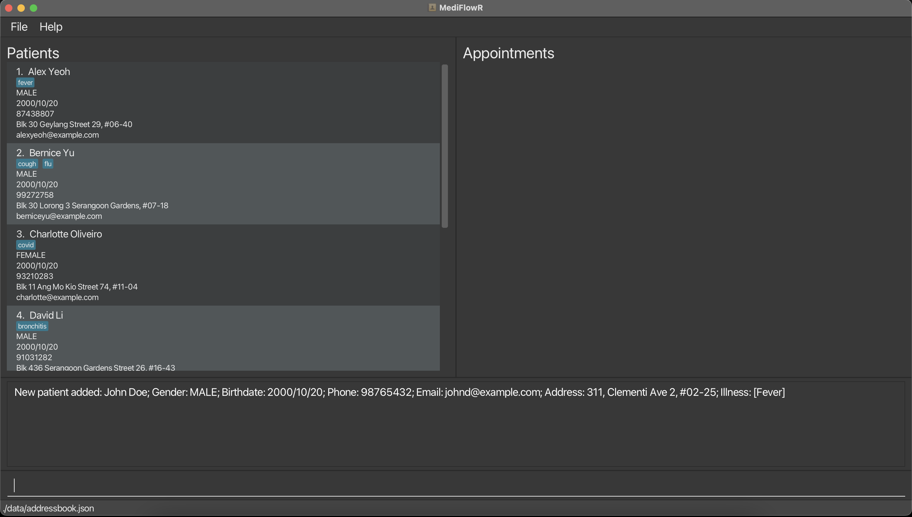
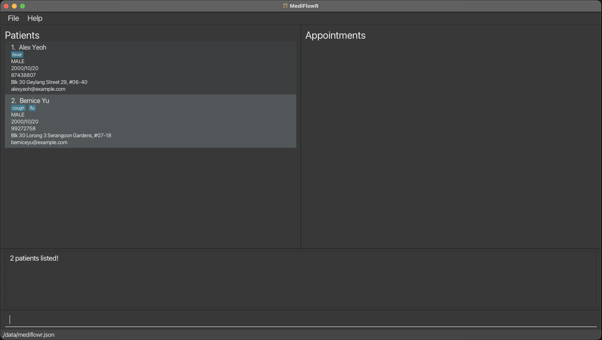
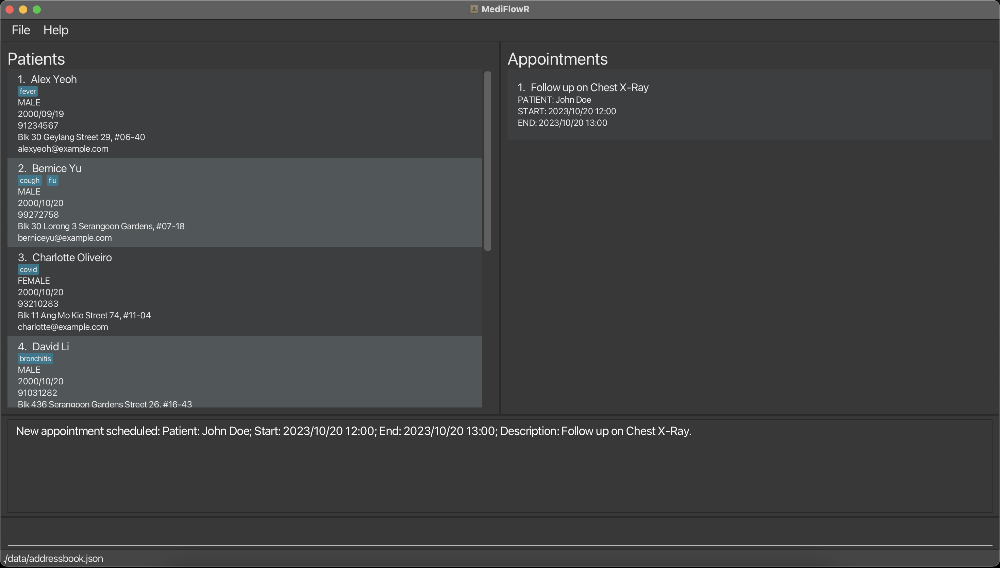
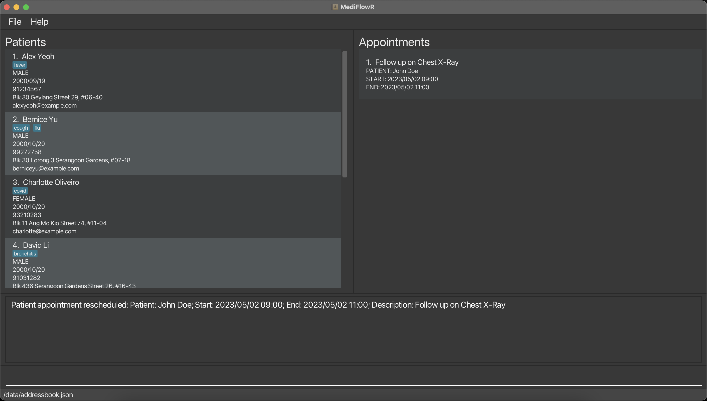
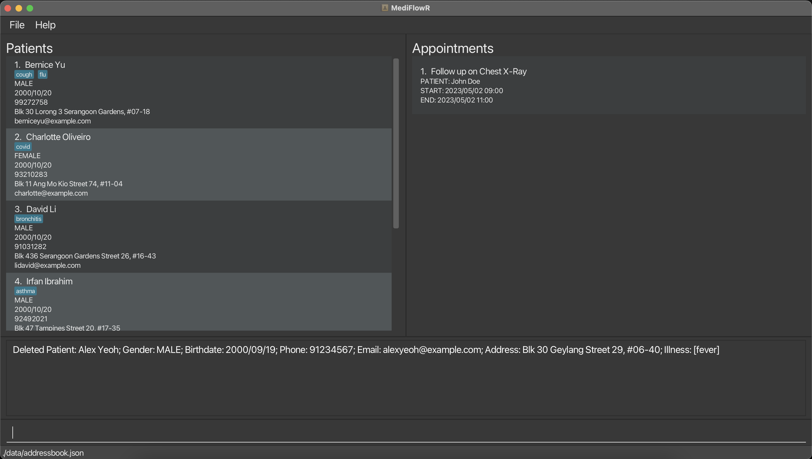
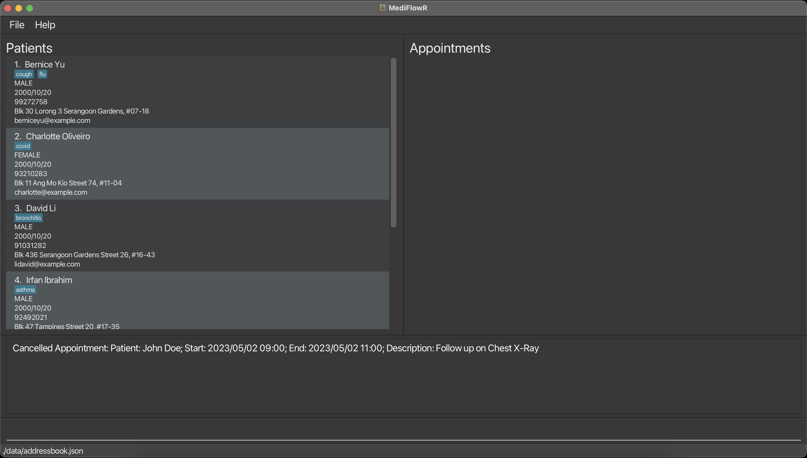

# MediFlowR

## Welcome to MediFlowR

Too many patients to handle? Mixing up your patient appointments?

Don't worry, we got you! Taking control of your patient records management has never been easier. All you need is a
desktop and **MediFlowR** will handle the rest!

### About MediFlowR:

MediFlowR is a desktop application built for medical practitioners to manage their day-to-day operations. It is a
user-friendly and efficient patient records management system designed to help you streamline your patient management
processes. In the fast-paced world of healthcare, we understand the importance of keeping patient information organised
and appointments on track. MediFlowR is your solution!

### Key Features:
To simplify your administrative tasks, our application provides a range of features, but not limited to:

1. **Patient Information Management:** Easily store, access and edit patient data, making it simple to track patient's vital information and history.
2. **Appointment Scheduling:** Efficiently manage patient appointments and eliminate the risk of scheduling conflicting appointments.
3. **Integration:** Seamlessly integrate patient records across multiple departments by allowing users to update patient information, allowing for the doctor to follow up and ensuring continuity of care.

Here at MediFlowR, we believe in keeping things simple and efficient.

_**Simple:**_
Navigating MediFlowR is a breeze. Our intuitive user interface just displays essential information allowing
you to quickly access the information you need. Moreover, this user guide together with the in-application guidance
minimises the learning curve for your administrative staff.

_**Efficient:**_
On top of these functionalities, we believe that patient management must be efficient.
Therefore, MediFlowR is optimised for use via a Command Line Interface (CLI) while still having
the benefits of a Graphical User Interface (GUI). By simply typing, MediFlowR can get your
hospital management tasks done faster than current GUI apps in the industry.

--------------------------------------------------------------------------------------------------------------------

## Table of Contents

- [Quick Start](#quick-start)

- [Tutorial for new users](#tutorial-for-new-users)

- [Glossary](#glossary)

- [Commands summary](#commands-summary)

- [Features](#features)

    - [Patient Commands](#patient-commands)

        - [Adding a new patient](#adding-a-new-patient-add)

        - [Updating a patient's details](#updating-a-patients-details-edit)
     
        - [Diagnosing a patient](#diagnosing-a-patient-diagnose)
     
        - [Undiagnosing a patient](#undiagnosing-a-patient-undiagnose)

        - [Removing a patient](#removing-a-patient-delete)

        - [Displaying all patients](#displaying-all-patients-list)

        - [Finding patients by name](#finding-patients-by-name-find)

    - [Appointment Commands](#appointment-commands)

        - [Scheduling a new appointment](#scheduling-a-new-appointment-schedule)

        - [Rescheduling an appointment](#rescheduling-an-appointment-reschedule)

        - [Cancelling an appointment](#cancelling-an-appointment-cancel)

        - [Displaying all appointments](#displaying-all-appointments-appointments)
     
        - [Displaying all appointments for today](#displaying-all-appointments-for-today-today)

    - [Miscellaneous Commands](#miscellaneous-commands)

        - [Undoing a previous command](#undoing-a-previous-command-undo)

        - [Redoing a previous command](#redoing-a-previous-command-redo)

        - [Clearing all patient records](#clearing-all-patient-records-clear)

        - [Exiting the program](#exiting-the-program-exit)

        - [Viewing help](#viewing-help-help)

- [FAQ](#faq)

- [Known Issues](#known-issues)

--------------------------------------------------------------------------------------------------------------------

## Quick start

1. Ensure you have Java `11` or above installed in your Computer.

    - To check your Java version, open Command Prompt if you are on Windows, or Terminal if you are on MacOS, and run `java --version`. If you do not have Java installed, you can install it [here](https://www.oracle.com/java/technologies/downloads/#java11).

2. Download the latest `mediflowr.jar` from [here](https://github.com/AY2324S1-CS2103T-T08-4/tp/releases).

3. Copy the file to the folder you want to use as the home folder for your patient records.

4. Double click to launch the application. If it does not work, follow the instructions listed [here](faq).

5. You should now be able to use the application.

    - If you are a **new user**, you can follow a tutorial on getting started with MediFlowR [here](#tutorial-for-new-users).

    - If you are an **advanced user**, you can learn more in depth about the different commands supported by the application [here](#features).

--------------------------------------------------------------------------------------------------------------------

## Tutorial for new users

If this is your first time using MediFlowR, do not worry as this is a tutorial for you to get familiar with the features
of MediFlowR. Please follow the instructions [here](#quick-start) first to set up the application before proceeding with the tutorial.

- Launch the MediFlowR application. If you are not able to launch the application, follow the instructions [here](#faq).
  - Note: When the application is first launched, it will contain some default patient records.

- Let us try **adding a patient** into our patient records. Enter the command `add name=John Doe gender=MALE birthdate=2000/10/20 phone=98765432 email=johnd@example.com address=311, Clementi Ave 2, #02-25 illness=Fever` in the command box.

- You should get this result screen. Try adding a few more patients into the patient records with the same format to familiarise yourself with the command.

- Let us try **editing the patient** that we have just added. Enter the command `edit 1 phone=91234567 birthdate=2000/09/19` in the command box.

- You should get this result screen. This will change the phone of the patient to `91234567` and the birthdate of the patient to `2000/09/19`.

- Let us try **finding a patient**. Enter the command `find alex bernice` in the command box.

- You should get this result screen. This will find all patients with either the name `alex` or `bernice`.

- Let us try **scheduling an appointment** now that we have a patient in our records. Enter the command `schedule patient=John Doe start=2023/10/20 12:00 end=2023/10/20 13:00 description=Follow up on Chest X-Ray` in the command box.

- You should get this result screen. This will schedule a new appointment for the patient with the name `John Doe`.

- Let us try **rescheduling the appointment** that we have just scheduled. Enter the command `reschedule 1 start=2023/05/02 09:00 end=2023/05/02 11:00` in the command box.

- You should get this result screen. This will reschedule the appointment to start on `2023/05/02 09:00` and end on `2023/05/02 11:00`.

- Let us try **deleting a patient** from our patient records. Enter the command `delete 1`.

- You should get this result screen. This will delete the first patient in the patient records.

- Let us try **cancelling an appointment** from our appointment list. Enter the command `cancel 1`.

- You should get this result screen. This will cancel the first appointment in the appointment list.

- **Congratulations!** You have completed the tutorial. You are now ready to use MediFlowR.
You can learn more about the different commands [here](#features).

--------------------------------------------------------------------------------------------------------------------

## Glossary

**:information_source: Notes about the command format:** 

* Words in `CAPITAL_LETTERS` are the parameters to be supplied by the user. 
e.g. in `find NAME`, `NAME` is a parameter which can be used as `find David`.

* Words between square brackets `[]` are the optional parameters that are not necessary for the command to run. 
e.g. in `add name=NAME gender=GENDER birthdate=BIRTHDATE phone=PHONE email=EMAIL address=ADDRESS [illness=ILLNESS]`,
`[ilness=ILLNESS]` means that it does not have to be specified.

* Parameters can be in any order. 
  e.g. if the command specifies `name=[name] birthdate=[birthdate]`, `birthdate=[birthdate] name=[name]` is also acceptable.

* Extraneous parameters for commands that do not take in parameters (such as `help`, `list`, `exit` and `clear`) will be ignored. 
  e.g. if the command specifies `help 123`, it will be interpreted as `help`.

* Do not include any additional arguments for `undo` and `redo` commands as it will result in an error.

* If you are using a PDF version of this document, be careful when copying and pasting commands that span multiple lines as space characters surrounding line-breaks may be omitted when copied over to the application.

--------------------------------------------------------------------------------------------------------------------

## Commands summary

| Action                                                                                  | Format, Examples                                                                                                                                                                                                                                                     |
|-----------------------------------------------------------------------------------------|----------------------------------------------------------------------------------------------------------------------------------------------------------------------------------------------------------------------------------------------------------------------|
| [**Adding a new patient**](#adding-a-new-patient-add)                                   | `add name=NAME gender=GENDER birthdate=BIRTHDATE phone=PHONE email=EMAIL address=ADDRESS [illness=ILLNESS]`   e.g., `add name=John Doe gender=MALE birthdate=2000/10/20 phone=98765432 email=johnd@example.com address=311, Clementi Ave 2, #02-25 illness=fever` |
| [**Updating a patient's details**](#updating-a-patients-details-edit)                   | `edit INDEX [name=NAME] [gender=GENDER] [birthdate=BIRTHDATE] [phone=PHONE] [email=EMAIL] [address=ADDRESS]`   e.g., `edit 1 birthdate=2001/12/14 phone=93842738`                                                                                                 |
| [**Diagnosing a patient**](#diagnosing-a-patient-diagnose)                              | `diagnose INDEX illness=ILLNESS`  e.g., `diagnose 1 illness=fever`                                                                                                                                                                                                |
| [**Undiagnosing a patient**](#undiagnosing-a-patient-undiagnose)                        | `undiagnose INDEX illness=ILLNESS`  e.g., `undiagnose 1 illness=fever`                                                                                                                                                                                            |
| [**Removing a patient**](#removing-a-patient-delete)                                    | `delete INDEX`   e.g., `delete 1`                                                                                                                                                                                                                                 |
| [**Displaying all patients**](#displaying-all-patients-list)                            | `list`                                                                                                                                                                                                                                                               |
| [**Finding patients by name**](#finding-patients-by-name-find)                          | `find NAME`  e.g., `search name=James Jake`                                                                                                                                                                                                                       |
| [**Scheduling a new appointment**](#scheduling-a-new-appointment-schedule)              | `schedule patient=PATIENT start=START end=END description=DESCRIPTION`   e.g., `schedule patient=Alex Yeoh start=2023/10/20 12:00 end=2023/10/20 13:00 description=Follow up on Chest X-Ray`                                                                      |
| [**Rescheduling an appointment**](#rescheduling-an-appointment-reschedule)              | `reschedule INDEX start=START end=END`  e.g., `reschedule 1 start=2023/05/02 09:00 end=2023/05/02 11:00`                                                                                                                                                          |
| [**Cancelling an appointment**](#cancelling-an-appointment-cancel)                      | `cancel INDEX`  e.g., `cancel 3`                                                                                                                                                                                                                                  |
| [**Displaying all appointments**](#displaying-all-appointments-appointments)            | `appointments`                                                                                                                                                                                                                                                       |
| [**Displaying all appointments for today**](#displaying-all-appointments-for-today-today) | `today`                                                                                                                                                                                                                                                              |
| [**Undoing a previous command**](#undoing-a-previous-command-undo)                      | `undo`                                                                                                                                                                                                                                                               |
| [**Redoing a previous command**](#redoing-a-previous-command-redo)                      | `redo`                                                                                                                                                                                                                                                               |
| [**Clearing all patient records**](#clearing-all-patient-records-clear)                 | `clear`                                                                                                                                                                                                                                                              |
| [**Exiting the program**](#exiting-the-program-exit)                                    | `exit`                                                                                                                                                                                                                                                               |
| [**Viewing help**](#viewing-help-help)                                                  | `help`                                                                                                                                                                                                                                                               |

--------------------------------------------------------------------------------------------------------------------

## Features

MediFlowR provides a variety of commands for you to effectively manage your patient records and appointments. This section
will clearly guide you on how to use the commands so that you can streamline your workflow and take full advantage of the
features present in this application.

## Patient commands

### Adding a new patient: `add`

This command creates a new patient to be added to the patient records, along with the necessary personal information
and contact details about the patient.

Format: `add name=NAME gender=GENDER birthdate=BIRTHDATE phone=PHONE email=EMAIL address=ADDRESS [illness=ILLNESS]`

Example: `add name=John Doe gender=MALE birthdate=2000/10/20 phone=98765432 email=johnd@example.com address=311, Clementi Ave 2, #02-25 illness=fever`

The example command will add a *male* patient called *John Doe*, with birthdate on *20 October 2000*, phone number at *98765432*,
email at *johnd@example.com* and address at *311, Clementi Ave 2, #02-25*, who is currently down with *fever*.

**Notes:**

- A patient's name can only consist of letters and numbers.

- A patient's gender can only be `MALE` or `FEMALE`.

- A patient's birthdate must be in the format `yyyy/MM/dd`, e.g. `2001/04/28` for a birthdate on 28 April 2001.

- A patient's phone must be a valid phone number, i.e. 8 numbers.

- A patient's email must be a valid email address, i.e. of the form `name@domain.com`.

- A patient's illness is optional, i.e. you do not have to enter the illness when adding a patient.

- You can enter more than one illness for a patient, e.g. `illness=fever flu` will add both fever and flu as a patient's illnesses.

### Updating a patient's details: `edit`

This command updates a patient's personal information and contact details. It will update the details of the patient at
the specified `INDEX` shown in the patients records. You must edit *at least one* detail when using the command.

Format: `edit INDEX [name=NAME] [gender=GENDER] [birthdate=BIRTHDATE] [phone=PHONE] [email=EMAIL] [address=ADDRESS]`

Example: `edit 1 birthdate=2001/12/14 phone=93842738`

This example command will update the patient with index 1 in the patient records (i.e. the first patient) and will change
the patient's birthdate to *2001/12/14* and phone number to *93842738*.

**Notes:**

- You must follow the same format as the [add patient command](#adding-a-new-patient-add) for the various details of the patient.

- The index provided must be a *positive integer* and a *valid index*, i.e. within the size of the patient records.

- You must edit *at least one* detail when using the command.

### Diagnosing a patient: `diagnose`

This command adds (an) illness(es) to a patient's current illnesses. It will update the details of the patient at
the specified `INDEX` shown in the patients records.

Format: `diagnose INDEX illness=ILLNESS`

Example: `diagnore 1 illness=fever`

This example command will update the patient with index 1 in the patient records (i.e. the first patient) and will add
*fever* to the patient's illnesses.

**Notes:**

- You can enter more than one illness for a patient, e.g. `illness=fever flu` will add both fever and flu as a patient's illnesses.

### Undiagnosing a patient: `undiagnose`

This command removes (an) illness(es) to a patient's current illnesses. It will update the details of the patient at
the specified `INDEX` shown in the patients records.

Format: `undiagnose INDEX illness=ILLNESS`

Example: `undiagnore 1 illness=fever`

This example command will update the patient with index 1 in the patient records (i.e. the first patient) and will remove
*fever* from the patient's illnesses.

**Notes:**

- You can enter more than one illness for a patient, e.g. `illness=fever flu` will remove both fever and flu from a patient's illnesses.

### Removing a patient: `delete`

This commands removes the specified patient from the patient list. It will remove the patient at
the specified `INDEX` shown in the patients records.

Format: `delete INDEX`

Example: `delete 1`

This example command will remove the patient with index 1 in the patient records (i.e. the first patient).

**Notes:**

- The index provided must be a *positive integer* and a *valid index*, i.e. within the size of the patient records.

:exclamation: **Caution:**
If you delete a patient, all appointments for that patient will also be deleted.

### Displaying all patients: `list`

This command shows a list of all patients currently recorded in the MediFlowR application under the patients section.

Format: `list`

### Finding patients by name: `find`

This command finds patients whose names contain any of the keywords that you specified.

Format: `find NAME`

Example: `find name=alex david`

This example command will find all patients with names that contain either `alex` or `david`, e.g. `Alex Yeoh` and `David Li`.

**Notes:**

- The search is *case-insensitive*, meaning that finding patients with the keyword `John`
will return the same results as the keyword `john`.

- Only patients with names matching the *full words* of the keywords will be displayed, meaning that `Tom` will find patients
with names that contain the full `Tom` but will not find patients
with names such as `Tommy`.

## Appointment Commands

### Scheduling a new appointment: `schedule`

This command schedules an appointment for an existing patient in the patient records. It will schedule an appointment
for the patient with the name `PATIENT`.

Format: `schedule patient=PATIENT start=START end=END description=DESCRIPTION`

Example: `schedule patient=Alex Yeoh start=2023/10/20 12:00 end=2023/10/20 13:00 description=Follow up on Chest X-Ray`

This example command will schedule a new appointment for the patient *Alex Yeoh* on *20 October 2023* from *12pm* to *1pm*
for his *follow-up appointment on his chest X-Ray*.

**Notes:**

- The patient provided for an appointment must be the *full name* of a patient that is already in the patient records.

- An appointment start and end must be in the format `yyyy/MM/dd HH:mm`, e.g. `2023/04/28 19:00` for 28 April 2023, at 7pm.

- An appointment start date time should occur before end date time of the same appointment.

- An appointment description can only consist of letters and numbers.

### Rescheduling an appointment: `reschedule`

This command reschedules an existing appointment to another timeslot. It will reschedule the appointment at the specified
`INDEX` shown in the appointments list.

Format: `reschedule INDEX start=START end=END`

Example: `reschedule 1 start=2023/05/02 09:00 end=2023/05/02 11:00`

This example command will reschedule the appointment with index 1 in the appointments list (i.e. the first appointment) to
*2 May 2023*, from *9am* to *11am*.

**Notes:**

- You must follow the same format as the [schedule appointment command](#scheduling-a-new-appointment-schedule) for the various details of the appointment.

- The index provided must be a *positive integer* and a *valid index*, i.e. within the size of the appointments list.

- You must edit *at least one* detail when using the command.

### Cancelling an appointment: `cancel`

This command cancels an existing appointment. It will cancel the appointment at the specified
`INDEX` shown in the appointments list.

Format: `cancel INDEX`

Example: `cancel 3`

This example command will cancel the appointment with index 1 in the appointments list (i.e. the first appointment).

**Notes:**

- The index provided must be a *positive integer* and a *valid index*, i.e. within the size of the appointments list.

### Displaying all appointments: `appointments`

This command shows a list of all appointments currently scheduled.

Format: `appointments`

### Displaying all appointments for today: `today`

This command shows a list of all appointments currently scheduled to start today, i.e. the current date you are using
the command on.

Format: `today`

## Miscellaneous commands

### Undoing a previous command: `undo`

This command undoes a previous command.

Format: `undo`

**Notes:**

- Including additional arguments will result in an error.

### Redoing a previous command: `redo`

This command redoes a previous command that you undid.

Format: `redo`

**Notes:**

- Including additional arguments will result in an error.

### Clearing all patient records: `clear`

This command clears all patient records and appointments from the application.

Format: `clear`

### Exiting the program: `exit`

This command exits the program.

Format: `exit`

### Viewing help: `help`

Shows a message explaining how to access the help page.

Format: `help`

--------------------------------------------------------------------------------------------------------------------

## FAQ

**Q**: How do I launch the MediFlowR application? 
**A**: The easiest way is to double-click the `mediflowr.jar` file and the application should launch. If that does not work,
follow the steps here:
1. Open Command Prompt if you are on Windows, or open Terminal if you are on MacOS.
2. Navigate to the directory that contains the `mediflowr.jar` file using the `cd` command. For example, if the file is
located at `C:\Users\YourUserName\Downloads` on Windows or `~/Downloads` on MacOS, you can enter the command `cd C:\Users\YourUserName\Downloads`
or `cd ~/Downloads` to navigate to that directory.
3. Open the `mediflowr.jar` file using the command `java -jar mediflowr.jar`. The application should launch afterwards.

**Q**: How do I transfer my data to another Computer? 
**A**: You can install MediFlowR on that other computer, then simply transfer over the `mediflowr.json` file located in the
data folder to the data folder on that other computer. The data folder is located at the same place as your MediFlowR application.

**Q**: How do I save my data after any changes I have made? 
**A**: The data is saved automatically after any command that changes the data. There is no need to save manually.

**Q** Can I edit the data file used by the application directly? 
**A**: MediFlowR data are saved automatically as a JSON file `[JAR file location]/data/mediflowr.json`. Advanced users are welcome to update data directly by editing that data file.

:exclamation: **Caution:**
If your changes to the data file makes its format invalid, AddressBook will discard all data and start with an empty data file at the next run. Hence, it is recommended to take a backup of the file before editing it.

--------------------------------------------------------------------------------------------------------------------

## Known issues

1. **When using multiple screens**, if you move the application to a secondary screen, and later switch to using only the primary screen, the GUI will open off-screen. The remedy is to delete the `preferences.json` file created by the application before running the application again.
